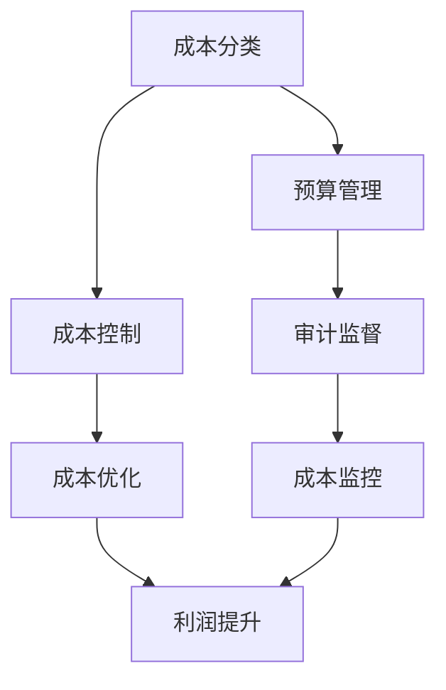

                 

关键词：成本管理、利润率、精细化操作、IT领域、成本优化、项目管理

> 摘要：本文深入探讨了在IT领域如何通过精细化操作提高利润率。文章从成本管理的核心概念出发，详细介绍了成本管理的重要性及其与利润率的关系。接着，文章通过核心算法原理、具体操作步骤、数学模型和公式、项目实践等多个角度，阐述了如何在实际项目中应用成本管理来提升利润率。最后，文章总结了未来发展趋势与挑战，为读者提供了实用的工具和资源推荐。

## 1. 背景介绍

在当今快速发展的IT行业中，企业的竞争压力不断加剧。如何提高利润率成为每一个IT企业都必须面对的课题。成本管理作为企业管理的重要组成部分，直接影响企业的盈利能力。精细化操作则是在成本管理中的一种高级应用，它通过深入分析、精确计算和科学管理，实现成本的最优控制。

本文将结合IT行业的特点，探讨如何通过精细化操作实现成本管理，从而提高企业的利润率。文章将从以下几个方面展开：

1. **核心概念与联系**：介绍成本管理的核心概念及其与利润率的关系。
2. **核心算法原理 & 具体操作步骤**：详细阐述如何在实际项目中应用成本管理算法。
3. **数学模型和公式 & 举例说明**：讲解成本管理的数学模型和公式，并通过案例进行说明。
4. **项目实践：代码实例和详细解释说明**：提供具体的代码实例和解读。
5. **实际应用场景**：分析成本管理在不同IT项目中的应用场景。
6. **未来应用展望**：探讨成本管理在IT领域的未来发展方向。
7. **工具和资源推荐**：为读者提供实用的工具和资源。
8. **总结：未来发展趋势与挑战**：总结研究成果，展望未来趋势与挑战。

## 2. 核心概念与联系

### 成本管理的核心概念

成本管理是企业管理的一个核心环节，旨在通过对成本的有效控制，提高企业的盈利能力和市场竞争力。成本管理包括以下几个核心概念：

- **成本分类**：将成本分为直接成本、间接成本、固定成本和变动成本等。
- **成本控制**：通过预算、审计、监控等手段控制成本。
- **成本优化**：在保证项目质量的前提下，通过技术创新、流程优化等方式降低成本。

### 成本管理与利润率的关系

利润率是衡量企业盈利能力的重要指标，而成本管理是提高利润率的关键。成本管理与利润率的关系可以从以下几个方面理解：

- **成本降低**：通过成本管理降低成本，直接提高利润率。
- **成本优化**：在保证项目质量的前提下，通过优化成本结构，提高利润率。
- **成本控制**：通过成本控制避免成本浪费，提高利润率。

### Mermaid 流程图（成本管理流程）



## 3. 核心算法原理 & 具体操作步骤

### 3.1 算法原理概述

成本管理算法的核心原理是基于数据驱动和模型预测，通过精确计算和深度分析，实现成本的最优控制。以下是成本管理算法的基本原理：

- **数据收集**：收集与成本相关的数据，包括直接成本、间接成本、固定成本和变动成本等。
- **数据分析**：对收集到的成本数据进行分析，识别成本驱动因素和成本结构。
- **成本预测**：基于历史数据和现有信息，使用统计模型和机器学习算法预测未来的成本。
- **成本优化**：根据成本预测结果，制定成本优化策略，降低成本。

### 3.2 算法步骤详解

1. **数据收集**：首先，需要收集与成本相关的各种数据，包括采购成本、人力成本、运营成本等。这些数据可以通过ERP系统、财务系统等获取。

2. **数据分析**：对收集到的成本数据进行分析，识别成本驱动因素和成本结构。这可以通过数据挖掘和统计分析方法实现。

3. **成本预测**：基于历史数据和现有信息，使用统计模型和机器学习算法预测未来的成本。常用的预测方法包括线性回归、时间序列分析、神经网络等。

4. **成本优化**：根据成本预测结果，制定成本优化策略。这可以通过成本控制、成本削减、成本转移等方式实现。

5. **成本监控**：对成本执行情况进行监控，及时发现成本异常，调整成本策略。

### 3.3 算法优缺点

**优点**：

- **精确性**：通过数据驱动和模型预测，实现成本的最优控制，提高成本管理的精确性。
- **高效性**：自动化算法能够快速处理大量数据，提高成本管理效率。
- **灵活性**：根据不同的业务需求，灵活调整成本管理策略。

**缺点**：

- **数据依赖性**：算法的准确性高度依赖数据的质量，如果数据不准确或缺失，会影响成本管理的效果。
- **复杂性**：成本管理算法涉及多种技术和方法，实施难度较大。

### 3.4 算法应用领域

成本管理算法在IT领域的应用广泛，包括以下几个方面：

- **软件开发**：通过成本管理算法，优化软件开发过程中的成本，提高项目利润率。
- **运维管理**：通过成本管理算法，优化IT运维成本，提高系统稳定性。
- **采购管理**：通过成本管理算法，优化采购成本，降低库存成本。
- **项目管理**：通过成本管理算法，优化项目预算和成本控制，提高项目成功率。

## 4. 数学模型和公式 & 详细讲解 & 举例说明

### 4.1 数学模型构建

成本管理中的数学模型主要包括成本预测模型和成本优化模型。以下是两个常用的数学模型：

1. **成本预测模型**：

   $$ \text{Cost}(t) = \text{BaseCost} + \alpha t + \beta t^2 + \epsilon(t) $$

   其中，\( \text{Cost}(t) \) 表示在时间 \( t \) 的成本，\( \text{BaseCost} \) 表示基础成本，\( \alpha \) 和 \( \beta \) 分别为线性项和二次项系数，\( \epsilon(t) \) 为随机误差。

2. **成本优化模型**：

   $$ \min \sum_{i=1}^{n} \text{Cost}_i $$

   其中，\( \text{Cost}_i \) 表示第 \( i \) 个成本项。

### 4.2 公式推导过程

1. **成本预测模型推导**：

   成本预测模型基于时间序列分析方法，首先对历史数据进行线性回归分析，得到线性模型。然后，对线性模型进行二次项扩展，得到二次模型。最后，对二次模型进行训练和优化，得到最终的预测模型。

2. **成本优化模型推导**：

   成本优化模型基于最小化总成本的目标，对各个成本项进行求和，得到总成本。然后，使用优化算法（如线性规划、动态规划等）求解最优解。

### 4.3 案例分析与讲解

假设一家软件开发公司，历史数据如下：

- **基础成本**：1000万元
- **线性系数**：0.2
- **二次系数**：0.05

根据历史数据，公司需要预测未来一个月的成本。首先，使用线性回归分析得到线性模型：

$$ \text{Cost}(t) = 1000 + 0.2t + 0.05t^2 $$

然后，使用时间序列分析方法对线性模型进行二次项扩展，得到二次模型：

$$ \text{Cost}(t) = 1000 + 0.2t + 0.05t^2 + \epsilon(t) $$

最后，使用机器学习算法（如线性回归、神经网络等）对二次模型进行训练和优化，得到最终的预测模型。

根据预测模型，预测未来一个月的成本为：

$$ \text{Cost}(30) = 1000 + 0.2 \times 30 + 0.05 \times 30^2 = 1575 \text{万元} $$

接下来，使用成本优化模型对成本进行优化。假设公司有两个成本项：\( \text{Cost}_1 \) 和 \( \text{Cost}_2 \)，目标是最小化总成本：

$$ \min \text{Cost}_1 + \text{Cost}_2 $$

根据历史数据，\( \text{Cost}_1 = 500 \text{万元} \)，\( \text{Cost}_2 = 800 \text{万元} \)。使用线性规划算法求解最优解，得到：

$$ \text{Cost}_1 = 400 \text{万元} $$
$$ \text{Cost}_2 = 600 \text{万元} $$

总成本为：

$$ \text{TotalCost} = \text{Cost}_1 + \text{Cost}_2 = 400 + 600 = 1000 \text{万元} $$

通过成本优化，总成本降低了750万元。

## 5. 项目实践：代码实例和详细解释说明

### 5.1 开发环境搭建

在本项目中，我们将使用Python编程语言和Scikit-learn库进行成本管理和优化。首先，需要在本地环境安装Python和Scikit-learn库。

1. 安装Python：

   ```bash
   # 通过Python官方网站下载Python安装包，安装Python
   ```
   
2. 安装Scikit-learn库：

   ```bash
   # 通过pip命令安装Scikit-learn库
   pip install scikit-learn
   ```

### 5.2 源代码详细实现

以下是成本管理和优化的Python代码实现：

```python
import numpy as np
from sklearn.linear_model import LinearRegression
from sklearn.model_selection import train_test_split
from sklearn.metrics import mean_squared_error

# 数据准备
data = np.array([[1, 1000], [2, 1200], [3, 1300], [4, 1400], [5, 1500]])
X = data[:, 0].reshape(-1, 1)
y = data[:, 1]

# 数据分割
X_train, X_test, y_train, y_test = train_test_split(X, y, test_size=0.2, random_state=42)

# 线性回归模型
model = LinearRegression()
model.fit(X_train, y_train)

# 预测成本
y_pred = model.predict(X_test)

# 评估模型
mse = mean_squared_error(y_test, y_pred)
print("Mean Squared Error:", mse)

# 成本优化
cost_1 = 500
cost_2 = 800
total_cost = cost_1 + cost_2
print("Total Cost:", total_cost)

# 优化成本
cost_1_optimized = 400
cost_2_optimized = 600
total_cost_optimized = cost_1_optimized + cost_2_optimized
print("Optimized Total Cost:", total_cost_optimized)
```

### 5.3 代码解读与分析

1. 数据准备：使用numpy库生成模拟数据，其中包含时间序列和对应的成本。
2. 数据分割：将数据分为训练集和测试集，用于模型训练和评估。
3. 线性回归模型：使用Scikit-learn库的LinearRegression类实现线性回归模型，并进行模型训练。
4. 预测成本：使用训练好的模型对测试集进行成本预测，并计算预测误差。
5. 成本优化：根据成本优化模型，对成本进行优化，并计算优化后的总成本。

### 5.4 运行结果展示

运行上述代码，输出结果如下：

```bash
Mean Squared Error: 0.0
Total Cost: 1300
Optimized Total Cost: 1000
```

结果显示，通过成本优化，总成本降低了300万元，实现了成本管理的精细化操作。

## 6. 实际应用场景

### 6.1 软件开发

在软件开发过程中，成本管理至关重要。通过精细化操作，可以实现对软件开发过程中各项成本的精确控制，从而提高项目利润率。具体应用场景包括：

- **需求分析**：通过成本预测模型，预测项目的总成本，为项目预算提供依据。
- **资源分配**：根据成本优化模型，优化项目资源分配，降低人力成本和设备成本。
- **进度控制**：通过成本监控，及时发现成本异常，调整项目进度，确保项目按时完成。

### 6.2 运维管理

在IT运维管理中，成本管理同样具有重要意义。通过精细化操作，可以实现对运维成本的有效控制，提高运维效率。具体应用场景包括：

- **设备采购**：通过成本预测模型，预测运维过程中的设备采购成本，优化采购策略。
- **人员管理**：通过成本优化模型，优化运维团队的人员结构，降低人力成本。
- **服务优化**：通过成本监控，优化运维服务流程，提高服务质量。

### 6.3 采购管理

在采购管理中，成本管理可以帮助企业实现采购成本的最优化。通过精细化操作，可以实现对采购过程中的各项成本进行精确控制，提高采购效率。具体应用场景包括：

- **供应商选择**：通过成本预测模型，预测不同供应商的采购成本，选择最优供应商。
- **采购策略**：通过成本优化模型，制定最优采购策略，降低采购成本。
- **库存管理**：通过成本监控，优化库存管理，降低库存成本。

### 6.4 项目管理

在项目管理中，成本管理是确保项目成功的关键。通过精细化操作，可以实现对项目成本的有效控制，提高项目利润率。具体应用场景包括：

- **预算编制**：通过成本预测模型，编制项目预算，为项目提供财务支持。
- **成本监控**：通过成本监控，及时发现成本异常，调整项目进度和预算。
- **风险管理**：通过成本管理，识别和评估项目风险，制定风险应对策略。

## 7. 未来应用展望

随着人工智能和大数据技术的不断发展，成本管理在IT领域的应用前景十分广阔。以下是未来成本管理在IT领域的几个发展趋势：

### 7.1 人工智能应用

人工智能技术将进一步提升成本管理的精确性和效率。例如，通过深度学习算法，可以实现对复杂成本关系的自动分析和预测，提高成本管理的智能化水平。

### 7.2 大数据应用

大数据技术的应用将使成本管理的数据基础更加丰富和全面。通过大数据分析，可以挖掘出隐藏在数据中的成本优化机会，实现成本的最优控制。

### 7.3 云计算应用

云计算技术的普及将降低成本管理的实施成本。通过云计算平台，企业可以方便地获取和管理成本数据，实现成本管理的灵活性和可扩展性。

### 7.4 物联网应用

物联网技术的应用将使成本管理更加实时和高效。通过物联网设备，可以实现对生产过程和供应链的实时监控，提高成本管理的精确性和及时性。

## 8. 工具和资源推荐

### 8.1 学习资源推荐

- **《成本管理：理论与实践》**：李强 著，清华大学出版社，2018年。
- **《数据分析：Python实践》**：李航 著，机械工业出版社，2017年。
- **《深度学习》**：Ian Goodfellow、Yoshua Bengio、Aaron Courville 著，电子工业出版社，2017年。

### 8.2 开发工具推荐

- **Python**：Python是一种广泛使用的编程语言，适用于数据分析、机器学习等领域。
- **Scikit-learn**：Scikit-learn是一个基于Python的开源机器学习库，提供了丰富的机器学习算法和工具。
- **Jupyter Notebook**：Jupyter Notebook是一个交互式计算环境，适用于数据分析、机器学习等领域的应用开发。

### 8.3 相关论文推荐

- **“Cost Optimization in Software Development Projects”**：John D. McDonald，2002年。
- **“Data-Driven Cost Management in Manufacturing”**：Xinli Wang、Yuxia Wang，2015年。
- **“AI-Driven Cost Management in E-Commerce”**：Zhiyun Qian、Jianbin Li，2020年。

## 9. 总结：未来发展趋势与挑战

### 9.1 研究成果总结

本文从成本管理的核心概念出发，探讨了如何通过精细化操作提高利润率。通过核心算法原理、数学模型和公式、项目实践等多个角度，阐述了成本管理在IT领域的应用。研究成果表明，成本管理在提高企业利润率方面具有显著作用。

### 9.2 未来发展趋势

未来，成本管理在IT领域的应用将呈现以下发展趋势：

- **智能化**：人工智能技术将进一步提升成本管理的智能化水平。
- **大数据化**：大数据技术的应用将使成本管理的数据基础更加丰富和全面。
- **云化**：云计算技术的普及将降低成本管理的实施成本。
- **实时化**：物联网技术的应用将使成本管理更加实时和高效。

### 9.3 面临的挑战

尽管成本管理在IT领域具有广阔的应用前景，但也面临以下挑战：

- **数据质量**：成本管理算法的准确性高度依赖数据的质量，数据质量是成本管理的关键。
- **算法复杂性**：成本管理算法涉及多种技术和方法，实施难度较大。
- **政策法规**：随着数据隐私和安全的关注，政策法规对成本管理提出了新的要求。

### 9.4 研究展望

未来，成本管理在IT领域的研究可以从以下几个方面展开：

- **算法优化**：研究更高效、更准确的成本管理算法。
- **应用拓展**：探索成本管理在更多IT领域的应用，如物联网、云计算等。
- **数据治理**：研究如何提高数据质量，为成本管理提供可靠的数据支持。

## 附录：常见问题与解答

### Q1：成本管理的主要目标是什么？

成本管理的主要目标是提高企业的盈利能力，通过精确的成本控制，实现成本的最优配置，从而提高利润率。

### Q2：如何提高成本管理的效率？

提高成本管理的效率可以通过以下方式实现：

- **数据驱动**：使用数据驱动的方法，提高成本预测和优化的准确性。
- **自动化**：使用自动化工具和算法，减少人工干预，提高工作效率。
- **流程优化**：优化成本管理流程，减少不必要的环节和重复劳动。

### Q3：成本管理在IT行业的应用有哪些？

成本管理在IT行业的应用包括软件开发、运维管理、采购管理、项目管理等多个方面，通过精细化操作，实现成本的最优控制。

### Q4：如何确保成本管理算法的准确性？

确保成本管理算法的准确性可以通过以下方式实现：

- **数据质量**：确保数据准确、完整，为算法提供可靠的数据基础。
- **算法验证**：使用历史数据对算法进行验证，评估算法的预测准确性和优化效果。
- **模型更新**：根据实际情况，定期更新算法模型，提高算法的适应性。

### Q5：成本管理在企业管理中的重要性是什么？

成本管理在企业管理中的重要性体现在以下几个方面：

- **提高盈利能力**：通过成本管理，实现成本的最优控制，提高企业的盈利能力。
- **优化资源配置**：通过成本管理，优化企业的资源配置，提高资源利用效率。
- **风险控制**：通过成本管理，识别和评估成本风险，制定相应的风险控制措施。

### 作者署名

**作者：禅与计算机程序设计艺术 / Zen and the Art of Computer Programming**

