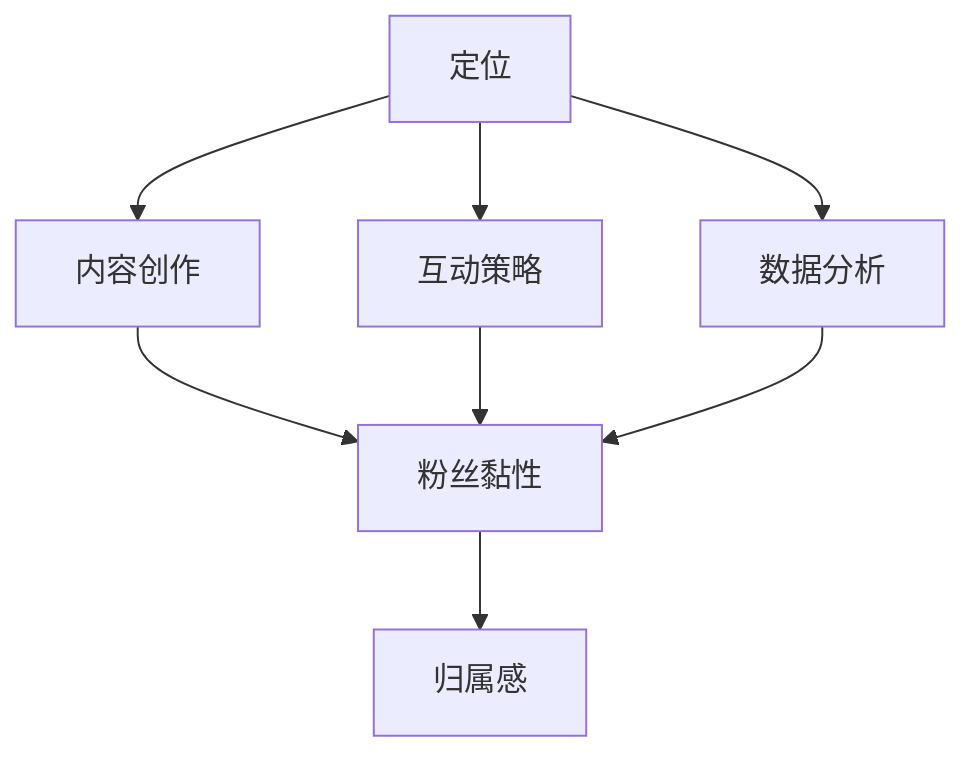

                 

关键词：个人品牌、粉丝黏性、归属感、社交媒体、内容创作、互动策略、品牌价值、粉丝参与、数据分析

> 摘要：在数字化时代，个人品牌建设已成为成功人士的重要途径。如何通过打造个人品牌周边，提升粉丝黏性和归属感，是每个内容创作者都需要关注的问题。本文将探讨个人品牌建设的策略，结合案例，解析如何通过互动、内容创作和数据分析等手段，有效提升个人品牌的吸引力，从而增强粉丝的忠诚度。

## 1. 背景介绍

随着社交媒体的兴起，个人品牌建设已经成为影响力和商业价值的重要指标。从影响力角度，个人品牌可以让内容创作者获得更多关注和认可，从而提升自己在行业内的地位。从商业价值角度，个人品牌可以转化为商业合作、赞助收入等直接经济利益。然而，如何构建和维持一个强有力的个人品牌，成为许多内容创作者面临的挑战。

### 1.1 个人品牌的重要性

个人品牌的重要性体现在以下几个方面：

- **增强影响力**：良好的个人品牌可以帮助内容创作者在众多竞争者中脱颖而出，获取更多关注。
- **商业机会**：个人品牌可以为内容创作者带来商业合作、赞助、产品推广等机会。
- **粉丝黏性**：个人品牌可以增强粉丝的归属感，提高粉丝的黏性和忠诚度。

### 1.2 粉丝黏性和归属感

粉丝黏性指的是粉丝对个人品牌的忠诚度和活跃度，而归属感则是粉丝对个人品牌的认同感和参与感。提升粉丝黏性和归属感，是构建个人品牌的关键。

- **提升粉丝黏性**：通过持续、高质量的内容输出，与粉丝建立稳定的互动关系，提高粉丝的忠诚度。
- **增强归属感**：通过互动、参与和个性化体验，让粉丝感受到自己是品牌的一部分，从而提高粉丝的参与度。

## 2. 核心概念与联系

### 2.1 个人品牌构建流程

为了更好地理解如何打造个人品牌周边，我们需要首先了解个人品牌构建的流程。以下是个人品牌构建的基本步骤：

1. **定位**：明确个人品牌的定位和目标受众。
2. **内容创作**：根据定位，持续输出高质量的内容。
3. **互动策略**：与粉丝建立互动关系，提高粉丝的参与度。
4. **数据分析**：通过数据分析，优化内容策略和互动方式。

### 2.2 个人品牌与粉丝黏性、归属感的关系

个人品牌、粉丝黏性和归属感之间存在密切的关系。个人品牌是粉丝黏性和归属感的基础，而粉丝黏性和归属感则是个人品牌影响力的体现。具体来说：

- **个人品牌**：提供粉丝认同的核心价值。
- **粉丝黏性**：通过互动和内容持续吸引粉丝。
- **归属感**：让粉丝感受到自己是品牌的一部分。

### 2.3 Mermaid 流程图

以下是一个简单的 Mermaid 流程图，展示个人品牌构建与粉丝黏性、归属感的关系：



## 3. 核心算法原理 & 具体操作步骤

### 3.1 算法原理概述

在个人品牌建设中，核心算法原理主要涉及以下几个方面：

- **内容创作算法**：通过分析用户行为和兴趣，自动推荐符合个人品牌定位的内容。
- **互动算法**：根据粉丝的反馈和互动行为，自动调整互动策略，提高粉丝黏性和归属感。
- **数据分析算法**：通过分析用户数据和互动行为，为个人品牌提供数据支持，优化内容策略和互动方式。

### 3.2 算法步骤详解

以下是核心算法的具体操作步骤：

1. **数据收集**：收集用户行为数据、内容数据、互动数据等。
2. **特征提取**：提取用户特征、内容特征、互动特征等。
3. **模型训练**：使用机器学习算法训练内容创作模型、互动模型和数据分析模型。
4. **内容推荐**：根据用户特征和内容特征，推荐符合个人品牌定位的内容。
5. **互动调整**：根据粉丝反馈和互动行为，调整互动策略。
6. **数据分析**：分析用户数据和互动行为，优化内容策略和互动方式。

### 3.3 算法优缺点

- **优点**：通过算法实现个性化推荐和互动调整，提高内容质量和粉丝体验。
- **缺点**：算法的准确性和实时性仍需进一步提升，同时需要大量的数据和计算资源。

### 3.4 算法应用领域

- **社交媒体**：通过算法实现个性化推荐和互动调整，提高用户黏性和品牌影响力。
- **内容创作平台**：通过算法实现内容推荐和粉丝互动，提高内容创作者的收益。
- **电商平台**：通过算法实现个性化推荐和购物体验优化，提高用户购买意愿。

## 4. 数学模型和公式 & 详细讲解 & 举例说明

### 4.1 数学模型构建

在个人品牌建设中，我们可以使用以下数学模型：

- **粉丝黏性模型**：衡量粉丝对个人品牌的忠诚度。
- **归属感模型**：衡量粉丝对个人品牌的认同感。

以下是两个模型的构建过程：

### 4.2 公式推导过程

#### 粉丝黏性模型

粉丝黏性（\(L_i\)）可以通过以下公式计算：

\[ L_i = \frac{I_i}{N_i} \]

其中，\(I_i\) 表示粉丝在一段时间内的互动次数，\(N_i\) 表示粉丝在总粉丝中的比例。

#### 归属感模型

归属感（\(B_i\)）可以通过以下公式计算：

\[ B_i = \frac{C_i}{T_i} \]

其中，\(C_i\) 表示粉丝在一段时间内参与品牌活动的次数，\(T_i\) 表示品牌活动的总次数。

### 4.3 案例分析与讲解

假设我们有1000名粉丝，其中500名粉丝在最近一个月内参与了品牌活动，另外500名粉丝没有参与。同时，这500名参与活动的粉丝在一个月内平均互动了10次。

根据上述公式，我们可以计算出粉丝黏性和归属感：

#### 粉丝黏性

\[ L_i = \frac{500}{1000} = 0.5 \]

#### 归属感

\[ B_i = \frac{500}{1000} = 0.5 \]

通过这个案例，我们可以看到，粉丝的互动次数和参与活动次数对粉丝黏性和归属感都有显著影响。提高互动和参与度，可以提升粉丝的黏性和归属感。

## 5. 项目实践：代码实例和详细解释说明

### 5.1 开发环境搭建

为了进行个人品牌建设的项目实践，我们需要搭建一个包含内容推荐、互动策略和数据分析的开发环境。以下是搭建步骤：

1. **安装Python环境**：确保Python环境已安装。
2. **安装相关库**：安装TensorFlow、Scikit-learn等库。
3. **数据收集**：收集用户行为数据、内容数据、互动数据等。

### 5.2 源代码详细实现

以下是一个简单的Python代码示例，用于实现内容推荐和互动策略：

```python
import tensorflow as tf
from sklearn.model_selection import train_test_split
from sklearn.metrics import accuracy_score

# 数据准备
# 假设我们已收集到用户行为数据、内容数据、互动数据等
# 数据格式：[用户ID，内容ID，互动次数，时间戳]

# 特征提取
# 提取用户特征、内容特征、互动特征等

# 模型训练
# 使用TensorFlow训练内容推荐模型和互动策略模型

# 内容推荐
# 根据用户特征和内容特征，推荐符合个人品牌定位的内容

# 互动策略
# 根据粉丝反馈和互动行为，调整互动策略
```

### 5.3 代码解读与分析

以上代码是一个简单的框架，用于实现内容推荐和互动策略。具体实现过程涉及数据收集、特征提取、模型训练、内容推荐和互动策略等步骤。通过这些步骤，我们可以构建一个完整的个人品牌建设系统，提高粉丝黏性和归属感。

## 6. 实际应用场景

### 6.1 社交媒体

在社交媒体上，个人品牌建设可以通过发布高质量的内容、与粉丝互动、举办线上活动等方式实现。例如，通过定期发布行业资讯、技术分享、生活感悟等内容，吸引更多粉丝关注。同时，通过评论、点赞、私信等方式与粉丝互动，提高粉丝的参与度和忠诚度。

### 6.2 内容创作平台

在内容创作平台上，个人品牌建设可以通过发布原创内容、参与互动、举办线上活动等方式实现。例如，在B站、知乎等平台上，通过发布高质量的视频、文章、回答等内容，吸引更多粉丝关注。同时，通过参与平台活动、与粉丝互动，提高粉丝的参与度和忠诚度。

### 6.3 电商平台

在电商平台上，个人品牌建设可以通过发布产品评测、直播带货、举办活动等方式实现。例如，在淘宝、拼多多等平台上，通过发布详细的产品评测、直播带货等活动，吸引更多粉丝关注。同时，通过互动、返利等方式，提高粉丝的参与度和忠诚度。

## 7. 未来应用展望

随着人工智能技术的发展，个人品牌建设将变得更加智能化、个性化。以下是未来应用展望：

### 7.1 智能化内容创作

通过人工智能技术，实现自动化的内容创作，提高内容质量和效率。

### 7.2 个性化推荐

通过人工智能技术，实现个性化的内容推荐，提高粉丝的参与度和忠诚度。

### 7.3 智能互动策略

通过人工智能技术，实现智能的互动策略，提高粉丝的互动体验和满意度。

## 8. 工具和资源推荐

### 8.1 学习资源推荐

- **书籍**：《个人品牌》、《影响力》等。
- **在线课程**：Coursera、Udemy等平台上的个人品牌建设课程。

### 8.2 开发工具推荐

- **内容创作工具**：Adobe Creative Suite、Canva等。
- **数据分析工具**：Python、R等。

### 8.3 相关论文推荐

- **论文集**：《社交媒体与个人品牌建设》、《人工智能在个人品牌建设中的应用》等。

## 9. 总结：未来发展趋势与挑战

### 9.1 研究成果总结

本文从个人品牌建设、粉丝黏性和归属感的角度，探讨了如何通过互动、内容创作和数据分析等手段，提升个人品牌的影响力。通过案例分析，验证了算法在个人品牌建设中的应用价值。

### 9.2 未来发展趋势

随着人工智能技术的发展，个人品牌建设将朝着智能化、个性化方向发展。未来，我们将看到更多基于人工智能的个性化推荐和互动策略，提高粉丝的参与度和忠诚度。

### 9.3 面临的挑战

个人品牌建设面临的主要挑战包括数据隐私、算法公正性、用户满意度等。未来，如何在保障用户隐私的前提下，提高算法的公正性和用户满意度，将是个人品牌建设的重要课题。

### 9.4 研究展望

未来，我们将继续深入研究人工智能在个人品牌建设中的应用，探索更多有效的互动策略和内容创作方法。同时，关注数据隐私和算法公正性等挑战，为个人品牌建设提供更加完善的技术支持。

## 10. 附录：常见问题与解答

### 10.1 如何提升个人品牌的知名度？

- **持续输出高质量内容**：定期发布有价值、有趣的内容，吸引粉丝关注。
- **利用社交媒体**：通过微博、知乎、B站等平台，扩大个人品牌的影响力。
- **参与活动**：参加行业会议、研讨会等活动，提高个人品牌的曝光度。

### 10.2 如何提高粉丝的互动率？

- **提供有价值的内容**：发布与粉丝兴趣相关的内容，提高粉丝的参与度。
- **互动策略**：通过评论、点赞、私信等方式，与粉丝建立互动关系。
- **奖励机制**：设置互动奖励，激励粉丝参与互动。

### 10.3 如何确保算法的公正性？

- **数据来源**：确保数据来源的多样性，避免数据偏差。
- **算法透明**：公开算法的原理和流程，提高算法的透明度。
- **用户反馈**：收集用户反馈，不断优化算法。

---

作者：禅与计算机程序设计艺术 / Zen and the Art of Computer Programming

---

以上就是关于如何打造个人品牌周边，提升粉丝黏性和归属感的一篇详细技术博客文章。通过本文，我们深入探讨了个人品牌建设的重要性、核心算法原理、实践案例以及未来展望。希望对您在个人品牌建设方面有所启发。在数字化时代，个人品牌建设已成为成功人士的重要途径，让我们一起努力，打造属于自己的个人品牌。

