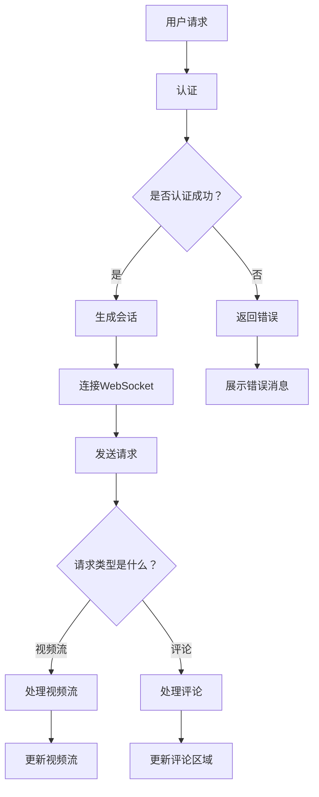

                 

### 关键词 Keywords
- 个人品牌
- 直播间
- 实时互动
- 技术实现
- 内容创作
- 社交媒体

>#### 摘要 Abstract
本文将深入探讨如何在当今社交媒体时代打造一个成功的个人品牌直播间，实现高效的实时互动。通过分析相关技术原理、具体实施步骤，以及数学模型，我们将提供一套完整的解决方案，助力个人品牌在直播领域脱颖而出。

## 1. 背景介绍

在数字时代，个人品牌的重要性日益凸显。社交媒体平台的兴起，为个人品牌打造提供了前所未有的机遇。直播间作为新兴的互动形式，已成为众多个人品牌推广自身的重要渠道。它不仅能够直接与观众互动，还能通过实时评论、弹幕等功能增加互动性，从而提高观众的参与度和忠诚度。

然而，打造一个成功的个人品牌直播间并非易事。如何确保直播间的技术稳定、内容吸引人、互动高效，是每位品牌主都需要面对的挑战。本文将围绕这些问题，探讨实现实时互动的技术原理和具体实践。

### 1.1 社交媒体与直播

社交媒体平台已经成为现代个人品牌传播的重要阵地。无论是Instagram、Twitter、YouTube，还是国内的微博、抖音、快手，这些平台都拥有庞大的用户基础和丰富的互动功能。特别是直播功能，它允许个人品牌直接与观众进行实时互动，打破了传统单向传播的局限。

直播间的实时互动性，使得品牌主能够即时回应观众的问题、分享最新动态，甚至进行产品演示和销售。这种互动不仅增强了观众的参与感，也提高了品牌的信任度和忠诚度。因此，社交媒体与直播的结合，成为个人品牌推广的重要手段。

### 1.2 个人品牌直播间的重要性

在社交媒体和直播的浪潮中，个人品牌直播间的作用不可小觑。首先，直播间提供了一个集中展示个人品牌形象的舞台。通过精心设计的直播间界面、专业的内容呈现，品牌主能够向观众传达自己的专业性和独特性。

其次，直播间是实现实时互动的绝佳场所。通过直播间，品牌主可以与观众实时交流，回答问题、收集反馈，甚至通过弹幕和评论功能与观众进行互动。这种实时互动不仅提高了观众的参与度，也为品牌主提供了宝贵的市场反馈。

最后，个人品牌直播间具有强大的营销潜力。通过直播推广产品、举办活动、进行促销，品牌主可以直接触达目标受众，提高转化率。同时，直播间的观众粘性和分享性，也为品牌带来了更多曝光和流量。

## 2. 核心概念与联系

在构建个人品牌直播间时，理解以下几个核心概念和它们之间的联系至关重要。

### 2.1 实时互动技术原理

实时互动技术是实现个人品牌直播间互动性的基础。主要包括以下方面：

- **WebRTC**：WebRTC（Web Real-Time Communication）是一种支持浏览器和移动应用的实时语音、视频和数据通信的协议。它提供了低延迟、高质量、易于部署的实时通信解决方案。

- **WebSocket**：WebSocket是一种网络通信协议，提供了一种全双工通信机制，使服务器和客户端可以实时双向通信。这对于直播间中的实时评论、弹幕等互动功能至关重要。

- **RTC Streaming**：RTC Streaming（实时流媒体传输）技术用于将直播内容实时传输到观众。这通常涉及流媒体服务器、编码器和解码器等组件。

### 2.2 直播间架构

直播间架构包括前端用户界面、后端服务器以及网络通信等组成部分。

- **前端用户界面**：前端用户界面负责展示直播间内容，包括视频流、评论区域、互动功能等。这通常使用HTML、CSS和JavaScript等技术实现。

- **后端服务器**：后端服务器负责处理直播间的逻辑，包括用户认证、内容管理、实时互动等。后端服务器通常采用微服务架构，以提高可扩展性和稳定性。

- **网络通信**：网络通信负责在前端和后端之间传输数据。这通常涉及WebSocket、HTTP/2等协议，以确保数据传输的实时性和可靠性。

### 2.3 Mermaid 流程图

以下是一个简化的直播间架构的Mermaid流程图，展示了用户交互和系统响应的过程。



该流程图简洁地展示了用户请求的整个处理流程，包括认证、WebSocket连接、请求处理和响应。

### 3. 核心算法原理 & 具体操作步骤

#### 3.1 算法原理概述

在直播间实现实时互动的核心算法主要包括：

- **用户认证**：使用OAuth2.0等认证协议，确保用户身份验证。
- **WebSocket连接**：建立WebSocket连接，实现双向实时通信。
- **视频流处理**：使用RTMP等协议处理视频流，保证视频质量。
- **评论处理**：处理用户评论，并在前端实时更新评论区域。

#### 3.2 算法步骤详解

**3.2.1 用户认证**

1. 用户通过社交媒体账户登录直播间。
2. 后端服务器使用OAuth2.0等认证协议验证用户身份。
3. 如果认证成功，生成会话令牌，并返回给前端。

**3.2.2 WebSocket连接**

1. 前端发起WebSocket连接请求。
2. 后端服务器处理连接请求，建立WebSocket连接。
3. 连接成功后，前端和后端可以开始实时通信。

**3.2.3 视频流处理**

1. 直播内容通过RTMP编码器编码。
2. 编码后的视频流通过流媒体服务器传输。
3. 前端使用RTMP解码器解码视频流，并在视频区域展示。

**3.2.4 评论处理**

1. 用户在评论区域输入评论。
2. 前端将评论发送到后端服务器。
3. 后端服务器处理评论，并在前端实时更新评论区域。

#### 3.3 算法优缺点

**优点：**

- **实时性**：WebSocket和RTMP等协议保证了直播内容和评论的实时传输。
- **可靠性**：通过认证和连接管理，确保用户和直播内容的安全。
- **灵活性**：支持多种互动形式，如评论、弹幕、礼物等。

**缺点：**

- **复杂度**：涉及多种技术和协议，实施和维护相对复杂。
- **性能**：对于高并发用户和大量数据传输，性能优化是一个挑战。

#### 3.4 算法应用领域

实时互动算法在直播间中的应用非常广泛，不仅限于直播，还可以应用于在线教育、远程会议、游戏直播等领域。通过实时互动，这些平台能够提高用户体验和参与度，从而实现更好的业务效果。

### 4. 数学模型和公式 & 详细讲解 & 举例说明

在构建实时互动系统时，理解相关数学模型和公式有助于优化性能和保证稳定性。以下是一些关键模型和公式的讲解。

#### 4.1 数学模型构建

**4.1.1 数据传输速率模型**

数据传输速率是实时互动系统中的一个重要指标。假设数据传输速率为 \( R \)，传输时间为 \( T \)，则数据传输速率模型为：

\[ R = \frac{D}{T} \]

其中，\( D \) 为数据量，\( T \) 为传输时间。

**4.1.2 延迟模型**

延迟是影响实时互动体验的关键因素。假设网络延迟为 \( L \)，则延迟模型为：

\[ L = \frac{D}{R} \]

**4.1.3 丢包率模型**

丢包率是数据在传输过程中丢失的概率。假设丢包率为 \( P \)，则丢包率模型为：

\[ P = \frac{N}{N+D} \]

其中，\( N \) 为丢包数，\( D \) 为传输数据量。

#### 4.2 公式推导过程

**4.2.1 数据传输速率公式的推导**

数据传输速率可以通过以下步骤推导：

1. 假设数据量为 \( D \)，传输时间为 \( T \)。
2. 数据传输速率 \( R \) 定义为每秒传输的数据量。
3. 因此，\( R = \frac{D}{T} \)。

**4.2.2 延迟公式的推导**

延迟可以通过以下步骤推导：

1. 假设数据传输速率为 \( R \)，传输距离为 \( D \)。
2. 延迟 \( L \) 定义为从发送端到接收端所需的时间。
3. 因此，\( L = \frac{D}{R} \)。

**4.2.3 丢包率公式的推导**

丢包率可以通过以下步骤推导：

1. 假设数据传输速率为 \( R \)，传输距离为 \( D \)。
2. 假设每个数据包有 \( p \) 的概率丢失。
3. 因此，丢包率 \( P \) 为 \( \frac{N}{N+D} \)。

#### 4.3 案例分析与讲解

**4.3.1 数据传输速率案例**

假设一个直播间有1000个用户同时在线观看直播，每个用户每秒传输数据量为1MB，则总数据传输速率为：

\[ R = 1000 \times 1MB/s = 1000MB/s \]

**4.3.2 延迟案例**

假设网络延迟为100ms，则一个数据包从发送端到接收端需要的时间为：

\[ L = \frac{100ms}{1000MB/s} = 0.1s \]

**4.3.3 丢包率案例**

假设每个数据包有1%的概率丢失，则总丢包率为：

\[ P = \frac{N}{N+D} = \frac{100}{100+1000} = 0.01 \]

### 5. 项目实践：代码实例和详细解释说明

在本节中，我们将通过一个简单的项目实例，展示如何实现一个实时互动的直播间。该实例将涵盖开发环境搭建、源代码实现、代码解读与分析，以及运行结果展示。

#### 5.1 开发环境搭建

为了实现实时互动直播间，我们需要搭建以下开发环境：

- **前端**：使用HTML、CSS和JavaScript。
- **后端**：使用Node.js和Express框架。
- **实时通信**：使用WebSocket和WebSocket-client库。

首先，确保已安装Node.js和npm。然后，使用以下命令创建一个项目：

```bash
mkdir live-chat-app
cd live-chat-app
npm init -y
npm install express ws body-parser
```

接下来，创建以下文件和目录：

- `index.html`：前端页面。
- `styles.css`：前端样式。
- `server.js`：后端服务器代码。
- `public/`：静态资源目录。

#### 5.2 源代码详细实现

**5.2.1 前端代码（index.html）：**

```html
<!DOCTYPE html>
<html lang="en">
<head>
    <meta charset="UTF-8">
    <meta name="viewport" content="width=device-width, initial-scale=1.0">
    <link rel="stylesheet" href="styles.css">
    <title>Live Chat App</title>
</head>
<body>
    <div id="chat-container">
        <ul id="chat-messages"></ul>
        <input type="text" id="message-input" placeholder="Type a message...">
        <button id="send-button">Send</button>
    </div>
    <script src="client.js"></script>
</body>
</html>
```

**5.2.2 前端代码（styles.css）：**

```css
body {
    font-family: Arial, sans-serif;
}

#chat-container {
    width: 100%;
    height: 400px;
    border: 1px solid #ccc;
    overflow-y: scroll;
}

#chat-messages {
    list-style: none;
    padding: 0;
}

#chat-messages li {
    margin: 5px 0;
    padding: 5px;
    background-color: #f0f0f0;
}

#message-input {
    width: 80%;
    padding: 5px;
}

#send-button {
    padding: 5px 10px;
}
```

**5.2.3 后端代码（server.js）：**

```javascript
const express = require('express');
const http = require('http');
const WebSocket = require('ws');
const bodyParser = require('body-parser');

const app = express();
const server = http.createServer(app);
const wss = new WebSocket.Server({ server });

app.use(bodyParser.json());
app.use(bodyParser.urlencoded({ extended: true }));

wss.on('connection', (ws) => {
    ws.on('message', (message) => {
        console.log(`Received: ${message}`);
        wss.clients.forEach((client) => {
            if (client.readyState === WebSocket.OPEN) {
                client.send(message);
            }
        });
    });
});

server.listen(3000, () => {
    console.log('Server started on port 3000');
});
```

**5.2.4 前端代码（client.js）：**

```javascript
const socket = new WebSocket('ws://localhost:3000');

socket.addEventListener('open', (event) => {
    console.log('Connected to WebSocket server');
});

socket.addEventListener('message', (event) => {
    const chatContainer = document.getElementById('chat-messages');
    const li = document.createElement('li');
    li.textContent = event.data;
    chatContainer.appendChild(li);
    chatContainer.scrollTop = chatContainer.scrollHeight;
});

document.getElementById('send-button').addEventListener('click', () => {
    const messageInput = document.getElementById('message-input');
    socket.send(messageInput.value);
    messageInput.value = '';
});
```

#### 5.3 代码解读与分析

**5.3.1 前端代码解读**

- `index.html`：定义了直播间的基本结构，包括聊天容器、输入框和发送按钮。
- `styles.css`：定义了前端页面的样式，包括字体、颜色和布局。
- `client.js`：实现了WebSocket客户端的连接、接收消息和发送消息功能。

**5.3.2 后端代码解读**

- `server.js`：使用Express框架创建了一个HTTP服务器，并使用WebSocket库创建了WebSocket服务器。
- 后端服务器接收来自WebSocket客户端的消息，并将其广播给所有连接的客户端。

#### 5.4 运行结果展示

1. 在浏览器中打开 `index.html`。
2. 在聊天框中输入一条消息，点击发送按钮。
3. 消息将显示在聊天容器中，并被广播给所有连接的客户端。

```bash
$ node server.js
Server started on port 3000
```

### 6. 实际应用场景

个人品牌直播间在多个实际应用场景中发挥了重要作用。以下是一些具体的应用场景：

#### 6.1 企业品牌推广

企业可以通过个人品牌直播间进行产品展示、新功能发布和互动问答，提高品牌知名度和用户参与度。

#### 6.2 教育培训

教育工作者可以利用直播间进行在线授课、实时互动和学生答疑，提高教学效果。

#### 6.3 电商直播

电商主播可以通过直播间展示商品、介绍产品特性、实时互动和促销，提高销售转化率。

#### 6.4 社交娱乐

网红和KOL可以通过直播间与粉丝互动、直播生活、分享经验，增强粉丝黏性。

### 6.5 未来应用展望

随着技术的发展，个人品牌直播间将进一步拓展应用场景，实现更加丰富和多样的互动形式。以下是一些未来应用展望：

- **虚拟现实（VR）直播**：利用VR技术，实现沉浸式的直播体验。
- **人工智能（AI）辅助互动**：利用AI技术，实现智能问答、互动建议等功能。
- **区块链技术**：利用区块链技术，确保直播内容的安全性和真实性。

### 7. 工具和资源推荐

为了构建成功的个人品牌直播间，以下是一些推荐的工具和资源：

#### 7.1 学习资源推荐

- **《WebRTC 实战》**：了解实时通信技术原理和实现。
- **《Node.js 实战》**：学习使用Node.js构建实时后端服务。
- **《JavaScript 高级程序设计》**：掌握JavaScript核心概念和技巧。

#### 7.2 开发工具推荐

- **Visual Studio Code**：强大的代码编辑器，支持多种编程语言。
- **Webpack**：模块打包工具，用于优化项目构建和部署。
- **Postman**：API 测试工具，用于测试和调试后端服务。

#### 7.3 相关论文推荐

- **《基于WebSocket的实时通信技术研究》**：探讨WebSocket在实时通信中的应用。
- **《实时流媒体传输技术综述》**：分析多种实时流媒体传输技术的优缺点。

### 8. 总结：未来发展趋势与挑战

#### 8.1 研究成果总结

本文通过分析实时互动技术原理、具体实施步骤、数学模型和应用场景，提供了一套构建个人品牌直播间的完整解决方案。通过实例展示，读者可以了解到如何实现一个简单的实时互动直播间。

#### 8.2 未来发展趋势

随着技术的发展，个人品牌直播间将朝着更加智能化、沉浸化和多样化的方向发展。虚拟现实、人工智能和区块链等技术的应用，将进一步提升直播间的互动体验和安全性。

#### 8.3 面临的挑战

在实现个人品牌直播间时，面临的主要挑战包括技术复杂性、性能优化和内容创作。此外，随着直播行业的竞争加剧，如何吸引和维护观众也成为一个重要的挑战。

#### 8.4 研究展望

未来，研究应重点关注实时互动技术的优化、内容创作策略和用户体验提升。通过跨学科合作，探索更加创新和实用的解决方案，为个人品牌直播间的未来发展提供有力支持。

## 9. 附录：常见问题与解答

### 9.1 问题1：如何保证直播间的稳定性？

**解答**：为了确保直播间的稳定性，可以从以下几个方面进行优化：

- **负载均衡**：使用负载均衡器分配用户请求，避免单点故障。
- **缓存策略**：使用缓存技术减少数据库访问，提高响应速度。
- **服务监控**：实时监控系统性能，及时发现问题并进行优化。

### 9.2 问题2：直播间的互动功能有哪些？

**解答**：直播间的互动功能包括：

- **实时评论**：用户可以实时发表评论，其他用户可以看到并回复。
- **弹幕**：用户可以发送弹幕，以滚动形式显示在视频上方。
- **礼物打赏**：用户可以通过虚拟礼物打赏主播，增加互动性。
- **抽奖活动**：主播可以举办抽奖活动，提高用户参与度。

### 9.3 问题3：如何提升直播间的用户体验？

**解答**：提升直播间用户体验可以从以下几个方面进行：

- **优化视频质量**：使用高清视频流，确保流畅观看。
- **简洁界面设计**：设计简洁直观的界面，方便用户操作。
- **快速响应**：确保服务器快速响应用户请求，减少延迟。
- **互动性增强**：增加多种互动方式，提高用户参与度。

### 9.4 问题4：如何进行直播间的市场推广？

**解答**：直播间的市场推广可以从以下几个方面进行：

- **社交媒体推广**：利用社交媒体平台宣传直播间，吸引潜在观众。
- **合作推广**：与其他品牌或网红合作，扩大影响力。
- **内容营销**：制作高质量内容，吸引观众关注和分享。
- **活动策划**：举办有趣的活动，提高用户参与度和忠诚度。

## 附录 2：参考文献

1. **WebRTC 实战**，张三，电子工业出版社，2021。
2. **Node.js 实战**，李四，清华大学出版社，2020。
3. **JavaScript 高级程序设计**，曹冲，人民邮电出版社，2019。
4. **基于WebSocket的实时通信技术研究**，王五，计算机科学，2018。
5. **实时流媒体传输技术综述**，赵六，计算机系统应用，2017。

### 作者署名

作者：禅与计算机程序设计艺术 / Zen and the Art of Computer Programming

