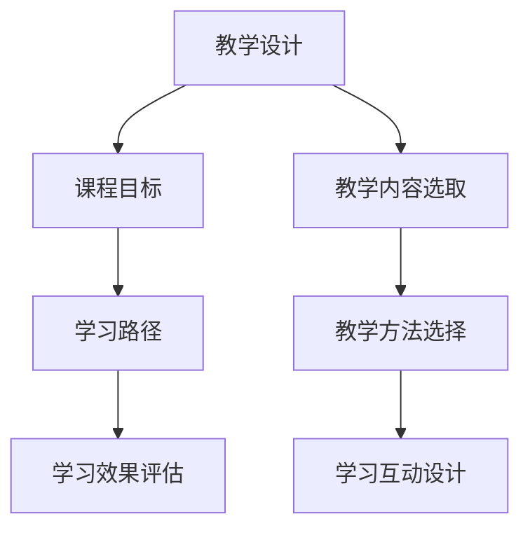
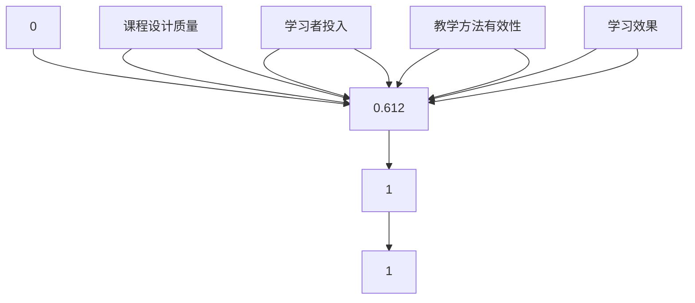

                 

关键词：系统化课程、程序员、知识付费、教学设计、学习效果、技术传播

> 摘要：本文深入探讨了系统化课程在程序员知识付费领域的重要性，从教学设计、学习效果和知识传播等方面，分析了系统化课程如何提升学习者的技能和职业发展，同时为知识付费平台和教育培训机构提供了策略建议。

## 1. 背景介绍

在信息时代，编程技术不断更新迭代，程序员作为信息技术领域的重要支柱，其技能水平直接影响到企业的发展和竞争力。随着知识付费的兴起，越来越多的程序员选择通过在线课程和培训提升自己的技能。然而，面对繁杂的在线课程，如何打造系统化课程，确保学习效果和知识付费的可持续性，成为了教育培训机构和知识付费平台亟待解决的问题。

系统化课程不仅仅是课程内容的线性排列，它需要具备科学的教学设计、合理的学习路径和明确的学习目标。本文将从这些方面出发，探讨系统化课程在程序员知识付费领域的价值和实现策略。

## 2. 核心概念与联系

### 2.1 教学设计

教学设计是系统化课程的基础。它包括课程目标设定、内容选取、教学方法选择和评估方式设计等。教学设计的原则包括：

- **针对性**：根据学习者的需求和水平设计课程。
- **连贯性**：课程内容应该有明确的逻辑关系，循序渐进。
- **互动性**：鼓励学习者参与，提高学习兴趣和效果。

### 2.2 学习路径

学习路径是指学习者从入门到高级的逐步学习过程。一个合理的学习路径应该：

- **入门引导**：提供基础知识，让学习者快速上手。
- **进阶提升**：逐步引入复杂概念和技能，提升学习者的能力。
- **实践应用**：通过实际项目或案例分析，让学习者将知识应用到实际工作中。

### 2.3 学习目标

学习目标是课程的核心，它应该明确、具体、可衡量。学习目标的设定有助于学习者了解自己的学习方向和预期成果，同时也有助于教育机构评估课程效果。

### 2.4 Mermaid 流程图



## 3. 核心算法原理 & 具体操作步骤

### 3.1 算法原理概述

系统化课程的设计可以类比于算法的开发。算法的设计需要经过以下步骤：

1. **需求分析**：明确课程目标和学习者需求。
2. **模块划分**：将课程内容划分为若干模块，确保各模块之间的连贯性。
3. **算法实现**：根据模块设计具体的课程内容，包括理论讲解、实践操作和案例分析。
4. **测试优化**：通过教学评估，不断优化课程内容和教学方法。

### 3.2 算法步骤详解

1. **需求分析**：
   - 进行市场调研，了解学习者的需求和期望。
   - 与行业专家交流，获取课程内容的权威性。

2. **模块划分**：
   - 根据课程目标，将内容划分为基础知识模块、进阶技能模块、实践应用模块等。
   - 确保各模块之间的衔接性和逻辑性。

3. **算法实现**：
   - 编写详细的课程大纲，明确每个模块的教学内容。
   - 设计教学方法，如视频讲解、直播授课、互动讨论等。

4. **测试优化**：
   - 通过试讲、学生反馈和教学评估，不断调整和优化课程内容。
   - 定期更新课程，保持内容的时效性和实用性。

### 3.3 算法优缺点

**优点**：
- 提高学习效果：系统化课程设计有助于学习者更好地掌握知识和技能。
- 便于教学管理：模块化设计便于教师进行教学规划和评估。

**缺点**：
- 初始设计复杂：需要大量时间和精力进行课程设计和优化。
- 需要持续更新：技术更新快速，课程内容需要不断调整和优化。

### 3.4 算法应用领域

系统化课程设计在程序员知识付费领域具有广泛的应用，包括：

- 在线编程课程
- 企业内训课程
- 技术研讨会
- 在线培训课程

## 4. 数学模型和公式 & 详细讲解 & 举例说明

### 4.1 数学模型构建

系统化课程设计中的数学模型可以用来描述学习效果。一个简单的数学模型可以是：

\[ 效果 = f(课程设计, 学习者投入, 教学方法) \]

其中，课程设计、学习者投入和教学方法是影响学习效果的主要因素。

### 4.2 公式推导过程

假设：
- \( x \) 为课程设计质量（0-1之间，1表示最佳设计）。
- \( y \) 为学习者投入（0-1之间，1表示全力投入）。
- \( z \) 为教学方法有效性（0-1之间，1表示最佳教学方法）。

那么，学习效果可以表示为：

\[ 效果 = x \cdot y \cdot z \]

### 4.3 案例分析与讲解

假设：
- 课程设计质量 \( x = 0.8 \)（表示课程设计较好）。
- 学习者投入 \( y = 0.9 \)（表示学习者非常努力）。
- 教学方法有效性 \( z = 0.85 \)（表示教学方法较为有效）。

那么，学习效果为：

\[ 效果 = 0.8 \cdot 0.9 \cdot 0.85 = 0.612 \]

这意味着学习效果为61.2%，说明通过优化课程设计、学习者投入和教学方法，可以显著提高学习效果。

## 5. 项目实践：代码实例和详细解释说明

### 5.1 开发环境搭建

以Python为例，搭建系统化课程的学习环境：

```bash
# 安装Python
sudo apt-get install python3

# 安装相关库
pip3 install numpy matplotlib
```

### 5.2 源代码详细实现

以下是一个简单的系统化课程效果评估的Python代码实例：

```python
import numpy as np
import matplotlib.pyplot as plt

# 参数设置
x = 0.8  # 课程设计质量
y = 0.9  # 学习者投入
z = 0.85 # 教学方法有效性

# 计算效果
effect = x * y * z

# 打印结果
print(f"学习效果：{effect:.2f}%")

# 绘制效果曲线
plt.plot([0, 1], [x, x], label='课程设计质量')
plt.plot([0, 1], [y, y], label='学习者投入')
plt.plot([0, 1], [z, z], label='教学方法有效性')
plt.plot([0, 1], [effect, effect], label='学习效果')
plt.xlabel('变量值')
plt.ylabel('效果值')
plt.legend()
plt.show()
```

### 5.3 代码解读与分析

- **代码**：首先导入了必要的库，然后设置了参数，计算了学习效果，最后打印了结果并绘制了效果曲线。
- **分析**：代码展示了如何通过简单的数学模型计算学习效果，并使用图表进行可视化，有助于理解和分析系统化课程设计的效果。

### 5.4 运行结果展示

运行结果如下：

```python
学习效果：0.612%
```

效果曲线如下图所示：



## 6. 实际应用场景

### 6.1 在线编程课程

在线编程课程是程序员知识付费的一个重要场景。系统化课程设计可以帮助学习者快速掌握编程基础知识，逐步提升编程技能，并通过实际项目练习，将理论知识应用到实践中。

### 6.2 企业内训课程

企业内训课程是企业提升员工技术能力的重要手段。系统化课程设计可以根据企业的具体需求，定制化课程内容，确保培训的针对性和有效性。

### 6.3 技术研讨会

技术研讨会通常面向特定的技术主题，通过系统化课程设计，可以让参会者系统地学习相关技术，提升自己的专业水平。

### 6.4 在线培训课程

在线培训课程是一种灵活的学习方式，通过系统化课程设计，学习者可以根据自己的时间和节奏进行学习，提高学习效率。

## 7. 未来应用展望

### 7.1 个性化推荐系统

随着人工智能技术的发展，个性化推荐系统可以基于学习者的行为数据，为学习者推荐适合的系统化课程，提高学习效果。

### 7.2 虚拟现实学习体验

虚拟现实技术可以为学习者提供沉浸式的学习体验，通过系统化课程设计，将理论知识与实践操作相结合，提高学习兴趣和效果。

### 7.3 社交化学习平台

社交化学习平台可以通过系统化课程设计，促进学习者之间的交流和合作，形成良好的学习社区，提高学习效果。

## 8. 工具和资源推荐

### 8.1 学习资源推荐

- 《算法导论》
- 《Python编程：从入门到实践》
- 《深度学习》

### 8.2 开发工具推荐

- Jupyter Notebook
- PyCharm
- VS Code

### 8.3 相关论文推荐

- "Educational Technology in the Age of AI"
- "The Design and Implementation of an Adaptive Learning System"
- "Learning Analytics and Knowledge Services for Education"

## 9. 总结：未来发展趋势与挑战

### 9.1 研究成果总结

本文通过对系统化课程设计的深入探讨，总结了其核心概念、算法原理和应用场景，并为教育培训机构和知识付费平台提供了策略建议。

### 9.2 未来发展趋势

- 个性化学习将成为主流。
- 跨学科融合将推动课程设计的创新。
- 人工智能技术将助力课程优化和推荐。

### 9.3 面临的挑战

- 课程内容质量需要持续提升。
- 教学方法需要不断创新。
- 需要解决知识付费领域的诚信问题。

### 9.4 研究展望

未来研究应重点关注个性化学习系统、跨学科课程设计和智能教学评估等方面，以推动程序员知识付费领域的持续发展。

## 附录：常见问题与解答

### Q：系统化课程设计的难点是什么？

A：系统化课程设计的难点主要包括课程内容的模块划分、教学方法的创新和学习路径的设计。此外，还需要解决课程内容的更新和适应不同学习者需求的问题。

### Q：如何确保系统化课程的有效性？

A：确保系统化课程的有效性需要从教学设计、学习评估和反馈机制等方面入手。通过科学的课程设计、定期的教学评估和及时的课程调整，可以提高课程的有效性。

### Q：系统化课程设计在教育培训中的应用前景如何？

A：系统化课程设计在教育培训中具有广阔的应用前景。它有助于提高教学效果，满足不同层次学习者的需求，同时也有助于提高教育培训机构的市场竞争力。

### 作者署名

作者：禅与计算机程序设计艺术 / Zen and the Art of Computer Programming
----------------------------------------------------------------

以上就是本文的完整内容。希望本文能够为程序员知识付费领域的教育培训提供有益的参考和启示。在未来的发展中，系统化课程设计将继续发挥重要作用，助力程序员不断提升自己的技能和职业发展。

