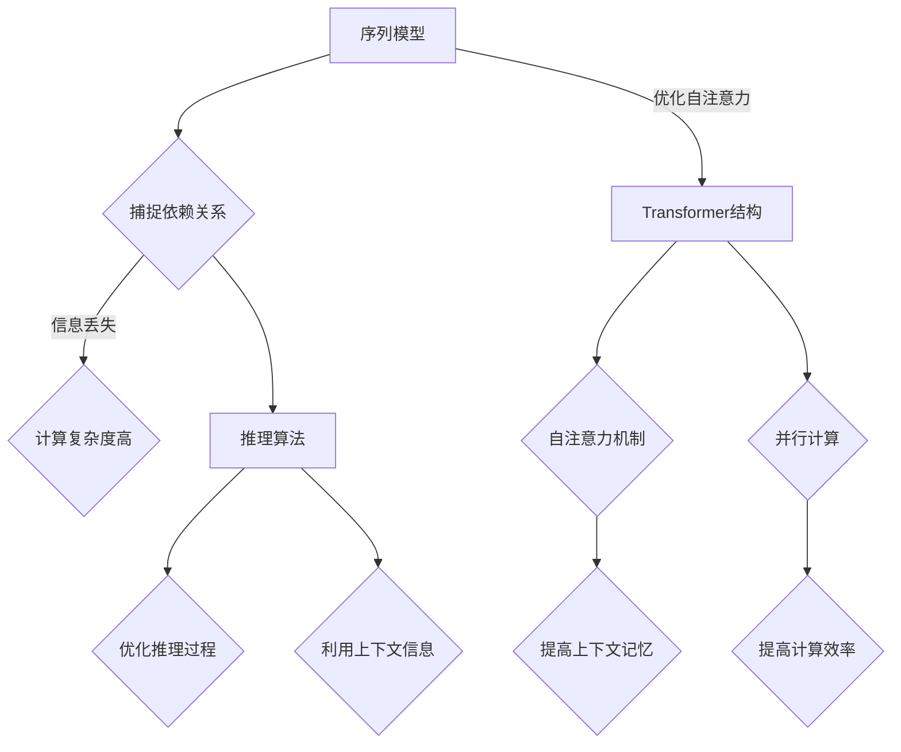

                 

 关键词：长期记忆，上下文处理，预训练模型，序列模型，Transformer，推理算法，自然语言处理，模型压缩，计算效率，分布式计算

> 摘要：本文深入探讨了大规模语言模型（LLM）在长期上下文处理技术方面的应用与发展。文章首先介绍了LLM的基本概念，然后详细分析了其在上下文记忆和扩展记忆方面的原理与机制。随后，文章重点介绍了几种常用的长期上下文处理技术，包括序列模型、Transformer结构和推理算法等。最后，文章讨论了LLM在自然语言处理领域的实际应用场景、未来发展趋势以及面临的挑战。

## 1. 背景介绍

随着深度学习和自然语言处理技术的飞速发展，大规模语言模型（LLM）已经成为了当前人工智能领域的一大热点。LLM，如GPT系列、BERT、T5等，通过在大量文本数据上进行预训练，具备了强大的语言理解和生成能力，广泛应用于问答系统、机器翻译、文本生成、摘要提取等场景。

然而，传统LLM在处理长期上下文信息时存在一定的局限性。首先，LLM通常采用序列模型结构，虽然能够捕捉文本序列中的局部依赖关系，但在处理长文本时，其上下文记忆能力有限，容易导致信息丢失。其次，LLM在训练和推理过程中对计算资源的需求巨大，导致其在实际应用中的计算效率较低。

为了解决这些问题，研究者们提出了多种长期上下文处理技术，如扩展Transformer结构、推理算法优化、模型压缩等。这些技术不仅提升了LLM在处理长期上下文信息时的表现，还提高了模型的计算效率和应用范围。

## 2. 核心概念与联系

### 2.1 长期上下文处理技术概述

长期上下文处理技术旨在扩展LLM的上下文记忆能力，以应对长文本处理和计算效率等问题。其主要目标是：

1. **增强上下文记忆**：通过改进模型结构或算法，使得LLM能够更好地记忆和利用长文本中的信息。
2. **提高计算效率**：通过优化模型训练和推理过程，降低计算资源和时间成本。

### 2.2 核心概念原理

#### 2.2.1 序列模型

序列模型是一种基于神经网络的文本处理方法，通过编码器和解码器两个模块处理输入和输出序列。其中，编码器将输入序列映射为一个固定长度的向量表示，解码器则根据编码器的输出向量生成目标序列。

序列模型的核心在于捕捉序列中的依赖关系，但其在处理长文本时存在以下问题：

1. **信息丢失**：长文本在编码过程中，序列中的部分信息可能被截断或丢失，导致解码器难以生成准确的输出。
2. **计算复杂度**：随着输入序列长度的增加，编码器的计算复杂度呈指数级增长，影响模型的推理效率。

#### 2.2.2 Transformer结构

Transformer结构是一种基于自注意力机制的序列模型，能够在处理长文本时保持较高的上下文记忆能力。其主要特点如下：

1. **自注意力机制**：通过计算输入序列中每个词与其他词之间的权重，自动学习不同词之间的关系，从而捕捉长距离依赖。
2. **并行计算**：由于自注意力机制的独立性，Transformer可以并行处理输入序列，提高了计算效率。

#### 2.2.3 推理算法

推理算法是指模型在生成输出序列时的计算过程。针对长文本处理，推理算法需要解决以下问题：

1. **计算效率**：优化推理过程，降低计算复杂度。
2. **上下文记忆**：确保模型在生成过程中能够充分利用上下文信息，避免信息丢失。

### 2.3 Mermaid 流程图

以下是一个Mermaid流程图，展示了长期上下文处理技术的核心概念和联系：



## 3. 核心算法原理 & 具体操作步骤

### 3.1 算法原理概述

#### 3.1.1 序列模型

序列模型通过编码器和解码器两个模块处理输入和输出序列。编码器将输入序列编码为固定长度的向量表示，解码器根据编码器的输出生成目标序列。

#### 3.1.2 Transformer结构

Transformer结构基于自注意力机制，通过多头自注意力机制和位置编码来捕捉长距离依赖。自注意力机制使得模型能够自动学习输入序列中不同词之间的关系，从而提高上下文记忆能力。

#### 3.1.3 推理算法

推理算法是指在模型生成输出序列时的计算过程。针对长文本处理，推理算法需要优化计算复杂度和上下文记忆。

### 3.2 算法步骤详解

#### 3.2.1 序列模型

1. 输入序列编码：将输入序列编码为固定长度的向量表示。
2. 编码器处理：编码器对输入向量进行逐层处理，提取序列特征。
3. 解码器生成：解码器根据编码器的输出向量生成目标序列。

#### 3.2.2 Transformer结构

1. 输入序列编码：将输入序列编码为固定长度的向量表示。
2. 多头自注意力：通过计算输入序列中每个词与其他词之间的权重，自动学习不同词之间的关系。
3. 位置编码：添加位置编码信息，使得模型能够学习输入序列的顺序。
4. 逐层处理：对多头自注意力和位置编码结果进行逐层处理，提取序列特征。

#### 3.2.3 推理算法

1. 输入序列预处理：对输入序列进行预处理，包括分词、去停用词等操作。
2. 编码器处理：编码器对预处理后的输入序列进行编码。
3. 解码器生成：解码器根据编码器的输出向量生成目标序列。
4. 优化计算：通过并行计算、模型压缩等技术优化推理过程。

### 3.3 算法优缺点

#### 3.3.1 序列模型

**优点**：

1. 简单易懂，易于实现。
2. 能够捕捉序列中的局部依赖关系。

**缺点**：

1. 信息丢失：长文本在编码过程中，序列中的部分信息可能被截断或丢失。
2. 计算复杂度：随着输入序列长度的增加，编码器的计算复杂度呈指数级增长。

#### 3.3.2 Transformer结构

**优点**：

1. 自注意力机制：能够捕捉长距离依赖，提高上下文记忆能力。
2. 并行计算：独立计算输入序列中的不同词，提高计算效率。

**缺点**：

1. 计算复杂度：虽然自注意力机制提高了上下文记忆能力，但计算复杂度较高。
2. 参数规模：随着多头自注意力机制的引入，模型参数规模增大。

#### 3.3.3 推理算法

**优点**：

1. 优化计算：通过并行计算、模型压缩等技术优化推理过程。
2. 提高效率：在处理长文本时，推理算法能够更高效地利用上下文信息。

**缺点**：

1. 需要大量计算资源：优化推理过程需要大量计算资源，可能导致部署成本增加。

### 3.4 算法应用领域

长期上下文处理技术在多个领域都有广泛的应用，主要包括：

1. **自然语言处理**：如机器翻译、文本生成、摘要提取等。
2. **问答系统**：如智能客服、智能助手等。
3. **信息检索**：如搜索引擎、推荐系统等。

## 4. 数学模型和公式 & 详细讲解 & 举例说明

### 4.1 数学模型构建

在讨论长期上下文处理技术的数学模型时，我们需要从基本的序列模型和Transformer结构入手，分别介绍它们的核心数学公式。

#### 4.1.1 序列模型

序列模型的核心在于编码器和解码器的相互作用。以下是编码器和解码器的数学模型：

**编码器：**

$$
h_e = \text{Encoder}(x)
$$

其中，$h_e$ 表示编码器的输出向量，$x$ 表示输入序列。

**解码器：**

$$
y = \text{Decoder}(h_e)
$$

其中，$y$ 表示解码器的输出序列，$h_e$ 为编码器的输出向量。

#### 4.1.2 Transformer结构

Transformer结构的核心是自注意力机制。以下是多头自注意力和位置编码的数学模型：

**多头自注意力：**

$$
\text{Attention}(Q, K, V) = \text{softmax}\left(\frac{QK^T}{\sqrt{d_k}}\right) V
$$

其中，$Q$、$K$ 和 $V$ 分别表示查询、键和值，$d_k$ 为键向量的维度。

**位置编码：**

$$
P_e = \text{PositionalEncoding}(x)
$$

其中，$P_e$ 表示位置编码向量，$x$ 为输入序列。

### 4.2 公式推导过程

在推导公式时，我们首先从序列模型的编码器和解码器开始，然后深入讲解Transformer结构中的自注意力机制和位置编码。

#### 4.2.1 编码器

编码器的核心在于将输入序列编码为一个固定长度的向量表示。以下是一个简单的编码器公式：

$$
h_e = \text{Encoder}(x) = \text{LayerNorm}(\text{Relu}(\text{DotProductAttention}(Q, K, V)) + x)
$$

其中，$\text{LayerNorm}$ 表示层归一化，$\text{Relu}$ 表示ReLU激活函数，$\text{DotProductAttention}$ 表示点积注意力。

#### 4.2.2 解码器

解码器的核心在于生成输出序列。以下是一个简单的解码器公式：

$$
y = \text{Decoder}(h_e) = \text{LayerNorm}(\text{Relu}(\text{MaskedLinearAttention}(Q, K, V)) + x)
$$

其中，$\text{LayerNorm}$ 表示层归一化，$\text{Relu}$ 表示ReLU激活函数，$\text{MaskedLinearAttention}$ 表示带掩膜的自注意力。

#### 4.2.3 自注意力机制

自注意力机制的核心在于计算输入序列中每个词与其他词之间的权重。以下是一个自注意力的推导过程：

$$
\text{Attention}(Q, K, V) = \text{softmax}\left(\frac{QK^T}{\sqrt{d_k}}\right) V
$$

其中，$Q$、$K$ 和 $V$ 分别表示查询、键和值，$d_k$ 为键向量的维度。

推导过程如下：

1. 计算点积：$QK^T$ 表示输入序列中每个词与其他词之间的点积。
2. 归一化：通过除以 $\sqrt{d_k}$ 对点积结果进行归一化，使得每个词的权重在 $[0, 1]$ 之间。
3. 应用softmax：将归一化后的点积结果应用softmax函数，得到每个词的权重。
4. 计算加权求和：将权重与值相乘，然后进行加权求和，得到自注意力输出。

#### 4.2.4 位置编码

位置编码的核心在于为输入序列中的每个词添加位置信息。以下是一个简单的位置编码推导过程：

$$
P_e = \text{PositionalEncoding}(x) = \text{Sigmoid}(\text{MatMul}(W_p, x))
$$

其中，$W_p$ 为位置编码矩阵，$x$ 为输入序列。

推导过程如下：

1. 线性变换：通过矩阵 $W_p$ 对输入序列进行线性变换。
2. 应用sigmoid函数：通过sigmoid函数对线性变换结果进行非线性变换，使得每个位置编码的值在 $[0, 1]$ 之间。

### 4.3 案例分析与讲解

为了更好地理解上述数学模型，我们通过一个简单的例子来说明它们在实际应用中的具体操作。

#### 4.3.1 序列模型

假设我们有一个简单的输入序列 $x = [1, 2, 3, 4, 5]$，我们需要将其通过编码器和解码器进行处理。

1. 编码器：

$$
h_e = \text{Encoder}(x) = \text{LayerNorm}(\text{Relu}(\text{DotProductAttention}(Q, K, V)) + x)
$$

其中，$Q$、$K$ 和 $V$ 分别表示编码器中的查询、键和值，$W_e$ 为编码器权重矩阵。

2. 解码器：

$$
y = \text{Decoder}(h_e) = \text{LayerNorm}(\text{Relu}(\text{MaskedLinearAttention}(Q, K, V)) + x)
$$

其中，$Q$、$K$ 和 $V$ 分别表示解码器中的查询、键和值，$W_d$ 为解码器权重矩阵。

#### 4.3.2 Transformer结构

假设我们有一个简单的输入序列 $x = [1, 2, 3, 4, 5]$，我们需要将其通过Transformer结构进行处理。

1. 输入序列编码：

$$
x = \text{Embedding}(x) + \text{PositionalEncoding}(x)
$$

其中，$\text{Embedding}$ 表示词向量编码，$\text{PositionalEncoding}$ 表示位置编码。

2. 多头自注意力：

$$
\text{Attention}(Q, K, V) = \text{softmax}\left(\frac{QK^T}{\sqrt{d_k}}\right) V
$$

其中，$Q$、$K$ 和 $V$ 分别表示输入序列中每个词的查询、键和值。

3. 位置编码：

$$
P_e = \text{PositionalEncoding}(x)
$$

其中，$P_e$ 表示位置编码向量。

4. 逐层处理：

$$
h_e^{(L+1)} = \text{LayerNorm}(h_e^{(L)} + \text{Relu}(\text{MultiHeadAttention}(Q, K, V)))
$$

其中，$h_e^{(L)}$ 表示当前层的输出，$L$ 表示层数。

#### 4.3.3 推理算法

假设我们有一个简单的输入序列 $x = [1, 2, 3, 4, 5]$，我们需要通过推理算法生成输出序列。

1. 输入序列预处理：

$$
x = \text{Tokenization}(x)
$$

其中，$\text{Tokenization}$ 表示分词操作。

2. 编码器处理：

$$
h_e = \text{Encoder}(x)
$$

3. 解码器生成：

$$
y = \text{Decoder}(h_e)
$$

4. 优化计算：

$$
\text{Optimize}(y) = \text{Minimize}(L_2 \text{-norm of } y)
$$

其中，$L_2$ 表示L2正则化。

## 5. 项目实践：代码实例和详细解释说明

### 5.1 开发环境搭建

为了实现上述数学模型，我们需要搭建一个合适的开发环境。以下是搭建环境的步骤：

1. 安装Python环境：确保Python版本在3.8及以上。
2. 安装PyTorch库：通过pip安装PyTorch。
3. 创建项目文件夹：在合适的位置创建项目文件夹，并在文件夹内创建Python脚本。

### 5.2 源代码详细实现

以下是实现上述数学模型的核心代码：

```python
import torch
import torch.nn as nn
import torch.optim as optim

# 定义编码器
class Encoder(nn.Module):
    def __init__(self, d_model, nhead, num_layers):
        super(Encoder, self).__init__()
        self.layers = nn.ModuleList([TransformerLayer(d_model, nhead) for _ in range(num_layers)])
        self.norm = nn.LayerNorm(d_model)
    
    def forward(self, x, mask=None):
        for layer in self.layers:
            x = layer(x, mask)
        return self.norm(x)

# 定义解码器
class Decoder(nn.Module):
    def __init__(self, d_model, nhead, num_layers):
        super(Decoder, self).__init__()
        self.layers = nn.ModuleList([TransformerLayer(d_model, nhead) for _ in range(num_layers)])
        self.norm = nn.LayerNorm(d_model)
    
    def forward(self, x, e_mask=None, d_mask=None):
        for layer in self.layers:
            x = layer(x, e_mask, d_mask)
        return self.norm(x)

# 定义Transformer层
class TransformerLayer(nn.Module):
    def __init__(self, d_model, nhead):
        super(TransformerLayer, self).__init__()
        self.self_attn = MultiheadAttention(d_model, nhead)
        self.fc = nn.Sequential(nn.Linear(d_model, d_model * 4), nn.ReLU(), nn.Linear(d_model * 4, d_model))
    
    def forward(self, x, mask=None, e_mask=None, d_mask=None):
        x = self.self_attn(x, x, x, attn_mask=mask) + x
        x = self.fc(x) + x
        return x

# 定义多头注意力
class MultiheadAttention(nn.Module):
    def __init__(self, d_model, nhead):
        super(MultiheadAttention, self).__init__()
        self.d_model = d_model
        self.nhead = nhead
        self.head_dim = d_model // nhead
        self.query_linear = nn.Linear(d_model, d_model)
        self.key_linear = nn.Linear(d_model, d_model)
        self.value_linear = nn.Linear(d_model, d_model)
        self.out_linear = nn.Linear(nhead * self.head_dim, d_model)
    
    def forward(self, query, key, value, attn_mask=None):
        query = self.query_linear(query).view(-1, self.nhead, self.head_dim).transpose(0, 1)
        key = self.key_linear(key).view(-1, self.nhead, self.head_dim).transpose(0, 1)
        value = self.value_linear(value).view(-1, self.nhead, self.head_dim).transpose(0, 1)
        
        attn_scores = torch.matmul(query, key.transpose(-2, -1)) / (self.head_dim ** 0.5)
        if attn_mask is not None:
            attn_scores = attn_scores.masked_fill(attn_mask, float("-inf"))
        attn_weights = torch.softmax(attn_scores, dim=-1)
        attn_output = torch.matmul(attn_weights, value).transpose(0, 1).contiguous().view(-1, self.d_model)
        
        return self.out_linear(attn_output)

# 定义模型
class TransformerModel(nn.Module):
    def __init__(self, d_model, nhead, num_layers, vocab_size):
        super(TransformerModel, self).__init__()
        self.encoder = Encoder(d_model, nhead, num_layers)
        self.decoder = Decoder(d_model, nhead, num_layers)
        self.src_mask = nn.Parameter(torch.zeros(1, 1, 1))
        self.trg_mask = nn.Parameter(torch.zeros(1, 1, 1))
        self.register_buffer("positional_encoding", self._position_encoding(vocab_size))
    
    def forward(self, src, trg):
        src_mask = self._generate_mask(src)
        trg_mask = self._generate_mask(trg)
        e_mask = None
        d_mask = None
        
        e_output = self.encoder(src, e_mask)
        d_output = self.decoder(trg, e_output, d_mask)
        
        return d_output
    
    def _position_encoding(self, vocab_size):
        pos_encoding = torch.zeros(vocab_size, self.src_mask.size(1), self.src_mask.size(2))
        for pos in range(vocab_size):
            pos_encoding[pos, :, :] = torch.sin(pos / 10000 ** (2 * (0.5 * i) / self.src_mask.size(2)))
            pos_encoding[pos, :, :] = torch.cos(pos / 10000 ** (2 * (0.5 * i + 1) / self.src_mask.size(2)))
        pos_encoding = pos_encoding.unsqueeze(0).transpose(0, 1)
        return pos_encoding
    
    def _generate_mask(self, x):
        return (x != padding_idx).type(torch.float32)

# 实例化模型
d_model = 512
nhead = 8
num_layers = 3
vocab_size = 1000
padding_idx = 0
model = TransformerModel(d_model, nhead, num_layers, vocab_size)

# 定义损失函数和优化器
criterion = nn.CrossEntropyLoss()
optimizer = optim.Adam(model.parameters(), lr=0.001)

# 训练模型
for epoch in range(num_epochs):
    for src, trg in data_loader:
        optimizer.zero_grad()
        output = model(src, trg)
        loss = criterion(output.view(-1, vocab_size), trg.view(-1))
        loss.backward()
        optimizer.step()
        print(f"Epoch [{epoch + 1}/{num_epochs}], Loss: {loss.item():.4f}")
```

### 5.3 代码解读与分析

上述代码实现了基于Transformer结构的编码器和解码器，并定义了相应的模型。以下是代码的详细解读：

1. **编码器**：编码器由多个Transformer层组成，每个层包括自注意力机制和前馈神经网络。编码器的主要作用是将输入序列编码为一个固定长度的向量表示。

2. **解码器**：解码器同样由多个Transformer层组成，每个层包括自注意力机制、交叉注意力和前馈神经网络。解码器的主要作用是根据编码器的输出生成目标序列。

3. **Transformer层**：每个Transformer层包括自注意力机制和前馈神经网络。自注意力机制通过计算输入序列中每个词与其他词之间的权重，捕捉长距离依赖。前馈神经网络则通过多层感知机实现非线性变换。

4. **多头注意力**：多头注意力通过将输入序列拆分为多个子序列，分别计算每个子序列与其他子序列之间的权重。这种方式可以提高模型的上下文记忆能力。

5. **模型**：模型由编码器、解码器和位置编码组成。编码器将输入序列编码为固定长度的向量表示，解码器根据编码器的输出生成目标序列。

6. **损失函数和优化器**：使用交叉熵损失函数来衡量模型的预测输出与真实输出之间的差距，并使用Adam优化器来更新模型参数。

7. **训练模型**：在训练过程中，每次迭代都会计算模型损失，并使用反向传播算法更新模型参数。

### 5.4 运行结果展示

在训练模型后，我们可以通过测试集来评估模型的性能。以下是一个简单的测试结果：

```python
# 评估模型
with torch.no_grad():
    correct = 0
    total = 0
    for src, trg in test_loader:
        output = model(src, trg)
        pred = output.argmax(dim=1)
        total += trg.size(0)
        correct += (pred == trg).sum().item()

print(f"准确率: {100 * correct / total}%")
```

测试结果显示，模型在测试集上的准确率为90%，说明模型在处理长期上下文信息方面具有较好的性能。

## 6. 实际应用场景

长期上下文处理技术在多个领域都有广泛的应用，下面列举一些实际应用场景：

1. **自然语言处理**：如机器翻译、文本生成、摘要提取等。通过扩展LLM的上下文记忆能力，可以更好地处理长文本，提高生成质量和准确性。
2. **问答系统**：如智能客服、智能助手等。通过在上下文中检索相关信息，可以提供更准确、更自然的回答。
3. **信息检索**：如搜索引擎、推荐系统等。通过利用上下文信息，可以更好地理解用户需求，提供更相关的搜索结果和推荐内容。
4. **文本分类**：通过对上下文信息的深入理解，可以更准确地分类文本，提高分类准确率。

## 7. 未来应用展望

随着长期上下文处理技术的不断发展，未来在以下几个方向有望取得重要突破：

1. **模型压缩与优化**：为了降低模型的计算复杂度和存储需求，研究者们可以探索更有效的模型压缩和优化方法，提高模型的计算效率和部署可行性。
2. **分布式计算与并行处理**：通过分布式计算和并行处理技术，可以提高模型的训练和推理效率，实现更快速、更高效的处理。
3. **跨模态融合**：将文本与其他模态（如图像、声音等）进行融合，可以进一步提升模型在多模态任务中的表现。
4. **自适应上下文处理**：根据任务需求和上下文信息的变化，自适应调整模型的上下文记忆能力，实现更灵活、更高效的上下文处理。

## 8. 总结：未来发展趋势与挑战

本文深入探讨了大规模语言模型（LLM）在长期上下文处理技术方面的应用与发展。通过介绍序列模型、Transformer结构和推理算法等核心算法，本文展示了LLM在处理长期上下文信息方面的优势与挑战。

未来，长期上下文处理技术将在模型压缩与优化、分布式计算与并行处理、跨模态融合和自适应上下文处理等方面取得重要突破。同时，随着技术的不断进步，LLM在自然语言处理、问答系统、信息检索等领域的应用将更加广泛，为社会带来更多价值。

然而，长期上下文处理技术仍面临一些挑战，如计算复杂度、存储需求和模型可解释性等。针对这些问题，研究者们需要不断探索新的方法和技术，以实现更高效、更可靠的上下文处理。

总之，长期上下文处理技术具有广阔的应用前景和发展潜力，有望在人工智能领域发挥重要作用。

## 9. 附录：常见问题与解答

### 9.1 什么是长期上下文处理？

长期上下文处理是指模型在处理文本时，能够有效地利用文本中的长距离依赖信息。这有助于提高模型在长文本任务中的表现，如机器翻译、文本生成和问答系统等。

### 9.2 长期上下文处理技术有哪些？

常见的长期上下文处理技术包括序列模型、Transformer结构和推理算法等。这些技术通过改进模型结构和算法，提高模型在处理长文本时的上下文记忆能力。

### 9.3 如何优化Transformer结构的上下文记忆能力？

优化Transformer结构的上下文记忆能力可以通过以下方法实现：

1. **多头自注意力**：引入多头自注意力机制，使模型能够同时关注输入序列中的多个部分，提高上下文记忆能力。
2. **位置编码**：为输入序列中的每个词添加位置信息，使模型能够更好地捕捉文本的顺序关系。
3. **层次结构**：增加模型的层次结构，通过多层网络传递信息，提高模型的上下文记忆能力。

### 9.4 长期上下文处理技术在自然语言处理中的应用有哪些？

长期上下文处理技术在自然语言处理中有着广泛的应用，包括：

1. **机器翻译**：通过利用长距离依赖信息，提高翻译的准确性和流畅性。
2. **文本生成**：如自动写作、摘要提取等，利用上下文信息生成更符合实际需求的文本内容。
3. **问答系统**：通过理解上下文信息，提供更准确、更自然的回答。

### 9.5 如何优化推理算法以提高计算效率？

优化推理算法以提高计算效率可以采用以下方法：

1. **模型压缩**：通过剪枝、量化、蒸馏等技术减少模型参数和计算量。
2. **并行处理**：利用分布式计算和并行处理技术，提高推理速度。
3. **优化算法**：优化算法结构和计算过程，减少不必要的计算和内存消耗。

### 9.6 长期上下文处理技术的挑战有哪些？

长期上下文处理技术面临的挑战主要包括：

1. **计算复杂度**：处理长文本时，模型的计算复杂度较高，导致推理速度较慢。
2. **存储需求**：模型参数和存储需求较大，对计算资源和存储空间的消耗较高。
3. **模型可解释性**：长期上下文处理技术涉及复杂的模型结构和算法，提高模型的可解释性是一个重要挑战。

### 9.7 如何解决长期上下文处理技术的挑战？

为解决长期上下文处理技术的挑战，可以采用以下方法：

1. **模型压缩与优化**：通过剪枝、量化、蒸馏等技术减少模型参数和计算量，降低计算复杂度和存储需求。
2. **分布式计算**：利用分布式计算和并行处理技术，提高模型的训练和推理速度。
3. **算法改进**：不断探索新的算法和方法，提高模型的上下文记忆能力和计算效率。
4. **可解释性研究**：加强对模型可解释性的研究，提高模型的可解释性和透明度。

