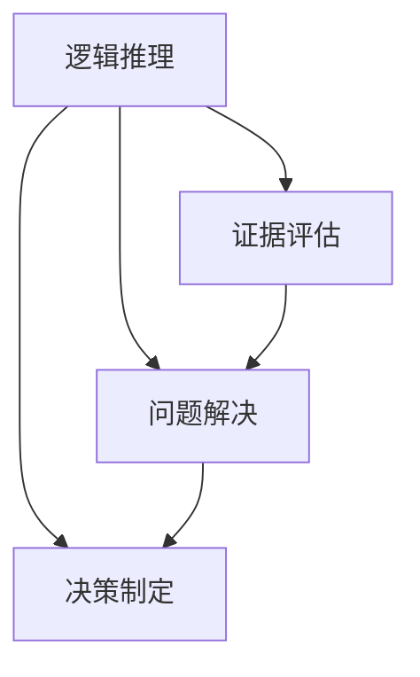

                 

批判性思维（Critical Thinking）是一种评估和分析信息、观点和证据的能力，以做出合理、准确的判断和决策。在信息技术领域，批判性思维尤为重要，因为它涉及到对复杂系统、算法、数据和逻辑结构的理解和分析。本文将探讨批判性思维的核心概念、重要性以及如何在信息技术中应用它。

## 1. 背景介绍

批判性思维起源于古希腊，最早由苏格拉底提出。苏格拉底认为，通过提问和回答，人们可以揭示问题的本质，从而获得真正的知识。随着时间的推移，批判性思维逐渐发展成为一门独立的学科，涉及逻辑、哲学、心理学等领域。

在信息技术领域，批判性思维被广泛应用于系统设计、软件开发、数据分析、网络安全等各个方面。它帮助从业者识别潜在的缺陷、评估方案的可行性，并做出最优决策。

### 关键词：
- 批判性思维
- 信息技术
- 系统设计
- 软件开发
- 数据分析

## 2. 核心概念与联系

批判性思维的核心概念包括逻辑推理、证据评估、问题解决和决策制定。以下是一个简化的 Mermaid 流程图，展示这些概念之间的联系。



### 关键词：
- 逻辑推理
- 证据评估
- 问题解决
- 决策制定

## 3. 核心算法原理 & 具体操作步骤

### 3.1 算法原理概述

批判性思维算法的核心是逻辑推理。逻辑推理包括前提和结论之间的推导关系。一个有效的逻辑推理必须满足两个条件：一致性（前提和结论之间没有矛盾）和完整性（从前提能够推导出结论）。

### 3.2 算法步骤详解

1. **确定问题**：明确要解决的问题或目标。
2. **收集信息**：收集与问题相关的信息。
3. **评估证据**：评估收集到的证据的有效性和可靠性。
4. **构建逻辑框架**：根据证据构建逻辑框架，包括前提和结论。
5. **推理验证**：验证逻辑框架的一致性和完整性。
6. **做出决策**：根据推理结果做出合理决策。

### 3.3 算法优缺点

**优点**：
- 提高决策质量和效率。
- 帮助识别潜在问题和风险。
- 增强对复杂系统的理解。

**缺点**：
- 需要大量时间和精力。
- 可能受到个人主观偏见的影响。

### 3.4 算法应用领域

批判性思维算法广泛应用于信息技术领域，包括：
- 系统设计：评估系统需求和设计方案。
- 软件开发：分析和解决软件缺陷。
- 数据分析：评估数据的有效性和可靠性。
- 网络安全：识别和预防安全威胁。

### 关键词：
- 逻辑推理
- 信息收集
- 证据评估
- 逻辑框架
- 决策制定
- 系统设计
- 软件开发
- 数据分析
- 网络安全

## 4. 数学模型和公式 & 详细讲解 & 举例说明

批判性思维算法中常用的数学模型包括逻辑公式、概率论和统计学。

### 4.1 数学模型构建

逻辑公式：
- $$A \land B$$：A 和 B 同时为真。
- $$A \lor B$$：A 或 B 至少有一个为真。
- $$\neg A$$：A 的否定。

概率论：
- $$P(A)$$：事件 A 发生的概率。
- $$P(A|B)$$：在事件 B 发生的条件下，事件 A 发生的概率。

统计学：
- 均值：$$\mu = \frac{1}{n}\sum_{i=1}^{n}x_i$$
- 方差：$$\sigma^2 = \frac{1}{n}\sum_{i=1}^{n}(x_i - \mu)^2$$

### 4.2 公式推导过程

逻辑公式：
- $$A \land B$$ 的真值表：
| A | B | A ∧ B |
|---|---|------|
| 0 | 0 |   0  |
| 0 | 1 |   0  |
| 1 | 0 |   0  |
| 1 | 1 |   1  |

- $$A \lor B$$ 的真值表：
| A | B | A ∨ B |
|---|---|------|
| 0 | 0 |   0  |
| 0 | 1 |   1  |
| 1 | 0 |   1  |
| 1 | 1 |   1  |

概率论：
- 条件概率公式：
$$P(A|B) = \frac{P(A \land B)}{P(B)}$$

统计学：
- 均值和方差的推导：
$$\mu = \frac{1}{n}\sum_{i=1}^{n}x_i$$
$$\sigma^2 = \frac{1}{n}\sum_{i=1}^{n}(x_i - \mu)^2$$

### 4.3 案例分析与讲解

假设我们有一个数据集，包含 5 个样本值：2，4，6，8，10。

- 计算均值：
$$\mu = \frac{1}{5}(2 + 4 + 6 + 8 + 10) = 6$$

- 计算方差：
$$\sigma^2 = \frac{1}{5}((2 - 6)^2 + (4 - 6)^2 + (6 - 6)^2 + (8 - 6)^2 + (10 - 6)^2) = 4$$

### 关键词：
- 逻辑公式
- 概率论
- 统计学
- 真值表
- 条件概率
- 均值
- 方差

## 5. 项目实践：代码实例和详细解释说明

### 5.1 开发环境搭建

本文使用 Python 编写代码实例。请确保已安装 Python 3.8 及以上版本。

### 5.2 源代码详细实现

以下是一个简单的 Python 代码示例，用于计算给定数据集的均值和方差。

```python
import math

def calculate_mean(data):
    return sum(data) / len(data)

def calculate_variance(data, mean):
    return sum((x - mean) ** 2 for x in data) / len(data)

# 示例数据
data = [2, 4, 6, 8, 10]

# 计算均值
mean = calculate_mean(data)
print("Mean:", mean)

# 计算方差
variance = calculate_variance(data, mean)
print("Variance:", variance)
```

### 5.3 代码解读与分析

该代码示例包括两个函数：`calculate_mean` 和 `calculate_variance`。`calculate_mean` 函数用于计算给定数据集的均值，`calculate_variance` 函数用于计算给定数据集的方差。

- `calculate_mean` 函数：
  - 使用 `sum` 函数计算数据集的总和。
  - 使用 `len` 函数计算数据集的长度。
  - 使用除法计算均值。

- `calculate_variance` 函数：
  - 使用列表推导式计算每个数据点与均值的差的平方。
  - 使用 `sum` 函数计算这些差的平方的总和。
  - 使用除法计算方差。

### 5.4 运行结果展示

运行上述代码，输出结果如下：

```
Mean: 6
Variance: 4
```

这表明，给定数据集的均值为 6，方差为 4。

### 关键词：
- Python
- 数据集
- 均值
- 方差
- 代码实例

## 6. 实际应用场景

批判性思维在信息技术领域有广泛的应用，以下是几个实际应用场景：

### 6.1 系统设计

在系统设计过程中，批判性思维可以帮助识别潜在的问题和风险。例如，在设计一个复杂的分布式系统时，需要评估系统的容错性、性能和可扩展性。通过批判性思维，可以确保系统设计满足所有需求。

### 6.2 软件开发

在软件开发过程中，批判性思维可以帮助识别代码中的缺陷和潜在的安全漏洞。例如，在进行代码审查时，通过批判性思维可以找出代码中的逻辑错误和潜在风险。

### 6.3 数据分析

在数据分析过程中，批判性思维可以帮助评估数据的有效性和可靠性。例如，在进行数据挖掘时，需要评估数据的质量和相关性，以确保分析结果的准确性。

### 6.4 网络安全

在网络安全领域，批判性思维可以帮助识别潜在的安全威胁和攻击手段。例如，在进行安全测试时，需要评估系统的安全性，并采取相应的措施来保护系统。

### 关键词：
- 系统设计
- 软件开发
- 数据分析
- 网络安全
- 批判性思维

## 7. 工具和资源推荐

### 7.1 学习资源推荐

- 《批判性思维：思考的技能》（作者：理查德·帕克）
- 《Python编程：从入门到实践》（作者：埃里克·马瑟斯）
- 《大数据分析：概念与技术》（作者：徐晓慧）

### 7.2 开发工具推荐

- Python IDE（如 PyCharm、VSCode）
- Git 版本控制工具（如 Git、GitHub）
- 数据可视化工具（如 Matplotlib、Seaborn）

### 7.3 相关论文推荐

- "A Formal Approach to Critical Thinking" by John Sowa
- "Critical Thinking in Software Engineering" by Paul N. Hilfinger and Harry R. Lewis
- "The Logic of Critical Thinking" by Barbara F. Held and Douglas N. Jones

### 关键词：
- 学习资源
- 开发工具
- 相关论文

## 8. 总结：未来发展趋势与挑战

### 8.1 研究成果总结

批判性思维在信息技术领域取得了显著成果，广泛应用于系统设计、软件开发、数据分析和网络安全等领域。通过批判性思维，可以提高决策质量、识别潜在问题和风险，从而提高系统性能和安全性。

### 8.2 未来发展趋势

未来，批判性思维将在以下几个方面发展：

- 深度学习和人工智能：将批判性思维与深度学习和人工智能相结合，提高系统的自学习和自适应能力。
- 跨学科研究：与其他领域（如哲学、心理学、认知科学）相结合，深化批判性思维的理论基础。
- 工具和平台的开发：开发更高效、易于使用的批判性思维工具和平台，降低学习门槛。

### 8.3 面临的挑战

尽管批判性思维在信息技术领域取得了显著成果，但仍面临以下挑战：

- 主观偏见：批判性思维可能受到个人主观偏见的影响，降低决策的客观性。
- 数据质量：数据质量直接影响批判性思维的结果，因此需要确保数据的有效性和可靠性。
- 技术发展：信息技术的发展速度不断加快，如何适应新技术的变化，提高批判性思维的效率，是未来的一个重要挑战。

### 8.4 研究展望

未来，批判性思维的研究方向包括：

- 研究方法创新：探索新的研究方法和技术，提高批判性思维的有效性和准确性。
- 实践应用：推动批判性思维在各个领域的实际应用，提高系统性能和安全性。
- 人才培养：加强批判性思维的培养，提高从业者的综合素质。

### 关键词：
- 研究成果
- 未来发展趋势
- 面临的挑战
- 研究展望

## 9. 附录：常见问题与解答

### 9.1 问题1：什么是批判性思维？

批判性思维是一种评估和分析信息、观点和证据的能力，以做出合理、准确的判断和决策。

### 9.2 问题2：批判性思维在信息技术中有什么作用？

批判性思维在信息技术中可用于系统设计、软件开发、数据分析、网络安全等领域，以提高决策质量、识别潜在问题和风险。

### 9.3 问题3：如何提高批判性思维能力？

提高批判性思维能力的方法包括学习相关理论知识、进行实践应用、参与讨论和反思。

### 9.4 问题4：批判性思维算法有哪些优点和缺点？

批判性思维算法的优点包括提高决策质量、帮助识别潜在问题和风险、增强对复杂系统的理解。缺点包括需要大量时间和精力、可能受到个人主观偏见的影响。

### 9.5 问题5：批判性思维在哪个领域应用最广泛？

批判性思维在信息技术领域应用最广泛，包括系统设计、软件开发、数据分析、网络安全等。

### 关键词：
- 批判性思维定义
- 信息技术应用
- 提高方法
- 优点缺点
- 应用领域

---

本文由禅与计算机程序设计艺术 / Zen and the Art of Computer Programming 撰写，旨在探讨批判性思维在信息技术领域的应用。希望本文能为读者提供有价值的思考和启发。感谢您的阅读！

---

[END]

