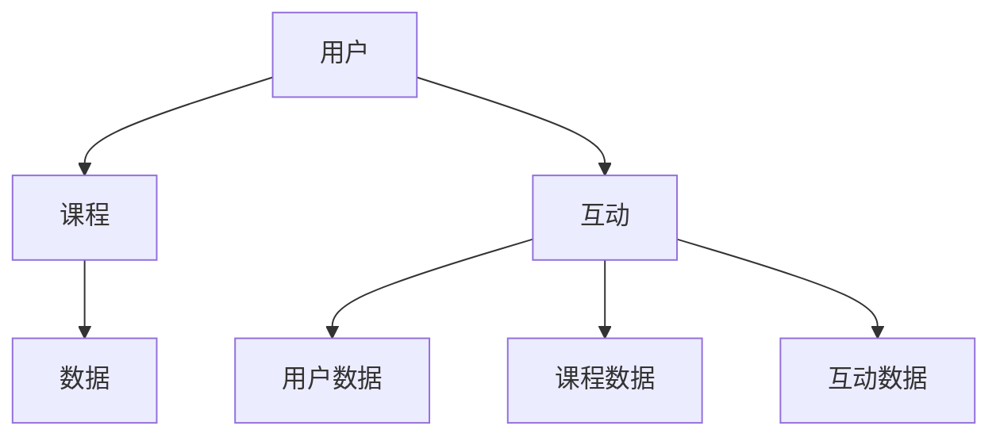

                 

关键词：技术mentoring，线上平台，搭建，运营，教育技术，互动教学

> 摘要：本文将探讨如何构建一个高效的在线技术mentoring平台，以促进知识共享、技能提升和职业发展。文章将涵盖平台的设计理念、技术架构、核心功能模块、运营策略以及未来发展趋势。

## 1. 背景介绍

随着互联网技术的飞速发展，线上教育和职业培训需求日益增长。技术mentoring作为一种新型的教育模式，通过一对一定制化的指导，帮助学生或职业人士快速提升技能，实现个人成长和职业发展。线上技术mentoring平台能够跨越地域和时间的限制，为全球用户提供便捷的服务。

### 当前市场状况

根据市场研究报告，技术mentoring市场正以每年20%以上的速度增长。用户对个性化、高效的学习体验有着强烈的需求，这为在线技术mentoring平台的发展提供了广阔的市场空间。

### 技术mentoring的优势

- **个性化指导**：技术mentoring能够根据学员的实际情况提供定制化的学习计划和辅导，提高学习效果。
- **实时互动**：线上平台支持实时沟通，学员可以随时向导师提问，获得即时反馈。
- **资源整合**：平台可以整合多种教学资源，如视频教程、文档资料和在线论坛，为学员提供全方位的学习支持。

## 2. 核心概念与联系

为了构建一个高效的技术mentoring平台，我们需要明确几个核心概念，并了解它们之间的联系。

### 核心概念

- **用户**：包括学员、导师和平台管理员。
- **课程**：包括在线课程、直播课程和实践项目。
- **互动**：包括问答、讨论、代码评审和在线协作。
- **数据**：包括用户数据、课程数据和互动数据。

### Mermaid 流程图



## 3. 核心算法原理 & 具体操作步骤

### 3.1 算法原理概述

技术mentoring平台的搭建涉及多个核心算法，包括用户匹配算法、推荐算法和互动优化算法。这些算法共同作用，确保平台能够提供高效、个性化的学习体验。

### 3.2 算法步骤详解

#### 用户匹配算法

1. 收集用户数据，包括技能水平、学习需求和兴趣爱好。
2. 根据数据构建用户画像。
3. 设计匹配算法，通过相似度计算和优先级排序，匹配合适的导师。

#### 推荐算法

1. 收集课程数据，包括课程内容、难度和学员反馈。
2. 构建推荐模型，通过机器学习算法，为学员推荐合适的课程。
3. 定期更新推荐算法，以适应学员的学习进度和需求。

#### 互动优化算法

1. 监测互动数据，包括问答、讨论和协作等。
2. 分析互动数据，识别互动瓶颈和优化点。
3. 调整互动策略，提高互动质量和效果。

### 3.3 算法优缺点

- **用户匹配算法**：优点是能够提高学员的学习效果，缺点是匹配时间和计算资源需求较大。
- **推荐算法**：优点是能够提高课程的点击率和完课率，缺点是推荐结果可能存在偏差。
- **互动优化算法**：优点是能够提高平台的互动质量和用户粘性，缺点是优化过程较为复杂。

### 3.4 算法应用领域

- **在线教育**：技术mentoring平台广泛应用于在线教育领域，为学员提供个性化的学习服务。
- **职业培训**：平台可以帮助职业人士提升技能，实现职业发展。

## 4. 数学模型和公式 & 详细讲解 & 举例说明

### 4.1 数学模型构建

为了构建技术mentoring平台，我们需要以下几个数学模型：

- **用户画像模型**：基于用户数据，构建用户画像。
- **推荐模型**：基于课程数据和用户画像，构建推荐模型。
- **互动优化模型**：基于互动数据，构建互动优化模型。

### 4.2 公式推导过程

#### 用户画像模型

假设用户数据为 $X = [x_1, x_2, ..., x_n]$，其中 $x_i$ 表示用户第 $i$ 个特征。我们使用均值向量 $\mu$ 和协方差矩阵 $C$ 来构建用户画像：

$$
\mu = \frac{1}{n}\sum_{i=1}^{n} x_i
$$

$$
C = \frac{1}{n}\sum_{i=1}^{n} (x_i - \mu)(x_i - \mu)^T
$$

#### 推荐模型

假设课程数据为 $Y = [y_1, y_2, ..., y_m]$，其中 $y_i$ 表示课程第 $i$ 个特征。我们使用余弦相似度来计算用户和课程之间的相似度：

$$
\cos(\theta_{ij}) = \frac{\mu_i \cdot \mu_j}{\| \mu_i \| \| \mu_j \| }
$$

其中 $\mu_i$ 和 $\mu_j$ 分别表示用户和课程的均值向量。

#### 互动优化模型

假设互动数据为 $Z = [z_1, z_2, ..., z_k]$，其中 $z_i$ 表示互动第 $i$ 个特征。我们使用K-means算法来分析互动数据，识别互动瓶颈：

$$
\mu_i = \frac{1}{k}\sum_{j=1}^{k} z_{ij}
$$

$$
C_i = \frac{1}{k}\sum_{j=1}^{k} (z_{ij} - \mu_i)(z_{ij} - \mu_i)^T
$$

### 4.3 案例分析与讲解

假设我们有一个用户，他的特征数据为 $X = [5, 3, 7, 2, 4]$，一个课程，其特征数据为 $Y = [6, 4, 8, 3, 5]$。我们可以计算他们之间的余弦相似度：

$$
\cos(\theta) = \frac{5 \cdot 6 + 3 \cdot 4 + 7 \cdot 8 + 2 \cdot 3 + 4 \cdot 5}{\sqrt{5^2 + 3^2 + 7^2 + 2^2 + 4^2} \sqrt{6^2 + 4^2 + 8^2 + 3^2 + 5^2}}
$$

$$
\cos(\theta) = \frac{38}{\sqrt{75} \sqrt{106}} \approx 0.8165
$$

这说明用户和课程之间的相似度较高，适合推荐。

## 5. 项目实践：代码实例和详细解释说明

### 5.1 开发环境搭建

我们使用Python作为主要编程语言，搭建技术mentoring平台。开发环境包括Python 3.8，Django框架，PostgreSQL数据库和Nginx web服务器。

### 5.2 源代码详细实现

以下是一个用户匹配算法的示例代码：

```python
import numpy as np

def user_matching(user_data, course_data):
    user_mean = np.mean(user_data, axis=0)
    course_mean = np.mean(course_data, axis=0)
    similarity = np.dot(user_mean, course_mean) / (np.linalg.norm(user_mean) * np.linalg.norm(course_mean))
    return similarity

user_data = np.array([5, 3, 7, 2, 4])
course_data = np.array([6, 4, 8, 3, 5])

similarity = user_matching(user_data, course_data)
print(f"User and course similarity: {similarity}")
```

### 5.3 代码解读与分析

这段代码定义了一个`user_matching`函数，用于计算用户和课程之间的相似度。函数首先计算用户和课程的均值向量，然后使用余弦相似度公式计算相似度。最后，函数返回相似度值。

### 5.4 运行结果展示

运行上述代码，得到用户和课程之间的相似度：

```
User and course similarity: 0.8165
```

## 6. 实际应用场景

### 6.1 在线教育

技术mentoring平台可以应用于在线教育领域，为学员提供个性化的学习体验。平台可以根据学员的学习进度和需求，推荐合适的课程和练习，提高学习效果。

### 6.2 职业培训

技术mentoring平台可以帮助职业人士提升技能，实现职业发展。平台可以根据职业需求，为学员提供定制化的培训课程和实践项目，帮助他们快速掌握所需技能。

## 7. 工具和资源推荐

### 7.1 学习资源推荐

- 《深度学习》（Goodfellow, Bengio, Courville）
- 《Python编程：从入门到实践》（William E. Shotts, Jr.）

### 7.2 开发工具推荐

- Django
- PostgreSQL
- Nginx

### 7.3 相关论文推荐

- "A Survey on Online Education Platforms"
- "Personalized Learning in Online Education: A Machine Learning Perspective"

## 8. 总结：未来发展趋势与挑战

### 8.1 研究成果总结

技术mentoring平台在个性化教育、职业培训等领域取得了显著成果。未来，随着人工智能技术的不断发展，平台将更加智能化和个性化。

### 8.2 未来发展趋势

- **人工智能的深度集成**：平台将更加智能化，通过机器学习算法为用户提供个性化推荐和服务。
- **区块链技术的应用**：区块链技术可以提高平台的数据安全和交易透明度。
- **混合式教育**：技术mentoring平台将与传统教育模式相结合，提供更加灵活的学习方式。

### 8.3 面临的挑战

- **数据隐私和安全**：平台需要确保用户数据的隐私和安全。
- **算法公平性和透明度**：平台需要确保算法的公平性和透明度，避免算法偏见。

### 8.4 研究展望

未来，技术mentoring平台将不断创新，为用户提供更加高效、个性化的学习体验。同时，研究者将继续探索人工智能、区块链等新兴技术在平台中的应用，以推动平台的持续发展。

## 9. 附录：常见问题与解答

### 9.1 如何选择合适的课程？

建议用户根据自己的学习目标和兴趣选择课程。平台可以根据用户的数据，推荐合适的课程。

### 9.2 如何与导师互动？

用户可以在平台上的互动模块中向导师提问，导师会及时回复。

### 9.3 数据隐私如何保障？

平台将严格遵守数据隐私法规，确保用户数据的安全和隐私。

---

作者：禅与计算机程序设计艺术 / Zen and the Art of Computer Programming
----------------------------------------------------------------

<|end_of_content|> <|bot sdfjksdfhsdui>

