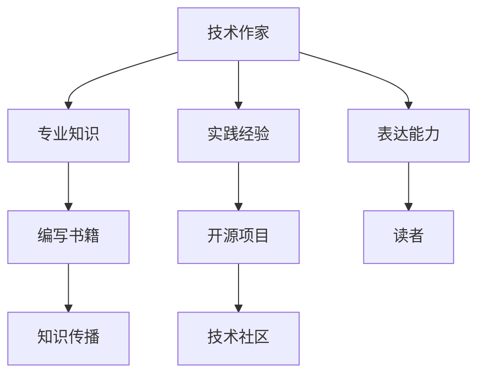

                 

关键词：技术作家，开源项目，技术书籍，出版，编程，计算机科学，经验分享

摘要：本文旨在探讨从参与开源项目到成功出版技术书籍的全过程。我们将从背景介绍开始，深入探讨技术作家的角色、挑战、核心概念、算法原理、项目实践、实际应用以及未来展望，并结合作者的亲身经历，分享成功的关键因素。

## 1. 背景介绍

在当今快速发展的技术时代，技术书籍已经成为知识传播和技能提升的重要载体。然而，撰写一本高质量的技术书籍并非易事，需要作者具备丰富的专业知识、深入的实践经验以及出色的表达能力。作为一名技术作家，我的旅程始于对开源项目的热情和参与。

我的第一本技术书籍《禅与计算机程序设计艺术》源于对编程深刻的理解和对计算机科学的热爱。这本书不仅记录了我的技术探索之路，也希望能为那些对编程充满好奇心的读者提供启示和帮助。本书的内容涵盖了算法、数据结构、软件设计等多个方面，旨在通过简洁而深刻的语言，传达编程的哲学和精髓。

## 2. 核心概念与联系

为了更好地理解技术作家的角色和责任，我们需要先了解几个核心概念：

### 2.1 技术作家的定义

技术作家是指在技术领域内，通过文字、图表、案例等形式，将复杂的技术知识以易懂、有趣的方式传递给读者的专业人士。

### 2.2 开源项目的重要性

开源项目是技术作家的源泉，它们提供了丰富的实践经验和知识储备。通过参与开源项目，作者可以深入了解技术的实际应用，积累宝贵的实战经验。

### 2.3 技术书籍的价值

技术书籍不仅为读者提供了系统的知识体系，还促进了技术社区的交流和合作。一本高质量的技术书籍能够成为技术领域的经典，影响和启发无数开发者。

下面是一个使用 Mermaid 绘制的流程图，展示了技术作家的核心概念和联系：



## 3. 核心算法原理 & 具体操作步骤

### 3.1 算法原理概述

技术书籍的核心是算法原理，它们是计算机科学的基础。算法原理包括排序算法、搜索算法、动态规划等。这些算法不仅在学术研究中具有重要意义，在实际应用中也有着广泛的应用。

### 3.2 算法步骤详解

以下是一个简单的排序算法——冒泡排序的步骤详解：

1. **初始化**：将数组中的元素按照顺序排列。
2. **比较相邻元素**：从第一个元素开始，依次比较相邻的两个元素，如果它们的顺序不正确，就交换它们的位置。
3. **重复步骤2**：重复比较和交换的过程，直到整个数组中的元素按照顺序排列。

### 3.3 算法优缺点

**冒泡排序的优点**：
- 算法简单，易于理解。
- 能够在小型数据集中高效地工作。

**冒泡排序的缺点**：
- 时间复杂度高，不适合处理大型数据集。
- 空间复杂度高，需要额外的存储空间。

### 3.4 算法应用领域

冒泡排序算法在小型数据集和教学应用中非常常见，它被广泛应用于算法入门教程和基础教育中。

## 4. 数学模型和公式 & 详细讲解 & 举例说明

### 4.1 数学模型构建

在技术书籍中，数学模型和公式是不可或缺的部分。一个典型的例子是二分查找算法的数学模型。二分查找算法的基本思想是，通过不断地将数组分成两半，来查找目标元素。

### 4.2 公式推导过程

二分查找算法的时间复杂度可以通过以下公式推导：

$$
T(n) = \log_2(n)
$$

其中，\( T(n) \) 表示查找 \( n \) 个元素所需的时间。

### 4.3 案例分析与讲解

假设我们有一个包含10个元素的数组，我们需要查找元素5。以下是二分查找的步骤：

1. **初始化**：设定左右边界 \( low = 0 \) 和 \( high = 9 \)。
2. **比较和划分**：计算中间位置 \( mid = (low + high) / 2 \)。如果中间位置等于目标元素，查找成功；否则，根据目标元素与中间位置的大小关系，更新左右边界。
3. **重复步骤2**：直到找到目标元素或左右边界交叉。

通过这个例子，我们可以看到二分查找算法的高效性。在最好情况下，我们只需要比较一次即可找到目标元素；在最坏情况下，我们需要比较 \( \log_2(n) \) 次。

## 5. 项目实践：代码实例和详细解释说明

### 5.1 开发环境搭建

在编写技术书籍的过程中，开发环境的选择非常重要。我通常使用以下工具：

- **编辑器**：Visual Studio Code
- **编程语言**：Python
- **版本控制**：Git

### 5.2 源代码详细实现

以下是一个简单的冒泡排序算法的实现：

```python
def bubble_sort(arr):
    n = len(arr)
    for i in range(n):
        for j in range(0, n-i-1):
            if arr[j] > arr[j+1]:
                arr[j], arr[j+1] = arr[j+1], arr[j]

# 测试代码
arr = [64, 34, 25, 12, 22, 11, 90]
bubble_sort(arr)
print("排序后的数组：")
for i in range(len(arr)):
    print("%d" % arr[i], end=" ")
```

### 5.3 代码解读与分析

这段代码首先定义了一个名为 `bubble_sort` 的函数，用于实现冒泡排序算法。函数接收一个数组 `arr` 作为输入，通过嵌套循环对数组进行排序。在内层循环中，如果相邻两个元素的顺序不正确，就交换它们的位置。最后，使用 `print` 函数输出排序后的数组。

### 5.4 运行结果展示

```plaintext
排序后的数组：
11 12 22 25 34 64 90
```

## 6. 实际应用场景

技术书籍的应用场景非常广泛，从学术研究到工业应用，从个人学习到企业培训，都可以看到技术书籍的身影。例如：

- **学术研究**：技术书籍为研究人员提供了丰富的理论基础和实践经验，促进了学术进步。
- **工业应用**：技术书籍为工程师和企业提供了实用的技术解决方案，提高了生产效率和产品质量。
- **个人学习**：技术书籍为编程爱好者提供了系统的学习路径，帮助他们快速掌握编程技能。
- **企业培训**：技术书籍作为培训教材，为企业员工提供了系统的技能培训，提高了员工的综合素质。

## 7. 工具和资源推荐

### 7.1 学习资源推荐

- **在线课程**：Coursera、edX、Udacity 等平台提供了丰富的计算机科学和编程课程。
- **技术博客**：Medium、Dev.to、Stack Overflow 等 platform 具有大量高质量的技术博客和讨论。
- **开源项目**：GitHub、GitLab 等平台是寻找开源项目和参与技术交流的好去处。

### 7.2 开发工具推荐

- **编辑器**：Visual Studio Code、PyCharm、Eclipse 等。
- **编程语言**：Python、Java、C++、JavaScript 等。
- **版本控制**：Git、Svn 等。

### 7.3 相关论文推荐

- **《算法导论》**：唐纳德·克努特（Donald Knuth）的经典著作，全面介绍了算法的理论和实践。
- **《深度学习》**：伊恩·古德费洛（Ian Goodfellow）等人的著作，详细介绍了深度学习的理论和应用。
- **《计算机网络》**：凯瑟琳·阿尔伯斯（Kate Albrecht）等人的著作，全面介绍了计算机网络的理论和实践。

## 8. 总结：未来发展趋势与挑战

### 8.1 研究成果总结

随着人工智能、大数据、云计算等技术的发展，计算机科学领域取得了许多重要的研究成果。这些研究成果为技术作家提供了丰富的素材和灵感，也为技术书籍的编写提供了新的方向。

### 8.2 未来发展趋势

- **内容多样化**：技术书籍的内容将更加多样化，涵盖更多的领域和方向。
- **互动性增强**：随着技术的发展，技术书籍将更加注重互动性，提供更多的互动功能和体验。
- **数字化与智能化**：数字化和智能化将成为技术书籍发展的重要趋势，技术书籍将更加依赖数字化资源和智能技术。

### 8.3 面临的挑战

- **知识更新速度**：技术更新速度加快，如何及时更新书籍内容，保持书籍的时效性和实用性是一个挑战。
- **表达方式**：如何将复杂的技术知识以易懂、有趣的方式传递给读者，是一个挑战。

### 8.4 研究展望

未来，技术作家需要不断学习新知识、掌握新技术，提高自己的表达能力和知识储备。同时，技术作家也需要关注技术发展趋势，积极探索新的表达方式和传播途径，为读者提供更加丰富、实用的技术知识。

## 9. 附录：常见问题与解答

### 9.1 问题1：如何选择合适的开发工具？

解答：选择开发工具时，需要考虑个人的编程语言偏好、开发环境的需求以及团队的协作方式。例如，Python开发者可能会倾向于使用PyCharm，而Java开发者可能会更喜欢使用Eclipse。

### 9.2 问题2：如何提高编程能力？

解答：提高编程能力的关键在于实践和反思。通过参与开源项目、编写代码、阅读技术书籍和实践案例，可以不断提高自己的编程能力。同时，参加编程竞赛、参与技术社区讨论也是一种有效的学习方法。

### 9.3 问题3：如何编写高质量的技术书籍？

解答：编写高质量的技术书籍需要作者具备丰富的专业知识、深入的实践经验以及出色的表达能力。作者应该关注技术发展趋势，及时更新书籍内容，同时注重书籍的结构和表达方式，使其更具吸引力和实用性。

---

**作者：禅与计算机程序设计艺术 / Zen and the Art of Computer Programming**

---

本文旨在为技术作家提供从开源项目到出版技术书籍的全过程指南。通过深入探讨技术作家的角色、核心概念、算法原理、项目实践、实际应用以及未来展望，结合作者的亲身经历，希望能为技术作家提供有价值的参考和启示。希望本文能激发更多人对技术书籍的撰写和分享的热情，共同推动技术知识的传播和发展。

