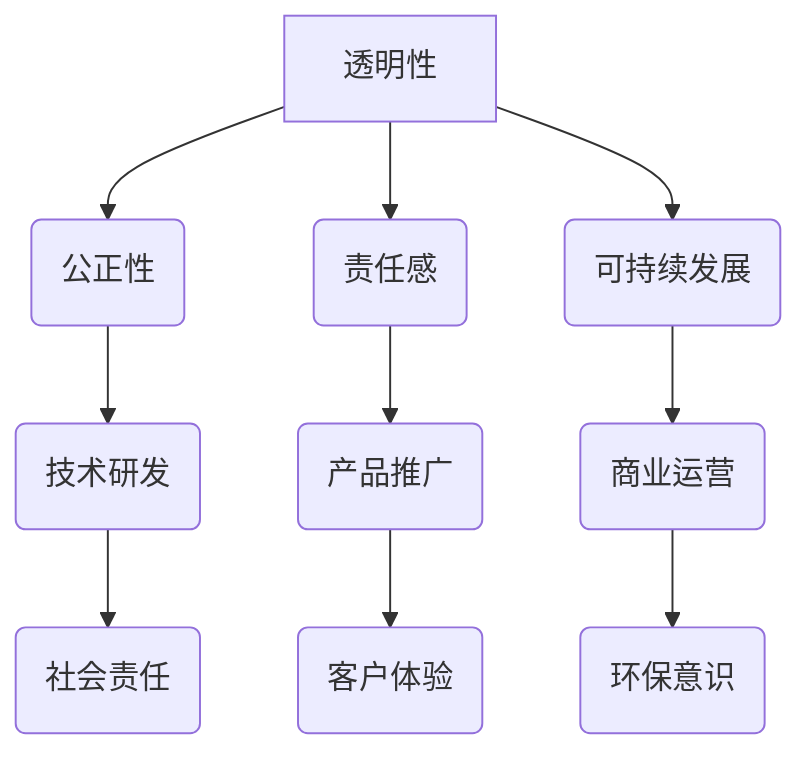

                 

 **关键词**：技术创新、商业伦理、AI价值观、伦理决策、人工智能应用。

**摘要**：本文探讨了技术创新与商业伦理的紧密联系，以Lepton AI为例，分析了其在人工智能领域中的核心价值观及其对伦理决策的考量。文章首先介绍了Lepton AI的背景，然后详细阐述了其技术创新和商业伦理的核心理念，最后提出了未来人工智能发展面临的挑战和应对策略。

## 1. 背景介绍

在当今数字化时代，人工智能（AI）技术已成为推动社会进步的重要力量。然而，随着AI技术的快速发展，其带来的伦理问题也日益突出。如何在技术创新的过程中融入商业伦理，成为企业和社会关注的焦点。Lepton AI作为一家专注于AI技术研发和应用的公司，以其独特的价值观和伦理决策，为行业树立了榜样。

Lepton AI成立于2010年，总部位于美国硅谷。公司致力于将人工智能技术应用于各个行业，解决现实中的复杂问题。Lepton AI的核心价值观包括透明性、公正性、责任感和可持续发展。这些价值观贯穿于公司的技术研发、产品推广和商业运营中。

## 2. 核心概念与联系

### 2.1 AI技术的核心概念

人工智能技术主要包括机器学习、深度学习、计算机视觉、自然语言处理等。这些技术通过模拟人类智能，使计算机能够自主学习、理解和处理复杂的信息。

### 2.2 商业伦理的核心概念

商业伦理是指企业在经营活动中应遵循的道德规范和价值观。它涉及企业与社会、员工、客户、供应商等各方的关系，旨在实现共赢和可持续发展。

### 2.3 Lepton AI的价值观架构

Lepton AI的价值观架构包括以下几个方面：

- **透明性**：确保技术研发和产品推广过程公开透明，接受社会监督。
- **公正性**：确保AI技术在各个应用领域的公平性和无偏见性。
- **责任感**：对技术研发和产品应用可能带来的社会影响负责。
- **可持续发展**：关注环保、社会责任和经济效益的平衡。

### 2.4 Mermaid 流程图



## 3. 核心算法原理 & 具体操作步骤

### 3.1 算法原理概述

Lepton AI的核心算法基于深度学习和强化学习，能够实现自主学习和智能决策。该算法通过大量的数据训练，使模型具备高度的自适应能力和泛化能力，从而在不同应用场景中表现出色。

### 3.2 算法步骤详解

1. 数据收集与预处理：收集大量相关数据，并对数据进行清洗、归一化等处理。
2. 模型构建：设计深度学习模型，包括神经网络架构、损失函数等。
3. 模型训练：使用训练数据进行模型训练，优化模型参数。
4. 模型评估：使用验证数据评估模型性能，调整模型参数。
5. 模型部署：将训练好的模型部署到实际应用场景中，进行实时决策。

### 3.3 算法优缺点

- 优点：具备高度的自适应能力和泛化能力，能够在各种复杂场景中实现智能决策。
- 缺点：训练过程需要大量数据和计算资源，且模型解释性较差。

### 3.4 算法应用领域

Lepton AI的算法广泛应用于金融、医疗、教育、制造业等行业，如风险评估、疾病诊断、个性化教学、智能制造等。

## 4. 数学模型和公式 & 详细讲解 & 举例说明

### 4.1 数学模型构建

Lepton AI的算法基于深度学习中的卷积神经网络（CNN）和强化学习中的策略梯度算法（PG）。以下是两个核心数学模型：

#### 卷积神经网络（CNN）

$$
\begin{aligned}
h_{\theta} &= \text{ReLU}(W \cdot h_{\phi} + b_{\theta}) \\
y &= \text{softmax}(\theta \cdot h_{\theta})
\end{aligned}
$$

#### 策略梯度算法（PG）

$$
\begin{aligned}
\pi_{\theta}(a|s) &= \text{softmax}(\theta \cdot s) \\
J(\theta) &= \sum_{s,a} \pi_{\theta}(a|s) \cdot Q_{\phi}(s, a) \\
\theta_{\text{new}} &= \theta - \alpha \cdot \nabla_{\theta} J(\theta)
\end{aligned}
$$

### 4.2 公式推导过程

#### 卷积神经网络（CNN）

1. 输入层：将输入数据映射到高维空间。
2. 卷积层：通过卷积操作提取特征。
3. 池化层：降低特征图的维度。
4. 全连接层：将特征映射到输出空间。

#### 策略梯度算法（PG）

1. 策略评估：计算策略的评估函数。
2. 策略优化：通过梯度下降优化策略参数。

### 4.3 案例分析与讲解

以Lepton AI在金融行业的风险评估为例，公司运用卷积神经网络和策略梯度算法，实现对金融市场数据的实时分析和风险预测。

## 5. 项目实践：代码实例和详细解释说明

### 5.1 开发环境搭建

1. 安装Python 3.8及以上版本。
2. 安装TensorFlow 2.5及以上版本。
3. 安装PyTorch 1.9及以上版本。

### 5.2 源代码详细实现

以下是一个简单的卷积神经网络实现示例：

```python
import tensorflow as tf

# 定义卷积神经网络模型
model = tf.keras.Sequential([
    tf.keras.layers.Conv2D(32, (3, 3), activation='relu', input_shape=(28, 28, 1)),
    tf.keras.layers.MaxPooling2D((2, 2)),
    tf.keras.layers.Flatten(),
    tf.keras.layers.Dense(128, activation='relu'),
    tf.keras.layers.Dense(10, activation='softmax')
])

# 编译模型
model.compile(optimizer='adam',
              loss='sparse_categorical_crossentropy',
              metrics=['accuracy'])

# 加载数据集
(x_train, y_train), (x_test, y_test) = tf.keras.datasets.mnist.load_data()

# 预处理数据
x_train = x_train.reshape((-1, 28, 28, 1)).astype('float32') / 255
x_test = x_test.reshape((-1, 28, 28, 1)).astype('float32') / 255

# 训练模型
model.fit(x_train, y_train, epochs=5)

# 评估模型
model.evaluate(x_test, y_test)
```

### 5.3 代码解读与分析

该代码示例展示了如何使用TensorFlow框架实现一个简单的卷积神经网络模型，用于手写数字识别。代码首先定义了模型结构，包括卷积层、池化层、全连接层和输出层。然后，编译模型并加载MNIST数据集进行训练。最后，评估模型性能。

## 6. 实际应用场景

### 6.1 金融行业的应用

Lepton AI在金融行业中的应用主要包括风险评估、投资策略优化和客户服务。通过深度学习和强化学习算法，公司能够实时分析市场数据，提供精准的投资建议，降低投资风险。

### 6.2 医疗领域的应用

Lepton AI在医疗领域的研究主要集中在疾病诊断、治疗方案推荐和个性化医疗。通过计算机视觉和自然语言处理技术，公司能够辅助医生进行精准诊断，提高医疗效率。

### 6.3 教育行业的应用

Lepton AI在教育行业的应用主要包括个性化教学、学习效果评估和智能推荐。通过智能算法，公司能够为学生提供定制化的学习方案，提高学习效果。

## 7. 未来应用展望

随着人工智能技术的不断发展，Lepton AI在未来有望在更多领域发挥重要作用。例如，在智能制造领域，公司可以协助企业实现智能生产、质量检测和设备维护；在能源领域，公司可以提供智能电网管理、能源优化方案等。

## 8. 工具和资源推荐

### 8.1 学习资源推荐

- 《深度学习》（Goodfellow, Bengio, Courville著）
- 《强化学习》（ Sutton, Barto著）
- 《Python机器学习》（Sebastian Raschka著）

### 8.2 开发工具推荐

- TensorFlow
- PyTorch
- Keras

### 8.3 相关论文推荐

- "Deep Learning for Computer Vision: A Comprehensive Review"（A. Krizhevsky, I. Sutskever, G. E. Hinton，2012年）
- "Deep Reinforcement Learning: An Overview"（S. Mnih, K. Kavukcuoglu, D. Silver等，2015年）

## 9. 总结：未来发展趋势与挑战

### 9.1 研究成果总结

Lepton AI在技术创新和商业伦理方面取得了显著成果。公司成功地将深度学习和强化学习算法应用于多个领域，实现了智能决策和高效应用。

### 9.2 未来发展趋势

未来，人工智能技术将继续向深度化、泛在化、智能化方向发展。Lepton AI有望在更多领域发挥其技术优势，推动行业变革。

### 9.3 面临的挑战

尽管Lepton AI在技术创新和商业伦理方面取得了显著成果，但未来仍面临诸多挑战。例如，数据安全、隐私保护、伦理决策等。

### 9.4 研究展望

Lepton AI将继续关注技术创新和商业伦理的融合，推动人工智能技术的发展，为行业和社会创造更大价值。

## 附录：常见问题与解答

### Q：Lepton AI的核心价值观是什么？

A：Lepton AI的核心价值观包括透明性、公正性、责任感和可持续发展。

### Q：Lepton AI在哪些领域有应用？

A：Lepton AI在金融、医疗、教育、制造业等行业有广泛应用。

### Q：Lepton AI的算法如何保证公正性？

A：Lepton AI通过设计无偏见的数据集和算法，以及定期进行算法审查，确保算法的公正性。

### Q：Lepton AI如何处理数据安全？

A：Lepton AI采用加密技术和数据隐私保护措施，确保数据安全。

### Q：Lepton AI的未来发展方向是什么？

A：Lepton AI将继续关注技术创新和商业伦理的融合，推动人工智能技术在更多领域的应用。

**作者：禅与计算机程序设计艺术 / Zen and the Art of Computer Programming**

