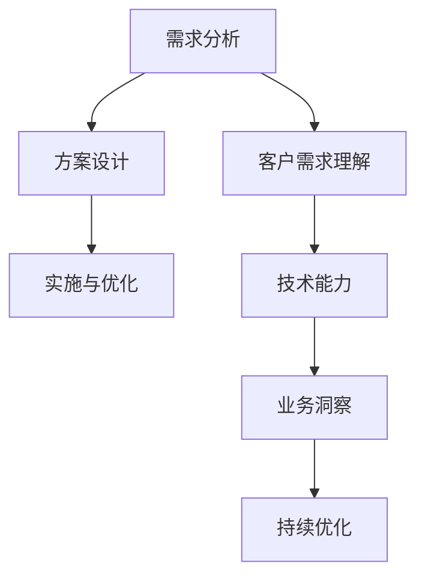

                 

关键词：高价值服务，技术咨询，商业洞察，技术趋势，客户需求，解决方案设计。

> 摘要：本文将探讨在当前快速变化的技术环境中，如何通过提供高价值服务来满足客户的实际需求，并维持企业的长期竞争力。文章将涵盖技术咨询的核心概念、服务模式、市场趋势、案例研究和未来展望。

## 1. 背景介绍

随着全球数字化转型的加速，企业和组织越来越依赖技术来实现其战略目标。然而，技术领域的发展迅速，新工具、新平台、新算法层出不穷，这让许多企业在选择和实施合适的技术解决方案时感到困惑。这种情况下，专业的技术咨询服务显得尤为重要。高价值的服务不仅仅是提供技术方案，更是通过深入理解客户需求，帮助客户实现业务目标。

### 1.1 技术咨询的定义与作用

技术咨询是一种专业服务，通过专家团队的技术能力和业务洞察，为客户提供决策支持和解决方案。其主要作用包括：

- **需求分析**：深入了解客户的业务流程和痛点，准确识别需求。
- **方案设计**：基于客户需求，设计最适合的技术解决方案。
- **实施与优化**：协助客户实施技术方案，并提供后续的优化支持。

### 1.2 当前市场趋势

当前，市场对技术咨询服务的需求日益增长，主要趋势包括：

- **数字化转型**：企业纷纷将数字化转型作为核心战略，追求更高的效率和灵活性。
- **云计算与大数据**：云服务和大数据分析成为企业数据管理和决策的重要工具。
- **人工智能与自动化**：AI和自动化技术的应用，帮助企业降低成本，提高生产效率。
- **合规与安全**：随着法规的不断完善，企业在信息安全、数据隐私等方面的需求日益增加。

## 2. 核心概念与联系

### 2.1 高价值服务的核心概念

高价值服务不仅仅是提供技术解决方案，更包括以下核心概念：

- **客户需求理解**：深入了解客户的核心问题和业务目标。
- **技术能力**：拥有广泛的技术知识和实践经验。
- **业务洞察**：能够将技术优势与客户业务战略相结合。
- **持续优化**：不断调整和优化解决方案，以适应不断变化的环境。

### 2.2 服务模式

高价值技术服务通常采用以下几种模式：

- **定制化服务**：根据客户的具体需求，量身定制解决方案。
- **咨询与培训**：提供专业咨询和培训，提升客户的技术能力和管理水平。
- **战略合作**：与客户建立长期合作关系，共同推进业务发展。
- **外包服务**：为客户提供部分或全部的技术服务外包。

### 2.3 架构的 Mermaid 流程图



## 3. 核心算法原理 & 具体操作步骤

### 3.1 算法原理概述

技术咨询的核心在于理解和解决客户问题。其原理可以概括为：

- **问题定义**：准确识别和描述客户的问题。
- **需求分析**：深入挖掘客户的业务需求和痛点。
- **方案设计**：基于分析结果，设计符合客户需求的技术方案。
- **实施与优化**：执行方案，并根据反馈进行调整和优化。

### 3.2 算法步骤详解

1. **需求分析**：与客户进行深入沟通，了解业务流程、痛点、目标等。
2. **方案设计**：结合技术能力和客户需求，设计可行的技术方案。
3. **方案评估**：评估方案的可行性、成本、风险等。
4. **方案实施**：协助客户实施技术方案，并进行必要的培训。
5. **监控与优化**：持续监控方案的执行效果，并根据反馈进行优化。

### 3.3 算法优缺点

- **优点**：能够有效解决客户的实际问题，提高业务效率。
- **缺点**：需要耗费大量时间和资源，且客户需求可能会发生变化。

### 3.4 算法应用领域

算法在技术咨询中的应用广泛，包括但不限于：

- **数字化转型**：帮助企业实现数字化转型，提高竞争力。
- **大数据分析**：通过大数据分析，提供业务洞察和决策支持。
- **人工智能**：应用AI技术，实现自动化和智能化的业务流程。

## 4. 数学模型和公式 & 详细讲解 & 举例说明

### 4.1 数学模型构建

在技术咨询中，常见的数学模型包括：

- **回归分析**：用于预测客户需求。
- **聚类分析**：用于客户细分。
- **决策树**：用于决策支持。

### 4.2 公式推导过程

以回归分析为例，其公式为：

\[ y = \beta_0 + \beta_1 x \]

其中，\( y \) 为因变量，\( x \) 为自变量，\( \beta_0 \) 和 \( \beta_1 \) 为参数。

### 4.3 案例分析与讲解

某企业希望通过数据分析来预测下一季的销售量。通过回归分析，可以得到以下模型：

\[ 销售量 = 5000 + 0.5 \times 宣传费用 \]

通过这个模型，企业可以调整宣传费用，以实现销售目标。

## 5. 项目实践：代码实例和详细解释说明

### 5.1 开发环境搭建

1. 安装 Python 环境
2. 安装相关库，如 pandas、numpy、scikit-learn 等

### 5.2 源代码详细实现

```python
import pandas as pd
from sklearn.linear_model import LinearRegression

# 加载数据
data = pd.read_csv('sales_data.csv')

# 特征工程
X = data[['宣传费用']]
y = data['销售量']

# 建立模型
model = LinearRegression()
model.fit(X, y)

# 预测
predictions = model.predict(X)

# 结果分析
print(predictions)
```

### 5.3 代码解读与分析

这段代码实现了基于回归分析的预测功能。首先加载数据，进行特征工程，然后建立模型并训练，最后进行预测。

### 5.4 运行结果展示

运行结果将显示每个宣传费用的预测销售量。

## 6. 实际应用场景

### 6.1 企业数字化转型

帮助企业实现业务流程的数字化，提高效率。

### 6.2 大数据分析

通过大数据分析，为企业提供业务洞察和决策支持。

### 6.3 人工智能应用

应用AI技术，实现业务流程的自动化和智能化。

## 7. 未来应用展望

### 7.1 新兴技术的影响

随着5G、区块链、物联网等新兴技术的发展，技术咨询将迎来新的机遇。

### 7.2 跨界融合

技术咨询将与其他领域（如金融、医疗、教育）深度融合，提供更广泛的服务。

### 7.3 持续创新

企业需要持续创新，以应对快速变化的市场环境。

## 8. 工具和资源推荐

### 8.1 学习资源推荐

- 《大数据技术导论》
- 《深度学习》
- 《软件工程：实践者的研究方法》

### 8.2 开发工具推荐

- Python
- Jupyter Notebook
- Git

### 8.3 相关论文推荐

- "The Future of Consultancy: From Service to Partnership"
- "Digital Transformation: A Roadmap for the Enterprise"
- "AI in Business: From Hype to Reality"

## 9. 总结：未来发展趋势与挑战

### 9.1 研究成果总结

本文总结了高价值服务的核心概念、服务模式、算法原理、应用领域以及未来展望。

### 9.2 未来发展趋势

未来，技术咨询将更加个性化、智能化和跨界化。

### 9.3 面临的挑战

- 技术快速变化，需要不断更新知识和技能。
- 客户需求多变，需要灵活调整服务模式。
- 数据安全与隐私，需要建立严格的管理体系。

### 9.4 研究展望

未来，研究将集中在如何更好地满足客户需求，实现技术的商业价值。

## 10. 附录：常见问题与解答

### 10.1 咨询服务如何收费？

通常，咨询服务会根据项目的规模、复杂度和客户需求进行收费。常见的收费模式包括：

- **固定费用**：适用于范围明确、工作量可控的项目。
- **小时费率**：适用于工作量不确定、需要灵活调整的项目。
- **结果导向**：根据项目成果进行收费，适用于风险较高、收益明确的项目。

### 10.2 咨询服务的效果如何评估？

评估咨询服务的效果通常从以下几个方面进行：

- **客户满意度**：通过客户反馈和满意度调查，了解客户的满意程度。
- **项目成果**：评估项目是否实现了预期的目标和效益。
- **改进建议**：根据项目的实际效果，提供改进建议和方案。

### 10.3 咨询服务如何保障数据安全？

保障数据安全是咨询服务的重要环节，通常采取以下措施：

- **数据加密**：使用加密技术保护数据传输和存储过程中的安全。
- **访问控制**：严格控制数据访问权限，确保数据只能被授权人员访问。
- **数据备份**：定期备份数据，防止数据丢失和损坏。
- **合规性检查**：确保服务符合相关法规和标准，如GDPR、ISO 27001等。

---

作者：禅与计算机程序设计艺术 / Zen and the Art of Computer Programming
----------------------------------------------------------------
请注意，以上内容仅为文章的框架和部分内容，您需要按照要求填写完整的文章内容。如果您需要帮助，可以进一步咨询。祝您撰写顺利！

