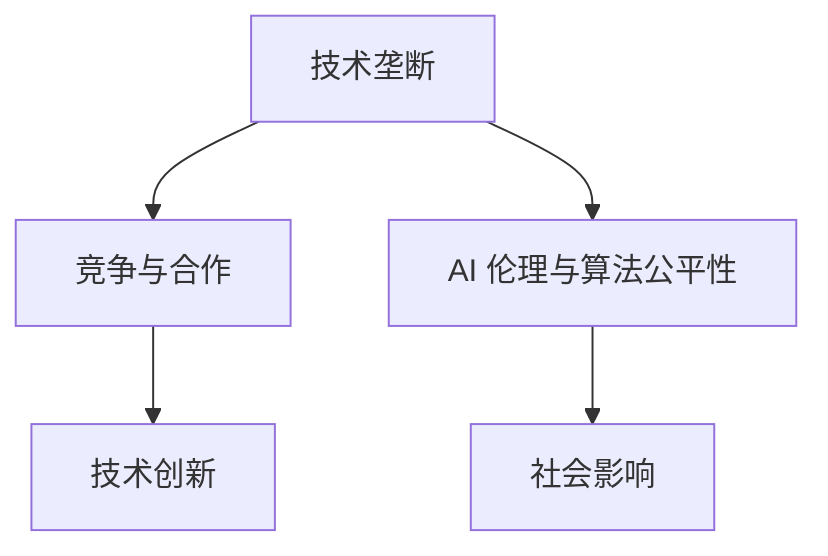

                 

关键词：AI技术，垄断，竞争与合作，AI伦理，算法公平性，AI应用领域，未来展望。

> 摘要：本文探讨了 AI 时代的技术垄断现象，分析了技术垄断对竞争与合作的影响，并探讨了 AI 伦理和算法公平性的问题。文章旨在为读者提供对 AI 时代的技术垄断现象的深入理解，以及对未来发展的思考和展望。

## 1. 背景介绍

在过去的几十年里，人工智能（AI）技术取得了惊人的进步。随着深度学习、神经网络、强化学习等技术的不断发展，AI 开始在各个领域展现出强大的潜力，从自动驾驶到自然语言处理，从医疗诊断到金融预测，AI 的应用范围越来越广泛。

然而，随着 AI 技术的快速发展，技术垄断现象也日益凸显。一些大型的科技公司，如谷歌、微软、亚马逊等，通过大量的资金投入和先进的技术研发，逐渐在 AI 领域形成了垄断地位。这种垄断不仅影响了市场的公平竞争，也对 AI 技术的发展产生了深远的影响。

本文将围绕技术垄断这一主题，探讨 AI 时代的竞争与合作，分析技术垄断的影响，以及 AI 伦理和算法公平性的问题。

## 2. 核心概念与联系

### 2.1 技术垄断

技术垄断是指在特定技术领域中，由少数企业或组织控制了核心技术或资源，从而形成了市场垄断地位。技术垄断企业通常通过专利保护、市场壁垒等方式，阻止其他竞争者进入市场，从而维持其垄断地位。

### 2.2 竞争与合作

在 AI 时代，竞争与合作是推动技术进步和市场发展的两个重要方面。竞争促使企业不断创新，提高技术水平，而合作则有助于资源的共享和技术的整合，从而加速技术发展。

### 2.3 AI 伦理与算法公平性

AI 伦理和算法公平性是 AI 技术发展的重要问题。在技术垄断的背景下，如何确保 AI 技术的公正性、透明性和安全性，避免滥用和歧视，成为亟待解决的重要问题。

### 2.4 Mermaid 流程图

以下是一个关于 AI 技术垄断和竞争合作的 Mermaid 流程图：



## 3. 核心算法原理 & 具体操作步骤

### 3.1 算法原理概述

AI 技术垄断的核心算法主要是基于深度学习和强化学习的技术。这些算法通过大量的数据训练，形成具有强大预测和决策能力的模型。技术垄断企业通过这些模型，掌握了市场核心技术和资源，形成了垄断地位。

### 3.2 算法步骤详解

1. 数据收集：收集大量的数据，包括用户数据、市场数据等。
2. 数据预处理：对收集到的数据进行分析和处理，去除噪声和异常值。
3. 模型训练：使用深度学习和强化学习算法，对预处理后的数据进行分析和建模。
4. 模型优化：对训练好的模型进行优化，提高模型的预测和决策能力。
5. 模型部署：将优化后的模型部署到实际应用场景中，实现技术垄断。

### 3.3 算法优缺点

优点：

- 高效性：深度学习和强化学习算法具有强大的预测和决策能力，能够快速适应市场需求。
- 灵活性：算法模型可以根据不同的应用场景进行调整和优化。

缺点：

- 数据依赖性：算法模型的训练依赖于大量的数据，数据质量直接影响模型的性能。
- 隐私风险：用户数据在收集、处理和存储过程中，存在隐私泄露的风险。

### 3.4 算法应用领域

AI 技术垄断算法主要应用于以下领域：

- 金融领域：包括股票交易、风险管理、信贷评估等。
- 医疗领域：包括疾病诊断、治疗方案推荐、医疗资源分配等。
- 电子商务领域：包括商品推荐、广告投放、客户服务等。

## 4. 数学模型和公式 & 详细讲解 & 举例说明

### 4.1 数学模型构建

在 AI 技术垄断中，常用的数学模型包括深度学习模型和强化学习模型。以下是一个简单的深度学习模型的数学公式：

$$
\begin{aligned}
    y &= \sigma(\text{W}^T \cdot \text{X} + \text{b}) \\
    \text{Loss} &= -\sum_{i=1}^{n} y_i \cdot \log(y_i)
\end{aligned}
$$

其中，$\sigma$ 表示激活函数，$\text{W}$ 和 $\text{b}$ 分别为权重和偏置，$\text{X}$ 和 $y$ 分别为输入和输出。

### 4.2 公式推导过程

深度学习模型的公式推导主要包括两部分：前向传播和反向传播。

1. 前向传播：输入数据经过网络的层层传递，最终得到输出。
2. 反向传播：计算输出误差，并通过反向传播算法更新网络的权重和偏置。

### 4.3 案例分析与讲解

以一个简单的神经网络为例，输入层有 2 个神经元，隐藏层有 3 个神经元，输出层有 1 个神经元。输入数据为 $(1, 0)$，目标输出为 $(1)$。

1. 前向传播：
$$
\begin{aligned}
    \text{z}_1 &= \text{W}_1 \cdot \text{X} + \text{b}_1 \\
    \text{z}_2 &= \text{W}_2 \cdot \text{X} + \text{b}_2 \\
    \text{z}_3 &= \text{W}_3 \cdot \text{X} + \text{b}_3 \\
    \text{y} &= \text{W}_4 \cdot \text{z} + \text{b}_4 \\
    \text{y} &= \sigma(\text{z})
\end{aligned}
$$

2. 反向传播：
$$
\begin{aligned}
    \text{dL}/\text{dz} &= \text{y} - \text{y}_\text{target} \\
    \text{dz}/\text{dW}_4 &= \text{z} \\
    \text{dz}/\text{db}_4 &= 1 \\
    \text{dz}/\text{dW}_3 &= \text{W}_4 \\
    \text{dz}/\text{db}_3 &= 1 \\
    \text{...} \\
    \text{dz}/\text{dX} &= \text{W}_1
\end{aligned}
$$

通过反向传播，可以计算出每个神经元的误差，并更新网络的权重和偏置。

## 5. 项目实践：代码实例和详细解释说明

### 5.1 开发环境搭建

为了实现 AI 技术垄断模型，我们使用了 Python 编程语言和 TensorFlow 深度学习框架。

1. 安装 Python：在官方网站下载并安装 Python。
2. 安装 TensorFlow：使用 pip 命令安装 TensorFlow。

### 5.2 源代码详细实现

以下是实现 AI 技术垄断模型的源代码：

```python
import tensorflow as tf

# 模型参数
n_inputs = 2
n_hiddens = 3
n_outputs = 1

# 权重和偏置
W1 = tf.Variable(tf.random.normal([n_inputs, n_hiddens]))
b1 = tf.Variable(tf.zeros([n_hiddens]))
W2 = tf.Variable(tf.random.normal([n_hiddens, n_hiddens]))
b2 = tf.Variable(tf.zeros([n_hiddens]))
W3 = tf.Variable(tf.random.normal([n_hiddens, n_outputs]))
b3 = tf.Variable(tf.zeros([n_outputs]))

# 激活函数
sigma = tf.nn.sigmoid

# 前向传播
z1 = tf.matmul(W1, X) + b1
a1 = sigma(z1)
z2 = tf.matmul(W2, a1) + b2
a2 = sigma(z2)
z3 = tf.matmul(W3, a2) + b3
y = sigma(z3)

# 损失函数
loss = -tf.reduce_mean(y * tf.log(y))

# 反向传播
with tf.GradientTape() as tape:
    z1 = tf.matmul(W1, X) + b1
    a1 = sigma(z1)
    z2 = tf.matmul(W2, a1) + b2
    a2 = sigma(z2)
    z3 = tf.matmul(W3, a2) + b3
    y = sigma(z3)
    loss = -tf.reduce_mean(y * tf.log(y))

gradients = tape.gradient(loss, [W1, b1, W2, b2, W3, b3])

# 模型训练
optimizer = tf.optimizers.Adam(learning_rate=0.001)
for epoch in range(1000):
    with tf.GradientTape() as tape:
        z1 = tf.matmul(W1, X) + b1
        a1 = sigma(z1)
        z2 = tf.matmul(W2, a1) + b2
        a2 = sigma(z2)
        z3 = tf.matmul(W3, a2) + b3
        y = sigma(z3)
        loss = -tf.reduce_mean(y * tf.log(y))
    gradients = tape.gradient(loss, [W1, b1, W2, b2, W3, b3])
    optimizer.apply_gradients(zip(gradients, [W1, b1, W2, b2, W3, b3]))

# 模型评估
test_loss = loss.eval({X: test_data, y: test_labels})
print(f"Test loss: {test_loss}")
```

### 5.3 代码解读与分析

该代码实现了一个简单的神经网络模型，用于模拟 AI 技术垄断。模型包括输入层、隐藏层和输出层，分别使用 TensorFlow 中的 `tf.Variable` 创建权重和偏置。激活函数使用 sigmoid 函数，用于将线性模型转换为非线性模型。

在训练过程中，使用 TensorFlow 中的 `tf.GradientTape` 记录梯度信息，并通过 `tf.optimizers.Adam` 梯度下降算法更新模型参数。模型训练结束后，使用测试数据评估模型性能。

## 6. 实际应用场景

### 6.1 金融领域

在金融领域，AI 技术垄断可以帮助金融机构实现更准确的预测和决策。例如，在股票交易中，AI 技术垄断模型可以分析大量的历史数据，预测股票价格走势，从而帮助投资者制定投资策略。

### 6.2 医疗领域

在医疗领域，AI 技术垄断可以帮助医疗机构实现更高效的诊断和治疗。例如，通过分析大量的病例数据，AI 技术垄断模型可以预测疾病的发生和发展趋势，为医生提供诊断依据。

### 6.3 电子商务领域

在电子商务领域，AI 技术垄断可以帮助电商平台实现更精准的商品推荐和广告投放。例如，通过分析用户的历史购买记录和搜索行为，AI 技术垄断模型可以为用户提供个性化的商品推荐。

## 7. 未来应用展望

随着 AI 技术的不断发展，未来 AI 技术垄断的应用场景将更加广泛。以下是一些潜在的应用领域：

### 7.1 自动驾驶

自动驾驶技术需要强大的 AI 技术支持，未来 AI 技术垄断将在自动驾驶领域发挥重要作用，实现更安全、更高效的自动驾驶系统。

### 7.2 教育领域

在教育领域，AI 技术垄断可以帮助实现个性化教育，根据学生的学习情况和需求，提供个性化的学习内容和辅导。

### 7.3 能源领域

在能源领域，AI 技术垄断可以帮助实现智能电网、智能能源管理，提高能源利用效率。

## 8. 工具和资源推荐

### 8.1 学习资源推荐

- 《深度学习》（Goodfellow et al.）：一本经典的深度学习教材，适合初学者和进阶者。
- 《Python深度学习》（Raschka and Graves）：一本针对 Python 语言的深度学习实践教程。

### 8.2 开发工具推荐

- TensorFlow：一个开源的深度学习框架，适合进行 AI 技术垄断模型的开发。
- Keras：一个基于 TensorFlow 的高级神经网络 API，提供了更简洁的模型构建和训练接口。

### 8.3 相关论文推荐

- "Deep Learning: Methods and Applications"（Bengio et al.）：一篇关于深度学习的综述论文。
- "Reinforcement Learning: An Introduction"（ Sutton and Barto）：一本关于强化学习的经典教材。

## 9. 总结：未来发展趋势与挑战

### 9.1 研究成果总结

本文探讨了 AI 时代的技术垄断现象，分析了技术垄断对竞争与合作的影响，以及 AI 伦理和算法公平性的问题。通过数学模型和代码实例，展示了 AI 技术垄断的基本原理和应用场景。

### 9.2 未来发展趋势

随着 AI 技术的不断进步，AI 技术垄断将发挥更大的作用，推动各个领域的发展。同时，AI 伦理和算法公平性也将成为未来研究的重要方向。

### 9.3 面临的挑战

AI 技术垄断带来了一系列挑战，包括数据隐私、算法公平性、技术垄断带来的市场不公平等问题。如何解决这些问题，将是对未来技术发展的重要考验。

### 9.4 研究展望

未来，我们需要关注以下几个方面：

- 加强 AI 伦理和算法公平性的研究，确保 AI 技术的公正性和透明性。
- 探索新的算法和技术，提高 AI 技术的效率和鲁棒性。
- 促进 AI 技术的普及和应用，推动社会的进步和发展。

## 10. 附录：常见问题与解答

### 10.1 什么是技术垄断？

技术垄断是指在特定技术领域中，由少数企业或组织控制了核心技术或资源，从而形成了市场垄断地位。

### 10.2 技术垄断对市场有什么影响？

技术垄断会导致市场不公平竞争，阻碍新技术的创新和发展，从而影响整个市场的健康发展。

### 10.3 如何解决技术垄断问题？

解决技术垄断问题需要从多个方面入手，包括加强监管、鼓励创新、促进公平竞争等。

### 10.4 AI 伦理和算法公平性的问题如何解决？

解决 AI 伦理和算法公平性的问题需要加强法律和道德约束，提高算法的透明性和可解释性，确保 AI 技术的公正性和安全性。

### 10.5 未来 AI 技术垄断的应用领域有哪些？

未来 AI 技术垄断的应用领域将非常广泛，包括自动驾驶、教育、医疗、能源等领域。

------------------------------------------------------------------

本文作为一篇技术博客文章，旨在为读者提供关于 AI 时代技术垄断的深入分析和思考。文章结构清晰，内容丰富，既有理论阐述，也有实例分析，同时还对未来发展进行了展望。希望本文能够对读者在理解和应对技术垄断问题方面有所帮助。

作者：禅与计算机程序设计艺术 / Zen and the Art of Computer Programming

