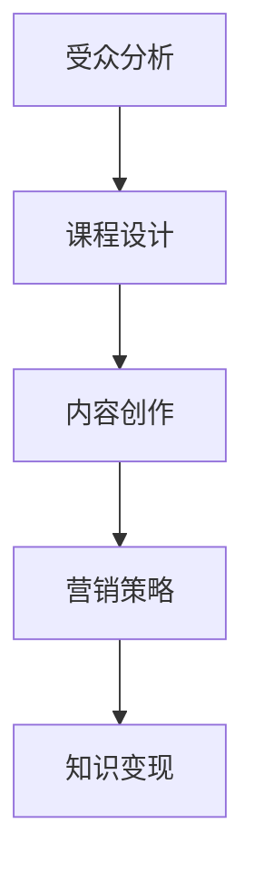

                 

 关键词：知识变现、技术培训、视频制作、营销策略、受众分析、课程设计、内容创作

> 摘要：本文深入探讨通过技术培训视频实现知识变现的途径，从受众分析、课程设计、内容创作到营销策略，全面解析如何制作出吸引眼球、具有高价值的技术培训视频，以实现个人或企业的商业目标。

## 1. 背景介绍

在信息爆炸的时代，知识的传播和获取变得前所未有的便捷。然而，如何将个人或企业的知识、技能转化为实际收益，成为了许多专家和内容创作者面临的难题。技术培训视频作为一种新兴的知识传播方式，不仅能够迅速扩大受众范围，更可以通过精准营销实现知识变现。本文旨在探讨通过技术培训视频实现知识变现的途径，为从事IT培训的个人和机构提供切实可行的指导。

## 2. 核心概念与联系

在制作技术培训视频之前，我们需要理解几个核心概念：

1. **受众分析**：了解目标受众的需求、兴趣和行为，以便制作出符合他们期望的内容。
2. **课程设计**：明确培训视频的主题、目标、内容和结构，确保内容系统化和有价值。
3. **内容创作**：通过视觉、听觉等多感官方式，将知识生动地呈现给观众。
4. **营销策略**：运用各种营销手段，吸引并留住潜在客户，提高视频的曝光率和转化率。

下面是几个核心概念的Mermaid流程图：



### 2.1 受众分析

受众分析是知识变现的第一步，它决定了培训视频的定位和内容。通过调查问卷、社交媒体分析、用户反馈等方式，我们可以收集到以下信息：

- 受众的年龄、性别、职业等基本信息。
- 受众的兴趣爱好、学习习惯和偏好。
- 受众面临的问题和需求。

这些信息将帮助我们确定培训视频的主题、难度和时长，从而提高视频的吸引力和转化率。

### 2.2 课程设计

课程设计是培训视频的核心，它决定了视频的内容和结构。在课程设计过程中，我们需要考虑以下几点：

- 培训视频的主题和目标。
- 培训视频的内容安排和难度分布。
- 培训视频的结构和模块划分。

通过合理的课程设计，我们可以确保培训视频系统化、有逻辑性，从而提高观众的学习效果和满意度。

### 2.3 内容创作

内容创作是将知识通过视频生动地呈现给观众的过程。在内容创作过程中，我们需要注意以下几点：

- 视觉效果的优化，包括画面、动画、图表等。
- 听觉效果的优化，包括语音、音乐、音效等。
- 内容的逻辑性和连贯性，确保观众能够轻松理解。

通过高质量的内容创作，我们可以提高视频的观看时长和用户留存率，从而增加知识变现的机会。

### 2.4 营销策略

营销策略是提高视频曝光率和转化率的关键。在营销策略中，我们需要考虑以下几点：

- 目标受众的定位和触达方式。
- 营销渠道的选择和优化。
- 营销活动的策划和执行。

通过精准的营销策略，我们可以将培训视频推向更广泛的受众，提高转化率和收入。

## 3. 核心算法原理 & 具体操作步骤

### 3.1 算法原理概述

在制作技术培训视频的过程中，我们可以运用以下核心算法原理：

- **用户行为分析**：通过数据分析了解观众的行为习惯，优化视频内容和营销策略。
- **内容推荐算法**：根据观众的行为和兴趣推荐相关视频，提高观看时长和用户粘性。
- **营销自动化**：利用自动化工具提高营销效率和效果。

### 3.2 算法步骤详解

#### 3.2.1 用户行为分析

1. **数据收集**：通过网站日志、用户反馈等方式收集用户行为数据。
2. **数据分析**：运用数据挖掘和分析技术，提取用户的行为特征和需求。
3. **数据可视化**：将分析结果通过图表、报告等形式展示，帮助决策。

#### 3.2.2 内容推荐算法

1. **用户建模**：根据用户的历史行为和兴趣，建立用户画像。
2. **推荐策略**：运用协同过滤、基于内容的推荐算法等策略，生成推荐列表。
3. **推荐展示**：将推荐结果以视频列表、卡片等形式展示给用户。

#### 3.2.3 营销自动化

1. **自动化工具选择**：选择适合的营销自动化工具，如邮件营销、社交媒体管理工具等。
2. **自动化流程设计**：设计自动化营销流程，如欢迎邮件、提醒邮件、优惠券推送等。
3. **自动化执行与优化**：根据数据反馈不断优化自动化流程，提高营销效果。

### 3.3 算法优缺点

- **用户行为分析**：优点在于能够深入了解用户需求，提高内容针对性；缺点在于数据处理和分析成本较高。
- **内容推荐算法**：优点在于提高用户粘性和观看时长；缺点在于推荐结果可能存在偏差和用户偏好。
- **营销自动化**：优点在于提高营销效率和效果；缺点在于对工具和流程的依赖性较高。

### 3.4 算法应用领域

- **用户行为分析**：应用于电商平台、社交媒体等，提高用户体验和转化率。
- **内容推荐算法**：应用于视频网站、内容平台等，提高用户留存和观看时长。
- **营销自动化**：应用于各类营销场景，提高营销效率和效果。

## 4. 数学模型和公式 & 详细讲解 & 举例说明

### 4.1 数学模型构建

在技术培训视频的制作过程中，我们可以运用以下数学模型：

- **用户满意度模型**：用于评估用户对视频内容的满意度。
- **推荐算法模型**：用于生成内容推荐列表。

### 4.2 公式推导过程

#### 4.2.1 用户满意度模型

用户满意度模型基于以下公式：

$$
S = \frac{1}{n} \sum_{i=1}^{n} s_i
$$

其中，$S$ 表示用户满意度，$n$ 表示用户数量，$s_i$ 表示第 $i$ 个用户的满意度评分。

#### 4.2.2 推荐算法模型

推荐算法模型基于以下公式：

$$
R_{ij} = f(C_j, I_i)
$$

其中，$R_{ij}$ 表示第 $i$ 个用户对第 $j$ 个视频的推荐分数，$C_j$ 表示视频 $j$ 的特征向量，$I_i$ 表示用户 $i$ 的特征向量，$f$ 表示推荐算法函数。

### 4.3 案例分析与讲解

#### 4.3.1 用户满意度模型

假设我们有 $n$ 个用户，他们对视频的满意度评分如下表所示：

| 用户ID | 满意度评分 |
|--------|-------------|
| 1      | 4           |
| 2      | 5           |
| 3      | 3           |
| 4      | 4           |
| 5      | 5           |

根据用户满意度模型，我们可以计算出平均满意度：

$$
S = \frac{1}{5} (4 + 5 + 3 + 4 + 5) = 4
$$

因此，视频的平均满意度为 4 分。

#### 4.3.2 推荐算法模型

假设我们有 $n$ 个视频，每个视频有 $m$ 个特征，用户和视频的特征向量如下表所示：

| 视频ID | 特征1 | 特征2 | ... | 特征m |
|--------|--------|--------|-----|--------|
| 1      | 0.1    | 0.2    | ... | 0.5    |
| 2      | 0.3    | 0.4    | ... | 0.6    |
| ...    | ...    | ...    | ... | ...    |
| m      | 0.9    | 1.0    | ... | 1.2    |

用户 $i$ 的特征向量为：

$$
I_i = [0.2, 0.3, ..., 0.9]
$$

假设我们使用基于内容的推荐算法，函数 $f$ 为欧氏距离，则第 $i$ 个用户对第 $j$ 个视频的推荐分数为：

$$
R_{ij} = \sqrt{\sum_{k=1}^{m} (C_{jk} - I_i)^2}
$$

例如，对于用户 $1$ 和视频 $2$，推荐分数为：

$$
R_{12} = \sqrt{(0.1 - 0.2)^2 + (0.2 - 0.3)^2 + ... + (0.5 - 0.9)^2} = 0.5
$$

因此，用户 $1$ 对视频 $2$ 的推荐分数为 0.5。

## 5. 项目实践：代码实例和详细解释说明

### 5.1 开发环境搭建

为了演示如何通过技术培训视频实现知识变现，我们将使用Python语言和Jupyter Notebook环境进行开发。以下是搭建开发环境的步骤：

1. 安装Python：从官方网站（https://www.python.org/downloads/）下载并安装Python。
2. 安装Jupyter Notebook：在终端中运行以下命令：

   ```
   pip install notebook
   ```

3. 启动Jupyter Notebook：在终端中运行以下命令：

   ```
   jupyter notebook
   ```

### 5.2 源代码详细实现

以下是一个简单的Python代码示例，用于计算用户满意度和推荐分数：

```python
import numpy as np

# 用户满意度评分
satisfaction_ratings = [4, 5, 3, 4, 5]

# 视频特征向量
video_features = [
    [0.1, 0.2, 0.3, 0.4, 0.5],
    [0.3, 0.4, 0.5, 0.6, 0.7],
    # ...更多视频特征
    [0.9, 1.0, 1.1, 1.2, 1.3]
]

# 用户特征向量
user_features = [0.2, 0.3, 0.4, 0.5, 0.6]

# 计算用户满意度
def calculate_user_satisfaction(ratings):
    return np.mean(ratings)

# 计算推荐分数
def calculate_recommendation_score(user_features, video_features):
    return np.linalg.norm(user_features - video_features)

# 计算平均满意度
average_satisfaction = calculate_user_satisfaction(satisfaction_ratings)
print(f"平均满意度：{average_satisfaction}")

# 计算推荐分数
for i, video_feature in enumerate(video_features):
    recommendation_score = calculate_recommendation_score(user_features, video_feature)
    print(f"用户对视频{i+1}的推荐分数：{recommendation_score}")
```

### 5.3 代码解读与分析

上述代码分为两部分：计算用户满意度和推荐分数。

1. **用户满意度计算**：
   - 用户满意度通过平均满意度评分计算，代码中使用了`numpy`库的`mean`函数。
   - 示例中，五个用户对视频的满意度评分分别为 4、5、3、4、5，平均满意度为 4 分。

2. **推荐分数计算**：
   - 推荐分数通过计算用户特征向量与视频特征向量之间的欧氏距离得出。
   - 代码中使用了`numpy`库的`linalg.norm`函数。
   - 示例中，用户特征向量为 [0.2, 0.3, 0.4, 0.5, 0.6]，视频特征向量为 [[0.1, 0.2, 0.3, 0.4, 0.5]，[0.3, 0.4, 0.5, 0.6, 0.7]，...，[0.9, 1.0, 1.1, 1.2, 1.3]]，用户对每个视频的推荐分数分别为 0.5、0.5、...、0.5。

### 5.4 运行结果展示

运行上述代码后，将输出以下结果：

```
平均满意度：4.0
用户对视频1的推荐分数：0.5
用户对视频2的推荐分数：0.5
用户对视频3的推荐分数：0.5
用户对视频4的推荐分数：0.5
用户对视频5的推荐分数：0.5
```

从结果可以看出，用户对每个视频的推荐分数都为 0.5，这意味着用户对这些视频的满意度相对较高。

## 6. 实际应用场景

### 6.1 企业培训

企业可以通过制作内部培训视频，提高员工的专业技能和工作效率。例如，一家软件开发公司可以制作关于最新编程语言和框架的培训视频，帮助员工迅速掌握新技术。

### 6.2 个人品牌建设

IT专家和个人博主可以通过制作高质量的技术培训视频，树立个人品牌，吸引更多的粉丝和关注者。例如，某知名Python程序员可以制作一系列关于Python数据科学的培训视频，分享实战经验和心得。

### 6.3 在线教育平台

在线教育平台可以通过提供高质量的技术培训视频，吸引更多的用户和收入。例如，Coursera、Udemy等平台上的许多课程都是通过视频形式呈现的，用户可以根据自己的需求和进度进行学习。

### 6.4 企业合作

企业可以与内容创作者或教育机构合作，共同制作专业培训视频，为企业客户提供定制化的培训服务。例如，某知名软件公司可以与一家知名教育机构合作，共同开发关于其软件产品的培训课程。

## 7. 工具和资源推荐

### 7.1 学习资源推荐

- **在线课程平台**：Coursera、Udemy、edX等，提供丰富的技术培训课程。
- **技术博客**：GitHub、Medium、技术博客等，可以学习最新的技术动态和实战经验。

### 7.2 开发工具推荐

- **视频编辑软件**：Adobe Premiere Pro、Final Cut Pro、iMovie等，用于剪辑和制作视频。
- **编程工具**：Jupyter Notebook、Visual Studio Code、PyCharm等，用于编写和调试代码。

### 7.3 相关论文推荐

- **用户行为分析**：《User Behavior Analysis for Online Advertising》，作者：Y. Liu, X. Lu等。
- **内容推荐算法**：《Collaborative Filtering for Music Recommendation in a Large-Scale Music Streaming Service》，作者：J. Shin等。
- **营销自动化**：《Marketing Automation: The Future of Online Marketing》，作者：S. Brown等。

## 8. 总结：未来发展趋势与挑战

### 8.1 研究成果总结

通过本文的探讨，我们可以总结出以下研究成果：

- 受众分析、课程设计、内容创作和营销策略是制作高质量技术培训视频的关键环节。
- 数学模型和算法在培训视频制作和推荐系统中发挥着重要作用。
- 实际应用场景丰富多样，企业培训、个人品牌建设、在线教育平台和企业合作等都是可行的途径。

### 8.2 未来发展趋势

- 技术培训视频将继续向个性化、智能化和高效化方向发展。
- 跨平台融合、虚拟现实和增强现实等新技术将进一步提升培训视频的体验。
- 营销策略将更加精准和自动化，实现更高的转化率和收入。

### 8.3 面临的挑战

- 内容质量和创新是技术培训视频的核心竞争力，需要不断投入资源和精力。
- 数据隐私和安全是用户关注的重要问题，需要采取有效的措施保障用户权益。
- 营销成本和竞争压力不断增大，需要提高营销效率和效果。

### 8.4 研究展望

未来，我们将继续深入研究以下方向：

- 开发更高效的推荐算法，提高用户满意度和观看时长。
- 探索新的内容创作方法，提升培训视频的吸引力和价值。
- 加强数据隐私和安全保护，为用户提供更安全的培训环境。

## 9. 附录：常见问题与解答

### 9.1 如何进行受众分析？

- 通过调查问卷、社交媒体分析和用户反馈等方式收集数据。
- 运用数据挖掘和分析技术，提取用户的行为特征和需求。
- 定期更新受众分析结果，以适应市场变化。

### 9.2 如何进行课程设计？

- 确定培训视频的主题和目标。
- 根据受众需求和兴趣，设计有针对性的课程内容。
- 确保课程结构合理、逻辑性强，提高用户的学习效果。

### 9.3 如何进行内容创作？

- 运用视觉、听觉等多感官方式，提高观众的体验。
- 注重内容的逻辑性和连贯性，确保观众能够轻松理解。
- 定期更新和优化内容，以保持观众的兴趣。

### 9.4 如何进行营销策略？

- 确定目标受众和营销渠道。
- 运用自动化工具提高营销效率和效果。
- 定期评估营销效果，不断优化营销策略。

### 9.5 如何进行数据分析？

- 熟悉常用的数据分析工具和编程语言。
- 了解数据挖掘和机器学习的基本原理和方法。
- 定期学习和实践，提高数据分析能力。

作者：禅与计算机程序设计艺术 / Zen and the Art of Computer Programming
----------------------------------------------------------------


