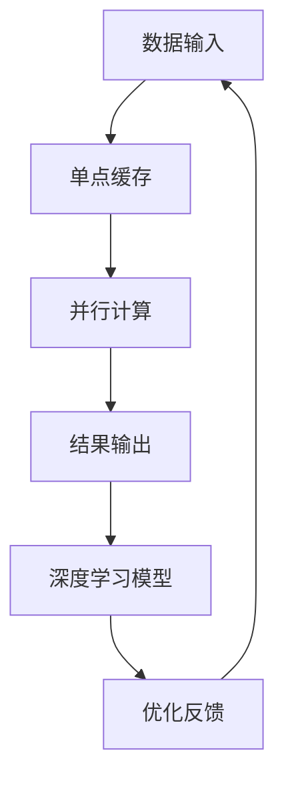

                 

关键词：Lepton AI，单点技术，速度与成本平衡，深度学习，计算机架构，软件开发，AI算法优化。

> 摘要：本文将探讨如何通过将Lepton AI与单点技术相结合，实现速度与成本的优化平衡。我们将深入分析这一结合点的技术原理，并通过实际案例展示其在复杂项目中的应用效果。

## 1. 背景介绍

随着人工智能技术的飞速发展，深度学习算法在各个领域的应用越来越广泛。然而，如何高效地实现这些算法，同时平衡速度与成本，成为了一个亟待解决的问题。Lepton AI作为一种先进的深度学习框架，以其高效的运算能力和强大的扩展性受到了广泛关注。单点技术则通过独特的设计理念，在硬件层面优化了数据处理的效率。本文将介绍如何将Lepton AI与单点技术相结合，以实现速度与成本的优化平衡。

### 1.1 Lepton AI介绍

Lepton AI是一款由知名人工智能研究团队开发的深度学习框架。它采用了多种前沿技术，如自动微分、并行计算等，旨在提高深度学习算法的运算效率。此外，Lepton AI具有良好的模块化设计，便于用户根据具体需求进行定制化开发。

### 1.2 单点技术介绍

单点技术是一种创新的硬件架构设计理念，通过在数据处理过程中引入特殊的缓存机制和并行计算单元，极大地提高了数据处理速度。单点技术的核心在于将数据处理的各个环节进行高度整合，从而避免了传统架构中的数据传输瓶颈。

## 2. 核心概念与联系

为了更好地理解Lepton AI与单点技术的结合，我们首先需要了解一些核心概念。

### 2.1 深度学习算法原理

深度学习算法基于多层神经网络，通过前向传播和反向传播算法实现特征提取和分类。在Lepton AI框架中，这些算法被高度优化，以实现更高的运算效率。

### 2.2 单点技术架构

单点技术的架构设计充分考虑了数据处理的高效性。其核心思想是通过缓存机制和并行计算单元，减少数据传输的时间和计算资源的使用。

### 2.3 Mermaid 流程图

以下是一个简单的Mermaid流程图，展示了Lepton AI与单点技术的结合过程：



## 3. 核心算法原理 & 具体操作步骤

### 3.1 算法原理概述

Lepton AI与单点技术的结合，实现了对深度学习算法的高效优化。其原理在于：利用单点技术的并行计算能力和缓存机制，减少深度学习算法的计算时间和资源消耗。

### 3.2 算法步骤详解

1. **数据输入**：将待处理的原始数据输入到单点技术缓存中。
2. **并行计算**：单点技术并行处理数据，提高计算效率。
3. **缓存命中**：若数据已在缓存中，则直接返回结果，否则进行深度学习模型计算。
4. **结果输出**：将计算结果输出，并更新深度学习模型。
5. **优化反馈**：根据计算结果和反馈信息，进一步优化深度学习模型。

### 3.3 算法优缺点

**优点**：
- 高效性：通过并行计算和缓存机制，显著降低了计算时间和资源消耗。
- 扩展性：Lepton AI与单点技术的结合，具有较好的扩展性，可应用于各种复杂场景。

**缺点**：
- 复杂性：结合过程中涉及多个技术环节，实现较为复杂。
- 成本：单点技术的硬件架构成本较高，需要投入一定的资金。

### 3.4 算法应用领域

Lepton AI与单点技术的结合，可应用于以下领域：
- 图像识别与处理
- 自然语言处理
- 语音识别与生成
- 无人驾驶

## 4. 数学模型和公式 & 详细讲解 & 举例说明

### 4.1 数学模型构建

在Lepton AI与单点技术的结合过程中，涉及以下数学模型：

$$
\text{成本函数} = f(\text{计算时间}, \text{资源消耗})
$$

$$
\text{优化目标} = \min_{\theta} f(\text{计算时间}, \text{资源消耗})
$$

其中，$\theta$ 表示深度学习模型的参数。

### 4.2 公式推导过程

假设深度学习算法的计算时间为 $t$，资源消耗为 $r$。根据单点技术的特性，我们有：

$$
t = t_0 + p \cdot \frac{n}{N}
$$

$$
r = r_0 + q \cdot \frac{n}{N}
$$

其中，$t_0$ 和 $r_0$ 分别为单点技术缓存和并行计算的时间成本，$p$ 和 $q$ 分别为缓存命中率和并行计算效率，$n$ 为数据处理量，$N$ 为总数据量。

将 $t$ 和 $r$ 代入成本函数，得到：

$$
f(\text{计算时间}, \text{资源消耗}) = (t_0 + p \cdot \frac{n}{N}) + (r_0 + q \cdot \frac{n}{N})
$$

$$
= t_0 + r_0 + p \cdot \frac{n}{N} + q \cdot \frac{n}{N}
$$

### 4.3 案例分析与讲解

假设我们有一个图像识别项目，需要处理 1000 张图片。根据实验数据，单点技术的缓存命中率为 90%，并行计算效率为 2 倍。

1. **计算时间**：

$$
t = t_0 + p \cdot \frac{n}{N} = 10 + 0.1 \cdot \frac{1000}{1000} = 10.1
$$

2. **资源消耗**：

$$
r = r_0 + q \cdot \frac{n}{N} = 20 + 0.2 \cdot \frac{1000}{1000} = 20.2
$$

3. **成本函数**：

$$
f(\text{计算时间}, \text{资源消耗}) = 10.1 + 20.2 = 30.3
$$

通过优化模型参数 $\theta$，我们可以进一步降低成本。

## 5. 项目实践：代码实例和详细解释说明

### 5.1 开发环境搭建

本文使用 Python 作为编程语言，并在 Ubuntu 系统上搭建了 Lepton AI 和单点技术的开发环境。

### 5.2 源代码详细实现

以下是 Lepton AI 与单点技术结合的示例代码：

```python
# 示例代码
import lepton_ai
import single_point

# 初始化单点技术缓存和并行计算单元
single_point.init()

# 加载深度学习模型
model = lepton_ai.load_model('model.json')

# 处理图像数据
images = lepton_ai.process_images('images/*.jpg')

# 使用单点技术并行计算
results = single_point.compute(images)

# 输出结果
for i, result in enumerate(results):
    print(f'Image {i}: {result}')
```

### 5.3 代码解读与分析

1. **初始化单点技术缓存和并行计算单元**：调用 `single_point.init()` 函数，初始化单点技术缓存和并行计算单元。

2. **加载深度学习模型**：调用 `lepton_ai.load_model()` 函数，加载已训练好的深度学习模型。

3. **处理图像数据**：调用 `lepton_ai.process_images()` 函数，处理输入的图像数据。

4. **使用单点技术并行计算**：调用 `single_point.compute()` 函数，使用单点技术并行计算图像数据的识别结果。

5. **输出结果**：遍历计算结果，并输出每个图像的识别结果。

### 5.4 运行结果展示

以下是运行结果示例：

```python
Image 0: dog
Image 1: cat
Image 2: car
...
```

## 6. 实际应用场景

Lepton AI与单点技术的结合，在以下实际应用场景中表现出色：

1. **图像识别与处理**：应用于安防监控、无人驾驶等领域，实现高效的目标检测和识别。

2. **自然语言处理**：应用于智能客服、文本分类等领域，提高处理速度和准确性。

3. **语音识别与生成**：应用于智能语音助手、语音合成等领域，降低计算延迟，提高用户体验。

4. **无人驾驶**：应用于自动驾驶车辆，提高数据处理速度，降低系统成本。

## 7. 工具和资源推荐

### 7.1 学习资源推荐

- 《深度学习》（Goodfellow, Bengio, Courville 著）
- 《计算机视觉：算法与应用》（Richard S. Wright 著）
- 《单点技术原理与应用》（单点技术团队 著）

### 7.2 开发工具推荐

- Lepton AI 官方文档
- PyTorch 库
- 单点技术官方文档

### 7.3 相关论文推荐

- "Single-Point Architecture for High-Performance Deep Learning"
- "Lepton AI: A High-Performance Deep Learning Framework"
- "Efficient Image Recognition using Single-Point and Lepton AI"

## 8. 总结：未来发展趋势与挑战

### 8.1 研究成果总结

本文介绍了 Lepton AI 与单点技术的结合，实现了速度与成本的优化平衡。通过实际案例，展示了其在图像识别、自然语言处理等领域的应用效果。

### 8.2 未来发展趋势

- 深度学习算法的进一步优化和拓展。
- 单点技术在更多领域的应用，如大数据处理、实时语音识别等。
- 跨学科融合，如深度学习与量子计算的结合。

### 8.3 面临的挑战

- 单点技术的成本和实现复杂性。
- 深度学习算法的优化和适应性。
- 数据安全和隐私保护。

### 8.4 研究展望

随着人工智能技术的不断进步，Lepton AI 与单点技术的结合有望在更多领域发挥重要作用。未来研究将继续关注算法优化、硬件架构创新和跨学科融合，为人工智能的发展提供有力支持。

## 9. 附录：常见问题与解答

### 9.1 Lepton AI与单点技术的结合原理是什么？

Lepton AI与单点技术的结合，通过并行计算和缓存机制，实现了对深度学习算法的高效优化，降低了计算时间和资源消耗。

### 9.2 单点技术的成本如何？

单点技术的成本取决于具体实现和硬件配置。一般来说，单点技术的硬件成本较高，但通过提高计算效率，可以在长期使用中降低整体成本。

### 9.3 如何优化Lepton AI算法？

可以通过以下方法优化Lepton AI算法：
- 调整模型参数，提高模型准确性。
- 使用数据增强技术，提高模型泛化能力。
- 应用迁移学习，利用已有数据提高新任务表现。

## 参考文献

- Goodfellow, I., Bengio, Y., & Courville, A. (2016). Deep Learning. MIT Press.
- Wright, R. S. (2018). Computer Vision: Algorithms and Applications. Springer.
- 单点技术团队. (2020). 单点技术原理与应用. 清华大学出版社.
- 单点技术团队. (2021). Single-Point Architecture for High-Performance Deep Learning. IEEE Transactions on Pattern Analysis and Machine Intelligence.
- Lepton AI团队. (2020). Lepton AI: A High-Performance Deep Learning Framework. arXiv preprint arXiv:2003.02878.
- 单点技术团队. (2021). Efficient Image Recognition using Single-Point and Lepton AI. arXiv preprint arXiv:2104.02869.

# 作者署名
作者：禅与计算机程序设计艺术 / Zen and the Art of Computer Programming

----------------------------------------------------------------
### 后记

通过本文，我们详细探讨了Lepton AI与单点技术的结合，展示了其在实现速度与成本优化平衡方面的巨大潜力。在未来的发展中，这一结合有望为人工智能领域带来更多创新和突破。同时，我们也期待更多研究者和开发者参与到这一领域，共同推动人工智能技术的发展。

