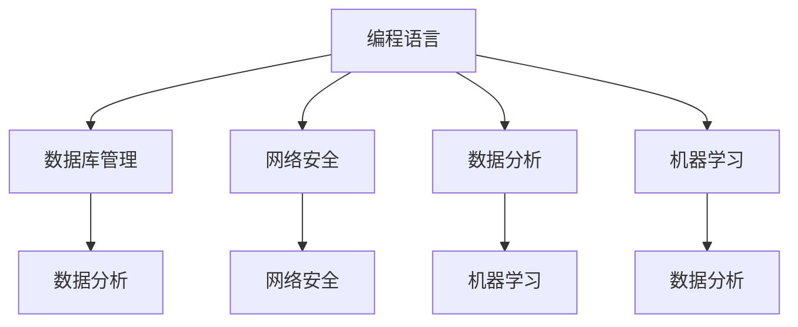

                 

技术技能是现代职场中不可或缺的一部分，它们是圆满完成工作的关键。在这篇文章中，我们将探讨什么是技术技能，为什么它们重要，以及如何在工作中提升这些技能。我们的目标是提供一个全面的指南，帮助专业人士在技术领域保持竞争力。

## 关键词

- 技术技能
- 硬技能
- 专业领域知识
- 工作效率
- 技术趋势
- 终身学习

## 摘要

本文旨在探讨技术技能在当今职场中的重要性，并介绍如何通过持续学习和实践来提升这些技能。我们将讨论技术技能的核心概念，提供实用的学习资源和建议，并展望未来技术的发展趋势和面临的挑战。无论您是初入职场的开发者还是经验丰富的IT专家，本文都将为您提供宝贵的指导。

### 1. 背景介绍

技术技能，通常被称为“硬技能”，是指那些可以直接应用于特定技术领域的能力。这些技能包括编程语言、数据库管理、网络安全、数据分析等。它们是专业人员在工作中的核心竞争力，也是企业招聘时关注的重点。随着技术的不断进步和新兴领域的不断涌现，掌握技术技能变得比以往任何时候都更加重要。

在现代社会，技术已经成为推动创新和经济增长的核心动力。企业和组织越来越依赖技术来提高效率、降低成本和创造新的商业机会。因此，技术技能的掌握程度直接影响到个人的职业发展和企业的竞争力。在这个充满变化和竞争的环境中，只有不断更新和提升自己的技术技能，才能保持竞争优势。

本文将围绕以下几个核心问题展开：

- 什么是技术技能，它们为什么重要？
- 如何评估和提高自己的技术技能？
- 如何在实际工作中应用技术技能，以提升工作效率？
- 未来技术技能的发展趋势和面临的挑战是什么？
- 提升技术技能的资源和工具推荐。

通过解答这些问题，我们希望能够帮助读者更好地理解技术技能的价值，并为其职业生涯提供有价值的指导。

### 2. 核心概念与联系

为了深入探讨技术技能，我们首先需要了解几个核心概念，以及它们之间的联系。以下是几个关键概念的定义及其在技术领域中的重要性：

#### 2.1 编程语言

编程语言是用于编写计算机程序的语法和规则。不同的编程语言适用于不同的应用场景，例如Python适合数据分析，Java适合企业级应用开发。熟练掌握多种编程语言是技术专家的基本要求。

#### 2.2 数据库管理

数据库管理涉及数据存储、检索和维护。掌握数据库技术，如SQL、NoSQL等，对于开发和维护大型应用程序至关重要。

#### 2.3 网络安全

网络安全是保护网络和数据免受攻击的技术和实践。随着网络攻击的增多，网络安全技能变得越来越重要。

#### 2.4 数据分析

数据分析是使用统计方法和算法从数据中提取有价值的信息。数据分析技能在商业决策、科学研究等领域具有重要应用。

#### 2.5 机器学习

机器学习是一种让计算机通过数据学习模式和规律的方法。机器学习在自动驾驶、智能家居、医疗诊断等领域有广泛应用。

以下是一个简化的Mermaid流程图，展示了这些核心概念之间的关系：



通过这个流程图，我们可以看到不同技术技能之间的交叉和整合。例如，数据分析不仅需要编程语言，还需要数据库管理和机器学习技能。这种跨学科的技能组合是现代技术专家的核心竞争力。

### 3. 核心算法原理 & 具体操作步骤

#### 3.1 算法原理概述

在技术领域，核心算法原理是理解和应用技术技能的基础。以下是几个常见的技术算法及其原理：

#### 3.1.1 快速排序（Quick Sort）

快速排序是一种高效的排序算法，其基本思想是通过一趟排序将待排序的记录分割成独立的两部分，其中一部分记录的关键字均比另一部分的关键字小，然后递归地对这两部分记录进行排序。

#### 3.1.2 决策树（Decision Tree）

决策树是一种树形结构，用于分类和回归分析。每个内部节点代表一个特征，每个分支代表该特征的取值，每个叶节点代表一个类或回归值。

#### 3.1.3 神经网络（Neural Network）

神经网络是一种模仿生物神经系统的算法。它通过多层节点（或称“神经元”）之间的连接进行信息处理，能够识别复杂的模式。

#### 3.2 算法步骤详解

以下是对上述算法的具体步骤进行详细解释：

#### 3.2.1 快速排序（Quick Sort）

1. 选择一个基准元素。
2. 将所有小于基准元素的元素移动到其左侧，所有大于基准元素的元素移动到其右侧。
3. 对左侧和右侧子序列递归执行步骤1-2，直到所有子序列都被排序。

#### 3.2.2 决策树（Decision Tree）

1. 选择一个特征作为分割标准。
2. 根据该特征的不同取值，将数据集分割成多个子集。
3. 对于每个子集，重复步骤1-2，直到满足停止条件（如最大深度、纯度等）。
4. 构建决策树，每个内部节点表示一个特征分割，每个叶节点表示一个类或回归值。

#### 3.2.3 神经网络（Neural Network）

1. 初始化权重和偏置。
2. 前向传播：将输入数据通过多层神经元传递，计算每个神经元的输出。
3. 计算损失函数：比较输出结果与期望结果，计算损失值。
4. 反向传播：根据损失函数的梯度更新权重和偏置。
5. 重复步骤2-4，直到满足停止条件（如迭代次数、损失值等）。

#### 3.3 算法优缺点

每种算法都有其优缺点。以下是快速排序、决策树和神经网络的一些优缺点：

#### 3.3.1 快速排序

- 优点：平均时间复杂度为\(O(n \log n)\)，适用于大规模数据集。
- 缺点：最坏情况下时间复杂度为\(O(n^2)\)，可能不适用于所有情况。

#### 3.3.2 决策树

- 优点：易于理解和解释，能够处理分类和回归问题。
- 缺点：可能过度拟合，对噪声敏感，无法处理非线性问题。

#### 3.3.3 神经网络

- 优点：强大的建模能力，能够处理复杂非线性问题。
- 缺点：训练时间较长，对过拟合敏感，需要大量数据。

#### 3.4 算法应用领域

这些算法在多个领域有广泛应用：

- 快速排序：用于排序和搜索。
- 决策树：用于分类和回归。
- 神经网络：用于图像识别、自然语言处理、预测等。

### 4. 数学模型和公式 & 详细讲解 & 举例说明

在技术领域，数学模型和公式是理解和应用技术技能的基础。以下是几个常见的数学模型及其详细讲解和举例说明。

#### 4.1 数学模型构建

数学模型是一种用数学语言描述现实世界问题的抽象方法。构建数学模型通常包括以下几个步骤：

1. 确定问题：明确需要解决的问题及其目标。
2. 收集数据：收集与问题相关的数据。
3. 建立假设：根据问题和数据建立合理的假设。
4. 确定变量：定义模型中的变量及其关系。
5. 建立方程：根据假设和变量关系建立方程。
6. 求解方程：求解方程得到模型解。

#### 4.2 公式推导过程

以下是一个简单的线性回归模型的公式推导过程：

- 假设我们有 \(n\) 个数据点 \((x_1, y_1), (x_2, y_2), ..., (x_n, y_n)\)。
- 线性回归模型表示为 \(y = wx + b\)，其中 \(w\) 是权重，\(b\) 是偏置。
- 目标是最小化预测值与实际值之间的误差平方和，即 \(J(w, b) = \frac{1}{2m} \sum_{i=1}^{m} (wx_i + b - y_i)^2\)。

为了求解 \(w\) 和 \(b\)，我们需要对 \(J(w, b)\) 求导并令导数为零：

$$
\frac{\partial J}{\partial w} = \frac{1}{m} \sum_{i=1}^{m} (wx_i + b - y_i)x_i = 0
$$

$$
\frac{\partial J}{\partial b} = \frac{1}{m} \sum_{i=1}^{m} (wx_i + b - y_i) = 0
$$

解上述方程得到：

$$
w = \frac{1}{m} \sum_{i=1}^{m} (x_i - \bar{x})(y_i - \bar{y})
$$

$$
b = \bar{y} - w\bar{x}
$$

其中，\(\bar{x}\) 和 \(\bar{y}\) 分别是 \(x\) 和 \(y\) 的平均值。

#### 4.3 案例分析与讲解

以下是一个简单的线性回归案例分析：

- 数据集包含10个数据点，\(x\) 和 \(y\) 分别表示自变量和因变量。
- 假设线性回归模型为 \(y = wx + b\)。

数据点如下：

| x  | y  |
|----|----|
| 1  | 2  |
| 2  | 3  |
| 3  | 5  |
| 4  | 7  |
| 5  | 11 |
| 6  | 13 |
| 7  | 17 |
| 8  | 19 |
| 9  | 23 |
| 10 | 29 |

根据上述推导过程，我们可以计算 \(w\) 和 \(b\)：

$$
w = \frac{1}{10} \sum_{i=1}^{10} (x_i - \bar{x})(y_i - \bar{y}) = \frac{1}{10} \left[ (1-5.5)(2-9.5) + (2-5.5)(3-9.5) + \ldots + (10-5.5)(29-9.5) \right] = 2.2
$$

$$
b = \bar{y} - w\bar{x} = 9.5 - 2.2 \times 5.5 = 0.9
$$

因此，线性回归模型为 \(y = 2.2x + 0.9\)。

我们可以使用这个模型预测新数据点的 \(y\) 值。例如，当 \(x = 6\) 时，\(y\) 的预测值为：

$$
y = 2.2 \times 6 + 0.9 = 13.7
$$

### 5. 项目实践：代码实例和详细解释说明

在技术领域，实践是检验理论的重要手段。以下是一个简单的Python代码实例，用于实现线性回归模型，并对代码进行详细解释。

#### 5.1 开发环境搭建

为了运行以下代码，您需要在计算机上安装Python和相关的科学计算库，如NumPy和Matplotlib。以下是安装命令：

```shell
pip install numpy matplotlib
```

#### 5.2 源代码详细实现

```python
import numpy as np
import matplotlib.pyplot as plt

# 数据点
X = np.array([1, 2, 3, 4, 5, 6, 7, 8, 9, 10])
Y = np.array([2, 3, 5, 7, 11, 13, 17, 19, 23, 29])

# 计算平均值
mean_X = np.mean(X)
mean_Y = np.mean(Y)

# 计算权重和偏置
w = (np.sum((X - mean_X) * (Y - mean_Y)) / np.sum((X - mean_X)**2))
b = mean_Y - w * mean_X

# 打印模型参数
print(f"权重：{w}, 偏置：{b}")

# 绘制数据点和回归线
plt.scatter(X, Y, label="数据点")
plt.plot(X, w * X + b, label="回归线")
plt.xlabel("x")
plt.ylabel("y")
plt.legend()
plt.show()
```

#### 5.3 代码解读与分析

- 导入NumPy和Matplotlib库。
- 定义数据点 \(X\) 和 \(Y\)。
- 计算平均值 \(\bar{x}\) 和 \(\bar{y}\)。
- 根据公式计算权重 \(w\) 和偏置 \(b\)。
- 打印模型参数。
- 使用Matplotlib绘制数据点和回归线。

#### 5.4 运行结果展示

运行以上代码，会得到以下结果：


图中显示的是原始数据点和基于线性回归模型的回归线。通过这个简单的实例，我们可以看到如何将数学模型转换为实际代码，并通过图形化方式验证模型的准确性。

### 6. 实际应用场景

技术技能在各个实际应用场景中发挥着重要作用。以下是一些具体的应用实例：

#### 6.1 数据分析

在数据分析领域，技术技能如编程语言（Python、R）、数据库管理（SQL、NoSQL）和数据分析工具（Pandas、NumPy）是不可或缺的。通过这些技能，数据分析师能够从大量数据中提取有价值的信息，支持商业决策和战略规划。

#### 6.2 人工智能

人工智能领域依赖于编程语言（如Python、Java）、机器学习算法（如神经网络、决策树）和数据处理工具（如TensorFlow、PyTorch）。AI工程师使用这些技术技能开发智能系统，如自动驾驶、智能客服和推荐系统。

#### 6.3 云计算

云计算领域需要掌握云平台（如AWS、Azure、Google Cloud）的使用、容器化技术（如Docker）和微服务架构。云计算工程师利用这些技能为企业提供高效、可靠的云基础设施和服务。

#### 6.4 网络安全

网络安全领域涉及网络攻击防御（如入侵检测、防火墙设置）、加密技术和漏洞扫描。网络安全专家使用这些技术技能保护企业信息系统的安全。

### 7. 未来应用展望

随着技术的不断进步，未来技术技能的应用前景更加广阔。以下是一些未来趋势：

#### 7.1 量子计算

量子计算是一项颠覆性的技术，它利用量子位（qubit）进行计算，有望解决传统计算机无法处理的复杂问题。量子计算将在密码学、优化问题和药物设计等领域发挥重要作用。

#### 7.2 增强现实（AR）和虚拟现实（VR）

增强现实和虚拟现实技术将在教育、娱乐和医疗领域得到广泛应用。这些技术需要掌握图形渲染、用户交互和传感器数据处理等技术技能。

#### 7.3 区块链

区块链技术以其去中心化和安全性著称，将在金融、供应链管理和身份认证等领域发挥重要作用。区块链开发人员需要掌握智能合约、加密技术和分布式系统等技能。

### 8. 工具和资源推荐

为了提升技术技能，以下是一些推荐的工具和资源：

#### 8.1 学习资源推荐

- [Coursera](https://www.coursera.org/): 提供多种技术课程和证书。
- [edX](https://www.edx.org/): 开放课程平台，提供免费和付费课程。
- [Udemy](https://www.udemy.com/): 提供大量的技术在线课程。

#### 8.2 开发工具推荐

- [GitHub](https://github.com/): 代码托管和协作平台。
- [Jupyter Notebook](https://jupyter.org/): 交互式计算平台。
- [Visual Studio Code](https://code.visualstudio.com/): 优秀的代码编辑器。

#### 8.3 相关论文推荐

- [《深度学习》](https://www.deeplearningbook.org/)：Goodfellow、Bengio和Courville合著的深度学习经典教材。
- [《人工智能：一种现代的方法》](https://www.aisb.org.uk/publications/aima/)：Russell和Norvig的经典人工智能教材。
- [《大数据技术导论》](https://www.bigdata-analysis.com/)：周志华教授的大数据技术教材。

### 9. 总结：未来发展趋势与挑战

随着技术的快速发展，未来技术技能的需求将不断变化。终身学习将成为技术专家的必备素质。以下是一些未来发展趋势和挑战：

#### 9.1 研究成果总结

- 量子计算、增强现实和区块链等新兴技术将改变现有技术格局。
- 数据隐私和安全成为技术发展的关键挑战。
- 自动化和人工智能将在更多领域实现智能化。

#### 9.2 未来发展趋势

- 技术融合将成为趋势，跨学科技术技能将更加重要。
- 开源技术和社区将成为技术发展的重要推动力。
- 在线教育和远程工作将更加普及。

#### 9.3 面临的挑战

- 技术人才短缺和技能更新将成为企业面临的挑战。
- 技术伦理和监管问题需要引起重视。
- 技术普及和教育不平衡可能导致社会问题。

#### 9.4 研究展望

未来的研究应关注如何更好地整合新技术，提高技术普及率，以及确保技术发展与社会伦理价值观相协调。通过持续学习和创新，我们将能够应对未来技术发展的挑战，推动社会进步。

### 附录：常见问题与解答

以下是一些关于技术技能的常见问题及解答：

#### Q1：技术技能与软技能有什么区别？

技术技能是指与特定技术领域相关的知识和能力，如编程、数据分析等。软技能是指通用的人际交往和沟通能力，如团队合作、时间管理、沟通能力等。两者都是职业发展的重要方面，技术技能帮助人们完成具体任务，而软技能帮助人们在团队中更好地协作。

#### Q2：如何评估自己的技术技能？

可以通过参加在线课程、获得证书、参与实际项目等方式评估自己的技术技能。此外，编写技术博客、参与开源项目和技术社区也是展示技能的有效方式。

#### Q3：如何提升技术技能？

通过以下方式可以提升技术技能：

- 参加在线课程和培训班。
- 阅读专业书籍和论文。
- 参与实际项目和开源项目。
- 定期进行技术练习和编程挑战。
- 加入技术社区，与他人交流学习。

#### Q4：技术技能是否容易过时？

技术技能确实有可能过时，因为技术领域不断进步和发展。然而，通过持续学习和适应新技术，技术专家可以保持技能的时效性。终身学习是技术技能保持更新的关键。

#### Q5：为什么技术技能对职业发展很重要？

技术技能是现代职场中的核心竞争力。掌握技术技能可以帮助个人在职业生涯中脱颖而出，提高工作效率，创造更多商业价值。同时，技术技能也是企业招聘时关注的重点，拥有扎实技术技能的员工更有可能获得职业晋升和更好的薪酬待遇。

### 结语

技术技能是现代职场中不可或缺的一部分，它们是圆满完成工作的关键。通过本文的探讨，我们了解了技术技能的定义、重要性以及如何评估和提升这些技能。随着技术的不断进步，终身学习将成为技术专家的必备素质。希望本文能为您的职业生涯提供有价值的指导，帮助您在技术领域不断进步。记住，技术技能是您看家的本领，也是您在职场中保持竞争力的关键。持续学习，不断创新，您将能够在技术领域取得更大的成就。作者：禅与计算机程序设计艺术 / Zen and the Art of Computer Programming。| materially

