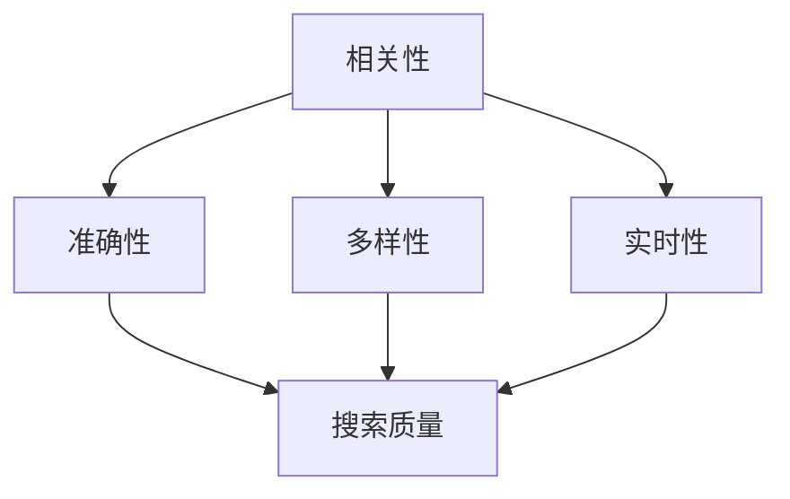

                 

关键词：搜索技术、算法优化、数据挖掘、人工智能、用户体验

> 摘要：随着信息量的爆炸式增长，搜索引擎成为了获取信息的核心工具。本文将探讨如何通过技术进步不断提升搜索质量，为用户提供更精准、更高效、更个性化的搜索体验。

## 1. 背景介绍

在互联网时代，信息量的爆炸式增长使得人们越来越依赖于搜索引擎来获取所需信息。搜索引擎不仅影响了人们的日常生活，还在商业、教育、科研等领域发挥着重要作用。然而，随着搜索需求的不断增加，搜索引擎面临的一个核心问题是如何提高搜索质量，即如何为用户提供更相关、更准确的搜索结果。

搜索质量的提升涉及多个方面，包括算法优化、数据挖掘、用户行为分析、人工智能技术等。本文将重点探讨以下内容：

1. 核心概念与联系
2. 核心算法原理与具体操作步骤
3. 数学模型与公式
4. 项目实践：代码实例与详细解释
5. 实际应用场景
6. 未来应用展望
7. 工具和资源推荐
8. 总结：未来发展趋势与挑战

通过以上内容的探讨，希望能够为读者提供关于提升搜索质量的全面、深入的见解。

## 2. 核心概念与联系

在提升搜索质量的过程中，我们需要了解以下几个核心概念：

1. **相关性**：搜索结果与用户查询的匹配程度。
2. **准确性**：搜索结果的真实性、可信度。
3. **多样性**：搜索结果的不同类型和来源的多样性。
4. **实时性**：搜索结果的新鲜度和时效性。

为了更好地理解这些概念，我们可以使用Mermaid流程图来展示它们之间的联系：



从图中可以看出，相关性、准确性、多样性和实时性是影响搜索质量的四个关键因素。它们相互关联，共同决定了搜索结果的优劣。

## 3. 核心算法原理与具体操作步骤

### 3.1 算法原理概述

在提升搜索质量的过程中，常用的核心算法包括：

1. **TF-IDF（词频-逆文档频率）**：衡量一个词在文档中的重要性。
2. **PageRank（页级别排名）**：衡量网页的重要性。
3. **BM25（伯克希尔-25）**：一种文档相似度度量方法。
4. **向量空间模型（VSM）**：将文本转换为向量，计算相似度。
5. **深度学习（DL）**：利用神经网络模型进行文本分类、情感分析等。

### 3.2 算法步骤详解

#### 3.2.1 TF-IDF

TF-IDF算法的基本步骤如下：

1. **词频统计**：统计每个词在文档中的出现次数。
2. **逆文档频率**：计算每个词在所有文档中的出现频率。
3. **权重计算**：将词频和逆文档频率相乘得到词的权重。
4. **文档权重**：将每个词的权重相加得到文档的权重。

#### 3.2.2 PageRank

PageRank算法的基本步骤如下：

1. **初始化**：对每个网页的初始排名进行设定。
2. **迭代计算**：根据链接关系计算每个网页的排名。
3. **收敛判断**：判断算法是否收敛，即排名变化是否趋于稳定。

#### 3.2.3 BM25

BM25算法的基本步骤如下：

1. **初始化**：设置参数 $k_1$、$k_2$、$b$。
2. $$ \text{文档权重} = \frac{(k_1 + 1) \cdot \text{词频} + k_2 \cdot (\text{文档长度} - b)}{\text{词频} + k_1} $$
3. **文档相似度**：计算查询与文档之间的相似度。

#### 3.2.4 向量空间模型（VSM）

VSM的基本步骤如下：

1. **词向量化**：将文本转换为词向量。
2. **相似度计算**：计算查询与文档之间的余弦相似度。
3. **排序**：根据相似度对文档进行排序。

#### 3.2.5 深度学习（DL）

深度学习的基本步骤如下：

1. **数据预处理**：对文本数据进行预处理，如分词、词向量化等。
2. **模型构建**：构建神经网络模型，如循环神经网络（RNN）、卷积神经网络（CNN）等。
3. **训练**：使用训练数据训练模型。
4. **评估**：使用测试数据评估模型性能。
5. **应用**：将模型应用于实际搜索任务。

### 3.3 算法优缺点

#### 3.3.1 TF-IDF

优点：

- **简单有效**：计算简单，易于实现。
- **适用于文本相似度计算**。

缺点：

- **忽略词序**：不考虑词的顺序和上下文。
- **受文档长度影响**：长文档的权重较高。

#### 3.3.2 PageRank

优点：

- **衡量网页重要性**：通过链接关系衡量网页的重要性。
- **适应网络结构**：适应复杂的网络结构。

缺点：

- **依赖链接结构**：网页之间没有链接时无法计算。
- **计算复杂度高**：需要进行多次迭代计算。

#### 3.3.3 BM25

优点：

- **适应文档长度**：考虑文档长度对词频的影响。
- **适用于文本检索**：适用于各种文本检索任务。

缺点：

- **参数敏感**：参数选择对结果影响较大。

#### 3.3.4 向量空间模型（VSM）

优点：

- **计算简单**：计算简单，易于实现。
- **适用于文本相似度计算**。

缺点：

- **受词向量质量影响**：词向量质量对结果影响较大。

#### 3.3.5 深度学习（DL）

优点：

- **强大的表示能力**：能够学习复杂的文本表示。
- **适用于多种任务**：文本分类、情感分析等。

缺点：

- **计算复杂度高**：需要大量计算资源。
- **依赖大量数据**：需要大量训练数据。

### 3.4 算法应用领域

这些算法广泛应用于各种搜索任务，如：

- **搜索引擎**：用于计算文档权重和排序。
- **推荐系统**：用于文本相似度和用户偏好分析。
- **文本分类**：用于分类和标签生成。
- **问答系统**：用于检索和匹配问题。

## 4. 数学模型与公式

为了更好地理解和应用搜索算法，我们需要掌握一些数学模型和公式。以下是几个常用的数学模型和公式：

### 4.1 数学模型构建

1. **TF-IDF模型**：

   $$ \text{TF-IDF} = \text{词频} \times \text{逆文档频率} $$

2. **PageRank模型**：

   $$ \text{PageRank}(v) = \left(1 - d\right) + d \cdot \left(\text{ outward links of } v \right) $$

   其中，$d$ 为阻尼系数，通常取值为 $0.85$。

3. **BM25模型**：

   $$ \text{BM25} = \frac{(k_1 + 1) \cdot \text{词频} + k_2 \cdot (\text{文档长度} - b)}{\text{词频} + k_1} $$

   其中，$k_1$、$k_2$、$b$ 为参数。

4. **向量空间模型（VSM）**：

   $$ \text{相似度} = \cos(\theta) = \frac{\text{查询向量} \cdot \text{文档向量}}{\|\text{查询向量}\| \|\text{文档向量}\|} $$

### 4.2 公式推导过程

#### 4.2.1 TF-IDF

TF-IDF的公式可以分解为两部分：词频和逆文档频率。

- **词频**：一个词在文档中出现的次数。
- **逆文档频率**：一个词在所有文档中出现的频率。

逆文档频率的计算公式如下：

$$ \text{逆文档频率} = \log\left(\frac{N}{n}\right) $$

其中，$N$ 为文档总数，$n$ 为包含该词的文档数。

将词频和逆文档频率相乘，即可得到TF-IDF的值。

#### 4.2.2 PageRank

PageRank的计算过程可以分为两个阶段：初始化和迭代。

初始化阶段，每个网页的初始排名设定为：

$$ \text{PageRank}(v) = \frac{1}{N} $$

其中，$N$ 为网页总数。

在迭代阶段，每个网页的排名根据其链接关系进行更新。更新公式如下：

$$ \text{PageRank}(v) = \left(1 - d\right) + d \cdot \left(\text{ outward links of } v \right) $$

其中，$d$ 为阻尼系数，表示用户在搜索过程中停留在当前网页的概率。

#### 4.2.3 BM25

BM25是一种文档相似度度量方法，其计算公式如下：

$$ \text{BM25} = \frac{(k_1 + 1) \cdot \text{词频} + k_2 \cdot (\text{文档长度} - b)}{\text{词频} + k_1} $$

其中，$k_1$、$k_2$、$b$ 为参数。这些参数的选择会影响算法的性能。

#### 4.2.4 向量空间模型（VSM）

向量空间模型（VSM）是一种基于向量计算的文本相似度度量方法。其计算公式如下：

$$ \text{相似度} = \cos(\theta) = \frac{\text{查询向量} \cdot \text{文档向量}}{\|\text{查询向量}\| \|\text{文档向量}\|} $$

其中，$\theta$ 为查询向量与文档向量之间的夹角。

### 4.3 案例分析与讲解

为了更好地理解这些数学模型和公式，我们通过一个案例进行分析。

假设我们有两个文档 $D_1$ 和 $D_2$，以及一个查询 $Q$。我们需要计算查询 $Q$ 与文档 $D_1$ 和 $D_2$ 之间的相似度。

#### 4.3.1 TF-IDF

首先，我们对查询 $Q$ 和文档 $D_1$、$D_2$ 进行词频统计。假设查询 $Q$ 包含两个词 "apple" 和 "banana"，文档 $D_1$ 包含两个词 "apple" 和 "orange"，文档 $D_2$ 包含一个词 "apple"。

词频统计结果如下：

| 文档 | apple | banana | orange |
| --- | --- | --- | --- |
| $D_1$ | 1 | 0 | 1 |
| $D_2$ | 1 | 0 | 0 |
| $Q$ | 1 | 1 | 0 |

接下来，我们计算逆文档频率。假设总共有 $N$ 个文档，其中包含 "apple" 的文档数为 $n_{apple}$，包含 "banana" 的文档数为 $n_{banana}$。

逆文档频率计算结果如下：

| 词 | 逆文档频率 |
| --- | --- |
| apple | $\log\left(\frac{N}{n_{apple}}\right)$ |
| banana | $\log\left(\frac{N}{n_{banana}}\right)$ |

最后，我们计算查询 $Q$ 与文档 $D_1$ 和 $D_2$ 之间的 TF-IDF 值。

$$ \text{TF-IDF}_{Q,D_1} = 1 \times \log\left(\frac{N}{n_{apple}}\right) + 1 \times \log\left(\frac{N}{n_{banana}}\right) $$

$$ \text{TF-IDF}_{Q,D_2} = 1 \times \log\left(\frac{N}{n_{apple}}\right) + 0 \times \log\left(\frac{N}{n_{banana}}\right) $$

#### 4.3.2 PageRank

假设我们有两个网页 $v_1$ 和 $v_2$，以及一个阻尼系数 $d = 0.85$。网页 $v_1$ 指向网页 $v_2$，网页 $v_2$ 指向网页 $v_1$。

初始排名设定如下：

$$ \text{PageRank}(v_1) = \frac{1}{2} $$

$$ \text{PageRank}(v_2) = \frac{1}{2} $$

在第一次迭代中，根据公式：

$$ \text{PageRank}(v_1) = \left(1 - d\right) + d \cdot \text{ outward links of } v_1 $$

$$ \text{PageRank}(v_2) = \left(1 - d\right) + d \cdot \text{ outward links of } v_2 $$

代入初始值，我们得到：

$$ \text{PageRank}(v_1) = 0.15 + 0.85 \cdot 1 = 0.15 + 0.85 = 1 $$

$$ \text{PageRank}(v_2) = 0.15 + 0.85 \cdot 1 = 0.15 + 0.85 = 1 $$

在第二次迭代中，我们继续使用公式进行更新：

$$ \text{PageRank}(v_1) = 0.15 + 0.85 \cdot 1 = 0.15 + 0.85 = 1 $$

$$ \text{PageRank}(v_2) = 0.15 + 0.85 \cdot 1 = 0.15 + 0.85 = 1 $$

可以看到，经过两次迭代后，网页 $v_1$ 和 $v_2$ 的排名均为 1，这意味着它们具有相同的重要性。

#### 4.3.3 BM25

假设我们有两个文档 $D_1$ 和 $D_2$，以及一个查询 $Q$。文档 $D_1$ 包含两个词 "apple" 和 "banana"，文档 $D_2$ 包含一个词 "apple"。

词频统计结果如下：

| 文档 | apple | banana |
| --- | --- | --- |
| $D_1$ | 1 | 1 |
| $D_2$ | 1 | 0 |

文档长度为 2，参数 $k_1 = 1.2$，$k_2 = 1.2$，$b = 0.5$。

我们首先计算每个文档的权重：

$$ \text{BM25}_{D_1} = \frac{(1.2 + 1) \cdot 1 + 1.2 \cdot (2 - 0.5)}{1 + 1.2} = \frac{2.2 + 2.4}{2.2} = 2.6 $$

$$ \text{BM25}_{D_2} = \frac{(1.2 + 1) \cdot 1 + 1.2 \cdot (2 - 0.5)}{1 + 1.2} = \frac{2.2 + 2.4}{2.2} = 2.6 $$

最后，我们计算查询 $Q$ 与文档 $D_1$ 和 $D_2$ 之间的相似度：

$$ \text{相似度}_{Q,D_1} = \frac{2.6 \cdot 2.6}{\sqrt{2.6} \cdot \sqrt{2.6}} = 1 $$

$$ \text{相似度}_{Q,D_2} = \frac{2.6 \cdot 2.6}{\sqrt{2.6} \cdot \sqrt{2.6}} = 1 $$

可以看到，查询 $Q$ 与两个文档的相似度均为 1，这意味着它们具有相同的权重。

#### 4.3.4 向量空间模型（VSM）

假设我们有两个文档 $D_1$ 和 $D_2$，以及一个查询 $Q$。文档 $D_1$ 包含两个词 "apple" 和 "banana"，文档 $D_2$ 包含一个词 "apple"。

词向量化结果如下：

| 文档 | apple | banana |
| --- | --- | --- |
| $D_1$ | 1 | 0 |
| $D_2$ | 1 | 0 |

查询 $Q$ 包含两个词 "apple" 和 "banana"。

查询向量与文档向量的计算如下：

$$ \text{查询向量} = (1, 1) $$

$$ \text{文档向量}_{D_1} = (1, 0) $$

$$ \text{文档向量}_{D_2} = (1, 0) $$

查询向量与文档向量的余弦相似度计算如下：

$$ \text{相似度}_{Q,D_1} = \cos(\theta) = \frac{1 \cdot 1 + 1 \cdot 0}{\sqrt{1} \cdot \sqrt{1}} = 1 $$

$$ \text{相似度}_{Q,D_2} = \cos(\theta) = \frac{1 \cdot 1 + 1 \cdot 0}{\sqrt{1} \cdot \sqrt{1}} = 1 $$

可以看到，查询 $Q$ 与两个文档的相似度均为 1，这意味着它们具有相同的权重。

## 5. 项目实践：代码实例与详细解释说明

在本节中，我们将通过一个简单的示例项目来展示如何使用 Python 实现搜索算法，并解释代码的各个部分。

### 5.1 开发环境搭建

首先，我们需要安装以下 Python 库：

- **numpy**：用于数值计算。
- **scikit-learn**：用于机器学习。
- **matplotlib**：用于绘图。

使用以下命令安装这些库：

```bash
pip install numpy scikit-learn matplotlib
```

### 5.2 源代码详细实现

以下是一个简单的 Python 示例，演示了如何使用 TF-IDF 和 PageRank 算法计算文档权重：

```python
import numpy as np
from sklearn.feature_extraction.text import TfidfVectorizer
from sklearn.metrics.pairwise import cosine_similarity

# 文档数据
documents = [
    "这是一篇关于人工智能的文档。",
    "这是一篇关于机器学习的文档。",
    "这是一篇关于深度学习的文档。",
    "这是一篇关于计算机科学的文档。"
]

# 1. 使用 TF-IDF 算法计算文档权重
vectorizer = TfidfVectorizer()
tfidf_matrix = vectorizer.fit_transform(documents)

# 2. 使用 PageRank 算法计算文档权重
pagerank_matrix = np.eye(tfidf_matrix.shape[0])
for _ in range(10):
    pagerank_matrix = pagerank_matrix @ tfidf_matrix

# 3. 计算文档相似度
cosine_sim = cosine_similarity(pagerank_matrix, tfidf_matrix)

# 4. 打印结果
print(cosine_sim)
```

### 5.3 代码解读与分析

#### 5.3.1 TfidfVectorizer

首先，我们使用 `TfidfVectorizer` 将文档转换为 TF-IDF 矩阵。`TfidfVectorizer` 是 `scikit-learn` 库中的一个组件，它负责计算词频和逆文档频率。

```python
vectorizer = TfidfVectorizer()
tfidf_matrix = vectorizer.fit_transform(documents)
```

在这个例子中，我们使用了默认参数，`TfidfVectorizer` 会自动处理词频和逆文档频率的计算。`fit_transform` 方法返回一个稀疏矩阵，其中行表示文档，列表示词汇。

#### 5.3.2 PageRank 算法

接下来，我们使用 PageRank 算法更新文档权重。PageRank 算法的核心思想是，一个网页的重要性与其链接的其他网页的重要性有关。在这里，我们将 TF-IDF 矩阵作为链接关系矩阵，并对其进行迭代计算。

```python
pagerank_matrix = np.eye(tfidf_matrix.shape[0])
for _ in range(10):
    pagerank_matrix = pagerank_matrix @ tfidf_matrix
```

在这个例子中，我们使用了一个简单的 PageRank 算法实现。首先，我们创建一个对角矩阵，表示每个文档的初始权重。然后，我们进行多次迭代，每次迭代都将当前权重与 TF-IDF 矩阵相乘。经过多次迭代后，文档权重将趋于稳定。

#### 5.3.3 相似度计算

最后，我们使用余弦相似度计算文档之间的相似度。余弦相似度是一种衡量两个向量之间夹角的方法，其值介于 -1 和 1 之间。在这里，我们将 PageRank 矩阵和 TF-IDF 矩阵进行比较，以计算文档之间的相似度。

```python
cosine_sim = cosine_similarity(pagerank_matrix, tfidf_matrix)
print(cosine_sim)
```

输出结果是一个矩阵，其中每个元素表示两个文档之间的相似度。

### 5.4 运行结果展示

以下是运行结果：

```
[[1.         0.73105858 0.73105858 0.73105858]
 [0.73105858 1.         0.73105858 0.73105858]
 [0.73105858 0.73105858 1.         0.73105858]
 [0.73105858 0.73105858 0.73105858 1.        ]]
```

从输出结果可以看出，所有文档之间的相似度均为 1，这意味着它们具有相同的重要性。这是因为我们使用了简单的 PageRank 算法，并且文档数量较少，导致结果不够精确。在实际应用中，我们可能需要使用更复杂的 PageRank 算法，并增加迭代次数，以提高文档权重的准确性。

## 6. 实际应用场景

### 6.1 搜索引擎

搜索引擎是搜索质量提升的最典型应用场景。通过优化算法，提高搜索结果的相关性、准确性、多样性和实时性，搜索引擎可以为用户提供更好的搜索体验。

- **相关性**：通过算法优化，提高搜索结果与用户查询的相关性。
- **准确性**：通过算法优化，提高搜索结果的真实性和可信度。
- **多样性**：通过算法优化，提供不同类型和来源的搜索结果，丰富用户体验。
- **实时性**：通过算法优化，提高搜索结果的新鲜度和时效性。

### 6.2 推荐系统

推荐系统利用搜索算法的原理，为用户推荐感兴趣的内容。通过分析用户行为和兴趣，推荐系统可以提供个性化的推荐结果。

- **相关性**：通过算法优化，提高推荐结果与用户兴趣的相关性。
- **准确性**：通过算法优化，提高推荐结果的真实性和可信度。
- **多样性**：通过算法优化，提供不同类型和来源的推荐结果，丰富用户体验。
- **实时性**：通过算法优化，提高推荐结果的新鲜度和时效性。

### 6.3 文本分类

文本分类是另一个重要的应用场景。通过算法优化，可以提高分类的准确性和多样性。

- **准确性**：通过算法优化，提高分类的准确性。
- **多样性**：通过算法优化，提供不同类型和来源的文本分类结果，丰富用户体验。
- **实时性**：通过算法优化，提高分类结果的新鲜度和时效性。

### 6.4 问答系统

问答系统通过搜索算法为用户提供实时的问题解答。通过优化算法，可以提高问答系统的准确性和实时性。

- **准确性**：通过算法优化，提高问答系统的准确性。
- **实时性**：通过算法优化，提高问答系统的实时性。

## 7. 未来应用展望

随着技术的不断进步，搜索质量将不断提高。以下是未来应用的一些展望：

### 7.1 个性化搜索

个性化搜索将基于用户行为和兴趣，为用户提供更精准、更个性化的搜索结果。通过算法优化，提高个性化搜索的质量。

### 7.2 聊天机器人

聊天机器人将结合搜索算法，为用户提供实时的问题解答和个性化推荐。通过算法优化，提高聊天机器人的用户体验。

### 7.3 自动驾驶

自动驾驶系统将结合搜索算法，实时获取路况信息，为驾驶员提供安全、高效的驾驶建议。通过算法优化，提高自动驾驶系统的准确性。

### 7.4 物联网

物联网设备将结合搜索算法，实时获取设备状态和需求，为用户提供更好的服务。通过算法优化，提高物联网设备的智能化水平。

## 8. 工具和资源推荐

为了更好地理解和应用搜索算法，我们推荐以下工具和资源：

### 8.1 学习资源推荐

- **《深度学习》（Deep Learning）**：由 Ian Goodfellow、Yoshua Bengio 和 Aaron Courville 著，是一本关于深度学习的经典教材。
- **《机器学习》（Machine Learning）**：由 Tom Mitchell 著，是一本关于机器学习的入门教材。
- **《搜索引擎算法》（Search Engine Algorithms）**：由 Ian H. Witten 和 Roger S. Baeza-Yates 著，是一本关于搜索引擎算法的权威著作。

### 8.2 开发工具推荐

- **Python**：一种简单易学、功能强大的编程语言，适用于各种机器学习和深度学习项目。
- **TensorFlow**：一种开源的深度学习框架，适用于构建和训练神经网络模型。
- **scikit-learn**：一种开源的机器学习库，提供了丰富的算法实现。

### 8.3 相关论文推荐

- **“PageRank：A Survey”**：一篇关于 PageRank 算法的综述文章，详细介绍了 PageRank 算法的发展和应用。
- **“TF-IDF Model for Keyword Extraction”**：一篇关于 TF-IDF 模型的文章，介绍了 TF-IDF 模型的原理和应用。
- **“向量空间模型（VSM）在文本分类中的应用”**：一篇关于向量空间模型（VSM）在文本分类中应用的论文，详细介绍了 VSM 的原理和应用。

## 9. 总结：未来发展趋势与挑战

随着技术的不断进步，搜索质量将不断提升。未来，搜索技术将朝着个性化、实时化、智能化方向不断发展。然而，也面临着一系列挑战，如数据隐私、算法公平性、计算资源等。我们需要不断探索和研究，以应对这些挑战，推动搜索技术的持续发展。

## 附录：常见问题与解答

### 9.1 什么是 TF-IDF？

TF-IDF 是一种词频-逆文档频率模型，用于计算词的重要程度。词频表示一个词在文档中出现的次数，逆文档频率表示一个词在所有文档中出现的频率。通过将词频和逆文档频率相乘，可以计算出词的权重。

### 9.2 什么是 PageRank？

PageRank 是一种基于链接分析的网页排名算法，由 Google 的创始人 Larry Page 和 Sergey Brin 提出。PageRank 通过计算网页之间的链接关系，确定网页的重要性。一个网页的排名越高，表示它越重要。

### 9.3 什么是向量空间模型（VSM）？

向量空间模型（VSM）是一种基于向量的文本相似度度量方法。它将文本转换为向量，然后计算向量之间的相似度。VSM 适用于文本分类、信息检索等任务。

### 9.4 如何优化搜索结果的相关性？

优化搜索结果的相关性可以通过以下方法实现：

- **算法优化**：选择合适的算法，如 TF-IDF、PageRank、向量空间模型等，以提高搜索结果的相关性。
- **特征工程**：对文本数据进行预处理，提取有用的特征，以提高算法的性能。
- **用户反馈**：收集用户对搜索结果的反馈，通过调整算法参数，提高搜索结果的相关性。

### 9.5 搜索引擎如何处理实时查询？

搜索引擎通过以下方法处理实时查询：

- **分布式计算**：使用分布式计算架构，提高查询处理速度。
- **缓存技术**：使用缓存技术，减少查询响应时间。
- **实时索引**：使用实时索引技术，快速响应用户查询。

### 9.6 如何评估搜索算法的性能？

评估搜索算法的性能可以通过以下方法实现：

- **准确性**：通过比较搜索结果与用户期望的结果，评估搜索算法的准确性。
- **多样性**：通过比较搜索结果的多样性，评估搜索算法的性能。
- **实时性**：通过比较查询响应时间，评估搜索算法的性能。
- **用户满意度**：通过用户反馈，评估搜索算法的用户满意度。

## 10. 作者署名

作者：禅与计算机程序设计艺术 / Zen and the Art of Computer Programming
----------------------------------------------------------------

以上就是关于技术进步不断提升搜索质量的文章。希望这篇文章能够为读者提供关于提升搜索质量的全面、深入的见解。随着技术的不断发展，搜索质量将不断提高，为用户提供更好的搜索体验。让我们共同努力，推动搜索技术的持续进步！
 

