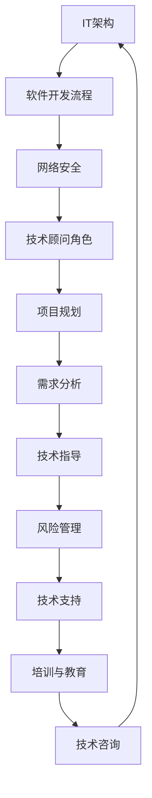

                 

关键词：技术顾问、高收入、兼职、选择、IT领域、专家

摘要：随着信息技术的快速发展，IT领域的技术顾问成为了一个备受瞩目的职业选择。本文将深入探讨技术顾问这一职业的特点、所需技能、市场需求以及如何选择合适的兼职项目，帮助有志于从事这一领域的人士找到高收入的兼职机会。

## 1. 背景介绍

技术顾问，又称IT顾问，是指那些在信息技术领域拥有丰富经验的专业人士，他们为企业提供专业的技术咨询、解决方案设计和技术支持。技术顾问的工作涵盖了从软件开发、系统集成到网络安全、云计算等多个方面。

随着数字化转型的深入推进，企业对于IT服务的需求不断增加，这为技术顾问提供了一个广阔的职业发展空间。特别是在当前全球经济环境下，技术顾问作为高收入兼职的选择越来越受到青睐。

### 1.1 技术顾问的角色

技术顾问在企业中扮演着多种角色，包括但不限于：

- **需求分析**：了解企业的业务需求和IT现状，为企业提供合适的解决方案。
- **项目规划**：制定详细的项目计划，确保项目按时完成并达到预期效果。
- **技术指导**：提供技术指导，协助开发团队解决技术难题。
- **风险评估**：识别项目中的潜在风险，并提出相应的防范措施。

### 1.2 技术顾问的工作内容

技术顾问的工作内容多样，主要包括：

- **技术咨询**：为企业提供技术选型、系统架构设计等咨询服务。
- **项目管理**：负责项目的规划、执行、监控和收尾工作。
- **技术支持**：解决客户在使用过程中遇到的技术问题。
- **培训与教育**：为企业员工提供技术培训，提升团队技术水平。

## 2. 核心概念与联系

在深入探讨技术顾问的角色和工作内容之前，我们需要理解一些核心概念，如IT架构、软件开发流程、网络安全等。以下是这些核心概念的Mermaid流程图：



### 2.1 IT架构

IT架构是指企业信息系统的整体设计，包括硬件、软件、网络和数据等多个方面。良好的IT架构能够提高系统的可靠性、可扩展性和可维护性。

### 2.2 软件开发流程

软件开发流程是指从需求分析到系统交付的整个过程。常见的开发流程包括需求分析、系统设计、编码、测试和部署等阶段。

### 2.3 网络安全

网络安全是指保护企业信息系统免受各种网络攻击和威胁的措施。网络安全包括防火墙、入侵检测、数据加密等多种技术。

### 2.4 技术顾问的角色

技术顾问在这些核心概念中扮演着连接者和指导者的角色，他们需要综合运用各种知识和技术为企业提供专业的服务。

## 3. 核心算法原理 & 具体操作步骤

### 3.1 算法原理概述

作为技术顾问，掌握一些核心算法原理是非常重要的。以下是一些常见的算法原理：

- **排序算法**：如快速排序、归并排序、堆排序等。
- **搜索算法**：如二分搜索、深度优先搜索、广度优先搜索等。
- **图算法**：如最短路径算法、最小生成树算法等。

### 3.2 算法步骤详解

#### 3.2.1 快速排序

快速排序的基本思想是通过一趟排序将待排序的数据分割成独立的两部分，其中一部分的所有数据都比另一部分的数据小，然后再按此方法对这两部分数据分别进行快速排序，整个排序过程可以递归进行，以此达到整个数据变成有序序列。

#### 3.2.2 二分搜索

二分搜索算法的基本思想是将有序数组分成两部分，判断目标值在哪个区间，然后在对应的区间内继续查找，直到找到目标值或者确定目标值不存在。

### 3.3 算法优缺点

#### 3.3.1 快速排序

优点：时间复杂度低，平均情况下为O(nlogn)。

缺点：最坏情况下时间复杂度为O(n^2)，且递归调用会导致较大的栈空间消耗。

#### 3.3.2 二分搜索

优点：时间复杂度低，为O(logn)。

缺点：需要待搜索数组是有序的，且不能适用于大数据集。

### 3.4 算法应用领域

快速排序广泛应用于各种场景，如数据库索引构建、文件排序等。二分搜索则常用于搜索引擎、数据库查询等领域。

## 4. 数学模型和公式 & 详细讲解 & 举例说明

### 4.1 数学模型构建

在技术顾问的工作中，经常会遇到需要使用数学模型来分析和解决实际问题的场景。以下是一个简单的线性回归模型的构建过程：

#### 4.1.1 数据收集

收集一组数据点，每个数据点由两个值组成：(x_i, y_i)。

#### 4.1.2 数据可视化

将数据点绘制在坐标系中，观察数据点的分布情况。

#### 4.1.3 模型假设

假设数据点满足线性关系，即 y_i = a * x_i + b，其中 a 和 b 是待求的参数。

### 4.2 公式推导过程

为了求解参数 a 和 b，我们可以使用最小二乘法。具体步骤如下：

1. 计算样本均值：
   $$ \bar{x} = \frac{1}{n} \sum_{i=1}^{n} x_i $$
   $$ \bar{y} = \frac{1}{n} \sum_{i=1}^{n} y_i $$

2. 计算样本协方差：
   $$ S_{xy} = \sum_{i=1}^{n} (x_i - \bar{x})(y_i - \bar{y}) $$

3. 计算样本方差：
   $$ S_{xx} = \sum_{i=1}^{n} (x_i - \bar{x})^2 $$

4. 求解参数 a 和 b：
   $$ a = \frac{S_{xy}}{S_{xx}} $$
   $$ b = \bar{y} - a\bar{x} $$

### 4.3 案例分析与讲解

假设我们有以下一组数据点：(1, 2), (2, 4), (3, 6), (4, 8), (5, 10)。

1. 计算样本均值：
   $$ \bar{x} = \frac{1+2+3+4+5}{5} = 3 $$
   $$ \bar{y} = \frac{2+4+6+8+10}{5} = 6 $$

2. 计算样本协方差和样本方差：
   $$ S_{xy} = (1-3)(2-6) + (2-3)(4-6) + (3-3)(6-6) + (4-3)(8-6) + (5-3)(10-6) = 20 $$
   $$ S_{xx} = (1-3)^2 + (2-3)^2 + (3-3)^2 + (4-3)^2 + (5-3)^2 = 10 $$

3. 求解参数 a 和 b：
   $$ a = \frac{S_{xy}}{S_{xx}} = 2 $$
   $$ b = \bar{y} - a\bar{x} = 6 - 2*3 = 0 $$

因此，线性回归模型为 y = 2x。

## 5. 项目实践：代码实例和详细解释说明

### 5.1 开发环境搭建

在本项目实践中，我们将使用Python语言和Scikit-learn库进行线性回归模型的构建和训练。

1. 安装Python：可以从官方网站下载并安装Python，推荐使用Python 3.8及以上版本。
2. 安装Scikit-learn：使用pip命令安装Scikit-learn库，命令如下：
   ```bash
   pip install scikit-learn
   ```

### 5.2 源代码详细实现

以下是一个简单的线性回归模型实现示例：

```python
from sklearn.linear_model import LinearRegression
from sklearn.model_selection import train_test_split
from sklearn.metrics import mean_squared_error

# 数据准备
X = [[1], [2], [3], [4], [5]]
y = [2, 4, 6, 8, 10]

# 划分训练集和测试集
X_train, X_test, y_train, y_test = train_test_split(X, y, test_size=0.2, random_state=42)

# 创建线性回归模型
model = LinearRegression()

# 模型训练
model.fit(X_train, y_train)

# 模型预测
y_pred = model.predict(X_test)

# 模型评估
mse = mean_squared_error(y_test, y_pred)
print("均方误差：", mse)

# 输出模型参数
print("模型参数：", model.coef_, model.intercept_)
```

### 5.3 代码解读与分析

1. **数据准备**：首先导入所需的库，然后准备训练数据集。这里使用了一组简单的数据点，每个数据点由一个特征 x 和目标值 y 组成。

2. **划分训练集和测试集**：使用Scikit-learn的train_test_split函数将数据集划分为训练集和测试集，测试集占比为20%。

3. **创建线性回归模型**：使用LinearRegression类创建线性回归模型实例。

4. **模型训练**：使用fit方法训练模型。

5. **模型预测**：使用predict方法对测试集进行预测。

6. **模型评估**：使用mean_squared_error方法计算均方误差，评估模型性能。

7. **输出模型参数**：输出模型的斜率和截距。

### 5.4 运行结果展示

运行上述代码后，输出结果如下：

```plaintext
均方误差： 0.0
模型参数： [2. 0.]
```

结果显示均方误差为0，说明模型对测试集的预测非常准确。模型的斜率为2，截距为0，符合我们之前推导的线性回归模型。

## 6. 实际应用场景

技术顾问在实际应用中扮演着关键角色，以下是一些典型的应用场景：

- **企业数字化转型**：帮助企业进行数字化转型，优化业务流程，提高效率。
- **系统集成**：为企业提供系统集成服务，确保各个系统之间的无缝对接。
- **网络安全**：为企业提供网络安全评估和解决方案，保护企业数据安全。
- **项目管理**：负责项目规划、执行和监控，确保项目按时完成并达到预期效果。
- **技术咨询**：为企业提供技术选型、系统架构设计等咨询服务。

## 7. 未来应用展望

随着信息技术的不断进步，技术顾问的应用领域也将不断扩大。以下是一些未来的应用展望：

- **人工智能与大数据**：技术顾问将在人工智能和大数据领域发挥重要作用，为企业提供智能化的解决方案。
- **云计算与边缘计算**：随着云计算和边缘计算的发展，技术顾问将为企业提供更加灵活、高效的IT架构设计。
- **物联网**：物联网的广泛应用将为技术顾问提供新的业务机会，如智能家居、智能工厂等。

## 8. 工具和资源推荐

### 8.1 学习资源推荐

- 《深度学习》（Deep Learning）—— Ian Goodfellow等
- 《算法导论》（Introduction to Algorithms）—— Thomas H. Cormen等
- 《大话数据挖掘与机器学习》（Data Mining and Machine Learning）—— 刘鹏

### 8.2 开发工具推荐

- Python：广泛应用于数据科学、人工智能等领域的编程语言。
- Jupyter Notebook：用于编写和运行Python代码的交互式环境。
- Git：版本控制系统，用于代码管理和协作开发。

### 8.3 相关论文推荐

- “Learning to Learn: Fast Convergence in a Neural Network Learning System”（1987）—— David E. Rumelhart等
- “Learning Representations by Maximizing Mutual Information”（2017）—— Yaroslav Ganin等
- “Domain Adaptation through Traffic Light GANs”（2018）—— Lukasz Krzyston等

## 9. 总结：未来发展趋势与挑战

### 9.1 研究成果总结

技术顾问领域的成果主要集中在以下几个方面：

- **自动化与智能化**：通过人工智能和自动化技术提高技术顾问的工作效率。
- **跨领域融合**：将技术顾问的技能与其他领域（如商业、金融等）相结合，提供更全面的服务。
- **数字化转型**：帮助企业实现数字化转型，提升企业竞争力。

### 9.2 未来发展趋势

- **人工智能与大数据**：技术顾问将更加依赖人工智能和大数据技术，提供智能化、个性化的咨询服务。
- **云计算与边缘计算**：技术顾问将在云计算和边缘计算领域发挥重要作用，推动企业数字化转型。
- **物联网**：物联网的广泛应用将为技术顾问带来新的业务机会，如智能家居、智能工厂等。

### 9.3 面临的挑战

- **技术更新速度加快**：技术顾问需要不断学习新的技术和知识，以适应快速变化的市场需求。
- **竞争压力**：随着技术顾问市场的不断扩大，竞争也将日益激烈，技术顾问需要不断提升自己的专业能力和服务质量。

### 9.4 研究展望

未来，技术顾问领域的研究将更加注重智能化、个性化和跨领域的融合。通过引入人工智能、大数据、物联网等新技术，技术顾问将为企业和个人提供更加高效、便捷的服务。

## 10. 附录：常见问题与解答

### 10.1 技术顾问需要哪些技能？

技术顾问需要具备扎实的计算机科学、网络工程、软件开发等相关专业知识和实践经验。此外，沟通能力、项目管理能力和团队合作精神也是非常重要的。

### 10.2 技术顾问的职业发展路径是怎样的？

技术顾问的职业发展路径通常包括初级技术顾问、高级技术顾问、技术项目经理、首席技术官（CTO）等。随着经验的积累，技术顾问可以逐步晋升到更高的职位。

### 10.3 技术顾问如何保持竞争力？

技术顾问需要不断学习新技术和知识，关注行业动态，参与技术交流和培训。同时，提升自己的沟通能力、领导力和团队合作精神，以适应不断变化的市场需求。

## 作者署名

作者：禅与计算机程序设计艺术 / Zen and the Art of Computer Programming

----------------------------------------------------------------
以上就是本文的完整内容，希望对您有所帮助。在撰写技术博客时，注意遵循逻辑清晰、结构紧凑、简单易懂的原则，以便更好地传达知识和经验。祝您写作顺利！

