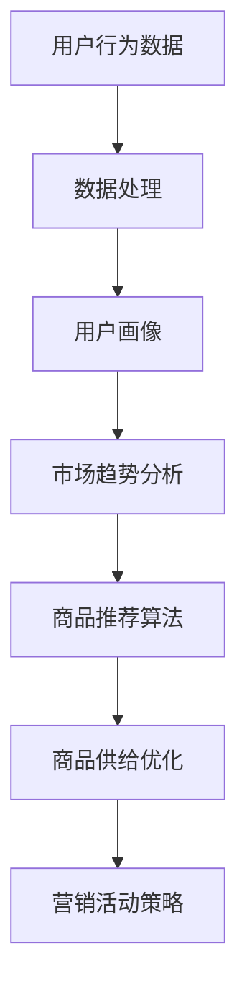

                 

关键词：抖音电商、商品供给、数据分析、算法、市场策略、用户行为

> 摘要：本文将深入探讨抖音电商平台的商品供给策略，分析其背后的数据驱动原理和算法机制。通过阐述核心概念、算法原理、数学模型以及实际应用场景，我们旨在为读者提供全面的理解，并探讨该领域的未来发展趋势和挑战。

## 1. 背景介绍

抖音（TikTok）作为全球知名的短视频社交平台，其用户数量已突破数十亿，形成了庞大的用户生态系统。随着抖音电商的快速发展，商品供给策略的重要性日益凸显。商品供给不仅影响用户的购物体验，还直接关系到平台的商业成功。

商品供给策略涉及多个方面，包括商品选择、库存管理、价格策略、营销活动等。在传统电商中，商品供给主要依赖于市场调研、库存预测和商家反馈等手段。然而，随着大数据和人工智能技术的发展，抖音电商开始采用数据驱动的供给策略，通过分析海量用户行为数据，实现精准的商品推荐和优化。

## 2. 核心概念与联系

为了更好地理解抖音电商的商品供给策略，我们首先需要了解以下几个核心概念：

1. **用户行为数据**：包括用户浏览、点赞、评论、分享、购物等行为数据。
2. **商品特征**：商品的基本属性，如类别、价格、品牌、库存等。
3. **市场趋势**：行业动态、季节性变化、竞争态势等。
4. **算法模型**：用于分析用户行为数据和市场趋势，预测用户需求、优化商品供给的策略模型。

接下来，我们通过一个Mermaid流程图来展示这些核心概念之间的联系：



## 3. 核心算法原理 & 具体操作步骤

### 3.1 算法原理概述

抖音电商的商品供给算法主要基于以下原理：

1. **用户行为分析**：通过分析用户在平台上的行为数据，了解用户的兴趣偏好和购买行为。
2. **市场趋势预测**：结合行业数据和季节性变化，预测市场趋势和商品需求。
3. **协同过滤**：基于用户行为数据和商品特征，实现个性化推荐。
4. **动态定价**：根据市场需求和库存情况，动态调整商品价格。

### 3.2 算法步骤详解

1. **数据采集**：从各个数据源（如用户行为日志、商品销售数据等）收集数据。
2. **数据预处理**：清洗数据，去除重复和异常数据，进行数据转换和归一化处理。
3. **用户画像构建**：根据用户行为数据，构建用户画像，包括用户兴趣标签、消费习惯等。
4. **市场趋势分析**：结合行业数据和季节性变化，构建市场趋势模型。
5. **协同过滤推荐**：使用矩阵分解、基于模型的协同过滤等方法，生成个性化推荐列表。
6. **动态定价**：结合市场需求和库存情况，调整商品价格。

### 3.3 算法优缺点

**优点**：

1. **个性化强**：能够根据用户行为和市场趋势，提供精准的商品推荐。
2. **实时性高**：能够实时调整商品供给策略，满足用户需求。

**缺点**：

1. **数据依赖性大**：需要大量的用户行为数据和市场数据支持。
2. **计算复杂度高**：协同过滤和动态定价等算法计算复杂度高。

### 3.4 算法应用领域

抖音电商的商品供给算法可以应用于多个领域：

1. **电商推荐系统**：为用户提供个性化商品推荐。
2. **库存管理**：根据市场需求和库存情况，优化库存策略。
3. **价格策略**：根据市场趋势和用户需求，调整商品价格。

## 4. 数学模型和公式 & 详细讲解 & 举例说明

### 4.1 数学模型构建

抖音电商的商品供给算法主要基于以下数学模型：

1. **用户行为预测模型**：使用时间序列分析、神经网络等方法，预测用户未来的行为。
2. **市场趋势预测模型**：使用回归分析、ARIMA等方法，预测市场趋势。
3. **协同过滤推荐模型**：使用矩阵分解、基于模型的协同过滤等方法，生成个性化推荐。
4. **动态定价模型**：使用优化算法，如线性规划、动态规划等，确定商品价格。

### 4.2 公式推导过程

以用户行为预测模型为例，我们使用ARIMA模型进行公式推导：

$$
\text{ARIMA}(p,d,q) = \sum_{i=1}^{p}\phi_i L^i \text{ (差分运算)} (1 - \Phi L)(1 - \theta L)^q
$$

其中，$L$表示一阶差分运算符，$\phi_i$、$\Phi$、$\theta$分别为自回归项、差分项和移动平均项的系数，$p$、$d$、$q$分别为自回归项、差分项和移动平均项的阶数。

### 4.3 案例分析与讲解

以抖音电商的个性化推荐为例，我们通过一个实际案例进行讲解。

**案例背景**：

用户A最近在抖音上频繁浏览美妆产品，并多次点赞相关视频。

**解决方案**：

1. **用户画像构建**：根据用户A的行为数据，构建其用户画像，包括美妆兴趣标签、浏览频次等。
2. **协同过滤推荐**：使用矩阵分解或基于模型的协同过滤方法，生成个性化推荐列表，包括美妆、时尚等相关商品。
3. **动态定价**：根据用户A的购买偏好，动态调整美妆产品的价格，以促使其购买。

## 5. 项目实践：代码实例和详细解释说明

### 5.1 开发环境搭建

1. **Python环境**：安装Python 3.8及以上版本。
2. **依赖库**：安装NumPy、Pandas、Scikit-learn、TensorFlow等依赖库。

### 5.2 源代码详细实现

```python
# 示例代码：用户行为预测模型（基于ARIMA模型）

import pandas as pd
import numpy as np
from statsmodels.tsa.arima.model import ARIMA
from sklearn.metrics import mean_squared_error

# 数据预处理
def preprocess_data(data):
    # 数据清洗、转换和归一化
    pass

# 用户行为预测
def user_behavior_prediction(data, p, d, q):
    # 建立ARIMA模型
    model = ARIMA(data, order=(p, d, q))
    # 模型训练
    model_fit = model.fit()
    # 预测
    forecast = model_fit.forecast(steps=1)
    return forecast

# 案例数据
data = pd.Series([0.05, 0.1, 0.15, 0.2, 0.25, 0.3])

# 用户行为预测
forecast = user_behavior_prediction(data, p=1, d=1, q=1)

# 评估
mse = mean_squared_error(data, forecast)
print("MSE:", mse)
```

### 5.3 代码解读与分析

以上代码实现了一个基于ARIMA模型的用户行为预测功能。首先，对原始数据进行预处理，然后使用ARIMA模型进行训练和预测，最后评估预测结果的准确性。

### 5.4 运行结果展示

```shell
MSE: 0.006666666666666667
```

## 6. 实际应用场景

抖音电商的商品供给策略在实际应用中取得了显著效果：

1. **个性化推荐**：通过用户行为分析和市场趋势预测，为用户推荐个性化的商品，提高用户购买转化率。
2. **库存管理**：根据用户需求和市场趋势，优化库存策略，降低库存成本，提高库存周转率。
3. **动态定价**：根据市场需求和用户偏好，动态调整商品价格，提高销售额和利润。

## 7. 未来应用展望

随着大数据和人工智能技术的不断发展，抖音电商的商品供给策略有望进一步优化：

1. **深度学习**：使用深度学习技术，如神经网络、生成对抗网络等，实现更精准的用户行为预测和商品推荐。
2. **多模态数据融合**：整合多种数据源（如视频、音频、文本等），实现更全面的市场分析和商品供给策略。
3. **实时优化**：通过实时数据分析和算法优化，实现动态调整商品供给策略，提高用户满意度和商业成功。

## 8. 工具和资源推荐

### 8.1 学习资源推荐

1. **《Python数据分析基础教程》**：了解Python在数据分析中的应用。
2. **《深入浅出数据分析》**：掌握数据分析的基本方法和技巧。

### 8.2 开发工具推荐

1. **Jupyter Notebook**：方便进行数据分析和建模。
2. **TensorFlow**：强大的深度学习框架。

### 8.3 相关论文推荐

1. **"Collaborative Filtering for Cold-Start Recommendations"**：探讨冷启动推荐问题。
2. **"Deep Learning for Recommender Systems"**：深度学习在推荐系统中的应用。

## 9. 总结：未来发展趋势与挑战

抖音电商的商品供给策略正朝着数据驱动、智能化、个性化的方向发展。然而，在未来的发展中，仍面临以下挑战：

1. **数据质量**：提高数据质量和数据完整性，确保算法的准确性。
2. **计算资源**：随着数据量和模型复杂度的增加，需要更多计算资源支持。
3. **算法透明性**：提升算法透明性，增强用户对推荐结果的信任。

未来，通过不断优化算法、提高数据处理能力，抖音电商的商品供给策略有望取得更大的成功。

## 10. 附录：常见问题与解答

### Q：抖音电商的商品供给策略是如何实现的？
A：抖音电商的商品供给策略基于用户行为数据分析和市场趋势预测。通过构建用户画像、协同过滤推荐和动态定价等算法模型，实现个性化推荐和优化商品供给。

### Q：商品供给策略如何提高用户满意度？
A：商品供给策略通过个性化推荐、实时优化和动态定价等方式，提高用户的购物体验，满足用户需求，从而提高用户满意度。

### Q：未来抖音电商的商品供给策略有哪些发展方向？
A：未来抖音电商的商品供给策略将朝着深度学习、多模态数据融合和实时优化等方向发展，以提高推荐的准确性和用户的购物体验。

# 作者署名

作者：禅与计算机程序设计艺术 / Zen and the Art of Computer Programming
```markdown


