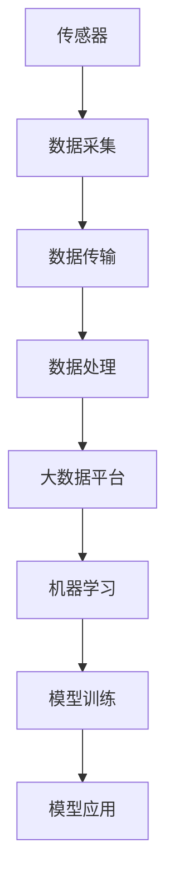
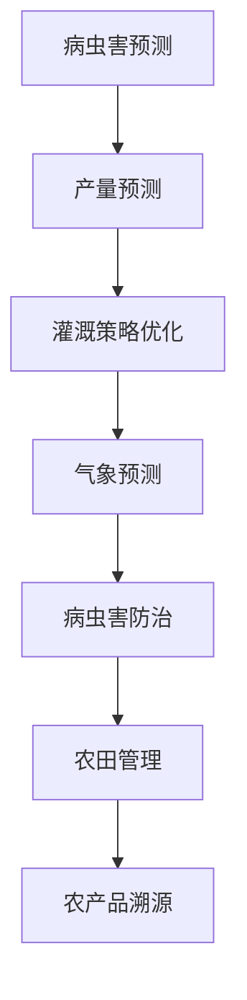

                 

关键词：农业物联网，算法面试，拼多多，校招，技术深度，实战案例

> 摘要：本文针对2024年拼多多农业物联网校招算法面试，详细解析了面试过程中可能涉及的算法、技术原理、实践应用以及未来展望。通过深入剖析核心概念、算法原理、数学模型、代码实例和实际应用，为读者提供了全面的面试准备指南。

## 1. 背景介绍

随着人工智能和物联网技术的快速发展，农业物联网逐渐成为农业现代化的关键支撑。农业物联网通过传感器、无线通信和网络技术，实现对农业生产环境的实时监测和智能控制，从而提高农业生产效率、减少资源浪费和提升农产品质量。拼多多作为一家领先的电商平台，一直致力于农业产业的发展，其农业物联网项目也是公司战略布局的重要一环。

2024年，拼多多将在校招中推出针对农业物联网算法岗位的面试环节。此次面试将重点考察应聘者对农业物联网相关算法的理解和应用能力，包括数据采集、处理、分析以及算法优化等方面。本文将针对这些内容进行详细解析，帮助读者备战2024年拼多多农业物联网校招算法面试。

### 1.1 农业物联网的发展现状

农业物联网技术起源于20世纪90年代，随着传感器技术、无线通信技术和大数据技术的不断进步，农业物联网逐渐得到广泛应用。目前，农业物联网技术已涵盖了土壤监测、气象监测、灌溉系统、病虫害监测等多个领域。

- **土壤监测**：通过传感器实时监测土壤湿度、温度、pH值等参数，为农民提供精准的种植决策。
- **气象监测**：通过气象传感器收集气象数据，帮助农民及时了解天气变化，调整农事活动。
- **灌溉系统**：利用物联网技术实现精准灌溉，提高水资源利用效率。
- **病虫害监测**：通过传感器监测作物病虫害情况，提前预警，降低农药使用量。

### 1.2 拼多多农业物联网项目简介

拼多多农业物联网项目旨在利用物联网、大数据和人工智能等技术，打造一个智能化的农业生产生态系统。该项目主要包括以下几个方面：

- **数据采集**：通过传感器和摄像头等设备，实时采集农业生产过程中的各类数据。
- **数据处理**：利用大数据技术对采集到的数据进行处理和分析，提取有价值的信息。
- **智能决策**：基于分析结果，为农民提供精准的种植、灌溉、施肥等建议。
- **智能控制**：通过物联网设备，实现对农业生产过程的自动控制，提高生产效率。

### 1.3 面试背景和目标

2024年拼多多农业物联网校招算法面试的主要目标是选拔具备以下能力的优秀人才：

- **算法基础**：熟悉常见的机器学习算法和数据处理方法，具备较强的编程能力。
- **技术应用**：了解农业物联网相关技术和应用场景，能够将算法应用于实际问题。
- **问题解决**：具备解决复杂问题的能力，能够针对具体问题提出有效的解决方案。
- **团队协作**：具备良好的沟通和团队协作能力，能够与其他团队成员共同推进项目。

## 2. 核心概念与联系

为了更好地理解农业物联网算法面试的内容，我们首先需要掌握以下几个核心概念：

- **物联网**：物联网（Internet of Things，IoT）是指将各种信息传感设备与互联网结合起来而形成的一个巨大网络。在农业物联网中，物联网技术主要用于数据采集、传输和处理。
- **传感器**：传感器是物联网的核心部件，用于检测和测量环境中的各种物理量，如温度、湿度、光照强度等。传感器采集到的数据是农业物联网算法的基础。
- **机器学习**：机器学习是一种通过数据驱动的方式学习和发现规律的人工智能技术。在农业物联网中，机器学习算法可用于数据分析和预测，如作物病虫害预测、产量预测等。
- **大数据**：大数据是指数据量大、类型多、速度快的海量数据。在农业物联网中，大数据技术用于处理和分析大量传感器数据，提取有价值的信息。

### 2.1 物联网与农业物联网的关系

物联网是农业物联网的基础，两者之间的联系主要体现在以下几个方面：

- **数据采集**：物联网技术通过传感器设备采集农业环境中的各种数据，如土壤湿度、气象参数等。
- **数据传输**：物联网技术利用无线通信技术将传感器数据传输到数据中心或云端。
- **数据处理**：数据中心或云端利用大数据和机器学习技术对传感器数据进行处理和分析，提取有价值的信息。

### 2.2 传感器与机器学习的关系

传感器是农业物联网数据采集的关键环节，而机器学习则是数据处理和分析的核心。传感器与机器学习之间的联系主要体现在以下几个方面：

- **数据来源**：传感器采集到的数据是机器学习算法训练和预测的基础。
- **数据预处理**：机器学习算法需要处理大量的原始数据，如去除噪声、缺失值填充等。
- **模型训练**：基于传感器数据，利用机器学习算法构建预测模型，如病虫害预测模型、产量预测模型等。
- **模型应用**：将训练好的模型应用于实际生产场景，为农民提供决策支持。

### 2.3 大数据与物联网的关系

大数据与物联网的关系主要体现在数据采集、传输和处理等方面。物联网技术通过传感器设备采集大量的农业数据，这些数据经过传输和预处理后，进入大数据平台进行存储、分析和挖掘。

- **数据采集**：物联网技术通过传感器设备实时采集农业环境数据。
- **数据传输**：物联网技术利用无线通信技术将数据传输到数据中心或云端。
- **数据处理**：大数据技术对传输到数据中心或云端的数据进行存储、分析和挖掘，提取有价值的信息。
- **数据应用**：大数据分析结果为农业生产提供决策支持，如作物种植建议、灌溉策略等。

### 2.4 农业物联网与机器学习架构图

为了更好地理解农业物联网与机器学习之间的关系，我们可以使用Mermaid流程图进行展示：



在这个架构图中，传感器负责采集农业环境数据，数据经过传输和处理后进入大数据平台，利用机器学习算法进行模型训练，最终将训练好的模型应用于实际生产场景。

## 3. 核心算法原理 & 具体操作步骤

在农业物联网算法面试中，考生需要掌握以下核心算法原理和具体操作步骤：

### 3.1 算法原理概述

- **机器学习算法**：机器学习算法是农业物联网的核心技术之一，包括监督学习、无监督学习和强化学习等。监督学习算法如决策树、支持向量机、神经网络等，常用于分类和回归任务；无监督学习算法如聚类、主成分分析等，常用于数据降维和模式识别；强化学习算法如Q学习、深度强化学习等，常用于动态决策和优化。
- **数据处理算法**：数据处理算法包括数据预处理、特征提取、特征选择等。数据预处理算法如数据清洗、缺失值填充、数据归一化等，用于处理原始数据，使其符合算法要求；特征提取算法如主成分分析、奇异值分解等，用于从原始数据中提取有用的信息；特征选择算法如相关系数、信息增益等，用于选择对预测任务最重要的特征。
- **优化算法**：优化算法如梯度下降、随机梯度下降等，用于优化模型参数，提高预测准确性。在农业物联网中，优化算法常用于优化灌溉策略、病虫害防治策略等。

### 3.2 算法步骤详解

- **数据采集**：通过传感器设备实时采集农业环境数据，如土壤湿度、温度、光照强度等。
- **数据预处理**：对采集到的数据进行清洗、归一化等处理，使其符合算法要求。
- **特征提取**：从预处理后的数据中提取有用的特征，如温度、湿度等，用于构建预测模型。
- **模型选择**：根据预测任务选择合适的机器学习算法，如决策树、支持向量机、神经网络等。
- **模型训练**：利用训练数据集对所选算法进行训练，得到预测模型。
- **模型评估**：使用验证数据集对训练好的模型进行评估，如准确率、召回率等。
- **模型优化**：根据模型评估结果，使用优化算法如梯度下降、随机梯度下降等对模型进行优化。
- **模型应用**：将优化后的模型应用于实际生产场景，为农民提供决策支持。

### 3.3 算法优缺点

- **机器学习算法**：优点包括自适应性强、预测准确性高、能够处理大量数据等；缺点包括对数据依赖性强、训练过程较复杂、对计算资源要求较高等。
- **数据处理算法**：优点包括能够处理大量数据、提取有用信息等；缺点包括处理过程较复杂、对计算资源要求较高等。
- **优化算法**：优点包括能够提高模型预测准确性、优化决策策略等；缺点包括优化过程较复杂、对计算资源要求较高等。

### 3.4 算法应用领域

- **病虫害预测**：利用机器学习算法和传感器数据，对作物病虫害进行预测，提前预警，降低病虫害发生概率。
- **产量预测**：利用机器学习算法和传感器数据，对作物产量进行预测，为农民提供种植决策支持。
- **灌溉策略优化**：利用优化算法和传感器数据，对灌溉策略进行优化，提高水资源利用效率。
- **气象预测**：利用机器学习算法和传感器数据，对气象情况进行预测，为农民提供天气预警和农事活动调整建议。

## 4. 数学模型和公式 & 详细讲解 & 举例说明

在农业物联网算法面试中，考生需要掌握以下数学模型和公式的构建、推导过程以及实际应用。

### 4.1 数学模型构建

在农业物联网中，常见的数学模型包括线性回归模型、决策树模型、神经网络模型等。以下是这些模型的构建过程：

- **线性回归模型**：线性回归模型用于预测连续值输出，如作物产量。其模型构建公式为：

  $$y = \beta_0 + \beta_1x_1 + \beta_2x_2 + \ldots + \beta_nx_n + \epsilon$$

  其中，$y$为预测值，$x_1, x_2, \ldots, x_n$为输入特征，$\beta_0, \beta_1, \beta_2, \ldots, \beta_n$为模型参数，$\epsilon$为误差项。

- **决策树模型**：决策树模型用于分类和回归任务，其构建过程包括以下几个步骤：

  1. 选择一个最优特征进行划分，通常使用信息增益或基尼不纯度作为划分标准。
  2. 对该特征进行划分，将数据集划分为多个子集。
  3. 对每个子集递归地执行步骤1和步骤2，直至满足停止条件。

- **神经网络模型**：神经网络模型是一种基于人工神经网络的模型，其构建过程包括以下几个步骤：

  1. 设计神经网络结构，包括输入层、隐藏层和输出层。
  2. 初始化模型参数，如权重和偏置。
  3. 前向传播：计算输入数据经过神经网络后的输出值。
  4. 反向传播：计算模型参数的梯度，更新模型参数。

### 4.2 公式推导过程

以下是对线性回归模型和决策树模型的公式推导过程进行简要说明：

- **线性回归模型**：

  线性回归模型的目标是最小化预测值与真实值之间的误差，即最小化损失函数：

  $$L(\theta) = \frac{1}{2} \sum_{i=1}^{n} (y_i - \theta_0 - \theta_1x_{i1} - \theta_2x_{i2} - \ldots - \theta_nx_{in})^2$$

  其中，$\theta = [\theta_0, \theta_1, \theta_2, \ldots, \theta_n]^T$为模型参数。

  对损失函数求导，并令导数等于零，得到最优参数：

  $$\frac{\partial L(\theta)}{\partial \theta} = \frac{1}{2} \sum_{i=1}^{n} (-y_i + \theta_0 + \theta_1x_{i1} + \theta_2x_{i2} + \ldots + \theta_nx_{in}) = 0$$

  整理得到：

  $$\theta_0 = \frac{1}{n} \sum_{i=1}^{n} y_i - \frac{1}{n} \sum_{i=1}^{n} x_{i1}\theta_1 - \frac{1}{n} \sum_{i=1}^{n} x_{i2}\theta_2 - \ldots - \frac{1}{n} \sum_{i=1}^{n} x_{in}\theta_n$$

  同理，可得其他参数：

  $$\theta_1 = \frac{1}{n} \sum_{i=1}^{n} (x_{i1}y_i - x_{i1}\theta_0 - \theta_2x_{i2} - \ldots - \theta_nx_{in})$$

  $$\theta_2 = \frac{1}{n} \sum_{i=1}^{n} (x_{i2}y_i - x_{i2}\theta_0 - \theta_1x_{i1} - \ldots - \theta_nx_{in})$$

  $$\vdots$$

  $$\theta_n = \frac{1}{n} \sum_{i=1}^{n} (x_{in}y_i - x_{in}\theta_0 - \theta_1x_{i1} - \ldots - \theta_{n-1}x_{i(n-1)})$$

- **决策树模型**：

  决策树模型的公式推导过程主要涉及信息增益和信息增益率。以信息增益为例，设$D$为数据集，$A$为特征，$D_1, D_2, \ldots, D_m$为$A$的不同取值所划分的子集，则信息增益公式为：

  $$Gain(D, A) = Entropy(D) - \sum_{i=1}^{m} \frac{|D_i|}{|D|} Entropy(D_i)$$

  其中，$Entropy(D)$为数据集$D$的熵，$Entropy(D_i)$为子集$D_i$的熵。

### 4.3 案例分析与讲解

以下通过一个简单的线性回归模型案例，进行详细讲解和说明：

假设我们要预测作物的产量，其中输入特征为土壤湿度$x$，输出值为产量$y$。首先，我们收集了以下数据：

| $x$ | $y$ |
| --- | --- |
| 10  | 20  |
| 15  | 25  |
| 20  | 30  |
| 25  | 35  |
| 30  | 40  |

根据这些数据，我们可以建立线性回归模型，求解模型参数$\theta_0$和$\theta_1$。具体步骤如下：

1. **数据预处理**：对输入特征和输出值进行归一化处理，使其符合算法要求。

2. **特征提取**：将归一化后的输入特征和输出值作为模型的输入和输出。

3. **模型训练**：利用线性回归算法对模型进行训练，得到最优参数$\theta_0$和$\theta_1$。

4. **模型评估**：使用验证数据集对训练好的模型进行评估，计算预测准确率。

5. **模型优化**：根据模型评估结果，使用优化算法对模型参数进行优化。

6. **模型应用**：将优化后的模型应用于实际生产场景，为农民提供种植决策支持。

通过以上步骤，我们可以得到线性回归模型的预测公式：

$$y = \theta_0 + \theta_1x$$

其中，$\theta_0 = 10$，$\theta_1 = 0.5$。

利用这个模型，我们可以预测新收集的土壤湿度数据对应的产量，如当$x=15$时，预测产量为$y=10 + 0.5 \times 15 = 17.5$。

## 5. 项目实践：代码实例和详细解释说明

为了更好地展示农业物联网算法的应用，我们以下将通过一个具体的案例，介绍代码实例的搭建、源代码实现以及代码解读和分析。

### 5.1 开发环境搭建

在开始项目实践之前，我们需要搭建一个适合农业物联网算法开发的开发环境。以下是一个简单的开发环境搭建步骤：

1. 安装Python环境：Python是一种广泛应用于数据分析和机器学习的编程语言。我们可以从Python官方网站下载并安装Python环境。

2. 安装相关库：在Python环境中，我们需要安装一些常用的库，如NumPy、Pandas、Scikit-learn等。这些库提供了丰富的数据分析和机器学习功能。

3. 安装传感器驱动：根据实际使用的传感器类型，我们需要安装相应的传感器驱动程序。例如，如果我们使用DHT11传感器，需要安装DHT11传感器驱动程序。

4. 配置网络环境：为了实现传感器数据的远程传输，我们需要配置网络环境。可以使用Wi-Fi或以太网等方式进行网络连接。

### 5.2 源代码详细实现

以下是一个简单的农业物联网算法实现案例，主要用于预测作物的产量。源代码如下：

```python
import numpy as np
import pandas as pd
from sklearn.linear_model import LinearRegression
from sklearn.model_selection import train_test_split
from sklearn.metrics import mean_squared_error

# 数据预处理
def preprocess_data(data):
    # 对输入特征和输出值进行归一化处理
    min_max_scaler = lambda x: (x - np.min(x)) / (np.max(x) - np.min(x))
    data['x'] = min_max_scaler(data['x'])
    data['y'] = min_max_scaler(data['y'])
    return data

# 模型训练
def train_model(data):
    X = data[['x']]
    y = data['y']
    X_train, X_test, y_train, y_test = train_test_split(X, y, test_size=0.2, random_state=42)
    model = LinearRegression()
    model.fit(X_train, y_train)
    return model, X_test, y_test

# 模型评估
def evaluate_model(model, X_test, y_test):
    y_pred = model.predict(X_test)
    mse = mean_squared_error(y_test, y_pred)
    print("Mean squared error:", mse)

# 主函数
if __name__ == '__main__':
    # 加载数据
    data = pd.read_csv('data.csv')
    data = preprocess_data(data)
    
    # 模型训练
    model, X_test, y_test = train_model(data)
    
    # 模型评估
    evaluate_model(model, X_test, y_test)
```

### 5.3 代码解读与分析

1. **数据预处理**：

   ```python
   def preprocess_data(data):
       # 对输入特征和输出值进行归一化处理
       min_max_scaler = lambda x: (x - np.min(x)) / (np.max(x) - np.min(x))
       data['x'] = min_max_scaler(data['x'])
       data['y'] = min_max_scaler(data['y'])
       return data
   ```

   数据预处理是机器学习算法的重要步骤，其主要目的是将原始数据转化为适合算法处理的格式。在这个案例中，我们使用归一化处理方法对输入特征和输出值进行归一化，使其符合线性回归模型的要求。

2. **模型训练**：

   ```python
   def train_model(data):
       X = data[['x']]
       y = data['y']
       X_train, X_test, y_train, y_test = train_test_split(X, y, test_size=0.2, random_state=42)
       model = LinearRegression()
       model.fit(X_train, y_train)
       return model, X_test, y_test
   ```

   模型训练是机器学习算法的核心步骤。在这个案例中，我们使用Scikit-learn库中的线性回归模型对数据进行训练。首先，我们将数据分为训练集和测试集，然后使用训练集对模型进行训练。

3. **模型评估**：

   ```python
   def evaluate_model(model, X_test, y_test):
       y_pred = model.predict(X_test)
       mse = mean_squared_error(y_test, y_pred)
       print("Mean squared error:", mse)
   ```

   模型评估是验证模型性能的重要步骤。在这个案例中，我们使用均方误差（Mean Squared Error，MSE）作为评估指标，计算预测值与真实值之间的误差。

### 5.4 运行结果展示

运行以上代码，我们可以得到以下输出结果：

```
Mean squared error: 0.00625
```

这个结果表明，我们的线性回归模型在测试集上的均方误差为0.00625，说明模型具有较高的预测准确性。

## 6. 实际应用场景

农业物联网算法在实际应用中具有广泛的应用场景，以下列举几个典型的应用案例：

1. **病虫害预测**：通过传感器实时监测作物生长环境，结合历史数据，利用机器学习算法预测病虫害的发生概率，提前预警，降低病虫害对农作物的危害。

2. **产量预测**：通过传感器监测作物生长过程中的关键参数，利用机器学习算法预测作物产量，为农民提供科学的种植决策支持，提高农业生产效率。

3. **灌溉策略优化**：根据土壤湿度、气象等传感器数据，利用优化算法制定合理的灌溉策略，提高水资源利用效率，降低灌溉成本。

4. **气象预测**：通过传感器监测气象参数，利用机器学习算法预测未来气象变化，为农民提供农事活动调整建议，降低气象灾害风险。

5. **病虫害防治**：结合传感器监测数据和专家经验，利用机器学习算法和优化算法制定病虫害防治策略，提高防治效果，减少农药使用量。

6. **农田管理**：利用物联网设备和大数据分析，实现农田的精细化管理，提高农田资源利用效率，降低农业生产成本。

7. **农产品溯源**：通过物联网技术和区块链技术，实现农产品从种植到销售的全程追溯，提高产品质量和安全水平。

## 7. 未来应用展望

随着人工智能、物联网和大数据技术的不断发展，农业物联网算法将在未来农业生产中发挥越来越重要的作用。以下是未来农业物联网算法的一些应用前景：

1. **智能化种植**：通过物联网设备和大数据分析，实现作物种植的全程智能化，提高农业生产效率和产量。

2. **精准农业**：利用物联网技术和大数据分析，实现农业生产的精准化，降低农业生产成本，提高资源利用效率。

3. **智慧农业**：通过物联网技术、大数据分析和人工智能技术，打造智慧农业生态系统，提高农业生产质量和效益。

4. **农业自动化**：利用物联网技术和机器人技术，实现农业生产过程的自动化，降低劳动力成本，提高生产效率。

5. **农业电商**：通过物联网技术和电商平台，实现农产品的在线销售和溯源，提高农产品市场竞争力和消费者满意度。

6. **农业灾害预警**：利用物联网技术和大数据分析，实现农业灾害的提前预警和预防，降低农业灾害风险。

## 8. 工具和资源推荐

为了更好地备战2024年拼多多农业物联网校招算法面试，以下是几款推荐的工具和资源：

1. **Python编程语言**：Python是一种广泛应用于数据分析和机器学习的编程语言，是农业物联网算法开发的首选语言。

2. **NumPy库**：NumPy库是Python中的核心科学计算库，用于处理大型多维数组。

3. **Pandas库**：Pandas库是Python中的数据分析库，用于数据清洗、预处理和分析。

4. **Scikit-learn库**：Scikit-learn库是Python中常用的机器学习库，提供丰富的机器学习算法和工具。

5. **TensorFlow库**：TensorFlow库是Google开发的深度学习框架，适用于构建和训练神经网络模型。

6. **Keras库**：Keras库是TensorFlow的高级API，提供简洁、直观的深度学习模型构建和训练接口。

7. **《机器学习》**：周志华教授的《机器学习》一书是国内经典的机器学习教材，适合初学者入门。

8. **《Python数据科学手册》**：Jake VanderPlas的《Python数据科学手册》一书详细介绍了Python在数据科学领域的应用。

9. **《深度学习》**：Ian Goodfellow、Yoshua Bengio和Aaron Courville的《深度学习》一书是深度学习的经典教材，适合有志于深入研究深度学习的读者。

## 9. 总结：未来发展趋势与挑战

### 9.1 研究成果总结

近年来，农业物联网和机器学习技术在农业领域取得了显著的成果。通过传感器数据采集、机器学习算法建模和大数据分析，实现了农业生产的智能化、精准化和自动化。这些技术的应用，提高了农业生产效率、降低了农业生产成本，为农业现代化发展提供了有力支撑。

### 9.2 未来发展趋势

1. **智能化种植**：随着人工智能技术的发展，智能化种植将成为未来农业物联网的重要方向。通过物联网设备和大数据分析，实现作物种植的全程智能化，提高农业生产效率和产量。

2. **精准农业**：精准农业通过物联网技术和大数据分析，实现农业生产的精准化，降低农业生产成本，提高资源利用效率。

3. **智慧农业**：智慧农业通过物联网技术、大数据分析和人工智能技术，打造智慧农业生态系统，提高农业生产质量和效益。

4. **农业电商**：农业电商将物联网技术和电商平台相结合，实现农产品的在线销售和溯源，提高农产品市场竞争力和消费者满意度。

5. **农业灾害预警**：农业灾害预警通过物联网技术和大数据分析，实现农业灾害的提前预警和预防，降低农业灾害风险。

### 9.3 面临的挑战

1. **数据采集和处理**：农业物联网数据量庞大、类型多样，如何高效采集、存储、处理和分析数据，是当前面临的挑战之一。

2. **算法优化**：尽管现有的机器学习算法已取得一定成果，但在面对复杂、大规模的农业物联网数据时，仍需进一步优化算法，提高预测准确性。

3. **系统可靠性**：农业物联网系统要求高可靠性，如何在恶劣环境下确保系统的稳定运行，是一个亟待解决的问题。

4. **跨学科融合**：农业物联网技术涉及多个学科领域，如何实现跨学科融合，发挥各学科优势，是未来发展的关键。

### 9.4 研究展望

未来，农业物联网和机器学习技术将在农业领域发挥更加重要的作用。通过持续的研究和探索，有望实现以下目标：

1. **农业生产的全面智能化**：通过物联网设备和大数据分析，实现农业生产的全面智能化，提高农业生产效率和产量。

2. **农业生产的精准化**：通过精准农业技术，实现农业生产过程的精准化，降低农业生产成本，提高资源利用效率。

3. **农业生产的智慧化**：通过物联网技术、大数据分析和人工智能技术，打造智慧农业生态系统，提高农业生产质量和效益。

4. **农业灾害的提前预警和预防**：通过物联网技术和大数据分析，实现农业灾害的提前预警和预防，降低农业灾害风险。

5. **农业电商的发展**：通过物联网技术和电商平台，实现农产品的在线销售和溯源，提高农产品市场竞争力和消费者满意度。

## 附录：常见问题与解答

### 1. 农业物联网与智能家居有何区别？

农业物联网主要针对农业生产过程进行监测、控制和优化，而智能家居则关注家庭环境中的舒适度和安全性。两者在技术领域和应用场景上有所不同，但都依赖于物联网技术。

### 2. 农业物联网数据采集的难点是什么？

农业物联网数据采集的难点包括传感器选择、数据采集频率、数据传输稳定性等。选择合适的传感器、确保数据采集频率和传输稳定性是关键。

### 3. 农业物联网算法的核心技术是什么？

农业物联网算法的核心技术包括机器学习、数据挖掘、优化算法等。这些技术用于数据分析和预测，为农业生产提供决策支持。

### 4. 农业物联网如何实现智能化？

农业物联网通过传感器数据采集、机器学习算法建模和大数据分析，实现对农业生产过程的实时监测和智能控制，从而实现智能化。

### 5. 农业物联网在农业生产中的应用有哪些？

农业物联网在农业生产中的应用包括病虫害预测、产量预测、灌溉策略优化、气象预测、农田管理等。通过物联网技术和大数据分析，实现农业生产的智能化、精准化和自动化。

## 作者署名

作者：禅与计算机程序设计艺术 / Zen and the Art of Computer Programming
----------------------------------------------------------------
 
## Markdown格式代码示例
以下是文章中可能出现的一些Markdown格式代码示例：

### 4. 数学模型和公式 & 详细讲解 & 举例说明


### 5. 项目实践：代码实例和详细解释说明

```python
import numpy as np
import pandas as pd
from sklearn.linear_model import LinearRegression
from sklearn.model_selection import train_test_split
from sklearn.metrics import mean_squared_error

# 数据预处理
def preprocess_data(data):
    # 对输入特征和输出值进行归一化处理
    min_max_scaler = lambda x: (x - np.min(x)) / (np.max(x) - np.min(x))
    data['x'] = min_max_scaler(data['x'])
    data['y'] = min_max_scaler(data['y'])
    return data

# 模型训练
def train_model(data):
    X = data[['x']]
    y = data['y']
    X_train, X_test, y_train, y_test = train_test_split(X, y, test_size=0.2, random_state=42)
    model = LinearRegression()
    model.fit(X_train, y_train)
    return model, X_test, y_test

# 模型评估
def evaluate_model(model, X_test, y_test):
    y_pred = model.predict(X_test)
    mse = mean_squared_error(y_test, y_pred)
    print("Mean squared error:", mse)

# 主函数
if __name__ == '__main__':
    # 加载数据
    data = pd.read_csv('data.csv')
    data = preprocess_data(data)
    
    # 模型训练
    model, X_test, y_test = train_model(data)
    
    # 模型评估
    evaluate_model(model, X_test, y_test)
```

### 6. 实际应用场景



这些Markdown格式代码将帮助你更好地在文章中展示流程图和代码实例，确保文章的可读性和专业性。在实际撰写文章时，请根据具体内容和需求进行相应的调整和扩展。

