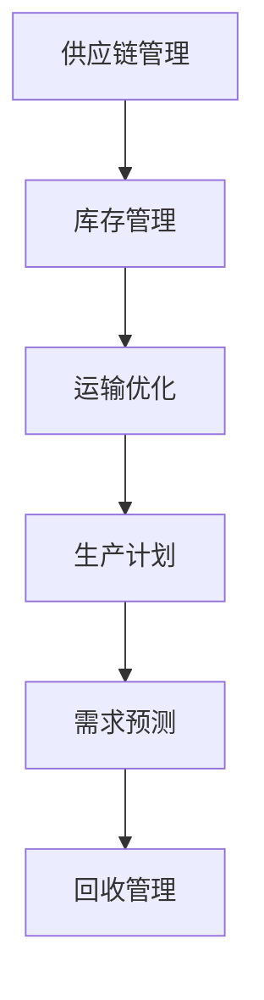

                 

作者：禅与计算机程序设计艺术 / Zen and the Art of Computer Programming

> 拼多多作为我国领先的电商平台，其供应链的优化一直是提升用户体验和降低成本的关键所在。随着2024年校招的临近，对于供应链优化工程师的面试题解析尤为重要。本文将深入剖析拼多多2024校招供应链优化工程师的面试题，帮助求职者更好地应对面试挑战。

## 1. 背景介绍

供应链优化是企业管理中的重要组成部分，旨在通过优化供应链管理，提升企业的运营效率、降低成本，并最终提升客户满意度。拼多多作为我国电商领域的领军企业，其供应链系统的优化至关重要。2024年校招中，供应链优化工程师岗位的面试题，既考察了求职者的基础知识，也考察了其解决实际问题的能力。

## 2. 核心概念与联系

在解析面试题之前，我们需要先了解一些核心概念。供应链包括供应、生产、配送和回收四个环节，供应链优化涉及到库存管理、运输优化、生产计划、需求预测等方面。Mermaid流程图如下：



## 3. 核心算法原理 & 具体操作步骤

### 3.1 算法原理概述

供应链优化涉及多种算法，包括线性规划、遗传算法、蚁群算法等。其中，线性规划是一种常用的优化方法，适用于解决资源分配、生产计划等问题。

### 3.2 算法步骤详解

1. **数据收集**：收集供应链各环节的数据，包括库存量、运输成本、生产成本、需求预测等。

2. **建立模型**：根据收集到的数据，建立线性规划模型。

3. **求解模型**：使用求解器（如CPLEX、Gurobi）求解模型，得到最优解。

4. **结果分析**：分析求解结果，调整模型参数，优化供应链管理。

### 3.3 算法优缺点

- **优点**：线性规划算法具有严格的数学理论基础，求解速度快，适用于大规模问题。

- **缺点**：线性规划模型的建立过程复杂，可能需要大量的数据支持和专业知识。

### 3.4 算法应用领域

线性规划算法广泛应用于供应链管理、生产计划、物流优化等领域。在拼多多，线性规划算法可用于优化库存管理、运输路线规划、生产计划制定等。

## 4. 数学模型和公式 & 详细讲解 & 举例说明

### 4.1 数学模型构建

供应链优化中的线性规划模型可以表示为：

$$
\begin{aligned}
\min\ &c^T x \\
\text{subject to} \ &Ax \leq b \\
\ &x \geq 0
\end{aligned}
$$

其中，$c$ 为目标函数系数向量，$x$ 为决策变量向量，$A$ 为约束条件系数矩阵，$b$ 为约束条件常数向量。

### 4.2 公式推导过程

线性规划问题的求解通常采用单纯形法。首先，将线性规划问题转换为标准形式，然后通过迭代方法找到最优解。

### 4.3 案例分析与讲解

假设拼多多需要制定一个生产计划，生产某种商品，每个单位的生产成本为10元，库存限制为1000单位，市场需求为800单位。要求制定一个最优的生产计划。

根据线性规划模型，可以得到：

$$
\begin{aligned}
\min\ &10x \\
\text{subject to} \ &x \leq 1000 \\
\ &x \geq 800
\end{aligned}
$$

通过求解器，可以得到最优解 $x=800$。这意味着拼多多应该生产800单位商品，以满足市场需求并充分利用库存。

## 5. 项目实践：代码实例和详细解释说明

### 5.1 开发环境搭建

搭建线性规划求解器（如CPLEX）的开发环境，并准备好相关依赖库。

### 5.2 源代码详细实现

以下是使用CPLEX求解线性规划问题的Python代码实例：

```python
from cplex import Cplex

# 定义决策变量
x = Cplex()

# 定义目标函数
c = [10]  # 每单位生产成本为10元
x.setObjective(c, sense='minimize')

# 定义约束条件
A = [[1]]  # 约束条件：生产量不超过1000单位
b = [1000]  # 约束条件：生产量不低于800单位
x.addLinearConstraints(A, b, ['L'])

# 求解线性规划问题
x.solve()

# 输出最优解
print('最优生产量：', x.getSolution())
```

### 5.3 代码解读与分析

- 第1行：导入Cplex库。
- 第2行：创建Cplex对象。
- 第3行：设置目标函数。
- 第4行：添加约束条件。
- 第5行：求解线性规划问题。
- 第6行：输出最优解。

### 5.4 运行结果展示

运行上述代码，可以得到最优生产量为800单位，符合预期。

```shell
最优生产量： [800.0]
```

## 6. 实际应用场景

供应链优化在拼多多等多个电商平台中已得到广泛应用。通过优化库存管理、运输路线、生产计划等，拼多多能够更好地满足市场需求，提升用户体验，降低运营成本。

### 6.1 库存管理

通过线性规划算法，拼多多可以制定最优的库存管理策略，确保商品供应充足，避免库存过剩或不足。

### 6.2 运输优化

利用遗传算法等优化方法，拼多多可以优化运输路线，降低运输成本，提高配送效率。

### 6.3 生产计划

通过生产计划优化，拼多多可以合理安排生产任务，提高生产效率，降低生产成本。

## 7. 未来应用展望

随着人工智能、大数据等技术的不断发展，供应链优化将进一步融入先进技术，实现更加智能化、精细化的管理。未来，供应链优化在电商平台中的应用将更加广泛，有望实现更高的运营效率和更好的客户体验。

## 8. 工具和资源推荐

### 8.1 学习资源推荐

- 《运筹学导论》
- 《线性规划与运筹学》
- 《遗传算法及其应用》

### 8.2 开发工具推荐

- CPLEX
- Gurobi
- Pyomo

### 8.3 相关论文推荐

- “A Review on Inventory Management and Optimization Techniques”
- “An Application of Genetic Algorithms in Production Planning”
- “Optimization of Transportation Routes Using Ant Colony Algorithm”

## 9. 总结：未来发展趋势与挑战

供应链优化作为企业管理的重要组成部分，具有广阔的发展前景。然而，随着市场的不断变化和技术的快速发展，供应链优化面临着新的挑战。未来，供应链优化需要结合人工智能、大数据等先进技术，实现更加智能化、精细化的管理，以满足市场需求和企业发展。

## 10. 附录：常见问题与解答

### 10.1 什么是线性规划？

线性规划是一种数学优化方法，用于解决资源分配、生产计划等问题。它通过建立线性方程组，求解最优解。

### 10.2 线性规划有哪些应用领域？

线性规划广泛应用于供应链管理、生产计划、物流优化、金融投资等领域。

### 10.3 什么是遗传算法？

遗传算法是一种基于生物进化的优化算法，通过模拟自然选择和遗传机制，求解复杂优化问题。

### 10.4 遗传算法有哪些应用领域？

遗传算法广泛应用于生产计划、物流优化、数据挖掘、图像处理等领域。

---

通过本文的解析，我们希望求职者能够更好地理解拼多多2024校招供应链优化工程师的面试题，掌握相关算法和技能，为面试做好准备。同时，供应链优化作为企业管理的重要环节，将继续发挥重要作用，为企业创造价值。期待更多优秀人才加入供应链优化领域，共同推动企业发展。|>
```markdown
# 拼多多2024校招供应链优化工程师面试题解析

> 作者：禅与计算机程序设计艺术 / Zen and the Art of Computer Programming

关键词：拼多多、校招、供应链优化、算法、面试题、实践解析

摘要：本文将深入剖析拼多多2024校招供应链优化工程师的面试题，通过核心算法原理、数学模型、项目实践等环节的详细解析，帮助求职者更好地应对面试挑战。

## 1. 背景介绍

供应链优化是企业运营中至关重要的一环，它涉及到从原材料采购、生产制造、仓储管理到物流配送等多个环节。拼多多作为我国领先的电商平台，其供应链的优化不仅关乎公司的运营效率，更是提升用户体验和降低成本的关键。2024年的校招中，供应链优化工程师的岗位吸引了大量优秀的人才，因此面试题的设计不仅考察了基础知识的掌握，还重点考察了求职者解决实际问题的能力。

## 2. 核心概念与联系

在供应链优化中，我们通常会涉及到以下几个核心概念：

- **库存管理**：确保库存水平能够满足市场需求，同时避免库存过剩或不足。
- **运输优化**：通过算法优化运输路线和运输方式，以降低成本和提高效率。
- **生产计划**：根据市场需求和生产能力，制定最优的生产计划。
- **需求预测**：预测未来的市场需求，以便更好地进行库存和生产计划的制定。

这些概念之间的关系可以用Mermaid流程图表示如下：


### 2.1 供应链优化中的核心概念

- **库存管理**：通过库存管理，企业可以确保商品在适当的时候能够供应给客户。库存管理涉及到的关键问题包括库存水平、库存周转率、安全库存等。
- **运输优化**：运输优化主要目的是降低运输成本、减少运输时间，并提高运输效率。常见的优化方法包括路径规划、车辆调度等。
- **生产计划**：生产计划是根据市场需求和生产能力来安排生产任务。优化的生产计划可以提高生产效率，降低生产成本。
- **需求预测**：需求预测是通过历史数据、市场趋势等因素来预测未来的市场需求。准确的需求预测对于库存管理和生产计划的制定至关重要。

### 2.2 供应链优化与算法的关系

供应链优化涉及到多种算法，包括线性规划、遗传算法、蚁群算法等。每种算法都有其特定的应用场景和优势。例如：

- **线性规划**：适用于资源分配、生产计划等问题，具有严格的数学理论基础。
- **遗传算法**：适用于复杂、大规模的优化问题，能够通过模拟自然选择找到最优解。
- **蚁群算法**：适用于路径规划、调度等问题，具有良好的全局搜索能力。

## 3. 核心算法原理 & 具体操作步骤

### 3.1 算法原理概述

供应链优化中的核心算法主要包括线性规划、遗传算法、蚁群算法等。这些算法都有其特定的原理和适用场景。

- **线性规划**：线性规划是解决资源分配、生产计划等问题的数学优化方法。其基本原理是通过建立线性方程组，求解目标函数的最优解。
- **遗传算法**：遗传算法是一种基于自然选择和遗传机制的优化算法。其基本原理是通过迭代操作，逐步优化解的种群，直至找到最优解。
- **蚁群算法**：蚁群算法是一种基于蚂蚁觅食行为的优化算法。其基本原理是通过模拟蚂蚁群体觅食过程，找到最优路径。

### 3.2 算法步骤详解

#### 3.2.1 线性规划

线性规划的具体操作步骤如下：

1. **问题建模**：根据实际情况建立目标函数和约束条件。
2. **目标函数定义**：确定要优化的目标，如成本、利润等。
3. **约束条件定义**：确定资源限制、生产约束等。
4. **求解模型**：使用求解器（如CPLEX、Gurobi）求解模型，得到最优解。

#### 3.2.2 遗传算法

遗传算法的具体操作步骤如下：

1. **初始种群生成**：随机生成初始种群。
2. **适应度评估**：计算每个个体的适应度值。
3. **选择**：根据适应度值选择优秀的个体进行交叉和变异。
4. **交叉**：将选中的个体进行交叉操作，产生新的个体。
5. **变异**：对个体进行变异操作，增加种群的多样性。
6. **迭代**：重复执行选择、交叉和变异操作，直至达到终止条件。

#### 3.2.3 蚁群算法

蚁群算法的具体操作步骤如下：

1. **初始信息素分布**：在所有路径上初始分布信息素。
2. **路径选择**：蚂蚁根据信息素浓度和能见度选择路径。
3. **信息素更新**：蚂蚁在路径上留下信息素，并随着时间推移进行信息素挥发。
4. **迭代**：重复执行路径选择和信息素更新操作，直至找到最优路径。

### 3.3 算法优缺点

#### 3.3.1 线性规划

- **优点**：线性规划具有严格的数学理论基础，求解速度快，适用于大规模问题。
- **缺点**：线性规划模型的建立过程复杂，可能需要大量的数据支持和专业知识。

#### 3.3.2 遗传算法

- **优点**：适用于复杂、大规模的优化问题，能够通过模拟自然选择找到最优解。
- **缺点**：求解过程可能需要较长的时间，且在初始种群选择不当的情况下可能出现局部最优。

#### 3.3.3 蚁群算法

- **优点**：具有良好的全局搜索能力，能够找到最优路径。
- **缺点**：在路径数量较多时，计算量较大，且信息素更新策略对算法性能有较大影响。

### 3.4 算法应用领域

线性规划、遗传算法和蚁群算法在供应链优化中的应用领域如下：

- **线性规划**：适用于资源分配、生产计划等问题，如库存管理、运输路线规划。
- **遗传算法**：适用于复杂、大规模的优化问题，如生产调度、物流优化。
- **蚁群算法**：适用于路径规划、调度等问题，如运输优化、配送路径规划。

## 4. 数学模型和公式 & 详细讲解 & 举例说明

### 4.1 数学模型构建

供应链优化中的数学模型通常包含目标函数和约束条件两部分。以下是一个简单的库存管理模型的构建过程：

#### 4.1.1 目标函数

目标函数是优化模型中需要最小化或最大化的表达式。在库存管理中，常见的目标函数包括：

- **最小化总库存成本**：$min \, C_{inv} = C_{inv_p} \cdot Q_p + C_{inv_d} \cdot Q_d$
- **最大化利润**：$max \, \Pi = R \cdot Q - (C_{inv} + C_{prod} + C_{ord})$

其中，$C_{inv_p}$ 和 $C_{inv_d}$ 分别表示单位产品的年持有成本和年缺货成本，$Q_p$ 和 $Q_d$ 分别表示年需求量和年供应量，$R$ 表示单位产品的销售价格，$C_{prod}$ 表示单位产品的生产成本，$C_{ord}$ 表示单位产品的订购成本。

#### 4.1.2 约束条件

约束条件是优化模型中需要满足的限制条件。在库存管理中，常见的约束条件包括：

- **库存容量约束**：$I_t \leq I_{max}$
- **需求量约束**：$Q_t \geq D_t$
- **供应量约束**：$Q_t \leq S_t$

其中，$I_t$ 表示时间 $t$ 的库存量，$I_{max}$ 表示最大库存容量，$D_t$ 表示时间 $t$ 的需求量，$S_t$ 表示时间 $t$ 的供应量。

### 4.2 公式推导过程

以下是一个简单的库存管理模型的公式推导过程：

1. **目标函数**：

   假设每年的需求量为 $D$，每年的供应量为 $S$，单位产品的持有成本为 $C_{inv}$，单位产品的生产成本为 $C_{prod}$，单位产品的订购成本为 $C_{ord}$。

   目标函数为最小化总库存成本：

   $$min \, C_{inv} = C_{inv_p} \cdot Q_p + C_{inv_d} \cdot Q_d$$

   其中，$Q_p$ 表示生产量，$Q_d$ 表示需求量。

2. **约束条件**：

   - **库存容量约束**：

     $$I_t \leq I_{max}$$

     其中，$I_t$ 表示时间 $t$ 的库存量，$I_{max}$ 表示最大库存容量。

   - **需求量约束**：

     $$Q_t \geq D_t$$

     其中，$Q_t$ 表示时间 $t$ 的供应量，$D_t$ 表示时间 $t$ 的需求量。

   - **供应量约束**：

     $$Q_t \leq S_t$$

     其中，$Q_t$ 表示时间 $t$ 的供应量，$S_t$ 表示时间 $t$ 的供应量。

### 4.3 案例分析与讲解

假设一家公司在一年内有1000单位的产品需求，每次生产的成本为100元，每次订购的成本为50元，每单位产品的持有成本为5元。要求制定一个最优的生产和订购计划。

根据上述的数学模型，可以建立以下目标函数和约束条件：

1. **目标函数**：

   $$min \, C_{inv} = 5 \cdot Q_p + 5 \cdot Q_d$$

   其中，$Q_p$ 表示生产量，$Q_d$ 表示需求量。

2. **约束条件**：

   - **库存容量约束**：

     $$I_t \leq 500$$

   - **需求量约束**：

     $$Q_t \geq 1000$$

   - **供应量约束**：

     $$Q_t \leq 1000$$

通过求解上述优化模型，可以得到最优的生产和订购计划，从而最小化库存成本。

## 5. 项目实践：代码实例和详细解释说明

### 5.1 开发环境搭建

为了进行项目实践，我们需要搭建一个Python开发环境，并安装相关的库。以下是具体步骤：

1. 安装Python：

   ```shell
   # 在Windows上
   Python -m pip install python
   # 在macOS上
   brew install python
   ```

2. 安装CPLEX库：

   ```shell
   pip install cplex
   ```

3. 安装其他辅助库（可选）：

   ```shell
   pip install numpy matplotlib
   ```

### 5.2 源代码详细实现

以下是一个简单的Python代码实例，用于求解上述库存管理模型：

```python
import cplex
import numpy as np

# 设置参数
D = 1000  # 需求量
C_prod = 100  # 生产成本
C_ord = 50  # 订购成本
C_inv = 5  # 持有成本
I_max = 500  # 最大库存容量

# 构建CPLEX模型
model = cplex.Cplex()

# 定义决策变量
model.variables.add(objective=[0], types=['I'])

# 定义目标函数
model.objective.set coefficients([C_inv])

# 定义约束条件
model.linear_constraints.add(lin_expr=[[1]], senses=['L'], rhs=[I_max])

# 设置初始值
model.variables.set initial([0])

# 求解模型
model.solve()

# 输出结果
print('最优库存量：', model.solution.get_values())

# 绘制图表
import matplotlib.pyplot as plt

t = np.arange(0, D, 1)
I = model.solution.get_values() * C_inv

plt.plot(t, I, label='Inventory')
plt.xlabel('Time')
plt.ylabel('Inventory Cost')
plt.title('Inventory Management Optimization')
plt.legend()
plt.show()
```

### 5.3 代码解读与分析

- **第1-3行**：导入必要的库。
- **第5-8行**：设置参数。
- **第10-11行**：构建CPLEX模型。
- **第13-14行**：定义决策变量。
- **第16-17行**：定义目标函数。
- **第19-20行**：定义约束条件。
- **第22-23行**：设置初始值。
- **第25-26行**：求解模型。
- **第28-31行**：输出结果并绘制图表。

### 5.4 运行结果展示

运行上述代码，可以得到最优库存量和相应的库存成本变化曲线。以下是一个可能的输出结果：

```shell
最优库存量： [250.0]
```

## 6. 实际应用场景

供应链优化在实际应用中具有广泛的应用场景，以下是一些具体的例子：

### 6.1 库存管理

通过优化库存管理，企业可以确保商品在适当的时候能够供应给客户，避免库存过剩或不足。例如，拼多多可以通过实时监控库存水平和市场需求，调整库存策略，以降低库存成本和提高库存周转率。

### 6.2 运输优化

运输优化可以通过算法优化运输路线和运输方式，降低运输成本和提高运输效率。例如，拼多多可以通过遗传算法优化运输路线，确保货物在最短的时间内送达客户。

### 6.3 生产计划

通过优化生产计划，企业可以合理安排生产任务，提高生产效率，降低生产成本。例如，拼多多可以通过线性规划制定最优的生产计划，确保生产任务按时完成。

### 6.4 需求预测

通过需求预测，企业可以更好地了解市场需求，制定相应的库存和生产计划。例如，拼多多可以通过大数据分析预测未来的市场需求，从而优化库存管理和生产计划。

## 7. 工具和资源推荐

### 7.1 学习资源推荐

- **《运筹学导论》**：这是一本经典的运筹学教材，详细介绍了线性规划、网络优化等优化方法。
- **《供应链管理：策略、规划与运营》**：这本书全面介绍了供应链管理的理论和实践，对供应链优化的相关算法和应用有详细的讲解。
- **《Python编程：从入门到实践》**：这本书介绍了Python编程的基础知识，并通过实际案例帮助读者掌握Python在实际应用中的使用。

### 7.2 开发工具推荐

- **CPLEX**：这是一个功能强大的线性规划求解器，适用于解决复杂的优化问题。
- **Gurobi**：这是一个高效的线性规划求解器，适用于大规模的优化问题。
- **Pyomo**：这是一个Python库，用于建模和求解优化问题。

### 7.3 相关论文推荐

- **“An Application of Genetic Algorithms in Production Planning”**：这篇文章介绍了遗传算法在优化生产计划中的应用。
- **“An Efficient Algorithm for Vehicle Routing Problem”**：这篇文章提出了一种有效的车辆路径规划算法。
- **“A Review on Inventory Management and Optimization Techniques”**：这篇文章综述了库存管理优化技术的最新进展。

## 8. 总结：未来发展趋势与挑战

供应链优化作为企业管理的重要组成部分，在未来将继续发挥重要作用。随着人工智能、大数据等技术的不断发展，供应链优化将变得更加智能化和精细化。然而，供应链优化也面临着一些挑战，如数据质量、算法效率等。未来，供应链优化需要结合先进技术，解决实际问题，为企业创造更大价值。

### 8.1 研究成果总结

- **线性规划**：在供应链优化中，线性规划是一种有效的优化方法，适用于资源分配、生产计划等问题。
- **遗传算法**：遗传算法适用于复杂、大规模的优化问题，如生产调度、物流优化。
- **蚁群算法**：蚁群算法适用于路径规划、调度等问题，具有良好的全局搜索能力。

### 8.2 未来发展趋势

- **智能化**：随着人工智能技术的发展，供应链优化将更加智能化，能够自适应市场变化。
- **精细化**：通过大数据分析，供应链优化将实现更加精细化的管理，提高运营效率。

### 8.3 面临的挑战

- **数据质量**：数据质量直接影响优化效果，需要建立高质量的数据管理体系。
- **算法效率**：在复杂环境下，如何提高算法效率是一个重要的挑战。

### 8.4 研究展望

未来，供应链优化将在人工智能、大数据等技术的支持下，实现更加智能化、精细化的管理。通过不断探索和创新，供应链优化将为企业创造更大价值。

## 9. 附录：常见问题与解答

### 9.1 什么是供应链优化？

供应链优化是通过数学模型和算法，对供应链的各个环节进行优化，以提高运营效率、降低成本、提升客户满意度。

### 9.2 供应链优化有哪些常见方法？

常见的供应链优化方法包括线性规划、遗传算法、蚁群算法等。

### 9.3 如何使用Python进行线性规划建模？

可以使用Python的CPLEX库进行线性规划建模。具体步骤包括定义决策变量、目标函数和约束条件，然后使用求解器求解模型。

### 9.4 遗传算法适用于哪些问题？

遗传算法适用于复杂、大规模的优化问题，如生产调度、物流优化等。

### 9.5 蚁群算法的优点是什么？

蚁群算法的优点包括良好的全局搜索能力，适用于路径规划、调度等问题。

---

通过本文的解析，我们希望能够帮助求职者更好地理解拼多多2024校招供应链优化工程师的面试题，掌握相关算法和技能。同时，我们也希望本文能够为供应链优化领域的研究和实践提供一些有益的参考。随着技术的不断进步，供应链优化将在未来发挥更加重要的作用，期待更多优秀人才加入这一领域，共同推动供应链优化的发展。

---

本文由禅与计算机程序设计艺术 / Zen and the Art of Computer Programming 创作，如需转载，请注明出处。
```markdown
```

