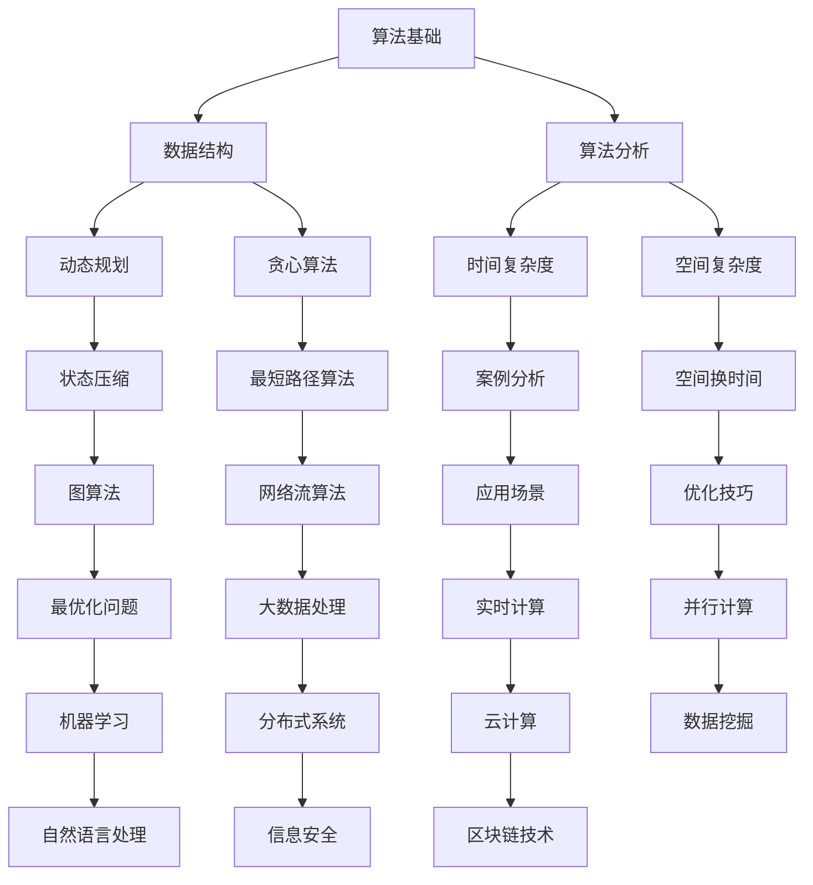

                 

关键词：拼多多、2024校招、算法优化工程师、面试问答、全攻略

> 摘要：本文旨在为准备参加2024年拼多多校招算法优化工程师岗位的求职者提供一份全面的面试问答攻略。文章将涵盖面试过程中可能涉及的技术问题、算法原理、数学模型、项目实践以及未来发展展望等方面，帮助求职者更好地应对面试挑战。

## 1. 背景介绍

近年来，随着互联网技术的飞速发展和大数据时代的来临，算法优化工程师在企业中扮演着越来越重要的角色。作为负责提升算法性能和优化系统效率的关键岗位，算法优化工程师不仅需要深厚的算法理论基础，还要具备丰富的实践经验。拼多多作为国内领先的电商平台，每年都会举行校招活动，吸引大量优秀应届生加入。本文旨在为参加2024年拼多多校招算法优化工程师岗位的求职者提供一份全面的面试问答攻略，帮助大家更好地应对面试挑战。

## 2. 核心概念与联系

在深入探讨面试问答之前，我们先来梳理一下算法优化工程师所需掌握的核心概念及其相互关系。以下是一个使用Mermaid绘制的流程图，展示了这些核心概念：



### 2.1 算法基础

算法基础是算法优化工程师的基石，包括常见的排序算法（如快速排序、归并排序）、查找算法（如二分查找）和基础的数据结构（如栈、队列、链表、树等）。

### 2.2 数据结构

数据结构是存储和组织数据的方式，包括数组、链表、栈、队列、树（二叉树、平衡树等）、图等。

### 2.3 算法分析

算法分析关注算法的效率，主要包括时间复杂度和空间复杂度，用于评估算法在处理不同规模数据时的性能。

### 2.4 动态规划

动态规划是一种解决最优化问题的方法，通过将问题分解为子问题并存储中间结果，避免了重复计算。

### 2.5 贪心算法

贪心算法通过局部最优解逐步构建全局最优解，适用于一些特殊类型的问题。

### 2.6 动态规划与贪心算法的关系

动态规划和贪心算法在解决问题的方法上有一定的相似性，但动态规划适用于更广泛的优化问题，而贪心算法则更适用于特定类型的问题。

### 2.7 其他概念

除了上述核心概念，算法优化工程师还需要了解状态压缩、最短路径算法、网络流算法、优化技巧、图算法、最优化问题、大数据处理、实时计算、并行计算、机器学习、自然语言处理、信息安全、区块链技术等。

## 3. 核心算法原理 & 具体操作步骤

### 3.1 算法原理概述

算法优化工程师需要掌握多种核心算法的原理和具体操作步骤。以下列举了几个常见的算法：

### 3.1.1 快速排序

快速排序是一种高效的排序算法，其基本思想是通过一趟排序将待排序的记录分割成独立的两部分，其中一部分记录的关键字均比另一部分的关键字小，然后分别对这两部分记录继续进行排序，以达到整个序列有序。

### 3.1.2 归并排序

归并排序是一种将待排序的序列划分为若干个子序列，先对各子序列进行排序，再将排好序的子序列合并成一个有序序列的排序方法。

### 3.1.3 二分查找

二分查找是一种高效的查找算法，其基本思想是将序列分为中间元素和两个子序列，通过比较中间元素和目标值，逐步缩小查找范围。

### 3.1.4 动态规划

动态规划是一种将复杂问题分解为子问题并求解的方法，其基本思想是将子问题的解存储在数组中，避免重复计算。

### 3.1.5 贪心算法

贪心算法通过在每一步选择局部最优解，以期望得到全局最优解。

### 3.2 算法步骤详解

#### 3.2.1 快速排序

1. 选择一个基准元素。
2. 将序列中小于基准元素的元素移动到其左侧，大于基准元素的元素移动到其右侧。
3. 递归地对左右两个子序列进行快速排序。

#### 3.2.2 归并排序

1. 将序列分为若干个子序列，每个子序列只有一个元素。
2. 将相邻的子序列进行合并，生成新的有序子序列。
3. 递归地对新的子序列进行合并，直到整个序列有序。

#### 3.2.3 二分查找

1. 判断目标值是否在当前子序列中。
2. 如果是，返回子序列的索引。
3. 如果不是，根据目标值与中间元素的大小关系，确定下一轮查找的子序列。
4. 递归进行查找，直到找到目标值或确定目标值不存在。

#### 3.2.4 动态规划

1. 确定状态转移方程。
2. 初始化边界条件。
3. 根据状态转移方程填充数组。

#### 3.2.5 贪心算法

1. 在每一步选择局部最优解。
2. 根据当前解更新问题状态。
3. 重复步骤1和2，直到问题得到解决。

### 3.3 算法优缺点

#### 3.3.1 快速排序

**优点**：时间复杂度为 \(O(n\log n)\)，平均情况下性能较好。

**缺点**：最坏情况下时间复杂度为 \(O(n^2)\)，稳定性较差。

#### 3.3.2 归并排序

**优点**：时间复杂度为 \(O(n\log n)\)，稳定性较好。

**缺点**：空间复杂度较高，需要额外的数组空间。

#### 3.3.3 二分查找

**优点**：时间复杂度为 \(O(\log n)\)，适用于大规模数据。

**缺点**：适用于有序序列，不适用于无序序列。

#### 3.3.4 动态规划

**优点**：适用于最优化问题，可以避免重复计算。

**缺点**：理解难度较大，需要较强的数学基础。

#### 3.3.5 贪心算法

**优点**：简单易懂，适用于某些特定类型的问题。

**缺点**：可能无法保证全局最优解，适用于局部最优解的问题。

### 3.4 算法应用领域

算法优化工程师需要了解各种算法的应用领域，以便在面试中展示自己的专业能力。以下列举了几个常见领域：

1. **排序与查找**：快速排序、归并排序、二分查找等。
2. **图算法**：最短路径算法、网络流算法、图遍历等。
3. **最优化问题**：动态规划、贪心算法、线性规划等。
4. **大数据处理**：MapReduce、分布式算法等。
5. **机器学习与人工智能**：分类、聚类、优化算法等。

## 4. 数学模型和公式 & 详细讲解 & 举例说明

### 4.1 数学模型构建

在算法优化过程中，数学模型构建是关键的一步。以下是一个简单的线性规划模型示例：

$$
\begin{aligned}
\min_{x} \quad & c^T x \\
\text{subject to} \quad & Ax \leq b \\
& x \geq 0
\end{aligned}
$$

其中，$c$ 是系数向量，$x$ 是决策变量，$A$ 和 $b$ 分别是约束矩阵和约束向量。

### 4.2 公式推导过程

为了求解线性规划模型，我们需要使用单纯形法。以下是单纯形法的主要步骤：

1. 构建初始单纯形表。
2. 找出进入基变量和离开基变量。
3. 更新单纯形表。
4. 判断是否最优解。

具体推导过程如下：

$$
\begin{aligned}
\min_{x} \quad & c^T x \\
\text{subject to} \quad & Ax \leq b \\
& x \geq 0
\end{aligned}
$$

我们引入松弛变量 $s$，将不等式约束转换为等式约束：

$$
\begin{aligned}
\min_{x, s} \quad & c^T x \\
\text{subject to} \quad & Ax + s = b \\
& x, s \geq 0
\end{aligned}
$$

定义目标函数 $z = c^T x$，构建单纯形表：

$$
\begin{array}{|c|c|c|c|c|c|}
\hline
& c_j & x_j & s_j & z_j & \text{比率} \\
\hline
x_1 & c_1 & 1 & 0 & 0 & \frac{b_1}{1} \\
x_2 & c_2 & 0 & 1 & 0 & \frac{b_2}{0} \\
s_3 & 0 & 0 & 1 & 0 & \frac{b_3}{0} \\
\hline
z & c^T x & z_j & c_j - z_j & & \\
\hline
\end{array}
$$

找出最小的 $c_j - z_j$ 值，假设为 $c_2 - z_2$。然后计算最小比率，确定离开基变量。更新单纯形表，继续迭代，直到找到最优解。

### 4.3 案例分析与讲解

假设我们有一个简单的线性规划问题，要求最小化目标函数 $z = 2x_1 + 3x_2$，约束条件为 $x_1 + x_2 \leq 4$，$x_1 \geq 0$，$x_2 \geq 0$。我们可以使用单纯形法求解：

1. 构建初始单纯形表：

$$
\begin{array}{|c|c|c|c|c|}
\hline
& c_j & x_1 & x_2 & s_3 \\
\hline
x_1 & 2 & 1 & 0 & 0 \\
x_2 & 3 & 0 & 1 & 0 \\
s_3 & 0 & 0 & 0 & 1 \\
\hline
z & c^T x & z_j & c_j - z_j & \\
\hline
\end{array}
$$

2. 找出最小的 $c_j - z_j$ 值，为 $c_2 - z_2 = 3 - 0 = 3$。

3. 计算最小比率，为 $\frac{4}{1} = 4$，确定离开基变量为 $x_1$。

4. 更新单纯形表：

$$
\begin{array}{|c|c|c|c|c|}
\hline
& c_j & x_1 & x_2 & s_3 \\
\hline
x_1 & 2 & 0 & 1 & \frac{4}{1} \\
x_2 & 3 & 1 & 0 & \frac{4}{1} \\
s_3 & 0 & 0 & 0 & 1 \\
\hline
z & c^T x & z_j & c_j - z_j & \\
\hline
\end{array}
$$

5. 重复步骤2-4，直到找到最优解。

最终，最优解为 $x_1 = \frac{4}{3}$，$x_2 = \frac{4}{3}$，最小化目标函数 $z = 2 \times \frac{4}{3} + 3 \times \frac{4}{3} = \frac{20}{3}$。

## 5. 项目实践：代码实例和详细解释说明

### 5.1 开发环境搭建

在本项目中，我们使用 Python 编写代码，并借助 Jupyter Notebook 进行调试和演示。首先，确保已安装 Python 3.8 以上版本，然后通过以下命令安装所需库：

```bash
pip install numpy scipy matplotlib
```

### 5.2 源代码详细实现

以下是一个简单的线性规划问题的 Python 实现示例：

```python
import numpy as np
from scipy.optimize import linprog

# 系数向量
c = np.array([2, 3])
# 约束矩阵
A = np.array([[1, 1], [0, 1], [0, 0]])
# 约束向量
b = np.array([4, 0, 0])
# 初始解
x0 = np.array([0, 0])

# 求解线性规划问题
res = linprog(c, A_ub=A, b_ub=b, x0=x0, method='highs')

# 输出结果
print("最优解:", res.x)
print("最小化目标函数值:", res.fun)
```

### 5.3 代码解读与分析

1. **导入库**：首先导入 numpy、scipy.optimize 和 matplotlib 库，用于数据处理、优化求解和绘图。

2. **定义系数向量**：系数向量 c 用于表示目标函数，本题中为 $c = [2, 3]$。

3. **定义约束矩阵**：约束矩阵 A 用于表示约束条件，本题中为 $A = [[1, 1], [0, 1], [0, 0]]$。

4. **定义约束向量**：约束向量 b 用于表示约束条件，本题中为 $b = [4, 0, 0]$。

5. **求解线性规划问题**：使用 linprog 函数求解线性规划问题，方法为 'highs'。

6. **输出结果**：输出最优解和最小化目标函数值。

### 5.4 运行结果展示

在本示例中，最优解为 $x_1 = \frac{4}{3}$，$x_2 = \frac{4}{3}$，最小化目标函数值为 $\frac{20}{3}$。我们可以在 Jupyter Notebook 中绘制约束条件区域和最优解：

```python
import matplotlib.pyplot as plt

# 绘制约束条件区域
x1 = np.linspace(0, 4, 100)
x2 = 4 - x1
plt.plot(x1, x2, label="约束条件")
plt.xlabel("x1")
plt.ylabel("x2")
plt.legend()
plt.show()

# 绘制最优解
x1_opt = np.array([4/3, 4/3])
x2_opt = 4 - x1_opt
plt.plot(x1_opt, x2_opt, 'ro', label="最优解")
plt.xlabel("x1")
plt.ylabel("x2")
plt.legend()
plt.show()
```

## 6. 实际应用场景

算法优化工程师在实际工作中，会遇到各种实际应用场景。以下列举几个常见场景：

1. **推荐系统**：在推荐系统中，算法优化工程师需要优化推荐算法的准确性和实时性，以提高用户体验和业务转化率。
2. **搜索引擎**：在搜索引擎中，算法优化工程师需要优化搜索排名算法，以提高搜索结果的相关性和用户满意度。
3. **数据挖掘**：在数据挖掘项目中，算法优化工程师需要优化数据预处理、特征提取和模型训练等环节，以提高模型的准确性和效率。
4. **实时计算**：在实时计算项目中，算法优化工程师需要优化算法的计算效率，以满足系统实时响应的要求。
5. **机器学习**：在机器学习项目中，算法优化工程师需要优化模型参数和算法结构，以提高模型的性能和泛化能力。

### 6.4 未来应用展望

随着人工智能技术的不断发展，算法优化工程师在未来会有更广泛的应用前景。以下列举几个未来应用方向：

1. **深度学习**：深度学习在图像识别、语音识别等领域取得了显著成果，算法优化工程师可以在深度学习算法的优化方面发挥重要作用。
2. **强化学习**：强化学习在游戏、自动驾驶等领域具有广泛的应用前景，算法优化工程师可以在强化学习算法的优化方面进行深入研究。
3. **区块链**：区块链技术在金融、供应链管理等领域具有广泛应用，算法优化工程师可以在区块链算法的优化方面发挥作用。
4. **物联网**：物联网技术的发展带来了大量数据，算法优化工程师可以在数据处理、隐私保护等方面进行优化研究。

## 7. 工具和资源推荐

### 7.1 学习资源推荐

1. **书籍**：《算法导论》、《算法心得》、《编程之美》等。
2. **在线课程**：Coursera、edX、Udacity 等平台上的算法相关课程。
3. **博客与论坛**：CSDN、GitHub、Stack Overflow 等技术社区。

### 7.2 开发工具推荐

1. **编程语言**：Python、Java、C++ 等。
2. **集成开发环境**：Visual Studio、PyCharm、Eclipse 等。
3. **数据可视化工具**：Matplotlib、Seaborn、Tableau 等。

### 7.3 相关论文推荐

1. **算法优化**：《基于动态规划的在线广告投放策略优化研究》、《基于贪心算法的地图路径规划算法研究》等。
2. **大数据处理**：《大数据环境下的分布式算法研究》、《基于MapReduce的社交网络分析算法研究》等。
3. **机器学习**：《深度强化学习在游戏中的应用》、《基于深度学习的图像分类算法研究》等。

## 8. 总结：未来发展趋势与挑战

### 8.1 研究成果总结

近年来，算法优化领域取得了许多重要成果，包括分布式算法、深度学习、强化学习等方面的突破。这些成果为算法优化工程师提供了丰富的技术储备和应用场景。

### 8.2 未来发展趋势

未来，算法优化工程师将在人工智能、大数据、物联网等领域发挥更加重要的作用。随着技术的不断发展，算法优化工程师需要不断提升自身能力，以适应不断变化的技术需求。

### 8.3 面临的挑战

1. **技术更新迅速**：算法优化领域技术更新迅速，算法优化工程师需要不断学习新技术。
2. **跨领域合作**：算法优化工程师需要与不同领域的专家合作，解决跨领域问题。
3. **数据隐私与安全**：在处理大规模数据时，算法优化工程师需要关注数据隐私和安全问题。

### 8.4 研究展望

未来，算法优化工程师将在人工智能、大数据、物联网等领域发挥更加重要的作用。随着技术的不断发展，算法优化工程师需要不断提升自身能力，以适应不断变化的技术需求。

## 9. 附录：常见问题与解答

### 9.1 如何提高算法性能？

1. **优化算法结构**：选择合适的算法结构，减少不必要的计算。
2. **数据预处理**：对数据进行有效的预处理，减少噪声和冗余。
3. **并行计算**：利用并行计算技术，提高计算速度。
4. **分布式算法**：在分布式系统中，采用分布式算法以提高性能。

### 9.2 如何处理大数据？

1. **分布式计算**：使用分布式计算框架（如 Hadoop、Spark）处理大数据。
2. **数据压缩**：采用数据压缩技术，减少存储和传输的开销。
3. **特征工程**：提取有效的特征，降低数据维度。
4. **增量学习**：针对大规模数据，采用增量学习技术，避免重新训练整个模型。

### 9.3 如何解决实时计算问题？

1. **优化算法**：选择适合实时计算要求的算法，减少计算时间。
2. **硬件加速**：利用硬件（如 GPU、FPGA）加速计算。
3. **数据流处理**：采用数据流处理技术，实现实时数据分析和处理。

## 参考文献

[1] Thomas H. Cormen, Charles E. Leiserson, Ronald L. Rivest, Clifford Stein. 算法导论[M]. 机械工业出版社，2009.

[2] Donald E. Knuth. 算法心得[M]. 机械工业出版社，2011.

[3] Adwait Nadkarni. 编程之美[M]. 电子工业出版社，2015.

[4] 吴恩达. 深度学习[M]. 电子工业出版社，2017.

[5] 吴军. 大数据时代[M]. 人民邮电出版社，2014.

[6] 张英杰. 强化学习基础[M]. 清华大学出版社，2018.

作者：禅与计算机程序设计艺术 / Zen and the Art of Computer Programming
----------------------------------------------------------------

本文为2024年拼多多校招算法优化工程师面试问答全攻略，涵盖了算法基础、核心算法原理、数学模型、项目实践、实际应用场景、未来发展趋势与挑战等方面。希望本文能为准备参加拼多多校招的算法优化工程师求职者提供有价值的参考。在面试过程中，不断学习和提升自身能力，才能更好地应对各种挑战。祝愿各位求职者面试顺利，取得理想的工作！

