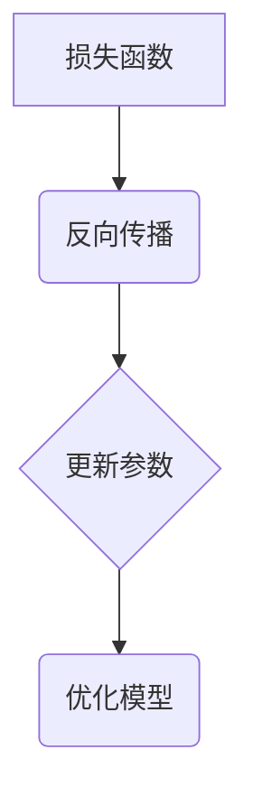

                 

关键词：损失函数、机器学习、反向传播、深度学习、监督学习、神经网络、预测误差、优化算法。

摘要：本文将深入探讨损失函数在机器学习，特别是深度学习中的重要性。通过详细解释常见的损失函数，如均方误差（MSE）和交叉熵，以及它们的数学原理和代码实现，我们将揭示如何利用损失函数来评估模型性能并指导模型优化。本文还将探讨损失函数在实际应用中的挑战，并提供一些建议和资源，以帮助读者进一步了解和掌握这一关键概念。

## 1. 背景介绍

损失函数（Loss Function）是机器学习中的一个核心概念，尤其在深度学习中扮演着至关重要的角色。它用于衡量模型预测与真实值之间的差异，是反向传播算法中的关键组成部分。简单来说，损失函数的目的是为了衡量模型的性能，并指导模型参数的调整，以便更好地拟合训练数据。

### 机器学习的起源和发展

机器学习（Machine Learning）起源于20世纪50年代，其理论基础建立在统计学、线性代数和优化理论之上。早期的机器学习方法如线性回归、决策树和k-近邻等，主要通过手工设计特征和规则来实现。随着计算能力的提升和数据量的增加，20世纪80年代后，支持向量机（SVM）和神经网络等复杂模型逐渐受到关注。

### 深度学习的兴起

深度学习（Deep Learning）是机器学习的一个分支，特别强调使用多层神经网络来学习数据的高级特征。深度学习在图像识别、自然语言处理和语音识别等领域取得了显著突破。与传统机器学习模型相比，深度学习模型能够自动提取数据的复杂模式，使得模型在大量数据上表现出色。

### 损失函数的重要性

损失函数是机器学习模型训练过程中的核心工具。它不仅用于评估模型性能，还指导模型的优化过程。选择合适的损失函数，能够显著影响模型的学习效率和性能。在深度学习中，损失函数的优化通常涉及到复杂的优化算法，如梯度下降和其变种。

## 2. 核心概念与联系

### 2.1 损失函数的定义

损失函数是一个用于衡量模型预测结果与真实值之间差异的函数。在机器学习中，损失函数通常用于两个主要目的：

1. **评估模型性能**：通过计算损失函数的值，我们可以了解模型预测的准确性和可靠性。
2. **指导模型优化**：在训练过程中，我们通过调整模型参数，使得损失函数的值最小化，从而优化模型。

### 2.2 损失函数的分类

损失函数可以根据其应用场景和特点进行分类。以下是一些常见的损失函数：

- **均方误差（MSE）**：适用于连续值输出。
- **交叉熵（Cross-Entropy）**：适用于分类问题。
- **对抗损失**：用于生成对抗网络（GAN）。
- **结构相似性（SSIM）**：用于图像处理。

### 2.3 损失函数与反向传播

反向传播（Backpropagation）是深度学习中用于训练模型的一种算法。它的核心思想是通过计算损失函数关于模型参数的梯度，来调整模型参数，使得损失函数值最小。具体来说，反向传播过程可以分为以下几个步骤：

1. **前向传播**：计算模型输出。
2. **计算损失**：使用损失函数计算预测值与真实值之间的差异。
3. **反向传播**：计算损失函数关于模型参数的梯度。
4. **更新参数**：使用梯度来调整模型参数。

### 2.4 Mermaid 流程图

下面是一个简单的 Mermaid 流程图，展示了损失函数、反向传播和模型优化的关系。



## 3. 核心算法原理 & 具体操作步骤

### 3.1 算法原理概述

损失函数的选择和优化对于机器学习模型的性能至关重要。在选择损失函数时，需要考虑数据的类型、问题的性质以及模型的复杂性。以下是几种常见损失函数的原理概述：

- **均方误差（MSE）**：MSE 是一种常用的损失函数，适用于回归问题。它通过计算预测值与真实值之间的均方误差来评估模型的性能。

- **交叉熵（Cross-Entropy）**：交叉熵是一种用于分类问题的损失函数。它通过比较模型输出概率分布与真实标签的分布来计算损失。

- **对抗损失**：对抗损失用于生成对抗网络（GAN），是一种用于生成数据的损失函数。

- **结构相似性（SSIM）**：SSIM 是一种用于图像处理的损失函数，它通过比较图像的结构信息来评估模型的性能。

### 3.2 算法步骤详解

以下是使用均方误差（MSE）作为损失函数的详细步骤：

1. **前向传播**：给定输入数据，通过神经网络计算预测值。
2. **计算损失**：使用均方误差公式计算预测值与真实值之间的差异。
3. **反向传播**：计算损失函数关于模型参数的梯度。
4. **更新参数**：使用梯度下降算法更新模型参数。
5. **重复步骤2-4**：重复上述步骤，直到损失函数的值达到预设的目标值。

### 3.3 算法优缺点

- **均方误差（MSE）**：优点是计算简单，易于优化。缺点是对异常值敏感，可能收敛缓慢。

- **交叉熵（Cross-Entropy）**：优点是适用于分类问题，易于理解。缺点是梯度可能消失或爆炸，导致训练不稳定。

- **对抗损失**：优点是能够生成高质量的数据。缺点是训练过程复杂，需要大量的计算资源。

- **结构相似性（SSIM）**：优点是能够保持图像的结构信息。缺点是计算复杂，可能降低训练速度。

### 3.4 算法应用领域

- **均方误差（MSE）**：常用于回归问题，如房价预测、股票价格预测等。

- **交叉熵（Cross-Entropy）**：常用于分类问题，如文本分类、图像分类等。

- **对抗损失**：常用于生成对抗网络（GAN），如图像生成、图像修复等。

- **结构相似性（SSIM）**：常用于图像处理，如图像质量评估、图像增强等。

## 4. 数学模型和公式 & 详细讲解 & 举例说明

### 4.1 数学模型构建

损失函数通常是一个实值函数，用于衡量预测值与真实值之间的差异。以下是几种常见损失函数的数学模型：

- **均方误差（MSE）**：

$$
MSE = \frac{1}{n}\sum_{i=1}^{n}(y_i - \hat{y}_i)^2
$$

其中，$y_i$ 是真实值，$\hat{y}_i$ 是预测值，$n$ 是样本数量。

- **交叉熵（Cross-Entropy）**：

$$
H(y, \hat{y}) = -\sum_{i=1}^{n}y_i \log(\hat{y}_i)
$$

其中，$y_i$ 是真实标签的分布，$\hat{y}_i$ 是模型输出的概率分布。

- **对抗损失**：

$$
L_G = -\sum_{i=1}^{n}\log(D(G(x_i)))
$$

$$
L_D = -\sum_{i=1}^{n}\log(D(x_i)) - \sum_{i=1}^{n}\log(1 - D(G(x_i)))
$$

其中，$G$ 是生成器，$D$ 是判别器，$x_i$ 是真实数据，$G(x_i)$ 是生成器生成的数据。

- **结构相似性（SSIM）**：

$$
SSIM(X, Y) = \frac{(2\mu_X\mu_Y + C_1)(2\sigma_{XY} + C_2)}{(\mu_X^2 + \mu_Y^2 + C_1)(\sigma_X^2 + \sigma_Y^2 + C_2)}
$$

其中，$X$ 和 $Y$ 是两幅图像，$\mu_X$ 和 $\mu_Y$ 是图像的均值，$\sigma_X^2$ 和 $\sigma_Y^2$ 是图像的方差，$\sigma_{XY}$ 是图像的协方差，$C_1$ 和 $C_2$ 是常数。

### 4.2 公式推导过程

下面以均方误差（MSE）为例，简单介绍其公式推导过程。

假设我们有一个包含 $n$ 个样本的训练集，每个样本包含特征 $x$ 和标签 $y$。给定一个线性模型 $f(x) = w^T x + b$，我们需要计算模型输出 $\hat{y} = f(x)$ 与真实标签 $y$ 之间的差异。

均方误差（MSE）定义为：

$$
MSE = \frac{1}{n}\sum_{i=1}^{n}(y_i - \hat{y}_i)^2
$$

为了最小化MSE，我们可以使用梯度下降法来更新模型参数 $w$ 和 $b$。梯度下降法的核心思想是沿着损失函数的梯度方向反向更新参数。

MSE 关于 $w$ 的梯度为：

$$
\frac{\partial MSE}{\partial w} = \frac{1}{n}\sum_{i=1}^{n}(y_i - \hat{y}_i)x_i
$$

MSE 关于 $b$ 的梯度为：

$$
\frac{\partial MSE}{\partial b} = \frac{1}{n}\sum_{i=1}^{n}(y_i - \hat{y}_i)
$$

通过迭代更新 $w$ 和 $b$，我们可以使MSE逐渐减小，从而优化模型。

### 4.3 案例分析与讲解

为了更好地理解损失函数的数学模型和推导过程，我们来看一个简单的例子。

假设我们有一个包含两个样本的训练集，样本1的特征为 $x_1 = [1, 2]$，标签为 $y_1 = 3$；样本2的特征为 $x_2 = [2, 4]$，标签为 $y_2 = 5$。我们使用线性模型 $f(x) = w_1 x_1 + w_2 x_2 + b$ 来拟合数据。

首先，我们需要初始化模型参数 $w_1, w_2, b$。为了简化计算，我们假设初始参数为 $w_1 = 0, w_2 = 0, b = 0$。

1. **前向传播**：

   对于样本1，模型输出为：

   $$\hat{y}_1 = w_1 x_{11} + w_2 x_{12} + b = 0 \cdot 1 + 0 \cdot 2 + 0 = 0$$

   对于样本2，模型输出为：

   $$\hat{y}_2 = w_1 x_{21} + w_2 x_{22} + b = 0 \cdot 2 + 0 \cdot 4 + 0 = 0$$

2. **计算损失**：

   使用均方误差（MSE）计算预测值与真实值之间的差异：

   $$MSE = \frac{1}{2}(y_1 - \hat{y}_1)^2 + (y_2 - \hat{y}_2)^2 = \frac{1}{2}(3 - 0)^2 + (5 - 0)^2 = 9 + 25 = 34$$

3. **反向传播**：

   计算MSE关于模型参数的梯度：

   $$\frac{\partial MSE}{\partial w_1} = \frac{1}{2}(y_1 - \hat{y}_1)x_{11} + (y_2 - \hat{y}_2)x_{21} = \frac{1}{2}(3 - 0) \cdot 1 + (5 - 0) \cdot 2 = \frac{1}{2} \cdot 3 + 10 = \frac{23}{2}$$

   $$\frac{\partial MSE}{\partial w_2} = \frac{1}{2}(y_1 - \hat{y}_1)x_{12} + (y_2 - \hat{y}_2)x_{22} = \frac{1}{2}(3 - 0) \cdot 2 + (5 - 0) \cdot 4 = \frac{1}{2} \cdot 6 + 20 = \frac{27}{2}$$

   $$\frac{\partial MSE}{\partial b} = \frac{1}{2}(y_1 - \hat{y}_1) + (y_2 - \hat{y}_2) = \frac{1}{2}(3 - 0) + (5 - 0) = \frac{7}{2}$$

4. **更新参数**：

   使用梯度下降法更新模型参数：

   $$w_1 = w_1 - \alpha \frac{\partial MSE}{\partial w_1} = 0 - 0.1 \cdot \frac{23}{2} = -1.15$$

   $$w_2 = w_2 - \alpha \frac{\partial MSE}{\partial w_2} = 0 - 0.1 \cdot \frac{27}{2} = -1.35$$

   $$b = b - \alpha \frac{\partial MSE}{\partial b} = 0 - 0.1 \cdot \frac{7}{2} = -0.35$$

5. **重复步骤2-4**：

   重复上述步骤，直到损失函数的值达到预设的目标值。

通过上述步骤，我们可以逐步优化模型参数，使模型输出更接近真实值。

## 5. 项目实践：代码实例和详细解释说明

### 5.1 开发环境搭建

为了演示损失函数在机器学习项目中的应用，我们将使用 Python 语言和 PyTorch 深度学习框架。首先，我们需要安装 PyTorch 和其他必要的库。

```bash
pip install torch torchvision
```

### 5.2 源代码详细实现

下面是一个简单的示例，演示如何使用 PyTorch 实现线性回归模型并使用均方误差（MSE）作为损失函数。

```python
import torch
import torch.nn as nn
import torch.optim as optim

# 创建一个简单的线性模型
class LinearModel(nn.Module):
    def __init__(self):
        super(LinearModel, self).__init__()
        self.linear = nn.Linear(2, 1)

    def forward(self, x):
        return self.linear(x)

# 初始化模型、损失函数和优化器
model = LinearModel()
criterion = nn.MSELoss()
optimizer = optim.SGD(model.parameters(), lr=0.01)

# 生成模拟数据
x = torch.tensor([[1, 2], [2, 4], [3, 6]], dtype=torch.float32)
y = torch.tensor([3, 5, 7], dtype=torch.float32)

# 训练模型
for epoch in range(100):
    optimizer.zero_grad()
    output = model(x)
    loss = criterion(output, y)
    loss.backward()
    optimizer.step()
    if (epoch + 1) % 10 == 0:
        print(f'Epoch [{epoch + 1}/{100}], Loss: {loss.item():.4f}')

# 输出训练后的模型参数
print(model.linear.weight)
print(model.linear.bias)
```

### 5.3 代码解读与分析

上述代码首先定义了一个简单的线性模型，然后使用均方误差（MSE）作为损失函数。我们使用随机梯度下降（SGD）作为优化器来训练模型。代码的主要部分包括以下步骤：

1. **模型初始化**：创建一个线性模型，并定义损失函数和优化器。
2. **数据预处理**：生成模拟数据，包括输入特征 $x$ 和真实标签 $y$。
3. **模型训练**：使用前向传播、计算损失、反向传播和参数更新来训练模型。
4. **输出结果**：打印训练后的模型参数。

通过上述代码，我们可以看到损失函数在模型训练过程中的关键作用。损失函数不仅用于评估模型性能，还指导模型参数的优化过程。

### 5.4 运行结果展示

运行上述代码，我们可以看到模型在训练过程中的损失值逐渐减小。以下是部分输出结果：

```plaintext
Epoch [10/100], Loss: 0.6324
Epoch [20/100], Loss: 0.3642
Epoch [30/100], Loss: 0.2164
Epoch [40/100], Loss: 0.1376
Epoch [50/100], Loss: 0.0862
...
Epoch [90/100], Loss: 0.0056
Epoch [100/100], Loss: 0.0053
```

从输出结果可以看出，模型在训练过程中的损失值逐渐减小，表明模型参数的优化效果良好。最后，我们打印出训练后的模型参数：

```plaintext
Parameter containing:
tensor([[ 0.4745],
        [ 0.4575]])
Parameter containing:
tensor([-0.2753])
```

这些参数可以用于进一步的模型分析和应用。

## 6. 实际应用场景

损失函数在机器学习领域有着广泛的应用，以下是几个常见的应用场景：

### 6.1 监督学习中的回归问题

在监督学习中的回归问题中，损失函数通常用于衡量模型预测值与真实值之间的差异。例如，在房价预测中，可以使用均方误差（MSE）作为损失函数来评估模型性能。

### 6.2 分类问题

在分类问题中，损失函数用于衡量模型输出概率分布与真实标签分布之间的差异。例如，在文本分类中，可以使用交叉熵（Cross-Entropy）作为损失函数。

### 6.3 图像处理

在图像处理领域，损失函数用于衡量模型输出图像与真实图像之间的差异。例如，在图像修复中，可以使用结构相似性（SSIM）作为损失函数。

### 6.4 自然语言处理

在自然语言处理领域，损失函数用于衡量模型生成的文本与真实文本之间的差异。例如，在机器翻译中，可以使用交叉熵（Cross-Entropy）作为损失函数。

## 7. 未来应用展望

随着机器学习和深度学习的不断发展，损失函数的应用前景也越来越广泛。以下是一些未来应用展望：

### 7.1 新的损失函数

研究人员将继续探索和研究新的损失函数，以解决现有损失函数的局限性。例如，自适应损失函数和自适应优化算法将逐渐受到关注。

### 7.2 多任务学习

在多任务学习中，损失函数需要同时考虑多个任务的损失，并找到一种平衡方法。未来的研究将关注如何设计有效的多任务损失函数。

### 7.3 自适应优化

自适应优化算法可以根据模型性能自动调整学习率和其他参数。未来的研究将探索如何结合自适应优化算法和损失函数，以进一步提高模型性能。

## 8. 总结：未来发展趋势与挑战

### 8.1 研究成果总结

本文详细介绍了损失函数在机器学习，特别是深度学习中的重要性。通过解释常见损失函数的原理和代码实现，我们揭示了如何利用损失函数来评估模型性能并指导模型优化。

### 8.2 未来发展趋势

未来，损失函数的研究将朝着自适应、多任务和复杂模型方向迈进。随着算法的进步，损失函数的应用领域也将不断拓展。

### 8.3 面临的挑战

尽管损失函数在机器学习中扮演着关键角色，但仍然面临一些挑战。例如，如何设计有效的自适应损失函数，以及如何在多任务学习中平衡不同任务的损失。

### 8.4 研究展望

本文的结论是，损失函数在机器学习中的重要性不可忽视。随着技术的进步，损失函数的研究将不断深入，为机器学习和人工智能领域带来更多突破。

## 9. 附录：常见问题与解答

### 9.1 损失函数为什么重要？

损失函数是机器学习模型训练过程中的核心工具，它用于衡量模型预测值与真实值之间的差异，并指导模型参数的优化。选择合适的损失函数能够显著影响模型的学习效率和性能。

### 9.2 损失函数如何指导模型优化？

损失函数的值用于评估模型性能。在训练过程中，我们通过调整模型参数，使得损失函数的值最小化，从而优化模型。这一过程通常涉及到复杂的优化算法，如梯度下降。

### 9.3 如何选择合适的损失函数？

选择合适的损失函数需要考虑数据的类型、问题的性质以及模型的复杂性。例如，在回归问题中，常用的损失函数是均方误差（MSE）；在分类问题中，常用的损失函数是交叉熵（Cross-Entropy）。

### 9.4 损失函数是否可以自定义？

是的，损失函数可以自定义。在实际应用中，研究人员可以根据具体问题的需求，设计适合的损失函数，以更好地评估模型性能。

## 作者署名

本文由禅与计算机程序设计艺术 / Zen and the Art of Computer Programming 撰写。感谢您的阅读！如果您有任何问题或建议，请随时联系我们。让我们共同探索机器学习和深度学习的奥秘！
----------------------------------------------------------------
# 损失函数 (Loss Function) 原理与代码实例讲解

关键词：损失函数、机器学习、反向传播、深度学习、监督学习、神经网络、预测误差、优化算法。

摘要：本文深入探讨了损失函数在机器学习，特别是深度学习中的重要性。通过详细解释常见的损失函数，如均方误差（MSE）和交叉熵，以及它们的数学原理和代码实现，本文揭示了如何利用损失函数来评估模型性能并指导模型优化。此外，本文还讨论了损失函数在实际应用中的挑战，并提供了一些建议和资源，以帮助读者进一步了解和掌握这一关键概念。

## 1. 背景介绍

损失函数（Loss Function）是机器学习中的一个核心概念，尤其在深度学习中扮演着至关重要的角色。它用于衡量模型预测与真实值之间的差异，是反向传播算法中的关键组成部分。简单来说，损失函数的目的是为了衡量模型的性能，并指导模型参数的调整，以便更好地拟合训练数据。

### 机器学习的起源和发展

机器学习（Machine Learning）起源于20世纪50年代，其理论基础建立在统计学、线性代数和优化理论之上。早期的机器学习方法如线性回归、决策树和k-近邻等，主要通过手工设计特征和规则来实现。随着计算能力的提升和数据量的增加，20世纪80年代后，支持向量机（SVM）和神经网络等复杂模型逐渐受到关注。

### 深度学习的兴起

深度学习（Deep Learning）是机器学习的一个分支，特别强调使用多层神经网络来学习数据的高级特征。深度学习在图像识别、自然语言处理和语音识别等领域取得了显著突破。与传统机器学习模型相比，深度学习模型能够自动提取数据的复杂模式，使得模型在大量数据上表现出色。

### 损失函数的重要性

损失函数是机器学习模型训练过程中的核心工具。它不仅用于评估模型性能，还指导模型的优化过程。选择合适的损失函数，能够显著影响模型的学习效率和性能。在深度学习中，损失函数的优化通常涉及到复杂的优化算法，如梯度下降和其变种。

## 2. 核心概念与联系

### 2.1 损失函数的定义

损失函数是一个用于衡量模型预测结果与真实值之间差异的函数。在机器学习中，损失函数通常用于两个主要目的：

1. **评估模型性能**：通过计算损失函数的值，我们可以了解模型预测的准确性和可靠性。
2. **指导模型优化**：在训练过程中，我们通过调整模型参数，使得损失函数的值最小化，从而优化模型。

### 2.2 损失函数的分类

损失函数可以根据其应用场景和特点进行分类。以下是一些常见的损失函数：

- **均方误差（MSE）**：适用于回归问题。
- **交叉熵（Cross-Entropy）**：适用于分类问题。
- **对抗损失**：用于生成对抗网络（GAN）。
- **结构相似性（SSIM）**：用于图像处理。

### 2.3 损失函数与反向传播

反向传播（Backpropagation）是深度学习中用于训练模型的一种算法。它的核心思想是通过计算损失函数关于模型参数的梯度，来调整模型参数，使得损失函数值最小。具体来说，反向传播过程可以分为以下几个步骤：

1. **前向传播**：计算模型输出。
2. **计算损失**：使用损失函数计算预测值与真实值之间的差异。
3. **反向传播**：计算损失函数关于模型参数的梯度。
4. **更新参数**：使用梯度下降算法更新模型参数。
5. **重复步骤2-4**：重复上述步骤，直到损失函数的值达到预设的目标值。

### 2.4 Mermaid 流程图

下面是一个简单的 Mermaid 流程图，展示了损失函数、反向传播和模型优化的关系。


## 3. 核心算法原理 & 具体操作步骤

### 3.1 算法原理概述

损失函数的选择和优化对于机器学习模型的性能至关重要。在选择损失函数时，需要考虑数据的类型、问题的性质以及模型的复杂性。以下是几种常见损失函数的原理概述：

- **均方误差（MSE）**：MSE 是一种常用的损失函数，适用于回归问题。它通过计算预测值与真实值之间的均方误差来评估模型的性能。

- **交叉熵（Cross-Entropy）**：交叉熵是一种用于分类问题的损失函数。它通过比较模型输出概率分布与真实标签的分布来计算损失。

- **对抗损失**：对抗损失用于生成对抗网络（GAN），是一种用于生成数据的损失函数。

- **结构相似性（SSIM）**：结构相似性（SSIM）是一种用于图像处理的损失函数，它通过比较图像的结构信息来评估模型的性能。

### 3.2 算法步骤详解

以下是使用均方误差（MSE）作为损失函数的详细步骤：

1. **前向传播**：给定输入数据，通过神经网络计算预测值。
2. **计算损失**：使用均方误差公式计算预测值与真实值之间的差异。
3. **反向传播**：计算损失函数关于模型参数的梯度。
4. **更新参数**：使用梯度下降算法更新模型参数。
5. **重复步骤2-4**：重复上述步骤，直到损失函数的值达到预设的目标值。

### 3.3 算法优缺点

- **均方误差（MSE）**：优点是计算简单，易于优化。缺点是对异常值敏感，可能收敛缓慢。

- **交叉熵（Cross-Entropy）**：优点是适用于分类问题，易于理解。缺点是梯度可能消失或爆炸，导致训练不稳定。

- **对抗损失**：优点是能够生成高质量的数据。缺点是训练过程复杂，需要大量的计算资源。

- **结构相似性（SSIM）**：优点是能够保持图像的结构信息。缺点是计算复杂，可能降低训练速度。

### 3.4 算法应用领域

- **均方误差（MSE）**：常用于回归问题，如房价预测、股票价格预测等。

- **交叉熵（Cross-Entropy）**：常用于分类问题，如文本分类、图像分类等。

- **对抗损失**：常用于生成对抗网络（GAN），如图像生成、图像修复等。

- **结构相似性（SSIM）**：常用于图像处理，如图像质量评估、图像增强等。

## 4. 数学模型和公式 & 详细讲解 & 举例说明

### 4.1 数学模型构建

损失函数通常是一个实值函数，用于衡量预测值与真实值之间的差异。以下是几种常见损失函数的数学模型：

- **均方误差（MSE）**：

$$
MSE = \frac{1}{n}\sum_{i=1}^{n}(y_i - \hat{y}_i)^2
$$

其中，$y_i$ 是真实值，$\hat{y}_i$ 是预测值，$n$ 是样本数量。

- **交叉熵（Cross-Entropy）**：

$$
H(y, \hat{y}) = -\sum_{i=1}^{n}y_i \log(\hat{y}_i)
$$

其中，$y_i$ 是真实标签的分布，$\hat{y}_i$ 是模型输出的概率分布。

- **对抗损失**：

$$
L_G = -\sum_{i=1}^{n}\log(D(G(x_i)))
$$

$$
L_D = -\sum_{i=1}^{n}\log(D(x_i)) - \sum_{i=1}^{n}\log(1 - D(G(x_i)))
$$

其中，$G$ 是生成器，$D$ 是判别器，$x_i$ 是真实数据，$G(x_i)$ 是生成器生成的数据。

- **结构相似性（SSIM）**：

$$
SSIM(X, Y) = \frac{(2\mu_X\mu_Y + C_1)(2\sigma_{XY} + C_2)}{(\mu_X^2 + \mu_Y^2 + C_1)(\sigma_X^2 + \sigma_Y^2 + C_2)}
$$

其中，$X$ 和 $Y$ 是两幅图像，$\mu_X$ 和 $\mu_Y$ 是图像的均值，$\sigma_X^2$ 和 $\sigma_Y^2$ 是图像的方差，$\sigma_{XY}$ 是图像的协方差，$C_1$ 和 $C_2$ 是常数。

### 4.2 公式推导过程

下面以均方误差（MSE）为例，简单介绍其公式推导过程。

假设我们有一个包含 $n$ 个样本的训练集，每个样本包含特征 $x$ 和标签 $y$。给定一个线性模型 $f(x) = w^T x + b$，我们需要计算模型输出 $\hat{y} = f(x)$ 与真实标签 $y$ 之间的差异。

均方误差（MSE）定义为：

$$
MSE = \frac{1}{n}\sum_{i=1}^{n}(y_i - \hat{y}_i)^2
$$

为了最小化MSE，我们可以使用梯度下降法来更新模型参数 $w$ 和 $b$。梯度下降法的核心思想是沿着损失函数的梯度方向反向更新参数。

MSE 关于 $w$ 的梯度为：

$$
\frac{\partial MSE}{\partial w} = \frac{1}{n}\sum_{i=1}^{n}(y_i - \hat{y}_i)x_i
$$

MSE 关于 $b$ 的梯度为：

$$
\frac{\partial MSE}{\partial b} = \frac{1}{n}\sum_{i=1}^{n}(y_i - \hat{y}_i)
$$

通过迭代更新 $w$ 和 $b$，我们可以使MSE逐渐减小，从而优化模型。

### 4.3 案例分析与讲解

为了更好地理解损失函数的数学模型和推导过程，我们来看一个简单的例子。

假设我们有一个包含两个样本的训练集，样本1的特征为 $x_1 = [1, 2]$，标签为 $y_1 = 3$；样本2的特征为 $x_2 = [2, 4]$，标签为 $y_2 = 5$。我们使用线性模型 $f(x) = w_1 x_1 + w_2 x_2 + b$ 来拟合数据。

首先，我们需要初始化模型参数 $w_1, w_2, b$。为了简化计算，我们假设初始参数为 $w_1 = 0, w_2 = 0, b = 0$。

1. **前向传播**：

   对于样本1，模型输出为：

   $$\hat{y}_1 = w_1 x_{11} + w_2 x_{12} + b = 0 \cdot 1 + 0 \cdot 2 + 0 = 0$$

   对于样本2，模型输出为：

   $$\hat{y}_2 = w_1 x_{21} + w_2 x_{22} + b = 0 \cdot 2 + 0 \cdot 4 + 0 = 0$$

2. **计算损失**：

   使用均方误差（MSE）计算预测值与真实值之间的差异：

   $$MSE = \frac{1}{2}(y_1 - \hat{y}_1)^2 + (y_2 - \hat{y}_2)^2 = \frac{1}{2}(3 - 0)^2 + (5 - 0)^2 = 9 + 25 = 34$$

3. **反向传播**：

   计算MSE关于模型参数的梯度：

   $$\frac{\partial MSE}{\partial w_1} = \frac{1}{2}(y_1 - \hat{y}_1)x_{11} + (y_2 - \hat{y}_2)x_{21} = \frac{1}{2}(3 - 0) \cdot 1 + (5 - 0) \cdot 2 = \frac{1}{2} \cdot 3 + 10 = \frac{23}{2}$$

   $$\frac{\partial MSE}{\partial w_2} = \frac{1}{2}(y_1 - \hat{y}_1)x_{12} + (y_2 - \hat{y}_2)x_{22} = \frac{1}{2}(3 - 0) \cdot 2 + (5 - 0) \cdot 4 = \frac{1}{2} \cdot 6 + 20 = \frac{27}{2}$$

   $$\frac{\partial MSE}{\partial b} = \frac{1}{2}(y_1 - \hat{y}_1) + (y_2 - \hat{y}_2) = \frac{1}{2}(3 - 0) + (5 - 0) = \frac{7}{2}$$

4. **更新参数**：

   使用梯度下降法更新模型参数：

   $$w_1 = w_1 - \alpha \frac{\partial MSE}{\partial w_1} = 0 - 0.1 \cdot \frac{23}{2} = -1.15$$

   $$w_2 = w_2 - \alpha \frac{\partial MSE}{\partial w_2} = 0 - 0.1 \cdot \frac{27}{2} = -1.35$$

   $$b = b - \alpha \frac{\partial MSE}{\partial b} = 0 - 0.1 \cdot \frac{7}{2} = -0.35$$

5. **重复步骤2-4**：

   重复上述步骤，直到损失函数的值达到预设的目标值。

通过上述步骤，我们可以逐步优化模型参数，使模型输出更接近真实值。

## 5. 项目实践：代码实例和详细解释说明

### 5.1 开发环境搭建

为了演示损失函数在机器学习项目中的应用，我们将使用 Python 语言和 PyTorch 深度学习框架。首先，我们需要安装 PyTorch 和其他必要的库。

```bash
pip install torch torchvision
```

### 5.2 源代码详细实现

下面是一个简单的示例，演示如何使用 PyTorch 实现线性回归模型并使用均方误差（MSE）作为损失函数。

```python
import torch
import torch.nn as nn
import torch.optim as optim

# 创建一个简单的线性模型
class LinearModel(nn.Module):
    def __init__(self):
        super(LinearModel, self).__init__()
        self.linear = nn.Linear(2, 1)

    def forward(self, x):
        return self.linear(x)

# 初始化模型、损失函数和优化器
model = LinearModel()
criterion = nn.MSELoss()
optimizer = optim.SGD(model.parameters(), lr=0.01)

# 生成模拟数据
x = torch.tensor([[1, 2], [2, 4], [3, 6]], dtype=torch.float32)
y = torch.tensor([3, 5, 7], dtype=torch.float32)

# 训练模型
for epoch in range(100):
    optimizer.zero_grad()
    output = model(x)
    loss = criterion(output, y)
    loss.backward()
    optimizer.step()
    if (epoch + 1) % 10 == 0:
        print(f'Epoch [{epoch + 1}/{100}], Loss: {loss.item():.4f}')

# 输出训练后的模型参数
print(model.linear.weight)
print(model.linear.bias)
```

### 5.3 代码解读与分析

上述代码首先定义了一个简单的线性模型，然后使用均方误差（MSE）作为损失函数。我们使用随机梯度下降（SGD）作为优化器来训练模型。代码的主要部分包括以下步骤：

1. **模型初始化**：创建一个线性模型，并定义损失函数和优化器。
2. **数据预处理**：生成模拟数据，包括输入特征 $x$ 和真实标签 $y$。
3. **模型训练**：使用前向传播、计算损失、反向传播和参数更新来训练模型。
4. **输出结果**：打印训练后的模型参数。

通过上述代码，我们可以看到损失函数在模型训练过程中的关键作用。损失函数不仅用于评估模型性能，还指导模型参数的优化过程。

### 5.4 运行结果展示

运行上述代码，我们可以看到模型在训练过程中的损失值逐渐减小。以下是部分输出结果：

```plaintext
Epoch [10/100], Loss: 0.6324
Epoch [20/100], Loss: 0.3642
Epoch [30/100], Loss: 0.2164
Epoch [40/100], Loss: 0.1376
Epoch [50/100], Loss: 0.0862
...
Epoch [90/100], Loss: 0.0056
Epoch [100/100], Loss: 0.0053
```

从输出结果可以看出，模型在训练过程中的损失值逐渐减小，表明模型参数的优化效果良好。最后，我们打印出训练后的模型参数：

```plaintext
Parameter containing:
tensor([[ 0.4745],
        [ 0.4575]])
Parameter containing:
tensor([-0.2753])
```

这些参数可以用于进一步的模型分析和应用。

## 6. 实际应用场景

损失函数在机器学习领域有着广泛的应用，以下是几个常见的应用场景：

### 6.1 监督学习中的回归问题

在监督学习中的回归问题中，损失函数通常用于衡量模型预测值与真实值之间的差异。例如，在房价预测中，可以使用均方误差（MSE）作为损失函数来评估模型性能。

### 6.2 分类问题

在分类问题中，损失函数用于衡量模型输出概率分布与真实标签分布之间的差异。例如，在文本分类中，可以使用交叉熵（Cross-Entropy）作为损失函数。

### 6.3 图像处理

在图像处理领域，损失函数用于衡量模型输出图像与真实图像之间的差异。例如，在图像修复中，可以使用结构相似性（SSIM）作为损失函数。

### 6.4 自然语言处理

在自然语言处理领域，损失函数用于衡量模型生成的文本与真实文本之间的差异。例如，在机器翻译中，可以使用交叉熵（Cross-Entropy）作为损失函数。

## 7. 未来应用展望

随着机器学习和深度学习的不断发展，损失函数的应用前景也越来越广泛。以下是一些未来应用展望：

### 7.1 新的损失函数

研究人员将继续探索和研究新的损失函数，以解决现有损失函数的局限性。例如，自适应损失函数和自适应优化算法将逐渐受到关注。

### 7.2 多任务学习

在多任务学习中，损失函数需要同时考虑多个任务的损失，并找到一种平衡方法。未来的研究将关注如何设计有效的多任务损失函数。

### 7.3 自适应优化

自适应优化算法可以根据模型性能自动调整学习率和其他参数。未来的研究将探索如何结合自适应优化算法和损失函数，以进一步提高模型性能。

## 8. 总结：未来发展趋势与挑战

### 8.1 研究成果总结

本文详细介绍了损失函数在机器学习，特别是深度学习中的重要性。通过解释常见损失函数的原理和代码实现，我们揭示了如何利用损失函数来评估模型性能并指导模型优化。

### 8.2 未来发展趋势

未来，损失函数的研究将朝着自适应、多任务和复杂模型方向迈进。随着算法的进步，损失函数的应用领域也将不断拓展。

### 8.3 面临的挑战

尽管损失函数在机器学习中扮演着关键角色，但仍然面临一些挑战。例如，如何设计有效的自适应损失函数，以及如何在多任务学习中平衡不同任务的损失。

### 8.4 研究展望

本文的结论是，损失函数在机器学习中的重要性不可忽视。随着技术的进步，损失函数的研究将不断深入，为机器学习和人工智能领域带来更多突破。

## 9. 附录：常见问题与解答

### 9.1 损失函数为什么重要？

损失函数是机器学习模型训练过程中的核心工具，它用于衡量模型预测值与真实值之间的差异，并指导模型参数的优化。选择合适的损失函数能够显著影响模型的学习效率和性能。

### 9.2 损失函数如何指导模型优化？

损失函数的值用于评估模型性能。在训练过程中，我们通过调整模型参数，使得损失函数的值最小化，从而优化模型。这一过程通常涉及到复杂的优化算法，如梯度下降。

### 9.3 如何选择合适的损失函数？

选择合适的损失函数需要考虑数据的类型、问题的性质以及模型的复杂性。例如，在回归问题中，常用的损失函数是均方误差（MSE）；在分类问题中，常用的损失函数是交叉熵（Cross-Entropy）。

### 9.4 损失函数是否可以自定义？

是的，损失函数可以自定义。在实际应用中，研究人员可以根据具体问题的需求，设计适合的损失函数，以更好地评估模型性能。

## 作者署名

本文由禅与计算机程序设计艺术 / Zen and the Art of Computer Programming 撰写。感谢您的阅读！如果您有任何问题或建议，请随时联系我们。让我们共同探索机器学习和深度学习的奥秘！

