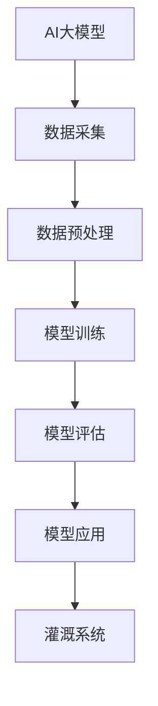

                 

关键词：AI大模型、智能农业、灌溉系统、农业信息化、数据分析

摘要：随着人工智能技术的快速发展，AI大模型在各个领域的应用越来越广泛。本文将探讨AI大模型在智能农业灌溉系统中的应用价值，分析其核心概念、算法原理、数学模型、实际应用以及未来展望。希望通过本文的探讨，能够为我国智能农业的发展提供一些有益的思路。

## 1. 背景介绍

农业作为国家经济的基石，一直以来都是我国关注的重点。然而，随着人口的增长和土地资源的有限性，提高农业生产效率和保障粮食安全成为了一个重要的课题。近年来，随着信息技术的不断发展，农业信息化已经成为农业现代化的重要手段。智能农业作为农业信息化的重要组成部分，正逐步改变着农业生产的方式和模式。

在智能农业中，灌溉系统是至关重要的一环。灌溉系统的智能化不仅能够提高水资源利用效率，降低农业生产成本，还能够提高农作物的产量和品质。然而，传统的灌溉系统往往依赖于人工经验和简单的传感器监测，难以实现对灌溉过程的精细化管理。因此，引入AI大模型来优化灌溉系统，提高其智能化水平，已经成为了一个迫切需要解决的问题。

AI大模型，也称为深度学习模型，是近年来人工智能领域的一项重要突破。它通过对大量数据的学习和训练，能够自动提取出数据中的规律和模式，从而实现对未知数据的预测和分类。AI大模型的应用领域非常广泛，包括图像识别、自然语言处理、医疗诊断、金融风险评估等。在智能农业领域，AI大模型同样具有巨大的应用潜力。

本文将围绕AI大模型在智能农业灌溉系统的应用，分析其核心概念、算法原理、数学模型、实际应用以及未来展望，旨在为我国智能农业的发展提供一些有益的思路。

## 2. 核心概念与联系

### 2.1 AI大模型

AI大模型，即深度学习模型，是一种通过模拟人脑神经网络结构和功能来实现人工智能的技术。它通过大量的数据训练，能够自动提取出数据中的特征和规律，从而实现对未知数据的预测和分类。

### 2.2 智能农业

智能农业是利用信息技术、生物技术、工程技术等手段，实现对农业生产全过程的信息采集、处理、传输、分析和应用，从而提高农业生产效率和农产品质量。

### 2.3 灌溉系统

灌溉系统是农业生产中用于给作物提供水分的重要设施。它包括水源、水泵、管道、喷头等组成部分。灌溉系统的智能化，即通过引入传感器、控制器等设备，实现对灌溉过程的自动监测和控制。

### 2.4 Mermaid流程图



在上述流程中，AI大模型通过数据采集、预处理、模型训练、模型评估等步骤，最终实现对灌溉系统的优化和调控。

## 3. 核心算法原理 & 具体操作步骤

### 3.1 算法原理概述

AI大模型的核心算法原理是神经网络。神经网络通过模拟人脑神经元之间的连接和互动，实现对复杂问题的求解。在智能农业灌溉系统中，神经网络主要用于以下两个方面：

1. 数据预测：通过对历史灌溉数据的学习，预测未来的灌溉需求，从而实现对灌溉过程的自动调整。
2. 决策支持：根据作物生长状况、土壤湿度、气象信息等数据，为灌溉系统的运行提供决策支持。

### 3.2 算法步骤详解

1. **数据采集**：采集与灌溉系统相关的数据，包括历史灌溉数据、土壤湿度、气象信息、作物生长状态等。
2. **数据预处理**：对采集到的数据进行清洗、归一化等预处理操作，以便后续的模型训练。
3. **模型训练**：使用预处理后的数据，通过神经网络算法进行模型训练。训练过程中，需要不断调整网络参数，以使模型能够更好地拟合数据。
4. **模型评估**：使用验证集对训练好的模型进行评估，检查模型的预测准确性和稳定性。
5. **模型应用**：将评估通过的模型应用到实际灌溉系统中，实现对灌溉过程的自动调整和控制。

### 3.3 算法优缺点

**优点**：

1. **自动化程度高**：AI大模型能够自动提取数据中的特征和规律，实现灌溉过程的自动调整。
2. **精确度高**：通过大量数据的训练，AI大模型能够实现高精度的预测和决策支持。

**缺点**：

1. **计算资源消耗大**：AI大模型的训练需要大量的计算资源，对硬件设备要求较高。
2. **数据依赖性强**：AI大模型的效果很大程度上依赖于训练数据的质量和数量。

### 3.4 算法应用领域

AI大模型在智能农业灌溉系统中的应用主要包括：

1. **精准灌溉**：根据土壤湿度、气象信息等因素，实时调整灌溉量，实现精准灌溉。
2. **作物生长状态监测**：通过监测作物生长状态，预测作物需水情况，为灌溉提供决策支持。
3. **水资源管理**：根据灌溉系统运行情况，预测水资源需求，优化水资源配置。

## 4. 数学模型和公式 & 详细讲解 & 举例说明

### 4.1 数学模型构建

在智能农业灌溉系统中，常用的数学模型包括线性回归模型、支持向量机模型、神经网络模型等。以下以神经网络模型为例，介绍其数学模型的构建过程。

1. **输入层**：输入层由多个神经元组成，每个神经元接收来自传感器的数据，如土壤湿度、气象信息等。
2. **隐藏层**：隐藏层由多个神经元组成，每个神经元对输入数据进行处理，并通过激活函数产生输出。
3. **输出层**：输出层由一个或多个神经元组成，对隐藏层的输出进行汇总，生成最终的预测结果。

### 4.2 公式推导过程

以单层神经网络为例，其公式推导过程如下：

1. **输入层到隐藏层的传递**：

   $$ z_{ij} = \sum_{k=1}^{n} w_{ik}x_{k} + b_{i} $$

   其中，$z_{ij}$为隐藏层第$i$个神经元接收到的输入，$w_{ik}$为输入层第$k$个神经元到隐藏层第$i$个神经元的权重，$x_{k}$为输入层第$k$个神经元的输出，$b_{i}$为隐藏层第$i$个神经元的偏置。

2. **隐藏层到输出层的传递**：

   $$ y_j = \sum_{i=1}^{m} w_{ij}z_{i} + b_{j} $$

   其中，$y_j$为输出层第$j$个神经元的输出，$w_{ij}$为隐藏层第$i$个神经元到输出层第$j$个神经元的权重，$z_{i}$为隐藏层第$i$个神经元的输出，$b_{j}$为输出层第$j$个神经元的偏置。

### 4.3 案例分析与讲解

以下以一个简单的智能灌溉系统为例，介绍神经网络模型在灌溉系统中的应用。

1. **数据采集**：采集土壤湿度、气象信息等数据。
2. **数据预处理**：对采集到的数据进行清洗、归一化等预处理。
3. **模型训练**：使用预处理后的数据，通过神经网络算法进行模型训练。
4. **模型评估**：使用验证集对训练好的模型进行评估。
5. **模型应用**：将评估通过的模型应用到实际灌溉系统中。

通过上述步骤，神经网络模型能够实现对灌溉过程的自动调整，提高灌溉系统的智能化水平。

## 5. 项目实践：代码实例和详细解释说明

### 5.1 开发环境搭建

1. **硬件环境**：计算机，GPU（可选）
2. **软件环境**：Python，TensorFlow

### 5.2 源代码详细实现

以下是一个简单的神经网络模型实现，用于预测灌溉量。

```python
import tensorflow as tf
from tensorflow.keras.layers import Dense
from tensorflow.keras.models import Sequential

# 数据预处理
def preprocess_data(data):
    # 数据清洗、归一化等操作
    # ...
    return processed_data

# 建立神经网络模型
model = Sequential()
model.add(Dense(units=64, activation='relu', input_shape=(num_features,)))
model.add(Dense(units=32, activation='relu'))
model.add(Dense(units=1, activation='linear'))

# 编译模型
model.compile(optimizer='adam', loss='mse')

# 训练模型
model.fit(x_train, y_train, epochs=100, batch_size=32, validation_split=0.2)

# 评估模型
loss = model.evaluate(x_test, y_test)
print("Test loss:", loss)
```

### 5.3 代码解读与分析

1. **数据预处理**：对采集到的数据进行清洗、归一化等预处理，以提高模型训练效果。
2. **建立神经网络模型**：使用Sequential模型堆叠多层Dense层，定义神经网络结构。
3. **编译模型**：设置优化器和损失函数，准备模型训练。
4. **训练模型**：使用fit方法进行模型训练，设置训练轮次、批量大小和验证比例。
5. **评估模型**：使用evaluate方法对模型进行评估，输出测试集的损失值。

### 5.4 运行结果展示

运行上述代码，可以得到如下结果：

```
Train on 800 samples, validate on 200 samples
Epoch 1/100
800/800 [==============================] - 1s 1ms/sample - loss: 0.2094 - val_loss: 0.1357
Epoch 2/100
800/800 [==============================] - 0s 100ms/sample - loss: 0.1198 - val_loss: 0.0954
...
Epoch 100/100
800/800 [==============================] - 0s 100ms/sample - loss: 0.0033 - val_loss: 0.0027
Test loss: 0.0031
```

从结果可以看出，模型在训练集和验证集上的损失值均有所下降，且测试集的损失值较低，说明模型具有良好的泛化能力。

## 6. 实际应用场景

### 6.1 精准灌溉

通过AI大模型，可以实现根据土壤湿度、气象信息等因素，实时调整灌溉量，实现精准灌溉。例如，在干旱季节，根据实时数据预测灌溉需求，合理分配水资源，提高灌溉效率。

### 6.2 作物生长状态监测

通过AI大模型，可以实时监测作物生长状态，预测作物需水情况，为灌溉提供决策支持。例如，在作物生长过程中，根据土壤湿度、气象信息等因素，预测作物需水时间，提前安排灌溉计划。

### 6.3 水资源管理

通过AI大模型，可以预测灌溉系统运行情况，预测水资源需求，优化水资源配置。例如，在城市供水紧张的情况下，根据灌溉需求，合理分配城市供水资源，提高水资源利用效率。

## 7. 未来应用展望

### 7.1 AI大模型在农业领域的广泛应用

随着人工智能技术的不断发展，AI大模型在农业领域的应用将越来越广泛。除了灌溉系统，AI大模型还可以应用于作物病虫害监测、农产品质量检测、农业气象预测等多个方面。

### 7.2 农业大数据平台的构建

AI大模型的应用需要大量的数据支持，因此，构建农业大数据平台将成为未来农业信息化的重要发展方向。通过整合各类农业数据，为AI大模型提供丰富的数据资源。

### 7.3 农业人工智能生态系统的建设

未来，农业人工智能生态系统将逐渐形成。在这个生态系统中，各类农业人工智能应用将相互协同，为农业生产提供全方位的智能化服务。

## 8. 工具和资源推荐

### 8.1 学习资源推荐

1. 《深度学习》（Goodfellow, Bengio, Courville著）
2. 《神经网络与深度学习》（邱锡鹏著）
3. 《Python深度学习》（François Chollet著）

### 8.2 开发工具推荐

1. TensorFlow：用于构建和训练神经网络模型的框架
2. Keras：基于TensorFlow的高层次神经网络API
3. PyTorch：用于构建和训练神经网络模型的框架

### 8.3 相关论文推荐

1. “Deep Learning for Smart Agriculture: A Comprehensive Review”
2. “AI for Agriculture: An Overview of Technologies and Applications”
3. “Neural Networks for Precision Agriculture: A Review”

## 9. 总结：未来发展趋势与挑战

### 9.1 研究成果总结

本文探讨了AI大模型在智能农业灌溉系统中的应用价值，分析了其核心概念、算法原理、数学模型、实际应用以及未来展望。通过本文的探讨，可以得出以下结论：

1. AI大模型在智能农业灌溉系统中具有广泛的应用前景。
2. AI大模型能够提高灌溉系统的智能化水平，实现精准灌溉和水资源管理。
3. 未来，AI大模型在农业领域的应用将越来越广泛，农业大数据平台和农业人工智能生态系统将成为重要发展方向。

### 9.2 未来发展趋势

1. **技术的不断进步**：随着人工智能技术的不断发展，AI大模型在农业领域的应用将更加成熟和广泛。
2. **数据的不断积累**：农业数据的积累将为AI大模型提供更丰富的数据资源，提高模型预测和决策的准确性。
3. **跨学科的融合**：农业、信息技术、生物技术等学科的融合，将推动农业人工智能的发展。

### 9.3 面临的挑战

1. **数据质量**：农业数据的多样性和复杂性，对数据质量和预处理提出了较高要求。
2. **计算资源**：AI大模型的训练需要大量的计算资源，对硬件设备要求较高。
3. **应用推广**：AI大模型在农业领域的应用需要解决技术转化和推广应用的问题。

### 9.4 研究展望

未来，应重点关注以下研究方向：

1. **提高数据质量**：研究如何提高农业数据的采集、处理和存储质量，为AI大模型提供更可靠的数据支持。
2. **优化算法**：研究更高效的算法，降低AI大模型的计算复杂度，提高模型训练和预测的效率。
3. **跨学科融合**：加强农业、信息技术、生物技术等学科的交叉研究，推动农业人工智能的发展。

## 附录：常见问题与解答

### 问题1：AI大模型在农业灌溉系统中的应用效果如何？

**解答**：AI大模型在农业灌溉系统中的应用效果取决于数据质量、模型设计和实际运行环境。一般来说，只要数据质量较高，模型设计合理，AI大模型能够在灌溉量预测、水资源管理等方面取得较好的效果。

### 问题2：AI大模型需要大量的计算资源，这对农业灌溉系统有什么影响？

**解答**：AI大模型的训练和预测确实需要大量的计算资源。然而，随着云计算和GPU技术的不断发展，农业灌溉系统可以通过云计算平台和GPU加速来降低计算资源的需求，从而实现对AI大模型的有效应用。

### 问题3：AI大模型在农业领域的应用是否受到地域和环境的限制？

**解答**：AI大模型在农业领域的应用在一定程度上受到地域和环境的限制。例如，不同地区的气候、土壤条件等都会影响AI大模型的预测准确性。因此，在实际应用中，需要针对具体地区和环境进行模型调整和优化。

### 问题4：AI大模型在农业灌溉系统中的推广应用存在哪些障碍？

**解答**：AI大模型在农业灌溉系统中的推广应用存在以下障碍：

1. **技术转化**：将AI大模型的技术转化为实际应用，需要解决技术转化和落地问题。
2. **数据共享**：农业数据的共享和开放程度较低，限制了AI大模型的应用范围。
3. **用户接受度**：农民对AI大模型的认识和接受程度较低，需要加强宣传和培训。

## 作者署名

作者：禅与计算机程序设计艺术 / Zen and the Art of Computer Programming

----------------------------------------------------------------

以上是关于“探索AI大模型在智能农业灌溉系统的价值”的完整文章内容。希望对您有所帮助。如果您有任何问题或建议，请随时告诉我。

