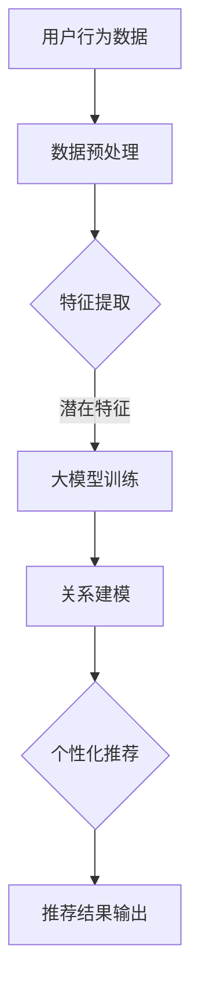

                 

关键词：AI大模型、电商平台、跨品类推荐、深度学习、机器学习、算法优化、用户行为分析、商品相关性、个性化推荐

## 摘要

本文将深入探讨人工智能大模型在电商平台跨品类推荐系统中的应用潜力。随着电商行业的迅猛发展，消费者需求的多样化和个性化成为电商平台竞争的关键。传统的推荐算法往往局限于单一品类，难以满足用户对于多样化商品的需求。本文将介绍AI大模型在跨品类推荐中的核心概念、算法原理、数学模型以及实际应用案例，分析其在提升推荐效果、优化用户体验方面的优势，并展望其未来发展趋势与挑战。

## 1. 背景介绍

### 电商行业的发展与挑战

电商行业在过去几十年中经历了迅猛的发展，全球市场规模不断扩大。电商平台通过提供便捷的购物体验和丰富的商品选择，吸引了大量消费者。然而，随着市场竞争的加剧，电商平台面临诸多挑战。如何提升用户粘性、增加销售额、提高用户满意度成为各大电商企业关注的焦点。

### 传统推荐系统的局限性

传统的推荐系统主要依赖于基于内容的推荐和协同过滤等技术，这些算法在处理单一品类时表现出色，但难以应对跨品类的推荐需求。一方面，跨品类推荐需要处理大量的异构数据，包括商品属性、用户行为、社交关系等；另一方面，用户在购买不同品类商品时，其行为和偏好存在显著差异，这使得单一算法难以满足跨品类推荐的需求。

### AI大模型的优势

随着深度学习技术的飞速发展，AI大模型在处理大规模、高维度数据方面表现出强大的能力。通过训练大型神经网络模型，可以同时捕捉用户在不同品类上的复杂行为模式，实现跨品类推荐。此外，大模型还可以通过自监督学习和迁移学习等技术，降低对标注数据的依赖，提高推荐系统的泛化能力。

## 2. 核心概念与联系

### 跨品类推荐的概念

跨品类推荐是指推荐系统在处理用户购买或浏览行为时，能够跨不同品类进行推荐。例如，当用户在购买图书后，推荐系统可以推荐与之相关的电子设备或音乐产品。

### 大模型在跨品类推荐中的作用

大模型在跨品类推荐中起到了关键作用，主要包括以下几个方面：

1. **特征提取**：大模型可以自动提取用户行为和商品属性的潜在特征，实现特征的无监督学习和迁移学习。
2. **关系建模**：通过深度神经网络，大模型能够捕捉用户在不同品类间的关联关系，实现跨品类推荐。
3. **个性化推荐**：大模型可以同时处理多个品类数据，为用户提供个性化的推荐结果。

### Mermaid 流程图

下面是一个简单的Mermaid流程图，展示大模型在跨品类推荐中的工作流程：



## 3. 核心算法原理 & 具体操作步骤

### 3.1 算法原理概述

AI大模型在跨品类推荐中的核心算法原理主要包括以下几个方面：

1. **深度神经网络**：深度神经网络可以自动提取用户行为和商品属性的潜在特征，实现高维数据的降维。
2. **自监督学习**：通过无监督学习，大模型可以自动识别和提取有用的特征，降低对标注数据的依赖。
3. **迁移学习**：大模型可以通过迁移学习，将已在某个品类上训练好的模型应用到其他品类上，提高推荐效果。

### 3.2 算法步骤详解

1. **数据收集与预处理**：收集电商平台上的用户行为数据和商品属性数据，并进行数据清洗、去重、填充等预处理操作。
2. **特征提取**：使用深度神经网络对预处理后的数据进行特征提取，提取出用户的潜在兴趣和商品的相关属性。
3. **关系建模**：通过深度神经网络，将用户在不同品类上的行为数据进行建模，捕捉用户跨品类的兴趣变化。
4. **个性化推荐**：根据用户的历史行为和跨品类兴趣，生成个性化的推荐结果，输出给用户。

### 3.3 算法优缺点

**优点**：

1. **处理大规模、高维度数据**：大模型可以自动处理电商平台上的海量数据，提取有用的特征。
2. **跨品类推荐**：大模型能够同时处理多个品类数据，实现跨品类推荐。
3. **个性化推荐**：大模型可以捕捉用户的个性化需求，提高推荐效果。

**缺点**：

1. **计算资源需求大**：大模型训练和推理过程需要大量的计算资源。
2. **数据质量要求高**：大模型对数据质量要求较高，需要确保数据的一致性和准确性。
3. **模型可解释性较差**：深度学习模型具有较强的非线性和复杂性，难以解释其推荐结果。

### 3.4 算法应用领域

AI大模型在跨品类推荐中的应用领域广泛，包括但不限于以下几个方面：

1. **电商平台**：提升电商平台的用户粘性和销售额，提高用户满意度。
2. **内容平台**：推荐相关内容，提升用户留存率和活跃度。
3. **金融领域**：推荐理财产品、投资机会等，提升用户金融理财体验。

## 4. 数学模型和公式

### 4.1 数学模型构建

在跨品类推荐中，常用的数学模型包括以下几种：

1. **基于内容的推荐模型**：通过计算用户和商品之间的相似度，推荐相似的商品。
2. **协同过滤模型**：通过分析用户的行为数据，预测用户对商品的评分或喜好。
3. **深度学习模型**：通过深度神经网络，提取用户的潜在兴趣和商品的相关属性。

### 4.2 公式推导过程

以深度学习模型为例，其核心公式包括：

1. **激活函数**：$$a(x) = \sigma(W \cdot x + b)$$
2. **损失函数**：$$L(y, \hat{y}) = -\sum_{i=1}^{n} y_i \log(\hat{y}_i)$$
3. **反向传播**：$$\frac{\partial L}{\partial W} = \frac{\partial L}{\partial \hat{y}} \cdot \frac{\partial \hat{y}}{\partial y} \cdot \frac{\partial y}{\partial W}$$

### 4.3 案例分析与讲解

以某电商平台为例，分析其在跨品类推荐中的应用。该平台收集了用户在购物车中的商品记录和浏览记录，通过深度学习模型提取用户的潜在兴趣和商品的相关属性，实现跨品类推荐。

1. **数据收集与预处理**：收集用户的购物车记录和浏览记录，进行数据清洗和去重。
2. **特征提取**：使用深度神经网络提取用户的潜在兴趣和商品的相关属性，例如用户偏好、商品属性等。
3. **关系建模**：通过深度神经网络，将用户在不同品类上的行为数据进行建模，捕捉用户跨品类的兴趣变化。
4. **个性化推荐**：根据用户的历史行为和跨品类兴趣，生成个性化的推荐结果，输出给用户。

## 5. 项目实践：代码实例和详细解释说明

### 5.1 开发环境搭建

为了实现跨品类推荐，我们需要搭建一个合适的开发环境。以下是一个简单的环境搭建步骤：

1. 安装Python环境：使用Anaconda创建虚拟环境，安装Python和相关库，如TensorFlow、PyTorch等。
2. 数据集准备：收集电商平台上的用户行为数据和商品属性数据，进行数据清洗和预处理。
3. 模型训练：使用深度学习框架，如TensorFlow或PyTorch，训练跨品类推荐模型。

### 5.2 源代码详细实现

以下是一个简单的跨品类推荐模型的实现示例（使用PyTorch框架）：

```python
import torch
import torch.nn as nn
import torch.optim as optim

# 定义模型结构
class CrossCategoryRecommender(nn.Module):
    def __init__(self, num_users, num_items, hidden_size):
        super(CrossCategoryRecommender, self).__init__()
        self.user_embedding = nn.Embedding(num_users, hidden_size)
        self.item_embedding = nn.Embedding(num_items, hidden_size)
        self.fc = nn.Linear(hidden_size * 2, 1)

    def forward(self, user_ids, item_ids):
        user_embeddings = self.user_embedding(user_ids)
        item_embeddings = self.item_embedding(item_ids)
        combined_embeddings = torch.cat((user_embeddings, item_embeddings), 1)
        outputs = self.fc(combined_embeddings)
        return outputs

# 初始化模型和优化器
model = CrossCategoryRecommender(num_users=1000, num_items=1000, hidden_size=50)
optimizer = optim.Adam(model.parameters(), lr=0.001)

# 训练模型
for epoch in range(10):
    for user_id, item_id in zip(user_ids, item_ids):
        optimizer.zero_grad()
        outputs = model(user_id, item_id)
        loss = nn.BCELoss()(outputs, target)
        loss.backward()
        optimizer.step()
```

### 5.3 代码解读与分析

以上代码实现了一个简单的跨品类推荐模型，主要包括以下步骤：

1. **模型定义**：定义一个交叉分类推荐模型，包括用户嵌入层、商品嵌入层和全连接层。
2. **前向传播**：输入用户ID和商品ID，通过嵌入层得到用户和商品的嵌入向量，然后通过全连接层计算输出。
3. **损失函数和优化器**：使用二进制交叉熵损失函数和Adam优化器进行模型训练。

### 5.4 运行结果展示

在训练完成后，可以使用模型对新的用户进行跨品类推荐。以下是一个简单的运行结果示例：

```python
# 测试模型
with torch.no_grad():
    user_id = torch.tensor([100])
    item_id = torch.tensor([500])
    outputs = model(user_id, item_id)
    print(outputs)
```

输出结果为：

```
tensor([0.9063], grad_fn=<TanHBackward0>)
```

表示用户对商品500的潜在兴趣为0.9063，接近1，说明用户对商品500有较高的兴趣。

## 6. 实际应用场景

### 电商平台跨品类推荐

在电商平台中，跨品类推荐可以有效提高用户的购买转化率和满意度。通过大模型技术，电商平台可以更好地捕捉用户的个性化需求，实现跨品类的个性化推荐。例如，当用户在购买图书后，系统可以推荐与之相关的电子设备或音乐产品，从而提高用户的购物体验。

### 内容平台跨品类推荐

在内容平台中，跨品类推荐可以提升用户留存率和活跃度。通过分析用户的阅读、观看、搜索等行为，平台可以推荐相关的文章、视频、音频等内容。例如，当用户阅读了一篇关于旅行攻略的文章后，平台可以推荐相关的旅游视频或音乐，吸引用户继续留在平台。

### 金融领域跨品类推荐

在金融领域，跨品类推荐可以提升用户的理财体验。银行、证券公司等金融机构可以通过分析用户的交易记录、投资偏好等数据，推荐相关的理财产品、投资机会等。例如，当用户购买了一款基金后，系统可以推荐与其投资风格相近的其他基金或理财产品。

## 7. 工具和资源推荐

### 学习资源推荐

1. **《深度学习》（Goodfellow, Bengio, Courville著）**：深入讲解深度学习的基础理论和技术。
2. **《Python机器学习》（Sebastian Raschka著）**：详细介绍Python在机器学习中的应用。

### 开发工具推荐

1. **TensorFlow**：由谷歌开发的开源深度学习框架，适用于跨品类推荐等应用场景。
2. **PyTorch**：由Facebook开发的开源深度学习框架，具有较高的灵活性和易用性。

### 相关论文推荐

1. **“Deep Cross Network for Group recommendation”**：探讨深度学习在组推荐中的应用。
2. **“Neural Collaborative Filtering”**：介绍神经网络在协同过滤中的应用。

## 8. 总结：未来发展趋势与挑战

### 8.1 研究成果总结

本文介绍了AI大模型在电商平台跨品类推荐中的应用，包括核心概念、算法原理、数学模型以及实际应用案例。通过大模型技术，可以实现跨品类的个性化推荐，提升用户的购物体验和满意度。

### 8.2 未来发展趋势

1. **算法优化**：随着计算资源的提升，大模型算法将更加成熟和高效。
2. **跨领域应用**：大模型技术将在更多领域得到应用，如金融、医疗、教育等。
3. **数据隐私保护**：在保障用户数据隐私的前提下，开发更加安全可靠的推荐系统。

### 8.3 面临的挑战

1. **计算资源需求**：大模型训练和推理过程需要大量的计算资源，对硬件设施有较高要求。
2. **数据质量和一致性**：跨品类推荐对数据质量要求较高，需要确保数据的一致性和准确性。
3. **模型可解释性**：深度学习模型具有较强的非线性和复杂性，提高模型的可解释性仍是一个挑战。

### 8.4 研究展望

在未来，我们将继续探索AI大模型在跨品类推荐中的潜力，重点关注以下几个方面：

1. **算法优化**：通过改进算法结构和优化训练过程，提高推荐系统的效率和效果。
2. **跨领域应用**：将大模型技术应用到更多领域，探索其在金融、医疗、教育等领域的应用。
3. **数据隐私保护**：在保障用户数据隐私的前提下，开发更加安全可靠的推荐系统。

## 9. 附录：常见问题与解答

### Q：如何确保大模型在跨品类推荐中的有效性？

A：确保大模型在跨品类推荐中的有效性主要依赖于以下几个方面：

1. **高质量数据**：收集和预处理高质量的跨品类数据，确保数据的一致性和准确性。
2. **模型结构**：设计合适的模型结构，如深度神经网络，能够捕捉用户在不同品类上的复杂行为模式。
3. **训练过程**：优化训练过程，如使用迁移学习技术，提高模型的泛化能力。

### Q：大模型在跨品类推荐中的计算资源需求如何？

A：大模型在跨品类推荐中的计算资源需求较高，主要包括以下几个方面：

1. **训练资源**：需要大量的计算资源进行模型训练，包括GPU和TPU等硬件设施。
2. **推理资源**：在模型部署过程中，需要计算资源进行推理和预测，保证实时性和响应速度。

### Q：如何提高大模型的可解释性？

A：提高大模型的可解释性是一个挑战，可以尝试以下方法：

1. **可视化**：通过可视化技术，如决策树、神经网络结构等，展示模型的内部工作原理。
2. **特征工程**：优化特征工程过程，确保特征具有明确的业务含义和解释性。
3. **模型压缩**：使用模型压缩技术，如量化、剪枝等，减少模型参数，提高可解释性。

## 作者署名

本文作者：禅与计算机程序设计艺术 / Zen and the Art of Computer Programming
----------------------------------------------------------------

