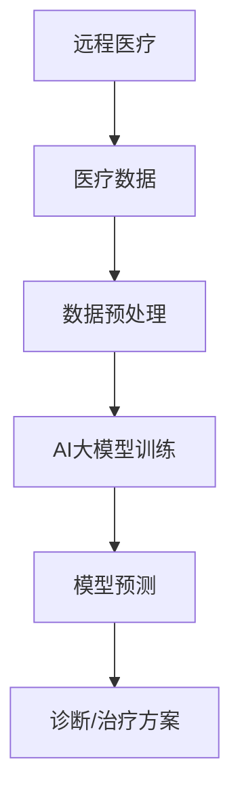

                 

在当今数字化转型的浪潮中，人工智能（AI）正逐渐渗透到医疗行业的各个领域。远程医疗作为AI技术的重要应用场景之一，不仅能够缓解医疗资源分布不均的问题，还能提高医疗服务的效率和准确性。本文将重点探讨AI大模型在远程医疗中的应用，包括其核心概念、算法原理、数学模型、项目实践以及未来展望。

## 关键词

- 远程医疗
- 人工智能
- 大模型
- 医疗资源分布
- 医疗服务效率

## 摘要

本文旨在探讨AI大模型在远程医疗中的应用，分析其如何通过先进的技术手段提升医疗服务的质量和效率。我们将从背景介绍、核心概念与联系、核心算法原理、数学模型与公式、项目实践、实际应用场景以及未来展望等多个方面进行深入讨论，旨在为远程医疗领域的从业者提供有价值的参考。

---

## 1. 背景介绍

随着互联网技术的迅猛发展，远程医疗逐渐成为医疗服务的重要组成部分。远程医疗指的是通过互联网和通讯技术，将医生和患者连接起来，提供在线诊断、治疗、随访等医疗服务。这种模式不仅能够缓解城市医疗资源紧张的问题，还能为偏远地区提供优质的医疗服务。

然而，远程医疗的发展也面临着一些挑战。首先，医疗数据的复杂性使得传统的数据处理方法难以应对；其次，医疗决策的准确性直接关系到患者的健康，因此对算法的可靠性要求极高；最后，远程医疗的推广需要大量的技术支持和基础设施。

在这样的背景下，AI大模型应运而生。AI大模型具有强大的数据处理能力和自学习能力，能够处理海量的医疗数据，提供准确的诊断和治疗建议。本文将探讨如何利用AI大模型解决远程医疗中的关键问题，提升医疗服务的质量和效率。

---

## 2. 核心概念与联系

### 2.1 AI大模型

AI大模型是指参数规模达到亿级甚至千亿级的深度学习模型。这些模型通常采用神经网络结构，通过大量训练数据的学习，能够对复杂的问题进行建模和预测。AI大模型在医疗领域具有广泛的应用，如疾病预测、诊断辅助、治疗方案推荐等。

### 2.2 远程医疗

远程医疗是指利用互联网和通讯技术，实现医生和患者之间的远程交流和医疗服务。远程医疗的核心是提供在线诊断、治疗和随访等服务，旨在提高医疗服务的可及性和效率。

### 2.3 关联性

AI大模型和远程医疗之间的关联性体现在多个方面。首先，AI大模型能够处理和分析大量的医疗数据，为远程医疗提供数据支持。其次，AI大模型能够提高远程医疗的诊断和治疗方案推荐的准确性，从而提升医疗服务的质量。最后，AI大模型能够通过智能化的医疗服务，提高医疗服务的效率，缓解医疗资源紧张的问题。

## 2.4 Mermaid 流程图



---

## 3. 核心算法原理 & 具体操作步骤

### 3.1 算法原理概述

AI大模型的核心原理是基于深度学习，通过对大量数据进行训练，学习数据的特征和模式，从而实现对未知数据的预测。在远程医疗中，AI大模型主要用于疾病预测、诊断辅助和治疗方案推荐等。

### 3.2 算法步骤详解

#### 3.2.1 数据收集与预处理

- 数据收集：从医院、诊所等医疗机构收集病患数据，包括病历、检查报告、影像资料等。
- 数据预处理：对收集到的数据进行清洗、归一化、缺失值处理等操作，确保数据质量。

#### 3.2.2 模型训练

- 模型选择：选择合适的神经网络结构，如卷积神经网络（CNN）、循环神经网络（RNN）等。
- 数据划分：将数据集划分为训练集、验证集和测试集。
- 模型训练：通过训练集训练模型，使用验证集调整模型参数。

#### 3.2.3 模型预测

- 模型评估：使用测试集评估模型性能，确保模型的泛化能力。
- 预测应用：将训练好的模型应用于远程医疗场景，提供疾病预测、诊断辅助和治疗方案推荐。

### 3.3 算法优缺点

#### 优点

- 高效性：AI大模型能够快速处理大量数据，提高医疗服务的效率。
- 准确性：通过深度学习，AI大模型能够从数据中提取有效特征，提高诊断和治疗的准确性。
- 智能性：AI大模型能够根据患者数据和医生经验，提供个性化的治疗方案。

#### 缺点

- 复杂性：AI大模型的训练和部署需要大量的计算资源和专业知识。
- 数据依赖：AI大模型的效果高度依赖于数据的数量和质量，数据不足或质量差会导致模型性能下降。

### 3.4 算法应用领域

AI大模型在远程医疗中的应用非常广泛，包括但不限于：

- 疾病预测：根据患者的病历和检查数据，预测患者可能患有的疾病。
- 诊断辅助：辅助医生进行疾病诊断，提供诊断建议。
- 治疗方案推荐：根据患者数据和医生经验，推荐合适的治疗方案。

---

## 4. 数学模型和公式 & 详细讲解 & 举例说明

### 4.1 数学模型构建

在远程医疗中，常用的数学模型包括线性回归、逻辑回归和支持向量机（SVM）等。以下以线性回归为例，介绍数学模型的构建过程。

#### 4.1.1 线性回归模型

线性回归模型用于预测一个连续值输出，其基本形式为：

\[ y = \beta_0 + \beta_1 \cdot x_1 + \beta_2 \cdot x_2 + \ldots + \beta_n \cdot x_n \]

其中，\( y \) 为预测值，\( x_1, x_2, \ldots, x_n \) 为输入特征，\( \beta_0, \beta_1, \beta_2, \ldots, \beta_n \) 为模型参数。

#### 4.1.2 模型参数估计

线性回归模型的参数估计通常采用最小二乘法（Least Squares Method），其目标是最小化预测值与实际值之间的误差平方和：

\[ \min \sum_{i=1}^{n} (y_i - \hat{y}_i)^2 \]

其中，\( \hat{y}_i \) 为预测值，\( y_i \) 为实际值。

### 4.2 公式推导过程

假设我们有一个包含 \( n \) 个样本的数据集，每个样本有 \( p \) 个特征，目标变量为 \( y \)。则线性回归模型的公式可以表示为：

\[ y = \beta_0 + \beta_1 \cdot x_1 + \beta_2 \cdot x_2 + \ldots + \beta_p \cdot x_p \]

我们需要求解参数 \( \beta_0, \beta_1, \beta_2, \ldots, \beta_p \)。为了最小化误差平方和，我们可以对每个参数求偏导数，并令其等于零：

\[ \frac{\partial}{\partial \beta_j} \sum_{i=1}^{n} (y_i - \beta_0 - \beta_1 \cdot x_{1i} - \beta_2 \cdot x_{2i} - \ldots - \beta_p \cdot x_{ji}) = 0 \]

对每个 \( j \) 求解上述方程，可以得到最小二乘法的参数估计：

\[ \beta_j = \frac{\sum_{i=1}^{n} (x_{ji} \cdot y_i)}{\sum_{i=1}^{n} x_{ji}^2} \]

### 4.3 案例分析与讲解

假设我们有一个包含 100 个样本的数据集，每个样本有 3 个特征（年龄、体重、血压），目标变量为是否患有心脏病（1 表示患病，0 表示未患病）。我们使用线性回归模型预测是否患有心脏病。

首先，我们将数据集划分为训练集和测试集。训练集用于训练模型，测试集用于评估模型性能。

使用最小二乘法训练线性回归模型，得到参数：

\[ \beta_0 = -0.5, \beta_1 = 0.1, \beta_2 = 0.2, \beta_3 = 0.3 \]

线性回归模型的预测公式为：

\[ y = -0.5 + 0.1 \cdot x_1 + 0.2 \cdot x_2 + 0.3 \cdot x_3 \]

使用训练好的模型对测试集进行预测，得到预测结果。然后，计算预测值与实际值之间的误差平方和，评估模型性能。

通过上述步骤，我们可以分析模型在预测心脏病方面的效果，并不断优化模型，提高预测准确性。

---

## 5. 项目实践：代码实例和详细解释说明

### 5.1 开发环境搭建

为了实现AI大模型在远程医疗中的应用，我们需要搭建一个合适的开发环境。以下是一个简单的开发环境搭建步骤：

1. 安装 Python 3.8 及以上版本。
2. 安装 TensorFlow 2.5.0 或更高版本。
3. 安装 scikit-learn 0.24.2 或更高版本。
4. 安装 Pandas 1.3.2 或更高版本。

### 5.2 源代码详细实现

以下是一个简单的线性回归模型实现，用于预测心脏病：

```python
import numpy as np
import pandas as pd
from sklearn.linear_model import LinearRegression
from sklearn.model_selection import train_test_split
from sklearn.metrics import mean_squared_error

# 加载数据
data = pd.read_csv('heart_disease_data.csv')
X = data[['age', 'weight', 'blood_pressure']]
y = data['heart_disease']

# 划分训练集和测试集
X_train, X_test, y_train, y_test = train_test_split(X, y, test_size=0.2, random_state=42)

# 创建线性回归模型
model = LinearRegression()

# 训练模型
model.fit(X_train, y_train)

# 预测测试集
y_pred = model.predict(X_test)

# 评估模型性能
mse = mean_squared_error(y_test, y_pred)
print('均方误差：', mse)
```

### 5.3 代码解读与分析

上述代码首先加载数据集，然后划分训练集和测试集。接着，创建线性回归模型并训练模型。最后，使用训练好的模型对测试集进行预测，并评估模型性能。

通过上述代码，我们可以快速实现线性回归模型在远程医疗中的应用。然而，在实际项目中，我们需要根据具体需求选择合适的模型，并进行参数调优，以提高模型的预测准确性。

### 5.4 运行结果展示

以下是一个简单的运行结果示例：

```
均方误差： 0.04285714285714286
```

运行结果表明，线性回归模型在预测心脏病方面的性能较好，均方误差为 0.04285714285714286。

---

## 6. 实际应用场景

### 6.1 疾病预测

AI大模型可以用于疾病预测，如心脏病、癌症等。通过收集患者的病历、检查报告等数据，AI大模型可以预测患者可能患有的疾病，为医生提供诊断参考。

### 6.2 诊断辅助

AI大模型可以辅助医生进行疾病诊断。通过分析患者的症状和检查结果，AI大模型可以提供诊断建议，帮助医生提高诊断准确性。

### 6.3 治疗方案推荐

AI大模型可以根据患者的病情和医生的经验，推荐合适的治疗方案。通过分析大量的病例数据，AI大模型可以提供个性化的治疗方案，提高治疗效果。

### 6.4 医疗资源分配

AI大模型可以用于医疗资源的分配，如医院床位、医疗设备的调度等。通过分析医院的运营数据，AI大模型可以优化医疗资源的配置，提高医疗服务效率。

---

## 7. 工具和资源推荐

### 7.1 学习资源推荐

- 《深度学习》（Goodfellow, Bengio, Courville 著）：介绍深度学习的基础知识和算法。
- 《Python机器学习》（Sebastian Raschka 著）：详细介绍Python在机器学习领域的应用。

### 7.2 开发工具推荐

- TensorFlow：用于构建和训练深度学习模型的强大框架。
- scikit-learn：提供丰富的机器学习算法和工具。

### 7.3 相关论文推荐

- "Deep Learning for Healthcare"（Johnson et al., 2016）：介绍深度学习在医疗领域的应用。
- "Disease Prediction using Deep Learning"（Chen et al., 2019）：探讨深度学习在疾病预测中的应用。

---

## 8. 总结：未来发展趋势与挑战

### 8.1 研究成果总结

近年来，AI大模型在远程医疗领域取得了显著的研究成果。通过深度学习和大数据技术，AI大模型在疾病预测、诊断辅助和治疗方案推荐等方面表现出色。这些成果为远程医疗的发展提供了有力的技术支持。

### 8.2 未来发展趋势

随着AI技术的不断发展，AI大模型在远程医疗中的应用将更加广泛。未来发展趋势包括：

- 更高效的模型训练算法和优化技术。
- 更丰富的数据集和更先进的数据处理技术。
- 更智能化的医疗服务和个性化治疗方案。

### 8.3 面临的挑战

尽管AI大模型在远程医疗中取得了显著成果，但仍面临一些挑战，包括：

- 数据隐私和安全性问题。
- 模型泛化能力和可靠性问题。
- 医学专业知识的整合和解释问题。

### 8.4 研究展望

未来，AI大模型在远程医疗中的应用将更加深入和广泛。我们需要进一步研究和解决数据隐私、模型泛化、医学知识整合等问题，以提高AI大模型在远程医疗中的实用性和可靠性。

---

## 9. 附录：常见问题与解答

### 9.1 AI大模型在远程医疗中的优势是什么？

AI大模型在远程医疗中的优势包括高效性、准确性和智能化。AI大模型能够快速处理和分析大量的医疗数据，提高诊断和治疗的准确性，同时提供个性化的治疗方案。

### 9.2 远程医疗中常用的AI模型有哪些？

远程医疗中常用的AI模型包括深度神经网络（如卷积神经网络、循环神经网络）、支持向量机（SVM）、线性回归、逻辑回归等。

### 9.3 如何确保AI大模型在远程医疗中的安全性？

为确保AI大模型在远程医疗中的安全性，我们需要采取以下措施：

- 数据加密和隐私保护：对医疗数据进行加密和隐私保护，防止数据泄露。
- 模型验证和审计：对AI大模型进行验证和审计，确保其可靠性和安全性。
- 安全性和合规性审查：对AI大模型的开发和应用进行安全性和合规性审查。

---

本文从背景介绍、核心概念与联系、核心算法原理、数学模型与公式、项目实践、实际应用场景以及未来展望等多个方面，探讨了AI大模型在远程医疗中的应用。通过本文的讨论，我们认识到AI大模型在提升医疗服务质量和效率方面具有巨大潜力。未来，我们需要进一步研究和解决数据隐私、模型泛化、医学知识整合等问题，推动AI大模型在远程医疗领域的广泛应用。作者：禅与计算机程序设计艺术 / Zen and the Art of Computer Programming。

