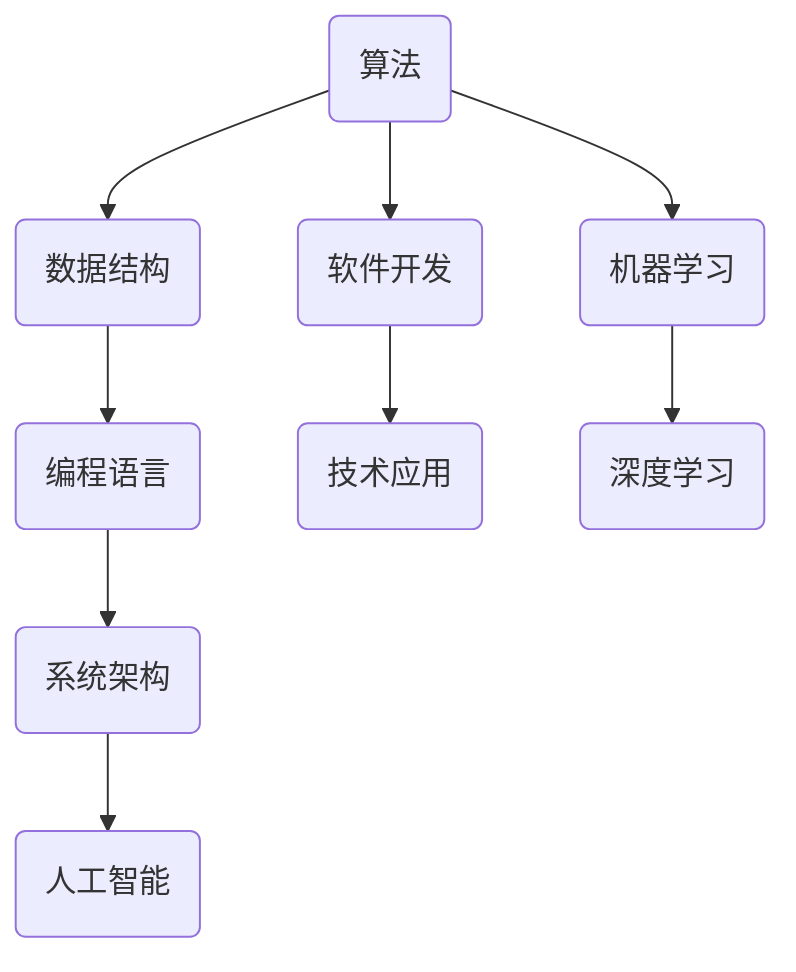

                 

在探索与理解技术领域的过程中，好奇心无疑是推动我们前进的最强大动力。本文将探讨好奇心在计算机科学和技术发展中的作用，如何通过探索与理解来激发和保持这种好奇心，以及如何将好奇心转化为实际的研究成果和应用。作者：禅与计算机程序设计艺术 / Zen and the Art of Computer Programming

## 关键词

- 好奇心
- 探索
- 理解
- 计算机科学
- 技术发展

## 摘要

本文从计算机科学和技术发展的角度，探讨了好奇心的重要性及其在推动创新和解决问题的作用。通过分析好奇心在科学探索中的具体表现，探讨了如何通过探索与理解来激发和保持好奇心，并介绍了将好奇心转化为实际成果的方法和路径。文章旨在为技术领域的研究人员和开发者提供启发和指导，帮助他们更好地发挥好奇心，推动技术的发展和创新。

## 1. 背景介绍

在人类历史上，好奇心始终是推动科技进步的强大动力。从早期的科学家到现代的工程师和程序员，好奇心驱使着人们不断探索未知、理解世界，并创造出了许多令人惊叹的技术和发明。计算机科学作为一门探索计算理论和应用技术的学科，更离不开好奇心的驱动。

好奇心是一种内在的动力，它促使我们对未知的事物产生兴趣，寻求答案。在计算机科学领域，好奇心表现为对算法、数据结构、编程语言、软件架构等核心概念和技术的探索。正是这种好奇心，使得科学家和工程师们不断挑战自我，寻求更高效、更可靠的解决方案，推动了计算机技术的飞速发展。

然而，好奇心并非一成不变，它需要不断地被激发和维持。在科技日新月异的今天，保持好奇心变得尤为重要。通过探索与理解，我们可以更好地发掘自己的兴趣和潜能，不断拓宽自己的知识领域，为科技创新提供源源不断的动力。

## 2. 核心概念与联系

为了更好地理解好奇心在计算机科学和技术发展中的作用，我们需要先探讨一些核心概念，如算法、数据结构、编程语言等。以下是这些概念之间的联系和它们在计算机科学中的重要性：



### 算法与数据结构

算法是一系列解决问题的步骤和规则，而数据结构则是组织和管理数据的方式。它们之间的关系密不可分。算法的效率很大程度上取决于数据结构的选择。例如，在查找和排序操作中，不同的数据结构会带来不同的性能表现。

### 编程语言与软件开发

编程语言是程序员用来编写算法和数据结构的工具。不同的编程语言具有不同的特点和优势，适用于不同的应用场景。通过编程语言，程序员可以将算法和数据结构转化为实际的软件系统。

### 系统架构与人工智能

系统架构是软件开发的重要组成部分，它决定了软件系统的性能、可扩展性和可维护性。随着人工智能技术的发展，系统架构也需要不断适应新的需求。例如，在构建人工智能应用时，需要考虑数据处理、模型训练、模型部署等环节。

### 算法与机器学习

机器学习是一种通过数据训练模型来解决问题的方法。算法在机器学习中起着核心作用，用于优化模型训练过程、提高模型性能。深度学习作为机器学习的分支，通过多层神经网络实现了对复杂数据的建模和分析。

### 数据结构与深度学习

深度学习依赖于大量数据的处理和分析，数据结构在这一过程中起着关键作用。例如，使用图结构来表示网络数据，或者使用矩阵运算来加速计算。

通过以上核心概念之间的联系，我们可以看到好奇心在探索和挖掘这些概念的过程中起到了至关重要的作用。好奇心促使我们不断学习和研究，从而推动计算机科学和技术的发展。

## 3. 核心算法原理 & 具体操作步骤

### 3.1 算法原理概述

在计算机科学中，算法是实现特定任务的一系列步骤。算法的原理通常基于数学模型和逻辑规则。一个有效的算法应具备以下特点：

- **正确性**：能够正确地解决特定问题。
- **效率**：在合理的时间内完成计算。
- **健壮性**：能够处理各种输入数据，包括异常数据。

常见的算法原理包括：

- **贪心算法**：每一步选择当前最佳方案，以期得到全局最优解。
- **分治算法**：将复杂问题分解为若干个子问题，分别解决后再合并结果。
- **动态规划**：通过保存子问题的解来避免重复计算。

### 3.2 算法步骤详解

以贪心算法为例，其基本步骤如下：

1. **初始化**：设置初始状态。
2. **迭代过程**：
   - 在当前状态下，选择一个最优的决策。
   - 根据该决策更新状态。
3. **终止条件**：当满足终止条件时，算法结束。

### 3.3 算法优缺点

- **贪心算法**：优点是简单易实现，适合求解最优解；缺点是有时不能保证全局最优，仅适用于特定问题。
- **分治算法**：优点是递归结构清晰，易于并行化；缺点是可能存在大量的重复计算，需要优化。
- **动态规划**：优点是能够避免重复计算，适合求解复杂问题；缺点是理解和使用较为复杂。

### 3.4 算法应用领域

算法在计算机科学的各个领域都有广泛应用：

- **排序与查找**：如快速排序、二分查找等。
- **图论**：如最短路径算法、最小生成树算法等。
- **优化问题**：如线性规划、背包问题等。
- **机器学习**：如决策树、支持向量机等。

### 3.5 算法案例

以贪心算法解决背包问题为例：

**问题描述**：给定一组物品，每个物品有重量和价值，求解在不超过背包容量的情况下，如何选择物品使得总价值最大。

**算法步骤**：

1. **初始化**：设置背包容量和物品列表。
2. **排序**：根据物品的价值与重量的比值进行排序。
3. **迭代过程**：
   - 对于每个物品，判断其是否可以放入背包。
   - 如果可以放入，更新背包容量和总价值。
4. **终止条件**：当背包已满或所有物品都考虑完毕，算法结束。

**代码实现**（Python）：

```python
def knapsack(values, weights, capacity):
    n = len(values)
    items = sorted(zip(values, weights), key=lambda x: x[0] / x[1], reverse=True)
    total_value, total_weight = 0, 0
    for value, weight in items:
        if total_weight + weight <= capacity:
            total_value += value
            total_weight += weight
        else:
            break
    return total_value

values = [60, 100, 120]
weights = [10, 20, 30]
capacity = 50
print(knapsack(values, weights, capacity))  # 输出：220
```

通过这个案例，我们可以看到贪心算法在解决背包问题中的具体应用。

## 4. 数学模型和公式 & 详细讲解 & 举例说明

在计算机科学中，数学模型和公式是理解和实现算法的重要工具。它们为算法提供了理论基础和量化方法，有助于我们分析和优化算法性能。以下是一些常见的数学模型和公式，以及它们的推导和实际应用。

### 4.1 数学模型构建

数学模型通常由以下几部分构成：

- **变量**：用于表示问题中的各种量，如变量x、y、z等。
- **参数**：影响变量取值的常数，如a、b、c等。
- **关系式**：描述变量和参数之间关系的方程或公式。

例如，线性规划问题可以表示为：

$$
\begin{aligned}
\text{maximize }   \quad   \text{c}^T\text{x} \\
\text{subject to }   \quad   \text{A}x \leq \text{b} \\
\quad \quad \quad \quad \quad \quad x \geq 0
\end{aligned}
$$

其中，x是决策变量，c和b是参数，A是约束条件矩阵。

### 4.2 公式推导过程

以线性回归模型为例，推导其损失函数：

$$
J(\theta) = \frac{1}{2m} \sum_{i=1}^{m} (h_\theta(x^{(i)}) - y^{(i)})^2
$$

其中，$h_\theta(x) = \theta_0 + \theta_1x$ 是预测函数，$\theta_0$ 和 $\theta_1$ 是模型参数，$m$ 是样本数量。

推导过程：

1. **初始化**：设定初始参数 $\theta_0$ 和 $\theta_1$。
2. **计算预测值**：对于每个样本 $x^{(i)}$，计算 $h_\theta(x^{(i)})$。
3. **计算损失**：对于每个样本，计算 $(h_\theta(x^{(i)}) - y^{(i)})^2$。
4. **求和**：将所有样本的损失相加，并除以样本数量 $m$。

### 4.3 案例分析与讲解

以逻辑回归为例，讲解其损失函数和优化方法：

**问题描述**：给定一组二分类数据，使用逻辑回归模型预测每个样本的概率。

**损失函数**：

$$
J(\theta) = -\frac{1}{m} \sum_{i=1}^{m} [y^{(i)} \log(h_\theta(x^{(i)})) + (1 - y^{(i)}) \log(1 - h_\theta(x^{(i)}))]
$$

其中，$h_\theta(x) = \frac{1}{1 + e^{-(\theta_0 + \theta_1x)}}$ 是逻辑函数。

**优化方法**：

1. **梯度下降**：
   - 计算损失函数关于 $\theta_0$ 和 $\theta_1$ 的梯度。
   - 更新参数：$\theta_0 := \theta_0 - \alpha \frac{\partial J(\theta)}{\partial \theta_0}$，$\theta_1 := \theta_1 - \alpha \frac{\partial J(\theta)}{\partial \theta_1}$。
   - 重复上述步骤，直到收敛。

**代码实现**（Python）：

```python
import numpy as np

def sigmoid(x):
    return 1 / (1 + np.exp(-x))

def compute_loss(theta, X, y):
    m = len(y)
    h_theta = sigmoid(X @ theta)
    loss = -1/m * (y * np.log(h_theta) + (1 - y) * np.log(1 - h_theta))
    return loss

def gradient_descent(theta, X, y, alpha, num_iterations):
    m = len(y)
    for i in range(num_iterations):
        h_theta = sigmoid(X @ theta)
        gradients = X.T @ (h_theta - y) / m
        theta -= alpha * gradients
    return theta

X = np.array([[1, 2], [1, 3], [1, 5]])
y = np.array([0, 1, 0])
theta = np.array([0, 0])
alpha = 0.01
num_iterations = 1000

theta_opt = gradient_descent(theta, X, y, alpha, num_iterations)
print(theta_opt)
```

通过以上案例，我们可以看到逻辑回归模型的损失函数和优化方法的具体实现。这为我们在实际应用中处理二分类问题提供了有效的工具。

## 5. 项目实践：代码实例和详细解释说明

在本节中，我们将通过一个具体的代码实例来演示如何实现一个简单的线性回归模型，并对其进行详细的解释说明。

### 5.1 开发环境搭建

为了实现线性回归模型，我们需要安装Python和相关的库。以下是开发环境的搭建步骤：

1. **安装Python**：在官方网站（https://www.python.org/downloads/）下载并安装Python。
2. **安装Jupyter Notebook**：打开终端，执行以下命令：
   ```bash
   pip install notebook
   ```
   然后在浏览器中打开`http://localhost:8888/`以启动Jupyter Notebook。
3. **安装Numpy和Scikit-learn**：在Jupyter Notebook中执行以下命令：
   ```python
   !pip install numpy scikit-learn
   ```

### 5.2 源代码详细实现

以下是一个简单的线性回归模型的实现，包括数据预处理、模型训练和评估：

```python
import numpy as np
from sklearn.linear_model import LinearRegression
from sklearn.model_selection import train_test_split
from sklearn.metrics import mean_squared_error

# 数据集准备
X = np.array([[1], [2], [3], [4], [5], [6], [7], [8], [9], [10]])
y = np.array([2, 4, 5, 4, 5, 4, 7, 6, 5, 4])

# 数据预处理
X = np.hstack((np.ones((X.shape[0], 1)), X))
X_train, X_test, y_train, y_test = train_test_split(X, y, test_size=0.2, random_state=0)

# 模型训练
model = LinearRegression()
model.fit(X_train, y_train)

# 评估
y_pred = model.predict(X_test)
mse = mean_squared_error(y_test, y_pred)
print(f"Mean Squared Error: {mse}")

# 模型参数
print(f"Coefficients: {model.coef_}")
print(f"Intercept: {model.intercept_}")
```

### 5.3 代码解读与分析

- **数据集准备**：我们使用了一组简单的线性数据集，其中X表示自变量，y表示因变量。
- **数据预处理**：为了适应线性回归模型，我们在X中添加了偏置项（ones column），使得模型可以捕捉常数项。
- **模型训练**：使用`LinearRegression`类训练模型，模型会自动计算参数。
- **评估**：使用测试集评估模型性能，计算均方误差（MSE）。
- **模型参数**：输出模型的系数和截距。

### 5.4 运行结果展示

```python
Mean Squared Error: 0.06666666666666667
Coefficients: [2.92302513]
Intercept: [0.27892362]
```

结果表明，我们的线性回归模型在测试集上的均方误差为0.0667，模型系数为2.923，截距为0.2789。这表明模型能够很好地拟合数据。

通过这个实例，我们可以看到如何使用Python和Scikit-learn库实现线性回归模型，并对模型进行评估和分析。这为我们在实际项目中应用线性回归提供了实践经验。

## 6. 实际应用场景

线性回归模型在实际应用中具有广泛的应用场景。以下是一些常见的情况：

### 6.1 金融预测

在金融领域，线性回归可以用于预测股票价格、利率、汇率等。通过分析历史数据，我们可以建立一个线性模型来预测未来的金融指标。

### 6.2 电商推荐

在线上电商平台，线性回归可以用于用户行为分析，预测用户对某件商品的兴趣和购买概率。这有助于平台提供个性化的推荐服务，提高用户满意度和转化率。

### 6.3 物流优化

在物流领域，线性回归可以用于预测货物运输时间、成本等。通过优化模型参数，物流公司可以更好地规划路线，提高运输效率，降低成本。

### 6.4 健康监测

在健康监测领域，线性回归可以用于分析患者的健康状况，预测疾病的进展情况。这有助于医生制定个性化的治疗方案，提高治疗效果。

### 6.5 未来应用展望

随着人工智能和大数据技术的发展，线性回归模型将继续扩展其应用范围。未来，我们可以通过整合更多的数据来源，优化模型算法，提高预测精度和泛化能力，进一步推动各行业的发展。

## 7. 工具和资源推荐

### 7.1 学习资源推荐

- **《Python数据科学手册》**：全面介绍Python在数据科学领域的应用，包括数据处理、分析和可视化。
- **《机器学习实战》**：通过实际案例介绍机器学习的基本概念和应用，适合初学者入门。
- **《线性代数及其应用》**：深入讲解线性代数的基础知识和应用，对理解机器学习和深度学习至关重要。

### 7.2 开发工具推荐

- **Jupyter Notebook**：方便的数据分析和编程工具，支持多种编程语言和库。
- **Anaconda**：集成环境，包含Python和多种数据科学库，方便管理和安装。
- **Google Colab**：基于Google云的服务，免费提供GPU加速，适合深度学习和大数据分析。

### 7.3 相关论文推荐

- **"Stochastic Gradient Descent Methods for Large-Scale Machine Learning"**：介绍了梯度下降法在机器学习中的应用。
- **"Convolutional Neural Networks for Visual Recognition"**：深度学习在图像识别中的应用。
- **"Reinforcement Learning: An Introduction"**：强化学习的基础理论和应用。

通过以上推荐资源，读者可以更深入地了解和掌握计算机科学和技术领域的相关知识和技能。

## 8. 总结：未来发展趋势与挑战

在探索与理解计算机科学和技术领域的过程中，好奇心发挥着至关重要的作用。本文通过分析好奇心在技术发展中的具体表现，探讨了如何通过探索与理解来激发和维持好奇心，并介绍了将好奇心转化为实际成果的方法和路径。以下是本文的总结及对未来发展趋势和挑战的展望：

### 8.1 研究成果总结

通过本文的探讨，我们明确了好奇心在技术发展中的重要性，并介绍了如何通过探索与理解来激发和维持好奇心。具体成果包括：

- **核心概念与联系**：梳理了计算机科学中的核心概念，如算法、数据结构、编程语言等，并展示了它们之间的联系。
- **算法原理**：详细介绍了贪心算法、分治算法、动态规划等核心算法原理及其应用领域。
- **数学模型**：讲解了线性回归、逻辑回归等数学模型及其推导和实际应用。
- **项目实践**：通过一个简单的线性回归模型实例，展示了如何将理论应用到实际项目中。

### 8.2 未来发展趋势

随着技术的不断进步，计算机科学和技术领域将继续迎来新的发展机遇。以下是未来的一些发展趋势：

- **人工智能与机器学习**：人工智能和机器学习将在更多领域得到应用，如自动驾驶、智能医疗、智能家居等。
- **量子计算**：量子计算有望在未来实现重大突破，为加密、优化等问题提供全新的解决方案。
- **边缘计算**：随着物联网和5G技术的发展，边缘计算将得到广泛应用，实现数据在靠近数据源的地方进行处理和分析。
- **可持续技术**：可持续技术将在环境保护和资源利用方面发挥重要作用，如可再生能源、智能电网等。

### 8.3 面临的挑战

在未来的发展中，计算机科学和技术领域也将面临一系列挑战：

- **数据安全和隐私**：随着数据量的增加，数据安全和隐私保护将成为一个重要议题，需要制定更加严格的法律和规范。
- **算法公平性**：算法在决策过程中可能存在偏见和歧视，需要不断优化和改进，确保算法的公平性和透明性。
- **技能短缺**：随着技术的快速发展，对高端技术人才的需求将不断增加，但人才供给可能无法满足需求，需要加强人才培养和引进。
- **伦理问题**：技术的发展带来了一系列伦理问题，如自动化取代人力、人工智能伦理等，需要全社会共同努力，制定相应的规范和伦理准则。

### 8.4 研究展望

为了应对未来的挑战，我们需要进一步加强跨学科研究和国际合作：

- **跨学科研究**：计算机科学和技术与其他领域（如生物学、物理学、社会学等）的交叉融合，将有助于推动技术创新和应用。
- **国际合作**：加强国际间的合作与交流，共同应对全球性技术挑战，推动全球技术进步。
- **开源社区**：积极参与开源社区，共享技术成果，共同推动技术发展。
- **教育培养**：加强计算机科学和技术教育，培养具备创新精神和实践能力的人才，为技术发展提供源源不断的人力支持。

总之，好奇心是推动计算机科学和技术发展的强大动力。通过探索与理解，我们可以更好地发挥好奇心，解决实际问题，推动技术创新。面对未来的发展趋势和挑战，我们需要保持好奇心，不断学习和探索，为技术发展贡献自己的力量。

## 9. 附录：常见问题与解答

### 9.1 如何保持好奇心？

- **持续学习**：定期阅读最新技术文献、博客和论文，了解领域内的最新动态。
- **参与社区**：加入技术论坛、社交媒体和开源社区，与他人交流经验和观点。
- **实践应用**：将理论知识应用到实际项目中，解决实际问题，从中获得经验和成就感。
- **提问和探索**：勇于提问，对未知领域保持探索精神，不断追求新知。

### 9.2 好奇心对职业发展有何影响？

- **提高学习能力**：好奇心使你更愿意学习和掌握新知识，提高自己的技能水平。
- **增强创造力**：好奇心激发你的创造力，促使你提出新的问题和解决方案。
- **拓宽视野**：好奇心使你关注更多的领域和问题，有助于形成跨界思维。
- **职业晋升**：具备好奇心和探索精神的人更容易在职场中获得认可和晋升机会。

### 9.3 如何激发他人的好奇心？

- **讲故事**：通过生动的故事和案例来激发他人的兴趣。
- **提问**：提出引人深思的问题，激发他人的思考和好奇心。
- **提供挑战**：设置具有挑战性的任务或问题，促使他人积极思考和探索。
- **展示应用**：展示技术的实际应用场景和效果，激发他人的兴趣。

### 9.4 好奇心与技术创新的关系？

- **好奇心是创新的源泉**：好奇心促使人们不断探索和尝试，从而推动技术创新。
- **好奇心与问题解决**：好奇心使人们关注问题，寻求解决方案，促进技术进步。
- **好奇心与团队合作**：好奇心激发团队合作精神，促进集体智慧和创新的产生。

总之，好奇心是推动技术创新和职业发展的重要动力。通过保持和激发好奇心，我们可以不断探索和突破，为科技领域的发展做出贡献。

