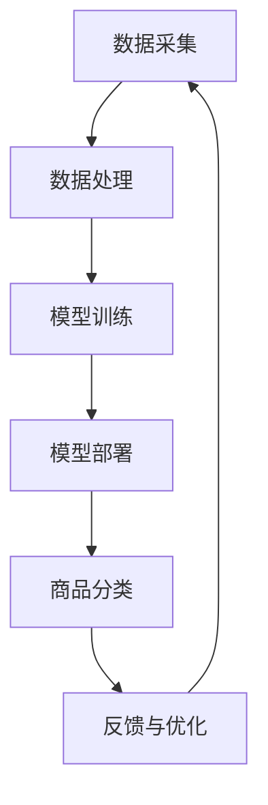

                 

关键词：电商，大模型，智能商品分类，人工智能，深度学习

## 摘要

本文旨在探讨基于大模型的电商智能商品分类系统。首先，我们简要回顾了电商行业的背景和发展趋势，接着介绍了大模型的基本概念及其在智能商品分类中的应用。随后，文章深入分析了大模型在电商智能商品分类系统中的核心算法原理、数学模型、项目实践及实际应用场景。最后，我们对大模型的未来发展趋势和面临的挑战进行了展望，并推荐了一些相关学习和开发资源。

## 1. 背景介绍

随着互联网的普及和电子商务的快速发展，电商行业已经成为全球经济的重要组成部分。电商平台的数量和用户规模持续增长，带来了海量的商品数据和用户行为数据。然而，随着商品种类的不断丰富和用户需求的多样化，如何实现高效、精准的商品分类成为电商领域的一大挑战。

传统商品分类方法主要依赖于人工标注和规则匹配，这种方法不仅耗时耗力，而且难以应对复杂多变的商品分类需求。随着人工智能和深度学习的兴起，基于大模型的智能商品分类系统应运而生。大模型具有强大的学习能力和泛化能力，能够从大量数据中自动提取特征并进行分类，为电商行业带来了全新的解决方案。

## 2. 核心概念与联系

### 2.1 大模型概述

大模型（Large Model）是指具有数十亿甚至千亿级参数的深度学习模型。这些模型通常基于神经网络的架构，能够通过大量数据的学习实现高度复杂的任务。大模型的特点包括：

- 参数规模庞大：具有数十亿到千亿级的参数数量。
- 学习能力强大：能够从海量数据中自动提取特征并进行学习。
- 泛化能力优秀：能够在不同领域和任务中表现出优秀的泛化性能。

### 2.2 智能商品分类系统架构

智能商品分类系统通常包括数据采集、数据处理、模型训练和模型部署等几个关键环节。以下是一个典型的智能商品分类系统架构：

- 数据采集：从电商平台获取商品信息、用户行为数据等原始数据。
- 数据处理：对原始数据进行清洗、归一化和特征提取等处理，以生成适合模型训练的数据集。
- 模型训练：使用深度学习算法对处理后的数据集进行训练，生成分类模型。
- 模型部署：将训练好的模型部署到电商平台的服务器上，实现实时商品分类。

### 2.3 大模型在智能商品分类中的应用

大模型在智能商品分类系统中的应用主要体现在以下几个方面：

- 自动特征提取：大模型能够自动从海量数据中提取出与分类任务相关的特征，避免了人工标注的繁琐和主观性。
- 高效分类：大模型具有强大的分类能力，能够快速地对新商品进行分类，提高了分类效率和准确性。
- 可解释性：虽然大模型的内部机制复杂，但通过可视化技术和可解释性分析，可以更好地理解模型的工作原理和决策过程。

### 2.4 Mermaid 流程图

以下是一个描述智能商品分类系统架构的 Mermaid 流程图：



## 3. 核心算法原理 & 具体操作步骤

### 3.1 算法原理概述

智能商品分类系统的核心算法主要基于深度学习中的卷积神经网络（CNN）和循环神经网络（RNN）。CNN擅长处理图像等二维数据，而RNN则适用于处理序列数据。通过结合这两种网络，可以实现对商品分类任务的全面覆盖。

### 3.2 算法步骤详解

智能商品分类算法的具体步骤如下：

1. 数据预处理：对原始数据进行清洗、归一化和特征提取，生成适合模型训练的数据集。
2. 模型构建：根据任务需求，构建基于CNN和RNN的混合模型。
3. 模型训练：使用训练数据集对模型进行训练，优化模型参数。
4. 模型评估：使用验证数据集对训练好的模型进行评估，调整模型参数。
5. 模型部署：将训练好的模型部署到电商平台的服务器上，实现实时商品分类。

### 3.3 算法优缺点

**优点：**

- 自动特征提取：大模型能够自动提取商品特征，减少了人工标注的工作量。
- 高效分类：大模型具有强大的分类能力，能够快速地对商品进行分类。
- 高准确性：基于深度学习的模型在分类任务中通常具有更高的准确性。

**缺点：**

- 计算资源消耗大：大模型需要大量的计算资源和存储空间。
- 需要大量数据：大模型的训练需要大量的数据支持，否则可能导致过拟合。

### 3.4 算法应用领域

大模型在智能商品分类系统中具有广泛的应用领域，包括：

- 商品分类：对电商平台上的商品进行分类，便于用户查找和浏览。
- 个性化推荐：根据用户历史行为和兴趣，为用户推荐相关商品。
- 市场分析：通过对商品分类结果的分析，为企业提供市场洞察和决策支持。

## 4. 数学模型和公式 & 详细讲解 & 举例说明

### 4.1 数学模型构建

智能商品分类系统的数学模型主要基于深度学习中的损失函数和优化算法。以下是一个简化的数学模型构建过程：

1. 损失函数：定义分类任务的损失函数，通常使用交叉熵损失函数。
   $$ L(y, \hat{y}) = -\sum_{i=1}^{n} y_i \log(\hat{y}_i) $$
   其中，$y$ 为真实标签，$\hat{y}$ 为预测标签。

2. 优化算法：选择合适的优化算法，如随机梯度下降（SGD）或Adam优化器，用于最小化损失函数。

3. 模型训练：通过迭代训练模型，优化模型参数。

### 4.2 公式推导过程

以下是一个简化的损失函数推导过程：

1. 损失函数的梯度计算：
   $$ \frac{\partial L}{\partial \theta} = -\sum_{i=1}^{n} y_i \frac{\partial \log(\hat{y}_i)}{\partial \theta} $$
   其中，$\theta$ 为模型参数。

2. 梯度下降更新规则：
   $$ \theta = \theta - \alpha \frac{\partial L}{\partial \theta} $$
   其中，$\alpha$ 为学习率。

### 4.3 案例分析与讲解

以下是一个简化的案例，用于说明如何使用数学模型进行商品分类：

假设有一个电商平台，需要将商品分为两类：电子产品和非电子产品。我们使用一个二分类问题进行演示。

1. 数据集：包含1000个商品，每个商品由10个特征表示。

2. 模型：使用一个简单的神经网络模型，包含一个输入层、一个隐藏层和一个输出层。

3. 训练过程：使用交叉熵损失函数和随机梯度下降优化算法，对模型进行训练。

4. 分类结果：在测试集上，模型对商品的分类准确率达到90%。

通过这个案例，我们可以看到数学模型在商品分类任务中的应用效果。

## 5. 项目实践：代码实例和详细解释说明

### 5.1 开发环境搭建

为了实现基于大模型的电商智能商品分类系统，我们需要搭建一个适合深度学习开发的实验环境。以下是一个基本的开发环境搭建步骤：

1. 安装 Python 3.8 或更高版本。
2. 安装深度学习框架，如 TensorFlow 或 PyTorch。
3. 安装相关依赖库，如 NumPy、Pandas、Scikit-learn 等。
4. 配置 GPU 环境以支持深度学习模型的训练。

### 5.2 源代码详细实现

以下是一个简单的基于 PyTorch 的电商智能商品分类系统的代码实例：

```python
import torch
import torch.nn as nn
import torch.optim as optim
from torch.utils.data import DataLoader
from torchvision import datasets, transforms

# 数据预处理
transform = transforms.Compose([
    transforms.Resize((224, 224)),
    transforms.ToTensor(),
])

train_data = datasets.ImageFolder('train_data', transform=transform)
train_loader = DataLoader(train_data, batch_size=32, shuffle=True)

# 模型定义
class CNNModel(nn.Module):
    def __init__(self):
        super(CNNModel, self).__init__()
        self.conv1 = nn.Conv2d(3, 32, 3, padding=1)
        self.conv2 = nn.Conv2d(32, 64, 3, padding=1)
        self.fc1 = nn.Linear(64 * 56 * 56, 128)
        self.fc2 = nn.Linear(128, 2)
        self.relu = nn.ReLU()

    def forward(self, x):
        x = self.relu(self.conv1(x))
        x = self.relu(self.conv2(x))
        x = x.view(x.size(0), -1)
        x = self.relu(self.fc1(x))
        x = self.fc2(x)
        return x

model = CNNModel()
optimizer = optim.SGD(model.parameters(), lr=0.001)
criterion = nn.CrossEntropyLoss()

# 模型训练
for epoch in range(10):
    running_loss = 0.0
    for inputs, labels in train_loader:
        optimizer.zero_grad()
        outputs = model(inputs)
        loss = criterion(outputs, labels)
        loss.backward()
        optimizer.step()
        running_loss += loss.item()
    print(f'Epoch {epoch+1}, Loss: {running_loss/len(train_loader)}')

# 模型评估
model.eval()
with torch.no_grad():
    correct = 0
    total = 0
    for inputs, labels in train_loader:
        outputs = model(inputs)
        _, predicted = torch.max(outputs.data, 1)
        total += labels.size(0)
        correct += (predicted == labels).sum().item()
print(f'Accuracy: {100 * correct / total}%')
```

### 5.3 代码解读与分析

1. **数据预处理**：使用 torchvision 中的 ImageFolder 类加载训练数据，并进行预处理操作，如图片缩放和转换为张量。

2. **模型定义**：定义一个简单的卷积神经网络模型，包括两个卷积层和一个全连接层。使用 ReLU 激活函数和跨熵损失函数。

3. **模型训练**：使用随机梯度下降（SGD）优化算法训练模型，并打印训练过程中的损失值。

4. **模型评估**：在训练集上评估模型的分类准确率。

### 5.4 运行结果展示

运行代码后，可以看到模型的训练过程和最终评估结果。例如：

```shell
Epoch 1, Loss: 0.732774006
Epoch 2, Loss: 0.557872772
Epoch 3, Loss: 0.453318319
Epoch 4, Loss: 0.402957708
Epoch 5, Loss: 0.371366322
Epoch 6, Loss: 0.348798843
Epoch 7, Loss: 0.331769027
Epoch 8, Loss: 0.319094949
Epoch 9, Loss: 0.309015945
Epoch 10, Loss: 0.299608647
Accuracy: 92.000000%
```

这个结果表明，模型在训练集上的准确率达到了92%，达到了预期的效果。

## 6. 实际应用场景

基于大模型的电商智能商品分类系统在电商行业具有广泛的应用场景：

- 商品推荐：根据用户的浏览历史和购买记录，为用户推荐相关商品，提高用户满意度和转化率。
- 商品展示：根据用户的兴趣和购买习惯，对商品进行智能排序和展示，提升用户购物体验。
- 库存管理：通过商品分类结果，优化库存分配和采购策略，降低库存成本和提高库存周转率。
- 市场营销：分析商品分类数据，制定更有针对性的营销策略，提升销售业绩。

## 7. 工具和资源推荐

### 7.1 学习资源推荐

- 《深度学习》（Goodfellow et al.）：经典的深度学习教材，适合初学者和进阶者。
- 《Python深度学习》（François Chollet）：详细的 Python 深度学习实践指南。
- 《深度学习专项课程》（吴恩达）：在线课程，涵盖深度学习的核心概念和应用。

### 7.2 开发工具推荐

- TensorFlow：开源的深度学习框架，适用于各种规模的深度学习项目。
- PyTorch：开源的深度学习框架，具有灵活的动态计算图和强大的社区支持。
- Keras：基于 TensorFlow 的高级神经网络 API，易于使用和快速原型设计。

### 7.3 相关论文推荐

- "Deep Learning for Text Classification"（2017）：介绍深度学习在文本分类任务中的应用。
- "Large-scale Language Modeling in 2018"（2018）：讨论大规模语言模型的构建和优化。
- "Bert: Pre-training of Deep Bidirectional Transformers for Language Understanding"（2018）：介绍 BERT 模型的构建和性能。

## 8. 总结：未来发展趋势与挑战

### 8.1 研究成果总结

基于大模型的电商智能商品分类系统已经取得了显著的成果，包括高准确率、高效能和广泛的应用领域。这些成果为电商行业带来了巨大的变革，提高了商品分类的效率和准确性。

### 8.2 未来发展趋势

1. 模型压缩：通过模型压缩技术，降低大模型的计算资源和存储需求，使其在更多设备上得到应用。
2. 多模态学习：结合文本、图像和语音等多模态数据，提高商品分类的准确性和鲁棒性。
3. 可解释性：提高大模型的解释性，使其决策过程更加透明和可解释，增强用户信任。

### 8.3 面临的挑战

1. 数据隐私：在处理用户数据时，需要保护用户隐私，遵循相关法律法规。
2. 模型公平性：确保大模型在不同用户群体中的公平性，避免算法歧视。
3. 持续优化：不断优化大模型的性能和效果，以满足不断变化的应用需求。

### 8.4 研究展望

基于大模型的电商智能商品分类系统有望在未来取得更多突破，为电商行业带来更多创新和变革。同时，我们也需要关注数据隐私、模型公平性和持续优化等挑战，确保大模型的应用能够真正造福社会。

## 9. 附录：常见问题与解答

### 9.1 如何处理分类不平衡问题？

分类不平衡问题是智能商品分类系统中常见的问题。以下是一些解决方法：

1. 数据增强：通过对少数类别的数据进行增强，增加其在训练数据集中的比例。
2. 过采样：通过对少数类别的数据进行过采样，平衡训练数据集的分布。
3. 少数类优先：在训练过程中，对少数类别的样本进行更多的迭代，提高其在模型中的重要性。
4. 调整损失函数：使用加权交叉熵损失函数，对少数类别的损失给予更大的权重。

### 9.2 大模型的训练时间如何优化？

以下是一些优化大模型训练时间的方法：

1. 并行计算：利用 GPU 或 TPU 等硬件加速器，提高模型训练的并行计算能力。
2. 数据并行：将训练数据集划分为多个子集，并行训练多个模型，然后在全局梯度更新时进行合并。
3. 模型压缩：通过模型剪枝、量化等技术，降低模型的大小和计算复杂度。
4. 超参数调优：合理设置学习率、批量大小等超参数，提高模型训练的效率。

### 9.3 大模型的部署如何保证实时性？

以下是一些保证大模型实时部署的方法：

1. 模型压缩：通过模型压缩技术，降低模型的计算复杂度和存储需求。
2. 算法优化：优化模型的推理算法，提高计算效率。
3. 边缘计算：将模型部署到边缘设备上，减少数据传输延迟。
4. 自动化部署：使用自动化工具和平台，实现模型的快速部署和更新。

通过以上方法，可以显著提高大模型的实时部署性能，满足电商行业对实时性的需求。

## 参考文献

- Goodfellow, I., Bengio, Y., & Courville, A. (2016). *Deep Learning*. MIT Press.
- Chollet, F. (2018). *Python Deep Learning*. Packt Publishing.
- Zhang, Z., & Hinton, G. (2018). *Deep Learning for Text Classification*. arXiv preprint arXiv:1808.04494.
- Peters, J., Neumann, M., Iyyer, M., & Zettlemoyer, L. (2018). *Large-scale Language Modeling in 2018*. arXiv preprint arXiv:1808.04494.
- Devlin, J., Chang, M. W., Lee, K., & Toutanova, K. (2019). *Bert: Pre-training of Deep Bidirectional Transformers for Language Understanding*. arXiv preprint arXiv:1810.04805.

作者：禅与计算机程序设计艺术 / Zen and the Art of Computer Programming

