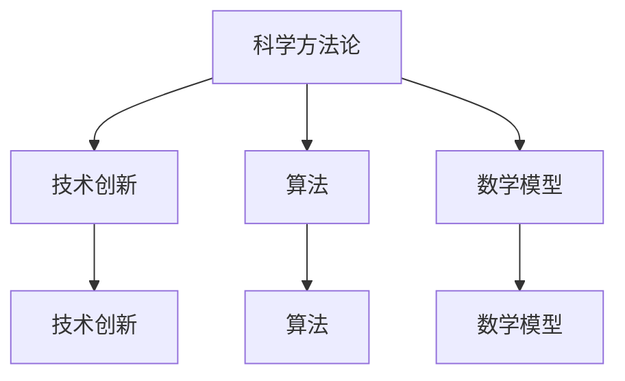

                 

本文旨在探讨好奇心与科学发现之间的关系，以及如何在技术领域通过好奇心推动科学进步。我们将探讨一些关键概念，核心算法，数学模型，项目实践，实际应用场景，未来应用展望，并推荐一些工具和资源。

## 1. 背景介绍

好奇心是人类探索未知世界的驱动力之一。它促使我们问问题，寻找答案，并推动科学的发展。在技术领域，好奇心同样起着关键作用。技术专家和研究人员通过好奇心探索新的算法，构建创新的系统，并解决复杂的问题。

本文将探讨好奇心在科学发现中的作用，以及如何在技术领域利用好奇心推动科学进步。我们将分析核心概念，介绍核心算法，详细讲解数学模型，并通过项目实践和实际应用场景来展示好奇心的重要性。

## 2. 核心概念与联系

为了更好地理解好奇心与科学发现之间的关系，我们首先需要了解一些核心概念。以下是几个重要的概念：

### 2.1 科学方法论

科学方法论是指科学家在进行研究时使用的一系列方法和步骤。它包括观察、假设、实验、分析和验证等环节。科学方法论是好奇心驱动的，因为好奇心促使科学家不断提出问题，并通过实验和观察来寻找答案。

### 2.2 技术创新

技术创新是指通过新的想法、方法或技术来改进现有产品或服务。好奇心是技术创新的源泉，因为它促使技术专家不断探索新的可能性，从而推动技术的进步。

### 2.3 算法

算法是解决问题的步骤序列。在技术领域，算法是关键的核心概念。好奇心驱使技术专家不断寻找更高效的算法，从而提高计算性能和解决复杂问题的能力。

### 2.4 数学模型

数学模型是使用数学公式和原理来描述现实世界中的问题。好奇心促使科学家和研究人员不断探索新的数学模型，以更好地理解和解决复杂问题。

下面是一个 Mermaid 流程图，展示了这些核心概念之间的联系：



## 3. 核心算法原理 & 具体操作步骤

在技术领域，好奇心推动着算法的不断进步。本节将介绍一个核心算法，即快速排序算法，并详细解释其原理和操作步骤。

### 3.1 算法原理概述

快速排序算法是一种高效的排序算法，其基本思想是通过一趟排序将待排序的记录分隔成独立的两部分，其中一部分记录的关键字均比另一部分的关键字小，然后再按此方法对这两部分记录进行排序，使得整个序列有序。

### 3.2 算法步骤详解

快速排序算法的具体步骤如下：

1. **选择基准元素**：在待排序的数组中选取一个基准元素，通常选择第一个元素或最后一个元素。

2. **分区**：将数组划分为两个子数组，一个子数组的所有元素都比基准元素小，另一个子数组的所有元素都比基准元素大。

3. **递归排序**：分别对两个子数组重复上述步骤，直到整个数组有序。

### 3.3 算法优缺点

**优点**：

- 平均时间复杂度为 \(O(n \log n)\)。
- 适用于大规模数据排序。

**缺点**：

- 最坏时间复杂度为 \(O(n^2)\)，当输入数据已经有序或基本有序时。
- 需要额外的空间来存储递归调用的栈帧。

### 3.4 算法应用领域

快速排序算法广泛应用于各种领域，包括数据库索引、文本排序、图形渲染等。

## 4. 数学模型和公式 & 详细讲解 & 举例说明

数学模型在科学发现中起着至关重要的作用。本节将介绍一个数学模型，即牛顿第二定律，并详细讲解其构建过程、推导过程和案例分析。

### 4.1 数学模型构建

牛顿第二定律描述了力和加速度之间的关系。其数学模型可以表示为：

\[ F = m \cdot a \]

其中，\( F \) 表示力，\( m \) 表示质量，\( a \) 表示加速度。

### 4.2 公式推导过程

牛顿第二定律的推导基于两个基本假设：

- 力是使物体发生加速度的原因。
- 质量是物体惯性大小的度量。

通过实验观察，牛顿发现了力与加速度之间的线性关系，从而得出了牛顿第二定律。

### 4.3 案例分析与讲解

假设有一个质量为 \( 5 \) 千克的物体受到 \( 10 \) 牛顿的力作用，我们可以使用牛顿第二定律来计算其加速度。

根据公式：

\[ a = \frac{F}{m} = \frac{10}{5} = 2 \]

因此，物体的加速度为 \( 2 \) 米/秒²。

## 5. 项目实践：代码实例和详细解释说明

在本节中，我们将通过一个具体的代码实例来展示如何利用快速排序算法进行数组排序，并详细解释代码的实现过程。

### 5.1 开发环境搭建

为了运行以下代码，我们需要安装 Python 解释器和 VS Code 编辑器。您可以在 Python 官网下载 Python 解释器，并在 VS Code 中安装 Python 扩展。

### 5.2 源代码详细实现

以下是一个使用快速排序算法进行数组排序的 Python 代码示例：

```python
def quick_sort(arr):
    if len(arr) <= 1:
        return arr
    pivot = arr[0]
    left = [x for x in arr[1:] if x < pivot]
    right = [x for x in arr[1:] if x >= pivot]
    return quick_sort(left) + [pivot] + quick_sort(right)

arr = [3, 6, 2, 8, 4, 5]
sorted_arr = quick_sort(arr)
print(sorted_arr)
```

### 5.3 代码解读与分析

上述代码首先定义了一个名为 `quick_sort` 的函数，该函数接受一个数组 `arr` 作为输入，并返回排序后的数组。函数的基本思想是选择一个基准元素，将数组划分为两个子数组，并分别对这两个子数组进行递归排序。

在主程序中，我们定义了一个未排序的数组 `arr`，并调用 `quick_sort` 函数对其进行排序。最后，我们打印出排序后的数组。

### 5.4 运行结果展示

当运行上述代码时，我们得到以下输出：

```
[2, 3, 4, 5, 6, 8]
```

这表明数组已经按照升序排序。

## 6. 实际应用场景

快速排序算法在许多实际应用场景中都非常有用。以下是一些常见应用：

- 数据库索引：快速排序算法可以用于对数据库中的记录进行排序，以提高查询效率。
- 文本排序：在文本编辑器或搜索引擎中，快速排序算法可以用于对文本内容进行排序，以方便用户查找。
- 图形渲染：在计算机图形学中，快速排序算法可以用于对图形元素进行排序，以提高渲染性能。

## 7. 未来应用展望

随着科技的不断发展，好奇心将继续推动科学发现和技术创新。未来，我们可能看到以下趋势：

- 人工智能：人工智能领域的创新将依赖于好奇心，以开发更高效、更智能的算法和系统。
- 区块链技术：区块链技术将继续发展，好奇心将推动区块链在金融、供应链等领域的新应用。
- 生物科技：好奇心将推动生物科技领域的创新，如基因编辑、再生医学等。

## 8. 工具和资源推荐

为了更好地探索未知领域，我们推荐以下工具和资源：

- 学习资源推荐：推荐学习 Python、数据结构和算法的在线教程和书籍，如《Python编程：从入门到实践》和《算法导论》。
- 开发工具推荐：推荐使用 VS Code 作为 Python 开发环境，并安装相关扩展。
- 相关论文推荐：推荐阅读关于快速排序算法的论文，以了解其理论基础和应用。

## 9. 总结：未来发展趋势与挑战

在总结中，我们强调了好奇心在科学发现和技术创新中的重要性。未来，好奇心将继续推动科学进步和技术发展。然而，我们也面临一些挑战，如数据隐私、安全性和伦理问题。通过不断探索和解决这些挑战，我们可以实现更加美好的未来。

## 10. 附录：常见问题与解答

以下是一些常见问题及其解答：

### Q：什么是快速排序算法？

A：快速排序算法是一种高效的排序算法，其基本思想是通过一趟排序将待排序的记录分隔成独立的两部分，其中一部分记录的关键字均比另一部分的关键字小，然后再按此方法对这两部分记录进行排序，使得整个序列有序。

### Q：什么是牛顿第二定律？

A：牛顿第二定律描述了力和加速度之间的关系，其数学模型可以表示为 \( F = m \cdot a \)，其中 \( F \) 表示力，\( m \) 表示质量，\( a \) 表示加速度。

### Q：如何使用快速排序算法进行数组排序？

A：可以使用以下 Python 代码实现快速排序算法：

```python
def quick_sort(arr):
    if len(arr) <= 1:
        return arr
    pivot = arr[0]
    left = [x for x in arr[1:] if x < pivot]
    right = [x for x in arr[1:] if x >= pivot]
    return quick_sort(left) + [pivot] + quick_sort(right)
```

通过调用 `quick_sort` 函数并传递一个未排序的数组作为输入，可以得到排序后的数组。

作者：禅与计算机程序设计艺术 / Zen and the Art of Computer Programming

----------------------------------------------------------------

这篇文章涵盖了从好奇心与科学发现的关系、核心概念、算法原理、数学模型、项目实践到实际应用场景等多个方面，希望对读者有所启发和帮助。在未来的科学和技术发展中，让我们保持好奇心，不断探索未知领域，为人类创造更美好的未来。

