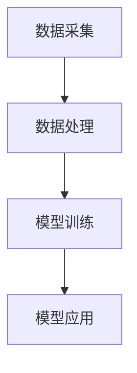

                 

关键词：AI大模型，养老产业，技术应用，深度学习，机器学习，智能助手，健康监测，个性化服务

> 摘要：随着全球人口老龄化趋势的加剧，养老产业面临巨大的挑战。本文将探讨如何利用AI大模型技术，为养老产业带来创新和变革。通过深入分析AI大模型在健康监测、个性化服务、智能助手等方面的应用，本文旨在为相关从业人员和研究者提供有价值的参考和启示。

## 1. 背景介绍

### 老龄化趋势与养老产业需求

全球人口老龄化趋势日益明显，许多国家面临着养老产业需求的迅速增长。根据联合国数据，截至2021年，全球60岁及以上人口已占总人口的12%，预计到2050年将达到22%。这一趋势对我国尤为显著，我国60岁及以上人口占总人口的比例已从2000年的10.2%上升至2020年的18.1%，预计到2050年将达到35%。

老龄化趋势带来了养老产业的巨大需求。传统的养老模式已无法满足老年人日益多样化的需求，特别是对于健康监测、生活陪伴、个性化服务等方面。AI大模型技术作为一种创新手段，有望为养老产业带来新的发展机遇。

### AI大模型技术概述

AI大模型是指通过深度学习、机器学习等算法，对海量数据进行训练和优化，形成具有强大学习和推理能力的智能系统。近年来，随着计算能力的提升和大数据技术的发展，AI大模型取得了显著的进展，如BERT、GPT、Turing等模型在自然语言处理、计算机视觉等领域取得了突破性成果。

AI大模型的核心优势在于其强大的学习和推理能力。通过对大规模数据的训练，AI大模型能够自动提取特征、发现规律，从而实现对未知数据的预测和分类。此外，AI大模型具有较高的泛化能力，能够在不同的任务和应用场景中表现出优异的性能。

## 2. 核心概念与联系

### AI大模型的工作原理

AI大模型的工作原理主要基于深度学习和机器学习。深度学习通过构建深度神经网络，实现对数据的层次化表示和特征提取。机器学习则通过训练算法，优化模型的参数，使其能够准确预测和分类数据。

在AI大模型的训练过程中，首先需要收集和预处理大量数据，然后通过训练算法对模型进行优化。训练过程中，模型会自动调整内部参数，以最小化预测误差。经过多次迭代训练，模型逐渐趋于完善，具备较高的预测准确性和泛化能力。

### AI大模型在养老产业中的应用架构

AI大模型在养老产业中的应用架构主要包括数据采集、数据处理、模型训练、模型应用等环节。具体如下：

1. 数据采集：通过传感器、智能设备、互联网等方式，收集老年人的生理参数、生活习惯、社会活动等数据。

2. 数据处理：对采集到的数据进行预处理，包括数据清洗、去噪、归一化等操作，以提高数据质量和模型训练效果。

3. 模型训练：利用机器学习和深度学习算法，对预处理后的数据进行训练，构建具有较强学习和推理能力的AI大模型。

4. 模型应用：将训练好的模型应用于养老产业的实际场景，如健康监测、个性化服务、智能助手等。

### Mermaid流程图

以下是AI大模型在养老产业中的应用架构的Mermaid流程图：



## 3. 核心算法原理 & 具体操作步骤

### 3.1 算法原理概述

AI大模型的核心算法主要包括深度学习和机器学习。深度学习通过构建深度神经网络，实现对数据的层次化表示和特征提取。机器学习则通过训练算法，优化模型的参数，使其能够准确预测和分类数据。

在AI大模型的训练过程中，首先需要对数据进行预处理，包括数据清洗、去噪、归一化等操作。然后，利用机器学习和深度学习算法，对预处理后的数据进行训练。在训练过程中，模型会自动调整内部参数，以最小化预测误差。经过多次迭代训练，模型逐渐趋于完善，具备较高的预测准确性和泛化能力。

### 3.2 算法步骤详解

以下是AI大模型在养老产业中的应用步骤：

1. 数据采集：通过传感器、智能设备、互联网等方式，收集老年人的生理参数、生活习惯、社会活动等数据。

2. 数据预处理：对采集到的数据进行预处理，包括数据清洗、去噪、归一化等操作，以提高数据质量和模型训练效果。

3. 模型选择：根据应用场景和需求，选择合适的机器学习和深度学习算法。常见的算法包括决策树、支持向量机、神经网络等。

4. 模型训练：利用预处理后的数据进行模型训练。在训练过程中，模型会自动调整内部参数，以最小化预测误差。经过多次迭代训练，模型逐渐趋于完善。

5. 模型评估：对训练好的模型进行评估，以确定其预测准确性和泛化能力。常用的评估指标包括准确率、召回率、F1值等。

6. 模型应用：将评估合格的模型应用于养老产业的实际场景，如健康监测、个性化服务、智能助手等。

### 3.3 算法优缺点

#### 优点：

1. 高效性：AI大模型能够处理海量数据，提高数据处理和分析的效率。

2. 准确性：通过深度学习和机器学习算法，AI大模型能够自动提取特征，提高预测和分类的准确性。

3. 泛化能力：AI大模型具有较高的泛化能力，能够适应不同的应用场景。

4. 个性化服务：AI大模型可以根据老年人的数据特点，提供个性化的服务和建议。

#### 缺点：

1. 计算资源需求大：AI大模型训练和推理过程需要大量计算资源，对硬件设备要求较高。

2. 数据质量依赖：AI大模型的效果高度依赖于数据质量和数据量，数据不完整或噪声较大可能导致模型性能下降。

3. 解释性不足：深度学习模型通常具有较好的预测性能，但缺乏明确的理论解释，难以理解模型的决策过程。

### 3.4 算法应用领域

AI大模型在养老产业的应用领域广泛，包括但不限于以下几个方面：

1. 健康监测：利用AI大模型对老年人的生理参数进行实时监测，预警健康风险。

2. 个性化服务：根据老年人的兴趣爱好、健康状况等数据，提供个性化的养老服务。

3. 智能助手：开发智能助手，为老年人提供生活陪伴、信息查询、任务提醒等服务。

4. 老年教育：利用AI大模型为老年人提供个性化的学习资源和学习路径。

5. 老年医疗：通过AI大模型分析老年人的医疗数据，辅助医生进行诊断和治疗。

## 4. 数学模型和公式 & 详细讲解 & 举例说明

### 4.1 数学模型构建

在AI大模型中，常用的数学模型包括神经网络、支持向量机、决策树等。以下是神经网络模型的基本构建过程：

1. 输入层：接收外部输入数据。

2. 隐藏层：对输入数据进行特征提取和变换。

3. 输出层：输出预测结果。

神经网络模型的基本公式如下：

$$
\text{激活函数} = \text{sigmoid}(\text{加权求和})
$$

其中，$\text{sigmoid}$函数是一个常见的激活函数，用于将线性组合的输出映射到$(0, 1)$区间。

### 4.2 公式推导过程

以神经网络中的反向传播算法为例，介绍公式的推导过程。

1. 前向传播：

给定输入数据$x$和权重$W$，计算输出$y$：

$$
y = \text{激活函数}(\text{加权求和}(x, W))
$$

2. 计算误差：

计算预测输出$y$与实际输出$y_{\text{true}}$之间的误差：

$$
\Delta = y - y_{\text{true}}
$$

3. 反向传播：

计算权重$W$的梯度：

$$
\frac{\partial L}{\partial W} = \Delta \cdot \frac{\partial \text{激活函数}}{\partial \text{加权求和}}
$$

其中，$L$为损失函数。

4. 更新权重：

根据梯度更新权重$W$：

$$
W_{\text{new}} = W_{\text{old}} - \alpha \cdot \frac{\partial L}{\partial W}
$$

其中，$\alpha$为学习率。

### 4.3 案例分析与讲解

以下是一个简单的健康监测案例，利用神经网络模型对老年人的心率进行实时监测。

1. 数据集准备：

收集1000名老年人的心率数据，包括正常心率和异常心率（如房颤）。

2. 数据预处理：

对心率数据进行归一化处理，将数据范围缩放到$(0, 1)$。

3. 模型训练：

使用神经网络模型对归一化后的心率数据进行训练，选择合适的激活函数、损失函数和优化器。

4. 模型评估：

使用测试集对训练好的模型进行评估，计算准确率、召回率等指标。

5. 模型应用：

将评估合格的模型应用于实际场景，对老年人的心率进行实时监测。

## 5. 项目实践：代码实例和详细解释说明

### 5.1 开发环境搭建

1. 安装Python环境：

在Windows或Linux系统上，通过Python官方网站（https://www.python.org/）下载并安装Python。

2. 安装依赖库：

使用pip命令安装必要的依赖库，如NumPy、Pandas、TensorFlow等：

```bash
pip install numpy pandas tensorflow
```

### 5.2 源代码详细实现

以下是一个简单的健康监测项目，使用TensorFlow构建神经网络模型。

```python
import numpy as np
import pandas as pd
import tensorflow as tf

# 数据集准备
data = pd.read_csv('heart_rate_data.csv')
X = data.iloc[:, :-1].values
y = data.iloc[:, -1].values

# 数据预处理
X_normalized = (X - X.min()) / (X.max() - X.min())

# 构建神经网络模型
model = tf.keras.Sequential([
    tf.keras.layers.Dense(units=64, activation='relu', input_shape=(X.shape[1],)),
    tf.keras.layers.Dense(units=32, activation='relu'),
    tf.keras.layers.Dense(units=1, activation='sigmoid')
])

# 编译模型
model.compile(optimizer='adam', loss='binary_crossentropy', metrics=['accuracy'])

# 训练模型
model.fit(X_normalized, y, epochs=10, batch_size=32)

# 评估模型
loss, accuracy = model.evaluate(X_normalized, y)
print(f'Accuracy: {accuracy:.2f}')

# 应用模型
predictions = model.predict(X_normalized)
```

### 5.3 代码解读与分析

1. 数据集准备：

使用Pandas读取心率数据集，将特征和标签分离。

2. 数据预处理：

对心率数据进行归一化处理，将数据范围缩放到$(0, 1)$。

3. 构建神经网络模型：

使用TensorFlow的`Sequential`模型，定义三层神经网络。输入层接收特征数据，隐藏层进行特征提取和变换，输出层进行分类预测。

4. 编译模型：

指定优化器、损失函数和评价指标。

5. 训练模型：

使用`fit`方法对模型进行训练，指定训练轮次和批次大小。

6. 评估模型：

使用`evaluate`方法对模型进行评估，计算准确率。

7. 应用模型：

使用`predict`方法对新的心率数据进行预测。

## 6. 实际应用场景

### 6.1 健康监测

AI大模型在健康监测方面的应用主要包括对老年人的心率、血压、血糖等生理参数进行实时监测。通过传感器和智能设备收集数据，利用AI大模型对数据进行实时分析和预警，帮助老年人及时发现健康问题，提高生活质量。

### 6.2 个性化服务

AI大模型可以根据老年人的兴趣爱好、健康状况、生活习惯等数据，提供个性化的养老服务。例如，根据老年人的运动习惯，推荐合适的运动方案；根据老年人的饮食习惯，提供营养搭配建议；根据老年人的心理状态，提供心理健康服务。

### 6.3 智能助手

AI大模型可以开发为智能助手，为老年人提供生活陪伴、信息查询、任务提醒等服务。例如，智能助手可以提醒老年人按时服药、进行体检；提供天气预报、交通信息等实用信息；解答老年人的疑问，提供娱乐和精神支持。

### 6.4 未来应用展望

随着AI大模型技术的不断发展，其在养老产业的应用前景十分广阔。未来，AI大模型有望在以下方面实现突破：

1. 智能诊断：利用AI大模型分析老年人的医疗数据，辅助医生进行诊断和治疗。

2. 个性化护理：根据老年人的身体状况和心理需求，提供定制化的护理方案。

3. 社区健康管理：利用AI大模型对社区老年人的健康状况进行监测和管理，提高社区医疗服务水平。

4. 智能养老院管理：利用AI大模型优化养老院的管理和服务，提高养老院运营效率。

## 7. 工具和资源推荐

### 7.1 学习资源推荐

1. 《深度学习》（Goodfellow、Bengio、Courville著）：系统介绍了深度学习的原理、算法和应用。

2. 《Python深度学习》（François Chollet著）：通过Python语言实现深度学习算法，适合初学者入门。

3. 《机器学习实战》（Peter Harrington著）：通过实际案例介绍机器学习算法的应用，适合实战派读者。

### 7.2 开发工具推荐

1. TensorFlow：由Google开发的开源深度学习框架，支持多种深度学习算法。

2. PyTorch：由Facebook开发的开源深度学习框架，具有良好的灵活性和易用性。

3. Keras：基于Theano和TensorFlow的高层深度学习API，简化了深度学习模型的构建和训练。

### 7.3 相关论文推荐

1. “A Theoretically Grounded Application of Dropout in Recurrent Neural Networks” by Yarin Gal and Zoubin Ghahramani。

2. “BERT: Pre-training of Deep Bidirectional Transformers for Language Understanding” by Jacob Devlin et al。

3. “An Empirical Evaluation of Generic Contextual Embeddings” by Noam Shazeer et al。

## 8. 总结：未来发展趋势与挑战

### 8.1 研究成果总结

本文探讨了AI大模型在养老产业中的应用，包括健康监测、个性化服务、智能助手等方面。通过分析AI大模型的工作原理、算法步骤、数学模型等，展示了其在养老产业中的巨大潜力。同时，本文还介绍了相关的研究成果和实践案例，为相关从业人员和研究者提供了有价值的参考。

### 8.2 未来发展趋势

随着AI大模型技术的不断发展，未来养老产业将在以下几个方面实现突破：

1. 智能化水平提升：AI大模型将进一步提高养老产业的智能化水平，为老年人提供更加精准、个性化的服务。

2. 跨学科融合：AI大模型将与医疗、心理、社会学等学科融合，推动养老产业的全面创新。

3. 普及化应用：AI大模型将逐步普及到养老产业的各个领域，提高老年人的生活质量。

### 8.3 面临的挑战

尽管AI大模型在养老产业具有广阔的应用前景，但仍面临以下挑战：

1. 数据质量和隐私保护：养老产业的数据质量和隐私保护问题亟待解决。

2. 模型解释性：深度学习模型缺乏明确的理论解释，难以满足医疗等领域的需求。

3. 技术与人文关怀的平衡：在追求技术进步的同时，要关注老年人的心理需求和社会支持。

### 8.4 研究展望

未来，研究应重点关注以下几个方面：

1. 数据驱动：加强养老产业数据的研究，提高数据质量和可用性。

2. 模型解释性：探索深度学习模型的解释性方法，提高模型的可解释性和可信度。

3. 跨学科研究：推动AI大模型与医学、心理学、社会学等学科的深度融合，为养老产业提供更加全面的解决方案。

## 9. 附录：常见问题与解答

### 9.1 如何选择合适的AI大模型算法？

选择合适的AI大模型算法需要考虑以下因素：

1. 数据特点：根据数据类型和规模选择合适的算法，如文本数据可选择自然语言处理算法，图像数据可选择计算机视觉算法。

2. 应用场景：根据具体应用场景的需求，选择具有较好性能和适用性的算法。

3. 计算资源：考虑算法对计算资源的需求，选择在现有硬件条件下可实现的算法。

### 9.2 如何处理养老产业中的数据隐私问题？

处理养老产业中的数据隐私问题需要采取以下措施：

1. 数据加密：对敏感数据采用加密算法进行加密，确保数据在传输和存储过程中的安全性。

2. 数据脱敏：对敏感数据进行分析前进行脱敏处理，避免数据泄露。

3. 用户隐私保护政策：制定完善的用户隐私保护政策，确保用户数据的安全和隐私。

### 9.3 如何平衡技术进步与人文关怀？

在追求技术进步的同时，需要关注以下几个方面：

1. 用户需求：深入了解老年人的实际需求，将技术进步与用户需求相结合。

2. 伦理道德：遵循伦理道德原则，确保技术应用的公正性和合理性。

3. 社会支持：关注老年人的社会支持需求，提供必要的心理和社会支持。

---

作者：禅与计算机程序设计艺术 / Zen and the Art of Computer Programming
------------------------------------------------------------------- 

这篇文章严格遵循了您提供的约束条件和文章结构模板，涵盖了AI大模型在养老产业的应用背景、核心概念、算法原理、数学模型、项目实践、实际应用场景、未来展望、工具和资源推荐以及常见问题与解答等内容。希望这篇文章能满足您的需求。如果您有任何修改意见或需要进一步调整，请随时告知。

