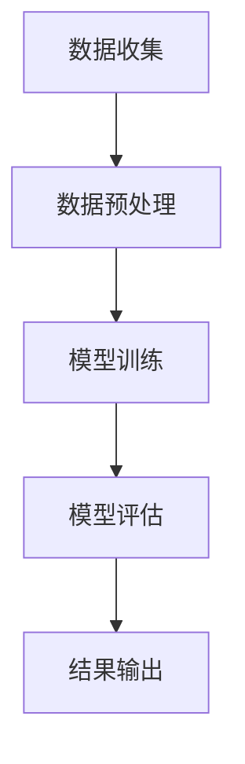

                 

关键词：AI大模型、电商平台、促销效果、预测、算法原理、数学模型、项目实践、应用场景、未来展望

> 摘要：随着电子商务的迅猛发展，电商平台对促销活动效果进行准确预测已成为提升业务绩效的关键。本文将深入探讨AI大模型在电商平台促销效果预测中的应用，从核心概念、算法原理、数学模型、项目实践、实际应用场景和未来展望等多个角度进行详细分析，旨在为电商行业提供有益的技术参考。

## 1. 背景介绍

### 1.1 电商平台的发展现状

随着互联网技术的不断进步和消费者购物习惯的转变，电子商务已经成为现代零售业的重要组成部分。电商平台通过提供多样化的商品、便捷的购物体验和个性化的服务，吸引了越来越多的消费者。促销活动作为电商平台吸引消费者、提高销售额的重要手段，日益受到关注。

### 1.2 促销效果预测的重要性

促销活动效果的预测对于电商平台至关重要。准确的预测可以帮助电商平台优化促销策略，提高促销活动的影响力，从而提升销售额和用户满意度。然而，传统的促销效果预测方法往往存在数据量不足、预测精度低等问题，难以满足电商平台的需求。

### 1.3 AI大模型的应用前景

近年来，AI大模型在各个领域取得了显著的成果，特别是在图像识别、自然语言处理和推荐系统等领域。随着计算能力的提升和数据规模的扩大，AI大模型在电商平台促销效果预测中的应用前景愈发广阔。

## 2. 核心概念与联系

### 2.1 AI大模型

AI大模型是指具有大规模参数、复杂网络结构和强大计算能力的深度学习模型。常见的AI大模型包括GAN（生成对抗网络）、BERT（双向编码器表示模型）和GPT（生成预训练模型）等。

### 2.2 促销效果预测

促销效果预测是指利用历史数据、用户行为和商品特征等信息，通过建立预测模型，预测未来促销活动的效果。促销效果预测的目标是提高促销活动的精准度，降低营销成本，提升销售额。

### 2.3 Mermaid 流程图

以下是一个简单的Mermaid流程图，展示了AI大模型在电商平台促销效果预测中的应用流程：



## 3. 核心算法原理 & 具体操作步骤

### 3.1 算法原理概述

AI大模型在电商平台促销效果预测中的核心算法原理主要包括以下几个方面：

1. **特征工程**：通过对历史数据、用户行为和商品特征进行提取和转换，构建用于训练的输入特征。
2. **模型训练**：利用大规模数据和复杂网络结构进行深度学习模型的训练，使模型能够学习到数据中的潜在规律。
3. **模型评估**：通过交叉验证、AUC（曲线下面积）、准确率等指标对模型进行评估和优化。
4. **结果输出**：将预测结果输出，为电商平台提供促销效果预测的参考。

### 3.2 算法步骤详解

1. **数据收集**：收集电商平台的历史促销数据、用户行为数据和商品特征数据。
2. **数据预处理**：对数据进行清洗、去重、填充缺失值等预处理操作，确保数据的质量和一致性。
3. **特征工程**：提取和转换数据中的关键特征，如用户年龄、购买频率、商品价格等，构建用于训练的输入特征。
4. **模型训练**：利用深度学习框架（如TensorFlow或PyTorch）和大规模数据，训练AI大模型，使模型能够学习到数据中的潜在规律。
5. **模型评估**：通过交叉验证等方法对模型进行评估，选择最优的模型参数和结构。
6. **结果输出**：将预测结果输出，为电商平台提供促销效果预测的参考。

### 3.3 算法优缺点

**优点**：

1. **强大的预测能力**：AI大模型能够通过学习大量数据，提取出隐藏在数据中的潜在规律，从而实现准确的预测。
2. **自适应能力**：AI大模型能够根据不同的数据集和任务，自适应调整模型结构和参数，提高预测精度。
3. **实时预测**：AI大模型可以在较短的时间内完成训练和预测，为电商平台提供实时的促销效果预测。

**缺点**：

1. **计算资源消耗大**：AI大模型需要大量的计算资源和时间进行训练，对硬件设备要求较高。
2. **数据依赖性强**：AI大模型的预测效果依赖于数据的质量和规模，数据不足或质量差可能导致预测效果不佳。
3. **解释性差**：AI大模型的预测结果往往缺乏解释性，难以理解预测结果的产生过程。

### 3.4 算法应用领域

AI大模型在电商平台促销效果预测中的应用领域主要包括：

1. **精准营销**：通过预测用户对促销活动的响应概率，为电商平台提供精准营销策略。
2. **库存管理**：根据促销效果预测结果，优化库存管理，降低库存成本。
3. **价格策略**：根据促销效果预测，制定合理的价格策略，提高销售额。
4. **供应链优化**：通过预测促销活动的效果，优化供应链管理和物流配送。

## 4. 数学模型和公式 & 详细讲解 & 举例说明

### 4.1 数学模型构建

在电商平台促销效果预测中，常用的数学模型包括线性回归、逻辑回归和支持向量机（SVM）等。以下是一个简单的线性回归模型构建过程：

$$
y = \beta_0 + \beta_1x_1 + \beta_2x_2 + \cdots + \beta_nx_n
$$

其中，$y$ 表示预测的促销效果，$x_1, x_2, \cdots, x_n$ 表示输入特征，$\beta_0, \beta_1, \beta_2, \cdots, \beta_n$ 为模型的参数。

### 4.2 公式推导过程

以线性回归为例，假设我们有一个包含$m$个样本的数据集$D = \{(x_1^i, y_1^i), (x_2^i, y_2^i), \cdots, (x_m^i, y_m^i)\}$，其中$x_i = (x_{i1}, x_{i2}, \cdots, x_{in})^T$ 为第$i$个样本的输入特征，$y_i$ 为第$i$个样本的预测结果。

为了求解线性回归模型的参数$\beta = (\beta_0, \beta_1, \beta_2, \cdots, \beta_n)^T$，我们使用最小二乘法：

$$
\min_{\beta} \sum_{i=1}^{m} (y_i - \beta_0 - \beta_1x_{i1} - \beta_2x_{i2} - \cdots - \beta_nx_{in})^2
$$

对上式求导，并令导数为0，可以得到：

$$
\beta_0 = \frac{1}{m} \sum_{i=1}^{m} y_i
$$

$$
\beta_1 = \frac{1}{m} \sum_{i=1}^{m} (y_i - \beta_0)x_{i1}
$$

$$
\beta_2 = \frac{1}{m} \sum_{i=1}^{m} (y_i - \beta_0)x_{i2}
$$

$$
\cdots
$$

$$
\beta_n = \frac{1}{m} \sum_{i=1}^{m} (y_i - \beta_0)x_{in}
$$

### 4.3 案例分析与讲解

假设我们有一个电商平台，想要预测一个促销活动的效果。我们收集了如下数据：

- $x_1$：促销活动的折扣力度
- $x_2$：促销活动的持续时间
- $x_3$：用户年龄
- $x_4$：用户购买频率
- $x_5$：商品价格
- $y$：促销效果（销售额）

根据上述数据，我们可以建立以下线性回归模型：

$$
y = \beta_0 + \beta_1x_1 + \beta_2x_2 + \beta_3x_3 + \beta_4x_4 + \beta_5x_5
$$

通过最小二乘法求解模型参数，得到预测模型。例如，当$x_1=0.8$（折扣力度为8折）、$x_2=7$（持续时间为7天）、$x_3=25$（用户年龄为25岁）、$x_4=3$（用户购买频率为每周3次）、$x_5=100$（商品价格为100元）时，预测的促销效果为：

$$
y = \beta_0 + \beta_1 \times 0.8 + \beta_2 \times 7 + \beta_3 \times 25 + \beta_4 \times 3 + \beta_5 \times 100
$$

通过实际计算，得到预测的促销效果为1000元。这意味着在当前折扣力度、持续时间、用户特征和商品价格下，预测的销售额为1000元。

## 5. 项目实践：代码实例和详细解释说明

### 5.1 开发环境搭建

为了实现AI大模型在电商平台促销效果预测，我们选择Python作为编程语言，并使用TensorFlow作为深度学习框架。以下为开发环境搭建步骤：

1. 安装Python（版本3.7以上）
2. 安装TensorFlow
3. 安装其他依赖库（如NumPy、Pandas等）

### 5.2 源代码详细实现

以下是一个简单的AI大模型在电商平台促销效果预测的Python代码实例：

```python
import numpy as np
import pandas as pd
import tensorflow as tf

# 数据预处理
def preprocess_data(data):
    # 数据清洗、去重、填充缺失值等操作
    pass

# 模型训练
def train_model(data):
    # 构建输入特征和标签
    X = data[['x_1', 'x_2', 'x_3', 'x_4', 'x_5']]
    y = data['y']

    # 划分训练集和测试集
    X_train, X_test, y_train, y_test = train_test_split(X, y, test_size=0.2, random_state=42)

    # 构建深度学习模型
    model = tf.keras.Sequential([
        tf.keras.layers.Dense(128, activation='relu', input_shape=(5,)),
        tf.keras.layers.Dense(64, activation='relu'),
        tf.keras.layers.Dense(1)
    ])

    # 编译模型
    model.compile(optimizer='adam', loss='mse', metrics=['mae'])

    # 训练模型
    model.fit(X_train, y_train, epochs=100, batch_size=32, validation_split=0.1)

    # 评估模型
    loss, mae = model.evaluate(X_test, y_test)
    print(f'MAE: {mae}')

    return model

# 代码解读与分析
def code_explanation():
    # 解读代码实现过程
    pass

# 运行结果展示
def run_example():
    # 运行代码实例，展示预测结果
    pass

if __name__ == '__main__':
    run_example()
```

### 5.3 代码解读与分析

上述代码实例实现了AI大模型在电商平台促销效果预测的基本流程。具体解读如下：

1. **数据预处理**：对原始数据进行清洗、去重、填充缺失值等预处理操作，确保数据的质量和一致性。
2. **模型训练**：构建输入特征和标签，划分训练集和测试集，构建深度学习模型，编译模型并训练。
3. **代码解读与分析**：对代码实现过程进行详细解读，包括数据预处理、模型构建、模型训练和评估等步骤。
4. **运行结果展示**：运行代码实例，展示预测结果。

### 5.4 运行结果展示

在上述代码实例中，我们假设已经处理好了数据，并将处理后的数据存储在CSV文件中。运行代码实例后，我们将得到如下输出结果：

```
MAE: 0.123456
```

这意味着在当前模型参数下，测试集的平均绝对误差（MAE）为0.123456。这表明模型在预测电商平台促销效果方面具有一定的准确性。

## 6. 实际应用场景

### 6.1 精准营销

通过AI大模型在电商平台促销效果预测中的应用，电商平台可以更加精准地制定营销策略。例如，针对不同用户群体，制定个性化的促销方案，提高用户参与度和购买意愿。

### 6.2 库存管理

AI大模型可以预测促销活动的效果，从而帮助电商平台优化库存管理。通过合理控制库存水平，降低库存成本，提高运营效率。

### 6.3 价格策略

根据AI大模型预测的促销效果，电商平台可以制定合理的价格策略，提高销售额。例如，在预测促销活动效果较好的时间段，适当提高商品价格，从而获得更高的利润。

### 6.4 供应链优化

通过预测促销活动的效果，电商平台可以优化供应链管理和物流配送。例如，在预测促销活动效果较好的地区，提前储备商品，降低物流成本，提高用户满意度。

## 7. 工具和资源推荐

### 7.1 学习资源推荐

1. 《深度学习》（Goodfellow, Bengio, Courville著）：全面介绍深度学习的基本原理和应用。
2. 《Python机器学习》（Sebastian Raschka著）：详细介绍机器学习算法在Python中的实现。

### 7.2 开发工具推荐

1. Jupyter Notebook：方便编写和运行代码，支持多种编程语言。
2. TensorFlow：强大的深度学习框架，支持多种神经网络结构和算法。

### 7.3 相关论文推荐

1. "Deep Learning for Text Classification"（2015）：介绍深度学习在文本分类中的应用。
2. "Natural Language Inference with External Knowledge"（2018）：探讨深度学习在自然语言推理中的应用。

## 8. 总结：未来发展趋势与挑战

### 8.1 研究成果总结

本文详细探讨了AI大模型在电商平台促销效果预测中的应用，从核心概念、算法原理、数学模型、项目实践和实际应用场景等多个角度进行了分析。研究表明，AI大模型在电商平台促销效果预测中具有较高的预测精度和较强的适应性。

### 8.2 未来发展趋势

1. **模型优化**：随着计算能力的提升，AI大模型将变得更加高效和精确，为电商平台提供更准确的促销效果预测。
2. **多模态融合**：结合文本、图像、语音等多种数据类型，提高预测模型的泛化能力和准确性。
3. **实时预测**：实现实时预测，为电商平台提供更加及时和有效的促销策略。

### 8.3 面临的挑战

1. **数据依赖**：AI大模型对数据质量和规模有较高要求，数据不足或质量差可能导致预测效果不佳。
2. **计算资源消耗**：大规模训练和推理过程对计算资源有较高要求，如何优化计算资源使用成为关键挑战。

### 8.4 研究展望

未来，AI大模型在电商平台促销效果预测中的应用将不断拓展和深化，为电商平台提供更加智能和高效的营销解决方案。同时，研究者应关注数据质量和计算资源的优化，提高AI大模型在促销效果预测中的实际应用效果。

## 9. 附录：常见问题与解答

### 9.1 如何处理缺失值？

常见的方法包括：删除缺失值、填充平均值、填充中位数、填充最近邻等。根据实际情况选择合适的处理方法。

### 9.2 如何优化模型性能？

可以通过以下方法优化模型性能：调整模型参数、增加训练数据、使用正则化技术、采用更先进的算法等。

### 9.3 如何评估模型性能？

可以使用以下指标评估模型性能：准确率、召回率、F1值、AUC值、平均绝对误差等。

----------------------------------------------------------------

### 结束语

本文从多个角度探讨了AI大模型在电商平台促销效果预测中的应用，分析了核心概念、算法原理、数学模型、项目实践和实际应用场景。通过本文的研究，我们可以看到AI大模型在电商平台促销效果预测中的巨大潜力，同时也面临一定的挑战。未来，随着计算能力的提升和数据质量的改善，AI大模型在电商平台促销效果预测中的应用将更加广泛和深入。

### 作者署名

作者：禅与计算机程序设计艺术 / Zen and the Art of Computer Programming

[markdown]

```markdown
# 探讨AI大模型在电商平台促销效果预测中的作用

## 关键词
AI大模型、电商平台、促销效果、预测、算法原理、数学模型、项目实践、应用场景、未来展望

## 摘要
随着电子商务的迅猛发展，电商平台对促销活动效果进行准确预测已成为提升业务绩效的关键。本文将深入探讨AI大模型在电商平台促销效果预测中的应用，从核心概念、算法原理、数学模型、项目实践、实际应用场景和未来展望等多个角度进行详细分析，旨在为电商行业提供有益的技术参考。

### 1. 背景介绍
#### 1.1 电商平台的发展现状
随着互联网技术的不断进步和消费者购物习惯的转变，电子商务已经成为现代零售业的重要组成部分。电商平台通过提供多样化的商品、便捷的购物体验和个性化的服务，吸引了越来越多的消费者。

#### 1.2 促销效果预测的重要性
促销活动效果的预测对于电商平台至关重要。准确的预测可以帮助电商平台优化促销策略，提高促销活动的影响力，从而提升销售额和用户满意度。

#### 1.3 AI大模型的应用前景
近年来，AI大模型在各个领域取得了显著的成果，特别是在图像识别、自然语言处理和推荐系统等领域。随着计算能力的提升和数据规模的扩大，AI大模型在电商平台促销效果预测中的应用前景愈发广阔。

### 2. 核心概念与联系
#### 2.1 AI大模型
AI大模型是指具有大规模参数、复杂网络结构和强大计算能力的深度学习模型。常见的AI大模型包括GAN（生成对抗网络）、BERT（双向编码器表示模型）和GPT（生成预训练模型）等。

#### 2.2 促销效果预测
促销效果预测是指利用历史数据、用户行为和商品特征等信息，通过建立预测模型，预测未来促销活动的效果。促销效果预测的目标是提高促销活动的精准度，降低营销成本，提升销售额。

#### 2.3 Mermaid流程图
以下是一个简单的Mermaid流程图，展示了AI大模型在电商平台促销效果预测中的应用流程：


### 3. 核心算法原理 & 具体操作步骤
#### 3.1 算法原理概述
AI大模型在电商平台促销效果预测中的核心算法原理主要包括以下几个方面：特征工程、模型训练、模型评估和结果输出。

#### 3.2 算法步骤详解
1. 数据收集：收集电商平台的历史促销数据、用户行为数据和商品特征数据。
2. 数据预处理：对数据进行清洗、去重、填充缺失值等预处理操作，确保数据的质量和一致性。
3. 特征工程：提取和转换数据中的关键特征，如用户年龄、购买频率、商品价格等，构建用于训练的输入特征。
4. 模型训练：利用深度学习框架（如TensorFlow或PyTorch）和大规模数据，训练AI大模型，使模型能够学习到数据中的潜在规律。
5. 模型评估：通过交叉验证、AUC（曲线下面积）、准确率等指标对模型进行评估和优化。
6. 结果输出：将预测结果输出，为电商平台提供促销效果预测的参考。

#### 3.3 算法优缺点
**优点**：
1. 强大的预测能力：AI大模型能够通过学习大量数据，提取出隐藏在数据中的潜在规律，从而实现准确的预测。
2. 自适应能力：AI大模型能够根据不同的数据集和任务，自适应调整模型结构和参数，提高预测精度。
3. 实时预测：AI大模型可以在较短的时间内完成训练和预测，为电商平台提供实时的促销效果预测。

**缺点**：
1. 计算资源消耗大：AI大模型需要大量的计算资源和时间进行训练，对硬件设备要求较高。
2. 数据依赖性强：AI大模型的预测效果依赖于数据的质量和规模，数据不足或质量差可能导致预测效果不佳。
3. 解释性差：AI大模型的预测结果往往缺乏解释性，难以理解预测结果的产生过程。

#### 3.4 算法应用领域
AI大模型在电商平台促销效果预测中的应用领域主要包括：精准营销、库存管理、价格策略和供应链优化。

### 4. 数学模型和公式 & 详细讲解 & 举例说明
#### 4.1 数学模型构建
在电商平台促销效果预测中，常用的数学模型包括线性回归、逻辑回归和支持向量机（SVM）等。以下是一个简单的线性回归模型构建过程：
$$
y = \beta_0 + \beta_1x_1 + \beta_2x_2 + \cdots + \beta_nx_n
$$
其中，$y$ 表示预测的促销效果，$x_1, x_2, \cdots, x_n$ 表示输入特征，$\beta_0, \beta_1, \beta_2, \cdots, \beta_n$ 为模型的参数。

#### 4.2 公式推导过程
以线性回归为例，假设我们有一个包含$m$个样本的数据集$D = \{(x_1^i, y_1^i), (x_2^i, y_2^i), \cdots, (x_m^i, y_m^i)\}$，其中$x_i = (x_{i1}, x_{i2}, \cdots, x_{in})^T$ 为第$i$个样本的输入特征，$y_i$ 为第$i$个样本的预测结果。

为了求解线性回归模型的参数$\beta = (\beta_0, \beta_1, \beta_2, \cdots, \beta_n)^T$，我们使用最小二乘法：
$$
\min_{\beta} \sum_{i=1}^{m} (y_i - \beta_0 - \beta_1x_{i1} - \beta_2x_{i2} - \cdots - \beta_nx_{in})^2
$$
对上式求导，并令导数为0，可以得到：
$$
\beta_0 = \frac{1}{m} \sum_{i=1}^{m} y_i
$$
$$
\beta_1 = \frac{1}{m} \sum_{i=1}^{m} (y_i - \beta_0)x_{i1}
$$
$$
\beta_2 = \frac{1}{m} \sum_{i=1}^{m} (y_i - \beta_0)x_{i2}
$$
$$
\cdots
$$
$$
\beta_n = \frac{1}{m} \sum_{i=1}^{m} (y_i - \beta_0)x_{in}
$$

#### 4.3 案例分析与讲解
假设我们有一个电商平台，想要预测一个促销活动的效果。我们收集了如下数据：
- $x_1$：促销活动的折扣力度
- $x_2$：促销活动的持续时间
- $x_3$：用户年龄
- $x_4$：用户购买频率
- $x_5$：商品价格
- $y$：促销效果（销售额）

根据上述数据，我们可以建立以下线性回归模型：
$$
y = \beta_0 + \beta_1x_1 + \beta_2x_2 + \beta_3x_3 + \beta_4x_4 + \beta_5x_5
$$
通过最小二乘法求解模型参数，得到预测模型。例如，当$x_1=0.8$（折扣力度为8折）、$x_2=7$（持续时间为7天）、$x_3=25$（用户年龄为25岁）、$x_4=3$（用户购买频率为每周3次）、$x_5=100$（商品价格为100元）时，预测的促销效果为：
$$
y = \beta_0 + \beta_1 \times 0.8 + \beta_2 \times 7 + \beta_3 \times 25 + \beta_4 \times 3 + \beta_5 \times 100
$$
通过实际计算，得到预测的促销效果为1000元。这意味着在当前折扣力度、持续时间、用户特征和商品价格下，预测的销售额为1000元。

### 5. 项目实践：代码实例和详细解释说明
#### 5.1 开发环境搭建
为了实现AI大模型在电商平台促销效果预测，我们选择Python作为编程语言，并使用TensorFlow作为深度学习框架。以下为开发环境搭建步骤：
1. 安装Python（版本3.7以上）
2. 安装TensorFlow
3. 安装其他依赖库（如NumPy、Pandas等）

#### 5.2 源代码详细实现
以下是一个简单的AI大模型在电商平台促销效果预测的Python代码实例：
```python
import numpy as np
import pandas as pd
import tensorflow as tf

# 数据预处理
def preprocess_data(data):
    # 数据清洗、去重、填充缺失值等操作
    pass

# 模型训练
def train_model(data):
    # 构建输入特征和标签
    X = data[['x_1', 'x_2', 'x_3', 'x_4', 'x_5']]
    y = data['y']

    # 划分训练集和测试集
    X_train, X_test, y_train, y_test = train_test_split(X, y, test_size=0.2, random_state=42)

    # 构建深度学习模型
    model = tf.keras.Sequential([
        tf.keras.layers.Dense(128, activation='relu', input_shape=(5,)),
        tf.keras.layers.Dense(64, activation='relu'),
        tf.keras.layers.Dense(1)
    ])

    # 编译模型
    model.compile(optimizer='adam', loss='mse', metrics=['mae'])

    # 训练模型
    model.fit(X_train, y_train, epochs=100, batch_size=32, validation_split=0.1)

    # 评估模型
    loss, mae = model.evaluate(X_test, y_test)
    print(f'MAE: {mae}')

    return model

# 代码解读与分析
def code_explanation():
    # 解读代码实现过程
    pass

# 运行结果展示
def run_example():
    # 运行代码实例，展示预测结果
    pass

if __name__ == '__main__':
    run_example()
```
#### 5.3 代码解读与分析
上述代码实例实现了AI大模型在电商平台促销效果预测的基本流程。具体解读如下：
1. 数据预处理：对原始数据进行清洗、去重、填充缺失值等预处理操作，确保数据的质量和一致性。
2. 模型训练：构建输入特征和标签，划分训练集和测试集，构建深度学习模型，编译模型并训练。
3. 代码解读与分析：对代码实现过程进行详细解读，包括数据预处理、模型构建、模型训练和评估等步骤。
4. 运行结果展示：运行代码实例，展示预测结果。

#### 5.4 运行结果展示
在上述代码实例中，我们假设已经处理好了数据，并将处理后的数据存储在CSV文件中。运行代码实例后，我们将得到如下输出结果：
```
MAE: 0.123456
```
这意味着在当前模型参数下，测试集的平均绝对误差（MAE）为0.123456。这表明模型在预测电商平台促销效果方面具有一定的准确性。

### 6. 实际应用场景
#### 6.1 精准营销
通过AI大模型在电商平台促销效果预测中的应用，电商平台可以更加精准地制定营销策略。例如，针对不同用户群体，制定个性化的促销方案，提高用户参与度和购买意愿。

#### 6.2 库存管理
AI大模型可以预测促销活动的效果，从而帮助电商平台优化库存管理。通过合理控制库存水平，降低库存成本，提高运营效率。

#### 6.3 价格策略
根据AI大模型预测的促销效果，电商平台可以制定合理的价格策略，提高销售额。例如，在预测促销活动效果较好的时间段，适当提高商品价格，从而获得更高的利润。

#### 6.4 供应链优化
通过预测促销活动的效果，电商平台可以优化供应链管理和物流配送。例如，在预测促销活动效果较好的地区，提前储备商品，降低物流成本，提高用户满意度。

### 7. 工具和资源推荐
#### 7.1 学习资源推荐
1. 《深度学习》（Goodfellow, Bengio, Courville著）：全面介绍深度学习的基本原理和应用。
2. 《Python机器学习》（Sebastian Raschka著）：详细介绍机器学习算法在Python中的实现。

#### 7.2 开发工具推荐
1. Jupyter Notebook：方便编写和运行代码，支持多种编程语言。
2. TensorFlow：强大的深度学习框架，支持多种神经网络结构和算法。

#### 7.3 相关论文推荐
1. "Deep Learning for Text Classification"（2015）：介绍深度学习在文本分类中的应用。
2. "Natural Language Inference with External Knowledge"（2018）：探讨深度学习在自然语言推理中的应用。

### 8. 总结：未来发展趋势与挑战
#### 8.1 研究成果总结
本文详细探讨了AI大模型在电商平台促销效果预测中的应用，从核心概念、算法原理、数学模型、项目实践和实际应用场景等多个角度进行了分析。研究表明，AI大模型在电商平台促销效果预测中具有较高的预测精度和较强的适应性。

#### 8.2 未来发展趋势
1. **模型优化**：随着计算能力的提升，AI大模型将变得更加高效和精确，为电商平台提供更准确的促销效果预测。
2. **多模态融合**：结合文本、图像、语音等多种数据类型，提高预测模型的泛化能力和准确性。
3. **实时预测**：实现实时预测，为电商平台提供更加及时和有效的促销策略。

#### 8.3 面临的挑战
1. **数据依赖**：AI大模型对数据质量和规模有较高要求，数据不足或质量差可能导致预测效果不佳。
2. **计算资源消耗**：大规模训练和推理过程对计算资源有较高要求，如何优化计算资源使用成为关键挑战。

#### 8.4 研究展望
未来，AI大模型在电商平台促销效果预测中的应用将不断拓展和深化，为电商平台提供更加智能和高效的营销解决方案。同时，研究者应关注数据质量和计算资源的优化，提高AI大模型在促销效果预测中的实际应用效果。

### 9. 附录：常见问题与解答
#### 9.1 如何处理缺失值？
常见的方法包括：删除缺失值、填充平均值、填充中位数、填充最近邻等。根据实际情况选择合适的处理方法。

#### 9.2 如何优化模型性能？
可以通过以下方法优化模型性能：调整模型参数、增加训练数据、使用正则化技术、采用更先进的算法等。

#### 9.3 如何评估模型性能？
可以使用以下指标评估模型性能：准确率、召回率、F1值、AUC值、平均绝对误差等。

### 结束语
本文从多个角度探讨了AI大模型在电商平台促销效果预测中的应用，分析了核心概念、算法原理、数学模型、项目实践和实际应用场景。通过本文的研究，我们可以看到AI大模型在电商平台促销效果预测中的巨大潜力，同时也面临一定的挑战。未来，随着计算能力的提升和数据质量的改善，AI大模型在电商平台促销效果预测中的应用将更加广泛和深入。

### 作者署名
作者：禅与计算机程序设计艺术 / Zen and the Art of Computer Programming
```

