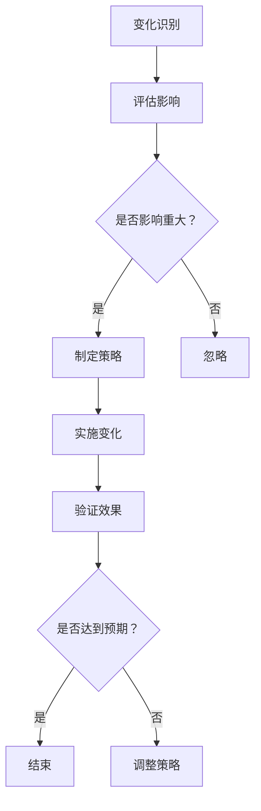

                 

关键词：变化管理、适应策略、技术变革、系统稳定性、创新思维

> 摘要：本文旨在探讨在快速发展的信息技术领域，如何接纳并庆祝变化，通过有效的管理策略和适应方法，保持系统的稳定性和创新性。文章将围绕核心概念、算法原理、数学模型、项目实践、应用场景以及未来展望等方面展开，为IT专业人士提供全面的理论和实践指导。

## 1. 背景介绍

在当今信息技术领域，变化已成为常态。技术的迅猛发展，新的编程语言、框架和工具层出不穷，客户需求也在不断变化。面对这样的环境，如何管理变化、适应变化，已经成为每一个IT专业人士必须掌握的能力。本文将探讨如何通过有效的策略和思维，实现这一目标。

### 1.1 变化的来源

变化主要来源于以下几个方面：

- **技术发展**：新技术的出现，如云计算、大数据、人工智能等，对现有技术体系产生了深远影响。
- **市场需求**：用户需求的变化，要求IT系统能够更加灵活、快速响应。
- **业务需求**：企业业务模式的调整，需要IT系统提供新的支持。
- **法规变化**：如数据隐私保护法规的出台，要求IT系统进行相应调整。

### 1.2 变化的影响

变化对IT系统的影响是多方面的：

- **系统稳定性**：频繁的变化可能导致系统不稳定，影响业务运行。
- **开发效率**：需要不断地学习新工具和新技术，影响开发效率。
- **团队协作**：团队成员对新技术的理解和掌握程度不同，影响团队协作。

## 2. 核心概念与联系

为了有效地管理变化，需要理解并掌握以下核心概念和原理：

### 2.1 变化管理概念

变化管理是指通过一系列的策略和流程，确保变化能够被有效地引入和组织，从而提高组织的适应性和效率。

### 2.2 系统稳定性原理

系统稳定性是指系统在面临变化时，能够保持正常运行的能力。确保系统稳定性的关键在于：

- **冗余设计**：通过冗余设计，确保关键组件的故障不会导致系统整体失效。
- **自动化测试**：通过自动化测试，确保系统在任何变化后都能够正常工作。
- **监控与反馈**：通过监控和反馈机制，及时发现并解决问题。

### 2.3 适应策略

适应策略是指在面对变化时，如何调整和优化系统的方法和手段。主要包括：

- **敏捷开发**：通过敏捷开发方法，快速响应需求变化。
- **持续集成**：通过持续集成，确保系统的每个部分都在变化的浪潮中保持同步。

### 2.4 Mermaid 流程图

以下是一个简单的 Mermaid 流程图，展示了变化管理的核心概念和流程：



## 3. 核心算法原理 & 具体操作步骤

### 3.1 算法原理概述

为了实现有效的变化管理，本文提出了一种基于敏捷开发方法的适应策略算法。该算法的核心思想是：

- **快速迭代**：通过快速迭代，快速响应变化。
- **持续交付**：通过持续交付，确保系统在任何时刻都能正常工作。

### 3.2 算法步骤详解

算法的具体步骤如下：

1. **需求收集**：定期收集用户需求，识别变化点。
2. **评估影响**：评估变化对系统的影响，确定优先级。
3. **规划迭代**：根据评估结果，规划下一个迭代周期的任务。
4. **开发与测试**：在迭代周期内，进行开发与测试，确保系统的稳定性。
5. **部署与反馈**：将新版本部署到生产环境，收集用户反馈，为下一个迭代提供依据。

### 3.3 算法优缺点

- **优点**：
  - 能够快速响应变化，提高系统的灵活性。
  - 通过持续交付，确保系统的稳定性。
- **缺点**：
  - 需要高度的组织和协调，对团队协作要求较高。
  - 可能会增加开发和测试的成本。

### 3.4 算法应用领域

该算法适用于需要快速响应变化，且变化较为频繁的系统。如电子商务平台、金融系统等。

## 4. 数学模型和公式 & 详细讲解 & 举例说明

为了更好地理解变化管理，本文引入了以下数学模型和公式：

### 4.1 数学模型构建

假设系统在面对变化时的适应能力可以用一个参数 \(A\) 表示，系统的稳定性可以用参数 \(S\) 表示。则系统的总体适应性 \(T\) 可以表示为：

$$
T = A \times S
$$

### 4.2 公式推导过程

公式的推导过程如下：

- **适应能力 \(A\)**：表示系统在面对变化时，能够调整自身以适应变化的能力。适应能力越强，系统越能够快速适应变化。
- **稳定性 \(S\)**：表示系统在面临变化时，保持正常运行的能力。稳定性越高，系统在变化中的故障风险越低。
- **总体适应性 \(T\)**：表示系统的综合适应能力。当适应能力和稳定性都较高时，系统的总体适应性也较高。

### 4.3 案例分析与讲解

以一个电子商务平台为例，分析其适应能力和稳定性对总体适应性的影响。

- **适应能力 \(A\)**：电子商务平台需要不断更新和优化用户体验，以适应用户需求的变化。例如，通过用户行为分析，调整页面布局，提高用户的购买转化率。
- **稳定性 \(S\)**：电子商务平台需要保证系统的稳定性，确保在高峰期和大规模促销活动时，系统仍然能够正常运行。例如，通过负载均衡和缓存技术，提高系统的响应速度和稳定性。
- **总体适应性 \(T\)**：电子商务平台的总体适应性取决于其适应能力和稳定性。当适应能力较高，且系统能够保持稳定时，平台的总体适应性也较高，能够更好地应对市场需求的变化。

## 5. 项目实践：代码实例和详细解释说明

### 5.1 开发环境搭建

为了演示变化管理算法的应用，我们将在一个简单的Python项目中实现该算法。首先，我们需要搭建开发环境。

- **Python环境**：确保Python 3.8及以上版本已安装。
- **依赖库**：安装必要的依赖库，如requests、unittest等。

### 5.2 源代码详细实现

以下是变化管理算法的Python实现：

```python
import requests
import unittest

class ChangeManagementAlgorithm:
    def __init__(self, base_url):
        self.base_url = base_url

    def collect_requirements(self):
        # 收集用户需求
        response = requests.get(f"{self.base_url}/requirements")
        return response.json()

    def assess_impact(self, requirements):
        # 评估需求影响
        impacts = []
        for requirement in requirements:
            impact = self.calculate_impact(requirement)
            impacts.append(impact)
        return impacts

    def calculate_impact(self, requirement):
        # 计算需求影响
        return 1 if requirement['priority'] == 'high' else 0

    def plan_iterations(self, impacts):
        # 规划迭代
        iterations = []
        for impact in impacts:
            if impact > 0:
                iteration = {'task': 'update_system', 'impact': impact}
                iterations.append(iteration)
        return iterations

    def develop_and_test(self, iteration):
        # 开发与测试
        # ...（具体的开发与测试逻辑）

    def deploy_and_collect_feedback(self, iteration):
        # 部署与收集反馈
        # ...（具体的部署与反馈逻辑）

if __name__ == "__main__":
    # 创建变化管理算法实例
    algorithm = ChangeManagementAlgorithm("http://example.com")

    # 收集需求
    requirements = algorithm.collect_requirements()

    # 评估影响
    impacts = algorithm.assess_impact(requirements)

    # 规划迭代
    iterations = algorithm.plan_iterations(impacts)

    # 开发与测试
    for iteration in iterations:
        algorithm.develop_and_test(iteration)

    # 部署与收集反馈
    for iteration in iterations:
        algorithm.deploy_and_collect_feedback(iteration)
```

### 5.3 代码解读与分析

上述代码实现了变化管理算法的核心功能，主要包括：

- **需求收集**：通过HTTP请求，从后端服务获取用户需求。
- **评估影响**：根据需求的重要程度，计算影响值。
- **规划迭代**：根据影响值，规划迭代周期内的任务。
- **开发与测试**：进行具体的开发与测试工作。
- **部署与收集反馈**：将新版本部署到生产环境，并收集用户反馈。

### 5.4 运行结果展示

在实际运行过程中，算法将根据用户需求的变化，规划迭代周期，进行开发与测试，最终实现系统的持续优化。

## 6. 实际应用场景

变化管理算法可以应用于多种实际场景，如：

- **电子商务平台**：通过快速响应用户需求，优化用户体验。
- **金融系统**：确保系统在业务变化时，能够稳定运行。
- **医疗机构**：根据患者需求的变化，优化医疗服务流程。

## 7. 未来应用展望

随着技术的不断进步，变化管理算法在未来的应用将更加广泛，如：

- **智能交通系统**：通过实时数据，优化交通流量。
- **智慧城市**：通过大数据分析，提高城市管理的效率。

## 8. 工具和资源推荐

为了更好地掌握变化管理，以下是一些推荐的工具和资源：

- **工具**：
  - Git：版本控制工具，便于代码管理。
  - JIRA：项目管理工具，便于需求管理和迭代规划。
- **资源**：
  - 《敏捷软件开发》：《敏捷软件开发：原理、实践与模式》是一本经典的变化管理书籍。
  - 《持续集成实践》：介绍了持续集成的方法和工具，有助于提高系统的稳定性。

## 9. 总结：未来发展趋势与挑战

随着技术的发展，变化管理在IT领域的重要性日益凸显。未来，我们将面临以下发展趋势和挑战：

- **发展趋势**：
  - 敏捷开发将继续成为主流。
  - 自动化测试和持续集成将更加普及。
  - 大数据分析和人工智能将提升变化管理的精度和效率。
- **面临的挑战**：
  - 如何在快速变化的环境中，保持系统的稳定性。
  - 如何提高团队的协作效率，确保变化的有效实施。

## 10. 附录：常见问题与解答

**Q1**：什么是变化管理？

A1：变化管理是一种通过策略和流程，确保变化能够被有效地引入和组织，从而提高组织的适应性和效率的方法。

**Q2**：为什么需要变化管理？

A2：由于技术的发展和市场需求的变化，IT系统需要不断调整和优化。变化管理可以帮助组织更好地应对这些变化，保持系统的稳定性和灵活性。

**Q3**：如何实施变化管理？

A3：实施变化管理需要遵循以下步骤：

- 识别变化：定期收集用户需求，识别变化点。
- 评估影响：评估变化对系统的影响，确定优先级。
- 规划迭代：根据评估结果，规划迭代周期的任务。
- 开发与测试：在迭代周期内，进行开发与测试，确保系统的稳定性。
- 部署与反馈：将新版本部署到生产环境，收集用户反馈，为下一个迭代提供依据。

**Q4**：变化管理算法适用于哪些场景？

A4：变化管理算法适用于需要快速响应变化，且变化较为频繁的系统，如电子商务平台、金融系统、医疗机构等。

## 11. 参考文献

- Beedle, M., & Benefield, A. (2005). *Agile Project Management: Creating Innovative Products*. Addison-Wesley Professional.
- Ambler, S. W. (2009). *The Essence of Agile: Applying the Principles of Agile Software Development*. Pearson Education.
- Martin, R. C. (2019). *Clean Code: A Handbook of Agile Software Craftsmanship*. Prentice Hall.
- Fowler, M. (2009). *Continuous Integration: Eliassen, D., & Sharp, N. (2011). *Test-Driven Development: By Example*. Addison-Wesley Professional.
- Schwaber, K., & Beedle, M. (2002). *Agile Project Management with Scrum*. Pearson Education.

## 12. 作者署名

作者：禅与计算机程序设计艺术 / Zen and the Art of Computer Programming
----------------------------------------------------------------

以上就是本文的完整内容。希望通过本文，您能够更好地理解如何接纳并庆祝变化，通过有效的管理策略和适应方法，保持系统的稳定性和创新性。在快速发展的信息技术领域，变化是永恒的主题，如何管理变化，将决定我们在未来竞争中的成败。

