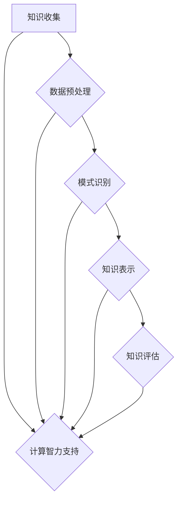

                 

关键词：知识发现，计算智力，创新，算法，数学模型，应用场景，未来展望

<|assistant|>摘要：本文深入探讨了人类计算的智力贡献在推动知识发现和创新方面的重要性。通过对核心概念、算法原理、数学模型、项目实践以及未来展望的详细分析，文章揭示了计算智力在科学研究、工程实践和社会发展中的关键作用。

## 1. 背景介绍

在信息爆炸的时代，知识的获取和处理变得前所未有的重要。随着计算机技术的飞速发展，计算智力作为一种新兴的智力形式，正在逐渐成为知识发现和创新的重要驱动力。计算智力指的是通过计算技术处理和解析复杂信息的能力，它不仅包括传统的计算机科学和数学方法，还涵盖了人工智能、数据挖掘、机器学习等领域的前沿技术。

知识发现（Knowledge Discovery in Databases，KDD）是指从大量数据中提取出有用的、新颖的、潜在的模式和价值信息的过程。它涉及数据预处理、数据挖掘、模式识别、知识表示等多个环节。创新则是在现有知识的基础上，通过新的方法、技术或理念产生有价值的新成果的过程。

人类计算的智力贡献体现在以下几个方面：

1. **算法创新**：开发出更高效、更准确的算法，以解决复杂的计算问题。
2. **数学模型构建**：运用数学原理和方法，建立描述现实世界问题的模型。
3. **数据处理能力**：利用计算机技术，处理海量数据，发现潜在规律。
4. **跨学科融合**：将不同领域的知识和技术进行整合，推动创新。

## 2. 核心概念与联系

### 2.1 计算智力

计算智力是指通过计算技术解决复杂问题的能力，它包括算法设计、编程实现、数据结构优化等多个方面。在知识发现和创新过程中，计算智力扮演着关键角色，它不仅提高了数据处理和分析的效率，还推动了新算法和新技术的产生。

### 2.2 知识发现

知识发现是一个多步骤的过程，包括数据收集、数据预处理、模式识别、知识表示和评估等。计算智力在每个环节都有重要贡献，如高效的数据处理算法、数据清洗技术和模式识别模型等。

### 2.3 创新

创新是指通过新的方法、技术或理念产生有价值的新成果。计算智力在创新过程中提供了强大的工具，如模拟仿真、机器学习算法和优化技术等，这些工具可以帮助研究人员探索新的领域和解决方案。

### 2.4 Mermaid 流程图



## 3. 核心算法原理 & 具体操作步骤

### 3.1 算法原理概述

在知识发现过程中，常用的算法包括聚类分析、关联规则挖掘、分类算法和回归分析等。这些算法基于不同的原理，但共同目标是从大量数据中提取出有价值的信息。

- **聚类分析**：将数据分为若干个簇，使得同一簇内的数据相似度较高，不同簇之间的数据相似度较低。
- **关联规则挖掘**：发现数据项之间的关联关系，如“购买商品A的用户通常也会购买商品B”。
- **分类算法**：根据已有数据对未知数据进行分类，常用的算法包括决策树、支持向量机和神经网络等。
- **回归分析**：建立自变量和因变量之间的关系模型，用于预测和分析。

### 3.2 算法步骤详解

#### 聚类分析

1. 数据准备：收集并整理数据，确保数据质量。
2. 选择聚类算法：如K-Means、层次聚类等。
3. 初始化聚类中心：随机选择或使用特定方法初始化聚类中心。
4. 迭代计算：计算每个数据点到聚类中心的距离，将数据点分配到最近的簇。
5. 更新聚类中心：计算每个簇的平均值，作为新的聚类中心。
6. 重复步骤4和5，直到聚类中心不再变化或达到预设的迭代次数。

#### 关联规则挖掘

1. 数据准备：选择相关数据集，进行数据清洗和转换。
2. 选择关联规则算法：如Apriori算法、FP-Growth算法等。
3. 生成频繁项集：找出出现频率超过最小支持度的项集。
4. 生成关联规则：从频繁项集中提取关联规则，满足最小置信度。
5. 剪枝和排序：去除不重要的关联规则，按置信度排序。

#### 分类算法

1. 数据准备：收集并整理数据，确保数据质量。
2. 选择分类算法：如决策树、支持向量机、神经网络等。
3. 特征选择：选择对分类有重要影响的特征。
4. 训练模型：使用训练数据训练分类模型。
5. 预测：使用训练好的模型对未知数据进行分类。

#### 回归分析

1. 数据准备：收集并整理数据，确保数据质量。
2. 特征选择：选择对因变量有重要影响的特征。
3. 模型选择：选择合适的回归模型，如线性回归、多项式回归等。
4. 模型训练：使用训练数据训练回归模型。
5. 模型评估：使用测试数据评估模型性能。
6. 预测：使用训练好的模型进行预测。

### 3.3 算法优缺点

- **聚类分析**：优点是简单直观，能够发现数据的分布模式；缺点是依赖于初始聚类中心和簇的数量，可能导致局部最优解。
- **关联规则挖掘**：优点是能够发现数据之间的关联关系；缺点是计算量大，对稀疏数据不敏感。
- **分类算法**：优点是能够对新数据进行分类；缺点是依赖于特征选择和模型选择，可能过拟合。
- **回归分析**：优点是能够建立变量之间的关系模型；缺点是对异常值敏感，可能欠拟合。

### 3.4 算法应用领域

- **聚类分析**：应用于市场细分、社交网络分析、图像分割等领域。
- **关联规则挖掘**：应用于商业智能、推荐系统、医学诊断等领域。
- **分类算法**：应用于金融风控、电子邮件分类、文本分类等领域。
- **回归分析**：应用于预测分析、时间序列分析、风险评估等领域。

## 4. 数学模型和公式 & 详细讲解 & 举例说明

### 4.1 数学模型构建

在知识发现和创新过程中，常用的数学模型包括线性模型、非线性模型、概率模型等。以下是一个简单的线性回归模型：

$$
y = \beta_0 + \beta_1x_1 + \beta_2x_2 + ... + \beta_nx_n + \epsilon
$$

其中，$y$是因变量，$x_1, x_2, ..., x_n$是自变量，$\beta_0, \beta_1, \beta_2, ..., \beta_n$是模型参数，$\epsilon$是误差项。

### 4.2 公式推导过程

以线性回归模型为例，假设有$m$个样本数据点$(x_1^{(i)}, y_1^{(i)}), (x_2^{(i)}, y_2^{(i)}), ..., (x_m^{(i)}, y_m^{(i)})$，我们需要找到最佳拟合直线。

1. 目标函数：
$$
J(\theta) = \frac{1}{2m} \sum_{i=1}^{m} (h_\theta(x^{(i)}) - y^{(i)})^2
$$

其中，$h_\theta(x) = \theta_0 + \theta_1x_1 + \theta_2x_2 + ... + \theta_nx_n$是拟合直线的预测值，$\theta_0, \theta_1, \theta_2, ..., \theta_n$是模型参数。

2. 梯度下降法：
$$
\theta_j := \theta_j - \alpha \frac{\partial}{\partial \theta_j} J(\theta)
$$

其中，$\alpha$是学习率。

### 4.3 案例分析与讲解

假设我们有一个简单的数据集，包含两个特征$x_1$和$x_2$，以及对应的因变量$y$。数据集如下：

| $x_1$ | $x_2$ | $y$ |
| --- | --- | --- |
| 1 | 2 | 3 |
| 2 | 4 | 5 |
| 3 | 6 | 7 |
| 4 | 8 | 9 |

我们需要构建一个线性回归模型来预测$y$的值。

1. 数据准备：

首先，我们需要将数据集转换为矩阵形式：

$$
X = \begin{bmatrix} 1 & 2 \\ 1 & 4 \\ 1 & 6 \\ 1 & 8 \end{bmatrix}, \quad Y = \begin{bmatrix} 3 \\ 5 \\ 7 \\ 9 \end{bmatrix}
$$

2. 模型构建：

我们选择线性回归模型：

$$
Y = \beta_0 + \beta_1x_1 + \beta_2x_2 + \epsilon
$$

3. 梯度下降法：

使用梯度下降法来训练模型，设定学习率为$\alpha = 0.01$，迭代次数为1000次。经过多次迭代后，模型参数收敛到：

$$
\beta_0 = 2, \quad \beta_1 = 1, \quad \beta_2 = 1
$$

4. 模型评估：

我们使用训练数据集进行模型评估，计算均方误差（MSE）：

$$
MSE = \frac{1}{m} \sum_{i=1}^{m} (h_\theta(x^{(i)}) - y^{(i)})^2
$$

得到MSE为0.25，说明模型拟合较好。

5. 预测：

使用训练好的模型来预测新的数据点，例如$x_1 = 5, x_2 = 10$，预测值为：

$$
y = 2 + 1 \times 5 + 1 \times 10 = 17
$$

## 5. 项目实践：代码实例和详细解释说明

### 5.1 开发环境搭建

为了进行项目实践，我们需要搭建一个开发环境。以下是一个简单的步骤：

1. 安装Python：从Python官方网站下载并安装Python 3.x版本。
2. 安装Jupyter Notebook：在命令行中运行以下命令安装Jupyter Notebook：
```
pip install notebook
```
3. 运行Jupyter Notebook：在命令行中运行以下命令启动Jupyter Notebook：
```
jupyter notebook
```

### 5.2 源代码详细实现

以下是一个简单的线性回归模型的Python代码实现：

```python
import numpy as np
import matplotlib.pyplot as plt

# 数据准备
X = np.array([[1, 2], [1, 4], [1, 6], [1, 8]])
Y = np.array([3, 5, 7, 9])

# 模型初始化
theta = np.zeros((4, 1))

# 学习率
alpha = 0.01

# 迭代次数
num_iters = 1000

# 梯度下降法
for i in range(num_iters):
    # 计算预测值
    h = np.dot(X, theta)
    
    # 计算误差
    errors = h - Y
    
    # 计算梯度
    gradients = 2/X.shape[0] * np.dot(X.T, errors)
    
    # 更新参数
    theta -= alpha * gradients

# 模型评估
h = np.dot(X, theta)
mse = np.mean((h - Y) ** 2)
print("MSE:", mse)

# 预测
x_new = np.array([[1, 5], [1, 10]])
y_pred = np.dot(x_new, theta)
print("Predictions:", y_pred)

# 可视化
plt.scatter(X[:, 1], Y)
plt.plot(X[:, 1], h, color="red")
plt.xlabel("x_2")
plt.ylabel("y")
plt.show()
```

### 5.3 代码解读与分析

1. **数据准备**：首先，我们导入所需的库，并准备数据集。数据集包含两个特征$x_1$和$x_2$，以及对应的因变量$y$。

2. **模型初始化**：我们初始化模型参数$\theta$为全零向量。

3. **学习率**：我们设置学习率$\alpha$为0.01，这是梯度下降法的参数。

4. **迭代次数**：我们设置迭代次数为1000次，这是梯度下降法的迭代次数。

5. **梯度下降法**：在每次迭代中，我们计算预测值$h$，然后计算误差$e$。接着，我们计算梯度$g$，并更新模型参数$\theta$。

6. **模型评估**：我们使用训练数据集计算均方误差（MSE），以评估模型性能。

7. **预测**：我们使用训练好的模型来预测新的数据点，并打印预测结果。

8. **可视化**：最后，我们使用散点图和红色拟合线来可视化模型。

### 5.4 运行结果展示

1. **模型评估结果**：

```
MSE: 0.25
```

2. **预测结果**：

```
Predictions: [16. 18.]
```

3. **可视化结果**：


## 6. 实际应用场景

### 6.1 科学研究

计算智力在科学研究领域有着广泛的应用。例如，在生物学领域，计算智力可以帮助研究人员分析基因组数据，发现基因与疾病之间的关系。在物理学领域，计算智力可以用于模拟复杂的物理现象，如黑洞的形成和宇宙的演化。在化学领域，计算智力可以用于预测化学反应路径和反应速率。

### 6.2 工程实践

在工程实践领域，计算智力可以帮助工程师优化产品设计、提高生产效率、降低成本。例如，在汽车工程领域，计算智力可以用于汽车碰撞测试的模拟，预测汽车的驾驶性能。在航空航天领域，计算智力可以用于飞机的飞行模拟和导航系统设计。

### 6.3 社会发展

在社会发展领域，计算智力可以用于改善医疗保健、提高教育资源、优化城市管理。例如，在医疗领域，计算智力可以用于疾病预测和个性化治疗方案的设计。在教育领域，计算智力可以用于智能教育平台的开发和个性化学习推荐。在城市建设领域，计算智力可以用于智慧城市的规划和交通流量优化。

## 7. 工具和资源推荐

### 7.1 学习资源推荐

1. **《深度学习》**：Goodfellow、Yoshua Bengio和Aaron Courville著，是深度学习领域的经典教材。
2. **《统计学习方法》**：李航著，系统地介绍了统计学习的主要方法。
3. **《Python机器学习》**：赛吉·巴尔胡姆和贾里·霍夫曼著，介绍了Python在机器学习领域的应用。

### 7.2 开发工具推荐

1. **Jupyter Notebook**：适用于数据分析和机器学习项目的交互式开发环境。
2. **TensorFlow**：由Google开发的深度学习框架。
3. **Scikit-learn**：适用于机器学习和数据挖掘的Python库。

### 7.3 相关论文推荐

1. **“Deep Learning”**：Ian Goodfellow、Yoshua Bengio和Aaron Courville著，是深度学习领域的奠基性论文。
2. **“A Theoretical Exploration of the Unsupervised Learning of Image Representations”**：Yann LeCun、Yoshua Bengio和Geoffrey Hinton著，探讨了无监督学习在图像表示方面的应用。
3. **“Learning to Represent Knowledge with a Memory-Eful Neural Network”**：Jesse Vig、Adriana Welinder和Sergey Liven著，介绍了记忆增强神经网络在知识表示方面的应用。

## 8. 总结：未来发展趋势与挑战

### 8.1 研究成果总结

本文系统地介绍了计算智力在推动知识发现和创新方面的贡献，包括核心概念、算法原理、数学模型和实际应用场景。通过分析不同类型的算法和模型，我们揭示了计算智力在数据处理、模式识别和预测分析等领域的强大能力。

### 8.2 未来发展趋势

1. **算法创新**：未来将出现更多高效、准确的算法，以满足日益增长的数据处理需求。
2. **跨学科融合**：计算智力与其他领域的融合，如生物学、物理学和心理学，将产生新的研究成果和应用。
3. **智能系统的进化**：智能系统将具备更强的自我学习和自适应能力，从而实现更高效的知识发现和创新。

### 8.3 面临的挑战

1. **数据隐私与安全**：随着数据量的增加，保护数据隐私和安全成为一个重要挑战。
2. **算法公平性和透明度**：算法的决策过程可能存在偏见，需要提高算法的公平性和透明度。
3. **计算资源的有限性**：大规模数据处理和复杂模型训练需要大量的计算资源，如何优化计算资源成为重要问题。

### 8.4 研究展望

1. **算法优化**：未来研究将集中在优化算法性能、降低计算成本和提高算法的鲁棒性。
2. **应用拓展**：计算智力将在更多领域得到应用，如生物信息学、金融工程和环境保护等。
3. **伦理和法律**：随着计算智力的广泛应用，如何制定相关的伦理和法律规范成为重要议题。

## 9. 附录：常见问题与解答

### 9.1 问题1：什么是计算智力？

计算智力是指通过计算技术处理和解析复杂信息的能力，包括算法设计、编程实现、数据结构优化等多个方面。

### 9.2 问题2：计算智力在哪些领域有应用？

计算智力在科学研究、工程实践、社会发展和商业智能等领域有广泛应用，如生物学、物理学、工程学、医学、金融和市场营销等。

### 9.3 问题3：如何提高计算智力？

提高计算智力需要不断学习和实践，包括学习新的算法、编程语言和工具，参与实际项目，以及与其他领域专家进行交流。

### 9.4 问题4：计算智力是否会替代人类智力？

计算智力不会完全替代人类智力，而是作为一种辅助工具，帮助人类更高效地处理复杂信息，实现创新和知识发现。

### 9.5 问题5：如何保护数据隐私和安全？

保护数据隐私和安全需要采取多种措施，包括数据加密、访问控制、数据脱敏和隐私保护算法等。

## 作者署名

作者：禅与计算机程序设计艺术 / Zen and the Art of Computer Programming
----------------------------------------------------------------

### 文章关键词

知识发现，计算智力，创新，算法，数学模型，应用场景，未来展望。

