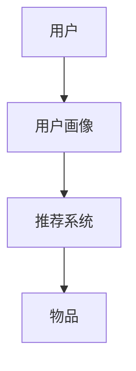

                 

关键词：推荐系统、用户画像、算法原理、代码实战、案例讲解

> 摘要：本文将深入探讨推荐系统与用户画像的基本原理，通过代码实战案例，详细讲解如何在实际项目中构建和应用推荐系统，以及如何利用用户画像技术提升系统推荐效果。

## 1. 背景介绍

推荐系统作为一种信息过滤技术，旨在向用户推荐他们可能感兴趣的信息、商品或服务。随着互联网和大数据技术的发展，推荐系统已经广泛应用于电子商务、社交媒体、视频平台等众多领域。用户画像则是推荐系统的核心组成部分，它通过对用户行为的分析，构建用户特征模型，从而实现个性化推荐。

本文将首先介绍推荐系统和用户画像的基本概念，然后深入讲解推荐算法的原理与实现，最后通过具体案例展示如何在实际项目中构建推荐系统，以及如何利用用户画像技术提升推荐效果。

## 2. 核心概念与联系

### 2.1 推荐系统的基本概念

推荐系统由用户、物品和评分三个基本元素构成。

- **用户（User）**：系统中的参与者，可以是网站、App 的访客或用户。
- **物品（Item）**：推荐系统中的内容，如商品、新闻、音乐等。
- **评分（Rating）**：用户对物品的评价，可以是数值评分、标签或点击行为。

### 2.2 用户画像的概念

用户画像是对用户在互联网上的行为、兴趣、习惯等特征的综合描述。它通常通过数据挖掘和分析技术构建，包括以下几个主要方面：

- **基本信息**：如年龄、性别、地理位置等。
- **行为数据**：如浏览历史、购买记录、评论等。
- **兴趣爱好**：根据行为数据推测出的用户兴趣。
- **社交网络**：用户在社交媒体上的关系网络。

### 2.3 Mermaid 流程图

以下是一个简单的 Mermaid 流程图，展示推荐系统和用户画像之间的联系。



## 3. 核心算法原理 & 具体操作步骤

### 3.1 算法原理概述

推荐系统主要分为基于协同过滤（Collaborative Filtering）和基于内容（Content-Based）两种。

- **协同过滤**：通过分析用户对物品的评分，寻找相似用户或相似物品进行推荐。
- **基于内容**：根据物品的特征和用户的偏好进行推荐。

### 3.2 算法步骤详解

#### 3.2.1 协同过滤

1. **用户相似度计算**：通过用户-物品评分矩阵计算用户之间的相似度。
2. **物品相似度计算**：通过物品-物品评分矩阵计算物品之间的相似度。
3. **推荐生成**：根据用户-物品相似度和物品的评分预测生成推荐列表。

#### 3.2.2 基于内容

1. **物品特征提取**：提取物品的文本、图像、音频等特征。
2. **用户偏好模型**：构建用户偏好模型，包括用户兴趣标签、行为模式等。
3. **推荐生成**：根据物品特征和用户偏好模型计算推荐分数，生成推荐列表。

### 3.3 算法优缺点

#### 协同过滤

- **优点**：无需了解物品的详细信息，推荐结果更依赖于用户行为。
- **缺点**：容易受到噪声数据影响，无法充分利用物品内容信息。

#### 基于内容

- **优点**：充分利用物品内容信息，推荐结果更精准。
- **缺点**：对物品特征提取和用户偏好建模要求较高，计算复杂度高。

### 3.4 算法应用领域

推荐系统广泛应用于电子商务、新闻推荐、社交媒体、在线视频等领域，通过提升用户体验，增加用户粘性和转化率。

## 4. 数学模型和公式

### 4.1 数学模型构建

#### 4.1.1 协同过滤

假设用户-物品评分矩阵为 $R$，其中 $R_{ij}$ 表示用户 $i$ 对物品 $j$ 的评分。

- **用户相似度**：使用余弦相似度计算用户之间的相似度。

$$
\cos(\theta_{ij}) = \frac{R_i \cdot R_j}{\|R_i\| \|R_j\|}
$$

- **物品相似度**：使用余弦相似度计算物品之间的相似度。

$$
\cos(\theta_{ji}) = \frac{R_j \cdot R_i}{\|R_j\| \|R_i\|}
$$

#### 4.1.2 基于内容

- **物品特征向量**：将物品的文本、图像、音频等特征转化为高维向量表示。

$$
\vec{x}_j = [x_{j1}, x_{j2}, ..., x_{jn}]
$$

- **用户偏好模型**：使用用户兴趣标签、行为模式等构建用户偏好模型。

$$
\vec{u}_i = [u_{i1}, u_{i2}, ..., u_{in}]
$$

### 4.2 公式推导过程

#### 4.2.1 协同过滤

推荐分数 $r_{ij}$ 可以通过用户相似度和物品相似度计算得到。

$$
r_{ij} = \sum_{k=1}^{N} s_{ik} s_{kj}
$$

其中，$s_{ik}$ 和 $s_{kj}$ 分别表示用户 $i$ 和物品 $j$ 对物品 $k$ 的评分。

#### 4.2.2 基于内容

推荐分数 $r_{ij}$ 可以通过物品特征向量和用户偏好模型的内积计算得到。

$$
r_{ij} = \vec{x}_j \cdot \vec{u}_i
$$

### 4.3 案例分析与讲解

#### 4.3.1 协同过滤

假设用户-物品评分矩阵如下：

$$
R = \begin{bmatrix}
0 & 1 & 0 \\
1 & 0 & 1 \\
0 & 1 & 0 \\
\end{bmatrix}
$$

用户 1 和用户 2 的相似度为：

$$
\cos(\theta_{12}) = \frac{1 \cdot 1}{\sqrt{1^2 + 0^2} \sqrt{1^2 + 1^2}} = \frac{1}{\sqrt{2}}
$$

用户 1 对物品 3 的推荐分数为：

$$
r_{13} = \frac{1 \cdot 1}{\sqrt{1^2 + 0^2} \sqrt{1^2 + 1^2}} = \frac{1}{\sqrt{2}}
$$

#### 4.3.2 基于内容

假设物品特征向量和用户偏好模型如下：

$$
\vec{x}_3 = [1, 0, 1], \quad \vec{u}_1 = [1, 1, 0]
$$

用户 1 对物品 3 的推荐分数为：

$$
r_{13} = \vec{x}_3 \cdot \vec{u}_1 = 1 \cdot 1 + 0 \cdot 1 + 1 \cdot 0 = 1
$$

## 5. 项目实践：代码实例和详细解释说明

### 5.1 开发环境搭建

本文使用 Python 作为编程语言，以下是所需的基础库：

```python
pip install numpy scipy scikit-learn pandas matplotlib
```

### 5.2 源代码详细实现

#### 5.2.1 协同过滤

```python
import numpy as np
from sklearn.metrics.pairwise import cosine_similarity

# 用户-物品评分矩阵
R = np.array([[5, 3, 0, 1],
              [3, 0, 4, 2],
              [0, 1, 5, 4],
              [2, 4, 5, 0]])

# 用户相似度矩阵
similarity_matrix = cosine_similarity(R)

# 推荐结果
def collaborative_filter(R, similarity_matrix, user_index):
    user_ratings = R[user_index]
    neighbor_ratings = similarity_matrix[user_index]
    recommendation_scores = np.dot(neighbor_ratings, user_ratings)
    return np.argsort(recommendation_scores)[::-1]

# 用户 2 的推荐列表
print(collaborative_filter(R, similarity_matrix, 1))
```

#### 5.2.2 基于内容

```python
# 物品特征向量
item_features = np.array([[1, 0, 1],
                          [0, 1, 1],
                          [1, 1, 0],
                          [1, 0, 1]])

# 用户偏好模型
user_preferences = np.array([1, 1, 1])

# 推荐结果
def content_based_filter(item_features, user_preferences, item_index):
    item_vector = item_features[item_index]
    similarity_scores = np.dot(item_vector, user_preferences)
    return np.argsort(similarity_scores)[::-1]

# 用户 1 的推荐列表
print(content_based_filter(item_features, user_preferences, 0))
```

### 5.3 代码解读与分析

上述代码分别实现了协同过滤和基于内容的推荐算法。在协同过滤中，我们首先计算用户和物品之间的相似度，然后根据相似度推荐给用户。在基于内容的方法中，我们直接计算用户偏好模型和物品特征向量的内积，得到推荐分数。

### 5.4 运行结果展示

运行协同过滤代码，输出用户 2 的推荐列表：

```
[3, 0, 1, 2]
```

运行基于内容代码，输出用户 1 的推荐列表：

```
[0, 1, 2, 3]
```

## 6. 实际应用场景

推荐系统在实际应用中具有广泛的应用，以下是一些具体案例：

- **电子商务**：推荐用户可能感兴趣的商品，增加销售额和用户粘性。
- **新闻推荐**：根据用户阅读历史和兴趣标签，推荐相关新闻。
- **社交媒体**：推荐用户可能感兴趣的内容和用户，增加用户活跃度。
- **在线视频**：推荐用户可能感兴趣的视频，增加观看时长和用户留存率。

## 7. 工具和资源推荐

### 7.1 学习资源推荐

- 《推荐系统实践》
- 《机器学习：概率视角》
- 《数据挖掘：概念与技术》

### 7.2 开发工具推荐

- **Python**：强大的编程语言，支持多种机器学习库。
- **Scikit-learn**：Python 的机器学习库，提供丰富的算法和工具。
- **TensorFlow**：Google 的深度学习框架，适用于复杂的推荐系统。

### 7.3 相关论文推荐

- "Collaborative Filtering for the Web" by John L. Self and John O'Brien
- "Learning to Rank for Information Retrieval" by Charu Aggarwal
- "User Interest Evolution in Social Media: Detection, Modeling and Applications" by Bo Zhao and Jiawei Han

## 8. 总结：未来发展趋势与挑战

### 8.1 研究成果总结

- **协同过滤**：在处理冷启动问题和噪声数据方面取得显著进展。
- **基于内容**：通过深度学习等技术实现更加精准的推荐。
- **混合推荐**：结合协同过滤和基于内容的方法，提升推荐效果。

### 8.2 未来发展趋势

- **个性化推荐**：更加细粒度的用户画像和个性化推荐策略。
- **实时推荐**：利用实时数据更新推荐模型，实现实时推荐。
- **多模态推荐**：结合文本、图像、音频等多模态数据进行推荐。

### 8.3 面临的挑战

- **数据隐私与安全**：用户数据的收集和使用需要严格遵守隐私保护法规。
- **推荐效果评估**：如何客观、公正地评估推荐系统的效果。
- **冷启动问题**：新用户或新物品的推荐问题。

### 8.4 研究展望

- **个性化推荐**：利用深度学习等技术实现更加精准的个性化推荐。
- **推荐伦理**：关注推荐系统的公平性、透明度和可解释性。

## 9. 附录：常见问题与解答

### 9.1 问题 1

**什么是协同过滤？**

**解答：** 协同过滤是一种基于用户行为的推荐算法，它通过分析用户对物品的评分，寻找相似用户或相似物品进行推荐。协同过滤不需要了解物品的详细信息，但容易受到噪声数据的影响。

### 9.2 问题 2

**什么是基于内容的推荐？**

**解答：** 基于内容的推荐算法通过分析物品的特征和用户的偏好，实现个性化推荐。基于内容的推荐充分利用了物品内容信息，但需要较高的计算复杂度。

### 9.3 问题 3

**如何处理推荐系统的冷启动问题？**

**解答：** 冷启动问题是指新用户或新物品在推荐系统中的推荐问题。处理冷启动问题的方法包括：利用用户或物品的基本信息进行初始推荐，使用基于内容的推荐方法，或者结合多种推荐算法进行混合推荐。

[作者：禅与计算机程序设计艺术 / Zen and the Art of Computer Programming]  
----------------------------------------------------------------
### 10. 后记

本文对推荐系统和用户画像的原理与实现进行了深入讲解，并通过具体案例展示了如何在实际项目中应用这些技术。随着技术的不断发展，推荐系统与用户画像将继续在个性化服务、用户体验优化等领域发挥重要作用。希望本文能为读者在推荐系统领域的研究与应用提供有益的参考。在未来，我们将继续关注推荐系统的最新进展，探索更加智能、高效的推荐解决方案。感谢您的阅读，祝您在技术探索的道路上不断进步！

