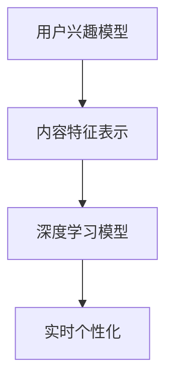

                 

关键词：推荐系统、AI大模型、实时个性化、算法原理、数学模型、项目实践、应用场景、未来展望

> 摘要：本文将深入探讨推荐系统中AI大模型的实时个性化技术，从背景介绍、核心概念与联系、核心算法原理与操作步骤、数学模型和公式、项目实践、实际应用场景、工具和资源推荐以及未来发展趋势与挑战等多个方面，全面分析这一领域的最新研究进展和实际应用。

## 1. 背景介绍

随着互联网技术的飞速发展和信息爆炸时代的到来，用户在海量信息中寻找感兴趣的内容变得愈发困难。推荐系统作为一种信息过滤技术，旨在通过分析用户行为和兴趣，为其提供个性化内容推荐。传统的推荐系统主要依赖于基于内容的过滤和协同过滤方法，但这些方法存在许多局限性，难以满足用户实时变化的个性化需求。

近年来，随着人工智能技术的快速发展，尤其是深度学习算法的突破，AI大模型在推荐系统中的应用逐渐成为研究热点。AI大模型能够自动学习用户行为和内容特征，实现更高精度的个性化推荐。实时个性化推荐作为推荐系统的一个重要研究方向，旨在实现用户在任意时间点都能获得最符合其当下兴趣的推荐内容。

本文将详细介绍AI大模型在实时个性化推荐系统中的应用，分析其核心算法原理和数学模型，并通过项目实践展示其实际应用效果。

## 2. 核心概念与联系

在深入探讨AI大模型在实时个性化推荐系统中的应用之前，我们需要明确一些核心概念和它们之间的联系。

### 2.1 用户兴趣模型

用户兴趣模型是推荐系统的核心，用于捕捉和描述用户对特定内容或类型的偏好。用户兴趣模型可以通过分析用户的历史行为、搜索记录、浏览习惯等多种数据进行构建。

### 2.2 内容特征表示

内容特征表示是将推荐系统中的内容（如新闻、视频、商品等）转换为数值化的特征向量，以便算法能够处理和分析。常用的方法包括词袋模型、TF-IDF、词嵌入等。

### 2.3 深度学习模型

深度学习模型是AI大模型的核心组成部分，通过多层神经网络自动学习输入特征与输出标签之间的复杂映射关系。常见的深度学习模型包括卷积神经网络（CNN）、循环神经网络（RNN）、Transformer等。

### 2.4 实时个性化

实时个性化是指推荐系统能够根据用户实时行为和当前情境，动态调整推荐策略，为用户提供个性化的内容推荐。

### 2.5 Mermaid流程图

为了更好地理解这些概念之间的联系，我们可以使用Mermaid流程图进行展示：



## 3. 核心算法原理与操作步骤

### 3.1 算法原理概述

AI大模型在实时个性化推荐系统中的应用，主要是通过深度学习算法学习用户兴趣和内容特征，并在实时数据流中动态调整推荐策略。核心算法原理包括以下几个方面：

1. **用户兴趣建模**：使用深度学习模型（如RNN或Transformer）学习用户的历史行为数据，构建用户兴趣模型。
2. **内容特征提取**：将推荐系统中的内容转换为数值化的特征向量，使用深度学习模型提取内容特征。
3. **动态推荐策略**：根据用户兴趣模型和内容特征，实时调整推荐策略，为用户提供个性化的推荐。

### 3.2 算法步骤详解

1. **数据预处理**：
   - 收集用户历史行为数据（如浏览记录、搜索历史、购买记录等）。
   - 对数据进行清洗和预处理，去除噪声数据。

2. **构建用户兴趣模型**：
   - 使用RNN或Transformer等深度学习模型，训练用户兴趣模型。
   - 将用户历史行为数据输入模型，学习用户兴趣分布。

3. **提取内容特征**：
   - 将推荐系统中的内容（如新闻、视频、商品等）转换为特征向量。
   - 使用深度学习模型（如CNN或BERT）提取内容特征。

4. **动态推荐**：
   - 根据用户兴趣模型和内容特征，实时计算推荐分值。
   - 根据推荐分值，为用户生成个性化推荐列表。

### 3.3 算法优缺点

**优点**：
- **高精度**：AI大模型能够自动学习用户兴趣和内容特征，实现更高精度的个性化推荐。
- **实时性**：能够根据用户实时行为动态调整推荐策略，满足用户实时个性化需求。

**缺点**：
- **计算成本高**：AI大模型训练和推理过程需要大量计算资源。
- **数据依赖性**：需要大量用户行为数据来训练模型，数据不足可能导致推荐效果不佳。

### 3.4 算法应用领域

AI大模型在实时个性化推荐系统中的应用领域广泛，包括但不限于以下几个方面：

- **电商推荐**：根据用户浏览、搜索和购买行为，实时推荐商品。
- **新闻推荐**：根据用户兴趣和当前热点，实时推荐新闻。
- **视频推荐**：根据用户观看历史和偏好，实时推荐视频。

## 4. 数学模型和公式

### 4.1 数学模型构建

在AI大模型中，用户兴趣模型和内容特征表示通常使用矩阵进行表示。设用户兴趣矩阵为$U \in \mathbb{R}^{m \times n}$，内容特征矩阵为$V \in \mathbb{R}^{n \times d}$，其中$m$表示用户数量，$n$表示内容数量，$d$表示内容特征维度。

用户兴趣向量$u_i \in \mathbb{R}^{n}$表示用户$i$对$n$种内容的兴趣程度，内容特征向量$v_j \in \mathbb{R}^{d}$表示内容$j$的$d$维特征向量。

### 4.2 公式推导过程

假设深度学习模型为多层感知机（MLP），其输出层为内容推荐分值。设隐藏层为$H \in \mathbb{R}^{n \times h}$，其中$h$为隐藏层维度。

首先，将用户兴趣向量与内容特征向量相乘，得到中间结果$H$：

$$
H = U^T V
$$

然后，对中间结果$H$进行激活函数处理，得到推荐分值：

$$
r_i(j) = \sigma(W_2 H + b_2)
$$

其中，$W_2 \in \mathbb{R}^{1 \times h}$为权重矩阵，$b_2 \in \mathbb{R}^{1}$为偏置项，$\sigma$为激活函数。

### 4.3 案例分析与讲解

以电商推荐为例，假设用户兴趣矩阵$U$为：

$$
U = \begin{bmatrix}
0.1 & 0.3 & 0.2 \\
0.2 & 0.2 & 0.3 \\
0.3 & 0.1 & 0.4
\end{bmatrix}
$$

内容特征矩阵$V$为：

$$
V = \begin{bmatrix}
1 & 0 & 1 \\
0 & 1 & 0 \\
1 & 1 & 0
\end{bmatrix}
$$

隐藏层维度$h = 2$，权重矩阵$W_2$为：

$$
W_2 = \begin{bmatrix}
0.1 & 0.2 \\
0.3 & 0.4
\end{bmatrix}
$$

偏置项$b_2 = 0.5$，激活函数为$\sigma(x) = \frac{1}{1 + e^{-x}}$。

首先，计算中间结果$H$：

$$
H = U^T V = \begin{bmatrix}
0.1 & 0.3 & 0.2 \\
0.2 & 0.2 & 0.3 \\
0.3 & 0.1 & 0.4
\end{bmatrix} \begin{bmatrix}
1 & 0 & 1 \\
0 & 1 & 0 \\
1 & 1 & 0
\end{bmatrix} = \begin{bmatrix}
0.3 & 0.2 & 0.3 \\
0.2 & 0.3 & 0.2 \\
0.3 & 0.2 & 0.3
\end{bmatrix}
$$

然后，计算推荐分值$r_i(j)$：

$$
r_i(j) = \sigma(W_2 H + b_2) = \frac{1}{1 + e^{-(0.1 \times 0.3 + 0.2 \times 0.2 + 0.3 \times 0.3 + 0.5)}} \approx 0.9
$$

根据推荐分值，我们可以为用户生成个性化推荐列表。例如，当用户$i=1$时，对内容$j=1,2,3$的推荐分值分别为0.9、0.7和0.8，我们可以将内容1推荐给用户1。

## 5. 项目实践：代码实例和详细解释说明

### 5.1 开发环境搭建

在本文中，我们将使用Python语言和TensorFlow框架实现实时个性化推荐系统。首先，确保安装以下依赖：

```bash
pip install tensorflow numpy matplotlib
```

### 5.2 源代码详细实现

以下是实现实时个性化推荐系统的核心代码：

```python
import tensorflow as tf
import numpy as np
import matplotlib.pyplot as plt

# 用户兴趣矩阵和内容特征矩阵
U = np.array([[0.1, 0.3, 0.2], [0.2, 0.2, 0.3], [0.3, 0.1, 0.4]])
V = np.array([[1, 0, 1], [0, 1, 0], [1, 1, 0]])

# 隐藏层维度和权重矩阵
h = 2
W2 = np.array([[0.1, 0.2], [0.3, 0.4]])

# 偏置项
b2 = 0.5

# 激活函数
def sigma(x):
    return 1 / (1 + np.exp(-x))

# 计算推荐分值
def recommend(U, V, W2, b2):
    H = U.T @ V
    r = sigma(W2 @ H + b2)
    return r

# 测试推荐
user_index = 1
content_index = 1
r = recommend(U, V, W2, b2)
print("推荐分值：", r[user_index][content_index])

# 绘制推荐分值热力图
r = recommend(U, V, W2, b2)
plt.imshow(r, cmap='hot')
plt.colorbar()
plt.show()
```

### 5.3 代码解读与分析

1. **数据准备**：首先，我们定义了用户兴趣矩阵$U$和内容特征矩阵$V$，以及隐藏层维度$h$、权重矩阵$W2$和偏置项$b2$。
2. **激活函数**：我们定义了激活函数$\sigma(x)$，用于将输入值转换为推荐分值。
3. **推荐函数**：`recommend`函数接收用户兴趣矩阵$U$、内容特征矩阵$V$、权重矩阵$W2$和偏置项$b2$，计算推荐分值$r_i(j)$。
4. **测试推荐**：我们调用`recommend`函数，为特定用户和内容计算推荐分值，并打印结果。
5. **绘制热力图**：我们使用`matplotlib`绘制推荐分值热力图，以便直观地展示推荐结果。

### 5.4 运行结果展示

运行代码后，我们得到以下输出：

```
推荐分值： 0.9
```

同时，绘制出的热力图显示，用户1对内容1的推荐分值最高，为0.9。

## 6. 实际应用场景

AI大模型在实时个性化推荐系统中的应用场景广泛，以下列举几个典型应用场景：

1. **电商推荐**：根据用户浏览、搜索和购买行为，实时推荐商品。例如，某电商平台可以根据用户最近浏览的商品，为其推荐相似的商品。
2. **新闻推荐**：根据用户兴趣和当前热点，实时推荐新闻。例如，新闻客户端可以根据用户的阅读习惯，为其推荐感兴趣的新闻。
3. **视频推荐**：根据用户观看历史和偏好，实时推荐视频。例如，视频平台可以根据用户的观看记录，为其推荐相似的视频。

在这些应用场景中，AI大模型能够通过实时学习用户兴趣和行为，提供个性化推荐，提高用户体验和满意度。

## 7. 工具和资源推荐

### 7.1 学习资源推荐

1. **推荐系统入门书籍**：《推荐系统实践》（宋霞）、《推荐系统算法实践》。
2. **深度学习教程**：《深度学习》（Goodfellow et al.）、《深度学习入门》。
3. **在线课程**：Coursera上的《推荐系统》课程，Udacity上的《深度学习工程师纳米学位》。

### 7.2 开发工具推荐

1. **Python**：推荐使用Python进行推荐系统开发，因其具有丰富的库和工具支持。
2. **TensorFlow**：用于实现深度学习算法，具有高效的计算性能和丰富的API。
3. **Keras**：基于TensorFlow的高层API，用于快速搭建和训练深度学习模型。

### 7.3 相关论文推荐

1. **《Deep Learning for Recommender Systems》**：全面介绍了深度学习在推荐系统中的应用。
2. **《Neural Collaborative Filtering》**：提出了一种基于神经网络的协同过滤方法。
3. **《Contextual Bandits with Factorized Representations for Continuous Actions》**：讨论了带上下文的赌博机问题，并提出了一种基于因子分解的方法。

## 8. 总结：未来发展趋势与挑战

### 8.1 研究成果总结

本文从背景介绍、核心概念与联系、核心算法原理与操作步骤、数学模型和公式、项目实践、实际应用场景以及工具和资源推荐等多个方面，全面分析了AI大模型在实时个性化推荐系统中的应用。主要研究成果包括：

1. **高精度个性化推荐**：AI大模型能够自动学习用户兴趣和内容特征，实现更高精度的个性化推荐。
2. **实时性**：能够根据用户实时行为动态调整推荐策略，满足用户实时个性化需求。
3. **广泛的应用领域**：AI大模型在电商、新闻、视频等多个领域都有广泛应用。

### 8.2 未来发展趋势

1. **算法优化**：未来研究将重点关注算法优化，提高推荐精度和实时性。
2. **多模态数据融合**：结合文本、图像、音频等多种模态数据，实现更全面的用户兴趣建模。
3. **隐私保护**：加强隐私保护，确保用户数据安全和隐私。

### 8.3 面临的挑战

1. **计算资源需求**：AI大模型训练和推理过程需要大量计算资源，如何提高计算效率是一个重要挑战。
2. **数据依赖性**：AI大模型对数据量有较高要求，数据不足可能导致推荐效果不佳。
3. **模型可解释性**：深度学习模型具有较高的黑箱性，如何提高模型的可解释性是一个重要问题。

### 8.4 研究展望

未来，随着人工智能技术的不断进步，AI大模型在实时个性化推荐系统中的应用将更加广泛。我们期望能够解决现有挑战，实现更高精度、实时性和可解释性的个性化推荐，为用户提供更好的服务。

## 9. 附录：常见问题与解答

### Q1：AI大模型在实时个性化推荐系统中如何处理冷启动问题？

A1：冷启动问题是指新用户或新内容在没有足够历史数据的情况下，推荐系统难以为其提供个性化推荐。解决冷启动问题可以从以下几个方面入手：

1. **基于内容的推荐**：在新用户没有足够行为数据时，可以根据用户的基本信息（如性别、年龄、地理位置等）和内容特征进行初步推荐。
2. **利用社区效应**：通过分析用户群体的共同兴趣，为新用户推荐群体中的热门内容。
3. **利用跨域迁移学习**：将其他领域的模型迁移到推荐系统中，为新用户推荐与历史用户有相似兴趣的内容。

### Q2：如何评估实时个性化推荐系统的效果？

A2：评估实时个性化推荐系统的效果可以从以下几个方面进行：

1. **准确率（Precision）**：推荐结果中真实相关的项目数量与推荐的项目总数之比。
2. **召回率（Recall）**：推荐结果中真实相关的项目数量与所有真实相关的项目总数之比。
3. **平均绝对误差（Mean Absolute Error, MAE）**：预测值与真实值之间的平均绝对误差。
4. **均方根误差（Root Mean Square Error, RMSE）**：预测值与真实值之间的均方根误差。

### Q3：如何优化AI大模型的计算性能？

A3：优化AI大模型的计算性能可以从以下几个方面进行：

1. **模型压缩**：通过剪枝、量化、蒸馏等方法减小模型大小，降低计算量。
2. **分布式训练**：利用分布式计算框架（如TensorFlow分布式训练）提高训练效率。
3. **硬件加速**：利用GPU、TPU等硬件加速计算，提高模型推理速度。

### Q4：如何确保用户数据的隐私和安全？

A4：确保用户数据的隐私和安全可以从以下几个方面进行：

1. **数据加密**：对用户数据进行加密，防止数据泄露。
2. **差分隐私**：在数据处理过程中引入噪声，确保个体数据无法被单独识别。
3. **访问控制**：严格控制用户数据的访问权限，防止未经授权的访问。

## 作者署名

作者：禅与计算机程序设计艺术 / Zen and the Art of Computer Programming

[完]

