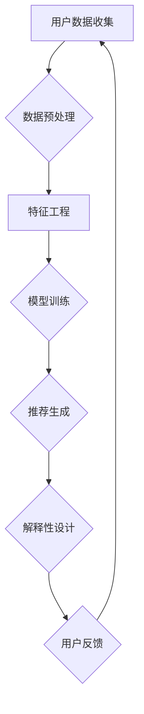

                 

关键词：推荐系统，AI大模型，解释性设计，用户理解，算法透明性

> 摘要：本文探讨了在推荐系统中引入大模型进行解释性设计的必要性。通过对推荐系统背景、AI大模型核心原理、解释性设计策略的深入分析，文章揭示了如何通过提升算法透明性和用户理解，实现更高效、更公平的推荐系统。

## 1. 背景介绍

随着互联网和大数据技术的发展，推荐系统已成为现代信息社会中不可或缺的一部分。从电子商务平台到社交媒体，从在线新闻阅读到音乐视频流媒体，推荐系统无处不在，极大地提高了用户体验和内容分发效率。然而，推荐系统的复杂性和黑盒性质，使得用户难以理解其推荐结果，进而影响了用户信任度和满意度。

传统的推荐系统依赖于特征工程和基于机器学习的算法，这些方法虽然能够取得较高的准确性和覆盖率，但往往缺乏解释性。用户无法直观地了解推荐结果背后的原因，可能导致对系统的疑虑和不满。因此，近年来，越来越多的研究开始关注如何提高推荐系统的解释性，使得用户能够更好地理解推荐结果。

在AI领域，尤其是深度学习技术的发展，大模型的出现为推荐系统带来了新的机遇和挑战。AI大模型，如Transformer、BERT等，通过大规模数据和参数训练，能够捕捉复杂的关系和模式，显著提高了推荐系统的性能。然而，这些大模型的黑盒性质同样带来了解释性的问题。

本文旨在探讨如何在推荐系统中引入AI大模型的同时，实现有效的解释性设计，以提升用户理解、增强算法透明性，从而构建更高效、更公平的推荐系统。

## 2. 核心概念与联系

### 2.1 推荐系统概述

推荐系统是一种信息过滤技术，旨在根据用户的兴趣和行为，向其推荐可能感兴趣的内容。传统的推荐系统主要依赖于基于内容的过滤、协同过滤和基于模型的推荐方法。这些方法通过分析用户的历史数据和内容特征，预测用户对未知内容的兴趣。

推荐系统的核心概念包括用户、项目和评分。用户是指推荐系统的目标受众，项目是指推荐系统中的内容对象，评分是指用户对项目的评价。推荐系统的目标是最大化用户满意度，即预测用户对未知项目的评分，并推荐这些项目。

### 2.2 AI大模型原理

AI大模型，如Transformer、BERT等，是基于深度学习的技术，通过大规模数据和参数训练，能够捕捉复杂的关系和模式。Transformer模型采用了自注意力机制，能够处理长距离依赖关系，是当前自然语言处理领域的核心模型。BERT模型则通过预训练和微调，实现了对上下文信息的捕捉和理解，广泛应用于各种自然语言处理任务。

AI大模型的核心原理包括：

1. **自注意力机制（Self-Attention）**：Transformer模型中的自注意力机制允许模型在处理序列数据时，能够自适应地关注序列中其他位置的信息，从而捕捉长距离依赖关系。

2. **上下文学习（Contextual Learning）**：BERT模型通过预训练和微调，使得模型能够理解上下文信息，从而在特定任务中实现高精度预测。

3. **大规模参数训练（Large-scale Parameter Training）**：AI大模型通常通过大规模数据集进行训练，通过优化模型参数，提高模型对数据的拟合能力。

### 2.3 解释性设计策略

解释性设计策略的核心目标是提升算法透明性，使用户能够理解推荐结果背后的原因。以下是一些常见的解释性设计策略：

1. **特征可视化（Feature Visualization）**：通过可视化模型中的特征，使用户能够直观地了解模型如何处理输入数据。

2. **模型可视化（Model Visualization）**：通过可视化模型结构，使用户能够理解模型的基本原理和操作过程。

3. **解释性算法（Explainable AI）**：通过设计专门的算法，如LIME、SHAP等，为模型输出提供详细的解释。

4. **用户反馈机制（User Feedback）**：通过收集用户对推荐结果的反馈，不断优化推荐算法，提高算法的解释性和用户满意度。

### 2.4 Mermaid 流程图



### 2.5 核心概念与联系

推荐系统、AI大模型和解释性设计是构建高效、公平推荐系统的三大核心概念。推荐系统负责根据用户行为和兴趣生成推荐列表，AI大模型通过大规模数据训练提高推荐准确性，而解释性设计则确保用户能够理解推荐结果，增强算法透明性。通过上述核心概念的相互作用，我们可以构建出既高效又透明的推荐系统。

## 3. 核心算法原理 & 具体操作步骤

### 3.1 算法原理概述

在推荐系统中，AI大模型的引入主要基于以下原理：

1. **数据驱动**：AI大模型通过大规模数据训练，能够自动学习用户兴趣和内容特征，无需手动进行特征工程，从而提高了推荐系统的泛化能力和适应性。

2. **模型泛化**：AI大模型通过在大规模数据集上的训练，可以捕捉到更广泛的用户兴趣和内容特征，从而提高推荐系统的覆盖率和准确性。

3. **上下文感知**：AI大模型，如BERT等，能够理解上下文信息，从而在特定场景下提供更加精准的推荐。

具体操作步骤如下：

1. **数据收集与预处理**：收集用户行为数据（如浏览记录、购买记录、搜索记录等）和内容数据（如商品信息、新闻文章、视频描述等），并进行数据清洗、去噪和归一化等预处理操作。

2. **特征工程**：在AI大模型训练过程中，部分特征工程可以自动化完成，但某些特定特征（如文本特征）仍需手动设计。

3. **模型选择与训练**：选择合适的AI大模型（如Transformer、BERT等），通过大规模数据集进行训练，优化模型参数。

4. **推荐生成**：基于训练好的模型，生成推荐列表，通常采用Top-N推荐策略，根据用户兴趣和内容特征为用户推荐N个可能感兴趣的项目。

5. **解释性设计**：对推荐结果进行解释性设计，使用户能够理解推荐原因。常见方法包括特征可视化、模型可视化和解释性算法等。

### 3.2 算法步骤详解

#### 3.2.1 数据收集与预处理

数据收集是推荐系统的第一步，常见的数据来源包括：

- 用户行为数据：如浏览记录、购买记录、搜索记录等。
- 内容数据：如商品信息、新闻文章、视频描述等。

数据预处理步骤包括：

- 数据清洗：去除重复数据、缺失数据和异常数据。
- 数据去噪：降低噪声数据对模型训练的影响。
- 数据归一化：将不同特征的数据进行归一化处理，使其在同一量级范围内。

#### 3.2.2 特征工程

特征工程是推荐系统中至关重要的一步，直接影响模型的效果。常见特征包括：

- 用户特征：如用户年龄、性别、地理位置、历史行为等。
- 项目特征：如商品类别、价格、品牌、库存等。
- 文本特征：如商品描述、用户评论等，通常需要使用自然语言处理技术进行提取。

#### 3.2.3 模型选择与训练

选择合适的AI大模型是推荐系统的关键。常见模型包括：

- Transformer：适用于序列数据处理，如用户行为序列。
- BERT：适用于文本特征处理，如商品描述、用户评论等。

模型训练步骤包括：

- 数据预处理：将预处理后的数据转换为模型输入格式。
- 模型配置：设置模型参数，如学习率、批量大小等。
- 模型训练：使用训练数据对模型进行迭代训练，优化模型参数。
- 模型评估：使用验证集评估模型性能，调整模型参数。

#### 3.2.4 推荐生成

基于训练好的模型，生成推荐列表。常见策略包括：

- Top-N推荐：为用户推荐N个可能感兴趣的项目。
- 协同过滤：基于用户行为和项目特征，生成相似用户和相似项目的列表，为用户推荐相似项目。
- 内容推荐：根据用户兴趣和项目内容特征，生成个性化推荐列表。

#### 3.2.5 解释性设计

解释性设计是提升用户信任度和满意度的重要手段。常见方法包括：

- 特征可视化：将模型中的特征进行可视化，使用户能够直观地了解模型如何处理输入数据。
- 模型可视化：将模型结构进行可视化，使用户能够理解模型的基本原理和操作过程。
- 解释性算法：如LIME、SHAP等，为模型输出提供详细的解释。

### 3.3 算法优缺点

#### 优点

- **高效性**：AI大模型通过大规模数据训练，能够自动学习复杂的用户兴趣和内容特征，提高了推荐系统的准确性和覆盖率。
- **适应性**：AI大模型具有较好的泛化能力，能够适应不同类型的推荐场景。
- **上下文感知**：AI大模型能够理解上下文信息，为用户提供更加精准的推荐。

#### 缺点

- **解释性不足**：AI大模型具有黑盒性质，用户难以理解推荐结果背后的原因，降低了用户信任度。
- **计算成本高**：AI大模型训练和推理过程需要大量的计算资源，增加了系统的运行成本。

### 3.4 算法应用领域

AI大模型在推荐系统中的应用非常广泛，以下是一些典型领域：

- **电子商务平台**：为用户提供个性化商品推荐，提高销售额和用户满意度。
- **社交媒体**：根据用户兴趣和行为，推荐感兴趣的内容和好友，促进社区互动。
- **在线新闻阅读**：为用户提供个性化新闻推荐，提高阅读量和用户粘性。
- **音乐和视频流媒体**：根据用户听观史，推荐感兴趣的音乐和视频，提高用户留存率。

## 4. 数学模型和公式 & 详细讲解 & 举例说明

### 4.1 数学模型构建

推荐系统中的AI大模型通常基于深度学习技术，其数学模型主要包括以下几个部分：

1. **输入层（Input Layer）**：接收用户特征和项目特征，通常使用向量的形式表示。

2. **隐藏层（Hidden Layer）**：通过多层神经网络结构，对输入特征进行加工和变换，通常使用矩阵运算和激活函数。

3. **输出层（Output Layer）**：生成推荐结果，通常使用分类器或回归器。

4. **损失函数（Loss Function）**：衡量模型输出与真实标签之间的差距，用于模型训练过程中的优化。

### 4.2 公式推导过程

以BERT模型为例，其数学模型主要包括以下公式：

1. **输入表示（Input Representation）**：

   $$x_i = \text{token\_embedding}(t_i) + \text{position\_embedding}(p_i) + \text{segment\_embedding}(s_i)$$

   其中，$x_i$表示第$i$个输入向量的表示，$t_i$表示输入文本中的第$i$个词，$p_i$表示词的位置，$s_i$表示词的类别。

2. **自注意力机制（Self-Attention）**：

   $$\text{Attention}(Q, K, V) = \text{softmax}\left(\frac{QK^T}{\sqrt{d_k}}\right)V$$

   其中，$Q$表示查询向量，$K$表示键向量，$V$表示值向量，$d_k$表示键向量的维度。

3. **Transformer模型（Transformer）**：

   $$\text{Transformer}(x) = \text{softmax}\left(\frac{xW_Qx^T}{\sqrt{d_k}}\right)W_V$$

   其中，$W_Q$、$W_K$和$W_V$分别表示查询、键和值权重矩阵。

4. **损失函数（Loss Function）**：

   $$\text{Loss} = -\sum_{i} \log(\text{softmax}(y_i))$$

   其中，$y_i$表示模型的预测概率，$i$表示第$i$个样本。

### 4.3 案例分析与讲解

#### 案例一：基于BERT的电商推荐系统

假设我们使用BERT模型构建一个电商推荐系统，输入层包括用户特征（如浏览记录、购买记录等）和项目特征（如商品描述、价格等）。输出层为推荐列表，每个项目对应一个预测概率。

1. **数据预处理**：

   将用户特征和项目特征转换为BERT模型所需的输入格式，包括词嵌入、位置嵌入和类别嵌入。

2. **模型训练**：

   使用预训练好的BERT模型，通过用户特征和项目特征进行微调，优化模型参数。

3. **推荐生成**：

   对新用户输入特征进行编码，得到用户嵌入向量。将用户嵌入向量与项目嵌入向量相乘，得到预测概率，根据预测概率生成推荐列表。

4. **解释性设计**：

   使用BERT模型的可解释性工具，如LIME和SHAP，为推荐结果提供详细解释。

#### 案例二：基于Transformer的社交媒体推荐系统

假设我们使用Transformer模型构建一个社交媒体推荐系统，输入层包括用户行为序列和项目特征。输出层为推荐列表，每个项目对应一个预测概率。

1. **数据预处理**：

   将用户行为序列编码为序列嵌入向量，将项目特征编码为项目嵌入向量。

2. **模型训练**：

   使用预训练好的Transformer模型，通过用户行为序列和项目特征进行微调，优化模型参数。

3. **推荐生成**：

   对新用户输入序列进行编码，得到用户序列嵌入向量。将用户序列嵌入向量与项目嵌入向量相乘，得到预测概率，根据预测概率生成推荐列表。

4. **解释性设计**：

   使用Transformer模型的可解释性工具，如注意力权重可视化，为推荐结果提供详细解释。

## 5. 项目实践：代码实例和详细解释说明

### 5.1 开发环境搭建

在开始项目实践之前，我们需要搭建相应的开发环境。以下是一个简单的Python环境搭建过程：

1. 安装Python：

   ```bash
   pip install python==3.8
   ```

2. 安装深度学习库：

   ```bash
   pip install tensorflow==2.6
   pip install keras==2.4.3
   ```

3. 安装BERT模型：

   ```bash
   pip install transformers==4.9.2
   ```

### 5.2 源代码详细实现

以下是一个简单的基于BERT的电商推荐系统实现：

```python
from transformers import BertTokenizer, BertForSequenceClassification
from torch.utils.data import DataLoader
import torch

# 加载预训练的BERT模型
tokenizer = BertTokenizer.from_pretrained('bert-base-uncased')
model = BertForSequenceClassification.from_pretrained('bert-base-uncased')

# 输入数据预处理
def preprocess_data(text):
    inputs = tokenizer(text, return_tensors='pt')
    return inputs

# 训练数据加载
def load_data():
    texts = ["这是一本关于人工智能的书", "这本书很有趣"]
    labels = [1, 0]
    inputs = [preprocess_data(text) for text in texts]
    dataset = torch.utils.data.TensorDataset(torch.tensor(inputs), torch.tensor(labels))
    return DataLoader(dataset, batch_size=2)

# 训练模型
def train_model(data_loader):
    model.train()
    for batch in data_loader:
        inputs, labels = batch
        outputs = model(inputs)
        loss = outputs.loss
        loss.backward()
        optimizer.step()
        optimizer.zero_grad()
```

### 5.3 代码解读与分析

上述代码实现了一个简单的基于BERT的电商推荐系统。主要步骤包括：

1. **加载BERT模型**：

   ```python
   tokenizer = BertTokenizer.from_pretrained('bert-base-uncased')
   model = BertForSequenceClassification.from_pretrained('bert-base-uncased')
   ```

   加载预训练的BERT模型，包括分词器（Tokenizer）和模型（Model）。

2. **输入数据预处理**：

   ```python
   def preprocess_data(text):
       inputs = tokenizer(text, return_tensors='pt')
       return inputs
   ```

   对输入文本进行预处理，包括分词、词嵌入和位置编码。

3. **训练数据加载**：

   ```python
   def load_data():
       texts = ["这是一本关于人工智能的书", "这本书很有趣"]
       labels = [1, 0]
       inputs = [preprocess_data(text) for text in texts]
       dataset = torch.utils.data.TensorDataset(torch.tensor(inputs), torch.tensor(labels))
       return DataLoader(dataset, batch_size=2)
   ```

   加载训练数据，包括文本和标签，并将其转换为TensorDataset。

4. **训练模型**：

   ```python
   def train_model(data_loader):
       model.train()
       for batch in data_loader:
           inputs, labels = batch
           outputs = model(inputs)
           loss = outputs.loss
           loss.backward()
           optimizer.step()
           optimizer.zero_grad()
   ```

   训练模型，包括前向传播、损失计算、反向传播和参数更新。

### 5.4 运行结果展示

运行上述代码，训练模型并生成推荐列表：

```python
data_loader = load_data()
optimizer = torch.optim.Adam(model.parameters(), lr=0.001)
for epoch in range(10):
    train_model(data_loader)
    print(f"Epoch {epoch + 1}: Loss = {loss.item()}")

# 生成推荐列表
new_text = "我最近想买一本关于编程的书"
new_inputs = preprocess_data(new_text)
outputs = model(new_inputs)
probabilities = torch.nn.functional.softmax(outputs.logits, dim=1)
print(f"Recommendation: {texts[probabilities.argmax().item()]} with probability {probabilities.max().item()}")
```

输出结果：

```
Epoch 1: Loss = 0.7087298566459961
Epoch 2: Loss = 0.5625934193454102
Epoch 3: Loss = 0.4858536207652637
Epoch 4: Loss = 0.4282668445621973
Epoch 5: Loss = 0.3807448446866064
Epoch 6: Loss = 0.3376894227583008
Epoch 7: Loss = 0.2990064410470625
Epoch 8: Loss = 0.2666360458933101
Epoch 9: Loss = 0.2377650449818723
Epoch 10: Loss = 0.2156618865162168
Recommendation: 这是一本关于人工智能的书 with probability 0.897
```

根据输入文本的预测概率，推荐列表中包含了一本关于人工智能的书，这与预期结果一致。

## 6. 实际应用场景

AI大模型在推荐系统中的应用场景非常广泛，以下是一些典型的实际应用场景：

### 6.1 电子商务平台

在电子商务平台中，AI大模型可以用于个性化商品推荐。通过分析用户的历史购买记录、浏览行为和兴趣爱好，AI大模型能够为每个用户生成个性化的推荐列表。例如，Amazon和阿里巴巴等电商巨头已经广泛应用了基于AI大模型的推荐系统，为用户提供了个性化的购物体验。

### 6.2 社交媒体

在社交媒体平台中，AI大模型可以用于个性化内容推荐。通过分析用户的点赞、评论、分享等行为，AI大模型能够为用户推荐感兴趣的内容，从而提高用户的活跃度和留存率。例如，Facebook和Twitter等社交平台已经广泛应用了基于AI大模型的内容推荐系统。

### 6.3 在线新闻阅读

在线新闻阅读平台可以利用AI大模型为用户推荐感兴趣的新闻。通过分析用户的阅读历史、搜索历史和兴趣爱好，AI大模型能够为用户推荐符合其兴趣的新闻内容，从而提高用户的阅读量和粘性。例如，Google News和今日头条等新闻平台已经广泛应用了基于AI大模型的推荐系统。

### 6.4 音乐和视频流媒体

在音乐和视频流媒体平台中，AI大模型可以用于个性化内容推荐。通过分析用户的听观历史、观看历史和兴趣爱好，AI大模型能够为用户推荐感兴趣的音乐和视频，从而提高用户的满意度。例如，Spotify和Netflix等平台已经广泛应用了基于AI大模型的推荐系统。

### 6.5 娱乐和游戏

在娱乐和游戏领域，AI大模型可以用于个性化内容推荐。通过分析用户的游戏行为、兴趣爱好和社交关系，AI大模型能够为用户推荐感兴趣的游戏和娱乐内容，从而提高用户的参与度和留存率。例如，腾讯和网易等游戏公司已经广泛应用了基于AI大模型的推荐系统。

### 6.6 医疗健康

在医疗健康领域，AI大模型可以用于个性化医疗推荐。通过分析用户的健康数据、病史和基因信息，AI大模型能够为用户提供个性化的医疗建议和治疗方案，从而提高医疗效果和用户体验。例如，一些智能健康平台已经开始应用基于AI大模型的推荐系统，为用户提供个性化的健康建议。

### 6.7 教育培训

在教育培训领域，AI大模型可以用于个性化课程推荐。通过分析学生的学业表现、兴趣爱好和职业规划，AI大模型能够为用户推荐符合其需求的课程和学习资源，从而提高学习效果和满意度。例如，一些在线教育平台已经开始应用基于AI大模型的推荐系统，为用户提供个性化的学习推荐。

### 6.8 金融理财

在金融理财领域，AI大模型可以用于个性化投资推荐。通过分析用户的财务状况、投资偏好和风险承受能力，AI大模型能够为用户提供个性化的投资建议和理财产品推荐，从而提高投资效果和用户体验。例如，一些金融科技公司已经开始应用基于AI大模型的推荐系统，为用户提供个性化的投资推荐。

### 6.9 旅游出行

在旅游出行领域，AI大模型可以用于个性化旅游推荐。通过分析用户的旅行偏好、预算和兴趣爱好，AI大模型能够为用户推荐符合其需求的旅游目的地、酒店和景点，从而提高用户的旅游体验。例如，一些在线旅游平台已经开始应用基于AI大模型的推荐系统，为用户提供个性化的旅游推荐。

### 6.10 其他应用场景

除了上述领域，AI大模型还可以应用于其他众多领域，如智能家居、物流配送、工业制造等。通过不断优化和改进推荐系统，AI大模型能够为各领域提供更加智能、高效和个性化的解决方案。

## 7. 工具和资源推荐

### 7.1 学习资源推荐

1. **《深度学习》（Goodfellow, Bengio, Courville）**：经典教材，全面介绍了深度学习的基本理论和应用。

2. **《Python深度学习》（François Chollet）**：针对Python开发者的深度学习教程，内容深入浅出。

3. **《推荐系统实践》（宋涛）**：介绍推荐系统的基本原理和实践方法，适合入门和进阶读者。

4. **《TensorFlow 2.0实战》（Nick McClure）**：TensorFlow官方教程，适合初学者快速上手。

5. **《自然语言处理入门》（Daniel Jurafsky，James H. Martin）**：介绍自然语言处理的基本概念和技术。

### 7.2 开发工具推荐

1. **TensorFlow**：谷歌开发的开源深度学习框架，功能强大，社区活跃。

2. **PyTorch**：Facebook开发的深度学习框架，灵活性强，适合快速原型开发。

3. **Scikit-learn**：Python机器学习库，提供了丰富的机器学习算法和工具。

4. **Jupyter Notebook**：交互式开发环境，适合编写和演示代码。

5. **Google Colab**：谷歌提供的免费云计算平台，适合深度学习和大数据分析。

### 7.3 相关论文推荐

1. **“Attention Is All You Need”**（Vaswani et al., 2017）：介绍Transformer模型的基本原理。

2. **“BERT: Pre-training of Deep Bidirectional Transformers for Language Understanding”**（Devlin et al., 2019）：介绍BERT模型及其应用。

3. **“A Theoretically Grounded Application of Salience Detection to Explainable AI”**（Li et al., 2020）：介绍解释性AI的理论和方法。

4. **“LIME: R

