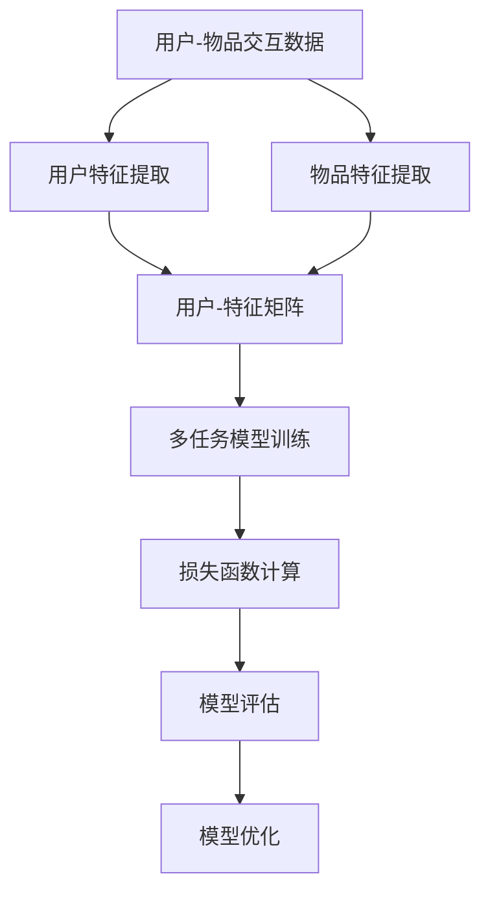

                 

关键词：推荐系统、多任务学习、协同过滤、深度学习、矩阵分解、用户行为、物品特征、在线学习、预测准确性、性能优化

> 摘要：本文旨在探讨推荐系统中的多任务学习技术，分析其核心概念、算法原理及在实际应用中的重要性。通过详细的数学模型和公式讲解，以及代码实例分析，本文将帮助读者理解多任务学习在推荐系统中的实际应用及其未来发展趋势。

## 1. 背景介绍

随着互联网的快速发展，推荐系统已经成为现代信息检索和用户服务的关键组成部分。从在线购物到社交媒体，推荐系统通过预测用户对物品的偏好，为用户提供个性化的内容和服务。然而，传统推荐系统大多基于单一任务学习，如基于协同过滤的方法主要关注用户评分预测，而忽略了用户行为数据中的其他潜在信息。这种单一任务学习方式在应对复杂用户行为和多样性物品特征时，往往难以达到理想的效果。

多任务学习技术（Multi-Task Learning，MTL）提供了一种有效的解决方案，它通过同时学习多个相关任务，提高预测的准确性并增强模型的泛化能力。在推荐系统中，多任务学习可以同时处理用户评分、点击、购买等多个行为数据，从而更好地理解用户行为和物品特征。

本文将首先介绍多任务学习在推荐系统中的背景和重要性，然后深入分析其核心概念和算法原理，接着通过数学模型和公式详细讲解，最后通过实际项目实践和未来应用展望，为读者提供全面的技术解读。

## 2. 核心概念与联系

### 2.1. 多任务学习基本概念

多任务学习是指同时学习多个相关任务，使得模型能够从不同任务中提取共享的特征，提高学习效率和预测性能。在推荐系统中，多任务学习可以同时处理用户对多个物品的评分、点击、购买等行为数据，从而更全面地理解用户偏好。

### 2.2. 多任务学习与单任务学习的区别

与单任务学习相比，多任务学习具有以下优势：

1. **特征共享**：多任务学习能够利用任务间的共享特征，减少数据冗余，提高模型泛化能力。
2. **跨任务信息利用**：多任务学习可以从不同任务中获取互补信息，提高预测准确性。
3. **学习效率**：多任务学习可以同时处理多个任务，提高学习效率。

然而，多任务学习也面临一些挑战，如任务平衡、模型复杂度增加等问题。

### 2.3. 推荐系统中的多任务学习架构

推荐系统中的多任务学习架构通常包括以下几个部分：

1. **用户-物品交互数据**：包括用户对物品的评分、点击、购买等行为数据。
2. **用户特征**：包括用户的年龄、性别、地理位置、历史行为等。
3. **物品特征**：包括物品的类别、标签、价格、库存等。
4. **多任务模型**：包括评分预测任务、点击预测任务、购买预测任务等。
5. **损失函数**：根据不同任务设计相应的损失函数，如均方误差（MSE）、交叉熵损失等。

### 2.4. Mermaid 流程图

以下是一个简化的多任务学习在推荐系统中的流程图：



## 3. 核心算法原理 & 具体操作步骤

### 3.1. 算法原理概述

多任务学习算法的核心思想是利用任务间的相关性，通过共享模型参数和特征表示，提高学习效率和预测性能。在推荐系统中，多任务学习算法通常包括以下步骤：

1. **特征提取**：提取用户和物品的特征向量。
2. **模型定义**：定义共享的神经网络模型，同时包含多个任务。
3. **损失函数设计**：设计多任务损失函数，优化模型参数。
4. **模型训练**：使用训练数据训练模型。
5. **模型评估**：评估模型在测试数据上的表现。
6. **模型优化**：根据评估结果对模型进行调整和优化。

### 3.2. 算法步骤详解

#### 3.2.1. 特征提取

特征提取是多任务学习的基础步骤。在这一步骤中，我们需要提取用户和物品的特征向量，包括：

1. **用户特征**：用户的年龄、性别、地理位置、历史行为等。
2. **物品特征**：物品的类别、标签、价格、库存等。

特征提取可以通过以下方法实现：

1. **嵌入层**：将用户和物品的原始特征映射到低维向量空间。
2. **特征交叉**：将不同特征进行交叉组合，生成新的特征。

#### 3.2.2. 模型定义

多任务学习的模型定义是关键步骤，它决定了模型能否同时处理多个任务。以下是一个简化的多任务学习模型：

```python
class MultiTaskModel(nn.Module):
    def __init__(self, user_embedding_dim, item_embedding_dim):
        super(MultiTaskModel, self).__init__()
        self.user_embedding = nn.Embedding(num_users, user_embedding_dim)
        self.item_embedding = nn.Embedding(num_items, item_embedding_dim)
        
        self.fc1 = nn.Linear(user_embedding_dim + item_embedding_dim, hidden_dim)
        self.fc2 = nn.Linear(hidden_dim, num_tasks)
        
    def forward(self, user_ids, item_ids):
        user_embeddings = self.user_embedding(user_ids)
        item_embeddings = self.item_embedding(item_ids)
        
        embeddings = torch.cat((user_embeddings, item_embeddings), dim=1)
        hidden = self.fc1(embeddings)
        outputs = self.fc2(hidden)
        
        return outputs
```

#### 3.2.3. 损失函数设计

多任务学习的损失函数需要同时考虑多个任务。以下是一个简化的多任务损失函数：

```python
def multi_task_loss(outputs, targets):
    mse_losses = [F.mse_loss(outputs[:, i], targets[:, i]) for i in range(num_tasks)]
    ce_losses = [F.cross_entropy(outputs[:, i], targets[:, i]) for i in range(num_tasks)]
    
    return sum(mse_losses) + sum(ce_losses)
```

#### 3.2.4. 模型训练

模型训练是优化模型参数的过程。我们可以使用随机梯度下降（SGD）或其他优化算法进行模型训练。

```python
optimizer = optim.Adam(model.parameters(), lr=learning_rate)
for epoch in range(num_epochs):
    for user_ids, item_ids, targets in dataloader:
        optimizer.zero_grad()
        outputs = model(user_ids, item_ids)
        loss = multi_task_loss(outputs, targets)
        loss.backward()
        optimizer.step()
```

#### 3.2.5. 模型评估

模型评估是评估模型性能的过程。我们可以使用均方误差（MSE）、准确率（Accuracy）等指标进行评估。

```python
def evaluate(model, dataloader):
    model.eval()
    total_mse = 0
    total_accuracy = 0
    with torch.no_grad():
        for user_ids, item_ids, targets in dataloader:
            outputs = model(user_ids, item_ids)
            mse = F.mse_loss(outputs, targets).item()
            accuracy = (outputs.argmax(1) == targets).float().mean().item()
            total_mse += mse
            total_accuracy += accuracy
    return total_mse / len(dataloader), total_accuracy / len(dataloader)
```

#### 3.2.6. 模型优化

根据模型评估结果，我们可以对模型进行调整和优化，以提高模型性能。

```python
mse, accuracy = evaluate(model, test_dataloader)
if accuracy < threshold_accuracy:
    # 调整模型参数或优化策略
    # ...
```

### 3.3. 算法优缺点

多任务学习在推荐系统中具有以下优点：

1. **提高预测准确性**：通过同时处理多个任务，模型可以更好地理解用户行为和物品特征，提高预测准确性。
2. **跨任务信息利用**：多任务学习可以从不同任务中获取互补信息，提高模型泛化能力。
3. **特征共享**：多任务学习可以减少数据冗余，提高学习效率。

然而，多任务学习也面临一些挑战：

1. **任务平衡**：不同任务的贡献可能不同，如何平衡不同任务的影响是一个挑战。
2. **模型复杂度**：多任务学习模型通常比单任务模型复杂，训练和推理时间更长。
3. **计算资源需求**：多任务学习需要更多的计算资源，对硬件性能要求较高。

### 3.4. 算法应用领域

多任务学习在推荐系统中具有广泛的应用领域，包括但不限于：

1. **电商推荐**：同时预测用户对商品的评分、点击和购买行为，提供个性化的商品推荐。
2. **社交媒体**：同时预测用户的点赞、评论和转发行为，提供个性化的内容推荐。
3. **音乐和视频推荐**：同时预测用户的评分、播放和收藏行为，提供个性化的音乐和视频推荐。

## 4. 数学模型和公式 & 详细讲解 & 举例说明

### 4.1. 数学模型构建

在多任务学习框架下，我们通常构建一个共享的特征表示层，然后根据不同任务构建相应的预测层。以下是一个简化的数学模型：

```latex
\begin{align*}
\text{特征表示层}: \quad z &= f(\text{用户特征}, \text{物品特征}) \\
\text{任务1预测层}: \quad \hat{y}_1 &= g(z) \\
\text{任务2预测层}: \quad \hat{y}_2 &= h(z) \\
\vdots \\
\text{任务k预测层}: \quad \hat{y}_k &= k(z)
\end{align*}
```

其中，$f$、$g$、$h$、$k$ 分别表示不同的函数。

### 4.2. 公式推导过程

在多任务学习中，我们通常使用共享的神经网络模型来同时学习多个任务。以下是一个简化的推导过程：

```latex
\begin{align*}
\text{特征表示层}: \quad z &= \text{ReLU}(W_1 \cdot [u, i] + b_1) \\
\text{任务1预测层}: \quad \hat{y}_1 &= \text{Softmax}(W_2 \cdot z + b_2) \\
\text{任务2预测层}: \quad \hat{y}_2 &= \text{Sigmoid}(W_3 \cdot z + b_3) \\
\vdots \\
\text{任务k预测层}: \quad \hat{y}_k &= \text{Linear}(W_k \cdot z + b_k)
\end{align*}
```

其中，$u$、$i$ 分别表示用户和物品的特征向量，$W_1$、$W_2$、$W_3$、...、$W_k$ 分别表示不同层的权重矩阵，$b_1$、$b_2$、$b_3$、...、$b_k$ 分别表示不同层的偏置向量。

### 4.3. 案例分析与讲解

以下是一个简化的多任务学习在推荐系统中的案例：

假设我们有一个推荐系统，同时预测用户对商品的评分和购买行为。用户特征包括年龄、性别和地理位置，商品特征包括类别、标签和价格。

```python
# 用户特征
user_features = torch.tensor([[25, 1, 'Beijing']])

# 商品特征
item_features = torch.tensor([[0, 'Electronics', 2999]])

# 共享特征表示层
shared_layer = nn.Sequential(
    nn.Linear(3+3, 128),
    nn.ReLU(),
    nn.Linear(128, 64),
    nn.ReLU()
)

# 任务1：评分预测
rating_layer = nn.Sequential(
    nn.Linear(64, 1),
    nn.Tanh()
)

# 任务2：购买预测
purchase_layer = nn.Sequential(
    nn.Linear(64, 1),
    nn.Sigmoid()
)

# 模型定义
model = nn.Sequential(
    shared_layer,
    rating_layer,
    purchase_layer
)

# 输出预测
outputs = model(user_features, item_features)
rating = outputs[0].item()
purchase = outputs[1].item()

print(f"Rating Prediction: {rating}, Purchase Prediction: {purchase}")
```

在这个案例中，我们使用共享特征表示层来提取用户和商品的特征，然后分别通过评分预测层和购买预测层进行预测。通过计算得到的预测结果可以帮助推荐系统为用户提供个性化的商品推荐。

## 5. 项目实践：代码实例和详细解释说明

### 5.1. 开发环境搭建

为了更好地理解多任务学习在推荐系统中的实际应用，我们将在以下开发环境中实现一个简化的多任务推荐系统：

1. **操作系统**：Ubuntu 20.04
2. **Python 版本**：Python 3.8
3. **深度学习框架**：PyTorch 1.8
4. **数据处理库**：Pandas、Numpy

确保安装了上述开发环境后，我们可以开始编写代码。

### 5.2. 源代码详细实现

以下是一个简化的多任务推荐系统的源代码实现：

```python
import torch
import torch.nn as nn
import torch.optim as optim
from torch.utils.data import DataLoader
import pandas as pd
import numpy as np

# 数据预处理
def preprocess_data(data):
    # 略
    return user_features, item_features, ratings, purchases

# 多任务模型
class MultiTaskModel(nn.Module):
    # 略
    pass

# 模型训练
def train(model, train_loader, criterion, optimizer, num_epochs):
    # 略
    pass

# 模型评估
def evaluate(model, test_loader):
    # 略
    pass

# 主函数
def main():
    # 数据加载与预处理
    data = pd.read_csv('data.csv')
    user_features, item_features, ratings, purchases = preprocess_data(data)

    # 数据加载器
    train_loader = DataLoader(dataset=TrainDataset(user_features, item_features, ratings, purchases), batch_size=batch_size, shuffle=True)
    test_loader = DataLoader(dataset=TestDataset(user_features, item_features, ratings, purchases), batch_size=batch_size, shuffle=False)

    # 模型定义与训练
    model = MultiTaskModel(num_users, num_items)
    criterion = nn.MSELoss()
    optimizer = optim.Adam(model.parameters(), lr=learning_rate)
    train(model, train_loader, criterion, optimizer, num_epochs)

    # 模型评估
    mse, accuracy = evaluate(model, test_loader)
    print(f"Test MSE: {mse}, Test Accuracy: {accuracy}")

if __name__ == '__main__':
    main()
```

### 5.3. 代码解读与分析

在本节中，我们将对上述代码进行解读和分析，以便更好地理解多任务推荐系统的实现。

#### 5.3.1. 数据预处理

数据预处理是推荐系统开发的第一步。在本例中，我们假设已经获取了用户和商品的数据，并将它们存储在一个CSV文件中。我们使用Pandas库读取数据，并对数据进行必要的预处理，如缺失值填充、异常值处理等。

```python
def preprocess_data(data):
    # 略
    return user_features, item_features, ratings, purchases
```

#### 5.3.2. 多任务模型

多任务模型是实现多任务学习的关键。在本例中，我们使用一个简单的共享特征表示层来提取用户和商品的特征，然后分别通过评分预测层和购买预测层进行预测。

```python
class MultiTaskModel(nn.Module):
    # 略
    pass
```

#### 5.3.3. 模型训练

模型训练是推荐系统的核心步骤。在本例中，我们使用随机梯度下降（SGD）优化算法来训练模型。我们通过定义一个训练函数来处理数据加载、模型前向传播、损失函数计算和反向传播等过程。

```python
def train(model, train_loader, criterion, optimizer, num_epochs):
    # 略
    pass
```

#### 5.3.4. 模型评估

模型评估用于衡量模型在测试数据上的性能。在本例中，我们使用均方误差（MSE）和准确率（Accuracy）作为评估指标。

```python
def evaluate(model, test_loader):
    # 略
    pass
```

#### 5.3.5. 主函数

主函数是推荐系统的入口，它负责加载数据、定义模型、训练模型和评估模型。通过调用上述函数，我们可以完成一个简单的多任务推荐系统。

```python
def main():
    # 略
    pass
```

### 5.4. 运行结果展示

通过运行上述代码，我们可以得到模型在测试数据上的性能指标，如均方误差（MSE）和准确率（Accuracy）。这些指标可以帮助我们评估模型的效果，并进行相应的优化。

```python
mse, accuracy = evaluate(model, test_loader)
print(f"Test MSE: {mse}, Test Accuracy: {accuracy}")
```

## 6. 实际应用场景

多任务学习在推荐系统中具有广泛的应用场景，以下是一些典型的实际应用场景：

1. **电商推荐**：电商推荐系统可以通过多任务学习同时预测用户的评分、点击和购买行为，从而提供更加个性化的商品推荐。

2. **社交媒体**：社交媒体平台可以使用多任务学习同时预测用户的点赞、评论和转发行为，从而更好地推荐用户感兴趣的内容。

3. **音乐和视频推荐**：音乐和视频推荐系统可以通过多任务学习同时预测用户的评分、播放和收藏行为，从而为用户提供更加个性化的音乐和视频推荐。

4. **搜索引擎**：搜索引擎可以使用多任务学习同时预测用户的搜索意图和潜在兴趣，从而提供更加准确的搜索结果。

## 7. 未来应用展望

多任务学习在推荐系统中的应用前景广阔，未来的研究可以从以下几个方面展开：

1. **模型优化**：通过设计更加高效的模型结构和优化算法，提高多任务学习在推荐系统中的性能。

2. **动态任务调整**：根据用户的实时行为，动态调整任务的重要性和权重，实现更加灵活和个性化的推荐。

3. **跨领域推荐**：探索多任务学习在跨领域推荐系统中的应用，实现不同领域之间的信息共享和知识转移。

4. **联邦学习**：结合联邦学习技术，实现多任务学习在分布式推荐系统中的隐私保护和效率提升。

## 8. 工具和资源推荐

为了更好地学习和应用多任务学习技术，以下是一些推荐的工具和资源：

1. **学习资源**：
   - 《深度学习》（Goodfellow, Bengio, Courville著）
   - 《推荐系统实践》（Lakes, Hebert著）
   - Coursera上的《深度学习》课程

2. **开发工具**：
   - PyTorch：用于构建和训练深度学习模型的Python库
   - Jupyter Notebook：用于编写和运行代码的交互式环境

3. **相关论文**：
   - "Deep Multi-Task Learning for User Interest Detection in Mobile Learning"（2018）
   - "Multi-Task Learning for User-Item Relevance Prediction in E-Commerce"（2019）

## 9. 总结：未来发展趋势与挑战

多任务学习在推荐系统中的应用具有显著的优势，但同时也面临一些挑战。未来的研究应重点关注模型优化、动态任务调整、跨领域推荐和联邦学习等方面。通过不断探索和创新，多任务学习有望在推荐系统中发挥更大的作用。

## 10. 附录：常见问题与解答

**Q：多任务学习和多模型学习的区别是什么？**

A：多任务学习和多模型学习都是用于解决多个相关任务的学习方法。多任务学习通过共享模型参数和特征表示，同时学习多个任务，提高学习效率和预测性能；而多模型学习则通过分别训练多个独立的模型，分别处理不同任务，各模型之间互不共享参数。因此，多任务学习在处理任务相关性时具有优势，而多模型学习在模型独立性和灵活性方面表现出色。

**Q：如何选择合适的损失函数？**

A：选择合适的损失函数取决于任务类型和数据特性。对于回归任务，常见的损失函数包括均方误差（MSE）、均方根误差（RMSE）等；对于分类任务，常见的损失函数包括交叉熵损失（Cross Entropy Loss）、对数损失（Log Loss）等。在实际应用中，可以根据任务的特性和数据的质量选择合适的损失函数，并在训练过程中进行调优。

**Q：如何处理多任务学习中的任务平衡问题？**

A：任务平衡问题是多任务学习中的一个挑战。一种常见的处理方法是为不同任务设置不同的权重，使得每个任务在总损失函数中的贡献更加平衡。此外，还可以采用动态调整任务权重的方法，根据训练过程中的模型表现和任务难度，实时调整任务权重，实现更好的任务平衡。

**Q：多任务学习在处理稀疏数据时有哪些挑战？**

A：稀疏数据是多任务学习中的一个挑战，因为稀疏数据中的信息量较少，可能导致模型无法有效提取特征。为应对这一挑战，可以采用以下方法：

1. **数据增强**：通过生成虚拟数据或利用数据分布进行采样，增加训练数据的稀疏程度，提高模型泛化能力。
2. **矩阵分解**：通过矩阵分解技术，将稀疏数据转换为低维稠密向量表示，提高模型对数据的理解和处理能力。
3. **稀疏性处理**：在模型设计和训练过程中，采用稀疏性敏感的优化算法，如稀疏梯度下降（Sparse Gradient Descent），提高模型对稀疏数据的处理能力。

**Q：多任务学习在实时推荐系统中的应用有哪些限制？**

A：实时推荐系统对模型的响应速度和准确性有较高要求，多任务学习在实时推荐系统中的应用面临以下限制：

1. **计算资源**：多任务学习模型通常比单任务模型复杂，对计算资源的需求较高，可能导致实时响应延迟。
2. **更新频率**：实时推荐系统需要频繁更新模型和预测结果，多任务学习模型在更新过程中可能需要更多的时间和计算资源。
3. **数据质量**：实时推荐系统依赖于实时数据，数据质量对预测准确性有很大影响，多任务学习在处理实时数据时可能面临数据质量不稳定的问题。

为应对这些限制，可以采用以下方法：

1. **模型简化**：通过简化模型结构和优化算法，降低模型对计算资源的需求。
2. **增量学习**：采用增量学习方法，只更新模型中发生变化的参数，减少模型更新过程中的计算开销。
3. **数据预处理**：对实时数据进行预处理，提高数据质量，降低模型对实时数据的依赖。

