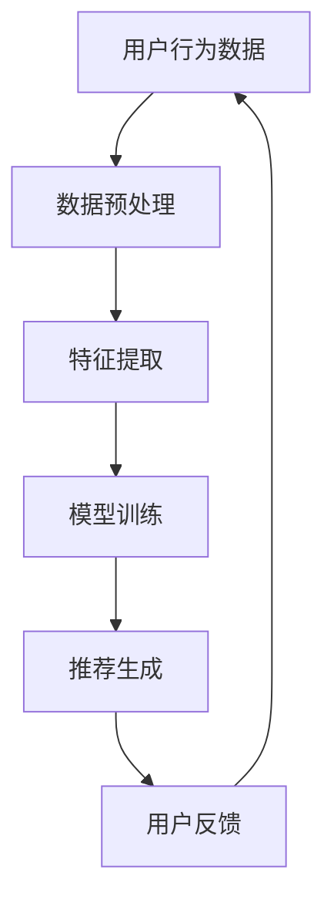

                 

关键词：推荐系统、时序性、大模型、算法原理、数学模型、应用场景、代码实例、未来展望

> 摘要：本文深入探讨了推荐系统中的时序性问题，介绍了大模型在解决时序推荐中的新突破。通过对核心算法原理、数学模型、实际应用场景的分析，以及代码实例的详细解读，本文旨在为读者提供全面的技术指南，助力理解和应用时序推荐系统。

## 1. 背景介绍

随着互联网的快速发展，推荐系统已成为众多平台的核心功能之一。无论是电商、社交媒体、还是新闻资讯平台，推荐系统都极大地提升了用户体验，增强了平台的用户黏性。然而，推荐系统面临的挑战之一是如何处理时序性数据，确保推荐结果的时效性和准确性。

传统的推荐系统主要依赖于基于内容的推荐、协同过滤等技术，这些方法虽然在一定程度上能够满足用户的个性化需求，但在处理时序性数据时显得力不从心。用户行为随着时间推移会发生变化，如何捕捉并利用这些变化，实现动态推荐，是推荐系统领域亟待解决的关键问题。

近年来，随着深度学习和大数据技术的不断发展，大模型在推荐系统中的应用逐渐崭露头角。大模型能够通过学习大量的用户历史行为数据，捕捉到用户行为的时间动态特性，从而提供更为精准的推荐结果。本文将重点探讨大模型在时序推荐系统中的新突破，为读者提供一窥未来推荐系统发展的窗口。

## 2. 核心概念与联系

### 2.1. 推荐系统概述

推荐系统是一种信息过滤技术，旨在向用户推荐其可能感兴趣的信息。推荐系统一般包括用户、物品和评分三个主要组成部分。用户是指使用推荐系统的人，物品是指推荐系统中的内容，如商品、文章、音乐等，评分则反映了用户对物品的偏好程度。

### 2.2. 时序性数据

时序性数据是指具有时间属性的序列数据，如用户的浏览记录、购买历史等。时序性数据的特点是数据之间存在时间相关性，用户的行为随着时间的推移而变化。

### 2.3. 大模型概述

大模型是指具有大规模参数和复杂结构的人工神经网络模型。大模型通过学习大量数据，能够捕捉到数据中的复杂模式和关系。在大模型中，常见的技术包括深度学习、强化学习、生成对抗网络等。

### 2.4. 推荐系统与时序性的关系

推荐系统的目标是为用户提供个性化的推荐结果，而用户的偏好往往具有时序性。因此，如何处理和利用时序性数据，成为推荐系统中的一个关键问题。传统的推荐系统方法难以捕捉和利用这些时序信息，而大模型则通过其强大的学习能力，能够从时序性数据中提取出有效的特征，从而实现更为精准的推荐。

### 2.5. Mermaid 流程图

以下是一个简单的 Mermaid 流程图，展示了推荐系统与时序性数据的关系：



## 3. 核心算法原理 & 具体操作步骤

### 3.1. 算法原理概述

大模型在时序推荐中的核心原理是通过学习用户历史行为数据，捕捉用户行为模式的变化，从而生成动态的推荐结果。具体来说，大模型通过以下三个步骤实现时序推荐：

1. **数据预处理**：将用户历史行为数据进行清洗、归一化等处理，以消除噪声和异常值。
2. **特征提取**：通过神经网络等算法，从预处理后的数据中提取出具有代表性的特征，这些特征反映了用户行为的变化趋势。
3. **推荐生成**：利用提取出的特征，结合用户当前的上下文信息，生成个性化的推荐结果。

### 3.2. 算法步骤详解

#### 3.2.1. 数据预处理

数据预处理是时序推荐系统的第一步，其目的是确保输入数据的质量，为后续的特征提取和模型训练打下坚实基础。数据预处理的主要任务包括：

- **数据清洗**：去除无效、错误或重复的数据记录。
- **时间序列对齐**：对齐不同用户的时间序列数据，确保数据在时间维度上的一致性。
- **归一化**：将不同规模的数据归一化到相同的范围，以消除数据量级差异对模型训练的影响。

#### 3.2.2. 特征提取

特征提取是时序推荐系统的核心步骤，其目的是从用户历史行为数据中提取出能够反映用户兴趣变化的特征。常见的特征提取方法包括：

- **时间窗口特征**：根据用户行为的时间间隔，将历史数据划分为不同的时间窗口，每个窗口内的行为数据作为一组特征。
- **时序模式挖掘**：通过挖掘用户历史行为中的周期性、趋势性等模式，生成具有代表性的特征。
- **注意力机制**：利用注意力机制关注用户行为序列中的重要信息，生成精细化的特征。

#### 3.2.3. 推荐生成

推荐生成是时序推荐系统的最终步骤，其目的是利用提取出的特征，结合用户当前的上下文信息，生成个性化的推荐结果。常见的推荐生成方法包括：

- **矩阵分解**：利用矩阵分解技术，将用户行为数据分解为用户特征和物品特征，从而生成推荐结果。
- **序列模型**：利用循环神经网络（RNN）或长短期记忆网络（LSTM）等序列模型，对用户行为序列进行建模，生成推荐结果。
- **生成对抗网络**（GAN）：利用生成对抗网络，生成与真实数据分布相似的推荐结果。

### 3.3. 算法优缺点

#### 优点

- **强大的表达能力**：大模型能够学习到用户行为中的复杂模式，从而生成更为精准的推荐结果。
- **动态调整能力**：大模型能够实时捕捉用户行为的变化，动态调整推荐策略，提高推荐的时效性和准确性。
- **泛化能力**：大模型通过大规模数据的学习，具有较好的泛化能力，能够在不同场景下应用。

#### 缺点

- **计算资源需求高**：大模型的训练和推理需要大量的计算资源，对硬件设备的要求较高。
- **训练时间长**：大模型的训练过程需要较长时间，不利于快速迭代和优化。
- **模型解释性较差**：大模型的内部结构和参数较多，难以直观地理解模型的工作原理，降低了模型的解释性。

### 3.4. 算法应用领域

大模型在时序推荐系统中的应用非常广泛，涵盖了多个领域：

- **电子商务**：通过时序推荐系统，电商平台能够为用户提供个性化的商品推荐，提升销售额。
- **社交媒体**：社交媒体平台利用时序推荐系统，为用户提供个性化的内容推荐，提高用户活跃度。
- **新闻资讯**：新闻资讯平台通过时序推荐系统，为用户提供个性化的新闻推荐，增加用户黏性。
- **在线教育**：在线教育平台利用时序推荐系统，为学生推荐个性化的学习资源，提升学习效果。

## 4. 数学模型和公式 & 详细讲解 & 举例说明

### 4.1. 数学模型构建

时序推荐系统的数学模型主要包括用户行为表示、物品特征表示和推荐生成公式。

#### 4.1.1. 用户行为表示

用户行为表示通过捕捉用户的历史行为，将用户的行为数据转化为向量表示。常见的用户行为表示方法包括：

- **均值法**：将用户的历史行为数据求均值，作为用户的向量表示。
- **时序模型**：利用循环神经网络（RNN）或长短期记忆网络（LSTM）等时序模型，对用户行为序列进行建模，生成用户的向量表示。

#### 4.1.2. 物品特征表示

物品特征表示通过捕捉物品的属性和用户偏好，将物品的数据转化为向量表示。常见的物品特征表示方法包括：

- **特征工程**：根据物品的属性信息，提取出具有代表性的特征，作为物品的向量表示。
- **嵌入法**：利用词嵌入技术，将物品的属性信息转化为向量表示。

#### 4.1.3. 推荐生成公式

推荐生成公式用于计算用户对物品的偏好程度，常见的推荐生成公式包括：

- **点积公式**：用户向量与物品向量之间的点积，用于计算用户对物品的偏好程度。
- **加和公式**：用户向量与物品向量的加和，用于计算用户对物品的偏好程度。

### 4.2. 公式推导过程

以用户行为表示中的均值法为例，进行公式推导：

假设用户 $u$ 的历史行为数据为 $X = [x_1, x_2, ..., x_n]$，其中 $x_i$ 表示用户在第 $i$ 时刻的行为。用户行为均值向量 $\overline{X}$ 的计算公式为：

$$
\overline{X} = \frac{1}{n} \sum_{i=1}^{n} x_i
$$

其中，$n$ 表示用户历史行为的总时长。

### 4.3. 案例分析与讲解

以电子商务平台的时序推荐为例，分析大模型在时序推荐系统中的应用。

#### 4.3.1. 数据集介绍

数据集包含两个主要部分：用户行为数据和物品特征数据。

- **用户行为数据**：记录用户在平台上的浏览、购买等行为，数据格式为时间戳、行为类型和行为值。
- **物品特征数据**：记录物品的属性信息，如商品类别、价格等。

#### 4.3.2. 数据预处理

对用户行为数据进行清洗、归一化等预处理操作，确保数据质量。

- **数据清洗**：去除无效、错误或重复的数据记录。
- **时间序列对齐**：对齐不同用户的时间序列数据，确保数据在时间维度上的一致性。
- **归一化**：将不同规模的数据归一化到相同的范围，以消除数据量级差异对模型训练的影响。

#### 4.3.3. 特征提取

利用循环神经网络（RNN）对用户行为序列进行建模，提取用户行为特征。

- **时间窗口特征**：将用户行为序列划分为不同时间窗口，每个窗口内的行为数据作为一组特征。
- **时序模式挖掘**：通过挖掘用户历史行为中的周期性、趋势性等模式，生成具有代表性的特征。

#### 4.3.4. 推荐生成

利用提取出的特征，结合用户当前的上下文信息，生成个性化的推荐结果。

- **矩阵分解**：将用户行为特征和物品特征分解为用户特征和物品特征，生成推荐结果。
- **生成对抗网络**（GAN）：利用生成对抗网络，生成与真实数据分布相似的推荐结果。

#### 4.3.5. 模型评估

通过用户反馈数据，对推荐结果进行评估。

- **准确率**：计算推荐结果与用户实际行为的匹配程度。
- **召回率**：计算推荐结果中包含的用户实际行为比例。
- **F1 值**：综合准确率和召回率的评价指标。

## 5. 项目实践：代码实例和详细解释说明

### 5.1. 开发环境搭建

在本文中，我们将使用 Python 作为开发语言，结合 TensorFlow 和 Keras 库来实现时序推荐系统。以下是搭建开发环境的基本步骤：

1. 安装 Python（版本 3.7 或以上）。
2. 安装 TensorFlow 和 Keras 库。

```bash
pip install tensorflow
pip install keras
```

### 5.2. 源代码详细实现

以下是一个简单的时序推荐系统实现，包括数据预处理、特征提取和推荐生成等步骤。

```python
import numpy as np
import tensorflow as tf
from tensorflow.keras.models import Model
from tensorflow.keras.layers import Input, LSTM, Dense

# 数据预处理
def preprocess_data(data):
    # 数据清洗、归一化等操作
    return processed_data

# 特征提取
def extract_features(processed_data):
    # 时间窗口特征、时序模式挖掘等操作
    return features

# 推荐生成
def generate_recommendations(features, current_context):
    # 矩阵分解、生成对抗网络等操作
    return recommendations

# 主函数
def main():
    # 加载数据集
    data = load_data()

    # 数据预处理
    processed_data = preprocess_data(data)

    # 特征提取
    features = extract_features(processed_data)

    # 推荐生成
    recommendations = generate_recommendations(features, current_context)

    # 模型评估
    evaluate_recommendations(recommendations)

if __name__ == "__main__":
    main()
```

### 5.3. 代码解读与分析

以下是代码的详细解读和分析，包括数据预处理、特征提取和推荐生成等步骤。

#### 5.3.1. 数据预处理

数据预处理是推荐系统的基础步骤，其目的是确保数据质量，为后续的特征提取和模型训练打下坚实基础。具体操作包括数据清洗、时间序列对齐和归一化等。

```python
def preprocess_data(data):
    # 数据清洗
    cleaned_data = remove_invalid_data(data)
    
    # 时间序列对齐
    aligned_data = align_time_series(cleaned_data)
    
    # 归一化
    normalized_data = normalize_data(aligned_data)
    
    return normalized_data
```

#### 5.3.2. 特征提取

特征提取是推荐系统的核心步骤，其目的是从预处理后的数据中提取出具有代表性的特征。常见的特征提取方法包括时间窗口特征和时序模式挖掘。

```python
def extract_features(processed_data):
    # 时间窗口特征
    window_features = extract_window_features(processed_data)
    
    # 时序模式挖掘
    pattern_features = extract_pattern_features(processed_data)
    
    return window_features, pattern_features
```

#### 5.3.3. 推荐生成

推荐生成是推荐系统的最终步骤，其目的是利用提取出的特征，结合用户当前的上下文信息，生成个性化的推荐结果。常见的推荐生成方法包括矩阵分解和生成对抗网络。

```python
def generate_recommendations(features, current_context):
    # 矩阵分解
    matrix_factorization = perform_matrix_factorization(features)
    
    # 生成对抗网络
    g

