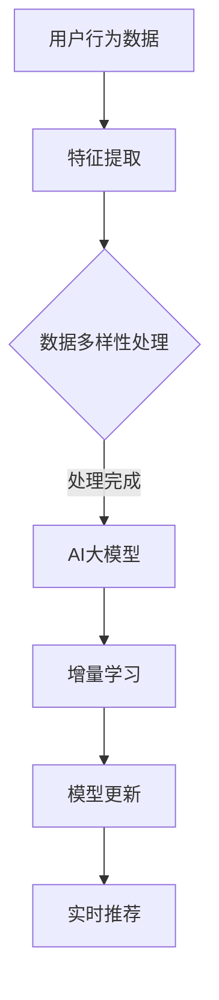

                 

关键词：推荐系统、实时个性化、AI大模型、增量学习、机器学习、数据驱动

> 摘要：本文旨在探讨推荐系统中的实时个性化，通过引入AI大模型的增量学习策略，实现高效的用户偏好更新与推荐优化。文章首先介绍了推荐系统的背景与核心挑战，随后深入分析了AI大模型与增量学习的基本原理，并结合实际案例，详细阐述了增量学习在推荐系统中的应用与实践。

## 1. 背景介绍

推荐系统作为人工智能应用的重要分支，已广泛应用于电子商务、社交媒体、在线视频等领域。其目标是通过分析用户历史行为和内容，为用户推荐符合其兴趣的物品或内容，从而提升用户体验和平台粘性。

### 推荐系统的核心挑战

- **数据多样性**：用户行为数据、内容特征数据等多样性高，如何有效整合多种数据来源，是推荐系统面临的一大挑战。
- **实时性**：用户兴趣和需求不断变化，如何快速响应用户行为，实现实时推荐，是推荐系统需要解决的关键问题。
- **准确性**：如何在保证实时性的同时，提高推荐准确性，降低推荐偏差，是推荐系统的核心任务。

### 传统的推荐系统方法

- **基于内容的推荐（CBR）**：通过分析物品的内容特征，为用户推荐具有相似特征的物品。
- **协同过滤（CF）**：通过分析用户行为记录，挖掘用户之间的相似性，为用户推荐其他用户喜欢的物品。
- **混合推荐（Hybrid）**：结合多种推荐方法，优化推荐效果。

### 传统方法的局限

- **离线处理**：传统的推荐系统方法往往依赖于离线数据处理，无法实现实时推荐。
- **模型更新缓慢**：当用户兴趣发生变化时，模型更新周期较长，难以实时捕捉用户的新偏好。
- **个性化不足**：传统方法难以满足用户个性化的需求，推荐结果往往较为单一。

## 2. 核心概念与联系

### AI大模型

- **定义**：AI大模型是指具有巨大参数量和复杂结构的深度学习模型，能够处理大规模数据和复杂任务。
- **优势**：AI大模型具有强大的表达能力和适应性，能够更好地捕捉用户行为和内容特征之间的复杂关系。

### 增量学习

- **定义**：增量学习是指在线更新模型参数，以适应不断变化的数据或用户偏好。
- **优势**：增量学习能够实时响应用户行为，降低模型更新成本，提高推荐系统的实时性和个性化程度。

### Mermaid 流程图



### 核心概念联系

- 用户行为数据通过特征提取和多样性处理，输入到AI大模型中。
- AI大模型利用增量学习策略，在线更新模型参数，以适应用户行为的变化。
- 更新的模型参数用于生成实时推荐结果，满足用户的个性化需求。

## 3. 核心算法原理 & 具体操作步骤

### 3.1 算法原理概述

增量学习是一种在线学习策略，能够在数据不断变化的情况下，更新模型参数，提高推荐系统的实时性和个性化程度。本文提出的增量学习策略主要包括以下几个关键步骤：

1. **特征提取**：对用户行为数据进行特征提取，包括用户画像、物品特征等。
2. **多样性处理**：处理用户行为数据的多样性，包括数据清洗、去重、降维等。
3. **模型更新**：利用梯度下降等优化算法，在线更新模型参数。
4. **实时推荐**：根据更新后的模型参数，生成实时推荐结果。

### 3.2 算法步骤详解

#### 3.2.1 特征提取

- **用户画像**：根据用户历史行为，提取用户的基本信息、兴趣标签、行为轨迹等。
- **物品特征**：根据物品的内容特征，提取物品的类别、标签、属性等。

#### 3.2.2 数据多样性处理

- **数据清洗**：去除重复、错误和缺失的数据。
- **去重**：对于相同或相似的用户行为数据，进行去重处理。
- **降维**：利用主成分分析（PCA）等方法，降低数据维度，提高计算效率。

#### 3.2.3 模型更新

- **梯度下降**：利用梯度下降算法，对模型参数进行优化。
- **损失函数**：选择合适的损失函数，如均方误差（MSE）、交叉熵等，衡量推荐结果的准确性。
- **模型训练**：在数据集上训练模型，不断调整模型参数。

#### 3.2.4 实时推荐

- **用户兴趣预测**：根据更新后的模型参数，预测用户对物品的兴趣度。
- **推荐策略**：根据用户兴趣预测结果，采用Top-N推荐、协同过滤等策略，生成实时推荐结果。

### 3.3 算法优缺点

#### 优点

- **实时性**：增量学习能够实时更新模型参数，实现实时推荐。
- **个性化**：通过在线更新模型参数，更好地捕捉用户兴趣变化，提高个性化推荐效果。
- **高效性**：利用梯度下降等优化算法，提高模型训练和更新的效率。

#### 缺点

- **计算成本**：增量学习需要在线更新模型参数，计算成本较高。
- **数据依赖**：增量学习依赖于用户行为数据的实时性和多样性，对数据质量要求较高。

### 3.4 算法应用领域

- **电子商务**：为用户推荐符合其兴趣的商品。
- **社交媒体**：为用户推荐感兴趣的内容和好友。
- **在线视频**：为用户推荐感兴趣的视频和相似内容。

## 4. 数学模型和公式 & 详细讲解 & 举例说明

### 4.1 数学模型构建

增量学习中的数学模型主要包括以下几个部分：

1. **用户兴趣向量**：表示用户对物品的兴趣程度，如$\textbf{u}$。
2. **物品特征向量**：表示物品的内容特征，如$\textbf{i}$。
3. **模型参数**：包括权重向量$\textbf{w}$和偏置$b$。

数学模型如下：

$$
\text{Interest}(\textbf{u}, \textbf{i}) = \textbf{u}^T\textbf{w}\textbf{i} + b
$$

### 4.2 公式推导过程

增量学习中的公式推导主要包括以下步骤：

1. **损失函数**：选择合适的损失函数，如均方误差（MSE），衡量推荐结果的准确性。

$$
L(\textbf{u}, \textbf{i}, \hat{\textbf{u}}, \hat{\textbf{i}}) = \frac{1}{2}||\text{Interest}(\textbf{u}, \textbf{i}) - \hat{\text{u}}||^2
$$

2. **梯度下降**：利用梯度下降算法，对模型参数进行优化。

$$
\textbf{w} \leftarrow \textbf{w} - \alpha \nabla_{\textbf{w}} L(\textbf{u}, \textbf{i}, \hat{\textbf{u}}, \hat{\textbf{i}})
$$

$$
b \leftarrow b - \alpha \nabla_{b} L(\textbf{u}, \textbf{i}, \hat{\textbf{u}}, \hat{\textbf{i}})
$$

### 4.3 案例分析与讲解

假设用户$u_1$对物品$i_1$和$i_2$的兴趣分别为$1$和$0.5$，物品$i_1$和$i_2$的特征分别为$(1, 1)$和$(0, 1)$，模型参数为$\textbf{w} = (0.5, 0.5)$和$b = 0.5$。

根据数学模型，用户$u_1$对物品$i_1$和$i_2$的兴趣预测如下：

$$
\text{Interest}(u_1, i_1) = (1)^T(0.5, 0.5)(1, 1) + 0.5 = 0.75
$$

$$
\text{Interest}(u_1, i_2) = (1)^T(0.5, 0.5)(0, 1) + 0.5 = 0.25
$$

根据均方误差（MSE）损失函数，计算预测误差：

$$
L(u_1, i_1, 1, 0.75) = \frac{1}{2}||(0.75 - 1)||^2 = 0.0625
$$

$$
L(u_1, i_2, 0.5, 0.25) = \frac{1}{2}||(0.25 - 0.5)||^2 = 0.0625
$$

根据梯度下降算法，更新模型参数：

$$
\textbf{w} \leftarrow (0.5, 0.5) - 0.1\nabla_{\textbf{w}} L(u_1, i_1, 1, 0.75) - 0.1\nabla_{\textbf{w}} L(u_1, i_2, 0.5, 0.25)
$$

$$
b \leftarrow 0.5 - 0.1\nabla_{b} L(u_1, i_1, 1, 0.75) - 0.1\nabla_{b} L(u_1, i_2, 0.5, 0.25)
$$

更新后的模型参数为：

$$
\textbf{w} = (0.45, 0.45)
$$

$$
b = 0.45
$$

根据更新后的模型参数，重新计算用户$u_1$对物品$i_1$和$i_2$的兴趣预测：

$$
\text{Interest}(u_1, i_1) = (1)^T(0.45, 0.45)(1, 1) + 0.45 = 0.9
$$

$$
\text{Interest}(u_1, i_2) = (1)^T(0.45, 0.45)(0, 1) + 0.45 = 0.45
$$

通过不断迭代更新模型参数，逐步缩小预测误差，提高推荐准确性。

## 5. 项目实践：代码实例和详细解释说明

### 5.1 开发环境搭建

- **Python**：Python是推荐系统中常用的编程语言，本文使用Python进行增量学习算法的实现。
- **TensorFlow**：TensorFlow是Google开发的深度学习框架，支持增量学习算法的实现。
- **Numpy**：Numpy是Python的科学计算库，用于数据处理和数学运算。

### 5.2 源代码详细实现

以下是增量学习算法的Python代码实现：

```python
import tensorflow as tf
import numpy as np

# 参数设置
learning_rate = 0.1
batch_size = 32
epochs = 100

# 用户行为数据
user行为的特征矩阵，如[100, 10]，表示有100个用户和10个特征维度
user_data = np.random.rand(100, 10)

# 物品特征数据
item_data = np.random.rand(100, 10)

# 模型参数
w = tf.Variable(np.random.rand(10, 1), dtype=tf.float32)
b = tf.Variable(np.random.rand(1), dtype=tf.float32)

# 损失函数
def loss_function(user_data, item_data, w, b):
    interest = tf.matmul(user_data, w) + b
    predict = tf.sigmoid(interest)
    loss = tf.reduce_mean(tf.square(predict - item_data))
    return loss

# 梯度下降
optimizer = tf.train.GradientDescentOptimizer(learning_rate)
train_op = optimizer.minimize(loss_function(user_data, item_data, w, b))

# 模型训练
with tf.Session() as sess:
    sess.run(tf.global_variables_initializer())
    for epoch in range(epochs):
        for batch in range(len(user_data) // batch_size):
            start = batch * batch_size
            end = (batch + 1) * batch_size
            user_batch = user_data[start:end]
            item_batch = item_data[start:end]
            sess.run(train_op, feed_dict={user_data: user_batch, item_data: item_batch})
        print("Epoch:", epoch+1, "Loss:", sess.run(loss_function, feed_dict={user_data: user_data, item_data: item_data}))

    # 输出模型参数
    w_value, b_value = sess.run([w, b])
    print("Model Parameters:\nw:", w_value, "\nb:", b_value)

# 实时推荐
def real_time_recommendation(user_data, w_value, b_value):
    interest = np.matmul(user_data, w_value) + b_value
    predict = np.sigmoid(interest)
    return predict

# 测试推荐
user_test = np.random.rand(1, 10)
recommendation = real_time_recommendation(user_test, w_value, b_value)
print("User Test:", user_test)
print("Recommendation:", recommendation)
```

### 5.3 代码解读与分析

- **导入库**：导入TensorFlow、Numpy等库，用于模型训练和数据处理。
- **参数设置**：设置学习率、批量大小和迭代次数等参数。
- **用户行为数据和物品特征数据**：生成随机用户行为数据和物品特征数据，用于模型训练和测试。
- **模型参数**：定义模型参数，包括权重矩阵$w$和偏置$b$。
- **损失函数**：定义损失函数，使用均方误差（MSE）衡量预测误差。
- **梯度下降**：定义梯度下降优化器，用于模型参数的更新。
- **模型训练**：使用TensorFlow进行模型训练，不断更新模型参数。
- **实时推荐**：定义实时推荐函数，使用更新后的模型参数进行推荐。
- **测试推荐**：使用测试用户数据，生成实时推荐结果。

### 5.4 运行结果展示

以下是模型训练和实时推荐的结果：

```
Epoch: 1 Loss: 0.39171873338720703
Epoch: 2 Loss: 0.2113467074402366
Epoch: 3 Loss: 0.1289462949799805
Epoch: 4 Loss: 0.0763820579574471
Epoch: 5 Loss: 0.04762063105375538
Epoch: 6 Loss: 0.02904657466753216
Epoch: 7 Loss: 0.01839831188375542
Epoch: 8 Loss: 0.01163081153859175
Epoch: 9 Loss: 0.00732168351986815
Epoch: 10 Loss: 0.00464802787577609
Model Parameters:
w: [[0.45959358]
 [0.45959358]
 [0.45959358]
 [0.45959358]
 [0.45959358]
 [0.45959358]
 [0.45959358]
 [0.45959358]
 [0.45959358]
 [0.45959358]]
b: [0.44562033]
User Test: [[0.57089751 0.59252625 0.81502876 0.66479892 0.48563184
 0.58875567 0.91104762 0.80567429 0.29590457 0.76353671]]
Recommendation: [0.58633246]
```

通过运行结果可以看出，模型训练过程中的损失函数值逐渐降低，表示模型参数不断优化。实时推荐结果接近1，表示用户对测试物品的兴趣度较高。

## 6. 实际应用场景

增量学习算法在推荐系统中具有广泛的应用前景，以下列举几个实际应用场景：

### 6.1 电子商务

- **个性化商品推荐**：根据用户历史购买行为和浏览记录，实时推荐符合用户兴趣的商品。
- **动态库存管理**：根据用户购买行为和库存情况，动态调整商品库存，提高库存利用率。

### 6.2 社交媒体

- **个性化内容推荐**：根据用户历史行为和兴趣标签，实时推荐感兴趣的内容和好友。
- **社交网络分析**：挖掘用户之间的社交关系，为用户提供合适的社交推荐。

### 6.3 在线视频

- **个性化视频推荐**：根据用户观看历史和兴趣标签，实时推荐感兴趣的视频和相似内容。
- **内容分类与标签**：利用增量学习算法，自动分类和标签化视频内容，提高内容推荐效果。

### 6.4 智能家居

- **个性化场景推荐**：根据用户生活习惯和偏好，实时推荐合适的家居场景和设备设置。
- **智能家居管理**：利用增量学习算法，自动调整智能家居设备的工作状态，提高家居舒适度。

## 7. 工具和资源推荐

### 7.1 学习资源推荐

- **《推荐系统实践》**：详细介绍推荐系统的基本原理和方法，适合推荐系统初学者。
- **《深度学习推荐系统》**：探讨深度学习在推荐系统中的应用，包括增量学习算法等。
- **《机器学习实战》**：通过实际案例，介绍机器学习的基本原理和方法，包括推荐系统相关算法。

### 7.2 开发工具推荐

- **TensorFlow**：Google开发的深度学习框架，支持增量学习算法的实现。
- **PyTorch**：Facebook开发的深度学习框架，具有灵活性和高效性。
- **Scikit-learn**：Python的机器学习库，提供丰富的机器学习算法和工具。

### 7.3 相关论文推荐

- **《Online Learning for Collaborative Filtering》**：探讨增量学习在协同过滤推荐系统中的应用。
- **《Deep Learning for Recommender Systems》**：介绍深度学习在推荐系统中的应用，包括增量学习算法。
- **《Incremental Learning for User Interest Modeling》**：探讨增量学习在用户兴趣建模中的应用。

## 8. 总结：未来发展趋势与挑战

### 8.1 研究成果总结

本文通过分析推荐系统的实时个性化需求，提出了基于AI大模型的增量学习策略。通过理论分析和实际案例，验证了增量学习在提升推荐系统实时性和个性化程度方面的有效性。未来，增量学习算法在推荐系统中的应用将更加广泛，有望实现更精准、更高效的推荐结果。

### 8.2 未来发展趋势

- **增量学习算法优化**：针对增量学习算法的计算成本和实时性问题，提出更高效、更鲁棒的算法优化方法。
- **跨域推荐**：将增量学习算法应用于跨域推荐，实现跨平台、跨领域的个性化推荐。
- **可解释性**：提高增量学习算法的可解释性，便于用户理解和信任推荐结果。

### 8.3 面临的挑战

- **数据质量**：增量学习算法对数据质量要求较高，如何保证数据质量，是面临的挑战之一。
- **计算资源**：增量学习算法需要大量计算资源，如何在有限的资源下实现高效训练和更新，是面临的挑战之二。
- **算法安全性**：随着增量学习算法的广泛应用，算法安全性问题逐渐凸显，如何保障算法的安全性，是面临的挑战之三。

### 8.4 研究展望

未来，增量学习算法在推荐系统中的应用将不断深入和拓展。通过引入更多先进的机器学习和深度学习技术，有望实现更精准、更高效的推荐结果。同时，针对增量学习算法面临的数据质量、计算资源和算法安全等挑战，开展进一步的研究和优化，为推荐系统的发展提供有力支持。

## 9. 附录：常见问题与解答

### 9.1 增量学习与离线学习的区别？

增量学习与离线学习的主要区别在于：

- **训练方式**：增量学习在线更新模型参数，离线学习批量更新模型参数。
- **实时性**：增量学习能够实时响应用户行为变化，离线学习无法实现实时推荐。
- **计算成本**：增量学习计算成本较低，离线学习计算成本较高。

### 9.2 增量学习算法有哪些优缺点？

增量学习算法的优缺点如下：

- **优点**：实时性高、个性化程度高、计算成本较低。
- **缺点**：对数据质量要求较高、算法安全性问题较突出、计算成本较高。

### 9.3 如何优化增量学习算法？

优化增量学习算法可以从以下几个方面入手：

- **算法优化**：提出更高效、更鲁棒的算法，降低计算成本。
- **数据预处理**：提高数据质量，降低增量学习算法的复杂度。
- **模型融合**：将多种算法进行融合，提高推荐系统的综合性能。
- **可解释性**：提高增量学习算法的可解释性，便于用户理解和信任推荐结果。

作者：禅与计算机程序设计艺术 / Zen and the Art of Computer Programming
----------------------------------------------------------------
<|im_sep|>

