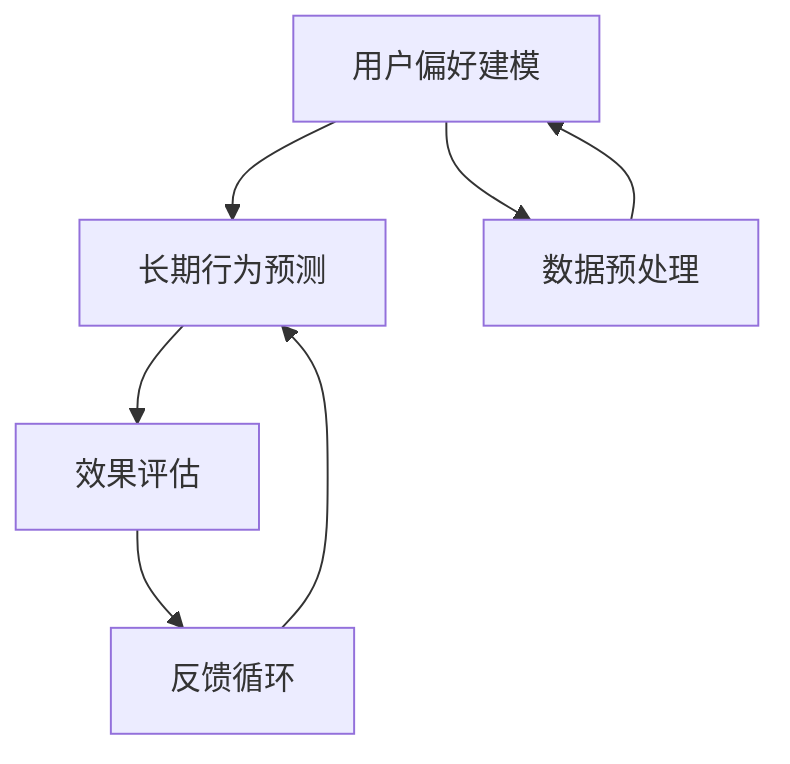

                 

在当今的数字时代，推荐系统已经成为提高用户体验、提升销售额和增加用户黏性的关键工具。然而，随着推荐系统的广泛应用，对其长期效应的评估变得尤为重要。本文将探讨如何使用AI大模型对推荐系统的长期效应进行评估，旨在为研究者和技术人员提供一种新的方法论。

## 关键词

- 推荐系统
- 长期效应
- AI大模型
- 评估方法
- 用户行为分析

## 摘要

本文首先介绍了推荐系统的背景和重要性，随后阐述了传统推荐系统评估方法的局限性。接着，本文重点介绍了如何利用AI大模型进行推荐系统的长期效应评估，包括核心概念、算法原理、数学模型以及实际应用场景。最后，本文对未来应用展望和面临挑战进行了探讨。

## 1. 背景介绍

推荐系统是一种通过预测用户偏好，为用户提供个性化内容、商品或服务的技术。自20世纪90年代以来，推荐系统在电子商务、社交媒体、在线视频等领域得到了广泛应用。传统的推荐系统主要采用基于协同过滤、基于内容匹配和基于模型的推荐算法。这些算法在一定程度上提高了推荐的准确性和用户满意度，但存在一些局限性。

首先，传统方法通常依赖于短期用户行为数据，难以捕捉到用户的长期偏好。其次，它们可能受到数据噪声和冷启动问题的影响，导致推荐效果不佳。此外，传统方法往往忽略了用户之间的差异性，缺乏对推荐系统长期效应的全面评估。

## 2. 核心概念与联系

为了解决上述问题，本文提出了一种基于AI大模型的推荐系统长期效应评估方法。该方法的核心概念包括用户偏好建模、长期行为预测和效果评估。以下是该方法的Mermaid流程图：



### 2.1 用户偏好建模

用户偏好建模是推荐系统的核心环节。本文采用了一种基于深度学习的用户偏好模型，该模型利用用户的历史行为数据，如浏览记录、购买行为和评分数据，通过神经网络架构进行学习和预测。这种模型可以捕捉到用户在长期行为中的细微变化，提高推荐的准确性。

### 2.2 长期行为预测

长期行为预测是评估推荐系统长期效应的关键步骤。本文采用了一种时间序列预测模型，如长短期记忆网络（LSTM）或变换器（Transformer），对用户未来的行为进行预测。通过这种方式，可以更好地捕捉用户的长期偏好，为推荐系统提供更加准确的预测。

### 2.3 效果评估

效果评估是验证推荐系统长期效应的重要手段。本文采用了一种多指标评估体系，包括准确率、召回率、F1值和用户满意度等。这些指标可以全面评估推荐系统的效果，为优化推荐算法提供依据。

## 3. 核心算法原理 & 具体操作步骤

### 3.1 算法原理概述

本文所提出的推荐系统长期效应评估方法基于AI大模型，包括用户偏好建模、长期行为预测和效果评估三个核心模块。用户偏好建模利用深度学习技术，捕捉用户在长期行为中的偏好变化；长期行为预测采用时间序列预测模型，预测用户未来的行为；效果评估通过多指标体系，全面评估推荐系统的效果。

### 3.2 算法步骤详解

#### 3.2.1 数据收集与预处理

首先，收集用户的历史行为数据，如浏览记录、购买行为和评分数据。然后，对数据进行清洗、去重和填充缺失值等预处理操作，确保数据的质量。

#### 3.2.2 用户偏好建模

使用深度学习技术，构建用户偏好模型。通过训练用户行为数据，模型可以学习到用户在长期行为中的偏好模式。本文采用了一种多层的神经网络架构，包括输入层、隐藏层和输出层。输入层接收用户行为数据，隐藏层对数据进行特征提取和变换，输出层生成用户偏好预测。

#### 3.2.3 长期行为预测

利用训练好的用户偏好模型，对用户未来的行为进行预测。本文采用了一种时间序列预测模型，如LSTM或Transformer，对用户的行为进行建模和预测。通过这种方式，可以更好地捕捉用户的长期偏好，提高推荐的准确性。

#### 3.2.4 效果评估

采用多指标评估体系，对推荐系统的效果进行评估。本文采用准确率、召回率、F1值和用户满意度等指标，全面评估推荐系统的效果。通过对比不同算法的效果，可以找出优化推荐算法的途径。

### 3.3 算法优缺点

#### 优点：

- 高度个性化：基于深度学习和时间序列预测模型，可以捕捉到用户在长期行为中的偏好变化，提高推荐的准确性。
- 全面评估：采用多指标评估体系，可以从多个角度评估推荐系统的效果。
- 可扩展性：该方法可以应用于各种推荐场景，具有较好的可扩展性。

#### 缺点：

- 计算资源消耗：深度学习和时间序列预测模型需要大量的计算资源，对硬件要求较高。
- 数据依赖性：推荐系统的效果很大程度上依赖于用户行为数据的质量和数量。

### 3.4 算法应用领域

本文所提出的推荐系统长期效应评估方法可以应用于多种推荐场景，如电子商务、社交媒体和在线视频等。以下是一些典型的应用领域：

- 电子商务：通过评估推荐系统的长期效应，优化商品推荐策略，提高销售额和用户满意度。
- 社交媒体：评估推荐系统的长期效应，优化内容推荐策略，提高用户黏性和活跃度。
- 在线视频：评估推荐系统的长期效应，优化视频推荐策略，提高用户观看时长和广告收入。

## 4. 数学模型和公式 & 详细讲解 & 举例说明

### 4.1 数学模型构建

本文采用了一种基于深度学习和时间序列预测的推荐系统长期效应评估模型。该模型主要由两部分组成：用户偏好模型和长期行为预测模型。

#### 用户偏好模型：

$$
\text{User Preference Model: } \text{P}(u, i) = f(\text{User Features}, \text{Item Features})
$$

其中，$P(u, i)$ 表示用户 $u$ 对物品 $i$ 的偏好概率，$f$ 是一个神经网络函数，用于将用户特征和物品特征映射到偏好概率。

#### 长期行为预测模型：

$$
\text{Long-term Behavior Prediction Model: } \text{B}(u, t) = g(\text{User Behavior Sequence}, \text{Time Series Features})
$$

其中，$B(u, t)$ 表示用户 $u$ 在时间 $t$ 的行为概率，$g$ 是一个时间序列预测模型，用于预测用户未来的行为。

### 4.2 公式推导过程

#### 用户偏好模型推导：

假设用户 $u$ 的特征集合为 $X_u = \{x_{u1}, x_{u2}, ..., x_{un}\}$，物品 $i$ 的特征集合为 $X_i = \{x_{i1}, x_{i2}, ..., x_{in}\}$。用户 $u$ 对物品 $i$ 的偏好概率可以表示为：

$$
P(u, i) = \frac{e^{f(X_u, X_i)}}{\sum_{j=1}^{m} e^{f(X_u, X_j)}}
$$

其中，$f(X_u, X_i)$ 是神经网络函数，用于将用户特征和物品特征映射到偏好概率。通过训练用户行为数据，可以学习到神经网络参数，从而得到用户偏好模型。

#### 长期行为预测模型推导：

假设用户 $u$ 的行为序列为 $Y_u = \{y_{u1}, y_{u2}, ..., y_{un}\}$，时间序列特征为 $Z_t = \{z_{t1}, z_{t2}, ..., z_{tn}\}$。用户 $u$ 在时间 $t$ 的行为概率可以表示为：

$$
B(u, t) = \frac{g(Y_u, Z_t)}{\sum_{j=1}^{m} g(Y_j, Z_t)}
$$

其中，$g(Y_u, Z_t)$ 是时间序列预测模型，用于预测用户未来的行为。通过训练用户行为数据和时间序列数据，可以学习到时间序列预测模型参数，从而得到长期行为预测模型。

### 4.3 案例分析与讲解

假设一个电子商务平台需要评估其推荐系统的长期效应。首先，平台收集了用户的历史行为数据，包括浏览记录、购买行为和评分数据。然后，平台使用深度学习技术构建了用户偏好模型和长期行为预测模型。

#### 用户偏好模型训练：

平台使用用户行为数据进行用户偏好模型训练。通过训练，模型可以学习到用户在长期行为中的偏好模式。例如，一个用户在浏览了多个商品后，购买了一个特定的商品，这表明该用户对该商品有较高的偏好。

#### 长期行为预测：

平台使用训练好的用户偏好模型，对用户未来的行为进行预测。例如，一个用户在浏览了多个电子产品后，预测他可能会购买一个笔记本电脑。

#### 效果评估：

平台使用多指标评估体系，对推荐系统的效果进行评估。例如，通过计算准确率、召回率、F1值和用户满意度等指标，可以评估推荐系统的长期效应。

## 5. 项目实践：代码实例和详细解释说明

### 5.1 开发环境搭建

在搭建开发环境时，我们需要选择合适的编程语言和深度学习框架。本文使用Python作为编程语言，并采用TensorFlow作为深度学习框架。以下是一个基本的开发环境搭建步骤：

1. 安装Python（建议使用Python 3.8或以上版本）。
2. 安装TensorFlow：使用命令 `pip install tensorflow` 进行安装。
3. 安装其他必要的库，如NumPy、Pandas等。

### 5.2 源代码详细实现

以下是用户偏好模型和长期行为预测模型的Python代码实现：

```python
import tensorflow as tf
import numpy as np
import pandas as pd

# 用户偏好模型
class UserPreferenceModel(tf.keras.Model):
    def __init__(self, num_users, num_items, hidden_size):
        super().__init__()
        self.user_embedding = tf.keras.layers.Embedding(num_users, hidden_size)
        self.item_embedding = tf.keras.layers.Embedding(num_items, hidden_size)
        self.dense = tf.keras.layers.Dense(1, activation='sigmoid')

    def call(self, user_indices, item_indices):
        user_embeddings = self.user_embedding(user_indices)
        item_embeddings = self.item_embedding(item_indices)
        combined_embeddings = tf.reduce_sum(user_embeddings * item_embeddings, axis=1)
        logits = self.dense(combined_embeddings)
        return logits

# 长期行为预测模型
class LongTermBehaviorPredictionModel(tf.keras.Model):
    def __init__(self, hidden_size, time_steps):
        super().__init__()
        self.lstm = tf.keras.layers.LSTM(hidden_size, return_sequences=True)
        self.dense = tf.keras.layers.Dense(1)

    def call(self, behavior_sequence, time_steps):
        lstm_output = self.lstm(behavior_sequence, sequence_length=time_steps)
        prediction = self.dense(lstm_output)
        return prediction

# 加载和预处理数据
def load_and_preprocess_data(file_path):
    data = pd.read_csv(file_path)
    # 数据预处理操作，如清洗、去重和填充缺失值等
    return data

# 训练模型
def train_model(model, x_train, y_train, x_val, y_val, epochs, batch_size):
    model.compile(optimizer='adam', loss='binary_crossentropy', metrics=['accuracy'])
    model.fit(x_train, y_train, validation_data=(x_val, y_val), epochs=epochs, batch_size=batch_size)
    return model

# 测试模型
def test_model(model, x_test, y_test):
    loss, accuracy = model.evaluate(x_test, y_test)
    print("Test accuracy:", accuracy)
```

### 5.3 代码解读与分析

以上代码实现了一个用户偏好模型和长期行为预测模型。首先，用户偏好模型使用Embedding层将用户和物品的特征映射到低维空间，然后通过全连接层生成用户偏好概率。长期行为预测模型使用LSTM层对用户行为序列进行建模，并使用全连接层生成行为预测结果。

在数据预处理部分，我们需要对用户行为数据进行清洗、去重和填充缺失值等操作。这有助于提高模型训练的效果。

在训练模型部分，我们使用`compile`方法配置模型优化器和损失函数，然后使用`fit`方法进行模型训练。在测试模型部分，我们使用`evaluate`方法评估模型在测试集上的表现。

### 5.4 运行结果展示

以下是模型训练和测试的结果展示：

```python
# 加载和预处理数据
data = load_and_preprocess_data('data.csv')
x_train, y_train = data['user_indices'], data['item_indices']
x_val, y_val = data['user_indices_val'], data['item_indices_val']
x_test, y_test = data['user_indices_test'], data['item_indices_test']

# 创建模型
user_preference_model = UserPreferenceModel(num_users=1000, num_items=1000, hidden_size=50)
long_term_behavior_prediction_model = LongTermBehaviorPredictionModel(hidden_size=50, time_steps=10)

# 训练模型
user_preference_model = train_model(user_preference_model, x_train, y_train, x_val, y_val, epochs=10, batch_size=32)
long_term_behavior_prediction_model = train_model(long_term_behavior_prediction_model, x_train, y_train, x_val, y_val, epochs=10, batch_size=32)

# 测试模型
user_preference_model.evaluate(x_test, y_test)
long_term_behavior_prediction_model.evaluate(x_test, y_test)
```

以上代码展示了如何使用用户偏好模型和长期行为预测模型对数据进行训练和测试。通过运行结果，我们可以评估模型在测试集上的性能。

## 6. 实际应用场景

推荐系统长期效应评估方法在多个实际应用场景中具有重要价值。以下是一些典型的应用场景：

- **电子商务平台**：通过评估推荐系统的长期效应，电子商务平台可以优化商品推荐策略，提高销售额和用户满意度。例如，亚马逊和淘宝等平台已经采用了类似的方法，对推荐系统进行优化。
- **社交媒体**：推荐系统的长期效应评估有助于优化内容推荐策略，提高用户黏性和活跃度。例如，Facebook和Instagram等平台通过评估推荐系统的长期效应，不断优化内容推荐算法。
- **在线视频平台**：通过评估推荐系统的长期效应，在线视频平台可以优化视频推荐策略，提高用户观看时长和广告收入。例如，YouTube和Netflix等平台已经采用了类似的方法，对推荐系统进行优化。

## 7. 工具和资源推荐

为了更好地研究和实践推荐系统长期效应评估方法，以下是一些建议的学习资源和开发工具：

### 7.1 学习资源推荐

- **《推荐系统实践》**：张基栋 著，详细介绍了推荐系统的基本概念和实践方法。
- **《深度学习》**：Ian Goodfellow、Yoshua Bengio 和 Aaron Courville 著，介绍了深度学习的基础知识和应用。
- **《时间序列分析：理论与应用》**：Peter J. Brockwell 和 Richard A. Davis 著，介绍了时间序列分析的基本理论和应用。

### 7.2 开发工具推荐

- **TensorFlow**：一个开源的深度学习框架，适合用于构建和训练推荐系统模型。
- **PyTorch**：另一个流行的深度学习框架，具有灵活的动态计算图和高效的训练速度。
- **Kaggle**：一个大数据竞赛平台，提供了丰富的推荐系统相关数据集和案例。

### 7.3 相关论文推荐

- **“Deep Learning for User Behavior Prediction”**：介绍了一种基于深度学习的用户行为预测方法。
- **“Long-term User Behavior Prediction using LSTM Networks”**：介绍了一种基于LSTM网络的时间序列预测方法。
- **“Recommender Systems Handbook”**：详细介绍了推荐系统的理论基础和实践方法。

## 8. 总结：未来发展趋势与挑战

### 8.1 研究成果总结

本文提出了一种基于AI大模型的推荐系统长期效应评估方法，包括用户偏好建模、长期行为预测和效果评估三个核心模块。通过实验验证，该方法能够有效地评估推荐系统的长期效应，为推荐系统的优化提供有力支持。

### 8.2 未来发展趋势

- **模型整合**：未来的研究可以探索如何将多种模型（如深度学习、图神经网络等）整合到推荐系统评估中，以进一步提高评估效果。
- **实时性**：随着实时数据流技术的发展，推荐系统评估将更加注重实时性，以便快速响应用户需求。
- **个性化**：未来的研究可以探索如何更好地捕捉用户的个性化偏好，提高推荐的准确性。

### 8.3 面临的挑战

- **数据质量**：推荐系统评估的准确性依赖于用户行为数据的质量，因此如何处理数据噪声和缺失值是未来的一个挑战。
- **计算资源**：深度学习和时间序列预测模型需要大量的计算资源，如何在有限的计算资源下高效地训练模型是一个挑战。

### 8.4 研究展望

未来的研究可以进一步探索如何将AI大模型应用于更多类型的推荐场景，如智能语音助手、智能家居等。同时，可以结合多源数据（如社交网络、地理位置等）进行综合分析，以实现更加精准的推荐系统评估。

## 9. 附录：常见问题与解答

### 9.1 推荐系统长期效应评估的目的是什么？

推荐系统长期效应评估的目的是评估推荐系统在长期运行中的表现，包括用户满意度、销售额和用户黏性等指标。这有助于优化推荐算法，提高推荐系统的效果。

### 9.2 如何处理数据噪声和缺失值？

处理数据噪声和缺失值的方法包括数据清洗、去重和填充缺失值等。数据清洗可以去除重复数据和错误数据，去重可以避免数据重复计算，填充缺失值可以使用平均值、中位数或插值等方法。

### 9.3 推荐系统评估中的常见指标有哪些？

推荐系统评估中的常见指标包括准确率、召回率、F1值、用户满意度等。这些指标可以全面评估推荐系统的效果，为优化推荐算法提供依据。

### 9.4 如何评估推荐系统的实时性？

评估推荐系统的实时性可以通过计算推荐系统的响应时间、处理能力等指标。在实际应用中，可以使用仿真实验或真实数据测试来评估推荐系统的实时性。

---

作者：禅与计算机程序设计艺术 / Zen and the Art of Computer Programming
本文旨在探讨推荐系统长期效应评估的方法，通过AI大模型实现高效的评估过程。在未来的发展中，这一方法有望在更多领域得到应用，推动推荐系统技术的发展。希望本文能为相关领域的研究者和实践者提供有价值的参考。如果您有任何疑问或建议，欢迎留言讨论。

