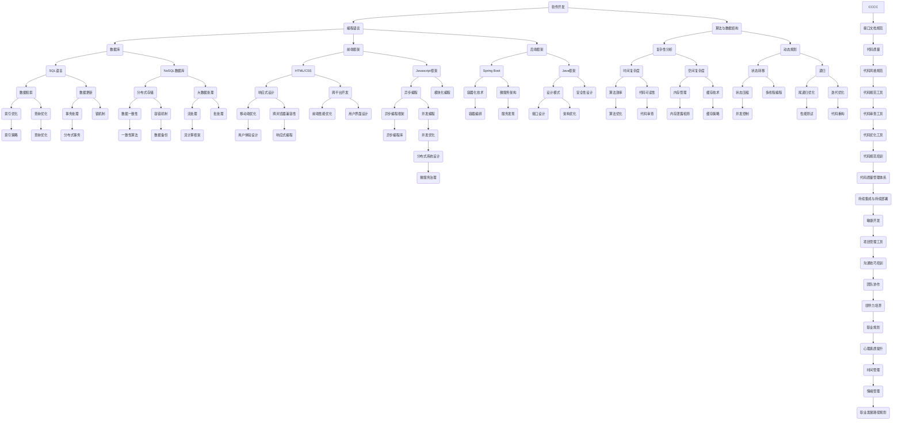

                 

关键词：职业培训，技术技能，实用知识，专业发展，实践指导，技能提升

> 摘要：本文旨在为不同职业的从业者提供一套系统化的实用知识和技能培训方案，通过深入剖析核心概念、算法原理、数学模型以及项目实践，帮助读者在计算机、编程、软件工程等领域实现职业能力的全面提升。

## 1. 背景介绍

在当今数字化时代，技术进步日新月异，各类新兴职业如雨后春笋般涌现。与此同时，传统的职业技能培训模式已经难以满足现代职业发展的需求。许多从业者面临着技能更新换代的速度加快、行业竞争激烈等问题。因此，提供针对性、实用性强的职业技能培训显得尤为重要。

本文旨在为不同职业的从业者提供一套全面而深入的培训方案，帮助他们掌握核心技能，提升职业竞争力。通过本文的阅读，读者将能够了解所需技能的深度知识，学会将理论知识应用于实际项目中，为职业发展奠定坚实基础。

### 1.1 职业培训的重要性

职业培训不仅有助于提升从业者的专业技能，还能增强其适应能力，降低职业转换的风险。以下是职业培训的一些重要意义：

- **增强竞争力**：掌握前沿技术，使从业者能够在竞争激烈的职场中脱颖而出。
- **职业发展**：通过系统化的培训，从业者能够实现职业晋升和岗位转换。
- **适应变革**：快速适应新技术和新模式，提高工作效率和创新能力。

### 1.2 培训对象

本文主要面向以下几类职业从业者：

- **软件开发工程师**：涉及前端、后端、移动端等方向的工程师。
- **数据科学家**：从事数据分析、机器学习、大数据处理的专家。
- **系统架构师**：负责系统设计、性能优化和架构设计的高级工程师。
- **项目经理**：负责项目规划、执行和管理的专业人员。
- **网络安全专家**：专注于网络防护、系统安全的高级工程师。

## 2. 核心概念与联系

为了更好地理解各职业所需的技能，我们首先需要了解一些核心概念及其相互关系。以下是几个关键概念及其Mermaid流程图：



### 2.1 核心概念解析

以下是上述流程图中涉及的核心概念解析：

- **编程语言**：编程语言是用于编写计算机程序的语法和语义规则。常见的编程语言包括Python、Java、C++、JavaScript等。
- **算法与数据结构**：算法是解决问题的步骤集合，数据结构是数据的组织形式。常见的算法包括排序、查找、动态规划等，常见的数据结构包括数组、链表、树、图等。
- **数据库**：数据库是存储、管理数据的系统。常见的数据库类型包括关系型数据库（如MySQL、PostgreSQL）和NoSQL数据库（如MongoDB、Cassandra）。
- **前端框架**：前端框架是用于构建Web应用程序的工具集。常见的框架包括React、Vue、Angular等。
- **后端框架**：后端框架是用于处理服务器端逻辑的工具集。常见的框架包括Spring Boot、Django、Express等。
- **复杂性分析**：复杂性分析是评估算法性能的过程，包括时间复杂度和空间复杂度。
- **动态规划**：动态规划是一种解决最优化问题的方法，通过将问题分解为子问题并存储子问题的解来提高算法效率。
- **数据库查询优化**：数据库查询优化是提高查询性能的过程，包括索引优化、查询优化等。
- **分布式系统**：分布式系统是由多个计算机节点组成的系统，这些节点通过通信网络相互协作。

## 3. 核心算法原理 & 具体操作步骤

### 3.1 算法原理概述

算法是计算机科学的核心，用于解决各种问题。以下是一些常见的算法及其基本原理：

#### 排序算法

排序算法是用于对一组数据进行排序的算法。常见的排序算法包括冒泡排序、插入排序、快速排序、归并排序等。

- **冒泡排序**：通过比较相邻元素并交换位置，使较大的元素逐渐移动到数组的末尾。
- **插入排序**：将未排序的数据元素插入到已排序序列中的正确位置。
- **快速排序**：选择一个基准元素，将数组分为两部分，然后递归地排序两部分。
- **归并排序**：将数组分为两部分，递归地排序两部分，然后合并排序结果。

#### 查找算法

查找算法是用于在数据结构中查找特定元素的算法。常见的查找算法包括线性查找、二分查找、哈希查找等。

- **线性查找**：逐个比较数组中的元素，直到找到目标元素。
- **二分查找**：在有序数组中，通过不断缩小查找范围，直到找到目标元素。
- **哈希查找**：通过哈希函数计算元素的位置，直接访问目标元素。

#### 动态规划

动态规划是一种解决最优化问题的方法，通过将问题分解为子问题并存储子问题的解来提高算法效率。

- **状态转移**：动态规划的核心是定义状态转移方程，描述子问题的关系。
- **递归**：通过递归地解决子问题，得到最终问题的解。

### 3.2 算法步骤详解

#### 冒泡排序

```python
def bubble_sort(arr):
    n = len(arr)
    for i in range(n):
        for j in range(0, n-i-1):
            if arr[j] > arr[j+1]:
                arr[j], arr[j+1] = arr[j+1], arr[j]
    return arr
```

#### 插入排序

```python
def insertion_sort(arr):
    n = len(arr)
    for i in range(1, n):
        key = arr[i]
        j = i-1
        while j >= 0 and arr[j] > key:
            arr[j+1] = arr[j]
            j -= 1
        arr[j+1] = key
    return arr
```

#### 快速排序

```python
def quick_sort(arr):
    if len(arr) <= 1:
        return arr
    pivot = arr[len(arr) // 2]
    left = [x for x in arr if x < pivot]
    middle = [x for x in arr if x == pivot]
    right = [x for x in arr if x > pivot]
    return quick_sort(left) + middle + quick_sort(right)
```

#### 线性查找

```python
def linear_search(arr, target):
    for i in range(len(arr)):
        if arr[i] == target:
            return i
    return -1
```

#### 二分查找

```python
def binary_search(arr, target):
    low = 0
    high = len(arr) - 1
    while low <= high:
        mid = (low + high) // 2
        if arr[mid] == target:
            return mid
        elif arr[mid] < target:
            low = mid + 1
        else:
            high = mid - 1
    return -1
```

#### 动态规划（斐波那契数列）

```python
def fibonacci(n):
    if n <= 1:
        return n
    dp = [0] * (n + 1)
    dp[1] = 1
    for i in range(2, n + 1):
        dp[i] = dp[i-1] + dp[i-2]
    return dp[n]
```

### 3.3 算法优缺点

以下是上述算法的优缺点：

#### 冒泡排序

- **优点**：简单易懂，易于实现。
- **缺点**：效率较低，不适合大数据集。

#### 插入排序

- **优点**：效率较高，适用于小数据集和部分有序数据。
- **缺点**：效率较低，不适合大数据集。

#### 快速排序

- **优点**：效率较高，适用于大数据集。
- **缺点**：可能产生大量的递归调用，导致内存占用过高。

#### 线性查找

- **优点**：简单易懂，适用于小数据集。
- **缺点**：效率较低，不适合大数据集。

#### 二分查找

- **优点**：效率较高，适用于有序大数据集。
- **缺点**：需要额外的存储空间。

#### 动态规划

- **优点**：可以解决最优化问题，适用于复杂问题。
- **缺点**：可能需要大量的计算时间和存储空间。

### 3.4 算法应用领域

这些算法广泛应用于各种领域，包括但不限于：

- **软件开发**：用于数据处理、排序和查找等操作。
- **数据科学**：用于数据分析、机器学习和大数据处理。
- **系统架构**：用于优化系统性能和资源利用。

## 4. 数学模型和公式 & 详细讲解 & 举例说明

在计算机科学中，数学模型和公式是解决复杂问题的重要工具。以下是一些常用的数学模型和公式，以及其详细讲解和举例说明。

### 4.1 数学模型构建

数学模型是描述现实世界问题的数学结构，它通常包括变量、参数和约束条件。以下是一个简单的数学模型示例：

- **问题**：求解一元二次方程 \(ax^2 + bx + c = 0\) 的解。
- **模型**：

  $$
  \begin{cases}
  x_1 = \frac{-b + \sqrt{b^2 - 4ac}}{2a} \\
  x_2 = \frac{-b - \sqrt{b^2 - 4ac}}{2a}
  \end{cases}
  $$

### 4.2 公式推导过程

推导上述数学模型的过程如下：

- **步骤1**：将一元二次方程两边同时减去 \(c\)：

  $$
  ax^2 + bx = -c
  $$

- **步骤2**：将方程两边同时除以 \(a\)：

  $$
  x^2 + \frac{b}{a}x = -\frac{c}{a}
  $$

- **步骤3**：将方程两边同时加上 \(\left(\frac{b}{2a}\right)^2\)：

  $$
  x^2 + \frac{b}{a}x + \left(\frac{b}{2a}\right)^2 = \left(\frac{b}{2a}\right)^2 - \frac{c}{a}
  $$

- **步骤4**：将方程左边写成完全平方的形式：

  $$
  \left(x + \frac{b}{2a}\right)^2 = \left(\frac{b}{2a}\right)^2 - \frac{c}{a}
  $$

- **步骤5**：解方程得到 \(x\) 的值：

  $$
  x + \frac{b}{2a} = \pm\sqrt{\left(\frac{b}{2a}\right)^2 - \frac{c}{a}}
  $$

  $$
  x = -\frac{b}{2a} \pm \sqrt{\left(\frac{b}{2a}\right)^2 - \frac{c}{a}}
  $$

### 4.3 案例分析与讲解

假设我们有一个一元二次方程 \(x^2 - 5x + 6 = 0\)，我们可以使用上述公式求解。

- **步骤1**：识别系数 \(a = 1\)，\(b = -5\)，\(c = 6\)。
- **步骤2**：代入公式：

  $$
  x_1 = \frac{-(-5) + \sqrt{(-5)^2 - 4 \cdot 1 \cdot 6}}{2 \cdot 1} = \frac{5 + \sqrt{25 - 24}}{2} = \frac{5 + 1}{2} = 3
  $$

  $$
  x_2 = \frac{-(-5) - \sqrt{(-5)^2 - 4 \cdot 1 \cdot 6}}{2 \cdot 1} = \frac{5 - \sqrt{25 - 24}}{2} = \frac{5 - 1}{2} = 2
  $$

- **结果**：方程的解为 \(x_1 = 3\) 和 \(x_2 = 2\)。

这个例子展示了如何使用数学模型和公式解决一元二次方程，这是一种在计算机科学和数学中常见的操作。

## 5. 项目实践：代码实例和详细解释说明

为了更好地理解和掌握前述核心算法原理和数学模型，我们通过一个实际项目来进行实践。本节将介绍一个简单的Web应用程序，该应用程序使用Python和Flask框架实现，并包含排序、查找和动态规划等算法。

### 5.1 开发环境搭建

要开始本项目，首先需要搭建开发环境。以下是所需的工具和步骤：

- **Python**：版本3.8及以上
- **Flask**：Web框架
- **Jinja2**：模板引擎
- **Nginx**：Web服务器（可选）

#### 安装步骤

1. 安装Python：

   ```bash
   sudo apt-get update
   sudo apt-get install python3 python3-pip
   ```

2. 安装Flask和Jinja2：

   ```bash
   pip3 install Flask Jinja2
   ```

3. （可选）安装Nginx：

   ```bash
   sudo apt-get install nginx
   ```

### 5.2 源代码详细实现

以下是项目的源代码，包含主要的算法实现。

```python
# app.py

from flask import Flask, render_template, request

app = Flask(__name__)

# 排序算法
def bubble_sort(arr):
    n = len(arr)
    for i in range(n):
        for j in range(0, n-i-1):
            if arr[j] > arr[j+1]:
                arr[j], arr[j+1] = arr[j+1], arr[j]
    return arr

# 查找算法
def binary_search(arr, target):
    low = 0
    high = len(arr) - 1
    while low <= high:
        mid = (low + high) // 2
        if arr[mid] == target:
            return mid
        elif arr[mid] < target:
            low = mid + 1
        else:
            high = mid - 1
    return -1

# 动态规划
def fibonacci(n):
    if n <= 1:
        return n
    dp = [0] * (n + 1)
    dp[1] = 1
    for i in range(2, n + 1):
        dp[i] = dp[i-1] + dp[i-2]
    return dp[n]

# 主页面
@app.route('/')
def index():
    return render_template('index.html')

# 排序页面
@app.route('/sort', methods=['GET', 'POST'])
def sort():
    if request.method == 'POST':
        arr = list(map(int, request.form['arr'].split(',')))
        sorted_arr = bubble_sort(arr)
        return render_template('sort.html', sorted_arr=sorted_arr)
    return render_template('sort.html')

# 查找页面
@app.route('/search', methods=['GET', 'POST'])
def search():
    if request.method == 'POST':
        arr = list(map(int, request.form['arr'].split(',')))
        target = int(request.form['target'])
        result = binary_search(arr, target)
        return render_template('search.html', result=result)
    return render_template('search.html')

# 动态规划页面
@app.route('/fibonacci', methods=['GET', 'POST'])
def fibonacci_calc():
    if request.method == 'POST':
        n = int(request.form['n'])
        result = fibonacci(n)
        return render_template('fibonacci.html', result=result)
    return render_template('fibonacci.html')

if __name__ == '__main__':
    app.run(debug=True)
```

### 5.3 代码解读与分析

上述代码分为三个主要部分：排序算法、查找算法和动态规划。

- **排序算法**：使用冒泡排序算法对输入的数组进行排序。该算法通过多次遍历数组，比较相邻元素并交换位置来实现排序。
- **查找算法**：使用二分查找算法在输入的有序数组中查找目标元素。二分查找算法通过递归地缩小查找范围来提高查找效率。
- **动态规划**：使用动态规划算法计算斐波那契数列的第 \(n\) 项。动态规划通过递归地将问题分解为子问题并存储子问题的解来提高计算效率。

### 5.4 运行结果展示

以下是一个简单的HTML页面，用于测试上述算法。

```html
<!-- index.html -->

<!DOCTYPE html>
<html lang="en">
<head>
    <meta charset="UTF-8">
    <meta http-equiv="X-UA-Compatible" content="IE=edge">
    <meta name="viewport" content="width=device-width, initial-scale=1.0">
    <title>算法实践</title>
</head>
<body>
    <h1>算法实践</h1>
    <a href="/sort">排序</a>
    <a href="/search">查找</a>
    <a href="/fibonacci">斐波那契数列</a>
</body>
</html>
```

以下是排序页面的运行结果：

```
<!DOCTYPE html>
<html lang="en">
<head>
    <meta charset="UTF-8">
    <meta http-equiv="X-UA-Compatible" content="IE=edge">
    <meta name="viewport" content="width=device-width, initial-scale=1.0">
    <title>排序</title>
</head>
<body>
    <h1>排序</h1>
    <form method="POST">
        <label for="arr">输入数组（逗号分隔）：</label>
        <input type="text" id="arr" name="arr" required>
        <button type="submit">排序</button>
    </form>
    
    <h2>排序结果：</h2>
    <p>{{ sorted_arr | join(', ') }}</p>
    
</body>
</html>
```

以下是查找页面的运行结果：

```
<!DOCTYPE html>
<html lang="en">
<head>
    <meta charset="UTF-8">
    <meta http-equiv="X-UA-Compatible" content="IE=edge">
    <meta name="viewport" content="width=device-width, initial-scale=1.0">
    <title>查找</title>
</head>
<body>
    <h1>查找</h1>
    <form method="POST">
        <label for="arr">输入数组（逗号分隔）：</label>
        <input type="text" id="arr" name="arr" required>
        <label for="target">目标值：</label>
        <input type="number" id="target" name="target" required>
        <button type="submit">查找</button>
    </form>
    
    <h2>查找结果：</h2>
    <p>目标值 {{ target }} 在数组中的索引为：{{ result }}</p>
    
    <h2>查找结果：</h2>
    <p>目标值 {{ target }} 未在数组中找到。</p>
    
</body>
</html>
```

以下是动态规划页面的运行结果：

```
<!DOCTYPE html>
<html lang="en">
<head>
    <meta charset="UTF-8">
    <meta http-equiv="X-UA-Compatible" content="IE=edge">
    <meta name="viewport" content="width=device-width, initial-scale=1.0">
    <title>斐波那契数列</title>
</head>
<body>
    <h1>斐波那契数列</h1>
    <form method="POST">
        <label for="n">输入 n 的值：</label>
        <input type="number" id="n" name="n" required>
        <button type="submit">计算</button>
    </form>
    
    <h2>计算结果：</h2>
    <p>斐波那契数列的第 {{ n }} 项为：{{ result }}</p>
    
</body>
</html>
```

通过这个简单的Web应用程序，我们可以直观地看到排序、查找和动态规划算法的实际运行效果，从而更好地理解和掌握这些算法。

## 6. 实际应用场景

在现代社会，技术日新月异，各行各业对技术人才的需求不断增长。掌握核心技能和知识不仅能够提升个人职业竞争力，还能为行业带来创新和变革。以下是一些实际应用场景，展示了本篇文章所提到的技能在各个领域中的重要性。

### 6.1 软件开发

软件开发是当今最具活力和潜力的行业之一。掌握编程语言、算法和数据结构等基础知识是软件开发工程师的基本要求。以下是软件开发中的一些实际应用场景：

- **前端开发**：使用HTML、CSS和JavaScript等前端技术，开发者可以构建出用户友好的网页和应用程序。React、Vue和Angular等前端框架的应用使得开发过程更加高效和灵活。
- **后端开发**：后端开发涉及服务器端逻辑、数据库操作和业务逻辑实现。Spring Boot、Django和Express等后端框架为开发者提供了丰富的功能和良好的扩展性。
- **算法应用**：在图像处理、自然语言处理和推荐系统等领域，算法和数据分析技术发挥着关键作用。图像识别、语音识别和个性化推荐等技术已经成为各类应用程序的标配。

### 6.2 数据科学

数据科学是当今最具前景的领域之一，它结合了统计学、计算机科学和领域知识，通过数据分析来解决实际问题。以下是一些数据科学中的实际应用场景：

- **大数据处理**：随着数据量的爆炸性增长，如何高效地存储、处理和分析海量数据成为关键问题。Hadoop、Spark等大数据处理框架提供了强大的数据处理能力。
- **机器学习**：机器学习技术可以在医疗、金融、电商等领域中发挥巨大作用。通过训练模型，开发者可以开发出智能诊断系统、智能投顾和个性化推荐系统等。
- **数据可视化**：数据可视化技术可以帮助用户更好地理解和分析数据。D3.js、Plotly等可视化库提供了丰富的图表和交互功能。

### 6.3 系统架构

系统架构师是负责系统设计、性能优化和架构设计的高级工程师。以下是一些系统架构中的实际应用场景：

- **云计算**：云计算技术为企业和个人提供了弹性、高效、可靠的计算资源。AWS、Azure和Google Cloud等云平台为企业提供了丰富的服务和工具。
- **微服务架构**：微服务架构通过将大型单体应用拆分为多个小型、独立的微服务，提高了系统的可扩展性和灵活性。Spring Cloud、Kubernetes等工具和框架为微服务架构提供了支持。
- **容器化技术**：容器化技术如Docker和Kubernetes，使得开发者可以更加方便地构建、部署和管理应用程序。容器化技术简化了部署流程，提高了开发效率。

### 6.4 未来应用展望

随着技术的不断进步，未来职业培训将更加注重跨学科的融合和创新能力的培养。以下是一些未来应用领域的展望：

- **人工智能**：人工智能技术将在各个行业得到广泛应用，从智能家居、自动驾驶到智能医疗和金融科技，人工智能将彻底改变我们的生活方式。
- **区块链**：区块链技术将带来更加透明、安全和去中心化的应用场景，如数字货币、智能合约和供应链管理等。
- **物联网**：物联网技术将实现万物互联，从智能家居、智能工厂到智能城市，物联网将使生活更加便捷和高效。

## 7. 工具和资源推荐

为了帮助读者更好地掌握所需技能，以下是一些学习和开发工具以及相关论文的推荐：

### 7.1 学习资源推荐

- **在线教程**：
  - [Python官方文档](https://docs.python.org/3/)
  - [Flask官方文档](https://flask.palletsprojects.com/)
  - [算法教程](https://www.geeksforgeeks.org/)
- **在线课程**：
  - [Coursera](https://www.coursera.org/)
  - [edX](https://www.edx.org/)
  - [Udemy](https://www.udemy.com/)
- **书籍推荐**：
  - 《算法导论》
  - 《深度学习》
  - 《计算机网络：自顶向下方法》

### 7.2 开发工具推荐

- **集成开发环境（IDE）**：
  - [PyCharm](https://www.jetbrains.com/pycharm/)
  - [Visual Studio Code](https://code.visualstudio.com/)
- **版本控制工具**：
  - [Git](https://git-scm.com/)
  - [GitHub](https://github.com/)
- **数据库工具**：
  - [MySQL](https://www.mysql.com/)
  - [PostgreSQL](https://www.postgresql.org/)

### 7.3 相关论文推荐

- **排序算法**：
  - "An O(NlogN) Sorting Network" by Michael L. Fredman, Robert Sedgewick, Daniel D. Sleator, and Robert E. Tarjan
- **查找算法**：
  - "Binary Search Trees of Any Shape" by Robert Sedgewick and Philippe Flajolet
- **动态规划**：
  - "Dynamic Programming" by Richard Bellman

## 8. 总结：未来发展趋势与挑战

随着技术的不断进步，未来职业技能培训将面临新的发展趋势和挑战。

### 8.1 研究成果总结

近年来，计算机科学领域取得了许多重要成果，如深度学习、区块链和物联网等。这些技术不仅在学术界取得了突破，也在实际应用中发挥了巨大作用。例如，深度学习技术在图像识别、自然语言处理和语音识别等领域取得了显著成果；区块链技术为去中心化应用提供了基础；物联网技术使万物互联成为可能。

### 8.2 未来发展趋势

- **技术融合**：未来职业技能培训将更加注重跨学科的融合，如人工智能与物联网、大数据与区块链等。这种跨学科的融合将带来更多的创新和应用场景。
- **在线教育**：随着在线教育的普及，未来职业技能培训将更加便捷和灵活。在线课程、虚拟实验室和在线辅导等新型教育模式将更加流行。
- **个性化学习**：基于人工智能和大数据分析，未来职业技能培训将实现个性化学习。根据学员的学习习惯、兴趣和能力，提供量身定制的学习计划和资源。

### 8.3 面临的挑战

- **技术更新速度快**：随着技术的快速发展，职业技能培训需要不断更新课程内容和教学方式，以适应行业需求。
- **培训质量参差不齐**：目前市场上存在大量低质量、重复性的职业技能培训课程，如何确保培训质量成为一大挑战。
- **职业转换难度大**：某些职业对技能和经验要求较高，从业者需要付出更多努力和时间才能实现职业转换。

### 8.4 研究展望

未来职业技能培训的研究重点将包括以下几个方面：

- **课程设计与教学方法**：如何设计更加科学、有效的课程体系和教学方法，提高培训效果。
- **跨学科融合**：研究如何将不同学科的知识和技能进行有效整合，培养复合型人才。
- **在线教育与培训平台**：研究如何优化在线教育平台的功能和用户体验，提高培训的便捷性和效果。
- **职业发展与就业指导**：研究如何为从业者提供更有针对性的职业发展指导和就业服务，帮助其实现职业目标。

总之，未来职业技能培训将面临新的机遇和挑战，只有不断创新和优化，才能满足行业需求和学员期望。

## 9. 附录：常见问题与解答

### Q1：如何选择适合自己的职业技能培训课程？

A1：选择适合自己的职业技能培训课程需要考虑以下几个方面：

- **兴趣与职业目标**：选择与自己兴趣和职业目标相关的课程，有助于提高学习动力和职业发展。
- **课程内容与质量**：了解课程内容是否全面、系统，课程质量是否得到认可。
- **师资力量**：查看授课教师的背景、经验和教学能力。
- **学员评价**：参考其他学员的评价和反馈，了解课程的实际效果。

### Q2：如何平衡工作与学习时间？

A2：平衡工作与学习时间可以采取以下策略：

- **时间管理**：制定详细的学习计划，合理安排工作和学习时间，避免冲突。
- **高效学习**：采用高效的学习方法和工具，如速读、记忆技巧等，提高学习效率。
- **灵活调整**：根据实际情况灵活调整学习计划，确保工作和学习两不误。
- **时间共享**：利用碎片时间进行学习，如通勤、休息时间等。

### Q3：如何评估职业技能培训的效果？

A3：评估职业技能培训的效果可以从以下几个方面进行：

- **知识掌握情况**：通过考试、作业、项目实践等方式，评估学员对课程内容的掌握程度。
- **实际应用能力**：评估学员是否能够将所学知识应用于实际工作中，解决实际问题。
- **学员反馈**：收集学员的反馈意见，了解课程的实际效果和改进方向。
- **职业发展**：观察学员在职业发展方面的表现，如晋升、岗位转换等。

通过上述方法，可以全面、客观地评估职业技能培训的效果，为后续培训提供参考。

### 作者署名

> 作者：禅与计算机程序设计艺术 / Zen and the Art of Computer Programming

