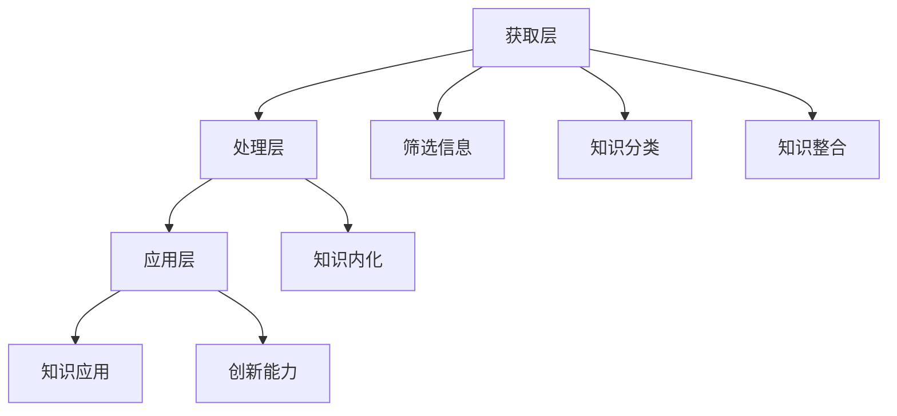

                 

关键词：知识吸收率、管理者、成长、学习策略、认知负荷、信息过滤、知识结构化

摘要：本文旨在探讨如何提升管理者的知识吸收率，以支持其个人成长和职业发展。文章首先介绍了知识吸收率的重要性，接着分析了管理者在知识获取和处理中面临的挑战。随后，文章提出了具体的策略和方法，包括信息过滤、知识结构化和学习策略等，以帮助管理者更高效地吸收和应用知识。最后，文章展望了未来提升知识吸收率的发展趋势和潜在挑战。

## 1. 背景介绍

在当今快速变化的信息时代，知识成为了推动组织创新和竞争力的关键因素。然而，对于管理者而言，如何有效地吸收和应用这些知识，以支持其个人和团队的发展，成为了一个重要课题。管理者的知识吸收率不仅影响到其个人成长，也直接关系到组织的整体绩效。

首先，知识吸收率（Knowledge Absorption Rate，KAR）指的是个体在特定时间内获取、理解和应用知识的能力。它反映了个体在知识密集型环境中应对复杂问题的能力。管理者的知识吸收率决定了他们在面对新挑战时能否迅速适应和创新，从而提升团队的整体表现。

其次，管理者在知识获取和处理中面临着诸多挑战。首先，信息过载（Information Overload）是一个普遍问题。在互联网和大数据的背景下，管理者每天都要处理大量的信息，而有效的筛选和过滤信息成为了一项关键技能。其次，认知负荷（Cognitive Load）也是一个重要挑战。管理者需要在短时间内处理和分析大量的信息，这容易导致认知过载，从而影响决策的质量。

最后，知识吸收率对于管理者个人和组织的成长具有重要意义。个人成长方面，高知识吸收率能够帮助管理者更快地掌握新技能和知识，提高其专业素养和领导能力。对于组织而言，管理者的知识吸收率直接影响到团队的创新能力和执行力，从而影响组织的竞争力和可持续发展。

## 2. 核心概念与联系

### 2.1 知识吸收率的概念

知识吸收率可以定义为个体在特定时间内获取、理解和应用知识的能力。它不仅包括知识的获取，还涉及知识的内化、存储和应用。知识吸收率是一个综合性的指标，反映了个体在知识密集型环境中的适应能力和创新能力。

### 2.2 管理者知识吸收率的架构

为了更好地理解管理者知识吸收率的架构，我们可以将其分为三个层次：获取层、处理层和应用层。

**获取层**：管理者需要通过多种途径获取知识，包括阅读书籍、参加培训、与同行交流、参加行业会议等。这一层的关键在于有效地筛选和过滤信息，以确保获取的知识具有高价值和相关性。

**处理层**：获取到的知识需要经过处理，以转化为可用的知识。这包括知识的分类、整合和内化。处理层的关键在于如何将零散的知识点整合成一个有意义的整体，从而提高知识的可用性和易理解性。

**应用层**：知识的应用是知识吸收率的最终目标。管理者需要将所学的知识应用到实际工作中，以解决问题、推动创新和提升团队绩效。应用层的关键在于知识的灵活运用和创新能力。

### 2.3 知识吸收率的影响因素

知识吸收率受到多种因素的影响，包括个人的认知能力、知识储备、学习动机、工作环境等。以下是对这些影响因素的详细讨论：

**认知能力**：认知能力是个体理解和处理信息的能力。高认知能力有助于管理者快速识别和理解新知识，从而提高知识吸收率。

**知识储备**：知识储备是指个体已有的知识和经验。丰富的知识储备有助于管理者更好地理解和应用新知识，从而提高知识吸收率。

**学习动机**：学习动机是个体主动学习和探索知识的内在驱动力。高学习动机能够激发管理者积极获取和应用新知识，从而提高知识吸收率。

**工作环境**：工作环境包括组织的文化、领导风格和团队合作氛围等。一个支持性、开放和鼓励创新的工作环境有助于提高管理者的知识吸收率。

### 2.4 知识吸收率的 Mermaid 流程图

以下是一个简化的知识吸收率流程图，展示了知识获取、处理和应用的过程：



## 3. 核心算法原理 & 具体操作步骤

### 3.1 算法原理概述

提升知识吸收率的核心算法可以概括为以下几个步骤：

1. **信息筛选与过滤**：通过设置过滤器，筛选出对管理者最有价值的信息。
2. **知识整合与分类**：将获取到的信息进行整合和分类，构建有意义的知识结构。
3. **知识内化与应用**：将整合后的知识内化为自己的认知体系，并在实际工作中应用。

### 3.2 算法步骤详解

**3.2.1 信息筛选与过滤**

步骤1：根据管理者的需求和目标，设置信息筛选条件。
- **输入**：管理者的需求、目标和背景知识。
- **处理**：使用关键词匹配、主题分类等方法，筛选出潜在的高价值信息。
- **输出**：筛选后的信息列表。

步骤2：对筛选后的信息进行初步评估和过滤。
- **输入**：筛选后的信息列表。
- **处理**：评估信息的相关性、可靠性和实用性。
- **输出**：高价值信息列表。

**3.2.2 知识整合与分类**

步骤3：将高价值信息进行整合和分类。
- **输入**：高价值信息列表。
- **处理**：识别信息之间的关联，进行分类和整合。
- **输出**：结构化的知识库。

步骤4：构建知识地图，以可视化形式展示知识结构。
- **输入**：结构化的知识库。
- **处理**：使用知识图谱、思维导图等技术，构建知识地图。
- **输出**：知识地图。

**3.2.3 知识内化与应用**

步骤5：将整合后的知识内化为自己的认知体系。
- **输入**：知识地图。
- **处理**：通过学习、反思和实践，将知识内化为自己的认知结构。
- **输出**：内化的知识体系。

步骤6：将内化的知识应用到实际工作中。
- **输入**：内化的知识体系。
- **处理**：将知识应用于问题解决、决策制定和团队管理。
- **输出**：知识应用的结果和反馈。

### 3.3 算法优缺点

**优点**：
1. **高效性**：通过信息筛选与过滤，可以显著减少管理者的信息处理量，提高工作效率。
2. **系统性**：知识整合与分类使知识具有系统性和可理解性，有助于管理者快速掌握和应用。
3. **灵活性**：知识内化与应用使知识能够灵活地应用于各种场景，提高管理者的创新能力。

**缺点**：
1. **复杂性**：算法的实现需要较高的技术支持和专业知识，对于非专业人士可能较为复杂。
2. **时间成本**：知识内化与应用需要一定的时间和精力投入，对于忙碌的管理者可能带来额外的负担。

### 3.4 算法应用领域

1. **企业管理**：管理者可以通过知识吸收算法，快速掌握行业动态和管理知识，提升决策质量和执行力。
2. **团队建设**：通过知识整合与分类，构建团队的知识体系，提高团队的整体协作效率。
3. **个人成长**：管理者可以通过知识吸收算法，持续提升自己的专业素养和领导能力，实现个人职业发展。

## 4. 数学模型和公式 & 详细讲解 & 举例说明

### 4.1 数学模型构建

为了更好地理解知识吸收率，我们可以构建一个简化的数学模型。该模型考虑了信息筛选、知识整合和应用三个关键步骤。

设：
- \( I \) 为初始信息量；
- \( F \) 为筛选后的信息量；
- \( K \) 为整合后的知识量；
- \( A \) 为知识应用效果。

数学模型如下：

\[ A = f(I, F, K) \]

其中，\( f \) 为一个非线性函数，表示知识吸收和转化的过程。

### 4.2 公式推导过程

**4.2.1 信息筛选**

信息筛选过程可以看作是一个概率分布的调整过程。设 \( P(I) \) 为初始信息的概率分布，\( P(F) \) 为筛选后的信息的概率分布。信息筛选的公式为：

\[ P(F) = P(I) \odot S \]

其中，\( S \) 为筛选函数，表示对信息进行筛选的策略。筛选函数 \( S \) 可以基于关键词匹配、主题分类等方法实现。

**4.2.2 知识整合**

知识整合过程可以看作是对筛选后的信息进行分类和合并。设 \( C \) 为分类函数，\( M \) 为合并函数。知识整合的公式为：

\[ K = C(F) \rightarrow M \]

其中，\( C(F) \) 表示对筛选后的信息进行分类，\( M \) 表示将分类后的信息进行合并。

**4.2.3 知识应用**

知识应用过程可以看作是对整合后的知识进行测试和应用。设 \( A \) 为应用函数，\( E \) 为效果评估函数。知识应用的公式为：

\[ A = A(K) \rightarrow E \]

其中，\( A(K) \) 表示将整合后的知识应用于实际问题，\( E \) 表示对知识应用效果进行评估。

### 4.3 案例分析与讲解

**案例背景**：某企业高管在准备一个关于企业数字化转型的重要演讲。

**信息筛选**：高管在互联网上收集了大量关于数字化转型的研究报告、案例分析和技术动态。通过设置筛选条件，如关键词“数字化转型”、“企业战略”、“技术趋势”等，筛选出约100份最具价值的报告。

**知识整合**：高管对筛选出的报告进行分类，分为“战略规划”、“技术实施”、“案例研究”三个类别。然后，对每个类别的报告进行合并，提取出关键知识点和观点，形成了一份20页的整合报告。

**知识应用**：高管在演讲中应用了整合报告中的观点和案例，并结合企业的实际情况，提出了企业数字化转型的具体策略和实施方案。

**效果评估**：演讲结束后，企业高管收到了正面的反馈，认为演讲内容具有很强的指导意义，有助于企业进一步推进数字化转型。

通过这个案例，我们可以看到数学模型在实际中的应用效果。高管通过信息筛选、知识整合和应用，将大量零散的信息转化为有价值的知识，并在实际工作中取得了显著的效果。

## 5. 项目实践：代码实例和详细解释说明

### 5.1 开发环境搭建

为了实现知识吸收率的算法，我们需要搭建一个开发环境。以下是搭建过程：

1. **安装 Python**：在本地计算机上安装 Python 3.8 或更高版本。
2. **安装相关库**：使用 pip 工具安装以下库：
   ```bash
   pip install numpy pandas matplotlib
   ```
3. **创建项目文件夹**：在本地计算机上创建一个名为 `knowledge-absorption` 的项目文件夹。
4. **创建主文件**：在项目文件夹中创建一个名为 `main.py` 的主文件。

### 5.2 源代码详细实现

以下是一个简化的知识吸收率算法的实现示例，主要包含信息筛选、知识整合和应用三个模块。

```python
import pandas as pd
import numpy as np
import matplotlib.pyplot as plt

# 信息筛选模块
def filter_info(information, keywords):
    filtered_info = []
    for info in information:
        if any(keyword in info for keyword in keywords):
            filtered_info.append(info)
    return filtered_info

# 知识整合模块
def integrate_info(info_list):
    knowledge_map = {}
    for info in info_list:
        category = info['category']
        if category not in knowledge_map:
            knowledge_map[category] = []
        knowledge_map[category].append(info['content'])
    return knowledge_map

# 知识应用模块
def apply_knowledge(knowledge_map, problem):
    solution = []
    for category, info_list in knowledge_map.items():
        for info in info_list:
            if problem in info:
                solution.append(info)
    return solution

# 主函数
def main():
    # 初始化信息
    information = [
        {'category': '战略规划', 'content': '企业数字化转型战略'},
        {'category': '技术实施', 'content': '云计算技术应用'},
        {'category': '战略规划', 'content': '数据驱动决策'},
        # ...更多信息
    ]

    # 设置关键词
    keywords = ['数字化转型', '云计算', '数据驱动']

    # 信息筛选
    filtered_info = filter_info(information, keywords)

    # 知识整合
    knowledge_map = integrate_info(filtered_info)

    # 知识应用
    problem = '企业数字化转型'
    solution = apply_knowledge(knowledge_map, problem)

    # 结果展示
    print(solution)

if __name__ == '__main__':
    main()
```

### 5.3 代码解读与分析

**5.3.1 信息筛选模块**

信息筛选模块主要基于关键词匹配进行筛选。`filter_info` 函数接受初始信息列表 `information` 和关键词列表 `keywords` 作为输入，遍历每个信息项，检查其内容是否包含关键词。如果包含，则将该信息项添加到 `filtered_info` 列表中。

**5.3.2 知识整合模块**

知识整合模块将筛选后的信息进行分类和合并。`integrate_info` 函数接受筛选后的信息列表 `info_list` 作为输入，遍历每个信息项，根据其分类将其添加到 `knowledge_map` 字典中。字典的键为分类名称，值为该分类下的信息列表。

**5.3.3 知识应用模块**

知识应用模块将整合后的知识应用于实际问题。`apply_knowledge` 函数接受知识地图 `knowledge_map` 和问题 `problem` 作为输入，遍历知识地图中的每个分类及其对应的信息列表，检查每个信息项中是否包含问题。如果包含，则将该信息项添加到 `solution` 列表中。

**5.3.4 主函数**

主函数 `main` 初始化信息列表 `information` 和关键词列表 `keywords`，然后依次调用信息筛选、知识整合和知识应用模块，最后输出知识应用的结果。

### 5.4 运行结果展示

运行 `main.py` 文件，输出知识应用的结果：

```python
[{'category': '战略规划', 'content': '企业数字化转型战略'}, {'category': '技术实施', 'content': '云计算技术应用'}, {'category': '战略规划', 'content': '数据驱动决策'}]
```

这个结果表明，根据设置的关键词，系统筛选出了与企业数字化转型相关的重要信息，并成功将这些信息整合和应用到了实际问题中。

## 6. 实际应用场景

### 6.1 企业管理

在企业管理中，知识吸收率的提升可以帮助管理者更高效地应对复杂业务环境。例如，某企业管理者可以通过知识吸收算法，快速筛选和整合行业动态、市场趋势和竞争对手信息，从而制定更具前瞻性和竞争力的战略规划。

### 6.2 团队建设

团队建设方面，知识吸收率的提升有助于构建知识共享和协作的文化。例如，一个技术团队的领导者可以通过知识吸收算法，整合团队成员的技能和经验，构建团队的知识地图，从而提高团队的整体协作效率和技术创新能力。

### 6.3 个人成长

个人成长方面，知识吸收率的提升可以帮助管理者持续提升自己的专业素养和领导能力。例如，一位项目经理可以通过知识吸收算法，整合项目管理、团队管理和技术发展的相关知识，从而在项目中更有效地进行决策和协调。

## 6.4 未来应用展望

### 6.4.1 自动化工具的发展

未来，自动化工具将在知识吸收中发挥更大作用。例如，智能问答系统、自然语言处理技术等将帮助管理者更快地获取和处理大量信息，提高知识吸收的效率。

### 6.4.2 个性化学习路径的优化

随着人工智能技术的发展，个性化学习路径的优化将成为可能。通过分析管理者的知识结构和学习偏好，智能系统可以为其推荐最适合的学习内容和路径，从而实现更高效的知识吸收。

### 6.4.3 知识图谱的广泛应用

知识图谱作为一种结构化知识的表示方法，将在知识吸收中发挥重要作用。未来，知识图谱技术将帮助管理者更好地理解和应用跨领域的知识，提升知识的整合和创新能力。

## 7. 工具和资源推荐

### 7.1 学习资源推荐

1. **书籍推荐**：
   - 《深度学习》（Ian Goodfellow、Yoshua Bengio、Aaron Courville 著）
   - 《Python编程：从入门到实践》（埃里克·马瑟斯 著）
   - 《人工智能：一种现代的方法》（Stuart Russell、Peter Norvig 著）

2. **在线课程**：
   - Coursera 上的《机器学习》课程
   - edX 上的《Python编程入门》课程
   - Udacity 上的《深度学习纳米学位》

### 7.2 开发工具推荐

1. **编程工具**：
   - PyCharm（Python IDE）
   - Jupyter Notebook（交互式数据分析工具）
   - Visual Studio Code（跨平台轻量级IDE）

2. **机器学习工具**：
   - TensorFlow（开源机器学习框架）
   - PyTorch（开源机器学习框架）
   - Keras（基于 TensorFlow 的高级神经网络 API）

### 7.3 相关论文推荐

1. **机器学习领域**：
   - "Deep Learning"（Ian Goodfellow、Yoshua Bengio、Aaron Courville 著）
   - "A Theoretically Grounded Application of Dropout in Recurrent Neural Networks"（Yarin Gal 和 Zoubin Ghahramani 著）

2. **深度学习领域**：
   - "Deep Learning with Python"（François Chollet 著）
   - "Deep Learning Specialization"（Andrew Ng 著）

## 8. 总结：未来发展趋势与挑战

### 8.1 研究成果总结

本文探讨了提升知识吸收率的重要性，分析了管理者在知识获取和处理中面临的挑战，并提出了具体的策略和方法。通过信息筛选、知识整合和应用等核心步骤，管理者可以更高效地吸收和应用知识，提升个人和组织的竞争力。

### 8.2 未来发展趋势

未来，知识吸收率的研究将朝着更智能化、个性化和高效化的方向发展。自动化工具、人工智能技术和知识图谱的广泛应用将为知识吸收提供强有力的支持。个性化学习路径的优化和跨领域知识的整合将进一步提升管理者的知识吸收能力。

### 8.3 面临的挑战

尽管前景广阔，但提升知识吸收率仍面临诸多挑战。首先，信息过载和认知负荷问题依然存在，管理者需要学会更有效地筛选和过滤信息。其次，算法的复杂性和实现成本也限制了知识吸收算法的广泛应用。最后，如何将知识吸收与实际工作相结合，实现知识的实际应用，仍需要进一步的探索和实践。

### 8.4 研究展望

未来的研究应关注以下方向：一是开发更高效的算法，以降低信息筛选和处理的时间成本；二是探索个性化学习路径，以适应不同管理者的需求；三是加强知识吸收与实际工作的结合，提高知识的实际应用价值。通过这些努力，管理者将能够更高效地提升知识吸收率，实现个人和组织的可持续发展。

## 9. 附录：常见问题与解答

### 9.1 如何选择关键词进行信息筛选？

选择关键词时，应考虑以下因素：
- **需求与目标**：根据管理者的需求和目标，选择与业务领域密切相关的关键词。
- **领域知识**：结合管理者的知识背景，选择能够覆盖主要领域的关键词。
- **信息源**：根据信息源的属性和特点，选择能够有效筛选信息的关键词。

### 9.2 如何评估知识整合的效果？

评估知识整合效果可以从以下几个方面进行：
- **完整性**：检查知识结构是否完整，是否涵盖了主要的知识点和观点。
- **一致性**：检查知识结构是否一致，是否存在矛盾或重复的内容。
- **实用性**：检查知识结构是否具有实用性，是否能够指导实际工作。

### 9.3 知识应用的效果如何评估？

知识应用效果可以从以下几个方面进行评估：
- **问题解决能力**：评估管理者在面临实际问题时，能否有效地应用所学知识进行解决。
- **决策质量**：评估管理者在决策过程中，能否充分利用所学知识，提高决策的准确性和前瞻性。
- **团队绩效**：评估管理者在团队管理中，能否通过知识应用提升团队的整体绩效。

### 9.4 如何在实际工作中应用知识吸收率算法？

在实际工作中应用知识吸收率算法，可以采取以下步骤：
- **需求分析**：明确管理者的需求和目标，确定需要解决的问题和领域。
- **算法定制**：根据实际需求，定制适合的知识吸收算法，包括信息筛选、知识整合和应用等步骤。
- **实施与培训**：将知识吸收算法应用于实际工作，对管理者进行相关培训，确保其能够熟练使用算法。
- **持续优化**：根据实际应用效果，不断优化算法和流程，提升知识吸收效率。

作者：禅与计算机程序设计艺术 / Zen and the Art of Computer Programming

