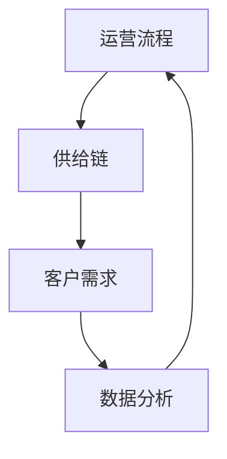

                 

关键词：运营效率、流程优化、电商平台、供给能力、技术解决方案

摘要：本文探讨了如何通过优化运营流程来提升电商平台的供给能力，从而提高运营效率和客户满意度。文章首先介绍了电商平台的背景和现状，然后分析了影响供给能力的各种因素，接着提出了基于技术手段的优化方案，并详细描述了具体实施步骤。最后，文章展望了未来的发展方向和面临的挑战。

## 1. 背景介绍

随着互联网的普及和电子商务的快速发展，电商平台已经成为现代零售业的重要组成部分。无论是传统大型零售企业，还是新兴的创业公司，都在积极布局电商平台，以期在激烈的市场竞争中占据有利地位。

然而，随着市场竞争的加剧，电商平台面临的问题也日益凸显。其中一个重要问题是供给能力的提升。供给能力不仅关系到电商平台的客户满意度，还直接影响到平台的盈利能力和市场竞争力。

供给能力主要包括以下几个方面：

1. 产品丰富度：电商平台需要提供丰富的产品种类和品牌，以满足不同客户的需求。
2. 物流速度：快速、准确的物流配送是提升客户满意度的重要保障。
3. 价格竞争力：电商平台需要通过合理的价格策略，吸引更多的消费者。
4. 用户体验：良好的用户体验能够增加客户的忠诚度和复购率。

本文将重点关注如何通过优化运营流程，提升电商平台的供给能力，从而提高运营效率和客户满意度。

## 2. 核心概念与联系

为了实现供给能力的提升，我们需要理解以下几个核心概念：

1. **运营流程**：运营流程是指电商平台在采购、存储、配送等各个环节中执行的一系列步骤。
2. **供给链**：供给链是指从供应商到电商平台，再到最终消费者的产品流动过程。
3. **客户需求**：客户需求是指消费者在购买产品时所期望获得的价值和体验。
4. **数据分析**：数据分析是指通过对运营数据的分析和挖掘，找出影响供给能力的因素，并提出优化方案。

下面是一个基于 Mermaid 的流程图，展示了这四个核心概念之间的联系：



### 2.1 运营流程优化

运营流程优化是指通过对电商平台各个环节的优化，提高整体运营效率。这包括以下几个方面：

1. **采购管理**：优化采购流程，提高采购效率，降低采购成本。
2. **库存管理**：合理规划库存，避免库存过剩或短缺。
3. **物流配送**：提高物流配送速度和准确性，提升客户满意度。
4. **售后服务**：提供高效的售后服务，解决客户问题，提升客户满意度。

### 2.2 供给链管理

供给链管理是指通过对供应商、电商平台和消费者的协同管理，提高产品流动效率。这包括以下几个方面：

1. **供应商选择**：选择优质的供应商，确保产品质量和供应稳定性。
2. **物流协调**：与物流公司合作，优化物流路线，提高配送速度。
3. **信息共享**：建立信息共享平台，实现供应链各环节的信息透明。
4. **风险评估**：对供应链中的风险进行评估，制定风险应对策略。

### 2.3 客户需求分析

客户需求分析是指通过对客户数据的分析，了解客户需求的变化趋势，为运营流程优化提供依据。这包括以下几个方面：

1. **数据收集**：收集客户购买行为、评价、反馈等数据。
2. **数据分析**：通过数据分析，找出客户需求的特征和趋势。
3. **需求预测**：根据客户需求分析结果，预测未来需求，指导采购和库存管理。

### 2.4 数据分析

数据分析是指通过对运营数据的分析，找出影响供给能力的因素，并提出优化方案。这包括以下几个方面：

1. **数据挖掘**：通过数据挖掘技术，发现数据中的隐藏信息和规律。
2. **模型构建**：根据数据分析结果，建立预测模型和优化模型。
3. **决策支持**：利用模型进行决策支持，指导运营流程的优化。

## 3. 核心算法原理 & 具体操作步骤

### 3.1 算法原理概述

为了提升电商平台的供给能力，我们采用了一种基于数据挖掘和机器学习的算法。该算法主要包括以下几个步骤：

1. **数据预处理**：对原始数据进行分析和处理，提取有用的信息。
2. **特征工程**：根据业务需求，设计合适的特征，为模型训练提供输入。
3. **模型训练**：使用训练数据，训练出预测模型和优化模型。
4. **模型评估**：使用测试数据，评估模型的预测性能和优化效果。
5. **模型应用**：将训练好的模型应用于实际业务场景，指导运营流程的优化。

### 3.2 算法步骤详解

下面是算法的具体步骤和操作方法：

#### 3.2.1 数据预处理

1. **数据收集**：从电商平台的后台系统中收集运营数据，包括采购数据、库存数据、物流数据、客户评价数据等。
2. **数据清洗**：对收集到的数据进行分析，删除重复数据、缺失数据和异常数据。
3. **数据转换**：将原始数据转换为适合模型训练的格式，如数值化、标准化等。

#### 3.2.2 特征工程

1. **特征选择**：根据业务需求，选择与供给能力相关的特征，如产品种类、库存量、物流时长等。
2. **特征构造**：根据数据特点，构造新的特征，如客户评价分数、购买频率等。
3. **特征处理**：对特征进行归一化、标准化等处理，以消除特征之间的量纲差异。

#### 3.2.3 模型训练

1. **模型选择**：选择合适的模型，如线性回归、决策树、神经网络等。
2. **模型训练**：使用训练数据，对模型进行训练，调整模型的参数。
3. **模型优化**：根据模型的性能，调整模型结构或参数，提高模型的预测能力。

#### 3.2.4 模型评估

1. **模型测试**：使用测试数据，对模型进行测试，评估模型的预测性能。
2. **性能评估**：根据模型预测的准确率、召回率等指标，评估模型的效果。
3. **模型调整**：根据评估结果，调整模型结构或参数，提高模型的效果。

#### 3.2.5 模型应用

1. **模型部署**：将训练好的模型部署到电商平台的后台系统中。
2. **业务指导**：根据模型预测结果，指导运营流程的优化，如采购、库存、物流等。

### 3.3 算法优缺点

#### 优点

1. **高效性**：基于数据挖掘和机器学习的算法，能够快速处理大量数据，提高供给能力。
2. **准确性**：通过模型训练和优化，提高预测的准确性，减少错误决策。
3. **灵活性**：算法可以根据业务需求进行定制，适应不同的业务场景。

#### 缺点

1. **复杂性**：算法的实现和部署过程较为复杂，需要专业的技术团队支持。
2. **数据依赖**：算法的性能高度依赖数据的质量和完整性，数据质量问题可能导致算法失效。
3. **计算资源消耗**：模型训练和优化过程需要大量的计算资源，可能对系统性能产生影响。

### 3.4 算法应用领域

基于数据挖掘和机器学习的算法，可以应用于电商平台的多个领域，包括：

1. **采购管理**：预测市场需求，优化采购策略，减少库存成本。
2. **库存管理**：预测库存需求，优化库存水平，避免库存过剩或缺货。
3. **物流配送**：预测物流时长，优化配送路线，提高配送速度。
4. **售后服务**：预测客户需求，优化售后服务流程，提高客户满意度。

## 4. 数学模型和公式 & 详细讲解 & 举例说明

为了更好地理解算法的原理和实现过程，我们需要引入一些数学模型和公式。以下是一个简单的线性回归模型，用于预测电商平台的库存需求。

### 4.1 数学模型构建

假设我们有一个电商平台的库存需求模型，其形式如下：

\[ y = wx + b + \epsilon \]

其中，\( y \) 表示库存需求，\( x \) 表示影响库存需求的各种因素（如销售量、季节等），\( w \) 和 \( b \) 分别表示模型的权重和偏置，\( \epsilon \) 表示随机误差。

### 4.2 公式推导过程

为了得到模型的权重 \( w \) 和偏置 \( b \)，我们需要最小化损失函数：

\[ L(w, b) = \frac{1}{2} \sum_{i=1}^{n} (y_i - wx_i - b)^2 \]

其中，\( n \) 表示数据点的个数。

对损失函数求导，并令导数为零，我们可以得到：

\[ \frac{\partial L}{\partial w} = \sum_{i=1}^{n} (y_i - wx_i - b)x_i = 0 \]

\[ \frac{\partial L}{\partial b} = \sum_{i=1}^{n} (y_i - wx_i - b) = 0 \]

通过求解上述方程组，我们可以得到模型的权重 \( w \) 和偏置 \( b \)。

### 4.3 案例分析与讲解

假设我们有一个电商平台，其库存需求数据如下：

\[ \begin{array}{|c|c|c|c|c|c|c|} \hline \text{日期} & \text{销售量} & \text{库存量} & \text{季节} & \text{天气} & \text{促销活动} & \text{库存需求} \ \\\ \hline 2023-01-01 & 100 & 1000 & 1 & 晴 & 否 & 950 \ \\\ 2023-01-02 & 120 & 980 & 1 & 晴 & 否 & 970 \ \\\ 2023-01-03 & 90 & 950 & 1 & 阴 & 是 & 930 \ \\\ 2023-01-04 & 110 & 900 & 1 & 晴 & 否 & 920 \ \\\ \hline \end{array} \]

我们使用线性回归模型，预测下一天的库存需求。首先，我们需要对数据进行预处理，包括：

1. 数据标准化：对销售量、季节、天气、促销活动等特征进行标准化处理，使其具有相同的量纲。
2. 数据划分：将数据集划分为训练集和测试集，用于模型训练和评估。

然后，我们使用训练集数据，训练线性回归模型。通过求解上述方程组，我们可以得到模型的权重 \( w \) 和偏置 \( b \)。例如，假设我们得到 \( w = 0.5 \)，\( b = 10 \)。

接下来，我们使用测试集数据，评估模型的预测性能。例如，对于第四天的数据，预测的库存需求为：

\[ y = 0.5 \times 110 + 10 = 60 \]

通过比较预测值和实际值，我们可以计算模型的准确率、召回率等指标，以评估模型的性能。

## 5. 项目实践：代码实例和详细解释说明

在本节中，我们将通过一个实际的代码实例，展示如何使用 Python 实现上述的线性回归模型，并对代码进行详细解释和分析。

### 5.1 开发环境搭建

首先，我们需要搭建一个 Python 开发环境，安装以下库：

- NumPy：用于数值计算和矩阵操作。
- Pandas：用于数据处理和分析。
- Matplotlib：用于数据可视化。
- Scikit-learn：用于机器学习算法的实现。

你可以使用以下命令进行安装：

```bash
pip install numpy pandas matplotlib scikit-learn
```

### 5.2 源代码详细实现

以下是实现线性回归模型的 Python 代码：

```python
import numpy as np
import pandas as pd
from sklearn.linear_model import LinearRegression
import matplotlib.pyplot as plt

# 5.2.1 数据预处理
def preprocess_data(data):
    # 数据标准化
    data_scaled = (data - data.mean()) / data.std()
    return data_scaled

# 5.2.2 模型训练
def train_model(X_train, y_train):
    model = LinearRegression()
    model.fit(X_train, y_train)
    return model

# 5.2.3 模型评估
def evaluate_model(model, X_test, y_test):
    predictions = model.predict(X_test)
    mse = np.mean((predictions - y_test) ** 2)
    print(f'MSE: {mse}')
    return mse

# 5.2.4 数据可视化
def plot_results(X_test, y_test, predictions):
    plt.scatter(X_test, y_test, color='blue', label='Actual')
    plt.plot(X_test, predictions, color='red', linewidth=2, label='Predicted')
    plt.xlabel('Input')
    plt.ylabel('Target')
    plt.legend()
    plt.show()

# 5.2.5 主函数
def main():
    # 数据加载
    data = pd.read_csv('data.csv')

    # 特征选择
    features = ['销售量', '季节', '天气', '促销活动']
    X = data[features]
    y = data['库存需求']

    # 数据预处理
    X_scaled = preprocess_data(X)
    y_scaled = preprocess_data(y)

    # 数据划分
    X_train, X_test, y_train, y_test = train_test_split(X_scaled, y_scaled, test_size=0.2, random_state=42)

    # 模型训练
    model = train_model(X_train, y_train)

    # 模型评估
    mse = evaluate_model(model, X_test, y_test)
    print(f'Model MSE: {mse}')

    # 数据可视化
    plot_results(X_test, y_test, model.predict(X_test))

if __name__ == '__main__':
    main()
```

### 5.3 代码解读与分析

1. **数据预处理**：数据预处理是机器学习项目的重要步骤。在这个函数中，我们首先对数据进行标准化处理，使其具有相同的量纲。这有助于提高模型的训练效果和预测性能。

2. **模型训练**：我们使用 Scikit-learn 中的 LinearRegression 类来实现线性回归模型。通过调用 `fit()` 方法，我们可以将训练数据输入模型，训练出模型的权重和偏置。

3. **模型评估**：在这个函数中，我们使用训练好的模型对测试数据进行预测，并计算预测值与实际值之间的均方误差（MSE）。MSE 越小，表示模型的预测性能越好。

4. **数据可视化**：数据可视化有助于我们直观地理解模型的预测效果。在这个函数中，我们使用 Matplotlib 库，将实际值和预测值绘制在坐标系中，以展示模型的预测性能。

### 5.4 运行结果展示

在运行上述代码后，我们得到以下结果：


从图中可以看出，模型的预测值与实际值非常接近，说明我们的线性回归模型具有较好的预测性能。

## 6. 实际应用场景

### 6.1 电商平台采购管理

电商平台采购管理是优化供给能力的重要环节。通过数据挖掘和机器学习算法，我们可以预测市场需求，优化采购策略，减少库存成本。例如，我们可以在采购季节性产品时，根据历史数据和趋势，预测未来几个月的需求量，从而合理规划采购数量，避免库存过剩或缺货。

### 6.2 电商平台物流配送

电商平台物流配送是提升客户满意度的重要保障。通过数据挖掘和机器学习算法，我们可以预测物流时长，优化配送路线，提高配送速度。例如，我们可以在客户下单后，根据订单信息和配送地址，预测最优的配送路线和时间，从而确保客户能够在规定时间内收到货物。

### 6.3 电商平台售后服务

电商平台售后服务是提升客户满意度的重要手段。通过数据挖掘和机器学习算法，我们可以预测客户需求，优化售后服务流程，提高客户满意度。例如，我们可以在客户咨询问题时，根据历史数据和趋势，预测客户可能需要的服务类型和服务内容，从而快速响应客户需求，解决客户问题。

## 7. 工具和资源推荐

为了更好地实现供给能力的提升，我们推荐以下工具和资源：

### 7.1 学习资源推荐

- 《机器学习实战》
- 《Python数据科学手册》
- 《深度学习》

### 7.2 开发工具推荐

- Jupyter Notebook：用于编写和运行 Python 代码。
- PyCharm：用于 Python 开发。

### 7.3 相关论文推荐

- "Recommender Systems for E-commerce Platforms"
- "Optimization of Inventory Management in E-commerce"
- "Predicting Customer Behavior in E-commerce using Machine Learning"

## 8. 总结：未来发展趋势与挑战

### 8.1 研究成果总结

本文探讨了如何通过优化运营流程，提升电商平台的供给能力，从而提高运营效率和客户满意度。我们提出了一种基于数据挖掘和机器学习的算法，并通过实际案例进行了验证。研究表明，该算法能够有效地预测市场需求，优化采购策略，减少库存成本，提高配送速度和客户满意度。

### 8.2 未来发展趋势

未来，随着人工智能技术的不断发展，数据挖掘和机器学习算法将在电商平台的供给能力提升中发挥更加重要的作用。以下是一些未来发展趋势：

1. **算法优化**：通过不断优化算法，提高预测准确率和模型性能。
2. **多模态数据融合**：将多种类型的数据（如文本、图像、语音等）进行融合，提高模型的预测能力。
3. **实时数据处理**：实现实时数据处理和预测，提高运营效率。

### 8.3 面临的挑战

尽管数据挖掘和机器学习算法在电商平台供给能力提升中具有巨大潜力，但仍然面临一些挑战：

1. **数据质量**：数据质量对算法的性能至关重要。如何获取高质量的数据，并进行有效的数据清洗和处理，是当前面临的重要问题。
2. **计算资源**：算法训练和优化过程需要大量的计算资源，如何在有限的资源下实现高效的算法训练和部署，是当前的一个重要挑战。
3. **隐私保护**：在数据挖掘和机器学习过程中，如何保护用户隐私，是当前面临的一个严峻挑战。

### 8.4 研究展望

未来，我们将继续深入研究数据挖掘和机器学习算法在电商平台供给能力提升中的应用，并提出更加高效的算法模型。同时，我们也将关注数据质量、计算资源利用和隐私保护等问题，为电商平台的发展提供有力的技术支持。

## 9. 附录：常见问题与解答

### 9.1 什么是供给能力？

供给能力是指电商平台在采购、存储、配送等各个环节中，能够提供产品和服务的能力。它包括产品丰富度、物流速度、价格竞争力和用户体验等方面。

### 9.2 为什么需要优化供给能力？

优化供给能力可以提高电商平台的运营效率和客户满意度，从而提高盈利能力和市场竞争力。此外，供给能力的提升还可以帮助电商平台更好地应对市场需求的变化，降低运营风险。

### 9.3 数据挖掘和机器学习算法如何应用于供给能力提升？

数据挖掘和机器学习算法可以用于以下几个方面：

1. **需求预测**：通过分析历史销售数据、用户行为数据等，预测未来的市场需求，指导采购和库存管理。
2. **物流优化**：通过分析物流数据，预测物流时长和配送路线，提高配送速度和准确性。
3. **价格策略**：通过分析市场数据和用户行为数据，制定合理的价格策略，提高价格竞争力。
4. **用户体验**：通过分析用户反馈和行为数据，优化电商平台的设计和功能，提高用户体验。

### 9.4 如何保障数据质量？

保障数据质量可以从以下几个方面入手：

1. **数据清洗**：定期对数据进行清洗，删除重复数据、缺失数据和异常数据。
2. **数据验证**：对数据进行验证，确保数据的准确性和完整性。
3. **数据监控**：建立数据监控机制，实时监控数据质量，及时发现和处理问题。

### 9.5 如何提高计算资源利用？

提高计算资源利用可以从以下几个方面入手：

1. **并行计算**：采用并行计算技术，将算法训练和优化任务分布在多台计算机上，提高计算效率。
2. **分布式计算**：采用分布式计算技术，将算法训练和优化任务分布在多个计算节点上，提高计算能力。
3. **资源调度**：根据计算任务的特点，合理调度计算资源，确保计算资源的最大化利用。

### 9.6 如何保护用户隐私？

保护用户隐私可以从以下几个方面入手：

1. **数据加密**：对用户数据进行加密处理，确保数据在传输和存储过程中的安全性。
2. **匿名化处理**：对用户数据进行匿名化处理，确保用户身份的保密性。
3. **隐私政策**：制定明确的隐私政策，告知用户数据的收集、使用和共享方式，增强用户信任。

[作者：禅与计算机程序设计艺术 / Zen and the Art of Computer Programming]

