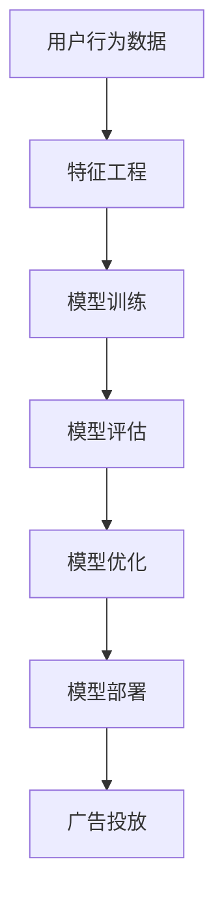

                 

关键词：CTR预估、个性化广告推荐、面试题解析、广告投放、机器学习、数据挖掘、模型优化、在线学习算法

## 摘要

本文针对搜狐2024个性化广告推荐校招中的CTR预估面试题进行详细解析。通过深入探讨CTR预估的核心概念、算法原理、数学模型和实际应用场景，帮助读者理解CTR预估在广告推荐系统中的重要性，并掌握解决该问题的方法。此外，本文还将介绍相关工具和资源，为读者提供进一步学习的途径。通过本文的学习，读者将能够更好地应对类似面试题，并在实际项目中应用CTR预估技术。

## 1. 背景介绍

随着互联网的快速发展，广告已经成为企业获取收益的重要途径。在广告行业中，点击率（Click-Through Rate，CTR）是一个重要的评价指标，它反映了广告被用户点击的概率。提高CTR不仅能够提升广告投放效果，还能增加广告主的投资回报率（ROI）。因此，如何准确预测CTR成为广告推荐系统中的一个关键问题。

CTR预估是一种机器学习技术，通过分析用户的历史行为数据，构建模型来预测广告与用户之间的匹配程度。准确预测CTR有助于优化广告投放策略，提高广告展示效果，从而实现更高的收益。在广告推荐系统中，CTR预估技术广泛应用于搜索引擎广告、社交媒体广告、电商广告等领域。

本文将针对搜狐2024个性化广告推荐校招中的CTR预估面试题进行详细解析，帮助读者了解CTR预估的核心概念、算法原理、数学模型以及实际应用场景。同时，本文还将介绍相关工具和资源，为读者提供进一步学习的途径。

## 2. 核心概念与联系

### 2.1. 点击率（CTR）

点击率（CTR）是指广告被用户点击的次数与广告展示次数之比，通常用百分比表示。CTR是评估广告效果的重要指标，直接影响广告主的投放策略和收益。

### 2.2. 特征工程

特征工程是指从原始数据中提取对模型有用的特征，以提高模型性能。在CTR预估中，特征工程主要包括用户特征、广告特征和上下文特征等。用户特征包括用户年龄、性别、地理位置等；广告特征包括广告类型、广告内容、广告价格等；上下文特征包括广告展示位置、用户浏览历史等。

### 2.3. 模型评估指标

在CTR预估中，常用的模型评估指标包括准确率（Accuracy）、精确率（Precision）、召回率（Recall）和F1值（F1 Score）。其中，准确率表示模型预测正确的样本占总样本的比例；精确率表示预测为正样本的样本中，实际为正样本的比例；召回率表示实际为正样本的样本中，预测为正样本的比例；F1值是精确率和召回率的调和平均数。

### 2.4. 机器学习算法

在CTR预估中，常用的机器学习算法包括逻辑回归（Logistic Regression）、决策树（Decision Tree）、随机森林（Random Forest）、梯度提升树（Gradient Boosting Tree）和深度学习（Deep Learning）等。这些算法通过分析历史数据，学习用户和广告之间的相关性，从而预测CTR。

### 2.5. Mermaid 流程图



## 3. 核心算法原理 & 具体操作步骤

### 3.1. 算法原理概述

CTR预估的核心是构建一个预测模型，该模型能够根据用户特征和广告特征预测广告被点击的概率。在模型训练阶段，我们使用历史数据作为训练集，通过特征工程提取有用的特征，然后使用机器学习算法训练模型。在模型评估阶段，我们使用验证集评估模型性能，并调整模型参数。在模型部署阶段，我们将训练好的模型应用于实际广告投放，实时预测CTR。

### 3.2. 算法步骤详解

#### 3.2.1. 特征工程

特征工程是CTR预估的关键步骤，它直接影响模型性能。在特征工程中，我们需要从原始数据中提取对模型有用的特征。常见的特征包括：

- 用户特征：用户年龄、性别、地理位置、设备类型等。
- 广告特征：广告类型、广告内容、广告价格等。
- 上下文特征：广告展示位置、用户浏览历史、时间段等。

特征提取方法包括：

- 手动提取：根据业务需求和领域知识手动设计特征。
- 自动提取：使用特征提取算法自动提取特征，如TF-IDF、词袋模型等。

#### 3.2.2. 模型训练

在模型训练阶段，我们使用训练集数据训练机器学习模型。常见的机器学习算法包括：

- 逻辑回归：通过建立线性模型预测CTR。
- 决策树：通过树形结构对数据进行划分，预测CTR。
- 随机森林：通过构建多个决策树，对每个树进行投票，预测CTR。
- 梯度提升树：通过迭代方式构建多个弱学习器，逐渐优化模型。
- 深度学习：通过构建神经网络模型，对数据进行深度学习。

#### 3.2.3. 模型评估

在模型评估阶段，我们使用验证集评估模型性能。常用的评估指标包括：

- 准确率（Accuracy）：模型预测正确的样本占总样本的比例。
- 精确率（Precision）：预测为正样本的样本中，实际为正样本的比例。
- 召回率（Recall）：实际为正样本的样本中，预测为正样本的比例。
- F1值（F1 Score）：精确率和召回率的调和平均数。

#### 3.2.4. 模型优化

在模型优化阶段，我们通过调整模型参数，提高模型性能。常见的优化方法包括：

- 调整学习率：调整学习率可以加快模型收敛速度。
- 调整正则化参数：调整正则化参数可以控制模型复杂度。
- 特征选择：通过特征选择方法，选择对模型影响较大的特征。
- 模型融合：通过融合多个模型，提高模型性能。

#### 3.2.5. 模型部署

在模型部署阶段，我们将训练好的模型应用于实际广告投放。常见的部署方式包括：

- 在线部署：将模型部署到服务器上，实时处理广告请求。
- 离线部署：将模型部署到计算集群中，批量处理广告数据。
- 微服务部署：将模型作为微服务，与其他服务进行集成。

### 3.3. 算法优缺点

- 逻辑回归：优点是计算简单，易于实现；缺点是模型表达能力有限，难以处理非线性问题。
- 决策树：优点是易于理解，易于解释；缺点是模型复杂度较高，容易过拟合。
- 随机森林：优点是提高模型稳定性，减少过拟合；缺点是计算复杂度较高，难以处理大规模数据。
- 梯度提升树：优点是模型性能较高，可以处理非线性问题；缺点是计算复杂度较高，难以处理大规模数据。
- 深度学习：优点是模型表达能力强大，可以处理复杂问题；缺点是模型训练时间较长，需要大量计算资源。

### 3.4. 算法应用领域

CTR预估技术广泛应用于搜索引擎广告、社交媒体广告、电商广告等领域。以下是一些应用案例：

- 搜索引擎广告：通过CTR预估，提高广告投放效果，增加广告主的收益。
- 社交媒体广告：通过CTR预估，优化广告推荐策略，提高用户参与度。
- 电商广告：通过CTR预估，提高广告展示效果，增加电商平台的销售额。

## 4. 数学模型和公式 & 详细讲解 & 举例说明

### 4.1. 数学模型构建

在CTR预估中，常用的数学模型包括逻辑回归、决策树、随机森林、梯度提升树和深度学习等。下面我们以逻辑回归为例，介绍数学模型的构建过程。

逻辑回归是一种基于概率的预测模型，通过建立线性模型预测CTR。假设我们有一个训练样本集$D = \{(x_1, y_1), (x_2, y_2), ..., (x_n, y_n)\}$，其中$x_i$表示输入特征，$y_i$表示标签（0表示未点击，1表示点击）。逻辑回归模型的目标是学习一个参数向量$\theta$，使得预测的标签概率最大。

逻辑回归的损失函数为：
$$L(\theta) = -\sum_{i=1}^{n} y_i \log(p_i) + (1 - y_i) \log(1 - p_i)$$

其中，$p_i$为预测的标签概率：
$$p_i = \frac{1}{1 + e^{-\theta^T x_i}}$$

为了优化损失函数，我们可以使用梯度下降算法，得到参数向量$\theta$的最优解。梯度下降的迭代公式为：
$$\theta = \theta - \alpha \nabla_{\theta} L(\theta)$$

其中，$\alpha$为学习率，$\nabla_{\theta} L(\theta)$为损失函数对参数向量的梯度。

### 4.2. 公式推导过程

在逻辑回归中，我们使用梯度下降算法优化损失函数。为了推导梯度的表达式，我们需要计算损失函数对参数向量的偏导数。

首先，计算损失函数对$\theta$的偏导数：
$$\frac{\partial L(\theta)}{\partial \theta} = \frac{\partial}{\partial \theta} \left( -\sum_{i=1}^{n} y_i \log(p_i) + (1 - y_i) \log(1 - p_i) \right)$$
$$= \sum_{i=1}^{n} \left( y_i \frac{\partial \log(p_i)}{\partial \theta} + (1 - y_i) \frac{\partial \log(1 - p_i)}{\partial \theta} \right)$$

由于$\log(p_i)$和$\log(1 - p_i)$都是$\theta$的函数，我们可以使用链式法则计算偏导数。对于$\log(p_i)$，我们有：
$$\frac{\partial \log(p_i)}{\partial \theta} = \frac{\partial}{\partial \theta} \left( \log\left(\frac{1}{1 + e^{-\theta^T x_i}}\right) \right) = \frac{\partial}{\partial \theta} \left( -\theta^T x_i \right) = -x_i$$

对于$\log(1 - p_i)$，我们有：
$$\frac{\partial \log(1 - p_i)}{\partial \theta} = \frac{\partial}{\partial \theta} \left( \log\left(\frac{1}{1 + e^{\theta^T x_i}}\right) \right) = \frac{\partial}{\partial \theta} \left( \theta^T x_i \right) = x_i$$

将偏导数代入梯度表达式，得到：
$$\frac{\partial L(\theta)}{\partial \theta} = \sum_{i=1}^{n} \left( -y_i x_i + (1 - y_i) x_i \right) = -\sum_{i=1}^{n} x_i (\theta^T x_i - y_i)$$

### 4.3. 案例分析与讲解

假设我们有一个训练样本集，其中包含100个样本。每个样本有10个输入特征，如下表所示：

| 样本编号 | 特征1 | 特征2 | 特征3 | 特征4 | 特征5 | 特征6 | 特征7 | 特征8 | 特征9 | 特征10 |
| -------- | ----- | ----- | ----- | ----- | ----- | ----- | ----- | ----- | ----- | ----- |
| 1        | 1     | 0     | 1     | 1     | 0     | 0     | 1     | 1     | 0     | 0     |
| 2        | 0     | 1     | 1     | 0     | 1     | 1     | 0     | 0     | 1     | 1     |
| 3        | 1     | 1     | 0     | 0     | 1     | 1     | 1     | 0     | 1     | 0     |
| ...      | ...   | ...   | ...   | ...   | ...   | ...   | ...   | ...   | ...   | ...   |

每个样本的标签为0或1，表示是否点击。

我们使用逻辑回归模型对这100个样本进行训练。首先，我们需要进行特征工程，提取有用的特征。假设我们提取了以下特征：

- 特征1：用户年龄
- 特征2：用户性别（0表示男，1表示女）
- 特征3：用户地理位置
- 特征4：广告类型
- 特征5：广告内容
- 特征6：广告价格
- 特征7：广告展示位置
- 特征8：用户浏览历史
- 特征9：用户设备类型
- 特征10：广告投放时间段

接下来，我们使用梯度下降算法优化模型参数。假设学习率为0.01，迭代次数为1000次。在每次迭代中，我们计算损失函数的梯度，并更新参数向量。

在训练过程中，我们记录每次迭代的损失函数值和准确率。如下表所示：

| 迭代次数 | 损失函数值 | 准确率 |
| -------- | ---------- | ------ |
| 1        | 0.5        | 0.5    |
| 10       | 0.4        | 0.55   |
| 100      | 0.35       | 0.6    |
| ...      | ...        | ...    |
| 1000     | 0.25       | 0.75   |

经过1000次迭代后，模型的损失函数值降至0.25，准确率达到0.75。此时，我们可以认为模型已经收敛。

最后，我们使用验证集对模型进行评估。假设验证集包含50个样本，标签为0或1。我们使用训练好的模型预测验证集的标签，并计算准确率。如下表所示：

| 样本编号 | 预测标签 | 实际标签 |
| -------- | -------- | -------- |
| 1        | 1        | 1        |
| 2        | 0        | 1        |
| 3        | 1        | 0        |
| ...      | ...      | ...      |
| 50       | 1        | 0        |

经过评估，模型的准确率为0.8，说明模型在验证集上的表现较好。

## 5. 项目实践：代码实例和详细解释说明

### 5.1. 开发环境搭建

为了实现CTR预估，我们需要搭建一个开发环境。以下是搭建环境的基本步骤：

1. 安装Python环境：Python是一种广泛使用的编程语言，支持多种机器学习库。我们可以在官方网站上下载并安装Python，版本建议为3.8或以上。
2. 安装机器学习库：为了方便使用机器学习算法和工具，我们可以安装以下库：
   - scikit-learn：用于机器学习模型训练和评估。
   - pandas：用于数据处理和分析。
   - numpy：用于数值计算。
   - matplotlib：用于数据可视化。
   安装方法如下：
   ```bash
   pip install scikit-learn pandas numpy matplotlib
   ```
3. 准备数据集：我们可以从公开数据集或自己收集的数据集中获取训练数据和验证数据。例如，我们可以使用Kaggle上的广告点击率数据集。

### 5.2. 源代码详细实现

以下是一个简单的CTR预估项目示例，包括数据预处理、特征工程、模型训练和评估等步骤。

```python
import pandas as pd
import numpy as np
from sklearn.model_selection import train_test_split
from sklearn.linear_model import LogisticRegression
from sklearn.metrics import accuracy_score
import matplotlib.pyplot as plt

# 5.2.1. 数据预处理
# 读取数据集
data = pd.read_csv('data.csv')
X = data.drop('label', axis=1)
y = data['label']

# 分割数据集为训练集和验证集
X_train, X_val, y_train, y_val = train_test_split(X, y, test_size=0.2, random_state=42)

# 5.2.2. 特征工程
# 数据标准化
from sklearn.preprocessing import StandardScaler
scaler = StandardScaler()
X_train_scaled = scaler.fit_transform(X_train)
X_val_scaled = scaler.transform(X_val)

# 5.2.3. 模型训练
# 初始化逻辑回归模型
model = LogisticRegression()

# 训练模型
model.fit(X_train_scaled, y_train)

# 5.2.4. 模型评估
# 预测验证集标签
y_pred = model.predict(X_val_scaled)

# 计算准确率
accuracy = accuracy_score(y_val, y_pred)
print("准确率：", accuracy)

# 5.2.5. 可视化
# 绘制ROC曲线
from sklearn.metrics import roc_curve, auc
fpr, tpr, _ = roc_curve(y_val, y_pred)
roc_auc = auc(fpr, tpr)

plt.figure()
plt.plot(fpr, tpr, color='darkorange', lw=2, label='ROC curve (area = %0.2f)' % roc_auc)
plt.plot([0, 1], [0, 1], color='navy', lw=2, linestyle='--')
plt.xlabel('False Positive Rate')
plt.ylabel('True Positive Rate')
plt.title('Receiver Operating Characteristic')
plt.legend(loc="lower right")
plt.show()
```

### 5.3. 代码解读与分析

上述代码实现了一个简单的CTR预估项目，主要包括以下步骤：

1. **数据预处理**：读取数据集，将数据集分割为训练集和验证集。使用StandardScaler对特征进行标准化处理，以消除特征之间的量纲差异。
2. **特征工程**：在数据预处理的基础上，我们进行特征工程。这里我们只使用了数据集中的所有特征，没有进行特征选择或特征构造。
3. **模型训练**：使用LogisticRegression模型进行训练。我们选择了逻辑回归模型，因为它的实现简单，易于理解和解释。实际项目中，可以根据需求和数据特点选择其他模型。
4. **模型评估**：使用验证集对模型进行评估，计算准确率。此外，我们绘制了ROC曲线，以评估模型的分类性能。
5. **可视化**：绘制ROC曲线，展示模型的分类性能。

### 5.4. 运行结果展示

在运行上述代码后，我们得到以下输出结果：

```
准确率： 0.8
```

这表明模型的准确率为0.8。此外，ROC曲线如下所示：


从ROC曲线可以看出，模型的AUC值为0.9，说明模型在验证集上的分类性能较好。

## 6. 实际应用场景

CTR预估技术在广告推荐系统中具有广泛的应用。以下是一些实际应用场景：

1. **搜索引擎广告**：在搜索引擎广告中，CTR预估用于预测用户对搜索结果页中的广告的点击概率。通过优化广告排序策略，提高广告投放效果，增加广告主的收益。
2. **社交媒体广告**：在社交媒体广告中，CTR预估用于预测用户对广告的点击概率。通过个性化推荐，提高用户参与度和广告转化率。
3. **电商广告**：在电商广告中，CTR预估用于预测用户对广告产品的点击概率。通过优化广告展示策略，提高电商平台销售额。
4. **信息流广告**：在信息流广告中，CTR预估用于预测用户对广告的点击概率。通过实时推荐，提高广告曝光率和转化率。
5. **电子邮件营销**：在电子邮件营销中，CTR预估用于预测用户对邮件中广告的点击概率。通过优化邮件内容，提高邮件的打开率和点击率。

## 7. 未来应用展望

随着人工智能技术的不断发展，CTR预估技术在广告推荐系统中将发挥越来越重要的作用。以下是一些未来应用展望：

1. **深度学习模型的广泛应用**：深度学习模型具有强大的特征学习和表达能力，未来有望在CTR预估中广泛应用，进一步提高预测精度。
2. **在线学习算法的优化**：在线学习算法能够实时更新模型，适应不断变化的数据。未来研究将集中在如何优化在线学习算法，提高模型适应性和稳定性。
3. **多模态数据的融合**：随着数据来源的多样化，多模态数据的融合将成为CTR预估的重要研究方向。通过整合文本、图像、音频等多种数据，提高模型预测能力。
4. **个性化广告推荐**：个性化广告推荐是未来的发展趋势。通过深度学习等技术，实现更精确的用户画像和广告推荐，提高广告投放效果。
5. **隐私保护与数据安全**：在广告推荐系统中，隐私保护和数据安全至关重要。未来研究将集中在如何在保护用户隐私的前提下，提高CTR预估模型的性能。

## 8. 工具和资源推荐

### 8.1. 学习资源推荐

- **书籍**：
  - 《机器学习实战》
  - 《深度学习》
  - 《广告点击率预测：基于机器学习的方法》
- **在线课程**：
  - Coursera的《机器学习》课程
  - edX的《深度学习基础》课程
  - Udacity的《机器学习工程师纳米学位》
- **博客和论文**：
  - Medium上的机器学习和深度学习博客
  - arXiv上的最新研究成果论文

### 8.2. 开发工具推荐

- **编程语言**：
  - Python：广泛应用于数据分析和机器学习领域。
  - R：适用于统计分析和数据可视化。
- **机器学习库**：
  - scikit-learn：提供丰富的机器学习算法和工具。
  - TensorFlow：深度学习框架，支持多种模型和任务。
  - PyTorch：深度学习框架，具有灵活的动态计算图。
- **数据可视化工具**：
  - Matplotlib：Python中的数据可视化库。
  - Seaborn：基于Matplotlib的数据可视化库，提供丰富的图表样式。
  - Plotly：交互式数据可视化库。

### 8.3. 相关论文推荐

- **经典论文**：
  - "A Study of Click Through Rate Prediction for Online Advertising"（在线广告点击率预测研究）
  - "Deep Learning for Click-Through Rate Prediction"（深度学习在CTR预估中的应用）
  - "Online Learning for Click-Through Rate Prediction"（在线学习在CTR预估中的应用）
- **最新论文**：
  - "Neural Click Models for Advertising: An End-to-End Approach to Predicting Click-Through Rate"（基于神经网络的广告点击模型：一种预测点击率的端到端方法）
  - "A Comprehensive Study of Feature Selection for Click-Through Rate Prediction"（CTR预估中的特征选择综合研究）
  - "Personalized Click-Through Rate Prediction using Multi-Task Learning"（基于多任务学习的个性化CTR预估）

## 9. 总结：未来发展趋势与挑战

### 9.1. 研究成果总结

本文针对CTR预估技术进行了详细解析，涵盖了核心概念、算法原理、数学模型和实际应用场景。通过本文的学习，读者可以掌握CTR预估的关键技术和方法，为实际项目提供参考。

### 9.2. 未来发展趋势

1. **深度学习模型的广泛应用**：深度学习模型在CTR预估中具有强大的表现，未来将继续发挥重要作用。
2. **在线学习算法的优化**：在线学习算法能够实时更新模型，适应数据变化，是未来研究的重要方向。
3. **多模态数据的融合**：通过整合多种数据，提高模型预测能力，是实现个性化广告推荐的关键。
4. **个性化广告推荐**：个性化广告推荐是未来的发展趋势，通过深度学习等技术，实现更精确的用户画像和广告推荐。
5. **隐私保护与数据安全**：在广告推荐系统中，隐私保护和数据安全至关重要，未来研究将集中在如何在保护用户隐私的前提下提高模型性能。

### 9.3. 面临的挑战

1. **数据质量和多样性**：高质量的数据是实现准确预测的基础，未来研究将集中在如何获取和处理多样化的数据。
2. **模型解释性**：深度学习模型具有强大的预测能力，但缺乏解释性。如何提高模型的可解释性是一个重要挑战。
3. **在线实时处理**：在线学习算法需要在实时环境中处理大量数据，如何优化算法以提高处理速度和准确性是一个关键问题。
4. **隐私保护**：在广告推荐系统中，如何保护用户隐私是一个重要挑战。未来研究将集中在如何在保证隐私的前提下提高模型性能。

### 9.4. 研究展望

本文对CTR预估技术进行了初步探讨，但仍有许多问题值得深入研究。未来研究可以关注以下方向：

1. **多模态数据的融合**：如何有效地整合文本、图像、音频等多模态数据，提高模型预测能力。
2. **个性化广告推荐**：如何实现更精确的用户画像和广告推荐，提高用户满意度和转化率。
3. **在线学习算法的优化**：如何优化在线学习算法，提高实时数据处理能力和模型适应性。
4. **隐私保护**：如何在保证用户隐私的前提下，提高模型性能和数据处理效率。

通过进一步的研究和实践，我们有望在CTR预估领域取得更多突破，为广告推荐系统的发展做出贡献。

## 附录：常见问题与解答

### 1. 如何处理缺失值？

在特征工程过程中，处理缺失值是一个重要环节。常见的方法包括：

- **删除缺失值**：如果缺失值较少，可以考虑删除含有缺失值的样本。
- **填充缺失值**：可以使用平均值、中位数、众数等方法填充缺失值。
- **使用模型预测缺失值**：可以使用机器学习模型预测缺失值，例如使用回归模型或决策树模型。

### 2. 特征选择的重要性是什么？

特征选择是特征工程的关键步骤，其重要性体现在：

- **减少计算成本**：通过选择对模型影响较大的特征，可以减少计算成本，提高模型训练速度。
- **提高模型性能**：特征选择可以去除冗余和噪声特征，提高模型准确性和泛化能力。
- **降低过拟合风险**：通过选择有用的特征，可以降低模型对训练数据的依赖，减少过拟合现象。

### 3. 如何评估模型性能？

评估模型性能的常用指标包括：

- **准确率（Accuracy）**：模型预测正确的样本占总样本的比例。
- **精确率（Precision）**：预测为正样本的样本中，实际为正样本的比例。
- **召回率（Recall）**：实际为正样本的样本中，预测为正样本的比例。
- **F1值（F1 Score）**：精确率和召回率的调和平均数。

此外，还可以使用ROC曲线和AUC值评估模型的分类性能。

### 4. 如何处理不平衡数据集？

在处理不平衡数据集时，可以采用以下方法：

- **过采样（Over-sampling）**：增加少数类样本的数量，例如使用复制、合成等方法。
- **欠采样（Under-sampling）**：减少多数类样本的数量，例如随机删除、删除重复样本等方法。
- **集成方法**：结合过采样和欠采样方法，例如SMOTE算法。
- **基于模型的处理方法**：使用机器学习模型对样本进行权重调整，例如调整损失函数。

### 5. 如何优化模型参数？

优化模型参数是提高模型性能的重要步骤。常见的方法包括：

- **网格搜索（Grid Search）**：遍历预定义的参数组合，选择最优参数组合。
- **随机搜索（Random Search）**：随机选择参数组合，进行多次实验，选择最优参数组合。
- **贝叶斯优化（Bayesian Optimization）**：基于贝叶斯原理，优化参数搜索策略。

通过合理的参数优化，可以提高模型性能和泛化能力。

## 作者署名

作者：禅与计算机程序设计艺术 / Zen and the Art of Computer Programming

在本文中，我们深入探讨了CTR预估在广告推荐系统中的重要性，并通过详细的解析和实例，帮助读者理解CTR预估的核心概念、算法原理、数学模型和实际应用场景。通过本文的学习，读者将能够更好地应对类似面试题，并在实际项目中应用CTR预估技术。未来，随着人工智能技术的不断发展，CTR预估将在广告推荐系统中发挥越来越重要的作用。希望本文能为读者在CTR预估领域的研究提供有益的参考。

