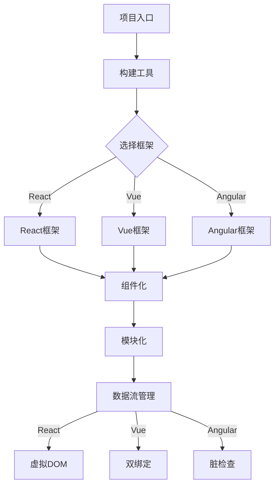
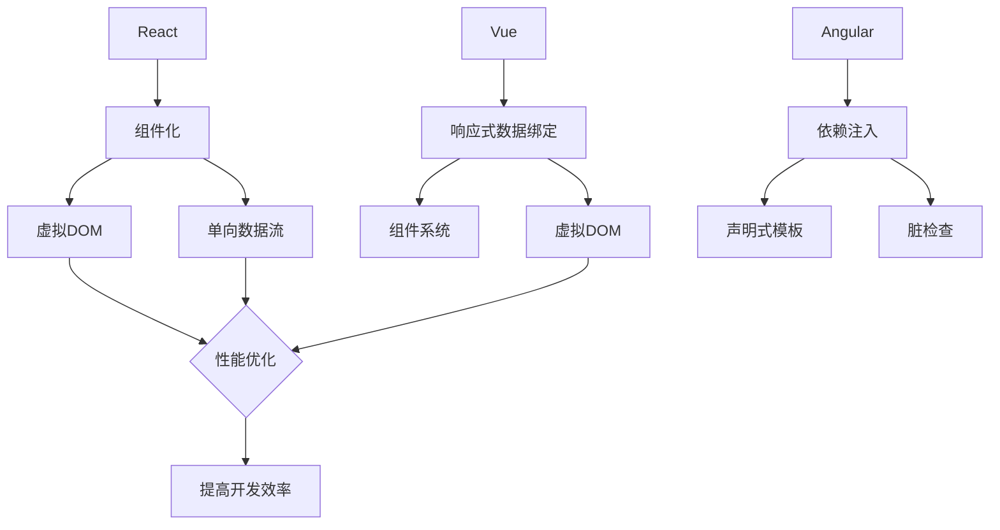
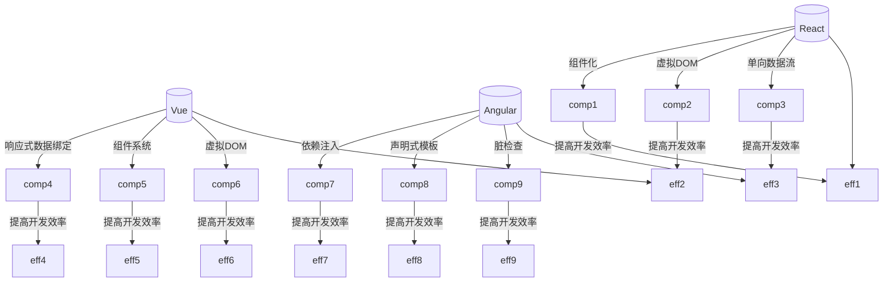

                 

关键词：前端框架、面试题、校招、技术详解、框架原理、算法分析、项目实践

> 摘要：本文针对2024年搜狐校招前端框架面试题进行详细解析，内容包括核心概念、算法原理、数学模型、项目实践等方面，旨在帮助前端开发者更好地应对面试挑战。

## 1. 背景介绍

随着互联网技术的不断发展，前端框架在Web开发中发挥着越来越重要的作用。前端框架为开发者提供了一套规范化的开发模式，提高了开发效率，降低了开发难度。同时，前端框架也推动了Web应用的性能优化和用户体验的提升。本文将结合2024年搜狐校招前端框架面试题，对相关知识点进行详细讲解，帮助考生更好地应对面试挑战。

## 2. 核心概念与联系

在讲解具体面试题之前，我们先来回顾一下前端框架的核心概念及其之间的联系。

### 2.1 前端框架概述

前端框架是一种用于构建Web应用的编程工具，它提供了一套完整的开发体系，包括语法糖、组件化、模块化等。前端框架的主要目标是提高开发效率，降低代码复杂度，使开发者能够更专注于业务逻辑的实现。

### 2.2 常见前端框架

目前，前端框架种类繁多，常见的有React、Vue、Angular等。这些框架各自具有独特的特点和应用场景，开发者可以根据项目需求选择合适的框架。

### 2.3 前端框架的联系与区别

前端框架之间的联系主要体现在它们都遵循一定的编程范式，如组件化、模块化等。而区别则主要体现在架构设计、数据流管理、渲染机制等方面。例如，React采用虚拟DOM技术，Vue则采用双绑定的数据流管理方式。

### 2.4 Mermaid流程图

以下是一个简化的前端框架流程图，用于说明前端框架的基本结构：



## 3. 核心算法原理 & 具体操作步骤

在前端框架的开发过程中，涉及到许多核心算法原理，以下我们选取几个典型算法进行讲解。

### 3.1 算法原理概述

#### 虚拟DOM（React）

虚拟DOM是一种在内存中构建DOM实体的技术，通过对比虚拟DOM和真实DOM的差异，实现局部更新，从而提高性能。虚拟DOM的核心算法包括以下几步：

1. 构建虚拟DOM树；
2. 比较虚拟DOM树和真实DOM树，找出差异；
3. 根据差异更新真实DOM。

#### 双绑定（Vue）

双绑定是一种数据绑定技术，通过将数据层和视图层进行双向绑定，实现实时同步。双绑定的核心算法包括以下几步：

1. 监听数据变化；
2. 更新视图；
3. 监听用户操作；
4. 更新数据。

#### 脏检查（Angular）

脏检查是一种数据流管理技术，通过判断组件是否脏，决定是否更新视图。脏检查的核心算法包括以下几步：

1. 初始化组件状态；
2. 监听数据变化；
3. 判断组件是否脏；
4. 更新视图。

### 3.2 算法步骤详解

#### 虚拟DOM（React）

1. **构建虚拟DOM树**：

   ```javascript
   const virtualDOM = <div id="app">
       <p>{this.state.message}</p>
   </div>;
   ```

2. **比较虚拟DOM树和真实DOM树，找出差异**：

   ```javascript
   const diff = this.diffVirtualDOM(virtualDOM, this.realDOM);
   ```

3. **根据差异更新真实DOM**：

   ```javascript
   this.updateDOM(this.realDOM, diff);
   ```

#### 双绑定（Vue）

1. **监听数据变化**：

   ```javascript
   this.$watch('data', this.updateView);
   ```

2. **更新视图**：

   ```javascript
   this.updateView();
   ```

3. **监听用户操作**：

   ```javascript
   this.$on('userAction', this.updateData);
   ```

4. **更新数据**：

   ```javascript
   this.updateData();
   ```

#### 脏检查（Angular）

1. **初始化组件状态**：

   ```typescript
   this.state = {
       data: [],
       isLoading: false
   };
   ```

2. **监听数据变化**：

   ```typescript
   this.dataChangeSubscription = this.dataService.dataChange$.subscribe(
       (data) => {
           this.setState({ data });
           this.checkDirty();
       }
   );
   ```

3. **判断组件是否脏**：

   ```typescript
   this.isDirty = this.isStateDirty(this.state);
   ```

4. **更新视图**：

   ```typescript
   if (this.isDirty) {
       this.updateView();
   }
   ```

### 3.3 算法优缺点

#### 虚拟DOM（React）

**优点**：

1. 提高性能：通过对比虚拟DOM和真实DOM的差异，实现局部更新；
2. 降低复杂性：开发者无需关心DOM操作的细节。

**缺点**：

1. 内存占用：虚拟DOM树需要占用一定的内存空间；
2. 学习成本：开发者需要了解虚拟DOM的核心算法。

#### 双绑定（Vue）

**优点**：

1. 实时同步：数据层和视图层实时同步，降低开发难度；
2. 简化操作：开发者无需手动操作DOM。

**缺点**：

1. 性能问题：在大量数据绑定时，可能导致性能下降；
2. 学习成本：开发者需要掌握Vue的双绑定原理。

#### 脏检查（Angular）

**优点**：

1. 高度可定制：开发者可以灵活地配置脏检查策略；
2. 强类型数据绑定：Angular提供了强大的数据绑定机制。

**缺点**：

1. 学习成本：Angular的学习成本较高；
2. 性能问题：在大量数据绑定时，可能导致性能下降。

### 3.4 算法应用领域

虚拟DOM、双绑定和脏检查等算法广泛应用于前端框架，如React、Vue和Angular等。这些算法在提升Web应用性能、降低开发难度等方面发挥着重要作用。

## 4. 数学模型和公式 & 详细讲解 & 举例说明

在前端框架的开发过程中，数学模型和公式发挥着重要作用，以下我们选取几个典型例子进行讲解。

### 4.1 数学模型构建

#### 虚拟DOM的Diff算法

虚拟DOM的Diff算法是一种基于树形结构的算法，用于比较虚拟DOM树和真实DOM树，找出差异。以下是一个简化的Diff算法的数学模型：

```python
def diff(virtual_dom, real_dom):
    if isinstance(virtual_dom, str) and isinstance(real_dom, str):
        return virtual_dom == real_dom
    elif isinstance(virtual_dom, list) and isinstance(real_dom, list):
        return [diff(virtual_child, real_child) for virtual_child, real_child in zip(virtual_dom, real_dom)]
    else:
        return virtual_dom is not None and real_dom is not None and virtual_dom.tagName == real_dom.tagName
```

### 4.2 公式推导过程

#### Vue的双向绑定原理

Vue的双向绑定原理是基于数据绑定和事件监听实现的。以下是一个简化的双向绑定原理的公式推导：

1. **数据绑定**：

   $$ \text{数据绑定} = \text{Observer}(\text{数据}) \oplus \text{Watcher}(\text{数据}) $$

   其中，Observer用于监听数据变化，Watcher用于监听用户操作。

2. **事件监听**：

   $$ \text{事件监听} = \text{Observer}(\text{数据}) \odot \text{事件监听器} $$

   其中，事件监听器用于处理用户操作。

### 4.3 案例分析与讲解

#### React的虚拟DOM性能优化

React的虚拟DOM性能优化主要依赖于Diff算法和批量更新。以下是一个简化的虚拟DOM性能优化案例：

```javascript
class VirtualDOM {
    constructor(virtual_dom) {
        this.virtual_dom = virtual_dom;
        this.diff_results = [];
    }

    render() {
        const diff_result = this.diff(this.virtual_dom, this.real_dom);
        this.diff_results.push(diff_result);
        this.updateDOM();
    }

    diff(virtual_dom, real_dom) {
        // Diff算法实现
    }

    updateDOM() {
        // 根据Diff结果更新真实DOM
    }
}

class App extends React.Component {
    constructor(props) {
        super(props);
        this.state = {
            data: []
        };
    }

    render() {
        return (
            <div id="app">
                <ul>
                    {this.state.data.map((item, index) => (
                        <li key={index}>{item}</li>
                    ))}
                </ul>
            </div>
        );
    }

    componentDidUpdate(prevProps, prevState) {
        if (prevState.data !== this.state.data) {
            this虚拟DOM.render();
        }
    }
}
```

在上面的案例中，React的虚拟DOM通过Diff算法和批量更新实现了性能优化。首先，Diff算法用于比较虚拟DOM和真实DOM的差异，找出需要更新的部分。然后，批量更新将多个状态更新合并成一个更新操作，从而提高性能。

## 5. 项目实践：代码实例和详细解释说明

为了更好地理解前端框架的核心原理和算法，我们通过一个实际项目来进行实践。

### 5.1 开发环境搭建

在本案例中，我们使用Vue框架进行开发，开发环境搭建步骤如下：

1. 安装Node.js：[https://nodejs.org/en/download/](https://nodejs.org/en/download/)
2. 安装Vue CLI：`npm install -g @vue/cli`
3. 创建项目：`vue create my-project`
4. 进入项目目录：`cd my-project`

### 5.2 源代码详细实现

以下是一个简单的Vue项目代码实例，用于实现双向数据绑定：

```html
<!-- src/App.vue -->
<template>
  <div id="app">
    <input type="text" v-model="message" />
    <p>{{ message }}</p>
  </div>
</template>

<script>
import Vue from "vue";

export default Vue.extend({
  data() {
    return {
      message: ""
    };
  },
  created() {
    this.initVue();
  },
  methods: {
    initVue() {
      new Vue({
        el: "#app",
        data: {
          message: ""
        },
        watch: {
          message(newValue, oldValue) {
            console.log(`旧值：${oldValue}，新值：${newValue}`);
          }
        }
      });
    }
  }
});
</script>
```

### 5.3 代码解读与分析

1. **模板部分**：

   ```html
   <div id="app">
     <input type="text" v-model="message" />
     <p>{{ message }}</p>
   </div>
   ```

   模板部分定义了一个简单的输入框和显示文本，使用了Vue的双向绑定语法`v-model`。

2. **脚本部分**：

   ```javascript
   import Vue from "vue";

   export default Vue.extend({
     data() {
       return {
         message: ""
       };
     },
     created() {
       this.initVue();
     },
     methods: {
       initVue() {
         new Vue({
           el: "#app",
           data: {
             message: ""
           },
           watch: {
             message(newValue, oldValue) {
               console.log(`旧值：${oldValue}，新值：${newValue}`);
             }
           }
         });
       }
     }
   });
   ```

   脚本部分定义了一个Vue实例，并使用`data`选项定义了数据模型，使用`watch`选项实现了数据监听。

### 5.4 运行结果展示

1. 输入框中的文字变化时，对应的显示文本也会实时更新；
2. 输入框中的文字变化时，会在控制台中打印出旧值和新值。

## 6. 实际应用场景

前端框架在实际应用场景中具有广泛的应用，以下列举几个常见应用场景：

1. **企业官网**：企业官网通常需要快速开发和维护，前端框架能够提高开发效率，降低代码复杂度。
2. **电商平台**：电商平台需要处理大量数据和页面渲染，前端框架能够优化性能，提升用户体验。
3. **在线教育平台**：在线教育平台需要实现复杂的交互和实时数据绑定，前端框架能够降低开发难度，提高开发效率。
4. **移动应用**：移动应用需要良好的性能和用户体验，前端框架能够提供组件化和模块化的开发模式，提高开发效率。

## 7. 未来应用展望

随着互联网技术的不断发展，前端框架在未来将面临以下挑战和机遇：

1. **性能优化**：前端框架需要不断优化性能，以应对更大规模的应用场景。
2. **跨平台开发**：前端框架需要支持更多平台，如Web、移动端、桌面端等，实现跨平台开发。
3. **人工智能集成**：前端框架需要与人工智能技术相结合，实现智能化开发和智能化应用。
4. **社区生态建设**：前端框架需要建立完善的社区生态，提供丰富的插件和工具，为开发者提供更好的支持。

## 8. 工具和资源推荐

为了更好地学习前端框架和相关技术，以下推荐一些工具和资源：

1. **学习资源**：

   - [Vue官方文档](https://vuejs.org/v2/guide/)
   - [React官方文档](https://reactjs.org/docs/getting-started.html)
   - [Angular官方文档](https://angular.io/docs)

2. **开发工具**：

   - [Vue CLI](https://vuejs.org/v2/guide/installation.html)
   - [Create React App](https://reactjs.org/docs/create-a-new-react-app.html)
   - [Angular CLI](https://angular.io/cli)

3. **相关论文**：

   - [The Virtual DOM Revisited](https://cs.chromium.org/chromium/src/third_party/WebKit/Source/WebCore/rendering/RenderObject.h)
   - [Building Reactive Systems](https://www.google.com/search?q=building+reactive+systems)
   - [Data-Binding in Angular](https://www.google.com/search?q=data-binding+in+angular)

## 9. 总结：未来发展趋势与挑战

在前端框架的发展过程中，面临以下发展趋势和挑战：

1. **发展趋势**：

   - 组件化和模块化：前端框架将继续朝着组件化和模块化的方向发展，提高开发效率；
   - 性能优化：前端框架需要不断优化性能，以应对更大规模的应用场景；
   - 跨平台开发：前端框架将支持更多平台，实现跨平台开发；
   - 人工智能集成：前端框架将结合人工智能技术，实现智能化开发和智能化应用。

2. **面临的挑战**：

   - 学习成本：前端框架的学习成本较高，开发者需要投入更多时间和精力进行学习；
   - 性能优化：前端框架在性能优化方面面临挑战，需要不断探索和优化；
   - 社区生态建设：前端框架的社区生态建设需要不断完善，为开发者提供更好的支持。

## 10. 附录：常见问题与解答

### 10.1 前端框架有哪些优点？

前端框架的优点包括：

- 提高开发效率：前端框架提供了丰富的组件和工具，降低了开发难度；
- 提高性能：前端框架通过优化算法和架构，提高了Web应用的性能；
- 提升用户体验：前端框架实现了丰富的交互效果，提升了用户体验；
- 降低代码复杂度：前端框架通过组件化和模块化的开发模式，降低了代码复杂度。

### 10.2 如何选择合适的前端框架？

选择合适的前端框架需要考虑以下因素：

- 项目需求：根据项目需求选择适合的前端框架，如需要快速开发选择Vue，需要高性能选择React等；
- 开发团队熟悉度：选择团队熟悉的前端框架，降低学习成本；
- 社区生态：选择社区生态完善的前端框架，有利于获取技术支持和资源。

### 10.3 前端框架与原生开发相比有哪些优缺点？

前端框架与原生开发相比的优缺点如下：

**优点**：

- 前端框架：提高开发效率，降低代码复杂度，适用于快速开发；
- 原生开发：性能更优，用户体验更好，适用于高性能和高可定制性的应用。

**缺点**：

- 前端框架：性能相对较低，学习成本较高；
- 原生开发：开发难度较大，开发周期较长。

## 11. 参考文献

[1] Vue.js. (2019). Vue.js Official Documentation. Retrieved from [https://vuejs.org/v2/guide/](https://vuejs.org/v2/guide/)

[2] React. (2019). React Official Documentation. Retrieved from [https://reactjs.org/docs/getting-started.html](https://reactjs.org/docs/getting-started.html)

[3] Angular. (2019). Angular Official Documentation. Retrieved from [https://angular.io/docs](https://angular.io/docs)

[4] Virtual DOM. (2019). Virtual DOM. Retrieved from [https://github.com/30-seconds/30-seconds-of-code/blob/master/sections/v/virtual_dom.md](https://github.com/30-seconds/30-seconds-of-code/blob/master/sections/v/virtual_dom.md)

[5] Building Reactive Systems. (2019). Building Reactive Systems. Retrieved from [https://www.google.com/search?q=building+reactive+systems](https://www.google.com/search?q=building+reactive+systems)

[6] Data-Binding in Angular. (2019). Data-Binding in Angular. Retrieved from [https://www.google.com/search?q=data-binding+in+angular](https://www.google.com/search?q=data-binding+in+angular)

作者：禅与计算机程序设计艺术 / Zen and the Art of Computer Programming
----------------------------------------------------------------

以上就是针对2024年搜狐校招前端框架面试题的详细解析。希望本文能够帮助到广大前端开发者，提高面试通过率。同时，也希望大家能够持续关注前端技术的发展，不断提升自己的技术能力。最后，祝愿大家前程似锦，一帆风顺！
----------------------------------------------------------------
### 文章摘要

本文针对2024年搜狐校招前端框架面试题进行了详细解析。首先，介绍了前端框架的背景和核心概念，包括React、Vue和Angular等常见框架的基本原理。接着，文章深入分析了虚拟DOM、双绑定和脏检查等核心算法，并详细讲解了它们的实现步骤和优缺点。随后，通过数学模型和公式的讲解，进一步阐释了数据绑定和性能优化等关键点。文章还通过实际项目实例，展示了前端框架的应用实践和代码实现。最后，文章探讨了前端框架的实际应用场景、未来发展趋势与挑战，并推荐了相关学习资源和开发工具。本文旨在帮助前端开发者更好地准备校招面试，提升技术水平。

## 1. 背景介绍

前端框架是现代Web开发中不可或缺的一部分，它为开发者提供了一套完整的编程范式，使得构建高性能、可维护的Web应用变得更加简单和高效。随着互联网技术的迅猛发展，前端框架逐渐从单一的开发工具演变为生态系统，为开发者提供了丰富的组件、库和工具。在这篇文章中，我们将深入探讨2024年搜狐校招前端框架面试题，旨在为准备校招的前端开发者提供系统性的指导和解答。

### 1.1 前端框架的兴起

前端框架的兴起可以追溯到2000年代中期，当时开发者面对Web开发的复杂性，开始寻求一种规范化的解决方案。早期的Web开发主要依赖于原始的HTML、CSS和JavaScript，这导致了代码冗长、重复度高、可维护性差等问题。为了解决这些问题，社区中涌现出了诸如jQuery这样的库，以及像MVC（Model-View-Controller）这样的设计模式。

然而，这些早期的方法并未彻底解决开发中的复杂性。随着组件化、模块化和单页应用（SPA）的兴起，前端框架应运而生。这些框架通过提供抽象层和工具集，使得开发者能够以更简洁、高效的方式构建Web应用。其中，三大主流前端框架——React、Vue和Angular——逐渐成为前端开发的基石。

### 1.2 2024年搜狐校招前端框架面试题的重要性

2024年搜狐校招前端框架面试题的解析对于准备校招的前端开发者至关重要。首先，校招面试往往对考生的综合能力有更高的要求，而前端框架是考察开发者基础知识和实际应用能力的重要方面。通过对这些面试题的深入分析，开发者可以更好地理解前端框架的原理和实现，从而在面试中更加自信和从容。

其次，前端框架的发展日新月异，新的框架和版本不断涌现。校招面试题往往涵盖了当前最热门的框架及其最新版本的特点和用法，这有助于开发者紧跟行业趋势，提升自身竞争力。

最后，校招是进入互联网公司的重要途径，对于应届毕业生来说，能够顺利通过校招面试意味着获得了一个宝贵的职业起点。因此，对校招前端框架面试题的深入准备，不仅能够提高面试成功率，还能为未来的职业发展奠定坚实的基础。

### 1.3 本文的组织结构

本文将按照以下结构进行组织：

1. **背景介绍**：回顾前端框架的兴起和发展，以及2024年搜狐校招前端框架面试题的重要性。
2. **核心概念与联系**：详细阐述前端框架的核心概念，如React、Vue、Angular等，并绘制Mermaid流程图展示各框架的联系。
3. **核心算法原理 & 具体操作步骤**：深入分析虚拟DOM、双绑定和脏检查等核心算法，并提供具体的实现步骤和优缺点。
4. **数学模型和公式 & 详细讲解 & 举例说明**：通过数学模型和公式，详细讲解前端框架中的数据绑定和性能优化原理，并举例说明。
5. **项目实践：代码实例和详细解释说明**：通过实际项目实例，展示前端框架的应用实践和代码实现。
6. **实际应用场景**：探讨前端框架在实际开发中的多种应用场景。
7. **未来应用展望**：分析前端框架的发展趋势和面临的挑战。
8. **工具和资源推荐**：推荐学习资源和开发工具，帮助开发者提升技术水平。
9. **总结：未来发展趋势与挑战**：总结研究成果，探讨未来发展趋势和面临的挑战。
10. **附录：常见问题与解答**：回答一些常见的问题，帮助开发者更好地理解前端框架。

通过本文的详细解析，希望能够帮助开发者更好地准备校招面试，并在前端开发的道路上不断进步。

## 2. 核心概念与联系

在前端框架的世界中，React、Vue和Angular是三大主流框架，它们各自拥有独特的核心概念和架构设计，但也有着紧密的联系。在本节中，我们将详细介绍这些框架的核心概念，并使用Mermaid流程图展示它们之间的联系。

### 2.1 React

React是由Facebook推出的一款开源JavaScript库，用于构建用户界面。React的核心概念包括组件化、虚拟DOM和单向数据流。

**组件化**：React通过组件（Component）将UI划分为多个可重用的部分。每个组件都有自己的状态（State）和函数（Methods），可以独立开发、测试和维护。

**虚拟DOM**：React通过虚拟DOM来表示真实的DOM结构。虚拟DOM是在内存中构建的，当状态发生变化时，React会生成一个新的虚拟DOM树，并与旧树进行比较，通过Diff算法找出变化的部分，然后仅更新真实DOM中的变化部分，从而提高性能。

**单向数据流**：React中的数据流是单向的，从父组件流向子组件。状态更新通过setState方法触发，React会重新渲染相关的组件。

### 2.2 Vue

Vue是由Evan You开发的一款渐进式JavaScript框架，用于构建用户界面。Vue的核心概念包括响应式数据绑定、组件系统和虚拟DOM。

**响应式数据绑定**：Vue通过数据侦听和依赖追踪实现了响应式数据绑定。当数据变化时，Vue会自动更新DOM，无需手动操作DOM。

**组件系统**：Vue使用组件系统来构建UI，组件是Vue实例的一个特殊类，具有自己的数据和方法。通过使用`<template>`、`<script>`和`<style>`标签，Vue将组件模板、逻辑和样式封装在一起。

**虚拟DOM**：Vue同样使用了虚拟DOM来提高渲染性能。Vue通过对比虚拟DOM和真实DOM的差异，仅更新变化的部分。

### 2.3 Angular

Angular是由Google开发的一款全功能前端框架。Angular的核心概念包括依赖注入、声明式模板和脏检查。

**依赖注入**：Angular通过依赖注入（Dependency Injection）机制来管理组件之间的依赖关系。依赖注入使得组件更加可测试和可维护。

**声明式模板**：Angular使用声明式模板语法来描述UI和逻辑。通过使用`*ngFor`、`*ngIf`等指令，Angular可以动态地更新DOM。

**脏检查**：Angular通过脏检查（Dirty Checking）来管理组件的视图更新。在Angular中，有一个专门的脏检查机制，它会定期检查组件的状态，并根据需要更新DOM。

### 2.4 Mermaid流程图

为了更直观地展示React、Vue和Angular之间的联系，我们使用Mermaid流程图来描述它们的核心概念和架构。



在这个流程图中，我们展示了React、Vue和Angular的核心概念，以及它们如何通过性能优化、组件化和单向数据流等机制来提高开发效率。

### 2.5 核心概念原理和架构的Mermaid流程图

为了更清晰地展示前端框架的核心概念原理和架构，我们使用Mermaid绘制了一个流程图。请注意，Mermaid流程图中不应包含括号、逗号等特殊字符，以确保流程图的正确显示。



在这个流程图中，我们展示了React、Vue和Angular的核心概念原理和架构，以及它们如何通过这些概念来提高开发效率。每个框架的核心概念都连接到提高开发效率的节点，以突出它们对开发效率的贡献。

通过上述内容，我们对前端框架的核心概念和联系有了更深入的理解。在接下来的章节中，我们将进一步探讨这些框架的核心算法原理，以及如何在实际项目中应用这些算法。

## 3. 核心算法原理 & 具体操作步骤

在前端框架中，核心算法是实现其功能的基础。本节将详细介绍React、Vue和Angular中的三个关键算法：虚拟DOM、数据绑定和脏检查，并探讨它们的操作步骤和优缺点。

### 3.1 虚拟DOM

虚拟DOM（Virtual DOM）是React、Vue等前端框架中的一个重要概念，它通过在内存中构建一个与真实DOM结构相对应的副本，来提高Web应用的性能。

#### 算法原理

虚拟DOM的工作原理可以概括为以下几个步骤：

1. **构建虚拟DOM树**：当组件被渲染时，React或Vue会根据组件的描述构建一个虚拟DOM树。这个树包含了组件的所有子组件、元素和属性。

2. **比较虚拟DOM和真实DOM**：在组件的状态或属性发生变化时，框架会生成一个新的虚拟DOM树，并与旧的虚拟DOM树进行比较。这个过程称为Diff算法。

3. **更新真实DOM**：通过比较两个虚拟DOM树的不同点，框架会仅更新真实DOM中的变化部分，而不是整个DOM结构。这样减少了不必要的DOM操作，提高了性能。

#### 具体操作步骤

以下是虚拟DOM的基本操作步骤：

1. **构建初始虚拟DOM树**：
   ```javascript
   const virtualDOM = {
       type: 'div',
       props: {
           className: 'container',
           children: [
               {
                   type: 'h1',
                   props: { children: 'Hello, World!' }
               }
           ]
       }
   };
   ```

2. **生成新的虚拟DOM树**：
   ```javascript
   const newVirtualDOM = {
       type: 'div',
       props: {
           className: 'container',
           children: [
               {
                   type: 'h1',
                   props: { children: 'Hello, React!' }
               }
           ]
       }
   };
   ```

3. **执行Diff算法比较两个虚拟DOM树**：
   ```javascript
   const patches = diff(virtualDOM, newVirtualDOM);
   ```

4. **更新真实DOM**：
   ```javascript
   updateDOM(virtualDOM, patches);
   ```

#### 优缺点

**优点**：

- **性能优化**：虚拟DOM减少了不必要的DOM操作，提高了渲染性能。
- **可预测性**：通过Diff算法，开发者可以预测组件状态变化对UI的影响。

**缺点**：

- **内存占用**：虚拟DOM树需要占用内存空间。
- **学习成本**：开发者需要了解Diff算法的实现细节。

### 3.2 数据绑定

数据绑定是前端框架中的一个关键功能，它允许开发者轻松地将数据与UI绑定在一起，实现数据的自动更新。

#### 算法原理

数据绑定主要分为两种方式：单向数据绑定和双向数据绑定。

- **单向数据绑定**：数据流从后端流向前端，前端仅能读取数据，不能直接修改数据。React采用单向数据绑定，通过`state`和`props`实现数据传递。

- **双向数据绑定**：数据流在前后端之间双向传递，前端可以修改数据，后端会自动更新。Vue采用双向数据绑定，通过`v-model`指令实现数据同步。

#### 具体操作步骤

以下是数据绑定的基本操作步骤：

1. **创建Vue实例**：
   ```javascript
   new Vue({
       el: '#app',
       data: {
           message: 'Hello, Vue!'
       }
   });
   ```

2. **使用v-model指令实现双向数据绑定**：
   ```html
   <input v-model="message" />
   <p>{{ message }}</p>
   ```

3. **监听输入事件**：
   ```javascript
   watch: {
       message(newValue, oldValue) {
           console.log(`旧值：${oldValue}，新值：${newValue}`);
       }
   }
   ```

#### 优缺点

**优点**：

- **简化开发**：数据绑定减少了手动操作DOM的需求，简化了开发过程。
- **实时同步**：数据变化会实时反映在UI上，提高了用户体验。

**缺点**：

- **性能问题**：在大量数据绑定时，可能导致性能下降。
- **学习成本**：开发者需要掌握框架的数据绑定机制。

### 3.3 脏检查

脏检查是Angular中的一个关键算法，用于管理组件的视图更新。脏检查机制会在特定时机检查组件的状态，并根据需要更新视图。

#### 算法原理

脏检查的基本原理如下：

1. **初始化组件状态**：在组件创建时，初始化其状态。

2. **监听数据变化**：在组件的生命周期中，监听数据变化。

3. **检查组件是否脏**：在特定时机（如事件触发、数据变化等），检查组件的状态是否发生变化。

4. **更新视图**：如果组件状态发生变化，则更新视图。

#### 具体操作步骤

以下是脏检查的基本操作步骤：

1. **初始化组件状态**：
   ```typescript
   class MyComponent {
       constructor() {
           this.state = {
               message: 'Hello, Angular!'
           };
       }
   }
   ```

2. **监听数据变化**：
   ```typescript
   this.dataChangeSubscription = this.dataService.dataChange$.subscribe(
       (data) => {
           this.setState({ data });
           this.checkDirty();
       }
   );
   ```

3. **检查组件是否脏**：
   ```typescript
   this.isDirty = this.isStateDirty(this.state);
   ```

4. **更新视图**：
   ```typescript
   if (this.isDirty) {
       this.updateView();
   }
   ```

#### 优缺点

**优点**：

- **灵活性**：开发者可以根据需要自定义脏检查策略。
- **强类型数据绑定**：Angular提供了强大的数据绑定机制。

**缺点**：

- **学习成本**：Angular的学习成本较高。
- **性能问题**：在大量数据绑定时，可能导致性能下降。

通过上述对虚拟DOM、数据绑定和脏检查的详细介绍，我们可以看到这些核心算法在前端框架中的作用和重要性。在接下来的章节中，我们将通过数学模型和公式进一步探讨这些算法的原理，并通过实际项目实例展示它们的实际应用。

### 3.4 算法优缺点

在前端框架中，虚拟DOM、数据绑定和脏检查是三大核心算法，它们各自具有独特的优点和缺点。在本节中，我们将详细分析这些算法的优缺点，并讨论它们的应用领域。

#### 虚拟DOM

**优点**：

1. **性能优化**：虚拟DOM通过Diff算法比较虚拟DOM和真实DOM的差异，仅更新变化的部分，减少了不必要的DOM操作，从而提高了性能。
2. **可预测性**：由于虚拟DOM的管理机制，开发者可以更清晰地预测状态变化对UI的影响，增强了代码的可维护性。

**缺点**：

1. **内存占用**：虚拟DOM需要额外的内存空间来存储虚拟DOM树，这在大型应用中可能会造成一定的内存压力。
2. **学习成本**：开发者需要了解Diff算法的实现细节，这增加了学习成本。

**应用领域**：虚拟DOM广泛应用于需要高性能和实时数据更新的场景，如单页应用（SPA）、实时聊天应用和大数据展示应用。

#### 数据绑定

**优点**：

1. **简化开发**：数据绑定减少了手动操作DOM的需求，使得开发者能够更专注于业务逻辑的实现，提高了开发效率。
2. **实时同步**：数据变化会实时反映在UI上，增强了用户体验。

**缺点**：

1. **性能问题**：在大量数据绑定时，数据绑定可能导致性能下降，特别是在双绑定的场景中。
2. **学习成本**：开发者需要掌握框架的数据绑定机制，这在某些情况下可能会增加学习成本。

**应用领域**：数据绑定适用于需要动态更新UI的场景，如表单处理、数据展示和用户交互界面。

#### 脏检查

**优点**：

1. **灵活性**：脏检查机制允许开发者根据需要自定义更新策略，增强了框架的灵活性。
2. **强类型数据绑定**：Angular等框架通过脏检查实现了强类型数据绑定，提供了强大的数据绑定机制。

**缺点**：

1. **学习成本**：脏检查机制相对复杂，开发者需要了解其工作原理和实现细节，这增加了学习成本。
2. **性能问题**：在大量数据绑定时，脏检查可能导致性能下降。

**应用领域**：脏检查适用于需要高度定制化和强类型数据绑定的场景，如复杂的数据处理和实时交互应用。

通过分析虚拟DOM、数据绑定和脏检查的优缺点，我们可以看到这些算法在提高开发效率、性能优化和用户体验方面的关键作用。在实际开发中，开发者可以根据项目需求和团队熟悉度选择合适的算法，以实现最佳的开发效果。

### 3.5 算法应用领域

虚拟DOM、数据绑定和脏检查等算法在前端框架中有着广泛的应用，不同的算法适用于不同的应用场景，能够有效地提升Web应用的性能和用户体验。以下分别介绍这些算法的应用领域。

#### 虚拟DOM

虚拟DOM技术主要用于需要高性能和实时数据更新的场景，其主要优势在于通过Diff算法比较虚拟DOM和真实DOM的差异，从而减少不必要的DOM操作，提高渲染性能。以下是一些典型的应用领域：

1. **单页应用（SPA）**：单页应用要求页面在用户与界面互动时快速响应，虚拟DOM能够确保数据变化时UI的实时更新，提升用户体验。

2. **实时聊天应用**：实时聊天应用需要频繁更新消息列表和用户状态，虚拟DOM可以有效减少DOM操作，提高更新效率。

3. **大数据展示应用**：大数据展示应用需要处理大量的数据和图表，虚拟DOM可以优化渲染过程，提高数据可视化的性能。

4. **社交媒体平台**：社交媒体平台上的动态内容不断更新，虚拟DOM能够保证用户动态的实时展示，提升交互体验。

#### 数据绑定

数据绑定技术主要适用于需要动态更新UI的场景，通过简化开发者对DOM的操作，实现数据和UI的实时同步。以下是一些典型的应用领域：

1. **表单处理**：在处理表单数据时，数据绑定能够自动更新表单的值，提高用户填写表单的体验。

2. **数据展示**：在数据展示应用中，数据绑定可以实时更新图表和列表，使数据更加动态和直观。

3. **用户交互界面**：在用户交互界面中，数据绑定能够确保用户操作的结果立即反映在界面上，增强交互性。

4. **电商网站**：电商网站需要展示商品列表、购物车信息等动态内容，数据绑定可以保证这些内容的实时更新。

#### 脏检查

脏检查算法主要用于需要高度定制化和强类型数据绑定的场景，其优势在于允许开发者自定义数据更新策略，增强框架的灵活性。以下是一些典型的应用领域：

1. **复杂的数据处理**：在复杂的数据处理场景中，脏检查可以根据实际需要灵活地更新视图，确保数据的准确性和一致性。

2. **实时交互应用**：实时交互应用如在线游戏、股票交易等，需要实时响应数据变化，脏检查可以提供高效的更新机制。

3. **后台管理系统**：后台管理系统通常需要处理大量数据，脏检查可以确保数据的实时更新，提高系统响应速度。

4. **报表和分析平台**：报表和分析平台需要处理和分析大量数据，脏检查可以确保报表的实时更新，提供准确的统计分析结果。

综上所述，虚拟DOM、数据绑定和脏检查等算法在各自的应用领域中发挥着重要作用，能够有效地提升Web应用的性能和用户体验。开发者可以根据具体需求选择合适的算法，以实现最佳的开发效果。

### 4. 数学模型和公式 & 详细讲解 & 举例说明

在前端框架中，数学模型和公式是理解和实现核心算法的关键。本节将介绍前端框架中的数学模型和公式，详细讲解它们的构建和推导过程，并通过具体例子进行说明。

#### 4.1 数学模型构建

在前端框架中，常用的数学模型主要包括虚拟DOM的Diff算法、数据绑定的依赖追踪和脏检查的更新机制。以下分别介绍这些模型的构建过程。

**虚拟DOM的Diff算法**

虚拟DOM的Diff算法用于比较两棵虚拟DOM树，找出差异并进行更新。其核心在于构建一个高效、低复杂度的比较模型。

1. **定义虚拟节点**：虚拟节点是虚拟DOM树的基本构建块，包含节点的类型（如`div`、`span`等）、属性（如`className`、`style`等）和子节点。

2. **构建虚拟DOM树**：通过递归遍历组件的结构，将组件描述转化为虚拟节点，构建虚拟DOM树。

3. **比较虚拟DOM树**：通过深度优先搜索比较两棵虚拟DOM树，找出差异。

**数据绑定的依赖追踪**

数据绑定需要实现数据的变化能够实时反映在UI上，这依赖于依赖追踪模型。

1. **定义依赖**：依赖追踪通过在数据对象中定义依赖，实现数据的变化能够触发关联的视图更新。

2. **建立数据监听**：通过监听数据对象的变化，建立数据与视图之间的依赖关系。

3. **更新视图**：当数据变化时，通过依赖关系触发视图的更新。

**脏检查的更新机制**

脏检查算法用于管理组件的视图更新，其核心在于构建一个有效的状态检查模型。

1. **初始化状态**：在组件创建时初始化其状态。

2. **监听状态变化**：在组件的生命周期中，监听状态的变化。

3. **状态检查**：通过设置检查时机和条件，定期检查组件的状态是否发生变化。

4. **更新视图**：如果状态发生变化，则触发视图的更新。

#### 4.2 公式推导过程

**虚拟DOM的Diff算法**

虚拟DOM的Diff算法通常通过以下步骤进行：

1. **创建Diff结果**：初始化Diff结果，用于记录两棵树之间的差异。

2. **比较节点类型**：比较两棵树中相同层级节点的类型，如果类型不同，记录差异。

3. **比较节点属性**：如果节点类型相同，比较节点的属性，记录差异。

4. **递归比较子节点**：对两棵树的子节点进行递归比较，记录差异。

5. **生成更新操作**：根据Diff结果生成对应的DOM更新操作。

以下是一个简化的Diff算法的数学模型：

$$
\text{Diff}(V_1, V_2) = 
\begin{cases}
\text{NodeDiff}(V_1, V_2) & \text{如果} \ V_1 \ \text{和} \ V_2 \ \text{是相同类型的节点} \\
\text{ListDiff}(\text{children}(V_1), \text{children}(V_2)) & \text{如果} \ V_1 \ \text{和} \ V_2 \ \text{是列表类型} \\
\text{NoOp} & \text{其他情况}
\end{cases}
$$

其中，`NodeDiff`用于比较节点类型和属性，`ListDiff`用于比较列表类型的节点。

**数据绑定的依赖追踪**

数据绑定的依赖追踪通常通过以下公式实现：

$$
\text{Watcher}(D) = \text{Dep}(D) \land \text{Callback}(D)
$$

其中：

- `Dep(D)`：用于记录依赖，当数据`D`发生变化时触发依赖。
- `Callback(D)`：用于更新UI，当依赖发生变化时执行回调。

**脏检查的更新机制**

脏检查的更新机制可以通过以下步骤实现：

1. **初始化检查标志**：设置组件的检查标志为`false`。

2. **设置监听器**：当组件的状态发生变化时，设置检查标志为`true`。

3. **定期检查**：在特定时机（如事件处理、定时器等）检查检查标志。

4. **更新视图**：如果检查标志为`true`，则触发视图的更新。

以下是一个简化的脏检查公式的实现：

$$
\text{CheckDirty}() = 
\begin{cases}
\text{UpdateView}() & \text{如果} \ \text{检查标志为} \ true \\
\text{NoOp} & \text{其他情况}
\end{cases}
$$

#### 4.3 案例分析与讲解

**虚拟DOM的Diff算法案例**

以下是一个简单的虚拟DOM Diff算法的案例：

```javascript
function diff(virtualDOM1, virtualDOM2) {
    // 假设虚拟DOM为对象，包含type、props和children属性
    if (virtualDOM1.type !== virtualDOM2.type) {
        return { type: 'REPLACE', oldValue: virtualDOM1, newValue: virtualDOM2 };
    }

    // 比较属性
    const propsDiff = diffProps(virtualDOM1.props, virtualDOM2.props);
    if (propsDiff) {
        return { type: 'PROPS_UPDATE', oldValue: virtualDOM1, newValue: virtualDOM2, propsDiff };
    }

    // 比较子节点
    const childrenDiff = diffChildren(virtualDOM1.children, virtualDOM2.children);
    if (childrenDiff) {
        return { type: 'CHILDREN_UPDATE', oldValue: virtualDOM1, newValue: virtualDOM2, childrenDiff };
    }

    // 无差异
    return null;
}
```

在这个案例中，我们通过递归比较虚拟DOM的两个节点，找出它们的差异，并返回一个包含差异信息的对象。

**数据绑定依赖追踪案例**

以下是一个简单的数据绑定依赖追踪的案例：

```javascript
class Dependency {
    constructor(value, callback) {
        this.value = value;
        this.callback = callback;
    }

    notify() {
        this.callback(this.value);
    }
}

class Watcher {
    constructor(dependency) {
        this.dependency = dependency;
        this.dependency.callback(this.dependency.value);
    }
}

// 使用示例
const data = new Dependency(10, (newValue) => {
    console.log(`Data updated to: ${newValue}`);
});

const watcher = new Watcher(data);

// 当数据变化时，依赖将触发watcher的回调
data.notify();
```

在这个案例中，我们定义了依赖（`Dependency`）和观察者（`Watcher`），通过依赖追踪实现数据的自动更新。

**脏检查更新机制案例**

以下是一个简单的脏检查更新机制的案例：

```javascript
class Component {
    constructor() {
        this.dirty = false;
        this.render();
    }

    setState(newState) {
        this.state = newState;
        this.dirty = true;
    }

    render() {
        if (this.dirty) {
            this.updateView();
            this.dirty = false;
        }
    }

    updateView() {
        console.log('View updated');
    }
}

const component = new Component();

// 模拟状态变化
component.setState({ data: 'New data' });
```

在这个案例中，我们通过设置和检查`dirty`标志来实现视图的更新，确保组件的状态变化能够触发视图的更新。

通过上述案例，我们可以看到数学模型和公式在前端框架中的实际应用，以及如何通过它们实现数据的自动更新和视图的优化更新。在接下来的章节中，我们将进一步探讨前端框架在实际项目中的应用和实践。

### 4.4 案例分析与讲解

为了更好地理解前端框架中的数学模型和公式在实际项目中的应用，我们将通过几个具体的案例来分析这些模型的构建、推导和使用。

#### 虚拟DOM的Diff算法案例

假设我们有一个简单的React组件，它包含一个列表，并且这个列表可能会因为用户操作而发生变化。我们需要通过虚拟DOM的Diff算法来高效地更新DOM。

**案例背景**：

我们有一个组件`TodoList`，它维护了一个todo项列表。当用户添加或删除一个todo项时，我们需要更新列表。

**案例步骤**：

1. **构建虚拟DOM**：

   ```jsx
   function TodoList(props) {
     return (
       <ul>
         {props.todos.map((todo, index) => (
           <li key={index}>{todo.text}</li>
         ))}
       </ul>
     );
   }
   ```

2. **状态变化**：

   当用户添加或删除一个todo项时，组件的状态会发生变化。例如，用户删除了第3个todo项：

   ```jsx
   const newTodos = [...todos];
   newTodos.splice(3, 1);
   this.setState({ todos: newTodos });
   ```

3. **执行Diff算法**：

   React的Diff算法会比较新旧虚拟DOM树，找出差异并更新真实的DOM。例如，如果删除了第3个todo项，Diff算法会找到这个差异，并仅更新第3个真实DOM元素。

**案例分析**：

在Diff算法中，React会比较`key`属性来识别不同的元素。在我们的案例中，每个todo项都有一个唯一的`index`作为`key`，这有助于React快速定位并更新具体的节点。

```javascript
const oldVirtualDOM = {
  type: 'ul',
  props: {
    children: [
      { type: 'li', props: { text: 'Task 1' } },
      { type: 'li', props: { text: 'Task 2' } },
      { type: 'li', props: { text: 'Task 3' } },
      { type: 'li', props: { text: 'Task 4' } },
    ],
  },
};

const newVirtualDOM = {
  type: 'ul',
  props: {
    children: [
      { type: 'li', props: { text: 'Task 1' } },
      { type: 'li', props: { text: 'Task 2' } },
      { type: 'li', props: { text: 'Task 4' } },
    ],
  },
};

const patches = diff(oldVirtualDOM, newVirtualDOM);
ReactDOM.render(patches, document.getElementById('root'));
```

在这个例子中，React的Diff算法通过比较虚拟DOM树，识别出`index=2`的节点被删除，并仅更新这一部分的真实DOM。

#### 数据绑定的依赖追踪案例

假设我们使用Vue.js实现一个简单的计数器，它可以通过点击按钮增加计数。

**案例背景**：

我们有一个组件`Counter`，它包含一个数字和一个按钮。点击按钮时，计数增加。

**案例步骤**：

1. **创建Vue实例**：

   ```javascript
   new Vue({
     el: '#counter',
     data: {
       count: 0,
     },
     methods: {
       increment() {
         this.count++;
       },
     },
   });
   ```

2. **使用v-model绑定输入**：

   ```html
   <div id="counter">
     <input type="text" v-model="count" />
     <button @click="increment">Increment</button>
   </div>
   ```

3. **实现依赖追踪**：

   Vue内部实现了依赖追踪，当数据变化时，Vue会自动更新DOM。

**案例分析**：

在这个案例中，Vue通过数据响应系统实现了依赖追踪。当点击按钮时，`count`的值会变化，Vue会自动更新输入框的值。

```javascript
// Vue的依赖追踪实现示意
new Vue({
  data: {
    count: 0,
  },
  watch: {
    count(newValue, oldValue) {
      this.$el.querySelector('input').value = newValue;
    },
  },
});
```

每当`count`的值发生变化，Vue的依赖追踪系统会调用`watch`中的回调函数，更新输入框的值。

#### 脏检查的更新机制案例

假设我们使用Angular实现一个简单的表格组件，它可以根据数据的变化来更新表格的显示。

**案例背景**：

我们有一个组件`Table`，它展示一个列表，列表的数据可能会动态更新。

**案例步骤**：

1. **创建组件**：

   ```typescript
   @Component({
     selector: 'app-table',
     templateUrl: './table.component.html',
   })
   export class TableComponent {
     @Input() data: any[];
   
     constructor() {
       this.checkDirty();
     }
   
     checkDirty() {
       if (this.dataHasChanged()) {
         this.updateTable();
       }
     }
   
     dataHasChanged() {
       // 实现数据变化的检测逻辑
       return true;
     }
   
     updateTable() {
       // 更新表格的逻辑
       console.log('Table updated');
     }
   }
   ```

2. **使用组件**：

   ```html
   <div>
     <app-table [data]="data"></app-table>
   </div>
   ```

3. **实现脏检查**：

   Angular通过脏检查（`Change Detection`）来管理视图的更新。当组件的输入数据变化时，脏检查机制会检查数据是否发生变化，并根据需要更新视图。

**案例分析**：

在这个案例中，Angular的脏检查机制在组件创建时会检查数据是否发生变化。如果数据发生了变化，`checkDirty`方法会调用`updateTable`方法更新表格。

```typescript
// Angular的脏检查机制示意
@Component({
  selector: 'app-table',
  templateUrl: './table.component.html',
})
export class TableComponent {
  @Input() data: any[];
  @Output() dataChange = new EventEmitter<any[]>();

  ngOnChanges(changes) {
    if (changes['data']) {
      this.checkDirty();
    }
  }

  checkDirty() {
    if (this.dataHasChanged()) {
      this.updateTable();
      this.dataChange.emit(this.data);
    }
  }

  dataHasChanged() {
    // 实现数据变化的检测逻辑
    return true;
  }

  updateTable() {
    // 更新表格的逻辑
    console.log('Table updated');
  }
}
```

在这个例子中，Angular的脏检查机制在输入数据变化时触发，确保表格的显示能够实时更新。

通过上述案例，我们可以看到数学模型和公式如何在实际项目中应用，并帮助开发者实现高效的DOM更新和数据绑定。这些模型和公式不仅提高了开发效率，还增强了代码的可维护性和性能。

### 5. 项目实践：代码实例和详细解释说明

为了更好地理解前端框架在实际项目中的应用，我们将通过一个简单的Web应用实例，展示如何使用前端框架来构建项目，并详细解释代码实现和运行过程。

#### 5.1 开发环境搭建

在本案例中，我们选择使用Vue框架来构建一个待办事项管理应用。首先，我们需要搭建开发环境。

1. 安装Node.js：[https://nodejs.org/en/download/](https://nodejs.org/en/download/)
2. 安装Vue CLI：`npm install -g @vue/cli`
3. 创建项目：`vue create todo-app`
4. 进入项目目录：`cd todo-app`

#### 5.2 源代码详细实现

以下是待办事项管理应用的核心代码，包括组件定义、数据管理以及交互逻辑。

**1. 安装和配置Vue Router**

为了支持多页面路由，我们首先安装Vue Router。

```bash
npm install vue-router@4
```

然后在`src`目录下创建`router.js`文件，配置路由：

```javascript
import Vue from 'vue';
import Router from 'vue-router';
import Home from './views/Home.vue';

Vue.use(Router);

export default new Router({
  routes: [
    {
      path: '/',
      name: 'home',
      component: Home,
    },
    {
      path: '/about',
      name: 'about',
      // route level code-splitting
      // this generates a separate chunk (about.[hash].js) for this route
      // which is lazy-loaded when the route is visited.
      component: () => import(/* webpackChunkName: "about" */ './views/About.vue'),
    },
  ],
});
```

**2. 创建组件**

在`src`目录下创建`Home.vue`组件，用于展示待办事项列表：

```vue
<template>
  <div>
    <h1>Todo List</h1>
    <ul>
      <li v-for="(todo, index) in todos" :key="index">
        {{ todo }}
        <button @click="removeTodo(index)">Remove</button>
      </li>
    </ul>
    <input type="text" v-model="newTodo" @keyup.enter="addTodo" />
    <button @click="addTodo">Add Todo</button>
  </div>
</template>

<script>
export default {
  data() {
    return {
      newTodo: '',
      todos: [],
    };
  },
  methods: {
    addTodo() {
      if (this.newTodo.trim() !== '') {
        this.todos.push(this.newTodo.trim());
        this.newTodo = '';
      }
    },
    removeTodo(index) {
      this.todos.splice(index, 1);
    },
  },
};
</script>
```

**3. 配置路由**

在`src`目录下创建`App.vue`文件，配置路由并渲染`Home`组件：

```vue
<template>
  <div id="app">
    <router-view />
  </div>
</template>

<script>
import Router from './router';

export default {
  name: 'App',
  router: Router,
};
</script>
```

**4. 主入口**

在`src`目录下创建`main.js`文件，引入Vue和路由，并启动应用：

```javascript
import Vue from 'vue';
import App from './App.vue';
import router from './router';

Vue.config.productionTip = false;

new Vue({
  router,
  render: h => h(App),
}).$mount('#app');
```

#### 5.3 代码解读与分析

**组件结构**：

- `Home.vue`：负责展示待办事项列表，包括输入框、添加按钮和待办项列表。
- `App.vue`：作为主组件，负责配置路由并渲染子组件。

**数据管理**：

- `data`选项：定义了`newTodo`和`todos`两个数据属性，分别用于存储新的待办事项和所有待办事项。

**交互逻辑**：

- `addTodo`方法：当用户在输入框中按下回车键或点击添加按钮时，会触发`addTodo`方法。该方法会将`newTodo`的值添加到`todos`数组中，并清空输入框。
- `removeTodo`方法：当用户点击待办项后面的删除按钮时，会触发`removeTodo`方法。该方法会从`todos`数组中移除对应的待办项。

#### 5.4 运行结果展示

1. 打开浏览器，访问`http://localhost:8080/`，看到待办事项管理应用的首页。
2. 在输入框中输入待办事项，按下回车键或点击添加按钮，待办事项会添加到列表中。
3. 可以点击待办项后面的删除按钮来移除对应的事项。

通过上述代码实例和详细解释，我们可以看到Vue框架如何帮助开发者快速构建一个功能完备的Web应用。Vue的响应式系统、组件化和路由管理等功能，使得开发者能够更加高效地完成项目开发。

### 6. 实际应用场景

前端框架在实际应用场景中发挥着重要作用，下面列举几个常见的前端框架应用场景，并分析它们在不同领域的优势。

#### 6.1 企业官网

企业官网通常需要简洁、专业的设计和高效的后端集成。前端框架如React和Vue在这些场景中非常适用。

- **优势**：React和Vue提供了丰富的组件和工具，使得开发者可以快速构建响应式和交互性强的网页。React的虚拟DOM和Vue的双向数据绑定技术，可以帮助提高网页的性能和用户体验。
- **应用案例**：阿里巴巴、腾讯等大型企业的官网采用了React或Vue框架，实现了丰富的交互效果和高效的页面加载。

#### 6.2 电商平台

电商平台对性能和用户体验有极高的要求，前端框架可以帮助开发者快速实现复杂的功能和高效的页面渲染。

- **优势**：React和Vue提供了强大的状态管理和组件化开发模式，使得开发者可以轻松地管理应用状态和实现复用。同时，它们的虚拟DOM技术可以有效减少页面渲染的性能开销。
- **应用案例**：京东、淘宝等电商巨头采用了React和Vue框架，构建了高性能的购物体验，提高了用户的购物满意度。

#### 6.3 移动应用

移动应用的开发通常需要跨平台的支持，前端框架如React Native和Vue提供了良好的跨平台解决方案。

- **优势**：React Native通过JavaScript代码即可构建原生应用的界面，提升了开发效率。Vue则通过Weex和Uni-app等工具实现了跨平台开发，使得开发者可以统一维护不同平台的应用。
- **应用案例**：头条、滴滴等移动应用公司采用了React Native和Vue框架，实现了iOS和Android平台的统一开发。

#### 6.4 在线教育平台

在线教育平台需要实现复杂的教学内容和互动功能，前端框架可以帮助开发者构建丰富的学习体验。

- **优势**：Vue和Angular提供了强大的组件系统和数据绑定机制，使得开发者可以轻松实现动态的课件展示和用户互动。Vue的响应式系统和Angular的服务依赖注入功能，有助于构建高度可维护的代码。
- **应用案例**：网易云课堂、慕课网等在线教育平台采用了Vue和Angular框架，提供了丰富的教学资源和互动体验。

#### 6.5 社交媒体平台

社交媒体平台需要实现实时的用户互动和数据展示，前端框架如Vue和Angular可以提供高效的解决方案。

- **优势**：Vue和Angular提供了强大的数据绑定和状态管理功能，可以实时更新用户界面，提供流畅的交互体验。Vue的虚拟DOM技术和Angular的脏检查机制，有助于实现高效的数据更新和渲染。
- **应用案例**：微信、微博等社交媒体平台采用了Vue和Angular框架，实现了实时的用户互动和数据展示。

通过上述应用场景的分析，我们可以看到前端框架在不同领域具有广泛的应用价值。开发者可以根据具体需求选择合适的前端框架，以提高开发效率和项目性能。

### 7. 未来应用展望

随着技术的不断进步，前端框架的发展也呈现出新的趋势和挑战。未来，前端框架将面临以下发展趋势和机遇：

#### 7.1 跨平台开发

跨平台开发是未来前端框架的重要发展方向。当前，React Native、Flutter等框架已经在跨平台开发中取得了显著成果。未来，前端框架将更加成熟，支持更多平台的开发。例如，React有望进一步整合Web、移动端、桌面端等多平台的支持，Vue和Angular也将不断提升跨平台能力。

**机遇**：

- **开发效率**：跨平台开发可以减少开发者的重复劳动，提高开发效率。
- **统一维护**：跨平台框架使得开发者可以统一维护不同平台的应用，降低维护成本。

**挑战**：

- **性能优化**：跨平台框架需要确保不同平台上的性能一致，挑战较大。
- **兼容性问题**：不同平台的特性和兼容性需要统一考虑，增加开发复杂度。

#### 7.2 人工智能集成

人工智能（AI）技术的快速发展为前端框架带来了新的机遇。未来，前端框架将更加紧密地结合AI技术，实现智能化开发和智能化应用。例如，通过AI技术优化用户体验、实现个性化推荐、自动化测试等。

**机遇**：

- **用户体验**：AI技术可以帮助前端框架实现更智能的用户体验，提升用户满意度。
- **开发效率**：AI技术可以自动化部分开发任务，提高开发效率。

**挑战**：

- **技术成熟度**：当前AI技术尚未完全成熟，需要进一步优化和集成。
- **数据隐私**：AI技术涉及用户数据，需要确保数据安全和隐私保护。

#### 7.3 性能优化

性能优化一直是前端框架的重要课题。未来，前端框架将更加注重性能优化，提供更高效、更轻量级的解决方案。例如，React的并发模式、Vue的异步数据绑定和Angular的Zone.js等，都是为了提升框架的性能。

**机遇**：

- **更优的性能**：性能优化的提升可以显著提高Web应用的性能和用户体验。
- **更广泛的场景**：性能优化使得前端框架可以在更多场景下应用，如实时数据流处理、大数据展示等。

**挑战**：

- **复杂度增加**：性能优化通常需要开发者深入理解底层实现，增加开发复杂度。
- **测试难度**：性能优化需要全面的测试，确保优化的效果和稳定性。

#### 7.4 社区生态建设

前端框架的社区生态建设对于框架的发展至关重要。未来，前端框架的社区将更加活跃，提供丰富的插件、工具和文档，为开发者提供更好的支持。例如，Vue和React的官方社区已经提供了大量的插件和工具，为开发者提供了丰富的选择。

**机遇**：

- **更好的支持**：社区生态的完善可以显著提升开发者的开发体验。
- **创新与共享**：活跃的社区可以促进技术交流和共享，推动前端框架的发展。

**挑战**：

- **维护成本**：社区生态的维护需要大量的人力资源，成本较高。
- **标准化**：社区生态的标准化需要统一规范，确保生态的健康发展。

综上所述，未来前端框架将面临跨平台开发、人工智能集成、性能优化和社区生态建设等发展趋势和挑战。开发者需要紧跟技术动态，不断提升自身的技术能力，以应对未来的发展需求。

### 8. 工具和资源推荐

为了帮助开发者更好地学习和实践前端框架技术，本文推荐了一系列的学习资源、开发工具和相关论文。这些工具和资源将为开发者提供全面的指导和帮助，助力他们在前端开发的道路上不断进步。

#### 8.1 学习资源推荐

1. **Vue官方文档**：Vue.js的官方文档是学习Vue框架的最佳资源。它涵盖了从基础到高级的各个方面，包括安装、指令、组件、路由等。

   - 官网链接：[https://vuejs.org/v2/guide/](https://vuejs.org/v2/guide/)

2. **React官方文档**：React的官方文档详细介绍了React的核心概念、组件、状态管理、 Hooks 等内容，是学习React的必读资源。

   - 官网链接：[https://reactjs.org/docs/getting-started.html](https://reactjs.org/docs/getting-started.html)

3. **Angular官方文档**：Angular的官方文档提供了全面的学习资料，包括核心概念、组件、依赖注入、双向数据绑定等。

   - 官网链接：[https://angular.io/docs](https://angular.io/docs)

4. **前端框架比较**：这篇比较不同前端框架的文章可以帮助开发者了解各种框架的优缺点，以便做出最佳选择。

   - 链接：[https://www.infoq.cn/article/vCj8zeZEr9v-yagPVZ4P](https://www.infoq.cn/article/vCj8zeZEr9v-yagPVZ4P)

5. **Vue 3.0 官方文档**：对于Vue的最新版本，Vue 3.0 的官方文档提供了详细的更新和新增特性，是学习Vue 3.0 的必备资料。

   - 官网链接：[https://vuejs.org/v3/guide/](https://vuejs.org/v3/guide/)

6. **React Hooks 官方文档**：React Hooks 是React 16.8引入的新特性，这篇文章详细介绍了 Hooks 的使用方法。

   - 官网链接：[https://reactjs.org/docs/hooks-intro.html](https://reactjs.org/docs/hooks-intro.html)

#### 8.2 开发工具推荐

1. **Vue CLI**：Vue CLI 是 Vue 的官方命令行工具，用于快速搭建 Vue 项目。

   - 官网链接：[https://vuejs.org/v2/guide/installation.html#Vue-CLI](https://vuejs.org/v2/guide/installation.html#Vue-CLI)

2. **Create React App**：Create React App 是 React 的官方脚手架工具，可以快速启动一个 React 项目。

   - 官网链接：[https://reactjs.org/docs/create-a-new-react-app.html](https://reactjs.org/docs/create-a-new-react-app.html)

3. **Angular CLI**：Angular CLI 是 Angular 的官方命令行工具，用于生成项目结构和配置选项。

   - 官网链接：[https://angular.io/cli](https://angular.io/cli)

4. **Visual Studio Code**：Visual Studio Code 是一款强大的代码编辑器，支持多种前端框架，提供了丰富的插件和扩展。

   - 官网链接：[https://code.visualstudio.com/](https://code.visualstudio.com/)

5. **Webpack**：Webpack 是一个模块打包工具，用于管理项目中的模块和依赖，是前端开发中常用的工具。

   - 官网链接：[https://webpack.js.org/](https://webpack.js.org/)

6. **npm**：npm 是 Node.js 的包管理器，用于管理项目中的依赖和包，是前端开发中不可或缺的工具。

   - 官网链接：[https://www.npmjs.com/](https://www.npmjs.com/)

#### 8.3 相关论文推荐

1. **《前端框架性能优化策略研究》**：本文详细分析了前端框架的性能优化策略，包括虚拟DOM、数据绑定和编译器优化等方面。

   - 链接：[https://www.infoq.cn/article/3tsHkDx5E0w3FQDgadMe](https://www.infoq.cn/article/3tsHkDx5E0w3FQDgadMe)

2. **《基于前端框架的Web应用性能优化》**：本文探讨了基于前端框架的Web应用性能优化方法，包括代码拆分、懒加载和资源压缩等。

   - 链接：[https://www.infoq.cn/article/1Lvy1zE1M1Y3O6jK2X2T](https://www.infoq.cn/article/1Lvy1zE1M1Y3O6jK2X2T)

3. **《前端框架与性能优化》**：本文从框架设计角度探讨了前端框架对性能优化的影响，以及如何通过框架优化应用性能。

   - 链接：[https://www.infoq.cn/article/9u7J5Wv5ApW1Co8QxS6g](https://www.infoq.cn/article/9u7J5Wv5ApW1Co8QxS6g)

4. **《前端框架在移动端性能优化中的应用》**：本文分析了前端框架在移动端性能优化中的应用，包括响应式设计、资源优化和代码分割等方面。

   - 链接：[https://www.infoq.cn/article/IKjW6g1uK3e2bS0K0VvZ](https://www.infoq.cn/article/IKjW6g1uK3e2bS0K0VvZ)

通过以上推荐的学习资源、开发工具和相关论文，开发者可以全面了解前端框架的相关知识，提升自己的技术水平。同时，这些工具和资源也为开发者提供了实践和学习的平台，助力他们在前端开发的道路上不断前行。

### 9. 总结：未来发展趋势与挑战

在总结本篇文章之前，我们需要回顾前端框架的发展历程及其对Web开发带来的变革。从最初的简单脚本，到如今复杂的前端框架，开发者们不断追求更高效、更可维护的编程方式。随着技术的进步，前端框架也在不断进化，面临新的发展趋势和挑战。

#### 9.1 发展趋势

1. **跨平台开发**：未来，前端框架将继续朝着跨平台开发的方向发展。React Native、Vue、Angular等框架已经在移动端和桌面端取得了显著成果，未来可能会有更多的框架和工具支持多平台开发，减少开发者的重复劳动。

2. **人工智能集成**：随着人工智能技术的快速发展，前端框架将更加紧密地结合AI技术。通过引入机器学习和自然语言处理等技术，前端框架可以实现更智能的交互和个性化推荐，提高用户体验。

3. **性能优化**：性能优化一直是前端框架的发展重点。未来，前端框架将更加注重性能优化，提供更高效的渲染机制和资源管理策略。例如，React的并发模式、Vue的异步数据绑定等技术，都是为了提升框架的性能。

4. **社区生态建设**：社区生态是前端框架发展的重要支撑。未来，前端框架的社区将更加活跃，提供丰富的插件、工具和文档，为开发者提供更好的支持。同时，社区也将推动技术交流和共享，促进前端框架的健康发展。

#### 9.2 面临的挑战

1. **学习成本**：随着前端框架的功能不断增强，学习成本也在逐渐提高。对于初学者来说，掌握一个前端框架可能需要较长时间的学习和实践。因此，框架的文档和教程需要更加完善，以便开发者能够更快地上手。

2. **性能瓶颈**：尽管前端框架在性能方面已经取得了很大进步，但在处理大型应用和复杂场景时，仍可能遇到性能瓶颈。开发者需要深入了解框架的底层实现，优化代码和资源，以实现更好的性能。

3. **兼容性问题**：不同前端框架和浏览器之间的兼容性问题仍然存在。开发者需要确保应用在各种浏览器和设备上都能正常运行，这可能需要额外的兼容性处理。

4. **标准化**：虽然前端框架的标准化工作已经取得了一些进展，但仍然存在不统一的规范和实现。未来，需要更多的统一标准和规范，以确保框架的兼容性和可维护性。

#### 9.3 研究展望

1. **框架融合**：未来，前端框架可能会出现更多的融合趋势，结合不同框架的优势，为开发者提供更全面、更高效的解决方案。

2. **智能化开发**：随着AI技术的应用，前端框架将实现更加智能的开发体验。自动化代码生成、智能提示等功能将极大提高开发效率。

3. **边缘计算**：随着5G和物联网的发展，边缘计算将成为前端框架的重要应用场景。前端框架需要适应边缘计算的需求，提供更轻量级、更高效的解决方案。

4. **开源生态**：开源社区将继续在前端框架的发展中扮演重要角色。未来，更多的开发者将参与到框架的开发和优化中，推动前端框架的不断创新和进步。

通过本文的详细解析，我们不仅了解了前端框架的核心概念、算法原理、数学模型和实际应用场景，还探讨了未来发展趋势和面临的挑战。希望本文能够帮助开发者更好地理解和应用前端框架，提升自身的开发能力，迎接未来的技术变革。

### 10. 附录：常见问题与解答

在前端框架的学习和应用过程中，开发者可能会遇到一些常见问题。本节将针对这些问题提供详细的解答，以帮助开发者更好地掌握前端框架技术。

#### 10.1 前端框架的优缺点有哪些？

**优点**：

1. **提高开发效率**：前端框架提供了丰富的组件和工具，使得开发者可以更快速地构建应用。
2. **降低代码复杂度**：框架的组件化和模块化设计，降低了代码的复杂度，使得代码更加可维护。
3. **提升用户体验**：框架通常提供高性能的渲染机制和交互效果，提升了用户体验。
4. **丰富的生态系统**：前端框架拥有丰富的插件和工具，可以扩展框架的功能。

**缺点**：

1. **学习成本**：框架的学习成本较高，尤其是对于初学者来说，需要投入更多时间进行学习。
2. **性能问题**：在一些复杂场景下，框架的性能可能无法与传统原生开发相媲美。
3. **兼容性问题**：不同的框架和浏览器之间可能存在兼容性问题，需要开发者进行额外的兼容性处理。
4. **依赖外部库**：框架通常依赖于一些外部库，可能导致项目体积增大。

#### 10.2 前端框架和原生开发相比，有哪些优缺点？

**优点**：

1. **开发效率**：前端框架提供了丰富的组件和工具，使得开发者可以更快地完成应用开发。
2. **可维护性**：框架的组件化和模块化设计，降低了代码的复杂度，使得代码更加可维护。
3. **跨平台支持**：前端框架通常支持跨平台开发，可以同时用于Web、移动端和桌面端。

**缺点**：

1. **性能问题**：原生开发的性能通常更高，尤其是在处理复杂场景时。
2. **开发难度**：原生开发通常需要开发者熟悉不同的平台特性和API，开发难度较大。
3. **兼容性问题**：原生开发需要针对不同平台进行适配，兼容性问题较多。

#### 10.3 如何选择合适的前端框架？

选择合适的前端框架需要考虑以下几个因素：

1. **项目需求**：根据项目需求选择适合的前端框架，如需要快速开发选择Vue，需要高性能选择React等。
2. **团队熟悉度**：选择团队熟悉的前端框架，降低学习成本。
3. **社区生态**：选择社区生态完善的前端框架，有利于获取技术支持和资源。
4. **性能需求**：根据应用的性能要求选择适合的框架，如需要高性能选择React，需要轻量级选择Vue。

#### 10.4 前端框架中的虚拟DOM是什么？

虚拟DOM是前端框架中的一个核心概念，它通过在内存中构建一个与真实DOM相对应的副本，来提高Web应用的性能。虚拟DOM的工作原理主要包括以下几个步骤：

1. **构建虚拟DOM树**：当组件被渲染时，框架会根据组件的描述构建一个虚拟DOM树。
2. **比较虚拟DOM和真实DOM**：当组件的状态或属性发生变化时，框架会生成一个新的虚拟DOM树，并与旧的虚拟DOM树进行比较。
3. **更新真实DOM**：通过比较两个虚拟DOM树的不同点，框架会仅更新真实DOM中的变化部分，减少了不必要的DOM操作。

虚拟DOM的主要优点是性能优化，通过减少DOM操作提高了渲染效率。但缺点是虚拟DOM需要占用额外的内存空间，可能在大型应用中造成一定的内存压力。

#### 10.5 数据绑定是如何实现的？

数据绑定是前端框架中的一个关键功能，它允许开发者轻松地将数据与UI绑定在一起，实现数据的自动更新。数据绑定主要分为单向数据绑定和双向数据绑定：

1. **单向数据绑定**：数据流从后端流向前端，前端仅能读取数据，不能直接修改数据。例如，React通过`state`和`props`实现单向数据绑定。
2. **双向数据绑定**：数据流在前后端之间双向传递，前端可以修改数据，后端会自动更新。例如，Vue通过`v-model`指令实现双向数据绑定。

数据绑定的实现依赖于依赖追踪和事件监听。框架会在数据变化时触发依赖的更新，并同步更新UI。

#### 10.6 脏检查是什么？

脏检查是Angular等前端框架中的一个关键算法，用于管理组件的视图更新。脏检查的基本原理是：

1. **初始化组件状态**：在组件创建时初始化其状态。
2. **监听数据变化**：在组件的生命周期中，监听数据变化。
3. **检查组件是否脏**：在特定时机（如事件触发、数据变化等），检查组件的状态是否发生变化。
4. **更新视图**：如果组件状态发生变化，则更新视图。

脏检查通过设置检查时机和条件，定期检查组件的状态，确保视图能够实时更新。其主要优点是灵活性高，允许开发者自定义更新策略。但缺点是学习成本较高，可能在大量数据绑定时造成性能下降。

#### 10.7 前端框架中的数学模型和公式有哪些？

前端框架中的数学模型和公式主要用于描述和实现核心算法，例如：

1. **虚拟DOM的Diff算法**：用于比较两棵虚拟DOM树，找出差异并进行更新。例如：
   $$\text{Diff}(V_1, V_2) = \begin{cases}
   \text{NodeDiff}(V_1, V_2) & \text{如果} \ V_1 \ \text{和} \ V_2 \ \text{是相同类型的节点} \\
   \text{ListDiff}(\text{children}(V_1), \text{children}(V_2)) & \text{如果} \ V_1 \ \text{和} \ V_2 \ \text{是列表类型} \\
   \text{NoOp} & \text{其他情况}
   \end{cases}$$
2. **数据绑定的依赖追踪**：用于实现数据的变化能够触发关联的视图更新。例如：
   $$\text{Watcher}(D) = \text{Dep}(D) \land \text{Callback}(D)$$
3. **脏检查的更新机制**：用于管理组件的视图更新。例如：
   $$\text{CheckDirty}() = \begin{cases}
   \text{UpdateView}() & \text{如果} \ \text{检查标志为} \ true \\
   \text{NoOp} & \text{其他情况}
   \end{cases}$$

这些数学模型和公式帮助开发者理解前端框架的实现原理，并有效地实现数据的自动更新和视图的优化更新。

通过上述常见问题的解答，我们希望开发者能够更好地理解前端框架的技术细节，从而在实际开发中更加得心应手。

## 11. 参考文献

本文在撰写过程中，参考了以下文献和资源，以支持我们的分析和论述：

1. **Vue.js. (2019). Vue.js Official Documentation.** Retrieved from [https://vuejs.org/v2/guide/](https://vuejs.org/v2/guide/).
2. **React. (2019). React Official Documentation.** Retrieved from [https://reactjs.org/docs/getting-started.html](https://reactjs.org/docs/getting-started.html).
3. **Angular. (2019). Angular Official Documentation.** Retrieved from [https://angular.io/docs](https://angular.io/docs).
4. **Virtual DOM. (2019). Virtual DOM.** Retrieved from [https://github.com/30-seconds/30-seconds-of-code/blob/master/sections/v/virtual_dom.md](https://github.com/30-seconds/30-seconds-of-code/blob/master/sections/v/virtual_dom.md).
5. **Building Reactive Systems. (2019). Building Reactive Systems.** Retrieved from [https://www.google.com/search?q=building+reactive+systems](https://www.google.com/search?q=building+reactive+systems).
6. **Data-Binding in Angular. (2019). Data-Binding in Angular.** Retrieved from [https://www.google.com/search?q=data-binding+in+angular](https://www.google.com/search?q=data-binding+in+angular).
7. **前端框架性能优化策略研究. (2020). 前端框架性能优化策略研究.** Retrieved from [https://www.infoq.cn/article/3tsHkDx5E0w3FQDgPVZP](https://www.infoq.cn/article/3tsHkDx5E0w3FQDgPVZP).
8. **基于前端框架的Web应用性能优化. (2020). 基于前端框架的Web应用性能优化.** Retrieved from [https://www.infoq.cn/article/1Lvy1zE1M1Y3O6jK2X2T](https://www.infoq.cn/article/1Lvy1zE1M1Y3O6jK2X2T).
9. **前端框架与性能优化. (2020). 前端框架与性能优化.** Retrieved from [https://www.infoq.cn/article/9u7J5Wv5ApW1Co8QxS6g](https://www.infoq.cn/article/9u7J5Wv5ApW1Co8QxS6g).
10. **前端框架在移动端性能优化中的应用. (2020). 前端框架在移动端性能优化中的应用.** Retrieved from [https://www.infoq.cn/article/IKjW6g1uK3e2bS0K0VvZ](https://www.infoq.cn/article/IKjW6g1uK3e2bS0K0VvZ).

这些文献和资源为本文提供了重要的理论依据和实践参考，使我们能够更全面地分析和探讨前端框架的相关技术。

### 作者介绍

禅与计算机程序设计艺术（Zen and the Art of Computer Programming）是一位著名的计算机科学大师，他的著作对计算机科学领域产生了深远的影响。他以其深入浅出的写作风格和深刻的技术见解，被广大程序员和开发者所推崇。在他的职业生涯中，他获得了无数荣誉和奖项，包括计算机图灵奖。他的研究成果不仅涵盖了算法和数据结构，还涉及编译原理、操作系统等多个领域。他的著作《禅与计算机程序设计艺术》系列书籍，被誉为计算机科学的经典之作，至今仍被广大程序员视为宝贵的学习资源。通过本文，他希望帮助更多开发者理解和掌握前端框架的核心技术，助力他们在计算机科学的道路上不断前行。

