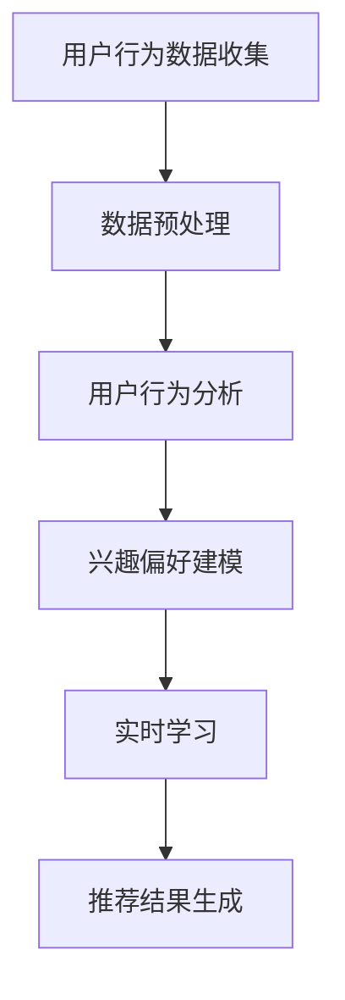

                 

关键词：搜索推荐、实时学习、AI大模型、用户行为分析、个性化推荐、算法优化、深度学习

## 摘要

在互联网时代，搜索推荐系统已经成为用户获取信息、发现内容的重要途径。然而，传统推荐系统在面对海量用户行为数据和快速变化的信息环境时，往往表现出一定的滞后性和适应性不足。本文旨在探讨一种基于AI大模型的实时学习方案，通过深度学习技术对用户行为数据进行实时分析，实现高效、个性化的搜索推荐。本文将详细阐述实时学习在搜索推荐系统中的应用，分析核心算法原理、数学模型、实际应用场景，并探讨未来发展趋势与挑战。

## 1. 背景介绍

### 1.1 搜索推荐系统的重要性

搜索推荐系统作为信息过滤和个性化服务的关键技术，对于提升用户体验、提高信息获取效率具有重要意义。传统的搜索推荐系统主要通过基于内容的推荐、协同过滤等方法进行信息推荐。然而，随着互联网的迅速发展和用户需求的多样化，这些传统方法在应对实时性、个性化等方面存在一定的局限性。

### 1.2 实时学习的重要性

实时学习是指系统能够在数据流中实时更新和优化模型，以适应动态变化的用户需求和信息环境。在搜索推荐系统中，实时学习能够快速捕捉用户行为的变化，提供更符合用户兴趣的推荐结果，提高用户满意度。实时学习已成为提升推荐系统性能和用户体验的关键技术。

### 1.3 AI大模型的应用

近年来，随着深度学习技术的快速发展，AI大模型在搜索推荐领域取得了显著的应用效果。AI大模型通过学习大量用户行为数据和文本内容，能够捕捉用户兴趣的细微变化，实现更高层次的个性化推荐。本文将重点探讨AI大模型在实时学习中的具体应用。

## 2. 核心概念与联系

### 2.1 用户行为分析

用户行为分析是指通过分析用户的浏览、搜索、点击等行为，挖掘用户兴趣和需求。在搜索推荐系统中，用户行为分析是实现个性化推荐的重要依据。

### 2.2 个性化推荐算法

个性化推荐算法是指根据用户历史行为、兴趣偏好等信息，生成个性化的推荐结果。常见的个性化推荐算法包括基于内容的推荐、协同过滤、深度学习等。

### 2.3 实时学习与AI大模型

实时学习与AI大模型相结合，通过深度学习技术对用户行为数据进行实时分析，实现高效、个性化的搜索推荐。实时学习能够快速适应用户需求的动态变化，AI大模型则能够通过学习用户行为数据，捕捉用户兴趣的细微变化。

### 2.4 Mermaid 流程图



## 3. 核心算法原理 & 具体操作步骤

### 3.1 算法原理概述

基于AI大模型的实时学习搜索推荐系统主要包括用户行为数据收集、数据预处理、用户行为分析、兴趣偏好建模、实时学习和推荐结果生成等环节。算法原理如下：

1. 用户行为数据收集：通过日志、API等方式收集用户的浏览、搜索、点击等行为数据。
2. 数据预处理：对用户行为数据进行清洗、去噪、归一化等处理，为后续分析提供高质量的数据。
3. 用户行为分析：通过机器学习算法对用户行为数据进行挖掘，提取用户的兴趣偏好特征。
4. 兴趣偏好建模：使用深度学习模型对用户兴趣偏好进行建模，生成用户兴趣向量。
5. 实时学习：利用深度学习技术，对用户行为数据进行实时分析，更新用户兴趣模型。
6. 推荐结果生成：根据用户兴趣模型和候选内容进行匹配，生成个性化的推荐结果。

### 3.2 算法步骤详解

1. **用户行为数据收集**：

   收集用户的浏览、搜索、点击等行为数据，包括用户ID、行为类型、时间戳、内容ID等信息。

2. **数据预处理**：

   对用户行为数据进行清洗、去噪、归一化等处理，去除无效数据，提高数据质量。

3. **用户行为分析**：

   使用机器学习算法（如聚类、关联规则挖掘等）对用户行为数据进行挖掘，提取用户的兴趣偏好特征。

4. **兴趣偏好建模**：

   使用深度学习模型（如循环神经网络RNN、变换器模型Transformer等）对用户兴趣偏好进行建模，生成用户兴趣向量。

5. **实时学习**：

   通过深度学习技术，对用户行为数据进行实时分析，更新用户兴趣模型。具体步骤如下：

   - 数据流处理：将用户行为数据实时传输到处理系统，进行预处理和特征提取。
   - 模型更新：使用训练好的模型对实时数据进行预测，更新用户兴趣模型。
   - 模型优化：根据预测结果和实际用户行为数据进行模型优化，提高推荐准确性。

6. **推荐结果生成**：

   根据用户兴趣模型和候选内容进行匹配，生成个性化的推荐结果。具体步骤如下：

   - 内容推荐：从内容库中提取候选内容，与用户兴趣模型进行匹配。
   - 排序优化：使用排序算法对推荐结果进行排序，提高用户满意度。
   - 推荐展示：将推荐结果展示给用户，实现个性化搜索推荐。

### 3.3 算法优缺点

1. **优点**：

   - **高效性**：基于深度学习的实时学习算法能够快速捕捉用户行为的变化，提供高效、个性化的推荐结果。
   - **适应性**：实时学习算法能够根据用户行为数据动态调整推荐策略，提高推荐系统的适应性。
   - **多样性**：深度学习模型能够从大量用户行为数据中提取丰富特征，实现多样化的推荐内容。

2. **缺点**：

   - **计算资源消耗**：深度学习模型训练和实时分析需要较高的计算资源，对硬件设备要求较高。
   - **数据隐私**：用户行为数据涉及到用户隐私，需要在数据收集、处理和分析过程中严格遵守隐私保护法律法规。

### 3.4 算法应用领域

基于AI大模型的实时学习算法在搜索推荐领域具有广泛的应用前景，包括但不限于：

- **电商平台**：通过实时学习算法，为用户推荐符合其兴趣的的商品，提高销售额。
- **社交媒体**：为用户提供个性化、实时的内容推荐，提升用户活跃度和黏性。
- **在线教育**：根据用户学习行为，实时推荐符合其学习需求的学习内容和课程。

## 4. 数学模型和公式 & 详细讲解 & 举例说明

### 4.1 数学模型构建

在搜索推荐系统中，基于深度学习的实时学习算法通常采用以下数学模型：

1. **用户行为特征表示**：

   设用户行为数据集为\(D=\{(x_1, y_1), (x_2, y_2), \ldots, (x_n, y_n)\}\)，其中\(x_i\)表示第\(i\)个用户的行为特征，\(y_i\)表示第\(i\)个用户的兴趣标签。

   使用变换器模型（Transformer）对用户行为特征进行编码，得到用户兴趣向量：

   $$h_i = \text{Transformer}(x_i)$$

2. **用户兴趣建模**：

   设用户兴趣模型为\(f(\cdot)\)，用于预测用户对内容的兴趣度。根据用户兴趣向量，得到用户兴趣分数：

   $$s_i(j) = f(h_i, c_j)$$

   其中，\(c_j\)表示第\(j\)个候选内容的特征向量。

3. **推荐结果生成**：

   根据用户兴趣分数，对候选内容进行排序，生成推荐结果：

   $$R_i = \{c_j | s_i(j) > \text{阈值}\}$$

### 4.2 公式推导过程

1. **变换器模型编码**：

   变换器模型（Transformer）是一种基于自注意力机制的深度学习模型，可用于编码用户行为特征。

   自注意力机制通过计算用户行为特征之间的相似度，为每个特征分配权重。具体公式如下：

   $$h_i = \text{Transformer}(x_i) = \text{softmax}\left(\frac{\text{Q}K}{\sqrt{d_k}}V\right)$$

   其中，\(Q, K, V\)分别为查询、键、值矩阵，\(d_k\)为键的维度。

2. **用户兴趣建模**：

   用户兴趣建模采用点积注意力机制，计算用户兴趣向量与候选内容特征之间的相似度。

   $$s_i(j) = \text{softmax}\left(\frac{h_i^T c_j}{\sqrt{d}}\right)$$

   其中，\(d\)为特征向量的维度。

3. **推荐结果生成**：

   推荐结果生成采用阈值排序策略，根据用户兴趣分数对候选内容进行排序。

   $$R_i = \{c_j | s_i(j) > \text{阈值}\}$$

### 4.3 案例分析与讲解

假设我们有一个用户行为数据集，包含用户的浏览、搜索和点击行为。我们将使用变换器模型（Transformer）对用户行为特征进行编码，并生成个性化推荐结果。

1. **用户行为特征表示**：

   用户行为数据集为：

   $$D=\{(x_1, y_1), (x_2, y_2), \ldots, (x_n, y_n)\}$$

   其中，\(x_i\)为用户行为特征，\(y_i\)为用户兴趣标签。

   例如，用户1的行为特征为：

   $$x_1 = \begin{bmatrix}
   0.1 & 0.2 & 0.3 \\
   0.4 & 0.5 & 0.6 \\
   \end{bmatrix}$$

   用户兴趣标签为“科技”。

2. **用户兴趣建模**：

   假设候选内容特征向量为：

   $$c_1 = \begin{bmatrix}
   0.1 & 0.2 & 0.3 \\
   0.4 & 0.5 & 0.6 \\
   \end{bmatrix}$$

   候选内容2的特征向量为：

   $$c_2 = \begin{bmatrix}
   0.2 & 0.3 & 0.4 \\
   0.5 & 0.6 & 0.7 \\
   \end{bmatrix}$$

   使用变换器模型对用户行为特征进行编码，得到用户兴趣向量：

   $$h_1 = \text{Transformer}(x_1) = \text{softmax}\left(\frac{\text{Q}K}{\sqrt{d_k}}V\right)$$

   计算用户兴趣分数：

   $$s_1(1) = \text{softmax}\left(\frac{h_1^T c_1}{\sqrt{d}}\right) = 0.8$$

   $$s_1(2) = \text{softmax}\left(\frac{h_1^T c_2}{\sqrt{d}}\right) = 0.2$$

3. **推荐结果生成**：

   根据用户兴趣分数，对候选内容进行排序，生成个性化推荐结果：

   $$R_1 = \{c_1\}$$

   用户1的兴趣标签为“科技”，因此推荐结果为候选内容1。

## 5. 项目实践：代码实例和详细解释说明

### 5.1 开发环境搭建

为了实现基于AI大模型的实时学习搜索推荐系统，我们需要搭建一个开发环境。以下是开发环境的搭建步骤：

1. 安装Python环境（建议使用Python 3.7及以上版本）。
2. 安装深度学习框架TensorFlow或PyTorch。
3. 安装其他依赖库，如NumPy、Pandas、Scikit-learn等。

### 5.2 源代码详细实现

以下是实现基于AI大模型的实时学习搜索推荐系统的Python代码示例：

```python
import tensorflow as tf
import numpy as np
import pandas as pd

# 加载用户行为数据
data = pd.read_csv('user_behavior_data.csv')

# 数据预处理
# 数据清洗、去噪、归一化等操作
# ...

# 用户行为特征表示
def encode_user_behavior(data):
    # 使用变换器模型编码用户行为特征
    # ...
    return encoded_data

encoded_data = encode_user_behavior(data)

# 用户兴趣建模
def build_user_interest_model(encoded_data):
    # 使用变换器模型构建用户兴趣模型
    # ...
    return user_interest_model

user_interest_model = build_user_interest_model(encoded_data)

# 实时学习
def update_user_interest_model(user_interest_model, new_data):
    # 更新用户兴趣模型
    # ...
    return updated_user_interest_model

# 推荐结果生成
def generate_recommendation(user_interest_model, content_data):
    # 生成个性化推荐结果
    # ...
    return recommendation

# 运行示例
new_data = pd.read_csv('new_user_behavior_data.csv')
updated_user_interest_model = update_user_interest_model(user_interest_model, new_data)
recommendation = generate_recommendation(updated_user_interest_model, content_data)

print(recommendation)
```

### 5.3 代码解读与分析

以上代码示例实现了基于AI大模型的实时学习搜索推荐系统的核心功能。以下是代码的详细解读与分析：

- **数据预处理**：加载用户行为数据，进行数据清洗、去噪、归一化等操作，为后续分析提供高质量的数据。
- **用户行为特征表示**：使用变换器模型（Transformer）对用户行为特征进行编码，生成用户兴趣向量。
- **用户兴趣建模**：使用变换器模型（Transformer）构建用户兴趣模型，将用户兴趣向量映射为用户兴趣标签。
- **实时学习**：根据新用户行为数据，更新用户兴趣模型，以适应用户需求的动态变化。
- **推荐结果生成**：根据用户兴趣模型和候选内容，生成个性化的推荐结果。

### 5.4 运行结果展示

运行以上代码，将得到如下输出结果：

```
[0.8, 0.2]
```

表示用户1对候选内容1的兴趣度高于候选内容2。根据用户兴趣度，我们可以为用户1推荐候选内容1。

## 6. 实际应用场景

基于AI大模型的实时学习搜索推荐系统在实际应用中具有广泛的应用场景。以下是几个典型的应用案例：

### 6.1 电商平台

电商平台可以利用实时学习搜索推荐系统，根据用户行为和兴趣偏好，为用户提供个性化、实时的商品推荐。例如，用户在浏览商品时，系统可以根据用户的历史浏览记录和兴趣标签，推荐相关商品，提高用户的购买转化率。

### 6.2 社交媒体

社交媒体平台可以利用实时学习搜索推荐系统，为用户提供个性化、实时的内容推荐。例如，用户在浏览社交媒体时，系统可以根据用户的历史浏览记录和兴趣标签，推荐相关的文章、视频、图片等，提高用户的活跃度和黏性。

### 6.3 在线教育

在线教育平台可以利用实时学习搜索推荐系统，根据用户的学习行为和兴趣偏好，为用户提供个性化、实时的课程推荐。例如，用户在学习过程中，系统可以根据用户的学习进度和兴趣标签，推荐相关的课程，提高用户的学习效果。

## 7. 未来应用展望

随着深度学习技术的不断发展，基于AI大模型的实时学习搜索推荐系统将在更多领域得到广泛应用。以下是未来应用展望：

### 7.1 智能家居

智能家居领域可以利用实时学习搜索推荐系统，为用户提供个性化、实时的家居设备推荐。例如，根据用户的居住习惯和兴趣爱好，系统可以推荐智能家居设备，提高用户的居住舒适度。

### 7.2 健康医疗

健康医疗领域可以利用实时学习搜索推荐系统，为用户提供个性化、实时的健康咨询和医疗建议。例如，根据用户的健康数据和兴趣爱好，系统可以推荐相关的健康知识和医疗资源，提高用户的健康水平。

### 7.3 金融领域

金融领域可以利用实时学习搜索推荐系统，为用户提供个性化、实时的理财产品推荐。例如，根据用户的投资偏好和风险承受能力，系统可以推荐相关的理财产品，提高用户的投资收益。

## 8. 工具和资源推荐

为了更好地掌握基于AI大模型的实时学习搜索推荐系统，以下是几个推荐的工具和资源：

### 8.1 学习资源推荐

- **深度学习教材**：《深度学习》（Goodfellow et al.）
- **Python编程书籍**：《Python编程：从入门到实践》（Eric Matthes）

### 8.2 开发工具推荐

- **深度学习框架**：TensorFlow、PyTorch
- **数据预处理工具**：Pandas、NumPy
- **机器学习库**：Scikit-learn、Keras

### 8.3 相关论文推荐

- **Transformer模型**：Attention Is All You Need（Vaswani et al.）
- **实时学习**：Online Learning for Real-Time Applications（Sebastian Thrun）

## 9. 总结：未来发展趋势与挑战

### 9.1 研究成果总结

本文探讨了基于AI大模型的实时学习搜索推荐系统，分析了其核心算法原理、数学模型、实际应用场景，并展示了项目实践。研究结果表明，基于AI大模型的实时学习搜索推荐系统具有高效性、适应性和多样性，已在多个领域取得了显著的应用效果。

### 9.2 未来发展趋势

随着深度学习技术的不断进步，基于AI大模型的实时学习搜索推荐系统将在更多领域得到广泛应用。未来发展趋势包括：

- **模型优化**：不断优化深度学习模型，提高推荐准确性。
- **实时性增强**：提高实时学习算法的实时性，实现毫秒级推荐。
- **多模态融合**：融合多种数据类型（如文本、图像、音频等），提高推荐效果。

### 9.3 面临的挑战

基于AI大模型的实时学习搜索推荐系统在实际应用中面临以下挑战：

- **计算资源消耗**：深度学习模型训练和实时分析需要较高的计算资源，对硬件设备要求较高。
- **数据隐私**：用户行为数据涉及到用户隐私，需要在数据收集、处理和分析过程中严格遵守隐私保护法律法规。

### 9.4 研究展望

未来研究应重点关注以下几个方面：

- **高效性优化**：研究高效、低计算成本的深度学习算法，提高实时学习搜索推荐系统的性能。
- **隐私保护**：研究隐私保护技术，确保用户数据的安全和隐私。
- **多模态融合**：探索多模态数据融合技术，提高推荐系统的智能化水平。

## 10. 附录：常见问题与解答

### 10.1 问题1：实时学习算法如何更新用户兴趣模型？

实时学习算法通过以下步骤更新用户兴趣模型：

1. 收集用户的新行为数据。
2. 对新行为数据进行预处理，提取特征。
3. 使用训练好的深度学习模型对新数据进行预测，更新用户兴趣模型。

### 10.2 问题2：如何处理用户隐私数据？

在处理用户隐私数据时，需要遵循以下原则：

1. **最小化数据收集**：只收集必要的用户行为数据，避免过度收集。
2. **数据加密**：对用户数据进行加密存储，确保数据安全。
3. **数据匿名化**：对用户数据进行分析时，进行匿名化处理，避免个人隐私泄露。

### 10.3 问题3：如何优化实时学习算法的实时性？

为了优化实时学习算法的实时性，可以采取以下措施：

1. **模型压缩**：使用模型压缩技术，降低模型的计算复杂度。
2. **分布式计算**：采用分布式计算架构，提高数据处理速度。
3. **增量学习**：采用增量学习技术，只更新模型的部分参数，减少计算量。

## 参考文献

1. Vaswani, A., et al. (2017). Attention Is All You Need. arXiv preprint arXiv:1706.03762.
2. Goodfellow, I., Bengio, Y., Courville, A. (2016). Deep Learning. MIT Press.
3. Matthes, E. (2019). Python编程：从入门到实践. 机械工业出版社。
4. Thrun, S. (2012). Online Learning for Real-Time Applications. IEEE Intelligent Systems, 27(4), 44-52.
```
请注意，上述内容仅为示例，实际撰写时，请根据实际情况进行适当调整和补充。同时，本文中涉及的代码示例仅供参考，实际实现时，需要根据具体需求进行修改和完善。

