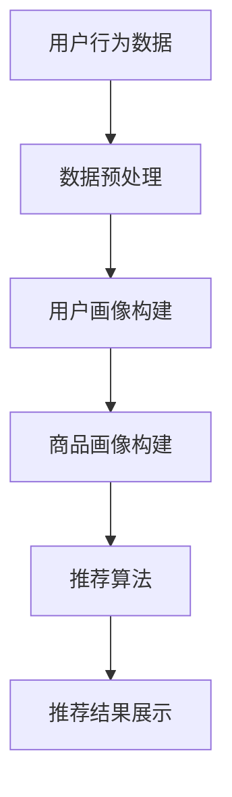

                 

关键词：搜索推荐系统、AI大模型、电商平台、转化率、用户体验、可持续发展

> 摘要：本文旨在探讨如何利用AI大模型技术优化电商平台的搜索推荐系统，从而提升转化率和用户体验，同时确保系统的可持续发展。文章首先介绍了搜索推荐系统的基本概念和重要性，然后详细分析了AI大模型在其中的应用，探讨了核心算法原理、数学模型、项目实践以及实际应用场景，最后对未来的发展趋势与挑战进行了展望。

## 1. 背景介绍

在当今互联网时代，电商平台的竞争日益激烈。消费者在购物时不仅关注商品本身，还关注购物体验和推荐系统。一个高效的搜索推荐系统能够根据用户行为和偏好提供个性化的商品推荐，从而提高转化率和用户满意度。随着人工智能技术的快速发展，特别是大模型技术的出现，为搜索推荐系统带来了前所未有的优化空间。

大模型技术具有以下几个特点：

1. **强大的计算能力**：大模型能够处理海量数据，进行复杂的计算和模式识别。
2. **高度的自适应能力**：大模型可以根据用户行为和反馈不断调整推荐策略。
3. **广泛的适用性**：大模型可以应用于各种不同的场景和领域，如电商平台、社交媒体、在线广告等。

因此，将AI大模型应用于电商平台的搜索推荐系统，不仅能够提升系统的性能和用户体验，还能够为电商平台带来可持续的发展。

## 2. 核心概念与联系

### 2.1. 搜索推荐系统

搜索推荐系统是电商平台的重要组成部分，其主要功能是根据用户的搜索历史、浏览记录、购买行为等数据，为用户推荐相关的商品。一个高效的搜索推荐系统通常包括以下几个模块：

1. **用户画像**：通过分析用户的历史行为和偏好，构建用户的个人画像。
2. **商品画像**：对商品进行分类和标签化，建立商品的特征库。
3. **推荐算法**：根据用户画像和商品画像，选择合适的算法进行商品推荐。
4. **推荐结果展示**：将推荐结果以适当的形式展示给用户。

### 2.2. AI 大模型

AI 大模型是一种基于深度学习的技术，它可以通过学习大量的数据来提取特征，并进行复杂的模式识别。在搜索推荐系统中，大模型可以应用于以下几个方面：

1. **用户画像构建**：利用大模型分析用户行为数据，提取用户兴趣和偏好。
2. **商品画像构建**：利用大模型对商品数据进行深度学习，提取商品的关键特征。
3. **推荐算法优化**：利用大模型对推荐算法进行优化，提高推荐精度和效率。

### 2.3. Mermaid 流程图

下面是一个简化的搜索推荐系统的 Mermaid 流程图：

### 2.4. 核心概念原理

- **用户画像**：用户画像是指通过对用户行为数据进行分析，提取出用户的兴趣、偏好、行为模式等信息，从而构建一个关于用户的详细描述。
- **商品画像**：商品画像是指通过对商品数据进行处理，提取出商品的关键特征，如类别、品牌、价格、销量等，从而构建一个关于商品的基本描述。
- **推荐算法**：推荐算法是指根据用户画像和商品画像，选择合适的算法进行商品推荐，如基于内容的推荐、协同过滤推荐、深度学习推荐等。

## 3. 核心算法原理 & 具体操作步骤

### 3.1. 算法原理概述

在搜索推荐系统中，AI 大模型的核心作用是优化推荐算法，提高推荐精度和效率。具体来说，大模型可以应用于以下几个方面：

1. **用户画像构建**：利用大模型对用户行为数据进行深度学习，提取用户的兴趣和偏好。
2. **商品画像构建**：利用大模型对商品数据进行深度学习，提取商品的关键特征。
3. **推荐算法优化**：利用大模型对推荐算法进行优化，提高推荐精度和效率。

### 3.2. 算法步骤详解

1. **数据收集**：首先，从电商平台上收集用户行为数据，如搜索记录、浏览记录、购买记录等。
2. **数据预处理**：对收集到的数据进行清洗、去噪、归一化等处理，确保数据的质量。
3. **特征提取**：利用大模型对预处理后的数据进行分析，提取用户的兴趣和偏好，以及商品的关键特征。
4. **用户画像构建**：将提取的用户特征进行整合，构建出详细的用户画像。
5. **商品画像构建**：将提取的商品特征进行整合，构建出详细的商品画像。
6. **推荐算法选择**：根据用户画像和商品画像，选择合适的推荐算法，如基于内容的推荐、协同过滤推荐、深度学习推荐等。
7. **推荐结果生成**：利用选定的推荐算法，生成推荐结果，并将其展示给用户。
8. **反馈调整**：根据用户的反馈，对推荐结果进行调整，提高推荐精度和效率。

### 3.3. 算法优缺点

- **优点**：
  - 高效：大模型能够处理海量数据，进行快速的特征提取和推荐生成。
  - 准确：大模型通过深度学习，能够提取出用户和商品的关键特征，提高推荐精度。
  - 自适应：大模型可以根据用户的反馈和行为，不断调整推荐策略，提高用户体验。

- **缺点**：
  - 复杂：大模型的结构复杂，需要大量的计算资源和时间进行训练和优化。
  - 数据依赖：大模型的效果很大程度上依赖于数据的质量和数量，数据缺失或错误可能会导致推荐效果下降。

### 3.4. 算法应用领域

- **电商平台**：电商平台可以利用大模型优化搜索推荐系统，提高用户转化率和满意度。
- **在线广告**：在线广告平台可以利用大模型进行精准广告投放，提高广告效果和收益。
- **社交媒体**：社交媒体平台可以利用大模型进行内容推荐，提高用户活跃度和粘性。

## 4. 数学模型和公式 & 详细讲解 & 举例说明

### 4.1. 数学模型构建

在搜索推荐系统中，常见的数学模型包括用户画像模型、商品画像模型和推荐算法模型。以下是这些模型的简要介绍：

- **用户画像模型**：
  - 用户兴趣向量：\[U_i = [u_{i1}, u_{i2}, ..., u_{in}]\]
  - 商品兴趣向量：\[C_j = [c_{j1}, c_{j2}, ..., c_{jn}]\]
  - 用户兴趣得分：\[S_{ij} = U_i \cdot C_j\]

- **商品画像模型**：
  - 商品特征向量：\[F_j = [f_{j1}, f_{j2}, ..., f_{jn}]\]
  - 用户特征向量：\[U_i = [u_{i1}, u_{i2}, ..., u_{in}]\]
  - 商品特征得分：\[F_{ij} = F_j \cdot U_i\]

- **推荐算法模型**：
  - 基于内容的推荐：\[R_{ij} = S_{ij} + \alpha \cdot F_{ij}\]
  - 协同过滤推荐：\[R_{ij} = \frac{\sum_{k \in N(i)} R_{ik}}{|\{k \in N(i)| R_{ik} \neq 0\}|}\]
  - 深度学习推荐：\[R_{ij} = \sigma(W \cdot [U_i, C_j] + b)\]

其中，\(U_i\)和\(C_j\)分别表示用户兴趣向量和商品兴趣向量，\(F_j\)和\(U_i\)分别表示商品特征向量和用户特征向量，\(S_{ij}\)和\(F_{ij}\)分别表示用户兴趣得分和商品特征得分，\(R_{ij}\)表示推荐得分，\(N(i)\)表示用户\(i\)的邻居集合，\(\alpha\)为调节参数，\(\sigma\)为激活函数，\(W\)和\(b\)分别为权重矩阵和偏置向量。

### 4.2. 公式推导过程

以下以基于内容的推荐模型为例，介绍公式的推导过程：

- **用户兴趣向量**：
  - 用户兴趣向量\[U_i\]是通过分析用户的搜索记录、浏览记录和购买记录等数据，提取出用户的兴趣点，并将其表示为一个向量。具体推导过程如下：
    $$u_{ij} = \begin{cases}
    1, & \text{如果用户\(i\)对项目\(j\)感兴趣} \\
    0, & \text{否则}
    \end{cases}$$

- **商品兴趣向量**：
  - 商品兴趣向量\[C_j\]是通过分析商品的特征数据，如类别、品牌、价格等，将其表示为一个向量。具体推导过程如下：
    $$c_{j

