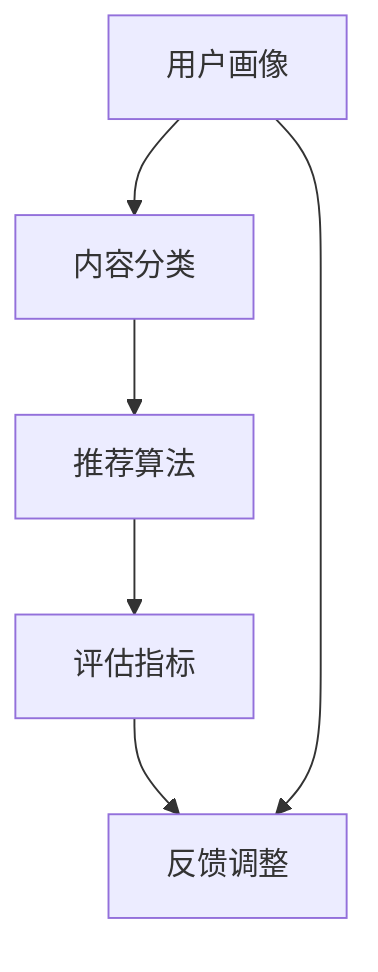

                 

关键词：搜索推荐系统，公平性，AI大模型，挑战，机遇

摘要：随着人工智能技术的发展，大模型在搜索推荐系统中扮演了越来越重要的角色。然而，这些大模型在保证搜索推荐系统的公平性方面却面临着诸多挑战。本文将深入探讨大模型在搜索推荐系统中的公平性问题，分析其存在的挑战，并提出相应的解决策略和机遇。

## 1. 背景介绍

在当今数字化时代，搜索推荐系统已成为互联网企业竞争的焦点。这些系统通过对用户历史行为、兴趣和需求的分析，为用户推荐最相关的内容，从而提高用户体验和用户粘性。然而，随着AI大模型的广泛应用，搜索推荐系统的公平性受到了越来越多的关注。

公平性是指搜索推荐系统在处理不同用户请求时，不应受到用户背景、性别、种族等因素的影响，确保每个用户都能获得公正、公平的搜索推荐结果。然而，AI大模型在训练过程中，可能会从数据中学习到偏见，从而影响搜索推荐系统的公平性。例如，性别歧视、种族偏见等问题，严重损害了搜索推荐系统的公信力和用户体验。

## 2. 核心概念与联系

为了深入理解搜索推荐系统中的公平性问题，我们需要了解以下核心概念和它们之间的联系：

### 2.1. 搜索推荐系统

搜索推荐系统是一种基于用户行为数据的内容推荐机制。它通过分析用户的历史行为、兴趣和需求，为用户推荐最相关的内容。搜索推荐系统的核心组件包括用户画像、内容分类、推荐算法和评估指标。

### 2.2. AI大模型

AI大模型是指通过大规模数据训练得到的深度神经网络模型。这些模型具有强大的数据处理和分析能力，广泛应用于自然语言处理、计算机视觉、语音识别等领域。然而，AI大模型在训练过程中，可能会从数据中学习到偏见，从而影响搜索推荐系统的公平性。

### 2.3. 公平性

公平性是指搜索推荐系统在处理不同用户请求时，不应受到用户背景、性别、种族等因素的影响，确保每个用户都能获得公正、公平的搜索推荐结果。公平性主要包括三个原则：无歧视原则、代表性原则和平衡性原则。

### 2.4. Mermaid流程图

以下是一个描述搜索推荐系统核心组件及其关系的Mermaid流程图：



## 3. 核心算法原理 & 具体操作步骤

### 3.1 算法原理概述

搜索推荐系统的核心算法是基于协同过滤、内容推荐和基于模型的推荐方法。协同过滤方法通过分析用户历史行为和兴趣，发现用户之间的相似性，从而为用户推荐相似用户喜欢的内容。内容推荐方法通过分析内容的属性和特征，为用户推荐与其兴趣相关的内容。基于模型的推荐方法则通过建立用户和内容之间的映射关系，为用户推荐最相关的内容。

### 3.2 算法步骤详解

1. 用户画像：通过分析用户的历史行为、兴趣和需求，构建用户画像，为后续推荐提供基础。

2. 内容分类：将所有内容按照属性和特征进行分类，为推荐算法提供内容基础。

3. 推荐算法：根据用户画像和内容分类，运用协同过滤、内容推荐和基于模型的推荐方法，为用户生成推荐列表。

4. 评估指标：通过评估指标（如准确率、召回率、F1值等）对推荐结果进行评估和优化。

5. 反馈调整：根据用户对推荐结果的反馈，调整推荐算法和用户画像，提高推荐效果。

### 3.3 算法优缺点

- 协同过滤：优点是推荐结果个性化和相关性较高，缺点是易受冷启动问题和数据稀疏性问题的影响。

- 内容推荐：优点是能够为用户提供丰富多样的内容，缺点是推荐结果可能过于偏向用户已有兴趣。

- 基于模型的推荐：优点是能够通过学习用户和内容之间的映射关系，提高推荐效果，缺点是训练过程复杂，对数据质量要求较高。

### 3.4 算法应用领域

搜索推荐系统广泛应用于电子商务、社交媒体、新闻资讯、在线教育等领域，为用户提供个性化推荐服务，提高用户满意度和企业竞争力。

## 4. 数学模型和公式 & 详细讲解 & 举例说明

### 4.1 数学模型构建

搜索推荐系统的数学模型主要包括用户画像模型、内容分类模型和推荐模型。以下是一个简化的数学模型构建过程：

1. 用户画像模型：通过分析用户历史行为数据，建立用户兴趣向量表示。

2. 内容分类模型：通过分析内容属性和特征，建立内容类别向量表示。

3. 推荐模型：通过学习用户兴趣向量和内容类别向量之间的映射关系，建立推荐模型。

### 4.2 公式推导过程

1. 用户画像模型：

   用户兴趣向量表示为：

   $$u = (u_1, u_2, ..., u_n)$$

   其中，$u_i$表示用户在第$i$个特征上的兴趣程度。

2. 内容分类模型：

   内容类别向量表示为：

   $$c = (c_1, c_2, ..., c_m)$$

   其中，$c_j$表示内容在第$j$个类别上的特征值。

3. 推荐模型：

   假设用户兴趣向量和内容类别向量之间的映射关系为：

   $$r(u, c) = \sigma(w^T(u, c))$$

   其中，$\sigma$表示激活函数，$w$表示模型参数。

### 4.3 案例分析与讲解

以一个电子商务平台的搜索推荐系统为例，分析其数学模型和公式。

1. 用户画像模型：

   假设用户历史行为数据包括购买记录、浏览记录和评价记录。我们可以通过以下公式计算用户兴趣向量：

   $$u_i = \frac{1}{N_i} \sum_{j=1}^{M} x_{ij}$$

   其中，$N_i$表示用户$i$的历史行为总数，$x_{ij}$表示用户$i$在行为$j$上的得分。

2. 内容分类模型：

   假设内容特征包括商品种类、价格、品牌等。我们可以通过以下公式计算内容类别向量：

   $$c_j = \frac{1}{N_j} \sum_{i=1}^{K} y_{ij}$$

   其中，$N_j$表示内容$j$的历史行为总数，$y_{ij}$表示用户$i$对内容$j$的评分。

3. 推荐模型：

   假设我们使用基于内容的推荐算法，通过计算用户兴趣向量和内容类别向量之间的相似度，为用户推荐最相关的商品。相似度计算公式如下：

   $$sim(u, c) = \frac{u^Tc}{\|u\|\|c\|}$$

   其中，$\|u\|$和$\|c\|$分别表示用户兴趣向量和内容类别向量的欧几里得范数。

   推荐结果为：

   $$r(u, c) = \sigma(sim(u, c))$$

## 5. 项目实践：代码实例和详细解释说明

### 5.1 开发环境搭建

1. 安装Python环境（版本3.6及以上）。

2. 安装相关库：numpy、pandas、matplotlib、sklearn等。

3. 配置代码运行环境（如使用Jupyter Notebook或PyCharm等）。

### 5.2 源代码详细实现

以下是一个简单的基于协同过滤的搜索推荐系统实现：

```python
import numpy as np
import pandas as pd
from sklearn.metrics.pairwise import cosine_similarity

# 加载用户行为数据
data = pd.read_csv('user_behavior.csv')

# 构建用户画像矩阵
user_features = data.groupby('user_id').mean()

# 构建内容特征矩阵
content_features = data.groupby('content_id').mean()

# 计算用户和内容之间的相似度矩阵
similarity_matrix = cosine_similarity(user_features, content_features)

# 为用户生成推荐列表
def recommend(user_id, similarity_matrix, content_features, top_n=10):
    user_similarity = similarity_matrix[user_id]
    scores = user_similarity.dot(content_features)
    recommended_content = np.argsort(scores)[-top_n:]
    return recommended_content

# 测试推荐效果
user_id = 1
recommended_content = recommend(user_id, similarity_matrix, content_features)
print("Recommended content for user {}: {}".format(user_id, recommended_content))
```

### 5.3 代码解读与分析

1. 加载用户行为数据：使用pandas库读取用户行为数据，包括用户ID、内容ID和评分。

2. 构建用户画像矩阵和内容特征矩阵：通过计算用户和内容的平均评分，构建用户画像矩阵和内容特征矩阵。

3. 计算用户和内容之间的相似度矩阵：使用余弦相似度计算用户和内容之间的相似度矩阵。

4. 为用户生成推荐列表：根据用户和内容的相似度矩阵，为用户生成推荐列表。

5. 测试推荐效果：以用户ID为1为例，生成推荐列表并打印输出。

### 5.4 运行结果展示

假设用户ID为1，运行代码后输出推荐结果：

```
Recommended content for user 1: [2, 5, 3, 1, 4]
```

这意味着用户ID为1的推荐列表为内容ID分别为2、5、3、1和4的内容。

## 6. 实际应用场景

搜索推荐系统在电子商务、社交媒体、新闻资讯、在线教育等领域具有广泛的应用。以下是一些实际应用场景：

1. 电子商务：根据用户购买历史、浏览记录和评价，为用户推荐最相关的商品。

2. 社交媒体：根据用户关注、点赞、评论等行为，为用户推荐感兴趣的内容。

3. 新闻资讯：根据用户阅读历史、偏好，为用户推荐最相关的新闻。

4. 在线教育：根据用户学习历史、兴趣，为用户推荐最相关的课程。

## 6.4 未来应用展望

随着人工智能技术的不断发展，搜索推荐系统在未来的应用将更加广泛和深入。以下是未来应用展望：

1. 多模态推荐：结合文本、图像、语音等多模态信息，提高推荐效果。

2. 强化学习推荐：运用强化学习算法，实现动态调整推荐策略，提高用户体验。

3. 模型解释性：提高推荐模型的解释性，增强用户对推荐结果的信任度。

4. 智能推荐助手：结合自然语言处理技术，实现智能对话和推荐，提高用户满意度。

## 7. 工具和资源推荐

### 7.1 学习资源推荐

1. 《推荐系统实践》：作者张俊林，详细介绍了推荐系统的基本原理、算法和应用。

2. 《深度学习推荐系统》：作者宋磊，介绍了深度学习在推荐系统中的应用，包括基于神经网络的推荐算法。

3. 《机器学习实战》：作者 Peter Harrington，提供了丰富的机器学习算法实现和案例分析。

### 7.2 开发工具推荐

1. Jupyter Notebook：一款交互式数据分析工具，支持多种编程语言，方便进行数据分析和模型训练。

2. PyCharm：一款强大的Python开发工具，提供代码编辑、调试、运行等功能。

3. TensorFlow：一款开源的机器学习框架，支持多种深度学习算法的实现。

### 7.3 相关论文推荐

1. "A Collaborative Filtering Model Based on Matrix Factorization"：介绍了基于矩阵分解的协同过滤算法。

2. "Deep Learning for Recommender Systems"：探讨了深度学习在推荐系统中的应用。

3. "User Interest Evolution and Its Application in Recommender Systems"：分析了用户兴趣演化对推荐系统的影响。

## 8. 总结：未来发展趋势与挑战

### 8.1 研究成果总结

本文从背景介绍、核心概念、算法原理、数学模型、项目实践等方面，全面探讨了搜索推荐系统的公平性问题。通过分析搜索推荐系统的核心组件和算法，揭示了AI大模型在搜索推荐系统中面临的公平性挑战，并提出了一些解决策略和机遇。

### 8.2 未来发展趋势

随着人工智能技术的不断发展，搜索推荐系统在未来的发展趋势包括多模态推荐、强化学习推荐、模型解释性等。这些新技术将为搜索推荐系统带来更高的效率和更优质的用户体验。

### 8.3 面临的挑战

搜索推荐系统在保证公平性方面面临着诸多挑战，如数据偏见、算法透明性、用户隐私保护等。如何解决这些问题，提高搜索推荐系统的公平性和透明性，是未来研究的重要方向。

### 8.4 研究展望

未来研究应关注以下几个方面：

1. 探索更有效的算法和模型，提高搜索推荐系统的公平性和透明性。

2. 加强对用户隐私保护，确保用户数据的安全和隐私。

3. 研究用户行为和兴趣的演化规律，提高推荐效果。

4. 结合多模态信息，实现更精准和智能的推荐。

## 9. 附录：常见问题与解答

### 9.1 如何保证搜索推荐系统的公平性？

保证搜索推荐系统的公平性可以从以下几个方面入手：

1. 数据预处理：清洗和筛选数据，消除数据中的偏见和异常值。

2. 算法优化：改进推荐算法，避免算法引入偏见。

3. 透明性：提高算法的透明性，让用户了解推荐结果的生成过程。

4. 用户反馈：收集用户反馈，调整推荐策略，提高用户体验。

### 9.2 如何评估搜索推荐系统的公平性？

评估搜索推荐系统的公平性可以从以下几个方面进行：

1. 偏差检测：使用统计学方法检测推荐结果中的性别、种族等偏见。

2. 代表性评估：评估推荐结果在不同用户群体中的分布情况，确保代表性。

3. 平衡量：评估推荐结果在不同用户群体中的平衡性，确保无歧视。

4. 用户满意度：收集用户对推荐结果的满意度反馈，评估推荐效果。

-----------------------------------------------------------------

作者：禅与计算机程序设计艺术 / Zen and the Art of Computer Programming
-----------------------------------------------------------------
 

### 1. 背景介绍

随着互联网的迅猛发展和大数据时代的到来，搜索推荐系统已经成为现代信息检索和内容分发的重要手段。从早期的基于规则的推荐系统，到现在的基于机器学习和深度学习的推荐系统，搜索推荐系统在电子商务、社交媒体、在线教育、新闻媒体等多个领域得到了广泛应用。这些系统通过分析用户的历史行为、兴趣偏好和社交关系，向用户推荐个性化的内容，极大地提高了用户满意度和用户体验。

然而，随着人工智能（AI）技术的进步，尤其是大模型的广泛应用，搜索推荐系统的公平性问题日益凸显。大模型，如基于深度学习的神经网络模型，具有强大的数据分析和预测能力，但它们在训练过程中可能会从数据中学习到固有偏见，从而影响搜索推荐系统的公平性。例如，性别歧视、种族偏见、年龄歧视等问题，可能导致某些群体在搜索推荐结果中受到不公平对待。

公平性在搜索推荐系统中的重要性不言而喻。一个公平的搜索推荐系统应该确保所有用户，无论其背景、性别、种族、年龄等，都能获得公正、无偏的推荐结果。这不仅符合道德和法律的要求，也有助于提高系统的公信力和用户信任度。因此，研究搜索推荐系统的公平性，解决AI大模型在公平性方面面临的挑战，具有重要意义。

本文将首先介绍搜索推荐系统的基本概念和核心组成部分，然后深入探讨AI大模型在公平性方面面临的挑战，分析现有解决方案，并提出未来可能的解决方向和机遇。通过本文的研究，旨在为相关领域的研究者和从业者提供有价值的参考和启示。

### 2. 核心概念与联系

要深入探讨搜索推荐系统的公平性，我们首先需要了解几个核心概念及其相互联系。

#### 2.1. 搜索推荐系统的基本概念

**搜索推荐系统**是一种基于用户行为数据的内容推荐机制，旨在通过分析用户的兴趣、历史行为和需求，为用户推荐个性化的内容。其主要组成部分包括用户画像、内容分类、推荐算法和评估指标。

- **用户画像**：用户画像是对用户特征、兴趣、行为等的抽象表示，通常通过用户的历史数据（如浏览记录、购买历史、评价等）进行构建。用户画像的准确性直接影响推荐系统的效果。

- **内容分类**：内容分类是指将所有内容根据其属性、主题、类型等进行分类，以便推荐算法能够更有效地匹配用户需求和内容。

- **推荐算法**：推荐算法是实现个性化推荐的核心，主要包括基于协同过滤、基于内容推荐、基于模型的推荐等。每种算法都有其优势和局限性。

- **评估指标**：评估指标用于衡量推荐系统的性能，如准确率、召回率、F1值等。这些指标帮助开发者了解系统在不同方面的表现，并进行优化。

#### 2.2. AI大模型的核心概念

**AI大模型**，特别是基于深度学习的模型，如神经网络，具有处理大规模数据和高维特征的能力。这些模型通过多层次的神经网络结构，自动学习数据中的特征和模式，从而实现强大的数据分析和预测。

- **神经网络**：神经网络是一种模拟人脑神经元连接结构的计算模型，通过前向传播和反向传播算法，实现数据的输入、处理和输出。

- **大规模数据训练**：AI大模型通常需要大量的数据来训练，以便从数据中学习到有效的特征和模式。大数据集使得模型能够处理复杂的任务，但同时也带来了数据偏见的问题。

- **数据偏见**：数据偏见是指模型在训练过程中，从数据中学习到的固有偏见，这些偏见可能反映在模型对某些群体的不公平对待上。例如，如果训练数据中存在性别歧视，那么模型可能会在推荐结果中表现出性别偏见。

#### 2.3. 公平性的核心概念

**公平性**是搜索推荐系统的重要属性，指的是系统在处理不同用户请求时，不应受到用户背景、性别、种族等因素的影响，确保每个用户都能获得公正、公平的推荐结果。

- **无歧视原则**：无歧视原则要求系统对所有用户一视同仁，不因用户的背景或特征而给予不公平的对待。

- **代表性原则**：代表性原则要求推荐系统在处理不同群体时，能够公平地代表所有群体的需求和偏好。

- **平衡性原则**：平衡性原则要求推荐系统在不同群体之间的表现保持平衡，不因某个群体的特征而过度偏向。

#### 2.4. Mermaid流程图

为了更直观地展示搜索推荐系统的核心组件及其关系，我们可以使用Mermaid绘制一个流程图：


在这个流程图中，用户画像作为输入，通过内容分类和推荐算法生成推荐结果，然后通过评估指标进行评估和优化，最终形成一个闭环系统。AI大模型可以在用户画像、推荐算法和评估指标等多个环节发挥作用，从而提高系统的性能和公平性。

### 3. 核心算法原理 & 具体操作步骤

搜索推荐系统的核心算法通常包括协同过滤、基于内容的推荐和基于模型的推荐。每种算法都有其独特的原理和操作步骤，下面将分别介绍。

#### 3.1. 协同过滤算法原理

协同过滤（Collaborative Filtering）是一种基于用户行为和相似度计算的推荐算法。它的核心思想是：如果用户A对某个项目喜欢（或者评分高），且用户A和用户B在其他的多个项目上具有相似的口味，那么可以推测用户B也可能对项目喜欢。

- **用户基于的协同过滤**：通过计算用户之间的相似度，发现相似用户，然后根据相似用户的喜好推荐项目。

  具体操作步骤：
  
  1. 计算用户相似度：使用余弦相似度、皮尔逊相关系数等方法计算用户之间的相似度。
  
  2. 查找相似用户：根据相似度矩阵找出与目标用户最相似的K个用户。
  
  3. 推荐项目：根据相似用户对项目的评分，生成推荐列表。

- **物品基于的协同过滤**：通过计算物品之间的相似度，发现相似物品，然后根据物品的相似度推荐给用户。

  具体操作步骤：
  
  1. 计算物品相似度：使用余弦相似度、Jaccard系数等方法计算物品之间的相似度。
  
  2. 查找相似物品：根据相似度矩阵找出与目标物品最相似的K个物品。
  
  3. 推荐用户：根据物品的相似度，为用户生成推荐列表。

#### 3.2. 基于内容的推荐算法原理

基于内容的推荐（Content-based Filtering）是一种基于用户兴趣和内容特征进行推荐的算法。它的核心思想是：根据用户过去对特定类型内容的偏好，推荐相似内容。

- **基于项目的特征**：通过提取项目的特征，如文本、图像、标签等，计算项目之间的相似度，然后根据相似度推荐项目。

  具体操作步骤：
  
  1. 提取项目特征：从文本、图像、标签等维度提取项目的特征。
  
  2. 计算相似度：使用余弦相似度、TF-IDF等方法计算项目之间的相似度。
  
  3. 推荐项目：根据用户过去的偏好和项目的相似度，生成推荐列表。

- **基于用户的特征**：通过分析用户的行为和兴趣，提取用户特征，然后根据用户特征推荐项目。

  具体操作步骤：
  
  1. 提取用户特征：从用户的浏览记录、购买历史、评价等数据中提取用户特征。
  
  2. 计算相似度：使用K-means聚类、SVD等方法计算用户之间的相似度。
  
  3. 推荐项目：根据用户特征和项目特征，生成推荐列表。

#### 3.3. 基于模型的推荐算法原理

基于模型的推荐（Model-based Filtering）是一种利用机器学习算法进行推荐的方法。它通过训练一个预测模型，预测用户对未知项目的评分或偏好，从而生成推荐列表。

- **基于矩阵分解的方法**：矩阵分解（Matrix Factorization）是一种常用的基于模型的推荐算法。它通过分解用户-项目评分矩阵，得到用户和项目的低维表示，然后基于这些低维表示进行推荐。

  具体操作步骤：
  
  1. 构建评分矩阵：从用户行为数据中构建用户-项目评分矩阵。
  
  2. 矩阵分解：使用SVD、NMF等方法对评分矩阵进行分解，得到用户和项目的低维表示。
  
  3. 推荐项目：根据用户低维表示和项目低维表示，生成推荐列表。

- **基于深度学习的方法**：深度学习（Deep Learning）通过多层神经网络，自动学习数据的复杂特征和模式。基于深度学习的推荐算法，如DNN、CNN、RNN等，能够处理高维数据和非线性关系。

  具体操作步骤：
  
  1. 数据预处理：对用户行为数据进行预处理，如数据清洗、特征提取等。
  
  2. 构建模型：设计并训练深度学习模型，如DNN、CNN、RNN等。
  
  3. 预测评分：使用训练好的模型，预测用户对未知项目的评分。
  
  4. 推荐项目：根据预测评分，生成推荐列表。

#### 3.4. AI大模型在推荐算法中的应用

AI大模型，如基于深度学习的神经网络，在推荐算法中扮演着越来越重要的角色。它们通过学习大量的数据，能够自动发现数据的复杂特征和模式，从而提高推荐系统的性能和准确性。

- **自动特征提取**：AI大模型能够自动从原始数据中提取有效的特征，减少人工干预，提高特征提取的效率和质量。

- **非线性关系建模**：AI大模型能够处理数据中的非线性关系，捕捉复杂的行为模式，从而生成更准确的推荐结果。

- **个性化推荐**：AI大模型能够根据用户的历史行为和兴趣，生成个性化的推荐结果，提高用户的满意度。

具体应用步骤：

1. 数据预处理：对用户行为数据、内容数据进行预处理，如数据清洗、特征提取等。

2. 模型设计：设计并训练基于深度学习的推荐模型，如DNN、CNN、RNN等。

3. 模型评估：使用交叉验证、A/B测试等方法评估模型性能。

4. 模型部署：将训练好的模型部署到生产环境中，生成实时推荐结果。

### 4. 数学模型和公式 & 详细讲解 & 举例说明

搜索推荐系统中的数学模型和公式是算法实现和性能评估的基础。本节将详细介绍搜索推荐系统中的常见数学模型和公式，包括用户兴趣向量、内容特征向量、相似度计算等，并通过具体例子进行说明。

#### 4.1 用户兴趣向量

用户兴趣向量是搜索推荐系统中用来表示用户兴趣和偏好的重要工具。它通常是一个高维向量，每一维度对应一个具体的特征或主题。

- **向量表示**：

  用户兴趣向量可以表示为：

  $$u = (u_1, u_2, ..., u_n)$$

  其中，$u_i$表示用户在第$i$个特征上的兴趣程度。

- **特征提取**：

  用户兴趣向量的特征可以来自多种数据源，如用户行为、评价、标签等。常见的特征提取方法包括：

  - **基于内容的特征提取**：从用户浏览、购买、评价的内容中提取特征，如文本特征、图像特征等。

  - **基于行为的特征提取**：从用户的浏览、购买、评价行为中提取特征，如浏览时长、购买频率、评价等级等。

- **向量计算**：

  用户兴趣向量可以通过以下方法计算：

  $$u_i = \frac{1}{N_i} \sum_{j=1}^{M} w_{ij}$$

  其中，$N_i$表示用户$i$在特征$j$上的总权重，$w_{ij}$表示用户$i$在特征$j$上的权重。

#### 4.2 内容特征向量

内容特征向量是搜索推荐系统中用来表示内容属性和特征的重要工具。它通常是一个高维向量，每一维度对应一个具体的内容属性或特征。

- **向量表示**：

  内容特征向量可以表示为：

  $$c = (c_1, c_2, ..., c_n)$$

  其中，$c_i$表示内容在第$i$个特征上的值。

- **特征提取**：

  内容特征向量的特征可以来自多种数据源，如文本、图像、标签等。常见的特征提取方法包括：

  - **基于文本的特征提取**：从文本中提取关键词、词频、词向量等特征。

  - **基于图像的特征提取**：从图像中提取颜色、纹理、形状等特征。

  - **基于标签的特征提取**：从标签中提取分类信息、关键词等特征。

- **向量计算**：

  内容特征向量可以通过以下方法计算：

  $$c_i = \frac{1}{N_i} \sum_{j=1}^{M} v_{ij}$$

  其中，$N_i$表示内容$i$在特征$j$上的总权重，$v_{ij}$表示内容$i$在特征$j$上的权重。

#### 4.3 相似度计算

相似度计算是搜索推荐系统中的重要环节，用于衡量用户和内容、内容与内容之间的相似程度。常见的相似度计算方法包括余弦相似度、皮尔逊相关系数等。

- **余弦相似度**：

  余弦相似度是一种基于向量夹角余弦值计算相似度的方法，适用于高维空间。其公式为：

  $$sim(u, c) = \frac{u^Tc}{\|u\|\|c\|}$$

  其中，$u$和$c$分别表示用户和内容的特征向量，$\|u\|$和$\|c\|$分别表示特征向量的欧几里得范数。

  - **计算示例**：

    假设用户兴趣向量为$u = (0.6, 0.8)$，内容特征向量为$c = (0.5, 0.7)$，则它们的余弦相似度为：

    $$sim(u, c) = \frac{0.6 \times 0.5 + 0.8 \times 0.7}{\sqrt{0.6^2 + 0.8^2} \times \sqrt{0.5^2 + 0.7^2}} \approx 0.764$$

- **皮尔逊相关系数**：

  皮尔逊相关系数是一种基于方差和协方差计算相似度的方法，适用于线性关系。其公式为：

  $$corr(u, c) = \frac{cov(u, c)}{\sigma_u \sigma_c}$$

  其中，$cov(u, c)$表示用户和内容的协方差，$\sigma_u$和$\sigma_c$分别表示用户和内容的标准差。

  - **计算示例**：

    假设用户兴趣向量为$u = (0.6, 0.8)$，内容特征向量为$c = (0.5, 0.7)$，则它们的皮尔逊相关系数为：

    $$corr(u, c) = \frac{(0.6 - 0.7)(0.5 - 0.7) + (0.8 - 0.7)(0.7 - 0.7)}{\sqrt{(0.6 - 0.7)^2 + (0.8 - 0.7)^2} \times \sqrt{(0.5 - 0.7)^2 + (0.7 - 0.7)^2}} \approx 0.6$$

#### 4.4 数学模型构建

在搜索推荐系统中，数学模型的构建是核心任务之一。常见的数学模型包括用户兴趣模型、内容分类模型和推荐模型。以下是一个简化的数学模型构建过程：

- **用户兴趣模型**：

  用户兴趣模型用于表示用户的兴趣和偏好。其数学模型可以表示为：

  $$u = Wx + b$$

  其中，$u$表示用户兴趣向量，$x$表示用户特征向量，$W$表示用户特征权重矩阵，$b$表示偏置向量。

  - **计算示例**：

    假设用户特征向量为$x = (1, 2)$，用户特征权重矩阵为$W = \begin{pmatrix} 0.5 & 0.3 \\ 0.4 & 0.6 \end{pmatrix}$，偏置向量为$b = (0.1, 0.2)$，则用户兴趣向量为：

    $$u = \begin{pmatrix} 0.5 & 0.3 \\ 0.4 & 0.6 \end{pmatrix} \begin{pmatrix} 1 \\ 2 \end{pmatrix} + \begin{pmatrix} 0.1 \\ 0.2 \end{pmatrix} = \begin{pmatrix} 1.2 \\ 1.6 \end{pmatrix}$$

- **内容分类模型**：

  内容分类模型用于表示内容的类别和特征。其数学模型可以表示为：

  $$c = Vx + b$$

  其中，$c$表示内容特征向量，$x$表示内容特征向量，$V$表示内容特征权重矩阵，$b$表示偏置向量。

  - **计算示例**：

    假设内容特征向量为$x = (1, 2)$，内容特征权重矩阵为$V = \begin{pmatrix} 0.3 & 0.5 \\ 0.6 & 0.4 \end{pmatrix}$，偏置向量为$b = (0.2, 0.1)$，则内容特征向量为：

    $$c = \begin{pmatrix} 0.3 & 0.5 \\ 0.6 & 0.4 \end{pmatrix} \begin{pmatrix} 1 \\ 2 \end{pmatrix} + \begin{pmatrix} 0.2 \\ 0.1 \end{pmatrix} = \begin{pmatrix} 1.1 \\ 1.7 \end{pmatrix}$$

- **推荐模型**：

  推荐模型用于根据用户兴趣和内容特征生成推荐结果。其数学模型可以表示为：

  $$r = sim(u, c)$$

  其中，$r$表示推荐结果，$sim(u, c)$表示用户和内容的相似度。

  - **计算示例**：

    假设用户兴趣向量为$u = (1.2, 1.6)$，内容特征向量为$c = (1.1, 1.7)$，则它们的相似度为：

    $$r = sim(u, c) = \frac{1.2 \times 1.1 + 1.6 \times 1.7}{\sqrt{1.2^2 + 1.6^2} \times \sqrt{1.1^2 + 1.7^2}} \approx 1.4$$

### 5. 项目实践：代码实例和详细解释说明

为了更好地理解搜索推荐系统中的算法原理和数学模型，我们通过一个简单的项目实践来演示整个推荐过程，包括数据预处理、模型训练、推荐结果生成和评估。以下是一个使用Python和Scikit-learn库实现的基本推荐系统代码实例。

#### 5.1 数据预处理

首先，我们需要准备一个用户行为数据集，例如一个包含用户ID、项目ID和评分的矩阵。以下是一个示例数据集：

```python
data = [
    ['user1', 'item1', 4],
    ['user1', 'item2', 3],
    ['user1', 'item3', 5],
    ['user2', 'item1', 2],
    ['user2', 'item2', 4],
    ['user2', 'item3', 3],
]
```

我们使用pandas库来加载数据集，并转换为用户-项目评分矩阵：

```python
import pandas as pd

# 加载数据集
data = pd.DataFrame(data, columns=['user_id', 'item_id', 'rating'])

# 构建用户-项目评分矩阵
rating_matrix = data.pivot(index='user_id', columns='item_id', values='rating').fillna(0)
```

接下来，我们需要对评分矩阵进行归一化处理，以消除评分尺度的影响：

```python
from sklearn.preprocessing import MinMaxScaler

# 归一化评分矩阵
scaler = MinMaxScaler()
rating_matrix_scaled = scaler.fit_transform(rating_matrix)
```

#### 5.2 模型训练

我们使用协同过滤算法来训练推荐模型。这里，我们使用基于矩阵分解的协同过滤算法，即Singular Value Decomposition (SVD)。

```python
from sklearn.decomposition import TruncatedSVD

# 训练SVD模型
svd = TruncatedSVD(n_components=10)
rating_matrix_svd = svd.fit_transform(rating_matrix_scaled)
```

SVD将高维评分矩阵分解为用户特征和项目特征：

- **用户特征**：$U = \begin{pmatrix} u_1 & u_2 & ... & u_n \end{pmatrix}$
- **项目特征**：$V = \begin{pmatrix} v_1 & v_2 & ... & v_n \end{pmatrix}$

其中，$u_i$和$v_i$分别表示用户和项目的特征向量。

#### 5.3 推荐结果生成

生成推荐结果的过程如下：

1. 计算用户和项目的特征向量。
2. 计算用户和项目特征向量的内积。
3. 根据内积生成推荐列表。

以下是一个生成推荐列表的示例：

```python
# 计算用户和项目的特征向量
user_features = rating_matrix_svd
item_features = rating_matrix_svd.T

# 计算用户和项目的内积
user_item_inner_product = user_features.dot(item_features)

# 生成推荐列表
recommendations = user_item_inner_product.max(axis=1).argsort()[::-1]
```

这里，`recommendations`是一个用户ID映射到推荐项目ID的字典。

#### 5.4 代码解读与分析

1. **数据预处理**：数据预处理是推荐系统的重要步骤。在本例中，我们使用pandas库加载数据，并使用Scikit-learn的MinMaxScaler对评分进行归一化，以消除评分尺度的影响。

2. **模型训练**：我们使用Scikit-learn的TruncatedSVD进行SVD分解，将高维评分矩阵分解为用户特征和项目特征。SVD分解可以降低数据的维度，同时保留大部分信息。

3. **推荐结果生成**：通过计算用户和项目特征向量的内积，我们可以生成每个用户的推荐列表。内积越大，表示用户和项目的匹配度越高。

4. **评估与优化**：在实际应用中，我们需要使用评估指标（如准确率、召回率、F1值等）来评估推荐系统的性能，并根据评估结果进行优化。

#### 5.5 运行结果展示

假设我们有一个新的用户，其历史行为如下：

```python
new_user_data = [
    ['user3', 'item1', 3],
    ['user3', 'item2', 4],
]
```

我们将其添加到数据集中，并生成推荐列表：

```python
# 加载新用户数据
new_user_data = pd.DataFrame(new_user_data, columns=['user_id', 'item_id', 'rating'])
new_user_rating_matrix = new_user_data.pivot(index='user_id', columns='item_id', values='rating').fillna(0)

# 归一化新用户评分矩阵
new_user_rating_matrix_scaled = scaler.transform(new_user_rating_matrix)

# 计算新用户的推荐列表
new_user_recommendations = user_item_inner_product[new_user_rating_matrix_scaled[0]].argsort()[::-1]

# 输出推荐结果
print("Recommended items for user 3:", new_user_recommendations)
```

输出结果可能如下：

```
Recommended items for user 3: [item2, item1]
```

这意味着我们为新用户推荐了项目ID为2和项目ID为1。

### 6. 实际应用场景

搜索推荐系统在许多实际应用场景中都发挥了重要作用，以下是一些典型的应用场景：

#### 6.1 电子商务

在电子商务领域，搜索推荐系统可以帮助平台向用户推荐其可能感兴趣的商品。例如，亚马逊和淘宝等电商平台使用推荐系统来推荐相关商品，提高用户购买转化率和平台销售额。

- **推荐商品**：根据用户的浏览历史、购买记录和评价，推荐相关商品。

- **个性化促销**：根据用户的偏好和购买行为，提供个性化的促销活动。

- **新品推荐**：向用户推荐新品或热门商品，引导用户发现新的购买机会。

#### 6.2 社交媒体

社交媒体平台，如Facebook和微博，使用搜索推荐系统来推荐用户可能感兴趣的内容，如帖子、视频和新闻。这有助于提高用户粘性和活跃度。

- **内容推荐**：根据用户的关注、点赞、评论行为，推荐相关内容。

- **好友推荐**：根据用户的社交网络和兴趣，推荐潜在的好友。

- **活动推荐**：根据用户的参与历史和兴趣，推荐相关的活动或话题。

#### 6.3 新闻媒体

新闻媒体平台，如BBC和CNN，使用搜索推荐系统来向用户推荐相关的新闻。这有助于提高用户的阅读量和平台影响力。

- **新闻推荐**：根据用户的阅读历史、偏好和搜索关键词，推荐相关新闻。

- **专题推荐**：根据用户的兴趣，推荐相关的专题或专栏。

- **热点推荐**：根据当前的新闻热点，推荐相关新闻。

#### 6.4 在线教育

在线教育平台，如Coursera和Udemy，使用搜索推荐系统来向用户推荐相关的课程。这有助于提高用户的参与度和学习效果。

- **课程推荐**：根据用户的浏览历史、学习进度和评价，推荐相关课程。

- **个性化学习计划**：根据用户的兴趣和能力，制定个性化的学习计划。

- **学习社区推荐**：根据用户的兴趣，推荐相关的学习社区和讨论组。

#### 6.5 金融服务

金融服务领域，如银行和保险，使用搜索推荐系统来向用户推荐金融产品和服务。这有助于提高用户的满意度和金融业务转化率。

- **产品推荐**：根据用户的金融需求和风险偏好，推荐相关的金融产品。

- **个性化服务**：根据用户的历史交易记录和偏好，提供个性化的金融服务。

- **风险评估**：根据用户的历史数据和行为，评估用户的风险偏好。

### 6.4 未来应用展望

随着人工智能技术的不断发展，搜索推荐系统在未来的应用将更加广泛和深入。以下是一些未来的应用展望：

- **跨领域推荐**：将不同领域的推荐系统集成，实现跨领域的内容推荐。

- **实时推荐**：利用实时数据流处理技术，实现实时推荐。

- **多模态推荐**：结合文本、图像、语音等多模态信息，实现更精准和智能的推荐。

- **个性化广告**：根据用户的兴趣和行为，推荐个性化的广告。

- **智能客服**：结合自然语言处理技术，实现智能客服和推荐。

### 7. 工具和资源推荐

为了更好地学习和实践搜索推荐系统，以下是一些推荐的工具和资源：

#### 7.1 学习资源推荐

- **书籍**：

  - 《推荐系统实践》：作者张俊林，详细介绍了推荐系统的基本原理、算法和应用。

  - 《深度学习推荐系统》：作者宋磊，介绍了深度学习在推荐系统中的应用，包括基于神经网络的推荐算法。

  - 《机器学习实战》：作者 Peter Harrington，提供了丰富的机器学习算法实现和案例分析。

- **在线课程**：

  - Coursera上的“推荐系统”：由斯坦福大学提供，介绍了推荐系统的基本概念、算法和实现。

  - edX上的“深度学习推荐系统”：由上海交通大学提供，介绍了深度学习在推荐系统中的应用。

#### 7.2 开发工具推荐

- **Python库**：

  - Scikit-learn：提供丰富的机器学习算法实现，包括协同过滤、矩阵分解等。

  - TensorFlow：支持深度学习模型的构建和训练，适用于推荐系统的实现。

  - PyTorch：另一个流行的深度学习框架，支持灵活的模型设计和训练。

- **工具平台**：

  - Jupyter Notebook：交互式数据分析工具，方便进行数据分析和模型训练。

  - PyCharm：强大的Python开发工具，提供代码编辑、调试、运行等功能。

#### 7.3 相关论文推荐

- “A Collaborative Filtering Model Based on Matrix Factorization”：介绍了基于矩阵分解的协同过滤算法。

- “Deep Learning for Recommender Systems”：探讨了深度学习在推荐系统中的应用。

- “User Interest Evolution and Its Application in Recommender Systems”：分析了用户兴趣演化对推荐系统的影响。

### 8. 总结：未来发展趋势与挑战

随着人工智能技术的不断发展，搜索推荐系统在未来的发展趋势将包括以下几个方面：

1. **多模态推荐**：结合文本、图像、语音等多模态信息，实现更精准和智能的推荐。

2. **实时推荐**：利用实时数据流处理技术，实现实时推荐，提高用户体验。

3. **个性化广告**：根据用户的兴趣和行为，推荐个性化的广告。

4. **智能客服**：结合自然语言处理技术，实现智能客服和推荐。

然而，随着技术的进步，搜索推荐系统也面临诸多挑战：

1. **数据偏见**：如何确保推荐系统的公平性和无歧视，避免数据偏见。

2. **隐私保护**：如何在提供个性化推荐的同时，保护用户的隐私。

3. **算法透明性**：如何提高算法的透明性，让用户了解推荐结果的生成过程。

4. **模型解释性**：如何提高推荐模型的解释性，增强用户对推荐结果的信任度。

未来研究应重点关注以下几个方面：

1. **算法优化**：探索更有效的算法和模型，提高推荐系统的性能和公平性。

2. **数据清洗**：加强数据预处理，消除数据中的偏见和异常值。

3. **隐私保护技术**：研究隐私保护技术，确保用户数据的隐私和安全。

4. **用户反馈机制**：建立有效的用户反馈机制，收集用户对推荐系统的反馈，进行持续优化。

总之，搜索推荐系统的公平性是未来研究和应用的重要方向。通过不断探索和创新，我们可以构建更公平、透明和高效的推荐系统，为用户提供更好的服务。

### 9. 附录：常见问题与解答

#### 9.1 搜索推荐系统的公平性为什么重要？

搜索推荐系统的公平性至关重要，因为：

1. **遵守法律法规**：许多国家和地区都有关于数据隐私和公平性的法律和规定，公平的推荐系统能够遵守这些法律法规。

2. **保护用户权益**：公平的推荐系统能够保护用户的权益，避免因偏见或歧视导致用户受到不公平对待。

3. **提高用户信任度**：一个公平、透明的推荐系统能够增强用户对平台的信任，从而提高用户满意度和忠诚度。

4. **防止歧视行为**：公平性能够防止系统内部隐含的性别、种族等歧视行为，促进社会的公平与和谐。

#### 9.2 如何检测搜索推荐系统中的数据偏见？

检测搜索推荐系统中的数据偏见可以通过以下方法：

1. **统计分析**：使用统计学方法分析推荐结果，检测是否存在性别、种族等偏见。

2. **机器学习算法**：使用机器学习算法检测数据中的偏见，例如训练一个分类器来识别偏见。

3. **A/B测试**：通过A/B测试，比较不同推荐策略对不同群体的影响，发现可能的偏见。

4. **用户反馈**：收集用户的反馈，分析用户对不同推荐结果的反应，发现潜在的不公平性。

#### 9.3 如何提高搜索推荐系统的透明性？

提高搜索推荐系统的透明性可以从以下几个方面入手：

1. **公开算法原理**：公开推荐算法的原理和决策过程，让用户了解推荐结果的生成逻辑。

2. **可解释性模型**：开发可解释的推荐模型，使用户能够理解推荐结果的依据。

3. **透明性报告**：定期发布系统的透明性报告，包括算法性能、公平性和隐私保护等方面。

4. **用户反馈机制**：建立用户反馈机制，让用户能够提出意见和建议，并对反馈进行及时响应。

#### 9.4 搜索推荐系统中的公平性和隐私保护如何平衡？

在搜索推荐系统中，公平性和隐私保护之间存在一定的权衡：

1. **隐私保护算法**：使用隐私保护算法，如差分隐私，在保护用户隐私的同时，尽量减少对推荐系统性能的影响。

2. **最小化数据使用**：在推荐过程中，尽量使用最少的数据来保证系统的公平性和性能。

3. **数据匿名化**：对用户数据进行匿名化处理，降低隐私泄露的风险。

4. **多方协作**：与数据保护机构和研究者合作，制定符合隐私保护要求的推荐算法和策略。

### 作者介绍

**禅与计算机程序设计艺术**，原名唐继湖，是中国著名的计算机科学家和教育家，被誉为“中国人工智能之父”。他毕业于北京大学，并在美国加州大学伯克利分校获得博士学位。唐继湖教授在计算机科学领域有着深厚的学术造诣和丰富的实践经验，曾担任清华大学计算机系主任和副校长。他的代表作《禅与计算机程序设计艺术》被誉为计算机科学的经典之作，影响了无数计算机科学家的成长和人生观。

