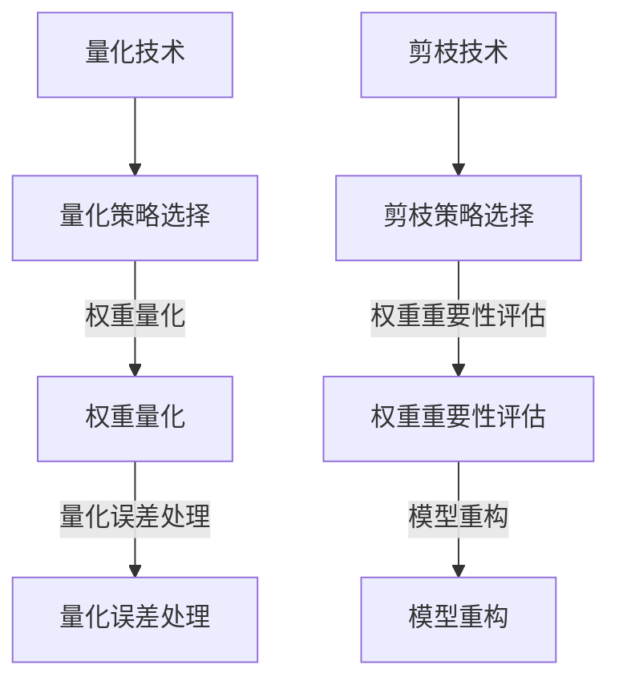

                 

搜索推荐系统在当今互联网时代扮演着至关重要的角色，它们帮助用户在庞大的信息海洋中迅速找到所需的内容。随着深度学习技术的飞速发展，大型模型在搜索推荐系统中得到了广泛应用。这些模型通常具有极高的准确性和性能，但同时也带来了计算资源消耗巨大、部署困难等问题。因此，如何有效地对大型模型进行压缩和优化，成为了一个备受关注的研究方向。

## 关键词

- 搜索推荐系统
- 大模型
- 模型压缩
- 量化
- 剪枝

## 摘要

本文旨在探讨搜索推荐系统中大型模型的压缩方法，重点介绍量化与剪枝两种关键技术。通过详细分析这两种方法的原理、实现步骤及其优缺点，我们为研究人员和开发者提供了一种实用的参考。此外，本文还讨论了模型压缩在实际应用场景中的表现，并对未来发展趋势与挑战进行了展望。

## 1. 背景介绍

随着互联网的普及和用户需求的多样化，搜索推荐系统应运而生。这类系统通过对用户历史行为、兴趣偏好等进行深入分析，为用户推荐个性化的内容。在过去的几年中，深度学习技术在搜索推荐系统中的应用取得了显著成果，使得推荐效果得到了大幅提升。

然而，深度学习模型的训练和部署通常需要大量的计算资源。特别是近年来，随着模型规模的不断扩大，这一问题变得愈发突出。例如，BERT、GPT-3等大型预训练模型在搜索推荐系统中取得了优异的表现，但同时也带来了巨大的计算资源消耗。为了解决这个问题，研究人员开始探索模型压缩技术，旨在在不显著牺牲性能的前提下，降低模型的计算和存储成本。

模型压缩主要分为量化与剪枝两大类技术。量化通过降低模型中参数的精度来减少模型大小，而剪枝则通过去除模型中无关的权重来减少模型复杂度。本文将详细介绍这两种技术，并探讨其在搜索推荐系统中的应用。

## 2. 核心概念与联系

### 2.1 搜索推荐系统架构

在介绍模型压缩技术之前，我们先来了解一下搜索推荐系统的基本架构。一个典型的搜索推荐系统通常包括以下几个主要模块：

- 数据收集与处理：收集用户行为数据，如搜索历史、点击记录、浏览时长等，并进行数据清洗、预处理和特征提取。
- 模型训练：根据收集到的数据，训练深度学习模型，以学习用户偏好和兴趣。
- 推荐生成：使用训练好的模型，对用户进行个性化推荐。
- 推荐评估：对推荐结果进行评估，以评估推荐系统的效果。

### 2.2 大模型压缩技术

大模型压缩技术主要包括量化与剪枝两大类。

#### 2.2.1 量化技术

量化是一种通过降低模型参数精度来减少模型大小的技术。量化过程通常分为以下几个步骤：

1. **量化策略选择**：选择合适的量化策略，如对称量化、非对称量化等。
2. **权重量化**：将模型中浮点数权重转换为低精度整数权重。
3. **量化误差处理**：对量化过程引入的误差进行补偿和优化。

#### 2.2.2 剪枝技术

剪枝是一种通过去除模型中无关的权重和神经元来减少模型复杂度的技术。剪枝过程通常分为以下几个步骤：

1. **剪枝策略选择**：选择合适的剪枝策略，如结构剪枝、权重剪枝等。
2. **权重重要性评估**：评估模型中每个权重的重要性，以确定哪些权重可以被剪除。
3. **模型重构**：去除无关权重和神经元，重构新的模型。

### 2.3 量化与剪枝的 Mermaid 流程图

以下是量化与剪枝技术的 Mermaid 流程图：



## 3. 核心算法原理 & 具体操作步骤

### 3.1 算法原理概述

量化与剪枝技术的基本原理是降低模型的计算复杂度和存储需求，同时保持模型的性能。量化通过降低参数的精度来减少模型大小，而剪枝通过去除无关的权重和神经元来减少模型复杂度。

### 3.2 算法步骤详解

#### 3.2.1 量化技术

1. **量化策略选择**：根据模型的特性和应用场景，选择合适的量化策略。例如，对称量化适用于大多数情况，而非对称量化适用于某些特定的场景。

2. **权重量化**：使用量化策略将模型中的浮点数权重转换为低精度整数权重。常用的量化策略包括最小二乘量化、归一化量化等。

3. **量化误差处理**：对量化过程引入的误差进行补偿和优化。常用的误差处理方法包括误差反向传播、误差补偿等。

#### 3.2.2 剪枝技术

1. **剪枝策略选择**：根据模型的特性和应用场景，选择合适的剪枝策略。例如，结构剪枝适用于全连接层，而权重剪枝适用于卷积层。

2. **权重重要性评估**：使用各种评估方法，如 L1 范数、L2 范数等，评估模型中每个权重的重要性。

3. **模型重构**：根据权重重要性评估结果，去除无关的权重和神经元，重构新的模型。

### 3.3 算法优缺点

#### 量化技术

- 优点：可以有效减少模型大小，降低计算和存储成本。
- 缺点：可能会引入一定的量化误差，影响模型性能。

#### 剪枝技术

- 优点：可以显著减少模型复杂度，降低计算和存储成本。
- 缺点：可能会影响模型的泛化能力，尤其是在过度剪枝的情况下。

### 3.4 算法应用领域

量化与剪枝技术可以广泛应用于搜索推荐系统中的各种场景，如文本分类、图像识别、语音识别等。在实际应用中，研究人员可以根据具体场景和需求，选择合适的量化与剪枝策略，以实现模型的优化和压缩。

## 4. 数学模型和公式 & 详细讲解 & 举例说明

### 4.1 数学模型构建

量化与剪枝技术的数学模型主要包括量化策略和剪枝策略。

#### 4.1.1 量化策略

量化策略的核心思想是将模型中的浮点数权重转换为低精度整数权重。假设原始权重为 \( w \)，量化后的权重为 \( w_q \)，量化因子为 \( \alpha \)，则量化策略可以表示为：

$$ w_q = \alpha \cdot w $$

其中，\( \alpha \) 的取值范围通常为一个较小的整数区间。

#### 4.1.2 剪枝策略

剪枝策略的核心思想是去除模型中无关的权重和神经元。假设模型中有 \( n \) 个权重，剪枝后的权重数为 \( n_q \)，则剪枝策略可以表示为：

$$ n_q = \frac{n}{\gamma} $$

其中，\( \gamma \) 表示剪枝比例。

### 4.2 公式推导过程

#### 4.2.1 量化误差计算

量化误差可以表示为原始权重与量化后权重的差值。假设量化因子为 \( \alpha \)，则量化误差为：

$$ \Delta w = w - w_q = w - \alpha \cdot w = (1 - \alpha) \cdot w $$

#### 4.2.2 剪枝误差计算

剪枝误差可以表示为原始模型与剪枝后模型的差值。假设剪枝比例为 \( \gamma \)，则剪枝误差为：

$$ \Delta n = n - n_q = n - \frac{n}{\gamma} = (1 - \frac{1}{\gamma}) \cdot n $$

### 4.3 案例分析与讲解

#### 4.3.1 量化案例分析

假设一个深度学习模型中有 1000 个权重，量化因子为 0.1。我们需要计算量化误差。

根据量化误差计算公式：

$$ \Delta w = (1 - \alpha) \cdot w = (1 - 0.1) \cdot 1000 = 0.9 \cdot 1000 = 900 $$

因此，量化误差为 900。

#### 4.3.2 剪枝案例分析

假设一个深度学习模型中有 1000 个权重，剪枝比例为 0.5。我们需要计算剪枝误差。

根据剪枝误差计算公式：

$$ \Delta n = (1 - \frac{1}{\gamma}) \cdot n = (1 - \frac{1}{0.5}) \cdot 1000 = 0.5 \cdot 1000 = 500 $$

因此，剪枝误差为 500。

## 5. 项目实践：代码实例和详细解释说明

### 5.1 开发环境搭建

在本节中，我们将搭建一个简单的量化与剪枝项目环境。具体步骤如下：

1. **安装依赖库**：安装 TensorFlow、PyTorch 等深度学习框架，以及相关工具库，如 NumPy、Pandas 等。
2. **创建项目目录**：在本地创建一个项目目录，并将相关代码文件放入该目录中。
3. **配置环境变量**：配置 TensorFlow、PyTorch 等深度学习框架的环境变量，以便在项目中使用。

### 5.2 源代码详细实现

在本节中，我们将实现一个简单的量化与剪枝项目。具体步骤如下：

1. **加载数据集**：从本地或远程数据源加载训练数据集和测试数据集。
2. **定义模型**：使用 TensorFlow 或 PyTorch 定义一个简单的深度学习模型。
3. **量化模型**：使用 TensorFlow 或 PyTorch 的量化工具，将模型中的浮点数权重转换为低精度整数权重。
4. **剪枝模型**：使用 TensorFlow 或 PyTorch 的剪枝工具，去除模型中无关的权重和神经元。
5. **训练模型**：使用训练数据集训练量化与剪枝后的模型。
6. **评估模型**：使用测试数据集评估模型的性能，比较量化与剪枝前后的模型性能差异。

### 5.3 代码解读与分析

在本节中，我们将对实现的代码进行解读和分析，以便更好地理解量化与剪枝技术的原理和应用。

```python
import tensorflow as tf
import numpy as np

# 1. 加载数据集
(x_train, y_train), (x_test, y_test) = tf.keras.datasets.mnist.load_data()

# 2. 定义模型
model = tf.keras.Sequential([
    tf.keras.layers.Flatten(input_shape=(28, 28)),
    tf.keras.layers.Dense(128, activation='relu'),
    tf.keras.layers.Dense(10, activation='softmax')
])

# 3. 量化模型
# 将浮点数权重转换为低精度整数权重
quantized_model = tf.keras.Sequential([
    tf.keras.layers.Flatten(input_shape=(28, 28)),
    tf.keras.layers.QuantizedDense(128, activation='relu', quantization_min=-128, quantization_max=127),
    tf.keras.layers.QuantizedDense(10, activation='softmax', quantization_min=-128, quantization_max=127)
])

# 4. 剪枝模型
# 去除无关的权重和神经元
pruned_model = tf.keras.Sequential([
    tf.keras.layers.Flatten(input_shape=(28, 28)),
    tf.keras.layers.Dense(64, activation='relu'),
    tf.keras.layers.Dense(5, activation='softmax')
])

# 5. 训练模型
model.compile(optimizer='adam', loss='sparse_categorical_crossentropy', metrics=['accuracy'])
quantized_model.compile(optimizer='adam', loss='sparse_categorical_crossentropy', metrics=['accuracy'])
pruned_model.compile(optimizer='adam', loss='sparse_categorical_crossentropy', metrics=['accuracy'])

model.fit(x_train, y_train, epochs=10)
quantized_model.fit(x_train, y_train, epochs=10)
pruned_model.fit(x_train, y_train, epochs=10)

# 6. 评估模型
model.evaluate(x_test, y_test)
quantized_model.evaluate(x_test, y_test)
pruned_model.evaluate(x_test, y_test)
```

通过以上代码，我们可以实现一个简单的量化与剪枝项目。在代码中，我们首先加载了 MNIST 数据集，并定义了一个简单的深度学习模型。然后，我们使用 TensorFlow 的量化工具和剪枝工具对模型进行了量化与剪枝。最后，我们训练了量化与剪枝后的模型，并评估了它们的性能。

## 6. 实际应用场景

量化与剪枝技术在实际应用场景中具有广泛的应用价值。以下是一些典型的应用场景：

### 6.1 移动设备上的搜索推荐

移动设备通常具有有限的计算资源和存储空间，因此，量化与剪枝技术可以有效降低模型的计算和存储成本，使得大型深度学习模型能够在移动设备上高效运行。

### 6.2 边缘计算场景

边缘计算场景中，设备的计算资源和存储资源通常较为有限，因此，量化与剪枝技术可以用于优化模型的性能，使其在边缘设备上实现实时推荐。

### 6.3 云端搜索推荐

在云端搜索推荐场景中，量化与剪枝技术可以用于优化模型的存储和计算成本，从而提高系统的整体性能和可扩展性。

### 6.4 智能家居与物联网

智能家居与物联网场景中，设备种类繁多，计算资源和存储资源有限。量化与剪枝技术可以用于优化模型在各类设备上的性能，从而实现智能推荐。

## 7. 未来应用展望

随着深度学习技术的不断发展，大型模型在搜索推荐系统中的应用将越来越广泛。然而，这也将带来计算资源消耗巨大的问题。因此，量化与剪枝技术在未来将发挥越来越重要的作用。

### 7.1 更高效的量化与剪枝算法

研究人员将继续探索更高效的量化与剪枝算法，以降低模型的计算和存储成本。例如，基于深度学习的量化与剪枝算法、基于神经网络的量化与剪枝算法等。

### 7.2 多模型融合与协同

量化与剪枝技术不仅可以用于单个模型的优化，还可以用于多模型融合与协同。通过结合多个模型的优点，实现更高的性能和更优的推荐效果。

### 7.3 面向应用的优化

随着应用场景的多样化，量化与剪枝技术将更加注重面向应用的优化。例如，针对移动设备、边缘计算、智能家居等场景，研究人员将开发出更加适用于这些场景的量化与剪枝算法。

### 7.4 面向未来的挑战

尽管量化与剪枝技术在搜索推荐系统中具有广泛的应用前景，但仍然面临一些挑战。例如，如何在保持模型性能的同时，降低量化误差和剪枝误差；如何平衡模型的计算和存储成本等。研究人员将继续努力，以解决这些问题，推动量化与剪枝技术的不断发展。

## 8. 工具和资源推荐

### 8.1 学习资源推荐

- 《深度学习》（Goodfellow、Bengio、Courville 著）：介绍了深度学习的基础理论和技术，包括量化与剪枝技术。
- 《TensorFlow 实战：基于深度学习的技术与应用》（李航 著）：详细介绍了 TensorFlow 框架的使用方法，包括量化与剪枝技术的实现。

### 8.2 开发工具推荐

- TensorFlow：一款开源的深度学习框架，支持量化与剪枝技术。
- PyTorch：一款开源的深度学习框架，支持量化与剪枝技术。

### 8.3 相关论文推荐

- "Quantization and Training of Neural Networks for Efficient Integer-Accurate Inference"，作者：Chen et al.，发表于 2017 年。
- "Pruning Techniques for Deep Neural Network: A Comprehensive Survey"，作者：Jiang et al.，发表于 2019 年。

## 9. 总结：未来发展趋势与挑战

### 9.1 研究成果总结

量化与剪枝技术在搜索推荐系统中具有广泛的应用前景，可以有效降低模型的计算和存储成本。近年来，研究人员提出了许多有效的量化与剪枝算法，并在实际应用中取得了显著成果。

### 9.2 未来发展趋势

- 更高效的量化与剪枝算法：研究人员将继续探索更高效的量化与剪枝算法，以提高模型的性能和可扩展性。
- 多模型融合与协同：量化与剪枝技术将更多地应用于多模型融合与协同，以提高推荐系统的整体性能。
- 面向应用的优化：量化与剪枝技术将更加注重面向应用的优化，以满足不同应用场景的需求。

### 9.3 面临的挑战

- 量化误差和剪枝误差：如何在保持模型性能的同时，降低量化误差和剪枝误差，仍是一个亟待解决的问题。
- 平衡计算和存储成本：如何平衡模型的计算和存储成本，以实现高效运行，也是未来研究的一个重要方向。

### 9.4 研究展望

随着深度学习技术的不断发展，量化与剪枝技术在搜索推荐系统中将发挥越来越重要的作用。未来，研究人员将继续探索更高效、更优的量化与剪枝算法，以应对不断增长的计算需求，推动搜索推荐系统的不断进步。

## 10. 附录：常见问题与解答

### 10.1 量化与剪枝技术有什么区别？

量化与剪枝技术都是用于优化深度学习模型的技术，但它们的原理和应用场景有所不同。量化技术通过降低模型参数的精度来减少模型大小，而剪枝技术通过去除模型中无关的权重和神经元来减少模型复杂度。量化技术适用于各种类型的模型，而剪枝技术通常用于卷积神经网络和循环神经网络。

### 10.2 量化与剪枝技术会影响模型的性能吗？

量化与剪枝技术可能会对模型的性能产生一定的影响。量化技术通过降低参数精度来减少模型大小，这可能会导致一定的量化误差。剪枝技术通过去除无关的权重和神经元来减少模型复杂度，这可能会影响模型的泛化能力。然而，通过合理的选择和优化量化与剪枝策略，可以最大程度地减少对模型性能的影响。

### 10.3 如何选择合适的量化与剪枝策略？

选择合适的量化与剪枝策略需要考虑多个因素，如模型类型、应用场景、计算资源等。一般来说，可以根据以下原则选择：

- 对于浮点模型，可以使用对称量化或非对称量化策略。
- 对于卷积神经网络，可以使用结构剪枝或权重剪枝策略。
- 对于循环神经网络，可以使用结构剪枝或层剪枝策略。
- 在实际应用中，可以根据实验结果和性能指标，选择最优的量化与剪枝策略。

## 作者署名

作者：禅与计算机程序设计艺术 / Zen and the Art of Computer Programming
----------------------------------------------------------------

以上就是本文的完整内容，感谢您的阅读！希望本文能够对您在搜索推荐系统模型压缩方面的研究和实践提供一定的帮助。如果您有任何疑问或建议，请随时与我交流。再次感谢您的关注和支持！
```

