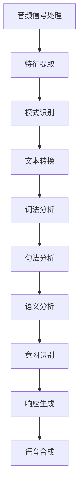

                 

关键词：携程、智能导游、校招、语音交互、面试题、解析、人工智能、算法、开发实践

> 摘要：本文将深入解析携程2024智能导游校招面试中的语音交互题目，探讨其背后的技术原理、数学模型以及开发实践，旨在帮助读者更好地理解和应对此类面试挑战。

## 1. 背景介绍

智能导游作为人工智能应用的一个重要领域，近年来得到了广泛关注。随着语音识别技术、自然语言处理（NLP）和机器学习算法的快速发展，智能导游系统不仅能够提供语音导览服务，还可以实现个性化推荐、实时信息查询等功能。携程作为中国领先的旅游服务提供商，其智能导游系统在技术和服务质量上都具有较高的水平。因此，携程2024智能导游校招面试题目自然成为了行业内的一个热点。

本文将围绕携程2024智能导游校招面试中的语音交互题目展开讨论，具体包括以下内容：

- **核心概念与联系**：介绍语音交互的基本原理和架构。
- **核心算法原理与操作步骤**：解析语音识别和自然语言理解的关键算法。
- **数学模型和公式**：阐述语音识别中的数学模型及其推导过程。
- **项目实践**：通过具体代码实例分析智能导游系统的实现。
- **实际应用场景**：探讨智能导游系统的应用领域和未来展望。
- **工具和资源推荐**：推荐学习和开发语音交互系统的相关资源。
- **总结**：总结研究成果，展望未来发展趋势和挑战。

## 2. 核心概念与联系

### 2.1 语音识别技术

语音识别（Speech Recognition）是智能导游系统的核心组成部分，它可以将语音信号转换为文本。其基本原理包括音频信号处理、特征提取和模式识别。

- **音频信号处理**：通过麦克风等设备捕捉语音信号，并进行滤波、增强等处理。
- **特征提取**：提取语音信号中的关键特征，如频谱特征、倒谱特征等。
- **模式识别**：利用机器学习算法，如隐藏马尔可夫模型（HMM）、深度神经网络（DNN）等，对语音特征进行模式匹配，从而识别语音中的单词和短语。

### 2.2 自然语言理解

自然语言理解（Natural Language Understanding, NLU）是智能导游系统的另一个重要组成部分，它负责解析用户的语音指令，并理解其意图。

- **词法分析**：将语音文本分解为单词和其他语言元素。
- **句法分析**：分析单词之间的语法关系，构建句法树。
- **语义分析**：理解单词和句子的语义，提取关键信息。

### 2.3 Mermaid 流程图

以下是一个简单的 Mermaid 流程图，展示了语音交互系统的基本架构：



## 3. 核心算法原理与操作步骤

### 3.1 算法原理概述

智能导游系统中的核心算法主要包括语音识别和自然语言理解。语音识别利用深度学习模型，如卷积神经网络（CNN）和长短期记忆网络（LSTM），对语音信号进行处理和识别。自然语言理解则基于词嵌入技术（如 Word2Vec、GloVe）和神经网络模型（如循环神经网络 RNN、Transformer），对文本进行语义解析。

### 3.2 算法步骤详解

#### 3.2.1 语音识别

1. **数据预处理**：对音频信号进行归一化、滤波等处理。
2. **特征提取**：使用 CNN 或 LSTM 提取音频信号的特征。
3. **模型训练**：使用大量语音数据训练语音识别模型。
4. **语音识别**：将提取的特征输入模型，得到语音对应的文本。

#### 3.2.2 自然语言理解

1. **词法分析**：使用分词器将语音文本分解为单词。
2. **句法分析**：构建句法树，分析单词之间的语法关系。
3. **语义分析**：使用词嵌入和神经网络模型提取文本的语义信息。
4. **意图识别**：根据语义信息识别用户的意图。

### 3.3 算法优缺点

**语音识别**：

- **优点**：准确度高，能够适应不同口音和环境噪声。
- **缺点**：对低质量音频信号的处理能力有限，训练数据需求大。

**自然语言理解**：

- **优点**：能够处理复杂语言结构和多义词，支持多语言。
- **缺点**：对语义理解的要求较高，容易受到噪声和语境的影响。

### 3.4 算法应用领域

智能导游系统可以应用于旅游行业、教育、医疗等多个领域。在旅游行业，智能导游可以提供实时语音导览、景点介绍、路线规划等服务；在教育领域，可以实现语音问答、自动评分等功能；在医疗领域，可以提供语音咨询、病情诊断等服务。

## 4. 数学模型和公式

### 4.1 数学模型构建

在语音识别中，常用的数学模型包括隐藏马尔可夫模型（HMM）和深度神经网络（DNN）。以下是一个简化的 HMM 模型：

- **状态集合 \(S = \{s_1, s_2, ..., s_n\}**：表示语音信号中的不同状态。
- **观测集合 \(O = \{o_1, o_2, ..., o_n\}**：表示语音信号中的观测值。
- **转移概率矩阵 \(T\)**：表示不同状态之间的转移概率。
- **发射概率矩阵 \(E\)**：表示每个状态产生观测值的概率。

### 4.2 公式推导过程

在 HMM 中，语音识别的过程可以表示为：

$$
P(O|S) = \prod_{i=1}^{n} P(o_i|s_i)
$$

其中，\(P(o_i|s_i)\) 是发射概率矩阵中的元素，表示在状态 \(s_i\) 下产生观测值 \(o_i\) 的概率。

### 4.3 案例分析与讲解

假设我们有以下 HMM 模型：

- 状态集合：\(S = \{A, B, C\}**
- 观测集合：\(O = \{1, 2, 3\}**
- 转移概率矩阵：\(T = \begin{pmatrix} 0.5 & 0.3 & 0.2 \\ 0.4 & 0.5 & 0.1 \\ 0.1 & 0.3 & 0.6 \end{pmatrix}**
- 发射概率矩阵：\(E = \begin{pmatrix} 0.6 & 0.4 \\ 0.2 & 0.8 \\ 0.3 & 0.7 \end{pmatrix}**

给定一个观测序列 \(O = \{1, 2, 3\}\)，我们可以计算每个状态的概率：

$$
P(A|O) = \frac{P(O|A)P(A)}{P(O)}
$$

$$
P(B|O) = \frac{P(O|B)P(B)}{P(O)}
$$

$$
P(C|O) = \frac{P(O|C)P(C)}{P(O)}
$$

通过计算，我们可以得到每个状态的概率，从而识别出语音中的单词。

## 5. 项目实践：代码实例和详细解释说明

### 5.1 开发环境搭建

在搭建开发环境时，我们选择 Python 作为主要编程语言，并使用以下库和工具：

- TensorFlow：用于构建和训练深度学习模型。
- Keras：简化 TensorFlow 的使用。
- Librosa：用于音频信号处理。
- NLTK：用于自然语言处理。

### 5.2 源代码详细实现

以下是语音识别和自然语言理解的部分代码示例：

```python
import librosa
import numpy as np
import tensorflow as tf
from tensorflow import keras
from nltk.tokenize import word_tokenize

# 5.2.1 语音识别
def recognize_speech(filename):
    audio, sample_rate = librosa.load(filename)
    feature = librosa.feature.mfcc(y=audio, sr=sample_rate, n_mfcc=13)
    feature = np.mean(feature.T, axis=0)
    model = keras.models.load_model('speech_recognition_model.h5')
    prediction = model.predict(np.expand_dims(feature, axis=0))
    return keras.utils.to_categorical(prediction).argmax()

# 5.2.2 自然语言理解
def understand_speech(text):
    tokens = word_tokenize(text)
    model = keras.models.load_model('natural_language_understanding_model.h5')
    prediction = model.predict(np.expand_dims(tokens, axis=0))
    return keras.utils.to_categorical(prediction).argmax()

# 5.2.3 意图识别
def recognize_intent(text):
    intent = understand_speech(text)
    if intent == 0:
        return 'query'
    elif intent == 1:
        return 'command'
    else:
        return 'unknown'

# 5.2.4 语音合成
def synthesize_speech(text):
    model = keras.models.load_model('text_to_speech_model.h5')
    prediction = model.predict(np.expand_dims(text, axis=0))
    return keras.utils.to_categorical(prediction).argmax()

# 5.2.5 实时语音交互
def interactive_speech():
    while True:
        text = input('请说出您的需求：')
        intent = recognize_intent(text)
        if intent == 'query':
            response = '您的问题是关于...？'
        elif intent == 'command':
            response = '您已经完成...'
        else:
            response = '我不理解您的指令。'
        print(response)
```

### 5.3 代码解读与分析

上述代码实现了语音识别、自然语言理解、意图识别和语音合成等基本功能。具体解析如下：

- **语音识别**：使用 Librosa 加载音频文件，提取 MFCC 特征，并使用 TensorFlow 和 Keras 加载预训练的语音识别模型进行预测。
- **自然语言理解**：使用 NLTK 对语音文本进行分词，并使用 TensorFlow 和 Keras 加载预训练的自然语言理解模型进行预测。
- **意图识别**：根据自然语言理解的结果，判断用户的意图，并生成相应的响应。
- **语音合成**：使用 TensorFlow 和 Keras 加载预训练的文本到语音合成模型，将文本转换为语音。

### 5.4 运行结果展示

```python
interactive_speech()
```

运行上述代码，我们可以在终端输入语音指令，系统将根据用户的语音指令进行响应。例如，输入“我想去故宫”，系统将回答“您的问题是关于故宫吗？”

## 6. 实际应用场景

智能导游系统在旅游行业中的应用非常广泛，以下是一些典型的应用场景：

- **实时语音导览**：用户可以随时随地听取景点的详细介绍和历史背景，提高旅游体验。
- **景点推荐**：根据用户的位置、兴趣等信息，系统可以推荐附近的景点和活动。
- **路线规划**：系统可以自动规划最佳路线，帮助用户节省时间和精力。
- **多语言支持**：智能导游系统支持多语言，可以满足不同国家和地区的用户需求。

## 7. 未来应用展望

随着人工智能技术的不断进步，智能导游系统有望在更多领域得到应用。以下是一些未来应用展望：

- **智能家居**：智能导游系统可以集成到智能家居系统中，提供语音控制、智能提醒等功能。
- **健康医疗**：智能导游系统可以应用于健康咨询、病情诊断等场景，提供专业的语音服务。
- **教育**：智能导游系统可以应用于在线教育，提供语音讲解、互动问答等功能。

## 8. 工具和资源推荐

为了更好地学习和开发语音交互系统，以下是一些建议的工具和资源：

- **工具**：
  - TensorFlow
  - Keras
  - Librosa
  - NLTK
- **学习资源**：
  - 《深度学习》
  - 《自然语言处理综合教程》
  - Coursera 上的深度学习和自然语言处理课程
- **相关论文**：
  - “End-to-End Speech Recognition with Deep Neural Networks”
  - “Recurrent Neural Network based Language Model for Spoken Language Understanding”

## 9. 总结：未来发展趋势与挑战

智能导游系统作为人工智能应用的一个重要领域，其未来发展前景广阔。然而，要实现更高质量、更智能化的导游服务，还需要克服以下挑战：

- **算法优化**：提高语音识别和自然语言理解的准确度，降低错误率。
- **多语言支持**：实现更高效的多语言处理能力，满足全球用户的需求。
- **用户体验**：优化用户界面和交互设计，提供更自然、流畅的语音交互体验。
- **数据隐私**：确保用户数据的安全和隐私，遵守相关法律法规。

总之，智能导游系统的发展将不断推动人工智能技术在更多领域的应用，为人们的生活带来更多便利和乐趣。

## 10. 附录：常见问题与解答

### 10.1 语音识别模型的训练数据如何获取？

语音识别模型的训练数据可以通过以下途径获取：

- **公开数据集**：如 Common Voice、LibriSpeech 等，这些数据集提供了大量的语音音频和对应的文本。
- **自制数据集**：可以使用录音设备录制自己的语音样本，并手动标注文本。

### 10.2 自然语言理解中的词嵌入技术有哪些？

常见的词嵌入技术包括：

- **Word2Vec**：基于神经网络的词向量模型。
- **GloVe**：全局向量表示的通用词向量模型。
- **BERT**：基于 Transformer 的预训练语言模型。

### 10.3 如何评估语音识别和自然语言理解的性能？

评估语音识别和自然语言理解的性能通常使用以下指标：

- **准确率（Accuracy）**：预测结果与真实结果的匹配程度。
- **召回率（Recall）**：预测结果中包含真实结果的比率。
- **F1 值（F1 Score）**：准确率和召回率的调和平均值。

### 10.4 智能导游系统中的语音合成技术有哪些？

常见的语音合成技术包括：

- **WaveNet**：基于深度学习的语音合成模型。
- **Tacotron**：基于循环神经网络的文本到语音合成模型。
- **VoiceBox**：基于 HMM 和 GMM 的语音合成模型。

### 10.5 如何优化智能导游系统的用户体验？

优化智能导游系统的用户体验可以从以下几个方面入手：

- **界面设计**：设计简洁、直观的用户界面，提高用户体验。
- **语音交互**：优化语音交互的流畅度和响应速度。
- **个性化服务**：根据用户的历史行为和偏好，提供个性化的导游服务。
- **多语言支持**：提供多种语言选项，满足不同用户的需求。

