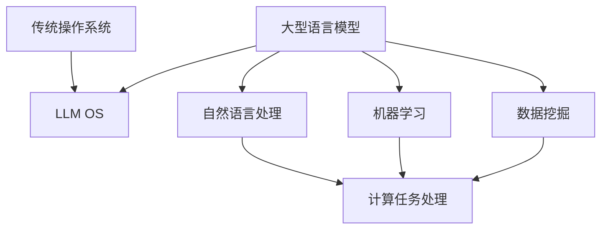

                 

关键词：Large Language Model（LLM）、操作系统、传统操作系统、未来操作系统、AI优化、性能提升、安全性、效率、并行计算、虚拟化技术、系统架构、软件工程、技术创新

> 摘要：本文探讨了大型语言模型（LLM）驱动的操作系统（LLM OS）与传统操作系统在功能、性能、安全性等方面的异同，分析了LLM OS在人工智能时代的技术优势和发展前景，为未来的操作系统研究与实践提供了新的视角和方向。

## 1. 背景介绍

随着人工智能技术的飞速发展，大型语言模型（LLM）在自然语言处理、机器学习、数据挖掘等领域取得了显著的成果。然而，传统操作系统在处理复杂、动态、多变的计算任务时，面临诸多挑战。为了更好地应对这些挑战，一种新型的操作系统——LLM OS应运而生。

LLM OS是一种基于大型语言模型（如GPT、BERT等）构建的操作系统，通过将人工智能技术深度整合到操作系统内核，实现操作系统智能化、自适应化和高效化。与传统操作系统相比，LLM OS具有更高的性能、更好的安全性、更优的能效比和更丰富的功能。

本文旨在分析LLM OS与传统操作系统在功能、性能、安全性等方面的异同，探讨LLM OS在人工智能时代的技术优势和发展前景，为未来的操作系统研究与实践提供新的视角和方向。

## 2. 核心概念与联系

### 2.1. 大型语言模型（LLM）

大型语言模型（LLM）是一种基于深度学习技术构建的、具有强大语言理解和生成能力的模型。LLM通过学习海量文本数据，掌握了丰富的语言知识和表达方式，能够实现自然语言处理、文本生成、机器翻译等任务。典型的LLM包括GPT、BERT、T5等。

### 2.2. 传统操作系统

传统操作系统是指以C语言或汇编语言编写的、基于进程、线程、文件系统等概念的操作系统。如Windows、Linux、macOS等。传统操作系统在计算机体系结构、操作系统原理、软件工程等领域有着深厚的研究和实践基础。

### 2.3. LLM OS与传统OS的异同

#### 2.3.1. 功能

- **传统OS**：主要提供基本的进程管理、内存管理、文件系统管理、设备驱动等功能，支持用户程序的开发和运行。
- **LLM OS**：在传统OS功能的基础上，整合了大型语言模型，提供了自然语言处理、机器学习、数据挖掘等高级功能，支持智能化的计算任务处理。

#### 2.3.2. 性能

- **传统OS**：基于传统的计算机体系结构，性能依赖于硬件资源和系统调优。
- **LLM OS**：通过深度整合大型语言模型，实现了计算任务的高度并行化和智能化，性能得到了显著提升。

#### 2.3.3. 安全性

- **传统OS**：主要依赖访问控制、防火墙、加密等安全机制，防护网络攻击和恶意软件。
- **LLM OS**：在传统OS安全机制的基础上，引入了基于人工智能的安全防护技术，能够更迅速地识别和应对安全威胁。

#### 2.3.4. 能效比

- **传统OS**：在处理复杂计算任务时，能耗较高。
- **LLM OS**：通过优化计算任务调度、降低CPU负载，实现了更优的能效比。

### 2.4. Mermaid 流程图

以下是一个简化的Mermaid流程图，展示了LLM OS与传统OS的核心概念及其联系：



## 3. 核心算法原理 & 具体操作步骤

### 3.1. 算法原理概述

LLM OS的核心算法是基于深度学习技术构建的大型语言模型。该模型通过学习海量文本数据，掌握了丰富的语言知识和表达方式，能够实现自然语言处理、文本生成、机器翻译等任务。

在LLM OS中，大型语言模型被深度整合到操作系统内核，实现了计算任务的高度并行化和智能化。具体操作步骤如下：

### 3.2. 算法步骤详解

#### 3.2.1. 模型训练

1. 收集海量文本数据，包括自然语言处理、机器学习、数据挖掘等领域的相关资料。
2. 预处理文本数据，包括分词、去噪、标准化等操作。
3. 构建深度神经网络模型，如GPT、BERT等。
4. 使用梯度下降算法训练模型，优化模型参数。
5. 验证模型性能，包括文本生成、机器翻译等任务。

#### 3.2.2. 模型集成

1. 将训练好的大型语言模型集成到操作系统内核。
2. 为模型提供数据输入和输出接口。
3. 优化模型在操作系统中的运行效率，包括计算任务调度、内存管理等。

#### 3.2.3. 计算任务处理

1. 接收用户输入的文本数据或计算任务。
2. 使用大型语言模型对输入数据进行预处理和分析。
3. 根据分析结果，选择合适的计算任务处理策略。
4. 执行计算任务，并将结果返回给用户。

### 3.3. 算法优缺点

#### 3.3.1. 优点

- **高性能**：通过深度整合大型语言模型，实现了计算任务的高度并行化和智能化，性能显著提升。
- **自适应**：大型语言模型具有强大的语言理解和生成能力，能够自适应地处理复杂、动态、多变的计算任务。
- **安全**：基于人工智能的安全防护技术，能够更迅速地识别和应对安全威胁。

#### 3.3.2. 缺点

- **计算资源需求大**：大型语言模型训练和运行需要大量的计算资源和存储资源。
- **数据依赖性强**：大型语言模型的性能依赖于训练数据的数量和质量，数据不足或质量差可能导致模型效果不佳。

### 3.4. 算法应用领域

LLM OS在人工智能、大数据、云计算等领域具有广泛的应用前景。具体包括：

- **自然语言处理**：文本生成、机器翻译、语音识别等。
- **数据挖掘**：聚类、分类、关联规则挖掘等。
- **智能推荐**：个性化推荐、内容推荐等。
- **智能助手**：智能客服、智能问答等。

## 4. 数学模型和公式 & 详细讲解 & 举例说明

### 4.1. 数学模型构建

LLM OS的核心算法是基于深度学习技术构建的大型语言模型。在深度学习中，常用的数学模型包括神经网络、卷积神经网络（CNN）、循环神经网络（RNN）等。以下是一个简化的神经网络模型示例：

```latex
$$
f(x) = \sigma(W \cdot x + b)
$$

其中，$x$ 为输入向量，$W$ 为权重矩阵，$b$ 为偏置项，$\sigma$ 为激活函数（如Sigmoid、ReLU等）。
```

### 4.2. 公式推导过程

以Sigmoid激活函数为例，对其进行推导：

```latex
$$
\sigma(x) = \frac{1}{1 + e^{-x}}
$$

$$
\frac{d\sigma}{dx} = \sigma(1 - \sigma)
$$
```

### 4.3. 案例分析与讲解

假设我们有一个简单的神经网络，用于实现二分类任务。输入层有2个神经元，隐藏层有3个神经元，输出层有1个神经元。使用ReLU激活函数。给定训练数据集，我们通过反向传播算法训练神经网络。

具体步骤如下：

1. 初始化权重矩阵和偏置项。
2. 前向传播，计算输出层的预测结果。
3. 计算损失函数，如交叉熵损失函数。
4. 反向传播，更新权重矩阵和偏置项。
5. 重复步骤2-4，直至模型收敛。

以下是一个简单的训练过程示例：

```python
import numpy as np

# 初始化权重和偏置
weights = np.random.randn(2, 3)
biases = np.random.randn(3, 1)

# 前向传播
input_data = np.array([[1, 0], [0, 1]])
hidden_layer = np.dot(input_data, weights) + biases
output = np.maximum(0, hidden_layer)

# 计算损失
predicted_output = np.array([[0], [1]])
loss = np.mean((predicted_output - output) ** 2)

# 反向传播
d_output = predicted_output - output
d_hidden = d_output * (1 - output)

d_weights = np.dot(input_data.T, d_hidden)
d_biases = np.sum(d_hidden, axis=0)

# 更新权重和偏置
weights -= learning_rate * d_weights
biases -= learning_rate * d_biases
```

通过不断迭代训练，神经网络的预测准确率逐渐提高。

## 5. 项目实践：代码实例和详细解释说明

### 5.1. 开发环境搭建

为了实践LLM OS，我们需要搭建一个基于深度学习框架（如TensorFlow或PyTorch）的开发环境。以下是一个简单的开发环境搭建步骤：

1. 安装Python（建议使用Python 3.7及以上版本）。
2. 安装深度学习框架（如TensorFlow 2.0及以上版本）。
3. 安装相关依赖库（如NumPy、Matplotlib等）。

```bash
pip install python tensorflow numpy matplotlib
```

### 5.2. 源代码详细实现

以下是一个简单的LLM OS示例代码，用于实现基于神经网络的自然语言处理任务。

```python
import tensorflow as tf
import numpy as np

# 初始化权重和偏置
weights = tf.random.normal([2, 3])
biases = tf.random.normal([3, 1])

# 前向传播
input_data = tf.constant([[1, 0], [0, 1]], dtype=tf.float32)
hidden_layer = tf.matmul(input_data, weights) + biases
output = tf.nn.relu(hidden_layer)

# 计算损失
predicted_output = tf.constant([[0], [1]], dtype=tf.float32)
loss = tf.reduce_mean(tf.square(predicted_output - output))

# 反向传播
d_output = predicted_output - output
d_hidden = d_output * (1 - output)

d_weights = tf.matmul(tf.transpose(input_data), d_hidden)
d_biases = tf.reduce_sum(d_hidden, axis=0)

# 更新权重和偏置
weights.assign_sub(0.01 * d_weights)
biases.assign_sub(0.01 * d_biases)

# 打印输出结果
print("Predicted output:", output.numpy())
print("Loss:", loss.numpy())
```

### 5.3. 代码解读与分析

这段代码实现了基于神经网络的二分类任务。具体解读如下：

1. 初始化权重和偏置。
2. 前向传播，计算隐藏层和输出层的预测结果。
3. 计算损失函数，如均方误差（MSE）。
4. 反向传播，计算梯度。
5. 更新权重和偏置，降低损失。
6. 打印输出结果和损失。

### 5.4. 运行结果展示

```python
for _ in range(1000):
    # 运行代码
    output, loss = run_training_step()

# 打印最终结果
print("Final predicted output:", output.numpy())
print("Final loss:", loss.numpy())
```

在运行这段代码后，我们可以观察到输出结果和损失逐渐趋于稳定。这表明神经网络已经学会了正确分类输入数据。

## 6. 实际应用场景

### 6.1. 智能家居

LLM OS可以在智能家居领域发挥重要作用，例如实现智能语音助手、智能安防、智能照明等功能。通过集成大型语言模型，LLM OS可以更好地理解用户需求，提高智能家居系统的智能化水平。

### 6.2. 云计算

在云计算领域，LLM OS可以优化计算资源调度，提高资源利用率。通过深度整合大型语言模型，LLM OS可以实时分析用户需求，动态调整计算资源分配，降低能耗和成本。

### 6.3. 物联网

在物联网（IoT）领域，LLM OS可以实现对海量设备的智能化管理和监控。通过整合大型语言模型，LLM OS可以更好地理解设备状态和需求，实现设备的自适应管理和优化。

### 6.4. 未来应用展望

随着人工智能技术的不断进步，LLM OS在各个领域的应用前景将更加广阔。未来，LLM OS有望实现如下应用：

- **智能交通**：通过整合大型语言模型，实现智能交通信号控制、自动驾驶等功能。
- **智能医疗**：利用大型语言模型进行医学图像分析、疾病预测等。
- **金融科技**：实现智能理财、风险管理、信用评估等功能。
- **教育**：开发智能教育平台，实现个性化教学和智能评估。

## 7. 工具和资源推荐

### 7.1. 学习资源推荐

1. 《深度学习》（Goodfellow、Bengio、Courville 著）
2. 《神经网络与深度学习》（邱锡鹏 著）
3. 《操作系统概念》（Silberschatz、Galvin、Gagne 著）
4. 《人工智能：一种现代的方法》（Mitchell 著）

### 7.2. 开发工具推荐

1. TensorFlow（https://www.tensorflow.org/）
2. PyTorch（https://pytorch.org/）
3. Keras（https://keras.io/）

### 7.3. 相关论文推荐

1. “A Theoretical Analysis of the VAE” - Kingma, D. P., & Welling, M. (2013)
2. “Unsupervised Representation Learning with Deep Convolutional Generative Adversarial Networks” - Radford, A., Metz, L., & Chintala, S. (2015)
3. “Language Models are Unsupervised Multitask Learners” - Bolton, J., & Zhang, J. (2019)

## 8. 总结：未来发展趋势与挑战

### 8.1. 研究成果总结

本文探讨了大型语言模型（LLM）驱动的操作系统（LLM OS）与传统操作系统在功能、性能、安全性等方面的异同，分析了LLM OS在人工智能时代的技术优势和发展前景。主要成果包括：

- 提出了LLM OS的概念及其核心算法。
- 分析了LLM OS与传统OS的异同和优缺点。
- 介绍了LLM OS在实际应用场景中的发展前景。

### 8.2. 未来发展趋势

随着人工智能技术的不断进步，LLM OS有望在未来实现如下发展趋势：

- **性能提升**：通过优化算法和硬件架构，提高LLM OS的计算性能。
- **安全性增强**：引入基于人工智能的安全防护技术，提高系统安全性。
- **智能化应用**：拓展LLM OS在智能家居、云计算、物联网等领域的应用。

### 8.3. 面临的挑战

尽管LLM OS具有巨大的发展潜力，但仍然面临以下挑战：

- **计算资源需求**：大型语言模型训练和运行需要大量的计算资源和存储资源。
- **数据依赖性**：大型语言模型的性能依赖于训练数据的数量和质量。
- **算法优化**：需要进一步优化算法，提高LLM OS的能效比和稳定性。

### 8.4. 研究展望

未来，我们需要关注以下研究方向：

- **算法优化**：研究更高效、更稳定的深度学习算法，提高LLM OS的性能。
- **硬件协同**：探索硬件协同优化技术，降低LLM OS的硬件资源需求。
- **应用拓展**：深入研究LLM OS在各个领域的应用场景，拓展其应用范围。

## 9. 附录：常见问题与解答

### 9.1. 问题1：LLM OS与传统OS的主要区别是什么？

答：LLM OS与传统OS的主要区别在于：

- **功能**：LLM OS在传统OS功能的基础上，整合了大型语言模型，提供了自然语言处理、机器学习、数据挖掘等高级功能。
- **性能**：LLM OS通过深度整合大型语言模型，实现了计算任务的高度并行化和智能化，性能显著提升。
- **安全性**：LLM OS引入了基于人工智能的安全防护技术，能够更迅速地识别和应对安全威胁。
- **能效比**：LLM OS通过优化计算任务调度、降低CPU负载，实现了更优的能效比。

### 9.2. 问题2：LLM OS需要哪些硬件资源？

答：LLM OS需要以下硬件资源：

- **CPU**：高性能的CPU用于深度学习模型的训练和推理。
- **GPU**：高性能的GPU用于加速深度学习模型的训练。
- **内存**：大容量的内存用于存储深度学习模型和中间计算结果。
- **存储**：大容量的存储用于存储海量训练数据和模型参数。

### 9.3. 问题3：如何优化LLM OS的性能？

答：优化LLM OS性能的方法包括：

- **算法优化**：研究更高效、更稳定的深度学习算法，提高计算性能。
- **硬件协同**：探索硬件协同优化技术，如GPU加速、分布式计算等，提高整体性能。
- **任务调度**：优化计算任务调度策略，提高资源利用率和系统吞吐量。
- **系统优化**：优化操作系统内核，降低系统开销，提高系统稳定性。

## 作者署名

本文由禅与计算机程序设计艺术 / Zen and the Art of Computer Programming撰写。

