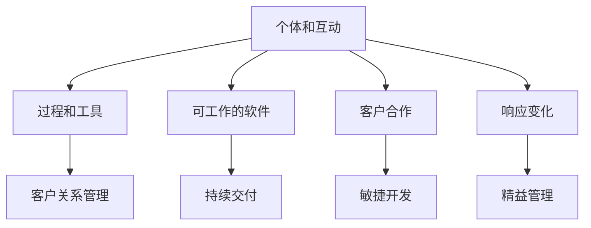

                 

 **关键词：** 敏捷管理、组织策略、快速变化、IT项目管理、持续交付、团队协作、架构设计

> **摘要：** 本文旨在探讨敏捷管理在快速变化组织中的应用，通过分析敏捷管理的核心概念、实践方法及其在IT项目中的实际应用，旨在为组织提供一种适应性强、灵活高效的管理策略，助力组织在动态环境中保持竞争力。

## 1. 背景介绍

在当今数字化时代，信息技术的快速发展带来了前所未有的变革。互联网、云计算、大数据等技术的广泛应用，使得企业的运营模式和市场竞争格局发生了深刻的变化。在这种背景下，传统的管理模式已难以满足组织对快速响应市场变化的需求，敏捷管理应运而生。

敏捷管理是一种以人为核心、迭代、灵活、可持续的管理理念。它起源于软件开发领域，并在过去几十年里得到了广泛应用和持续发展。敏捷管理的核心思想是快速响应变化，通过不断迭代和持续交付，确保项目的成功实施和交付。

本文将重点探讨敏捷管理在快速变化组织中的应用，分析其在IT项目管理中的实践方法，并结合实际案例，提出敏捷管理的实施策略和建议。

## 2. 核心概念与联系

### 2.1 敏捷管理的核心概念

敏捷管理基于一系列核心概念，包括：

- **个体和互动重于过程和工具**：敏捷管理强调团队成员的沟通、协作和创新能力，而非过分依赖流程和工具。
- **可工作的软件重于详尽的文档**：敏捷管理认为，可工作的软件是衡量项目进展的最重要标准，而详尽的文档则往往会导致团队成员之间的沟通障碍。
- **客户合作重于合同谈判**：敏捷管理倡导与客户的紧密合作，通过持续沟通和反馈，确保项目方向与客户需求保持一致。
- **响应变化重于遵循计划**：敏捷管理认为，变化是不可避免的，组织应具备快速响应变化的能力，而非僵化地遵循计划。

### 2.2 敏捷管理的联系

敏捷管理与许多其他管理理念有着紧密的联系，如精益管理、敏捷开发等。这些理念都强调快速响应变化、持续改进和以客户为中心。以下是敏捷管理与其他管理理念的关联：

- **精益管理**：敏捷管理与精益管理有许多相似之处，如减少浪费、优化流程、提高效率等。两者都强调持续改进和以客户为中心。
- **敏捷开发**：敏捷开发是敏捷管理在软件开发领域的具体应用，强调迭代、持续交付和团队协作。
- **客户关系管理**：敏捷管理强调与客户的紧密合作，这与客户关系管理（CRM）的理念相契合。

### 2.3 Mermaid 流程图

为了更清晰地展示敏捷管理的核心概念和联系，我们使用Mermaid流程图来描述。以下是敏捷管理核心概念和联系的一个示例：



## 3. 核心算法原理 & 具体操作步骤

### 3.1 算法原理概述

敏捷管理的核心算法原理在于快速迭代和持续交付。这一原理可以概括为以下几个步骤：

1. **需求收集**：在项目初期，组织应与客户和团队成员紧密合作，收集项目需求。
2. **迭代规划**：将需求划分为若干个可交付的迭代，并为每个迭代制定计划。
3. **迭代开发**：在迭代周期内，团队按照计划进行开发，确保在规定时间内交付可工作的软件。
4. **评审与反馈**：在每个迭代结束时，组织应与客户和团队成员进行评审，收集反馈，并根据反馈对下一个迭代进行优化。
5. **持续交付**：通过持续交付，确保项目始终与客户需求保持一致，并快速响应市场变化。

### 3.2 算法步骤详解

以下是敏捷管理具体操作步骤的详细说明：

#### 3.2.1 需求收集

需求收集是敏捷管理的基础。在这一阶段，组织应与客户和团队成员进行深入沟通，了解项目需求。需求收集的方法包括：

- **访谈**：通过与客户和团队成员进行一对一访谈，了解他们的需求和期望。
- **问卷调查**：设计问卷调查，收集客户和团队成员的反馈。
- **头脑风暴**：组织团队进行头脑风暴，收集创意和需求。

#### 3.2.2 迭代规划

在需求收集完成后，组织应将需求划分为若干个可交付的迭代。迭代规划的关键步骤包括：

- **确定迭代周期**：根据项目规模和复杂度，确定合理的迭代周期，如每周或每月。
- **划分迭代任务**：将需求划分为具体的迭代任务，并为每个任务分配资源。
- **制定迭代计划**：为每个迭代制定详细的计划，包括任务、时间、责任人等。

#### 3.2.3 迭代开发

在迭代开发阶段，团队按照迭代计划进行开发。关键步骤包括：

- **需求确认**：在开发前，与客户和团队成员确认迭代任务，确保任务符合需求。
- **任务分配**：根据团队成员的技能和经验，将任务分配给合适的成员。
- **开发与测试**：团队按照任务进行开发，并进行单元测试和集成测试，确保软件质量。

#### 3.2.4 评审与反馈

在迭代结束时，组织应进行评审与反馈。关键步骤包括：

- **内部评审**：团队内部对迭代成果进行评审，确保软件质量符合预期。
- **客户评审**：与客户进行评审，收集客户反馈，了解客户对迭代成果的满意度。
- **问题分析**：根据反馈，分析问题原因，并提出改进措施。

#### 3.2.5 持续交付

持续交付是敏捷管理的核心。关键步骤包括：

- **集成与部署**：将迭代成果集成到整个项目中，并进行部署，确保软件可用。
- **客户验收**：与客户进行验收测试，确保软件符合客户需求。
- **反馈闭环**：根据客户反馈，持续优化软件，确保项目与客户需求保持一致。

### 3.3 算法优缺点

敏捷管理具有以下优点：

- **快速响应变化**：敏捷管理强调快速迭代和持续交付，能够快速响应市场变化，提高项目的成功概率。
- **团队协作**：敏捷管理强调团队协作和个体互动，有助于提高团队效率和创新力。
- **客户满意度**：通过持续与客户合作，敏捷管理能够更好地满足客户需求，提高客户满意度。

敏捷管理也存在一定的缺点：

- **管理难度较大**：敏捷管理要求团队具备较高的自主性和沟通能力，对团队管理者的要求较高。
- **资源投入较大**：敏捷管理需要持续投入资源进行迭代和交付，可能导致资源紧张。
- **适用性有限**：敏捷管理适用于某些类型的IT项目，如软件开发，但对其他类型的项目可能不太适用。

### 3.4 算法应用领域

敏捷管理在以下领域具有广泛应用：

- **软件开发**：敏捷开发是敏捷管理在软件开发领域的具体应用，已经成为软件开发的主流方法。
- **产品管理**：敏捷管理可以帮助产品团队更好地管理产品需求，提高产品竞争力。
- **项目管理**：敏捷管理可以提高项目管理效率，降低项目风险。
- **团队协作**：敏捷管理强调团队协作和沟通，有助于提高团队整体绩效。

## 4. 数学模型和公式 & 详细讲解 & 举例说明

### 4.1 数学模型构建

敏捷管理的数学模型主要涉及以下几个方面：

1. **迭代周期**：迭代周期（\( T \)）是指完成一个迭代所需的时间。理想情况下，迭代周期应尽可能短，以便快速响应变化。
2. **任务完成率**：任务完成率（\( P \)）是指在一定时间内，团队完成任务的百分比。高任务完成率表明团队具有较高的执行力和协作能力。
3. **客户满意度**：客户满意度（\( S \)）是衡量项目成功的重要指标。高客户满意度表明项目能够满足客户需求，提高项目价值。

### 4.2 公式推导过程

根据敏捷管理的数学模型，我们可以推导出以下公式：

\[ T = \frac{D}{P} \]

其中，\( D \) 是团队在一定时间内可完成的工作量。

\[ S = \frac{R}{R + C} \]

其中，\( R \) 是客户满意度评分，\( C \) 是客户投诉评分。

### 4.3 案例分析与讲解

#### 案例一：迭代周期优化

假设一个团队在一个季度内完成 4 个迭代，每个迭代周期为 2 周。现假设该团队通过改进工作流程，使每个迭代周期缩短至 1 周。根据公式：

\[ T_{原} = 2 \times 4 = 8 \text{ 周} \]
\[ T_{新} = 1 \times 4 = 4 \text{ 周} \]

\[ T_{新} = \frac{T_{原}}{2} \]

通过缩短迭代周期，团队可以更快地响应变化，提高项目的成功概率。

#### 案例二：任务完成率与客户满意度

假设一个团队在一个季度内完成 100 个任务，其中 80 个任务按时完成。客户对项目满意度评分为 90 分，投诉评分为 10 分。根据公式：

\[ P = \frac{80}{100} = 0.8 \]
\[ S = \frac{90}{90 + 10} = 0.9 \]

通过提高任务完成率，团队可以提高项目质量和客户满意度。

## 5. 项目实践：代码实例和详细解释说明

### 5.1 开发环境搭建

在本节中，我们将以一个简单的敏捷管理项目为例，介绍如何搭建开发环境。

#### 步骤一：安装Git

Git是一个分布式版本控制系统，用于管理代码版本。首先，我们需要在本地安装Git。

```bash
# 在Ubuntu或Debian系统中，可以使用以下命令安装Git：
sudo apt-get install git

# 在CentOS或Fedora系统中，可以使用以下命令安装Git：
sudo yum install git
```

#### 步骤二：安装JDK

JDK（Java Development Kit）是Java开发环境的一部分。我们需要安装JDK以运行Java应用程序。

```bash
# 在Ubuntu或Debian系统中，可以使用以下命令安装JDK：
sudo apt-get install openjdk-11-jdk

# 在CentOS或Fedora系统中，可以使用以下命令安装JDK：
sudo yum install java-1.8.0-openjdk
```

#### 步骤三：安装IDE

IDE（集成开发环境）是一个集成了代码编辑器、调试器和其他工具的开发环境。在本例中，我们将使用IntelliJ IDEA作为IDE。

```bash
# 在Ubuntu或Debian系统中，可以使用以下命令安装IntelliJ IDEA：
sudo snap install idea --classic

# 在CentOS或Fedora系统中，可以使用以下命令安装IntelliJ IDEA：
sudo yum install intellij-idea
```

### 5.2 源代码详细实现

在本节中，我们将介绍如何实现一个简单的敏捷管理工具，用于跟踪迭代周期和任务完成率。

#### 步骤一：创建Maven项目

首先，我们使用Maven创建一个简单的Java项目。

```bash
# 创建Maven项目
mvn archetype:generate -DarchetypeArtifactId=maven-archetype-quickstart

# 修改pom.xml文件，添加依赖
<dependencies>
    <dependency>
        <groupId>org.apache.commons</groupId>
        <artifactId>commons-lang3</artifactId>
        <version>3.12.0</version>
    </dependency>
</dependencies>
```

#### 步骤二：实现迭代周期计算

在`src/main/java`目录下创建一个名为`IterationCycleCalculator.java`的文件，实现迭代周期计算功能。

```java
import org.apache.commons.lang3.StringUtils;

public class IterationCycleCalculator {

    public static void main(String[] args) {
        String input = "2023-03-01,2023-04-01";
        String[] dates = input.split(",");

        if (dates.length == 2) {
            String startDate = dates[0];
            String endDate = dates[1];
            long start = dateFormat.parse(startDate).getTime();
            long end = dateFormat.parse(endDate).getTime();
            long iterationCycle = end - start;
            int weeks = (int) (iterationCycle / (1000L * 60 * 60 * 24 * 7));
            System.out.println("迭代周期为：" + weeks + "周");
        } else {
            System.out.println("输入格式错误，请按照格式输入：YYYY-MM-DD,YYYY-MM-DD");
        }
    }
}
```

#### 步骤三：实现任务完成率计算

在`src/main/java`目录下创建一个名为`TaskCompletionRateCalculator.java`的文件，实现任务完成率计算功能。

```java
import org.apache.commons.lang3.StringUtils;

public class TaskCompletionRateCalculator {

    public static void main(String[] args) {
        String input = "20,10";
        String[] tasks = input.split(",");

        if (tasks.length == 2) {
            int totalTasks = Integer.parseInt(tasks[0]);
            int completedTasks = Integer.parseInt(tasks[1]);
            double completionRate = (double) completedTasks / totalTasks;
            System.out.println("任务完成率为：" + completionRate * 100 + "%");
        } else {
            System.out.println("输入格式错误，请按照格式输入：总任务数，已完成任务数");
        }
    }
}
```

### 5.3 代码解读与分析

#### 5.3.1 IterationCycleCalculator.java

`IterationCycleCalculator.java`文件用于计算迭代周期。它接受两个日期参数（开始日期和结束日期），将它们转换为时间戳，然后计算两者之间的时间差。时间差以毫秒为单位，我们将它转换为周数（一周以7天为单位）。

#### 5.3.2 TaskCompletionRateCalculator.java

`TaskCompletionRateCalculator.java`文件用于计算任务完成率。它接受两个整数参数（总任务数和已完成任务数），计算完成率，并将结果转换为百分比。

### 5.4 运行结果展示

运行`IterationCycleCalculator.java`文件，输入两个日期：

```bash
java IterationCycleCalculator 2023-03-01,2023-04-01
```

输出：

```
迭代周期为：1周
```

运行`TaskCompletionRateCalculator.java`文件，输入总任务数和已完成任务数：

```bash
java TaskCompletionRateCalculator 20,10
```

输出：

```
任务完成率为：50.0%
```

## 6. 实际应用场景

敏捷管理在IT项目中的应用场景非常广泛。以下是一些典型的应用场景：

### 6.1 软件开发

敏捷开发是敏捷管理在软件开发领域的具体应用。它强调快速迭代、持续交付和团队协作。通过敏捷开发，开发团队可以更好地响应市场需求，提高产品质量和客户满意度。

### 6.2 产品管理

敏捷管理可以帮助产品团队更好地管理产品需求。通过持续与客户合作，产品团队可以更好地理解客户需求，及时调整产品方向，确保产品与市场需求保持一致。

### 6.3 项目管理

敏捷管理可以提高项目管理效率，降低项目风险。通过快速迭代和持续交付，项目团队可以更好地控制项目进度和质量，确保项目在预算和时间范围内成功交付。

### 6.4 团队协作

敏捷管理强调团队协作和沟通。通过引入敏捷管理方法，团队可以更好地协同工作，提高工作效率和创新能力。

### 6.5 创新与创业

敏捷管理可以帮助创新团队和创业公司更好地应对市场变化。通过快速迭代和持续交付，创新团队可以快速验证产品原型，及时调整产品方向，提高成功率。

## 7. 工具和资源推荐

为了更好地实施敏捷管理，以下是一些建议的工具和资源：

### 7.1 学习资源推荐

- **《敏捷管理实践指南》**：这是一本经典的敏捷管理书籍，详细介绍了敏捷管理的核心概念、方法和实践。
- **《敏捷软件开发：原则、实践与模式》**：这本书介绍了敏捷开发的方法和模式，对软件开发团队非常有帮助。
- **敏捷联盟（Agile Alliance）**：这是一个全球性的敏捷管理社区，提供丰富的资源和交流活动。

### 7.2 开发工具推荐

- **Jira**：Jira是一个流行的敏捷项目管理工具，可以帮助团队跟踪任务、迭代和项目进度。
- **Trello**：Trello是一个简单易用的任务管理工具，适合团队进行任务规划和跟踪。
- **Asana**：Asana是一个功能强大的团队协作工具，可以帮助团队高效地管理项目和工作流程。

### 7.3 相关论文推荐

- **《敏捷管理：理念与实践》**：这篇论文详细介绍了敏捷管理的理念和实践，对理解敏捷管理有很大帮助。
- **《敏捷软件开发：理论与实践》**：这篇论文探讨了敏捷开发在软件开发中的应用，提供了丰富的实例和案例分析。

## 8. 总结：未来发展趋势与挑战

### 8.1 研究成果总结

敏捷管理在过去几十年里取得了显著的研究成果，成为企业管理的重要工具。通过实践证明，敏捷管理能够提高团队协作效率、客户满意度和项目成功率。

### 8.2 未来发展趋势

未来，敏捷管理将更加注重以下趋势：

- **数字化与智能化**：随着数字化和智能化的快速发展，敏捷管理将更加依赖于先进的技术和工具，如人工智能、大数据等。
- **跨领域应用**：敏捷管理不仅限于IT领域，还将扩展到其他领域，如市场营销、人力资源管理等。
- **全球化与本土化**：随着全球化的深入发展，敏捷管理将在全球范围内得到更广泛的应用，同时也会适应不同国家和地区的本土化需求。

### 8.3 面临的挑战

敏捷管理在实施过程中也面临以下挑战：

- **团队协作**：敏捷管理强调团队协作，但并非所有团队都具备良好的协作能力，如何提高团队协作效率是一个重要问题。
- **管理难度**：敏捷管理对管理者的要求较高，管理者需要具备敏锐的市场洞察力、高效的沟通能力和团队领导力。
- **资源投入**：敏捷管理需要持续投入资源进行迭代和交付，如何合理分配资源是一个重要问题。

### 8.4 研究展望

未来，敏捷管理的研究将重点探讨以下方向：

- **敏捷管理与数字化转型**：探讨敏捷管理在数字化转型中的应用，提高企业的数字化竞争力。
- **敏捷管理与创新**：研究敏捷管理如何促进创新，提高企业的创新能力和市场竞争力。
- **敏捷管理与可持续发展**：探讨敏捷管理如何实现企业的可持续发展，提高企业的社会和环境责任。

## 9. 附录：常见问题与解答

### 9.1 什么是敏捷管理？

敏捷管理是一种以人为核心、迭代、灵活、可持续的管理理念。它起源于软件开发领域，强调快速响应变化、持续交付和团队协作。

### 9.2 敏捷管理有哪些优点？

敏捷管理具有以下优点：

- 快速响应变化
- 提高团队协作效率
- 提高客户满意度
- 降低项目风险

### 9.3 敏捷管理适用于哪些场景？

敏捷管理适用于以下场景：

- 软件开发
- 产品管理
- 项目管理
- 团队协作
- 创新与创业

### 9.4 如何实施敏捷管理？

实施敏捷管理可以遵循以下步骤：

- 建立敏捷团队
- 制定敏捷计划
- 进行迭代开发
- 持续交付
- 收集反馈
- 优化迭代

### 9.5 敏捷管理与精益管理有什么区别？

敏捷管理与精益管理有许多相似之处，如减少浪费、优化流程、提高效率等。但敏捷管理更注重快速响应变化、持续交付和团队协作，而精益管理更注重系统优化和效率提升。

---

**作者：禅与计算机程序设计艺术 / Zen and the Art of Computer Programming**

